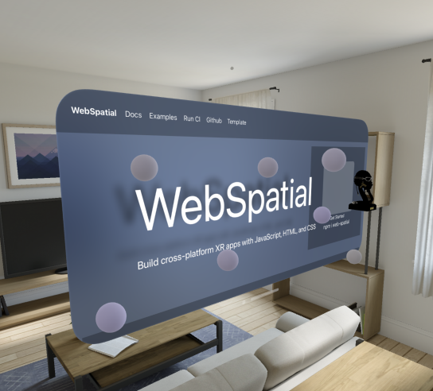

# Web Spatial

#### Spatial 3D library for the web

An easy-to-use library that allows developers to create content for XR Platforms using standard web technology (eg. html/css/js) that can be extended by good integration with popular libraries like ReactJS, BabylonJS, ThreeJS, etc.

### Contribute/Build locally

###### Get dependencies
 - [NodeJS](https://nodejs.org/en/download/package-manager) to run local test website
 - [XCode >= 15.4](https://apps.apple.com/us/app/xcode/id497799835?mt=12) (If building for VisionOS)

###### We use pnpm for development (instead of yarn or npm)
npm install pnpm -g
pnpm setup

###### Install packages and link to workspace for local development
npm run setup

###### Watch npm libraries and launch test web server
npm run dev