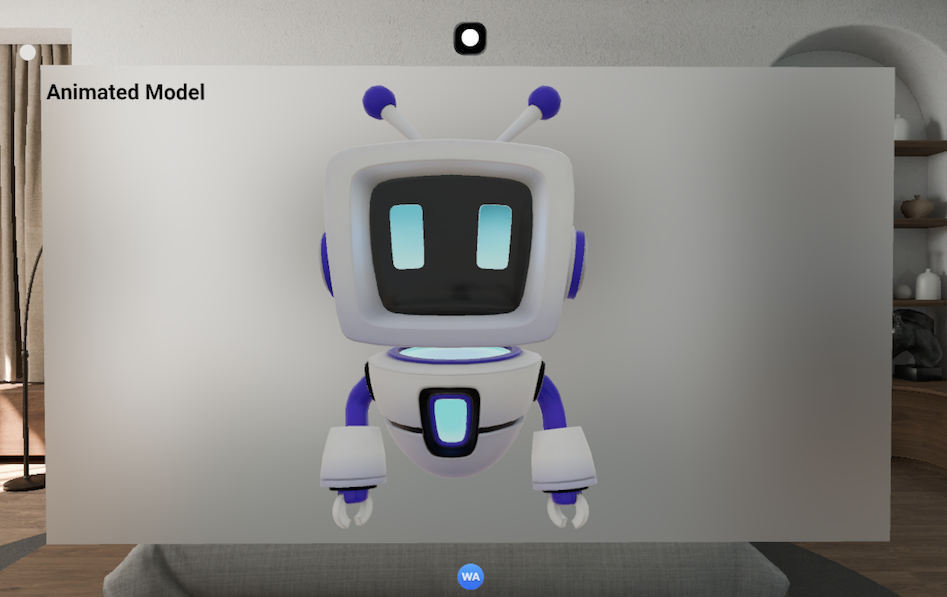

# Model

## Overview

The `<Model>`component handles loading 3D assets, managing playback of embedded animations, and responding to spatial user interactions.

## Try it

<p align="center"></p>

```jsx
function Example() {
  const style = { height: '200px', '--xr-depth': '100px' }
  return (
    <Model enable-xr autoPlay loop style={style}>
      <source src="/model/robot.glb" type="model/gltf-binary" />
      <source src="/model/robot.usdz" type="model/vnd.usdz+zip" />
      
    </Model>
  )
}
```

## Attributes

Like standard HTML elements, the `<Model>` component supports a range of attributes (passed as React props) to control its behavior.

`src` The URL of the 3D model to embed. This attribute has the highest priority when multiple sources are provided. If `src` is specified, it will be the first source attempted for loading.

`poster` A URL for an image to be shown while the 3D model is downloading or if it fails to load. If this attribute is not specified, a default loading spinner will be displayed

`loading` Specifies how the model should be loaded.

- `eager` (default): The model begins loading immediately.
- `lazy` The model loading is deferred until it enters the webview's viewport. This is handled natively to ensure accurate intersection detection and optimal performance.

`autoPlay` A Boolean attribute; if `true`, the model's first available animation will automatically begin to play as soon as the model has successfully loaded.

`loop` A Boolean attribute; if `true`, the animation will automatically seek back to the start upon reaching the end.

`stagemode` Controls the built-in user interaction mode for the model.

- **none** (default): No built-in interaction is enabled. All interactions must be handled via spatial events.
- `orbit` Input events in a horizontal direction result in a rotation of the model about the Y axis, and events in a vertical direction result in a rotation about the horizontal axis. When in orbit mode entityTransform becomes read-only.

## Events

The `<Model>` component fires several events to allow developers to monitor its state and respond to user interactions. These are exposed as `on...` props.

`onLoad` Fired when the 3D model has successfully loaded and is ready for display and interaction. If multiple sources are provided, this event fires only for the first source that loads successfully.

`onError` Fired when the model fails to load. If multiple sources are provided, this event is fired only after **all** sources have been attempted and have failed. It does not fire each individual source failure.

`onSpatialTap` Fired when a user performs a tap gesture on the model in the spatial environment.

`onSpatialDragStart` Fired when a user begins a drag gesture on the model.

`onSpatialDrag` Fired continuously as the user drags the model.

`onSpatialDragEnd` Fired when the user releases the drag gesture.

`onSpatialRotate` Fired when a user performs a rotation gesture on the model.

`onSpatialRotateEnd` Fired when the user completes the rotation gesture.

`onSpatialMagnify` Fired when a user performs a magnification (pinch) gesture to scale the model.

`onSpatialMagnifyEnd` Fired when the user completes the magnification gesture.

## JavaScript API

In addition to the DOM API relating to the source, animation, and environment map, the JavaScript API has additional capabilities relating to the animation timing and view parameters.

`currentSrc` read-only string returning the URL to the loaded resource.

`ready` Resolved when the model's source file has been loaded and processed. The Promise is rejected if the source file is unable to be fetched, or if the file cannot be interpreted as a valid 3D model asset.

`entityTransform` a read-write `DOMMatrixReadOnly` that expresses the current mapping of the view of the model contents to the view displayed in the browser.

`boundingBoxCenter` a read-only `DOMPoint` that indicates the center of the axis-aligned bounding box (AABB) of the model contents. If there is an animation present, the bounding box is computed based on the bind pose of the animation and remains static for the lifetime of the model. It does not update based on a change of the `entityTransform`.

`boundingBoxExtents` a read-only `DOMPoint` that indicates the extents of the bounding box of the model contents.

`duration` a read-only `double` reflecting the un-scaled total duration of the animation in seconds. If there is no animation on this model, the value is 0.

`currentTime` a read-write `double` reflecting the un-scaled playback time of the model animation in seconds. It is clamped to the duration of the animation, so for an animation with no animation, the value is always 0.

`playbackRate` a read-write `double` reflecting the time scaling for animations, if present. For example, a model with a ten-second animation and a `playbackRate` of 0.5 will take 20 seconds to complete.

`paused` A read-only `Boolean` value indicating whether the element has an animation that is currently playing.

`play()` A method that attempts to play a model's animation, if present. It returns a `Promise` that resolves when playback has been successfully started.

`pause()` A method that attempts to pause the playback of a model's animation. If the model is already paused this method will have no effect.

## `<source>` Model source element

The <source> HTML element specifies one or more media resources for the <Model> element. It is a void element, which means that it has no content and does not require a closing tag. Browsers don't all support the same 3D model formats; you can provide multiple sources and the browser will then use the first one it understands. The browser attempts to load each source sequentially, if a source fails the next source is attempted. An `error` event fires on the `<Model>` element after all sources have failed; `error` events are not fired on each individual `<source>` element.

`src` The URL of the 3D model. This attribute has the highest priority when multiple sources are provided. If `src` is specified, it will be the first source attempted for loading.

`type` Specifies the MIME media type of the Model. Currently supported [MIME model types](https://www.iana.org/assignments/media-types/media-types.xhtml#model) are `model/vnd.usdz+zip` and `model/gltf-binary`.

## Usage Notes

- **Orbit Interaction**: Setting `stagemode` to `orbit` enables an **_orbit_** interaction mode built on the `manipulable` modifier (rotation only). The model is rotated by user drag, and `entityTransform` is updated from native to reflect the current orientation

## Examples

### Single `src`

A basic model embed using the `src` attribute.

```jsx
import { Model } from '@webspatial/react-sdk'

function MyScene() {
  return <Model src="/modelasset/Duck.glb" enable-xr />
}
```

### Multiple `<source>` elements

Providing both USDZ and GLB formats for cross-platform compatibility.

```jsx
import { Model } from '@webspatial/react-sdk'

function MyScene() {
  return (
    <Model enable-xr>
      <source src="/modelasset/vehicle.usdz" type="model/vnd.usdz+zip" />
      <source src="/modelasset/vehicle.glb" type="model/gltf-binary" />
    </Model>
  )
}
```

### Using a `poster` image

Display a poster while the model is loading.

```jsx
import { Model } from '@webspatial/react-sdk'

function MyScene() {
  return (
    <Model
      src="/MaterialsVariantsShoe.glb"
      poster="/shoe-poster.png"
      enable-xr
    />
  )
}
```

### Autoplay and loop

Automatically play a model's animation in a loop.

```jsx
import { Model } from '@webspatial/react-sdk'

function AnimatedModel() {
  return <Model src="/animated-robot.glb" autoPlay loop enable-xr />
}
```

### Orbit interaction mode

Enable built-in drag-to-rotate functionality.

```jsx
import { Model } from '@webspatial/react-sdk'

function OrbitingDuck() {
  return <Model src="/modelasset/Duck.glb" stagemode="orbit" enable-xr />
}
```

### Lazy loading a model

Defer loading until the model is scrolled into view.

```jsx
import { Model } from '@webspatial/react-sdk'

function LongScrollPage() {
  return (
    <>
      {/* ... a lot of content ... */}
      <Model loading="lazy" src="/modelasset/cone.glb" enable-xr />
    </>
  )
}
```

## Technical Summary

|                      |                                                                                                                                                                                                                                                           |
| -------------------- | --------------------------------------------------------------------------------------------------------------------------------------------------------------------------------------------------------------------------------------------------------- |
| Permitted content    | If the element has a `src` attribute: zero or more elements (for future compatibility), followed by transparent content that contains no media elements. Else: zero or more elements, followed by zero or more elements, followed by transparent content. |
| Permitted parents    | Any element that accepts embedded content.                                                                                                                                                                                                                |
| Tag omission         | The start tag is required. The end tag can be omitted if there are no child elements                                                                                                                                                                      |
| Implicit ARIA role   | `none`                                                                                                                                                                                                                                                    |
| Permitted ARIA roles | `application`                                                                                                                                                                                                                                             |
| DOM interface        | The React `ref` provides an interface compliant with `SpatializedStatic3DElementRef`, which extends `HTMLDivElement` and adds properties like `currentSrc`, `ready`, and `entityTransform`.                                                               |

## Browser Compatibility

### HTML

| Property   | visionOS           | Pico OS                         | WebSpatial SDK |
| ---------- | ------------------ | ------------------------------- | -------------- |
| model      | ✓<br>26            | ❌                              | ✓<br>1.1       |
| enable-xr  | ✓<br>26            | ✓<br>6 ⍺2.0                     | ✓<br>1.1       |
| src        | ✓ (USD/USDZ)<br>26 | ✓ (USD/USDZ/GLB/GLTF)<br>6 ⍺2.0 | ✓<br>1.1       |
| onLoad     | ✓<br>26            | ✓<br>6 ⍺2.0                     | ✓<br>1.1       |
| onError    | ✓<br>26            | ✓<br>6 ⍺2.0                     | ✓<br>1.1       |
| autoPlay   | ✓<br>26            | ✓<br>6 ⍺2.1                     | ✓<br>1.6       |
| loop       | ✓<br>26            | ✓<br>6 ⍺2.1                     | ✓<br>1.6       |
| `<source>` | ✓ (USD/USDZ)<br>26 | ✓ (USD/USDZ/GLB/GLTF)<br>6 ⍺2.1 | ✓<br>1.6       |
| poster     | ✓<br>26            | ✓<br>6 β2.0                     | ✓<br>1.7       |
| loading    | ✓<br>26            | ✓<br>6 β2.1                     | ✓<br>1.7       |
| stagemode  | 26                 | 6                               | September      |

### CSS

| Style                                                      | visionOS | Pico OS     | WebSpatial SDK |
| ---------------------------------------------------------- | -------- | ----------- | -------------- |
| --xr-depth                                                 | ✓<br>26  | ✓<br>6 ⍺2.0 | ✓<br>1.1       |
| --xr-back                                                  | ✓<br>26  | ✓<br>6 ⍺2.0 | ✓<br>1.1       |
| width                                                      | ✓<br>26  | ✓<br>6 ⍺2.0 | ✓<br>1.1       |
| height                                                     | ✓<br>26  | ✓<br>6 ⍺2.0 | ✓<br>1.1       |
| translate, translateX, translateY, translateZ, translate3d | ✓<br>26  | ✓<br>6 ⍺2.0 | ✓<br>1.1       |
| rotate, rotateX, rotateY, rotateZ, rotate3d                | ✓<br>26  | ✓<br>6 ⍺2.0 | ✓<br>1.1       |
| scale, scaleX, scaleY, scaleZ, scale3d                     | ✓<br>26  | ✓<br>6 ⍺2.0 | ✓<br>1.1       |

### Javascript

| Style              | visionOS | Pico OS     | WebSpatial SDK |
| ------------------ | -------- | ----------- | -------------- |
| entityTransform    | ✓<br>26  | ✓<br>6 ⍺2.0 | ✓<br>1.2       |
| currentSrc         | ✓<br>26  | ✓<br>6 ⍺2.0 | ✓<br>1.2       |
| ready              | ✓<br>26  | ✓<br>6 ⍺2.0 | ✓<br>1.2       |
| duration           | ✓<br>26  | ✓<br>6 ⍺2.1 | ✓<br>1.6       |
| playbackRate       | ✓<br>26  | ✓<br>6 ⍺2.1 | ✓<br>1.6       |
| paused             | ✓<br>26  | ✓<br>6 ⍺2.1 | ✓<br>1.6       |
| play()             | ✓<br>26  | ✓<br>6 ⍺2.1 | ✓<br>1.6       |
| pause()            | ✓<br>26  | ✓<br>6 ⍺2.1 | ✓<br>1.6       |
| currentTime        | ✓<br>26  | ✓<br>6 β2.0 | ✓<br>1.7       |
| boundingBoxCenter  |          |             |                |
| boundingBoxExtents |          |             |                |

## Feature Implementation Details

### 5. Native Orbit Interaction (`stagemode="orbit"`)

This feature provides a built-in, intuitive way for users to inspect a 3D model from different angles using familiar drag gestures, without requiring developers to write complex gesture-handling code.

#### 5.1. React SDK (`@webspatial/react-sdk`)

- **New Prop**: The `ModelProps` type will be extended to accept `stagemode?: 'orbit' | 'none'`. The default will be `'none'`.

#### 5.2. Core SDK (`@webspatial/core-sdk`)

- **New Property**: The `UpdateSpatializedStatic3DElementProperties` command in `JSBCommand.ts` will be extended to include the `stagemode` string. This property will be sent to the native layer.

#### 5.3. Native visionOS Layer (`packages/visionOS`)

1. In `SpatializedStatic3DView.swift`, we check the `stagemode` property on the `SpatializedStatic3DElement`.
2. If `stagemode` is `"orbit"`, we attach the `manipulable` modifier to the `Model3D` view, restricting supported operations to rotation only (e.g. `.manipulable(operations: .rotation)`). This provides built-in drag-to-rotate handling without a hand-rolled `DragGesture`.
3. The modifier's change callback reads the manipulated transform and converts it to the model-transform representation used by `entityTransform`.

- **Interaction with entityTransform**: While in orbit mode, `entityTransform` is updated from the native side to reflect the user's manipulation, and these updates are pushed back to the web layer so reads reflect the live orientation. JS writes to `entityTransform` do not drive the model while orbit is active.

- **Pushing entityTransform updates to JS**: Native syncs the transform using the existing web-message pattern:
  - Native emits a new `sendWebMsg` event (e.g. `EntityTransformChangeEvent`) carrying the updated matrix as its detail.
  - The Core SDK adds a matching `SpatialWebMsgType` member (e.g. `entitytransformchange`) and `…Msg`/`…Detail` interface in `WebMsgCommand.ts` (with the Swift counterpart).
  - `SpatializedStatic3DElement.onReceiveEvent` handles the new type, updates the cached model transform, and the container's `entityTransform` getter returns the manipulated value.

## Risks

- **Gesture Conflicts**: Our proposed solution of disabling drag listeners when orbit is present is a safe starting point.
- **Safari Alignment**: Since the `<model>` element is still an evolving standard, our implementation is a best-effort interpretation. We must be prepared to adapt as the standard solidifies.

## References

- [A step into the spatial web: The HTML model element in Apple Vision Pro](https://webkit.org/blog/17118/a-step-into-the-spatial-web-the-html-model-element-in-apple-vision-pro/)
- [model-element/explainer.md at main · immersive-web/model-element](https://github.com/immersive-web/model-element/blob/main/explainer.md#stage-interaction-mode)
- [The `<model>` element](https://immersive-web.github.io/model-element/)
