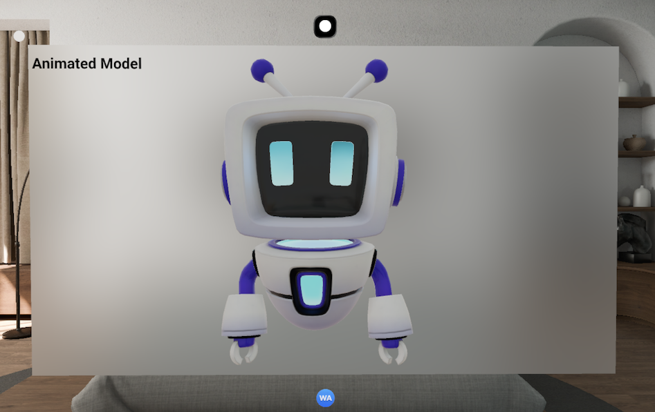

# Model

## Overview

The `<Model>`component handles loading 3D assets, managing playback of embedded animations, and responding to spatial user interactions.

## Try it

<p align="center"></p>

```jsx
function Example() {
  const style = { height: '200px', '--xr-depth': '100px' }
  return (
    <Model enable-xr autoPlay loop style={style}>
      <source src="/model/robot.glb" type="model/gltf-binary" />
      <source src="/model/robot.usdz" type="model/vnd.usdz+zip" />
      
    </Model>
  )
}
```

## Attributes

Like standard HTML elements, the `<Model>` component supports a range of attributes (passed as React props) to control its behavior.

`src` The URL of the 3D model to embed. This attribute has the highest priority when multiple sources are provided. If `src` is specified, it will be the first source attempted for loading.

`poster` A URL for an image to be shown while the 3D model is downloading or if it fails to load. If this attribute is not specified, a default loading spinner will be displayed

`loading` Specifies how the model should be loaded.

- `eager` (default): The model begins loading immediately.
- `lazy` The model loading is deferred until it enters the webview's viewport. This is handled natively to ensure accurate intersection detection and optimal performance.

`autoPlay` A Boolean attribute; if `true`, the model's first available animation will automatically begin to play as soon as the model has successfully loaded.

`loop` A Boolean attribute; if `true`, the animation will automatically seek back to the start upon reaching the end.

`stagemode` Controls the built-in user interaction mode for the model.

- **none** (default): No built-in interaction is enabled. All interactions must be handled via spatial events.
- `orbit` Enables a native orbit interaction mode. Allows users to rotate the model by dragging. When in orbit mode `entityTransform` becomes read-only and all spatial gesture handlers `onSpatial*` are disabled

## Events

The `<Model>` component fires several events to allow developers to monitor its state and respond to user interactions. These are exposed as `on...` props.

`onLoad` Fired when the 3D model has successfully loaded and is ready for display and interaction. If multiple sources are provided, this event fires only for the first source that loads successfully.

`onError` Fired when the model fails to load. If multiple sources are provided, this event is fired only after **all** sources have been attempted and have failed. It does not fire each individual source failure.

`onSpatialTap` Fired when a user performs a tap gesture on the model in the spatial environment.

`onSpatialDragStart` Fired when a user begins a drag gesture on the model.

`onSpatialDrag` Fired continuously as the user drags the model.

`onSpatialDragEnd` Fired when the user releases the drag gesture.

`onSpatialRotate` Fired when a user performs a rotation gesture on the model.

`onSpatialRotateEnd` Fired when the user completes the rotation gesture.

`onSpatialMagnify` Fired when a user performs a magnification (pinch) gesture to scale the model.

`onSpatialMagnifyEnd` Fired when the user completes the magnification gesture.

## JavaScript API

In addition to the DOM API relating to the source, animation, and environment map, the JavaScript API has additional capabilities relating to the animation timing and view parameters.

`currentSrc` read-only string returning the URL to the loaded resource.

`ready` Resolved when the model's source file has been loaded and processed. The Promise is rejected if the source file is unable to be fetched, or if the file cannot be interpreted as a valid 3D model asset.

`entityTransform` a read-write `DOMMatrixReadOnly` that expresses the current mapping of the view of the model contents to the view displayed in the browser.

`boundingBoxCenter` a read-only `DOMPointReadOnly` that indicates the center of the axis-aligned bounding box (AABB) of the model contents. If there is an animation present, the bounding box is computed based on the bind pose of the animation and remains static for the lifetime of the model. It does not update based on a change of the `entityTransform`.

`boundingBoxExtents` a read-only `DOMPointReadOnly` that indicates the extents of the axis-aligned bounding box of the model contents. Like `boundingBoxCenter`, it is computed once when the model loads and remains static for the lifetime of the model.

`duration` a read-only `double` reflecting the un-scaled total duration of the animation in seconds. If there is no animation on this model, the value is 0.

`currentTime` a read-write `double` reflecting the un-scaled playback time of the model animation in seconds. It is clamped to the duration of the animation, so for an animation with no animation, the value is always 0.

`playbackRate` a read-write `double` reflecting the time scaling for animations, if present. For example, a model with a ten-second animation and a `playbackRate` of 0.5 will take 20 seconds to complete.

`paused` A read-only `Boolean` value indicating whether the element has an animation that is currently playing.

`play()` A method that attempts to play a model's animation, if present. It returns a `Promise` that resolves when playback has been successfully started.

`pause()` A method that attempts to pause the playback of a model's animation. If the model is already paused this method will have no effect.

## `<source>` Model source element

The <source> HTML element specifies one or more media resources for the <Model> element. It is a void element, which means that it has no content and does not require a closing tag. Browsers don't all support the same 3D model formats; you can provide multiple sources and the browser will then use the first one it understands. The browser attempts to load each source sequentially, if a source fails the next source is attempted. An `error` event fires on the `<Model>` element after all sources have failed; `error` events are not fired on each individual `<source>` element.

`src` The URL of the 3D model.

`type` Specifies the MIME media type of the Model. Currently supported [MIME model types](https://www.iana.org/assignments/media-types/media-types.xhtml#model) are `model/vnd.usdz+zip` and `model/gltf-binary`.

## Usage Notes

- **Orbit Interaction Conflicts**: Setting the `stagemode` attribute to `orbit` results in an **_orbit_** interaction mode, where the `entityTransform` becomes read-only, and the view is updated exclusively based on input events from the user. Spatial gesture handlers `onSpatial*` are disabled

## Examples

### Single `src`

A basic model embed using the `src` attribute.

```jsx
import { Model } from '@webspatial/react-sdk'

function MyScene() {
  return <Model src="/modelasset/Duck.glb" enable-xr />
}
```

### Multiple `<source>` elements

Providing both USDZ and GLB formats for cross-platform compatibility.

```jsx
import { Model } from '@webspatial/react-sdk'

function MyScene() {
  return (
    <Model enable-xr>
      <source src="/modelasset/vehicle.usdz" type="model/vnd.usdz+zip" />
      <source src="/modelasset/vehicle.glb" type="model/gltf-binary" />
    </Model>
  )
}
```

### Using a `poster` image

Display a poster while the model is loading.

```jsx
import { Model } from '@webspatial/react-sdk'

function MyScene() {
  return (
    <Model
      src="/MaterialsVariantsShoe.glb"
      poster="/shoe-poster.png"
      enable-xr
    />
  )
}
```

### Autoplay and loop

Automatically play a model's animation in a loop.

```jsx
import { Model } from '@webspatial/react-sdk'

function AnimatedModel() {
  return <Model src="/animated-robot.glb" autoPlay loop enable-xr />
}
```

### Orbit interaction mode

Enable built-in drag-to-rotate functionality.

```jsx
import { Model } from '@webspatial/react-sdk'

function OrbitingDuck() {
  return <Model src="/modelasset/Duck.glb" stagemode="orbit" enable-xr />
}
```

### Lazy loading a model

Defer loading until the model is scrolled into view.

```jsx
import { Model } from '@webspatial/react-sdk'

function LongScrollPage() {
  return (
    <>
      {/* ... a lot of content ... */}
      <Model loading="lazy" src="/modelasset/cone.glb" enable-xr />
    </>
  )
}
```

## Technical Summary

|                      |                                                                                                                                                                                                                                                           |
| -------------------- | --------------------------------------------------------------------------------------------------------------------------------------------------------------------------------------------------------------------------------------------------------- |
| Permitted content    | If the element has a `src` attribute: zero or more elements (for future compatibility), followed by transparent content that contains no media elements. Else: zero or more elements, followed by zero or more elements, followed by transparent content. |
| Permitted parents    | Any element that accepts embedded content.                                                                                                                                                                                                                |
| Tag omission         | The start tag is required. The end tag can be omitted if there are no child elements                                                                                                                                                                      |
| Implicit ARIA role   | `none`                                                                                                                                                                                                                                                    |
| Permitted ARIA roles | `application`                                                                                                                                                                                                                                             |
| DOM interface        | The React `ref` provides an interface compliant with `SpatializedStatic3DElementRef`, which extends `HTMLDivElement` and adds properties like `currentSrc`, `ready`, and `entityTransform`.                                                               |

## Browser Compatibility

### HTML

| Property   | visionOS       | Pico OS                | WebSpatial SDK |
| ---------- | -------------- | ---------------------- | -------------- |
| model      | ✓<br>26        | ❌                     | ✓<br>1.1       |
| enable-xr  | ✓<br>26        | ✓<br>6 ⍺2.0            | ✓<br>1.1       |
| src        | ✓ (USDZ)<br>26 | ✓ (USDZ/GLB)<br>6 ⍺2.0 | ✓<br>1.1       |
| onLoad     | ✓<br>26        | ✓<br>6 ⍺2.0            | ✓<br>1.1       |
| onError    | ✓<br>26        | ✓<br>6 ⍺2.0            | ✓<br>1.1       |
| autoPlay   | ✓<br>26        | ✓<br>6 ⍺2.1            | ✓<br>1.6       |
| loop       | ✓<br>26        | ✓<br>6 ⍺2.1            | ✓<br>1.6       |
| `<source>` | ✓ (USDZ)<br>26 | ✓ (USDZ/GLB)<br>6 ⍺2.1 | ✓<br>1.6       |
| poster     | ✓<br>26        | ✓<br>6 β2.0            | ✓<br>1.7       |
| loading    | ✓<br>26        | ✓<br>6 β2.1            | ✓<br>1.7       |
| stagemode  | 26             | 6.1                    | July           |

### CSS

| Style                                                      | visionOS | Pico OS     | WebSpatial SDK |
| ---------------------------------------------------------- | -------- | ----------- | -------------- |
| --xr-depth                                                 | ✓<br>26  | ✓<br>6 ⍺2.0 | ✓<br>1.1       |
| --xr-back                                                  | ✓<br>26  | ✓<br>6 ⍺2.0 | ✓<br>1.1       |
| width                                                      | ✓<br>26  | ✓<br>6 ⍺2.0 | ✓<br>1.1       |
| height                                                     | ✓<br>26  | ✓<br>6 ⍺2.0 | ✓<br>1.1       |
| translate, translateX, translateY, translateZ, translate3d | ✓<br>26  | ✓<br>6 ⍺2.0 | ✓<br>1.1       |
| rotate, rotateX, rotateY, rotateZ, rotate3d                | ✓<br>26  | ✓<br>6 ⍺2.0 | ✓<br>1.1       |
| scale, scaleX, scaleY, scaleZ, scale3d                     | ✓<br>26  | ✓<br>6 ⍺2.0 | ✓<br>1.1       |

### Javascript

| Style              | visionOS | Pico OS     | WebSpatial SDK |
| ------------------ | -------- | ----------- | -------------- |
| entityTransform    | ✓<br>26  | ✓<br>6 ⍺2.0 | ✓<br>1.2       |
| currentSrc         | ✓<br>26  | ✓<br>6 ⍺2.0 | ✓<br>1.2       |
| ready              | ✓<br>26  | ✓<br>6 ⍺2.0 | ✓<br>1.2       |
| duration           | ✓<br>26  | ✓<br>6 ⍺2.1 | ✓<br>1.6       |
| playbackRate       | ✓<br>26  | ✓<br>6 ⍺2.1 | ✓<br>1.6       |
| paused             | ✓<br>26  | ✓<br>6 ⍺2.1 | ✓<br>1.6       |
| play()             | ✓<br>26  | ✓<br>6 ⍺2.1 | ✓<br>1.6       |
| pause()            | ✓<br>26  | ✓<br>6 ⍺2.1 | ✓<br>1.6       |
| currentTime        | ✓<br>26  | ✓<br>6 β2.0 | ✓<br>1.7       |
| boundingBoxCenter  | 26       | 6.2         | August         |
| boundingBoxExtents | 26       | 6.2         | August         |

## Feature Implementation Details

### 5. Native Orbit Interaction (`stagemode="orbit"`)

This feature provides a built-in, intuitive way for users to inspect a 3D model from different angles using familiar drag gestures, without requiring developers to write complex gesture-handling code.

#### 5.1. React SDK (`@webspatial/react-sdk`)

- **New Prop**: The `ModelProps` type will be extended to accept `stagemode?: 'orbit' | 'none'`. The default will be `'none'`.

#### 5.2. Core SDK (`@webspatial/core-sdk`)

- **New Property**: The `UpdateSpatializedStatic3DElementProperties` command in `JSBCommand.ts` will be extended to include the `stagemode` string. This property will be sent to the native layer.

#### 5.3. Native visionOS Layer (`packages/visionOS`)

1. In `SpatializedStatic3DView.swift`, we will check for the `stagemode` property on the `SpatializedStatic3DElement`.
2. If `stagemode` is `"orbit"`, we will add a `DragGesture` to the view.
3. The `onChanged` handler for the `DragGesture` will be used to manipulate the model's orientation.
   - A horizontal drag (`event.translation.width`) will be mapped to a rotation around the model's Y-axis.
   - A vertical drag (`event.translation.height`) will be mapped to a rotation around the model's X-axis (pitch).
4. A state variable (e.g., `@State private var orbitRotation: Angle3D = .zero`) will be used to accumulate the rotation from the drag gesture. This rotation will be applied to the model using the `.rotation3DEffect()` modifier on the `Model3D` view.

- **Interaction with&nbsp;entityTransform**: `entityTransform` will not be updated when the model is rotated using the orbit gesture. Similarly updates to `entityTransform` will not affect the model's orientation.

- **Gesture Conflict Resolution**: `onSpatial*` will be disabled when stagemode is set to orbit. This restriction can be loosened in the future based if there are no gesture conflicts.

### 6. Bounding Box Geometry (`boundingBoxCenter` / `boundingBoxExtents`)

These read-only properties expose the axis-aligned bounding box (AABB) of the loaded model contents. Both are `DOMPointReadOnly` values expressed in the model's local right-handed, Y-up space. The box is computed once when the model loads — from the animation bind pose if the model is animated — and is **static for the lifetime of the model**. It is unaffected by `entityTransform` changes.

#### 6.1. Native visionOS Layer (`packages/visionOS`)

1. `Model3DAsset` does not expose its underlying entity, so the bounds are computed by **loading the same model file twice** as a RealityKit `Entity` (`try await Entity(contentsOf: localURL)`) and reading `entity.visualBounds(relativeTo: nil)` (`BoundingBox.center` and `.extents`). The view already resolves a local file URL during load.
2. Extend `ModelLoadSuccessDetail` in `WebMsgCommand.swift` with `boundingBoxCenter` and `boundingBoxExtents` (each `{ x, y, z }`), and populate them when constructing `ModelLoadSuccess`.

#### 6.2. Core SDK (`@webspatial/core-sdk`)

1. Extend the `ModelLoadSuccess.detail` interface in `WebMsgCommand.ts` with optional `boundingBoxCenter?: { x, y, z }` and `boundingBoxExtents?: { x, y, z }` (optional for back-compat with older native runtimes that do not send them).
2. In `SpatializedStatic3DElement.onReceiveEvent`, in the `modelloaded` branch, cache the two values into private fields as `DOMPointReadOnly` instances (mirroring how `_currentSrc` is cached).
3. Add read-only `boundingBoxCenter` / `boundingBoxExtents` getters (mirroring the `currentSrc` getter — no setter). Default to a zero `DOMPointReadOnly` before the model has loaded.

#### 6.3. React SDK (`@webspatial/react-sdk`)

1. Add `readonly boundingBoxCenter: DOMPointReadOnly` and `readonly boundingBoxExtents: DOMPointReadOnly` to `SpatializedStatic3DElementRef` in `spatialized-container/types.ts`.
2. Expose them as getters in `extraRefProps` in `SpatializedStatic3DElementContainer.tsx`, delegating to the core element getters (mirroring the existing `duration` getters).

### 7. `blob:` URL Support for `<Model>` Sources

`<Model>` should accept `blob:` URLs on `src` and child `<source>` elements. Today source URLs are sent to native as strings, and native downloads them — which cannot resolve `blob` URL since it's local to the WebView. So the bytes must be shipped from JS → native. The bridge is string-only, so we transfer chunked base64 into a native temp file; the existing local-file load path handles the rest. The blob URL is created via

```js
const resp = await fetch(src)
const blob = await resp.blob()
const blobURL = URL.createObjectURL(blob)
// "blob:https://webspatial-hackathon.vercel.app/ef1ac2cd-0f6a-4e1a-861a-dac5427e7c29"
```

#### Design

Blob URLs pass through the existing create/update flow unchanged. When native's source-fallback loop reaches a `blob:` source:

1. **Native → JS**: new WebMsg `modelblobrequest` `{ requestId, src }`. Native creates a unique, non-reused `requestId` for each source attempt, including reloads of the same `src`.
2. **JS** (pure transport — no format logic): `fetch(src)` → blob; read 8 MiB slices, base64-encode each, send via new JSB command `TransferModelBlobData` `{ requestId, src, data, type, size }`, awaiting each call's ack before sending the next. `requestId` is copied from `modelblobrequest` onto every chunk. `type`/`size` ride on every chunk (cheap next to an 8 MiB payload, and lets native resolve the extension from any chunk). The command extends `SpatializedElementCommand`, so the element `id` native routes on is supplied implicitly. A rejected ack aborts the loop. If the fetch fails (e.g. revoked blob) send `{ requestId, src, isError: true }` instead.
3. **Native**: routes each chunk to the element by `id`, then to that element's transfer by `requestId`; unknown, cancelled, or completed request IDs are rejected so chunks from an earlier same-URL load cannot enter a newer transfer. It appends each decoded chunk to a temp file via `FileHandle` (order is guaranteed by the sequential acks; end-of-stream is reached when the appended byte count hits `size`). It then resolves the file extension from the mime type provided by `<source type>`, falling back to blob `type` or falling back to USDZ as a last resort. Renames, and loads `Model3DAsset(url:)`, on success reports the original blob URL. On error, unsupported type, or timeout (1 s per chunk), it deletes the temp file and continues the fallback loop.

Sequential acks give natural backpressure: memory stays bounded to one in-flight chunk, with no full-model buffer anywhere. Temp files are deleted on error, element reload, and element destroy. No caching in v1: two elements sharing a blob URL transfer twice.

#### 7.1. Core SDK (`@webspatial/core-sdk`)

1. `WebMsgCommand.ts` — new `modelblobrequest` WebMsg type with detail `{ requestId, src }`, sent by native to request transfer of a blob source. `requestId` uniquely identifies this source attempt even when the same `src` is reloaded.
2. `JSBCommand.ts` — new `TransferModelBlobDataCommand`, extending `SpatializedElementCommand` (so the element `id` is injected implicitly), with payload `{ requestId, src, data?, type?, size?, isError? }`.
3. New `blob/blobTransfer.ts` — the JS half of the protocol: copy `requestId` from `modelblobrequest`, `fetch(src)` the blob, read it in 8 MiB slices, base64-encode each slice, and send it via `TransferModelBlobData`, awaiting each call's ack before sending the next. Every chunk carries `requestId`; `type`/`size` ride on every chunk so native can resolve the file extension from any chunk. A rejected ack aborts the loop; a fetch failure (e.g. a revoked blob) sends `{ requestId, src, isError: true }` instead. It takes only the element (a `SpatialObject`), request ID, and blob URL, so it stays component-agnostic and reusable by other components' blob transfers later.
4. `SpatializedStatic3DElement.ts` — handles `modelblobrequest` in `onReceiveEvent`, driving the transfer via `blobTransfer.ts`; stops pumping if the element is destroyed.
5. Sequential acks give natural backpressure — memory stays bounded to one in-flight chunk, with no full-model buffer anywhere on either side of the bridge.

#### 7.2. Native visionOS Layer (`packages/visionOS`)

1. `WebMsgCommand.swift` / `JSBCommand.swift` — mirror the new message and command.
2. New `model/blob/BlobTransfer.swift` — reassembles decoded chunks into a temp file via `FileHandle`, tracking the running byte count against `size` (end-of-stream is reached when the appended byte count hits `size`); resolves mime → extension (`<source type>` attr it already holds, falling back to the received `type`; `model/vnd.usdz+zip` → `usdz`, `model/gltf-binary` → `glb`, …) and renames on completion; enforces a 1 s per-chunk timeout. Component-agnostic — just a reassembly helper the element drives.
3. `model/SpatializedStatic3DElement.swift` — owns the JSB communication and transfer lifecycle: creates a unique `requestId` for each source attempt, sends it with `modelblobrequest`, feeds incoming `TransferModelBlobData` chunks to a `BlobTransfer` keyed by `requestId`, exposes an async fetch that returns the temp file URL, and handles cancel/abort. Cancelling a transfer removes its request ID so later chunks are rejected. Holds the temp file URLs and deletes them in `onDestroy` (temp files are also deleted on error and on element reload).
4. `model/SpatialScene.swift` — registers the `TransferModelBlobData` JSB listener and routes each chunk to the element by `id`; the element then resolves the transfer by `requestId`. Unknown or cancelled request IDs receive a failed ack, which aborts the stale JS stream.
5. `view/SpatializedStatic3DView.swift` — in the fallback loop, if `source.src` starts with `blob:`, awaits the element's fetch (passing the source's `type` attr), loads the returned temp file via `Model3DAsset(url:)`, and returns the original blob URL string so `currentSrc` report the blob URL rather than the temp file path.
6. No caching in v1 — two elements sharing the same blob URL transfer twice.

## Risks

- **Safari Alignment**: Since the `<model>` element is still an evolving standard, our implementation is a best-effort interpretation. We must be prepared to adapt as the standard solidifies.

## References

- [A step into the spatial web: The HTML model element in Apple Vision Pro](https://webkit.org/blog/17118/a-step-into-the-spatial-web-the-html-model-element-in-apple-vision-pro/)
- [model-element/explainer.md at main · immersive-web/model-element](https://github.com/immersive-web/model-element/blob/main/explainer.md#stage-interaction-mode)
- [The `<model>` element](https://immersive-web.github.io/model-element/)
