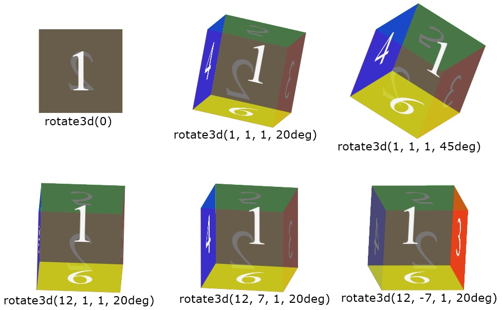

# Elevate 2D Elements

Basic concepts:
- [Spatialized Elements and 3D Container Elements](../../core-concepts/spatialized-elements-and-3d-container-elements.md)

---

> Because the [WebSpatial SDK](#) currently provides only the React SDK, all examples in this document use React.
>
> APIs referenced in this section:
> - `position: absolute`, `position: fixed`, `position: relative`
>   - `--xr-back`
> - `transform`
>   - `translateZ()`, `translate3d()`
>   - `rotateX()`, `rotateY()`, `rotate3d()`
>   - `scaleZ()`, `scale3d()`
> - `enable-xr-monitor`

When an HTML element has **spatialization enabled**, it still sits on the web page plane inside a [window scene](#), participating in the original HTML/CSS layout flow. Its X and Y positions and dimensions—determined by existing CSS properties and layout rules—remain unchanged.

On top of that baseline, a spatialized HTML element can use the [WebSpatial API](#) to move, transform, and lay itself out along the Z-axis in front of the page plane. This “elevation” brings the web content into 3-D space and gives the page visual depth.

Multiple APIs can achieve this elevation and can be grouped into three categories based on how they affect the layout flow.

## APIs that remove the element from the layout flow

### `position: absolute`

With absolute positioning, the element is positioned relative to the nearest ancestor **containing block** (an ancestor whose `position` value is not `static`, or one that has a `transform` property). If no such ancestor exists, it is positioned relative to the entire window.


Under CSS, four properties move (position) the element along the X and Y axes:

- `top`: moves downward along the Y-axis
- `bottom`: moves upward along the Y-axis
- `left`: moves rightward along the X-axis
- `right`: moves leftward along the X-axis


The WebSpatial API adds a new CSS property that positions the element along the Z-axis:

- `--xr-back`: moves (positions) forward along the Z-axis

`--xr-back` accepts **unit-less integers** that represent distances in native physical-space units (pt, where 1360 pt ≈ 1 meter).

In the current WebSpatial SDK, the value is interpreted relative to the **nearest ancestor spatialized element**. If none exists, it is relative to the **original web page plane**. Conceptually:

- If a spatialized element contains another absolutely positioned spatialized element (regardless of intermediate non-spatialized elements), the child’s initial Z position is the **plane of that ancestor**. Think of it as a "back surface" from which `--xr-back` moves forward.
- If an absolutely positioned spatialized element has no ancestral spatialized elements, its initial Z position is the **web page plane of the entire window scene**; that plane works as the “back surface.”

> In a future Web standard, a `back` property should behave like `top`/`bottom`/`left`/`right`, positioning relative to the nearest **containing block**. For forward compatibility, best practice today is to give the parent `position: relative` (if it is not already `absolute` or `fixed`) whenever a spatialized child should use that parent as its containing block for the Z-axis.

Example based on the [Quick Start](#):

```diff {highlight=12-16}
html.is-spatial {
  background-color: transparent;
- --xr-background-material: transparent;
+ --xr-background-material: translucent;

  .count-card {
    --xr-background-material: thick;
    position: relative;

    p {
      --xr-background-material: transparent;
      position: absolute;
      bottom: -10px;
      left: 0;
      right: 0;
      --xr-back: 20;
    }
  }
```

The `<p>` text is positioned on the Y-axis relative to its containing block `.count-card`, which is `relative`. On the Z-axis, `--xr-back` positions the `<p>` relative to the plane of `.count-card`, which is both a semi-transparent spatialized element and a containing block.


### `position: fixed`

With fixed positioning, the element is positioned against the **initial containing block** (effectively the page plane of the window scene) and does not scroll with the page.

Just like absolute positioning, spatialized elements may use the four CSS properties on X and Y and the WebSpatial `--xr-back` on Z. Here, the initial Z position is **always the web page plane of the window scene**.

Example from the [Techshop demo](#):

```css {highlight=5-14}
  .navbar {
    @apply mx-auto;
    --xr-background-material: translucent;
    width: 1000px;
    position: fixed;
    top: 0;
    left: 0;
    right: 0;
    --xr-back: 50;
    border-radius: 50px;
  }

  .list-meun {
    position: fixed;
    top: 200px;
    left: 0;
```

The top bar and side bar are fixed; the product list remains in the page flow. Shrinking the window with the drag handle clips the list, which scrolls, while the bars stay in place.


Clicking “View Details” opens a new product-detail window scene:

```css {highlight=5-9}
  .product-detail-info {
    --xr-background-material: translucent;
    border-radius: 50px;
    padding: 50px;
    position: fixed;
    top: 0;
    right: 0;
    bottom: 0;
    --xr-back: 20;
    margin: auto;
    width: 400px;
}
```

While the page scrolls, the left product image scrolls too, but the right info panel remains fixed.


## APIs that do not affect the layout flow

The element remains in the flow, keeping its original space and dimensions.

### Change only the position: `position: relative`

With relative positioning, the element can move along X and Y using the four CSS properties.


It can also move along Z with `--xr-back`. The initial Z position is **the plane where the element originally sits**, which works as the “back surface.”

Example based on the [Quick Start](#):

```diff {highlight=10-11}
html.is-spatial {
  background-color: transparent;
- --xr-background-material: transparent;
+ --xr-background-material: translucent;

  .link-card {
-   --xr-background-material: translucent;
+   --xr-background-material: thin;
    border-radius: 20px;
    position: relative;
    --xr-back: 50;
    top: 20px;
-   transform-origin: top left;
-   transform: translateZ(30px) rotateX(30deg);
```

The `.link-card` is below `.count-card` in the original flow. In relative mode, `--xr-back` moves it 50 units forward along Z while leaving its X/Y position untouched.


Another example from the [Quick Start](#):

```css
  .count-card {
    --xr-background-material: thick;
    position: relative;
    --xr-back: 50;

    p {
      --xr-background-material: transparent;
      position: absolute;
      bottom: -10px;
      left: 0;
      right: 0;
      --xr-back: 20;
    }
  }
```

`.count-card` moves 50 units forward in Z with relative positioning. Inside it, an absolutely positioned `<p>` moves an additional 20 units forward relative to the `.count-card` plane.


### Change position and shape: CSS Transform

CSS Transform leaves the element’s original position, size, and layout relations intact, modifying only the rendered image via a matrix.

Standard CSS already allows transforms along all three axes, but depth effects are projected onto the 2-D page. With WebSpatial, spatialized elements using transforms actually occupy 3-D space.

|  |  |
|:---:|:---:|

The X/Y/Z origin is **always the plane where the element originally sits**. `transform-origin` can shift the origin in X and Y, but never in Z.

Spatialized elements treat that plane as the “back surface,” letting the transformed image extend into the space in front.


`transform: perspective()` becomes unnecessary for spatialized elements because projection is handled natively.

Transforms that affect the Z-axis and are supported on spatialized elements:

- `translateZ()`, `translate3d()`: displacement. Similar to `--xr-back`, originating from the back surface. Units stay the same as before.
- `rotateX()`, `rotateY()`, `rotate3d()`: rotation. Rotating around X or Y pushes parts of the element into 3-D space.
- `scaleZ()`, `scale3d()`: scaling along Z.

> [!WARNING]
> `skew` is not supported.

Example based on the [Quick Start](#):

```diff  {highlight=10-14}
html.is-spatial {
  background-color: transparent;
- --xr-background-material: transparent;
+ --xr-background-material: translucent;

  .link-card {
-   --xr-background-material: translucent;
    --xr-background-material: thin;
    border-radius: 20px;
    position: relative;
    --xr-back: 50;
    top: 20px;
    transform-origin: top left;
    transform: translateZ(30px) rotateX(30deg);
```

`.link-card` first moves 50 units forward via `--xr-back`, then applies a transform: it moves another 30 px forward (automatically converted to pt) and rotates 30 degrees outward around its top edge.


A [Techshop demo](#) example:

```css
  .list-meun {
    position: fixed;
    top: 200px;
    left: 0;
    transform-origin: top left;
    transform: translateZ(320px) rotateY(80deg);
  }
```

The side menu is fixed at the far left, then transformed: it moves 320 px forward on Z (converted to pt) and rotates 80 degrees inward around its left edge.


## APIs based on the layout flow

These APIs change the parent’s layout flow so that children are laid out from back to front along the Z-axis, assigning Z positions through layout relationships.

They are **not yet supported** in the current WebSpatial SDK.

## Dynamic changes to the layout flow

As noted at the start, once an element is spatialized it still lives in the original layout flow. Updates in React may dynamically change CSS and layout, altering a spatialized element’s X/Y position or size—whether or not the element is elevated.

[WebSpatial SDK](#) automatically detects style changes on the spatialized element itself.

However, if changes in **parent** layout move or resize the spatialized element, the SDK does not auto-detect those changes yet (for performance reasons).

To handle this, the SDK provides a temporary marker, `enable-xr-monitor`. Add it to a parent to activate auto-detection. If the parent’s styles or internal layout change, WebSpatial will update its spatialized children’s X/Y positions and sizes accordingly.

Example:

```diff
function CardList() {
  const [showFirstCard, setShowFirstCard] = useState(true);

  const onClick = () => {
    setShowFirstCard(prevState => !prevState);
  };

  return (
    <div
+     enable-xr-monitor
    >
      {showFirstCard && <div>first card</div>}
      <div
+       enable-xr
      >second card</div>
      <button onClick={onClick}>toggle</button>
    </div>
  );
}
```

If “first card” disappears, the spatialized “second card” automatically shifts upward along Y.

---

Next section: [Manage Multiple Scenes](manage-multiple-scenes.md)
