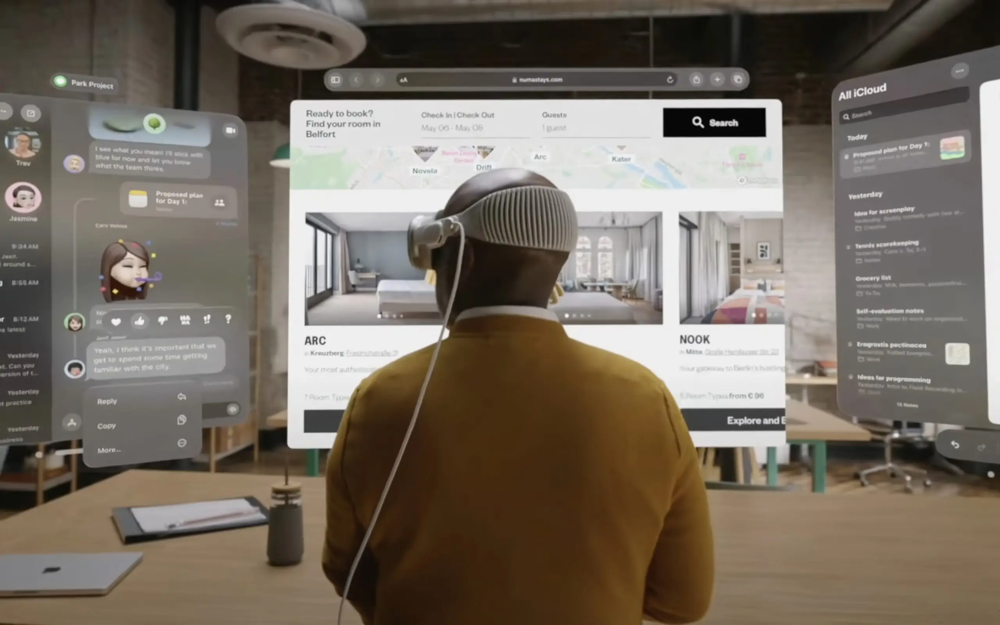
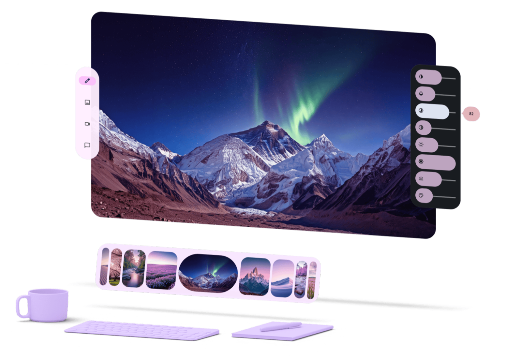
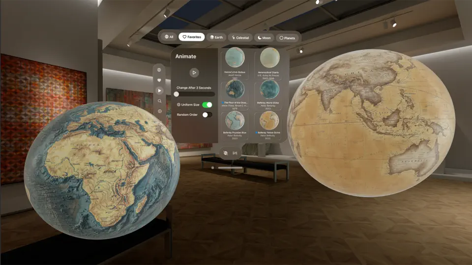
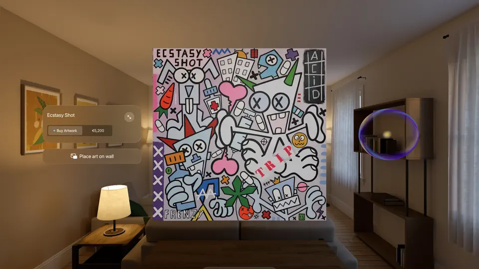
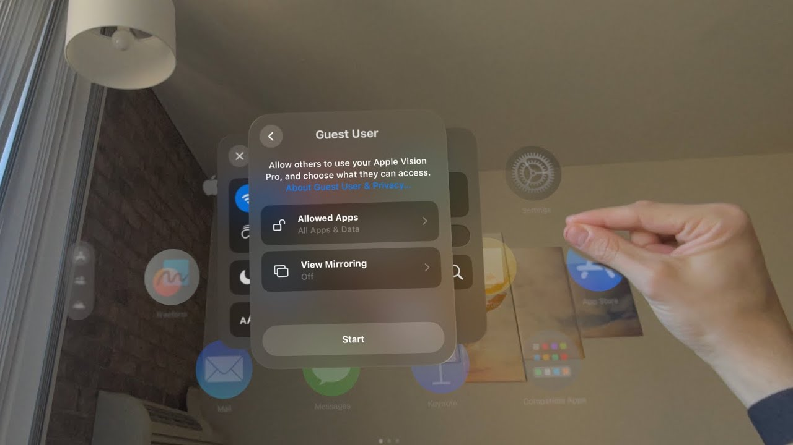
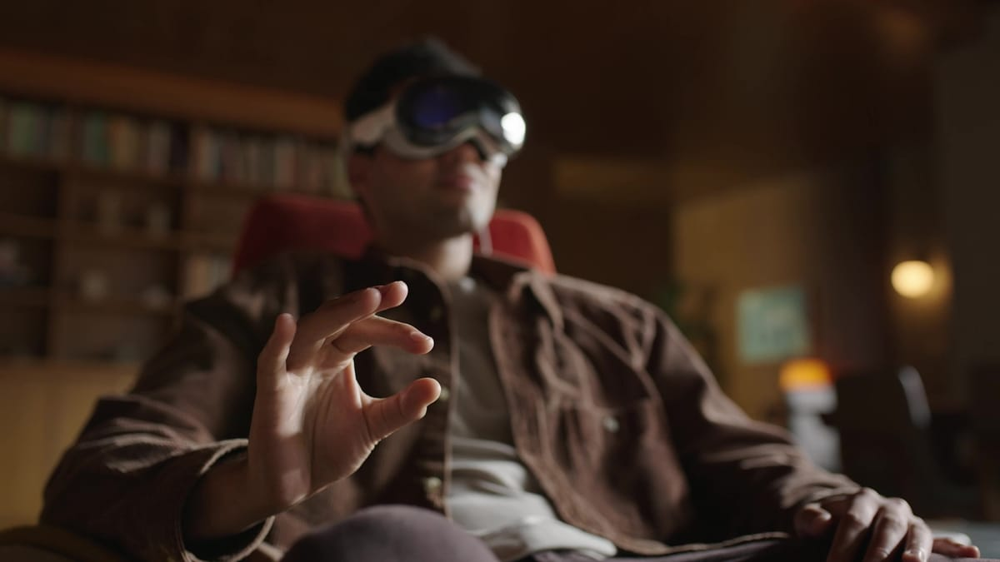

# New Powers for XR Apps

On XR platforms such as Vision Pro, Meta Quest, and PICO, apps (including Web apps) gain brand-new capabilities and enormous potential. Even without cutting-edge features like full immersion or environment blending, XR apps already offer the following clear advantages in **existing mainstream user cases**:

## Bigger Than the Biggest Screen

The software interface expands from a bounded display to the entire 3D space around the user, giving interfaces **more room** to work with and allowing more interfaces to **coexist and collaborate**.

1. Apps built around large screens and multiple windows achieve higher **efficiency**.
2. The "living space" for apps grows, so more apps can act as sidekicks or companions and **no longer have to carry the entire user scenario alone**.
3. Content that used to feel ordinary—HD images, data visualizations, videos—gains **fresh appeal** when presented in a spacious environment.

|  |  |
|:---:|:---:|

## Beyond the 2D Plane

Both the GUI and the content **no longer have to stay flat**; they can be built and extended in 3D space like real-world objects.

1. 3D assets can be displayed and manipulated stereoscopically in space. Users can **directly** view them from any angle (even "enter" them) and interact with their hands, instead of fighting with inefficient 3D viewers trapped in **flat viewports or canvases**.
2. GUIs no longer have to crowd into a single window and rely on borders, shadows, padding, or background colors to differentiate elements. They can be broken down into 3D space to achieve **true visual hierarchy and information separation** while keeping themselves **as clean and minimal as possible**.

|  |  |
|:---:|:---:|

## A Leap Forward in Human-Computer Interaction

Interaction gains more possibilities: it is more natural and intuitive, more flexible and diverse, and easier to tailor to specific scenarios.

1. Users can handle digital content **like real objects**—grab, drag, stretch, squeeze, and rotate it directly—without **extra control panels or specialized gestures** to learn.
2. No more flinging a mouse across the screen or poking at a touch panel with hands held up; most of the time **hands stay still** (choose with eye gaze, confirm with a pinch).
3. There is no need to buy or store dedicated hardware. Software alone can flexibly provide various **specialized input tools** (just as the iPhone implements its keyboard purely in software).

|  |  |
|:---:|:---:|
|  |  |

---

Continue reading the next section: [The New Generation of Spatial Apps](the-new-generation-of-spatial-apps.md)
