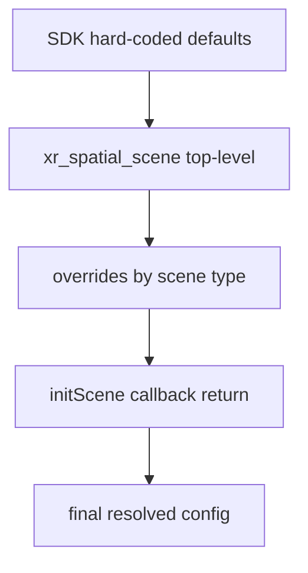
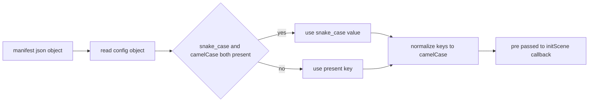
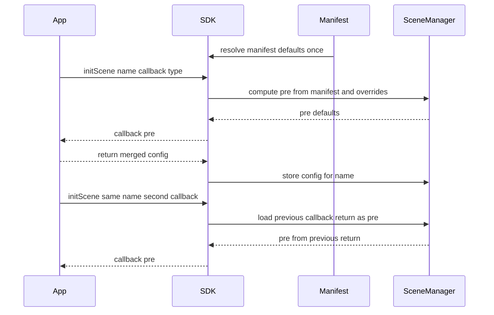
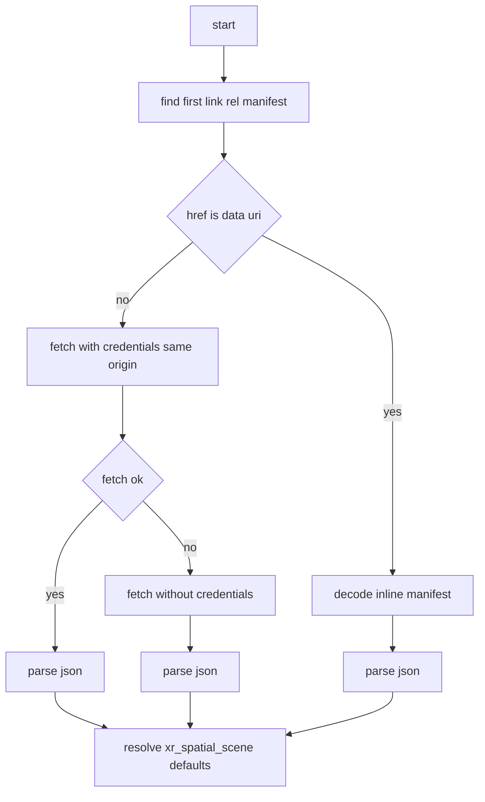

# Manifest API — `xr_spatial_scene`

The **Manifest API** lets WebSpatial apps declare default scene configuration for **window** and **volume** scene types directly in the [PWA manifest file](https://developer.mozilla.org/en-US/docs/Web/Manifest). This eliminates the need to call `initScene(...)` just to set baseline properties, providing a zero-code declarative layer on top of the SDK's built-in defaults.

---

## Table of Contents

- [Manifest API — `xr_spatial_scene`](#manifest-api--xr_spatial_scene)
  - [Table of Contents](#table-of-contents)
  - [Quick Start](#quick-start)
  - [Configuration Priority](#configuration-priority)
    - [Merge Order Diagram](#merge-order-diagram)
  - [Schema Reference](#schema-reference)
    - [`xr_spatial_scene`](#xr_spatial_scene)
    - [`overrides`](#overrides)
    - [`default_size`](#default_size)
    - [`resizability`](#resizability)
    - [Enum Values](#enum-values)
  - [Units](#units)
  - [Full Example](#full-example)
  - [Interaction with `initScene()`](#interaction-with-initscene)
    - [initScene Data Flow](#initscene-data-flow)
  - [Manifest Loading](#manifest-loading)
  - [Type Definitions](#type-definitions)

---

## Quick Start

Add an `xr_spatial_scene` key to your `manifest.json`:

```jsonc
{
  "name": "My WebSpatial App",
  "start_url": "/",
  "display": "standalone",

  "xr_spatial_scene": {
    "default_size": { "width": "1024px", "height": "768px" },
    "worldScaling": "automatic",
    "overrides": {
      "volume_scene": {
        "default_size": { "width": "1m", "height": "1m", "depth": "1m" },
        "baseplateVisibility": "visible"
      }
    }
  }
}
```

Then reference it from your HTML as usual:

```html
<link rel="manifest" href="/manifest.json" />
```

The SDK will automatically read the manifest at startup and apply the declared defaults before any `initScene()` callbacks run.

---

## Configuration Priority

When the SDK resolves a scene's configuration, values are merged in the following order (highest priority wins):

| Priority | Source | Scope |
|----------|--------|-------|
| **1 (highest)** | `initScene()` callback return value | Per scene instance |
| **2** | `overrides.window_scene` / `overrides.volume_scene` | Per scene type |
| **3** | `xr_spatial_scene` top-level fields | Shared across all scene types |
| **4 (lowest)** | SDK hard-coded defaults | Built-in fallback |

> **Note:** `initScene(...)` always wins. Its callback receives the manifest-resolved defaults as the `pre` argument and can selectively override any property.

### Merge Order Diagram



---

## Schema Reference

### `xr_spatial_scene`

Top-level configuration block inside `manifest.json`. All fields are optional.

| Field | Type | Description |
|-------|------|-------------|
| `default_size` | [`XRSceneSize`](#default_size) | Default window/volume dimensions |
| `resizability` | [`XRSceneResizability`](#resizability) | Min/max dimension constraints |
| `worldScaling` | `"automatic" \| "dynamic"` | World scaling behavior |
| `worldAlignment` | `"adaptive" \| "automatic" \| "gravityAligned"` | World alignment mode |
| `baseplateVisibility` | `"automatic" \| "visible" \| "hidden"` | Baseplate visibility for volumes |
| `overrides` | [`XRSpatialSceneOverrides`](#overrides) | Per-scene-type overrides |

**Aliases**

- The SDK accepts both snake_case and camelCase for the fields below:
  - `default_size` / `defaultSize`
  - `world_scaling` / `worldScaling`
  - `world_alignment` / `worldAlignment`
  - `baseplate_visibility` / `baseplateVisibility`
- If both snake_case and camelCase are present in the same object, snake_case wins.
- Values passed to `initScene(..., pre => ...)` are normalized to camelCase keys.



### `overrides`

Optional per-scene-type overrides that are **deep-merged** on top of the top-level `xr_spatial_scene` fields.

| Field | Type | Description |
|-------|------|-------------|
| `window_scene` | `XRSpatialSceneDefaults` | Overrides applied only to **window** scenes |
| `volume_scene` | `XRSpatialSceneDefaults` | Overrides applied only to **volume** scenes |

> Both `window_scene` / `windowScene` and `volume_scene` / `volumeScene` are accepted.

Each override object supports the same fields as the top-level `xr_spatial_scene` (excluding `overrides` itself).

### `default_size`

Defines the initial dimensions of a scene.

| Field | Type | Required | Description |
|-------|------|----------|-------------|
| `width` | `SceneUnit` | Yes | Initial width |
| `height` | `SceneUnit` | Yes | Initial height |
| `depth` | `SceneUnit` | No | Initial depth (only meaningful for volume scenes) |

> Both `default_size` (snake_case) and `defaultSize` (camelCase) are accepted.

### `resizability`

Defines the min/max constraints for scene dimensions.

| Field | Type | Required | Description |
|-------|------|----------|-------------|
| `minWidth` | `SceneUnit` | No | Minimum width |
| `minHeight` | `SceneUnit` | No | Minimum height |
| `maxWidth` | `SceneUnit` | No | Maximum width |
| `maxHeight` | `SceneUnit` | No | Maximum height |

> Snake_case keys are also accepted for resizability: `min_width`, `min_height`, `max_width`, `max_height`.

### Enum Values

**`worldScaling`**

| Value | Description |
|-------|-------------|
| `"automatic"` | Default. System decides scaling behavior. |
| `"dynamic"` | Dynamic scaling based on user interaction. |

**`worldAlignment`**

| Value | Description |
|-------|-------------|
| `"adaptive"` | Adapts to the environment. |
| `"automatic"` | Default. System decides alignment. |
| `"gravityAligned"` | Aligned to gravity direction. |

**`baseplateVisibility`**

| Value | Description |
|-------|-------------|
| `"automatic"` | Default. Platform decides visibility. |
| `"visible"` | Always show the baseplate. |
| `"hidden"` | Always hide the baseplate. |

---

## Units

Scene dimensions accept the `SceneUnit` type, which supports three formats:

| Format | Example | Description |
|--------|---------|-------------|
| Plain number | `1024` | Interpreted as **pixels** for all scenes |
| Pixel string | `"1024px"` | Explicit pixel value |
| Meter string | `"1m"` | Physical meters (primarily for volumes) |

**Conversion behavior during formatting:**

- **Window scenes**: `default_size` values are converted to **pixels**; meter values are converted using `physicalToPoint()`.
- **Volume scenes**: `default_size` values are converted to **meters**; pixel values are converted using `pointToPhysical()`.
- **Resizability**: Always formatted to **pixels** regardless of scene type.

---

## Full Example

```jsonc
{
  "name": "My Spatial App",
  "short_name": "SpatialApp",
  "start_url": "/",
  "display": "standalone",
  "icons": [{ "src": "/icon-192.png", "sizes": "192x192", "type": "image/png" }],

  "xr_spatial_scene": {
    // Shared defaults for all scene types
    "default_size": { "width": "1024px", "height": "768px" },
    "resizability": {
      "minWidth": "400px",
      "minHeight": "300px",
      "maxWidth": "2000px",
      "maxHeight": "1500px"
    },
    "worldScaling": "automatic",
    "worldAlignment": "automatic",
    "baseplateVisibility": "automatic",

    // Per-scene-type overrides (deep-merged with top-level)
    "overrides": {
      "window_scene": {
        "default_size": { "width": "1280px", "height": "720px" },
        "resizability": {
          "minWidth": "640px",
          "maxWidth": "1920px"
        }
      },
      "volume_scene": {
        "default_size": { "width": "0.5m", "height": "0.5m", "depth": "0.5m" },
        "resizability": {
          "minWidth": "0.2m",
          "maxWidth": "2m"
        },
        "baseplateVisibility": "visible",
        "worldAlignment": "gravityAligned"
      }
    }
  }
}
```

**Resolved defaults for window scenes:**
```json
{
  "defaultSize": { "width": "1280px", "height": "720px" },
  "resizability": { "minWidth": "640px", "minHeight": "300px", "maxWidth": "1920px", "maxHeight": "1500px" },
  "worldScaling": "automatic",
  "worldAlignment": "automatic",
  "baseplateVisibility": "automatic"
}
```

**Resolved defaults for volume scenes:**
```json
{
  "defaultSize": { "width": "0.5m", "height": "0.5m", "depth": "0.5m" },
  "resizability": { "minWidth": "0.2m", "minHeight": "300px", "maxWidth": "2m", "maxHeight": "1500px" },
  "worldScaling": "automatic",
  "worldAlignment": "gravityAligned",
  "baseplateVisibility": "visible"
}
```

---

## Interaction with `initScene()`

The `initScene()` API continues to work exactly as before. The only difference is what the `pre` argument contains:

```js
import { initScene } from '@webspatial/core-sdk'

initScene('my-scene', (pre) => {
  // `pre` now contains manifest-resolved defaults instead of SDK hard-coded defaults.
  // On subsequent calls for the same scene name, `pre` is the previous callback's return value.
  return {
    ...pre,
    defaultSize: { width: 800, height: 600 },
  }
}, { type: 'window' })
```

**Callback chaining**: When `initScene` is called multiple times for the same scene name, each call receives the **previous call's return value** as `pre`, not the original manifest defaults. This allows incremental configuration updates.

**Scenes opened without `initScene`**: When `window.open()` is called with a named target that has no prior `initScene`, the SDK synthesizes a default window config from the manifest (or SDK defaults) automatically.

### initScene Data Flow



---

## Manifest Loading

The SDK resolves the manifest using the following strategy:

1. **`<link rel="manifest">`** — looks for the first matching element in the document head.
2. **Data URIs** — supports both `base64` and percent-encoded inline manifests.
3. **Fetch with fallback** — first attempts `credentials: 'same-origin'`, then falls back to an unauthenticated fetch if the first attempt fails (e.g., due to CORS).



The manifest is loaded **once** during `SceneManager.init()`. All `initScene()` calls and hook-based scene polyfills (`window.xrCurrentSceneDefaults`) wait for manifest resolution before executing.

---

## Type Definitions

```ts
type SceneUnitPx = `${number}px`
type SceneUnitM  = `${number}m`
type SceneUnit   = number | SceneUnitPx | SceneUnitM

interface XRSceneSize {
  width: SceneUnit
  height: SceneUnit
  depth?: SceneUnit
}

interface XRSceneResizability {
  minWidth?: SceneUnit
  minHeight?: SceneUnit
  maxWidth?: SceneUnit
  maxHeight?: SceneUnit
}

interface XRSpatialSceneDefaults {
  default_size?: XRSceneSize
  resizability?: XRSceneResizability
  worldScaling?: 'automatic' | 'dynamic'
  worldAlignment?: 'adaptive' | 'automatic' | 'gravityAligned'
  baseplateVisibility?: 'automatic' | 'visible' | 'hidden'
}

interface XRSpatialSceneOverrides {
  window_scene?: XRSpatialSceneDefaults
  volume_scene?: XRSpatialSceneDefaults
}

interface XRSpatialSceneConfig extends XRSpatialSceneDefaults {
  overrides?: XRSpatialSceneOverrides
}

interface PWAManifest {
  name?: string
  short_name?: string
  start_url?: string
  display?: string
  xr_spatial_scene?: XRSpatialSceneConfig
  [key: string]: any
}
```