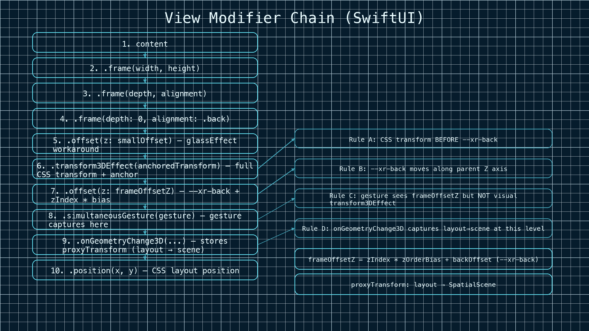
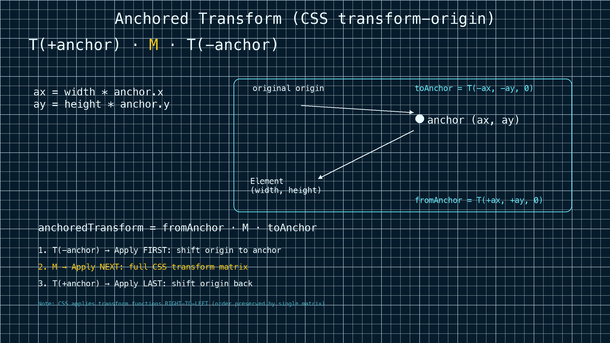
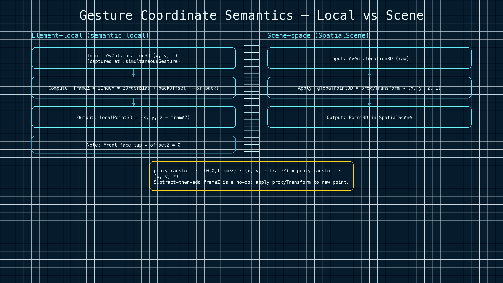
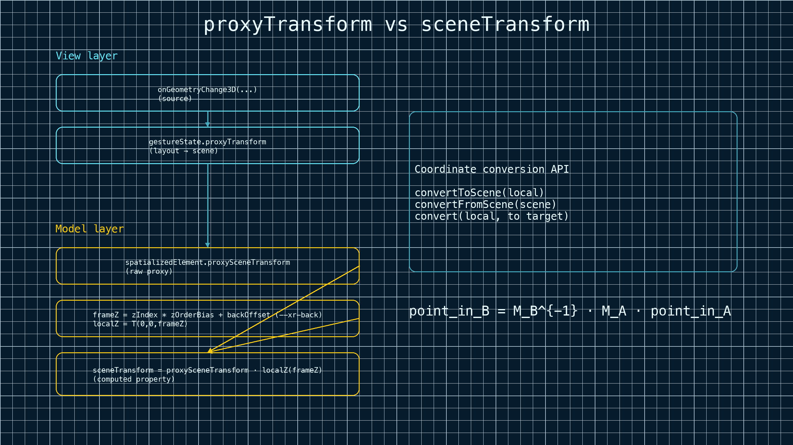
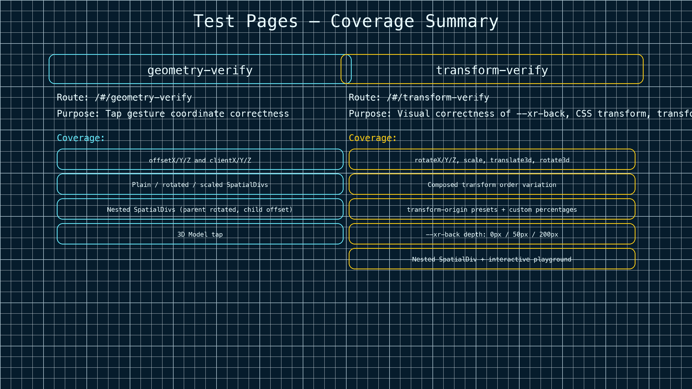

# visionOS SpatializedElementView — Transform & Gesture Design

Technical design document for how `SpatializedElementView` applies CSS transforms,
`--xr-back` depth, and gesture coordinate computation on visionOS.

## View Modifier Chain

The order of SwiftUI view modifiers determines the coordinate system at each level.
Understanding this chain is essential to understanding how transforms and gestures work.

```
content
  .frame(width, height)
  .frame(depth, alignment)
  .frame(depth: 0, alignment: .back)
  .offset(z: smallOffset)                  // workaround for glassEffect bug
  .transform3DEffect(anchoredTransform)    // full CSS transform with anchor
  .offset(z: frameOffsetZ)                 // --xr-back + zIndex*bias
  .simultaneousGesture(gesture)            // gesture captures here
  .onGeometryChange3D(...)                 // stores proxyTransform (layout→scene)
  .position(x, y)                          // CSS layout position
```



Key ordering rules:
- **CSS transform** (`.transform3DEffect`) is applied **before** `--xr-back` offset.
- **`--xr-back`** (`.offset(z: frameOffsetZ)`) is applied **after** CSS transform,
  so it always moves the element along the **parent's** Z axis.
- **Gesture** is placed **after** `.offset(z: frameOffsetZ)`, so `event.location3D`
  includes the `frameOffsetZ` in its coordinate system but does **not** include
  visual transforms from `.transform3DEffect`.
- **`onGeometryChange3D`** captures the layout→scene transform at the same level.

## CSS Transform: Full Matrix via `transform3DEffect`

### Problem with decomposition

Previously, the CSS transform matrix was decomposed into separate `scaleEffect`,
`rotation3DEffect`, and `offset` calls. This loses the original transform composition
order — CSS applies transforms right-to-left (e.g., `rotateX(90deg) translateZ(100px)`
means translate along the **rotated** Z axis), but decomposed SwiftUI modifiers apply
in modifier-chain order with no way to interleave.

### Solution: `transform3DEffect` with manual anchor

We apply the full CSS transform matrix as a single `transform3DEffect(anchoredTransform)`.
Since `transform3DEffect` does not support an `anchor` parameter, we manually wrap the
transform with CSS `transform-origin`:

```swift
let ax = width * anchor.x
let ay = height * anchor.y
let toAnchor   = AffineTransform3D(translation: Vector3D(x: -ax, y: -ay, z: 0))
let fromAnchor = AffineTransform3D(translation: Vector3D(x:  ax, y:  ay, z: 0))
let anchoredTransform = fromAnchor.concatenating(transform).concatenating(toAnchor)
```

This implements the standard CSS transform-origin formula:

```
T(+anchor) · M · T(-anchor)
```



where `a.concatenating(b)` means "apply `b` first, then `a`", so:
- `toAnchor` (T(−anchor)) is applied first — shift origin to anchor
- `transform` (M) is applied — the full CSS transform matrix
- `fromAnchor` (T(+anchor)) is applied last — shift origin back

This preserves arbitrary CSS transform order (e.g., `rotateX(90deg) translateZ(200px)`
correctly translates along the rotated Z axis, appearing as a Y-direction movement).

## `--xr-back` and `frameOffsetZ`

`localFrameOffsetZ()` computes the Z offset that defines the element's "semantic local"
coordinate system:

```swift
func localFrameOffsetZ() -> Double {
    (spatializedElement.zIndex * zOrderBias) + spatializedElement.backOffset
}
```

- `backOffset` comes from CSS `--xr-back` (depth offset into the scene).
- `zIndex * zOrderBias` is a small offset to simulate z-ordering (workaround for
  SwiftUI `zIndex()` bugs).

This is applied as `.offset(z: frameOffsetZ)` **after** `.transform3DEffect`, so
`--xr-back` always moves the element along the parent's Z axis regardless of any CSS
rotation. This matches the product design: the element first gets its CSS visual
transform applied, then is pushed back along the parent Z axis.

## Gesture Coordinate Semantics



### `location3D` (element-local)

`event.location3D` is captured at the `.simultaneousGesture` level (top-left origin).
It includes `frameOffsetZ` in its Z coordinate but **not** visual transforms from
`.transform3DEffect`.

To provide the web with a "semantic local" coordinate where the front face is z=0:

```swift
let localPoint3D = Point3D(
    x: event.location3D.x,
    y: event.location3D.y,
    z: event.location3D.z - localFrameOffsetZ()
)
```

Tapping the front face of a SpatialDiv yields `offsetZ ≈ 0`.

### `globalLocation3D` (scene-space)

The scene-space coordinate is computed by applying `proxyTransform` directly to the
**raw** event point (without subtracting `frameOffsetZ`):

```swift
let globalPoint3D = localToScene(event.location3D)  // raw event point

func localToScene(_ localPoint: Point3D) -> Point3D {
    let p = SIMD4<Double>(localPoint.x, localPoint.y, localPoint.z, 1.0)
    let scene = gestureState.proxyTransform.matrix * p
    return Point3D(x: scene.x, y: scene.y, z: scene.z)
}
```

**Why not subtract-then-add `frameOffsetZ`?** Previously, `localToScene` received the
adjusted point (with `frameZ` subtracted) and then concatenated a Z-offset transform
to add it back. Mathematically:

```
proxyTransform · T(0,0,frameZ) · (x, y, z−frameZ) = proxyTransform · (x, y, z)
```

The subtract-then-add is a no-op — the simplified version applies `proxyTransform`
directly to the raw event point, producing the same result with less computation and
no dependency on `frameOffsetZ` staleness.

## `proxyTransform` and `sceneTransform`



### `proxyTransform` (View layer)

`proxyTransform` is the raw layout→scene transform obtained from `onGeometryChange3D`.
It does **not** include `--xr-back` (`frameOffsetZ`) because `.offset(z:)` is a visual
modifier that does not affect the layout proxy.

```swift
.onGeometryChange3D(for: AffineTransform3D.self) { proxy in
    proxy.transform(in: .named("SpatialScene"))!
} action: { new in
    gestureState.proxyTransform = new
    spatializedElement.proxySceneTransform = new
}
```

The raw value is written to both the View-layer `gestureState.proxyTransform` (for
gesture coordinate computation) and the model-layer `spatializedElement.proxySceneTransform`
(for cross-element coordinate conversion via JSB).

### `sceneTransform` (Model layer)

`SpatializedElement.sceneTransform` is a **computed property** that concatenates the
raw proxy transform with the current `backOffset` and `zIndex` offset on-the-fly:

```swift
var sceneTransform: AffineTransform3D {
    let frameZ = (zIndex * zOrderBias) + backOffset
    let localZ = AffineTransform3D(translation: Vector3D(x: 0, y: 0, z: frameZ))
    return proxySceneTransform.concatenating(localZ)
}
```

This means `backOffset`/`zIndex` changes are always reflected without needing extra
update triggers. The `sceneTransform` maps from the element's semantic local coordinate
system (top-left origin, front face z=0) to SpatialScene space.

### Coordinate conversion API

`SpatializedElement` provides methods for converting points between coordinate systems:

```swift
// Local → scene
func convertToScene(_ localPoint: SIMD3<Double>) -> SIMD3<Double>

// Scene → local
func convertFromScene(_ scenePoint: SIMD3<Double>) -> SIMD3<Double>

// Element A local → Element B local (via scene as intermediate)
func convert(_ localPoint: SIMD3<Double>, to target: SpatializedElement) -> SIMD3<Double>
```

The `convert(_:to:)` method chains `convertToScene` and `convertFromScene`:

```
point_in_B = M_B⁻¹ · M_A · point_in_A
```

These methods are designed to be called from a JSB handler when the web side requests
coordinate conversion between two SpatialDivs, avoiding the overhead of continuously
pushing transform data to the web side.

## Test Pages



### geometry-verify

Route: `/#/geometry-verify`

Verifies tap gesture coordinate correctness (`offsetX/Y/Z`, `clientX/Y/Z`) across:
- Plain, rotated, scaled SpatialDivs
- Nested SpatialDivs (parent rotated, child offset)
- 3D Model tap

### transform-verify

Route: `/#/transform-verify`

Visual correctness test for `--xr-back`, CSS `transform`, and `transform-origin`
combinations. Covers:
- Single transform functions: `rotateX/Y/Z`, `scale`, `scaleX/Y`, `translateX/Y/Z`,
  `translate3d`, `rotate3d`
- Composed transforms with order variation (e.g., `rotateX translateZ` vs
  `translateZ rotateX`)
- `transform-origin` variations: `center`, `top left`, `bottom right`, `left center`,
  `right center`, custom percentages
- `--xr-back` depth variations: 0px, 50px, 200px
- Nested SpatialDiv with independent transforms
- Interactive playground with live transform/origin/depth controls

## Related Files

| File | Purpose |
|------|---------|
| `packages/visionOS/web-spatial/model/SpatializedElement.swift` | Model: sceneTransform, coordinate conversion API |
| `packages/visionOS/web-spatial/view/SpatializedElementView.swift` | Native view: transforms, gestures, geometry |
| `apps/test-server/src/pages/geometry-verify/index.tsx` | Gesture coordinate verification page |
| `apps/test-server/src/pages/transform-verify/index.tsx` | Transform visual correctness page |
