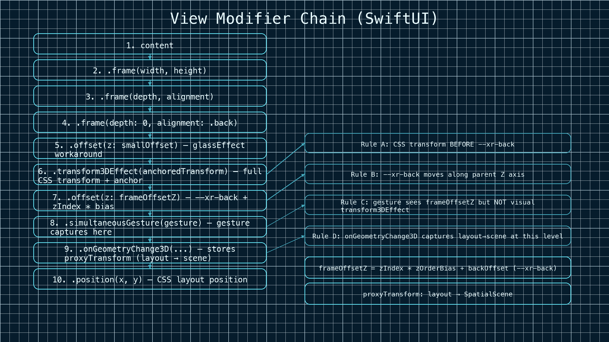
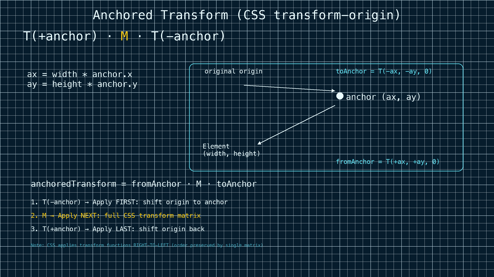
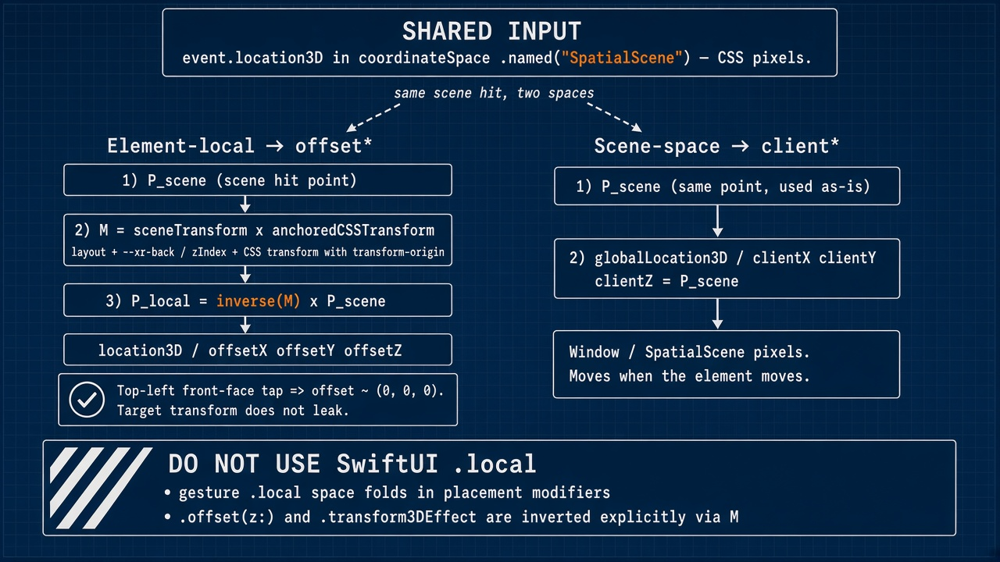
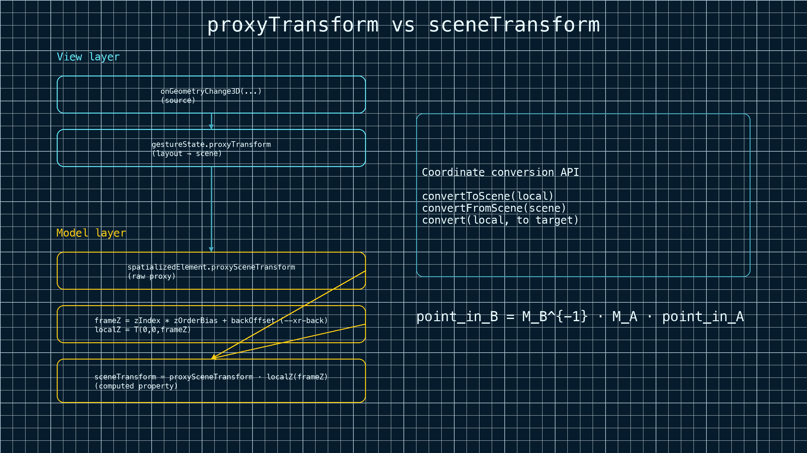

# visionOS SpatializedElementView — Transform & Gesture Design

Technical design document for how `SpatializedElementView` applies CSS transforms,
`--xr-back` depth, and gesture coordinate computation on visionOS.

## View Modifier Chain

The order of SwiftUI view modifiers determines the coordinate system at each level.
Understanding this chain is essential to understanding how transforms and gestures work.

```
content
  .frame(width, height)
  .frame(depth, alignment)
  .frame(depth: 0, alignment: .back)
  .offset(z: smallOffset)                  // workaround for glassEffect bug
  .transform3DEffect(anchoredTransform)    // full CSS transform with anchor
  .offset(z: frameOffsetZ)                 // --xr-back + zIndex*bias
  .simultaneousGesture(gesture)            // gesture captures here
  .onGeometryChange3D(...)                 // stores proxyTransform (layout→scene)
  .position(x, y)                          // CSS layout position
```



Key ordering rules:
- **CSS transform** (`.transform3DEffect`) is applied **before** `--xr-back` offset.
- **`--xr-back`** (`.offset(z: frameOffsetZ)`) is applied **after** CSS transform,
  so it always moves the element along the **parent's** Z axis.
- **Gesture** is placed **after** `.offset(z: frameOffsetZ)`, but tap and drag are
  declared with `coordinateSpace: .named("SpatialScene")`, so `event.location3D` does
  not depend on where in the chain the gesture sits.
- **`onGeometryChange3D`** captures the layout→scene transform at the same level.

## CSS Transform: Full Matrix via `transform3DEffect`

### Problem with decomposition

Previously, the CSS transform matrix was decomposed into separate `scaleEffect`,
`rotation3DEffect`, and `offset` calls. This loses the original transform composition
order — CSS applies transforms right-to-left (e.g., `rotateX(90deg) translateZ(100px)`
means translate along the **rotated** Z axis), but decomposed SwiftUI modifiers apply
in modifier-chain order with no way to interleave.

### Solution: `transform3DEffect` with manual anchor

We apply the full CSS transform matrix as a single `transform3DEffect(anchoredTransform)`.
Since `transform3DEffect` does not support an `anchor` parameter, we manually wrap the
transform with CSS `transform-origin`:

```swift
let ax = width * anchor.x
let ay = height * anchor.y
let toAnchor   = AffineTransform3D(translation: Vector3D(x: -ax, y: -ay, z: 0))
let fromAnchor = AffineTransform3D(translation: Vector3D(x:  ax, y:  ay, z: 0))
let anchoredTransform = fromAnchor.concatenating(transform).concatenating(toAnchor)
```

This implements the standard CSS transform-origin formula:

```
T(+anchor) · M · T(-anchor)
```



where `a.concatenating(b)` means "apply `b` first, then `a`", so:
- `toAnchor` (T(−anchor)) is applied first — shift origin to anchor
- `transform` (M) is applied — the full CSS transform matrix
- `fromAnchor` (T(+anchor)) is applied last — shift origin back

This preserves arbitrary CSS transform order (e.g., `rotateX(90deg) translateZ(200px)`
correctly translates along the rotated Z axis, appearing as a Y-direction movement).

## `--xr-back` and `frameOffsetZ`

`localFrameOffsetZ()` computes the Z offset that defines the element's "semantic local"
coordinate system:

```swift
func localFrameOffsetZ() -> Double {
    (spatializedElement.zIndex * zOrderBias) + spatializedElement.backOffset
}
```

- `backOffset` comes from CSS `--xr-back` (depth offset into the scene).
- `zIndex * zOrderBias` is a small offset to simulate z-ordering (workaround for
  SwiftUI `zIndex()` bugs).

This is applied as `.offset(z: frameOffsetZ)` **after** `.transform3DEffect`, so
`--xr-back` always moves the element along the parent's Z axis regardless of any CSS
rotation. This matches the product design: the element first gets its CSS visual
transform applied, then is pushed back along the parent Z axis.

## Gesture Coordinate Semantics



Web-facing mapping (same names as Entity events; different units and origin):

| Field | Space | Unit | Origin |
|---|---|---|---|
| `offsetX` / `offsetY` / `offsetZ` | target element pre-transform local | CSS pixels | top-left; front face `z = 0` |
| `clientX` / `clientY` / `clientZ` | SpatialScene / window | CSS pixels | window origin |
| `detail.location3D` | same as offset | CSS pixels | same as offset |
| `detail.globalLocation3D` | same as client | CSS pixels | same as client |
| `translation3D` | direct parent pre-transform local (SpatialScene if no parent) | CSS pixels | vector from drag-start to now |

`offset*` does not include the element's `--xr-back`, CSS `transform`, or layout position. Tapping the top-left of the front face yields `offset ≈ (0, 0, 0)`. Entity events use meters and a center origin; see `docs/dynamic-3d-api-prd.md` §12. The behavioral spec is `openspec/specs/spatial-gestures/spec.md`.

`translation3D` is the cumulative hit displacement in the **parent** SpatialDiv's pre-transform local space, not in SpatialScene and not in the target's own local space. A root SpatialDiv (parent = SpatialScene) therefore matches the scene-space SwiftUI translation; a nested child under a rotated parent does not, so adding `translation3D` to the child's CSS `translate` still follows the hand.

`spatialRotate.quaternion` is a cumulative rotation in the same parent-local axes. Compose it on the left of the gesture-start orientation. The rotation recognizer uses the local basis at its modifier; native maps that basis through the layout-to-scene transform and then into the parent's pre-transform space. The target's own CSS transform is excluded. Shared ancestor transforms cancel before rotation extraction, so ancestor scale is not applied to the angle. If the parent basis is singular, no rotation sample is emitted. For SpatialDiv/Model, `constrainedToAxis` is interpreted in that pre-transform parent basis because the recognizer is attached to the target view. Entity gestures attach one recognizer to the Reality view, so their constraint axis is in Reality/scene space; the returned quaternion is still converted into the hit Entity's direct-parent basis.

Tap and drag are declared in the `"SpatialScene"` coordinate space, so the event point
arrives already in scene space. Both reported coordinates are derived from that single
point rather than from SwiftUI's `.local` space, which would otherwise fold the
element's own placement modifiers into the result.

### `globalLocation3D` (scene-space)

The raw event point, used as-is:

```swift
let globalPoint3D = event.location3D
```

### `location3D` (element-local)

The element's "semantic local" space is top-left origin, CSS pixels, front face z=0.
It is reached by inverting the element's full placement chain — CSS transform first,
then `--xr-back`/`zIndex`, then layout:

```swift
private func sceneToLocal(_ scenePoint: Point3D) -> Point3D {
    let full = spatializedElement.sceneTransform.concatenating(anchoredCSSTransform())
    guard let inverse = full.inverse else { return scenePoint }
    let p = SIMD4<Double>(scenePoint.x, scenePoint.y, scenePoint.z, 1.0)
    let local = inverse.matrix * p
    return Point3D(x: local.x, y: local.y, z: local.z)
}
```

Because the inverse cancels the element's own displacement, `offsetX`/`offsetY`/`offsetZ`
describe **where on the element** the hit landed and are unaffected by `--xr-back`, by
`transform: translateX(...)`, or by any rotation on the element itself. Tapping the
top-left corner yields `(0, 0, 0)` no matter how the element is transformed; tapping
the front face yields `offsetZ ≈ 0`.

This matches the Entity semantics in `docs/dynamic-3d-api-prd.md` §12 — local hit point
in the target's own space, global hit point in the surrounding space — differing only in
units and origin (CSS pixels / top-left here, meters / center for entities).

**Why invert instead of reading SwiftUI's `.local` space?** A gesture's `.local` space is
the space of the modifier level it attaches to, and SwiftUI is not consistent about which
of the preceding visual modifiers it folds in: `.offset(z:)` was reflected in the reported
point while `.transform3DEffect` was not, forcing a manual `frameOffsetZ` subtraction while
`translateX` leaked into `offsetX`. Requesting scene space and inverting the chain we built
ourselves removes that dependency entirely — the reported values now follow from the
transforms this file applies, not from framework behaviour we cannot observe.

## `proxyTransform` and `sceneTransform`



### `proxyTransform` (View layer)

`proxyTransform` is the raw layout→scene transform obtained from `onGeometryChange3D`.
It does **not** include `--xr-back` (`frameOffsetZ`) because `.offset(z:)` is a visual
modifier that does not affect the layout proxy.

```swift
.onGeometryChange3D(for: AffineTransform3D.self) { proxy in
    proxy.transform(in: .named("SpatialScene"))!
} action: { new in
    spatializedElement.proxySceneTransform = new
}
```

The raw value is written to the model-layer `spatializedElement.proxySceneTransform`, which
backs both gesture coordinate computation and cross-element coordinate conversion via JSB.

### `sceneTransform` (Model layer)

`SpatializedElement.sceneTransform` is a **computed property** that concatenates the
raw proxy transform with the current `backOffset` and `zIndex` offset on-the-fly:

```swift
var sceneTransform: AffineTransform3D {
    let frameZ = (zIndex * zOrderBias) + backOffset
    let localZ = AffineTransform3D(translation: Vector3D(x: 0, y: 0, z: frameZ))
    return proxySceneTransform.concatenating(localZ)
}
```

This means `backOffset`/`zIndex` changes are always reflected without needing extra
update triggers. The `sceneTransform` maps layout and parent-axis depth into
SpatialScene space, excluding the element's own CSS transform. Gesture handling and
`convertCoordinate` both compose the remaining anchored CSS transform as
`sceneTransform.concatenating(anchoredCSSTransform())`, so they share the same
pre-transform local coordinate definition.

### Coordinate conversion API

`SpatializedElement` provides methods for converting points between coordinate systems:

```swift
// Local → scene
func convertToScene(_ localPoint: SIMD3<Double>) -> SIMD3<Double>

// Scene → local
func convertFromScene(_ scenePoint: SIMD3<Double>) -> SIMD3<Double>

// Element A local → Element B local (via scene as intermediate)
func convert(_ localPoint: SIMD3<Double>, to target: SpatializedElement) -> SIMD3<Double>
```

The `convert(_:to:)` method chains `convertToScene` and `convertFromScene`:

```
point_in_B = M_B⁻¹ · M_A · point_in_A
```

These methods are designed to be called from a JSB handler when the web side requests
coordinate conversion between two SpatialDivs, avoiding the overhead of continuously
pushing transform data to the web side.

## Test Pages

### Gesture coordinate verification

Routes:

- `/#/reality/entity-gesture-coordinates`
- `/#/reality/spatial-element-gesture-coordinates`
- `/#/reality/convert-coordinate-gesture`

These pages verify target-local tap and drag-start offsets, parent-local drag and
rotation values, and `convertCoordinate` round trips across Entity, nested
SpatialDiv, and Model targets with rotated and scaled parents.

### transform-verify

Route: `/#/transform-verify`

Visual correctness test for `--xr-back`, CSS `transform`, and `transform-origin`
combinations. Covers:
- Single transform functions: `rotateX/Y/Z`, `scale`, `scaleX/Y`, `translateX/Y/Z`,
  `translate3d`, `rotate3d`
- Composed transforms with order variation (e.g., `rotateX translateZ` vs
  `translateZ rotateX`)
- `transform-origin` variations: `center`, `top left`, `bottom right`, `left center`,
  `right center`, custom percentages
- `--xr-back` depth variations: 0px, 50px, 200px
- Nested SpatialDiv with independent transforms
- Interactive playground with live transform/origin/depth controls

## Related Files

| File | Purpose |
|------|---------|
| `packages/visionOS/web-spatial/model/SpatializedElement.swift` | Model: sceneTransform, coordinate conversion API |
| `packages/visionOS/web-spatial/view/SpatializedElementView.swift` | Native view: transforms, gestures, geometry |
| `apps/test-server/src/pages/reality/entityGestureCoordinates.tsx` | Entity gesture coordinate verification page |
| `apps/test-server/src/pages/reality/spatialElementGestureCoordinates.tsx` | SpatialDiv and Model gesture coordinate verification page |
| `apps/test-server/src/pages/reality/convertCoordinateGesture.tsx` | Gesture and coordinate-conversion round-trip page |
| `apps/test-server/src/pages/transform-verify/index.tsx` | Transform visual correctness page |
