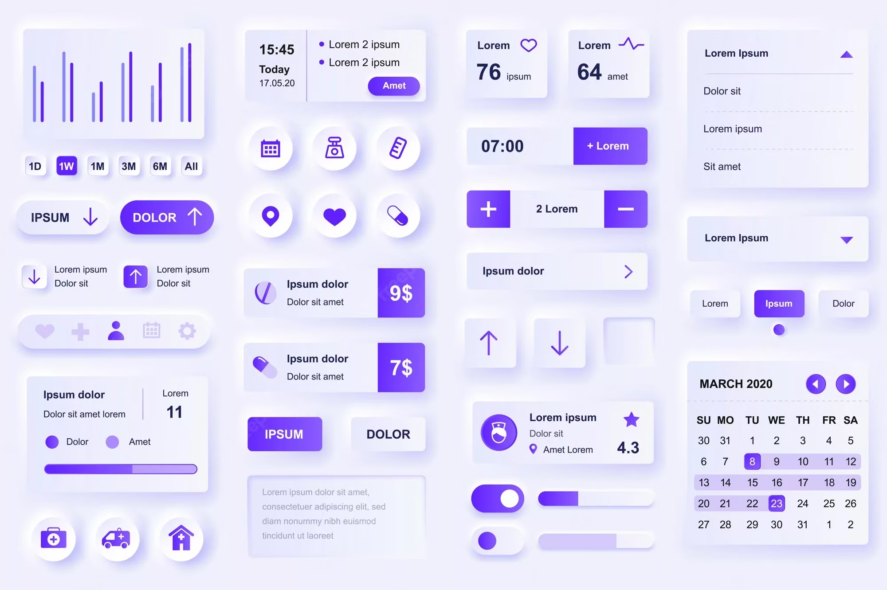
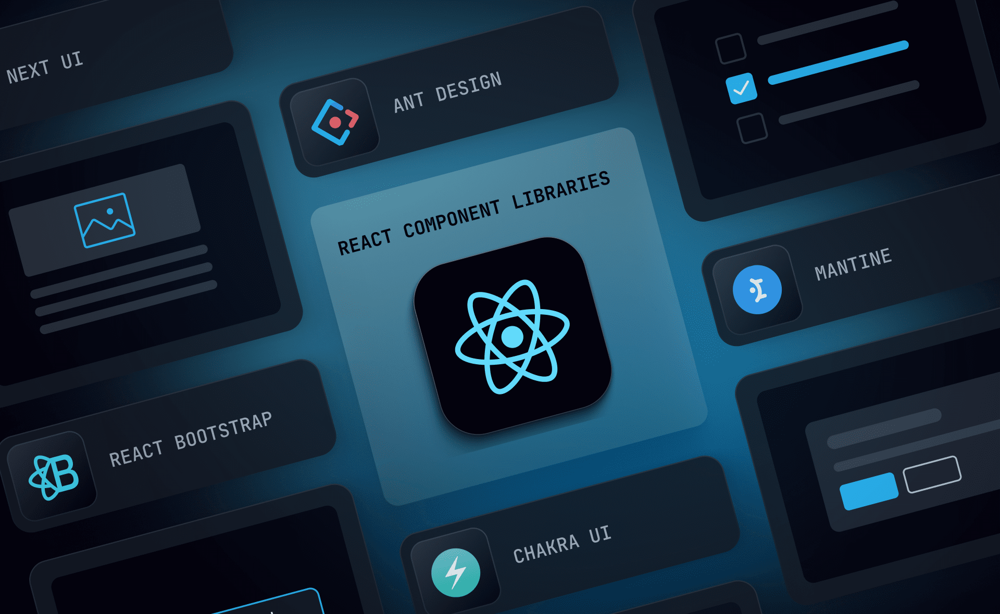
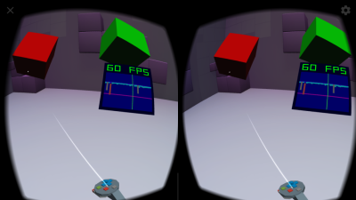
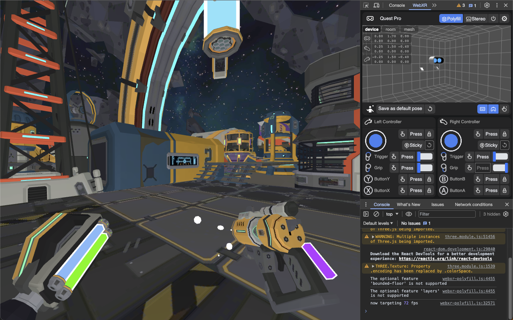
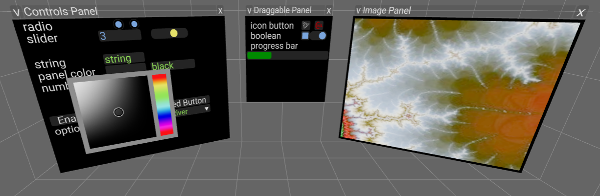

# HTML/CSS 和 WebXR

上一节：[新一代的空间化应用](the-new-generation-of-spatial-apps.md)

---

但随之而来的问题是，**Web 并没有因此自动获得这种空间应用能力**。

## HTML/CSS 的问题

**Web 天然对多任务、多窗口、多应用是友好的**，倾向专注于自身内容和单一目的，在使用场景中跟 OS 和其他应用和谐共存。

|  |  |
|:---:|:---:|

桌面/移动平台上的 Web 开发，基于跟原生应用同样的 **2D GUI 技术**，不仅流行 React 这样的 2D GUI 框架，连位于框架底层、基于浏览器布局引擎的 HTML+CSS+JS 技术本身，也同样是**基于「GUI 控件对象」（HTML 元素）和布局关系、类似搭建积木、以代码为中心**的开发方式和思维方式。

|  |  |
|:---:|:---:|
|  |  |

但这些 HTML/CSS 内容被局限在浏览器窗口或 WebView 的 2D 平面上，不仅没有能力进入 3D 空间，所有 API（比如 CSS）也都是围绕 X 轴和 Y 轴的，少数涉及 Z 轴的 API，比如 translate3d 和 WebGL，也都只能描述**投影在 2D 画布上**的 Z 轴效果。

|  |  |
|:---:|:---:|

Web 框架和 HTML/CSS 的以上现状，跟 visionOS 发布前 SwiftUI 在 iOS/ipadOS 上的状态，是一样的。

## WebXR 的问题

另一方面，基于 WebGL/WebGPU 的 Web 3D 内容，在空间计算平台上可以利用一种[新的 Web 标准 API——WebXR](#)，让自己超越浏览器窗口，进入 3D 空间，同时获得来自 XR 硬件的自然交互能力（头部跟踪、手柄、手势跟踪等）。通过这种方式，Web 具备了跟 OpenXR 应用、Unity 应用一样的空间化能力。

但这种 WebXR 内容存在的问题，也跟基于 OpenXR/Unity 的传统 XR 应用完全一样：

- WebXR 内容不但**无法与其他 XR 应用共存**，甚至也**无法跟同属一个网页的其他 2D Web 内容共存**。WebXR 会话启动后会接管整个空间所有画面的渲染，看不到原本的网页窗口和 OS 界面，所有交互也由应用自己负责。
- 需要[**完全基于 WebGL/WebGPU** 来实现所有内容](#)，通常用 **Web 3D 引擎**来开发，跟基于 HTML+CSS+JS 的原有 Web 开发方式，是**完全割裂**的。在原本的各种互联网业务领域里，用基于 Web 的 2D GUI 可以轻松满足需求，有海量现成的 UI 设计模式、组件库和庞大的开源生态，**这些在 WebXR 开发中全都无法直接使用**，需要另起炉灶探索各种体验不一致的 3D GUI，或用 WebGL/WebGPU 来实现 2D GUI 的效果和交互。

## 问题总结

WebXR **不兼容主流 Web 开发生态、不能跟已有的 2D Web 内容共存**。而主流 Web 开发生态和 2D Web 内容使用的 HTML/CSS 又**不具备空间化能力**。

---
继续阅读下一节：[让 Web 也能空间化](make-the-web-spatial-too.md)
