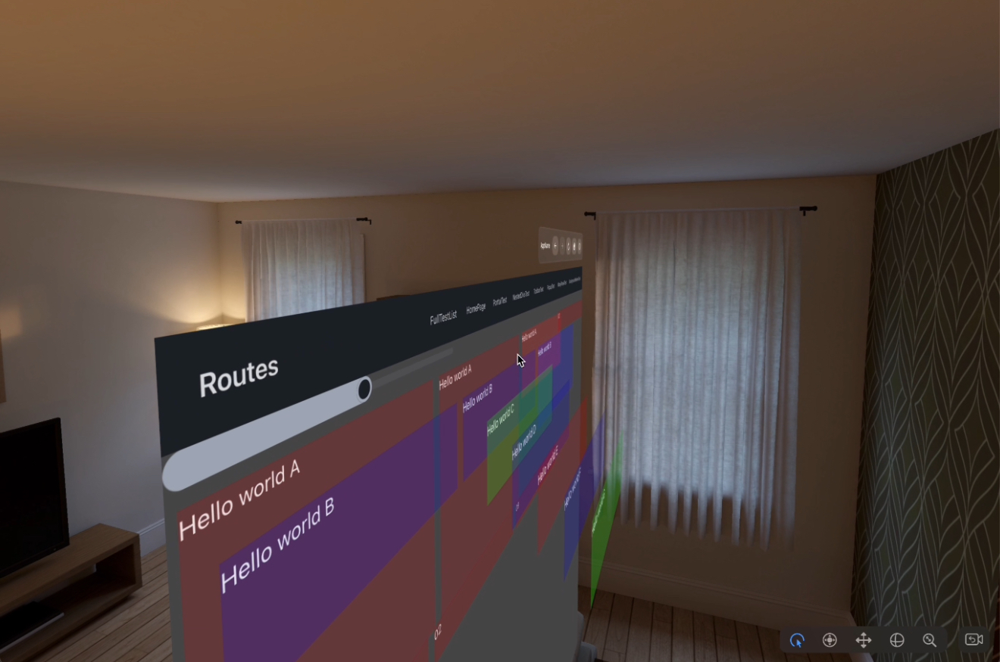
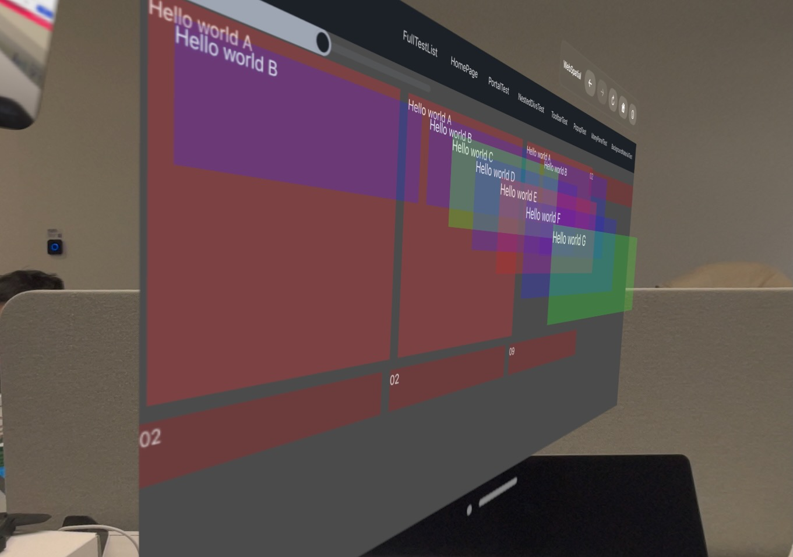
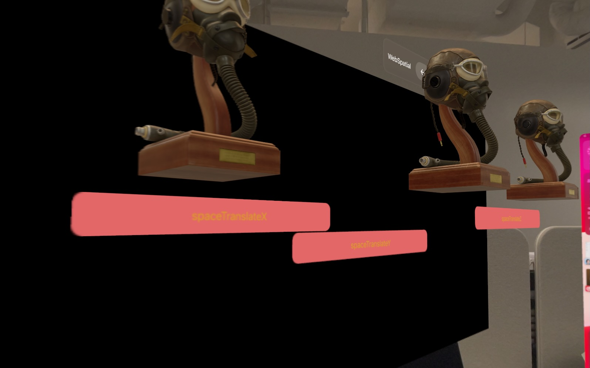
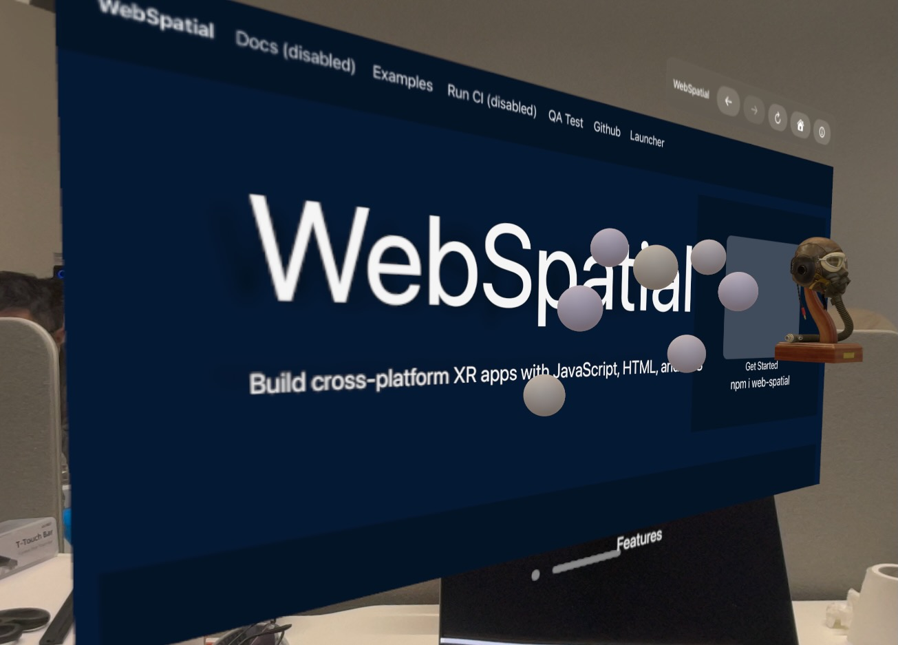

# 让 Web 也能空间化

上一节：[HTML/CSS 和 WebXR](html-css-and-webxr.md)

---

  

WebSpatial 是一套建立在主流 Web 开发生态和现有 2D Web 之上的[空间化 API]()，让整个基于 HTML/CSS 的 Web 生态——几十亿网站和 Web App、几千万 Web 开发者和几百万开源库——都能迈入「空间化」时代，**能像原生 visionOS 应用一样利用空间化能力，同时完整延续自身原有的优点**。

WebSpatial 让网页中的 **HTML 元素**不仅能**通过 CSS** 在 X 轴和 Y 轴方向上布局和定位，也能**在网页前方空间中的 Z 轴方向上定位**：

WebSpatial 让 HTML 元素[**能真正在空间中的 Z 轴方向上旋转、缩放和变形**]()，比如能用 DIV 拼装出真正的立体「物体」：

WebSpatial 让 HTML 元素不仅能设置背景颜色，还能[**把背景设置为基于环境实时渲染的半透明材质**]()，在任何颜色和光照条件的环境中都能清晰的区分和维持内容可读性。
也可以把 HTML 元素或整个网页窗口的背景设置为[**全透明材质**]()，让其中的内容看上去悬浮、分散在空间中。

WebSpatial 给 HTML **增加了[真正的 3D 元素]()**，可以在空间中显示 3D 内容：

这些 3D 元素能[像 2D 元素一样，**跟其他 HTML 元素一起布局**]()，组成各种 Web 内容和图形界面：

WebSpatial 让 Web App 可以像原生空间应用一样**由多个「[场景]()」组成**，既能把这些 2D+3D 或纯 3D 的「场景」[**作为标准的网页窗口来管理**]()，也能对这些场景做[**针对空间环境的特殊初始化设置**]()：

【1.1 版 功能】WebSpatial 给 HTML 增加的 3D 元素中，有一类可以作为空间容器，**用 3D 引擎 API 渲染和控制容器中的 3D 内容**，让 Web 3D 编程不再只局限于平面画布和少数全屏的 3D 游戏里（包括独占整个空间的 WebXR 游戏），可以在多任务场景下和更广阔领域的应用里有用武之地。

---

继续阅读下一节：[基于现有 Web 开发生态](built-on-the-existing-web-ecosystem.md)
