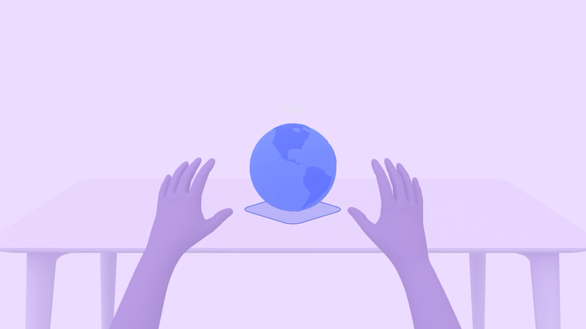

# XR 应用的新能力

在 Vision Pro、Meta Quest、PICO 这样的 XR 平台上，应用（包括 Web）获得了全新的能力和巨大的潜力，即使不考虑最前沿的能力（沉浸式体验、跟周围环境结合），在**现有的主流用户场景**中 XR 应用仍然具备以下明显优势：

## 比大屏更大屏

软件界面从有边界的显示屏扩展到了用户周围的整个3D空间，界面有**更多空间**可以利用，可以有更多界面**共存和协同**。

1. 基于大屏和多窗口的应用，能获得更好的**使用效率**。
2. 应用的「生存空间」更大了，更多应用有机会被作为辅助工具或伴侣来使用，**不用独自撑起整个用户场景**。
3. 很多原本普通的内容，比如高清大图、信息可视化和视频，在大空间中获得了**新的吸引力**。

|  |  |
|:---:|:---:|

## 超越 2D 平面

GUI 和内容都**不用局限于 2D 平面**，可以像现实世界物体一样在 3D 空间中构造和延伸。

1. 3D 内容可以立体的在空间中展示和使用，用户可以**直接**从各个角度看它（乃至「进入」其中），直接「上手」互动，不必跟 2D 窗口中各种低效复杂不直观的 3D 内容查看器打交道，3D 内容不会被困在这种查看器的**平面视区内或平面画布上**。
2. GUI 不需要挤在同一个窗口中通过边框、阴影、额外留白、背景色等复杂元素来区分彼此，可以拆分到 3D 空间中获得**真正的视觉层次和信息区分度**，同时让自身保持**最简洁纯粹的状态**。

|  |  |
|:---:|:---:|

## 人机交互大进化

人机交互有了更多可能，更自然和直观，更灵活和多样，可以围绕特定场景做更多定制。
1. 把软件内容像**真实物体**一样直接抓握、拖放、拉伸挤压和旋转，不需要**额外的交互界面**和学习**特有的操作方式**。
2. 不需要费力甩鼠标和抬着手在触屏上点来点去，多数时候**不用动手**（通过眼睛注视来做选择，手指原地捏合来做确认）。
3. 不需要额外购买和存放硬件装置，用软件就可以灵活实现各种**专用操作工具**（就像 iPhone 中用软件来实现键盘）。

|  |  |
|:---:|:---:|
|  |  |

---

继续阅读下一节：[新一代的空间化应用](the-new-generation-of-spatial-apps.md)
