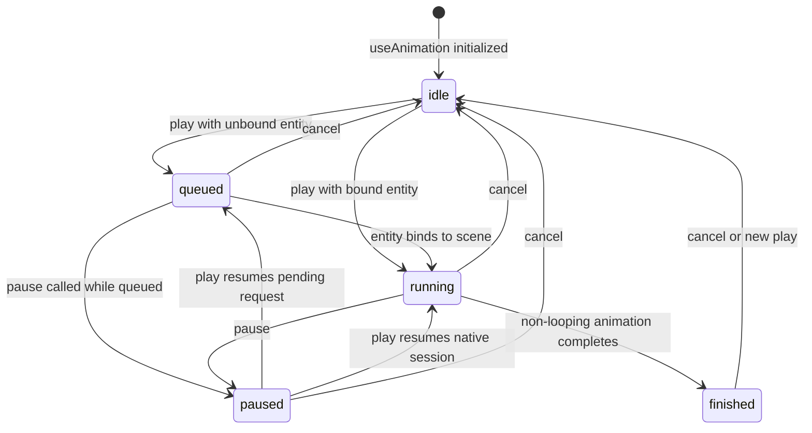
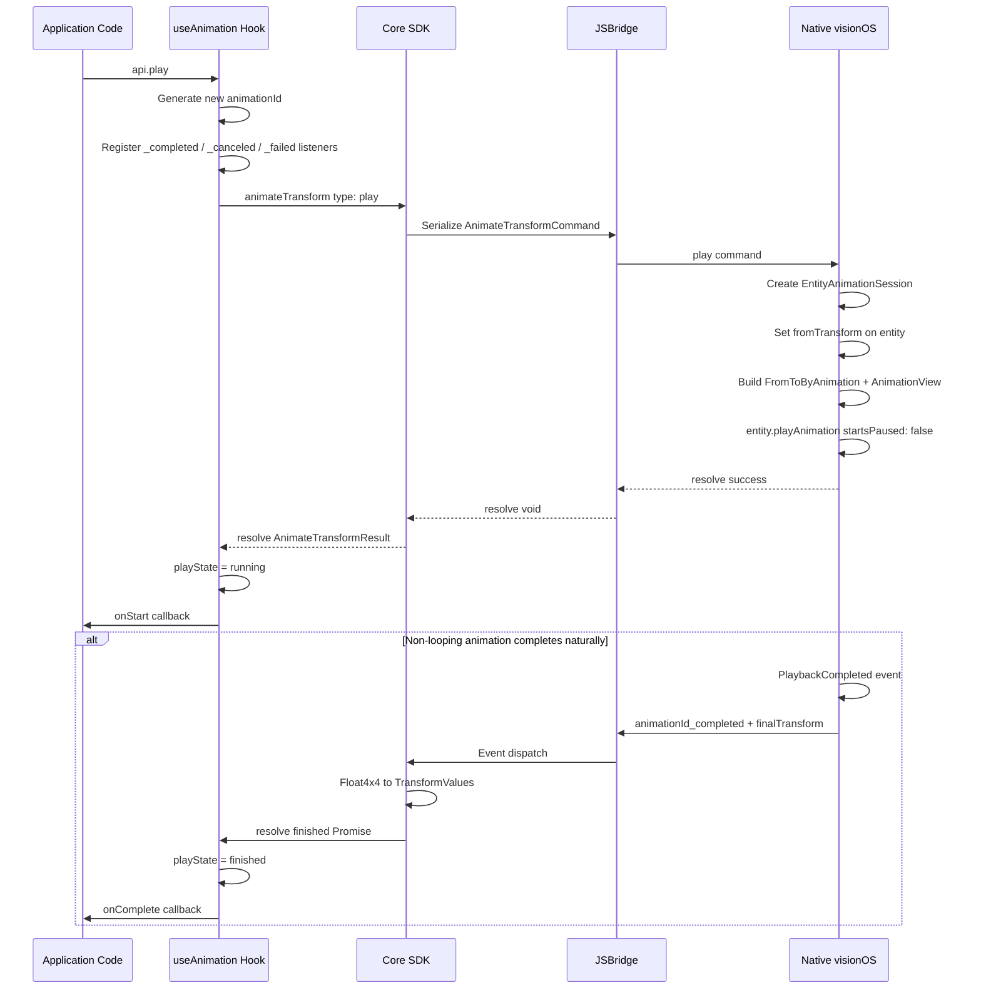
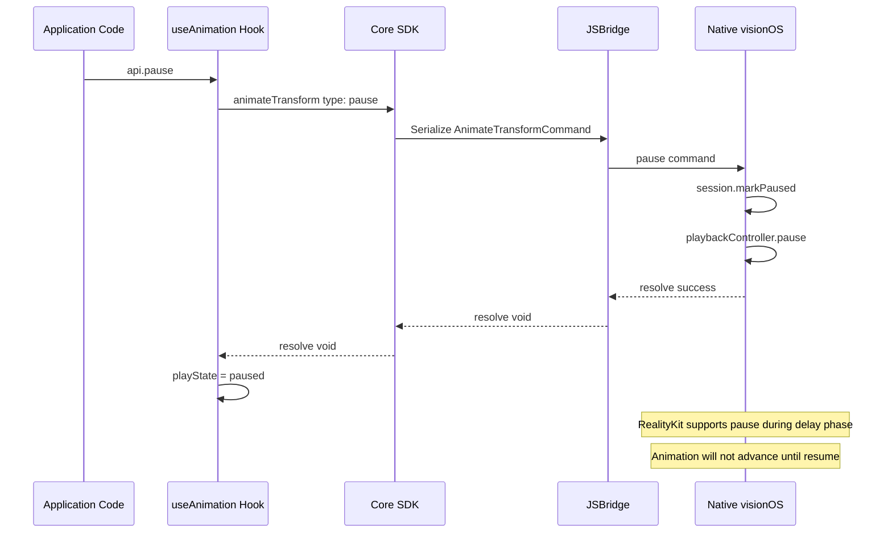
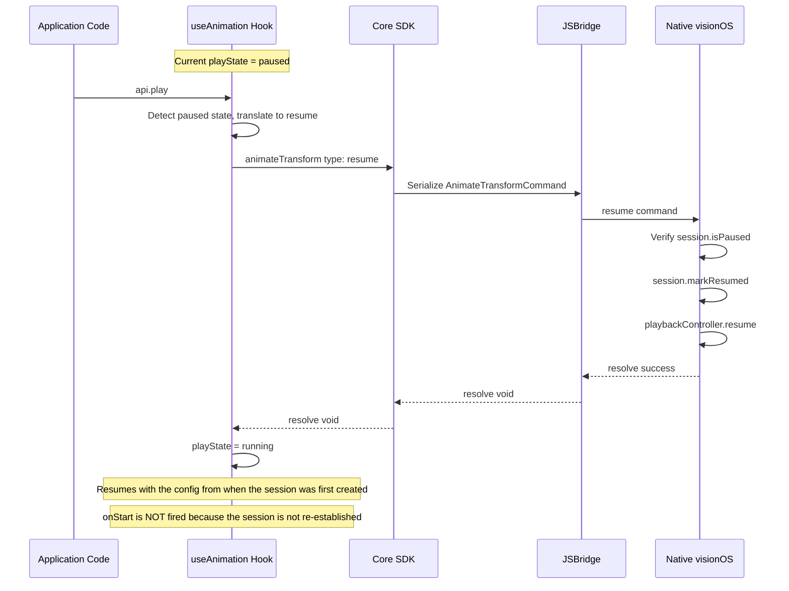
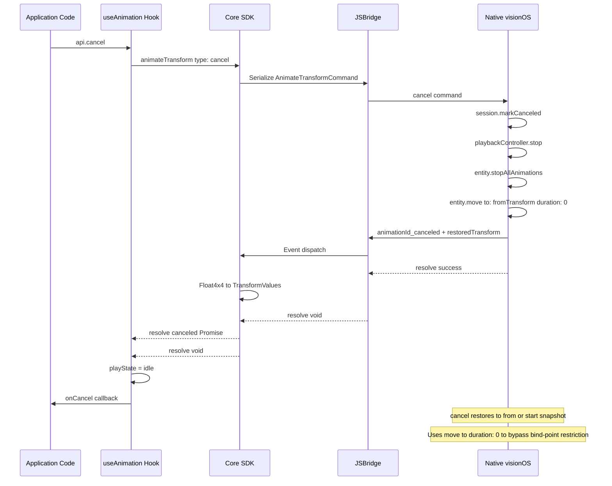

## Context

See the proposal for full motivation. In short: entity transform updates are currently instantaneous with no native transition support. This design covers the transform-only animation API, cross-layer contracts, and behavior rules needed to close that gap.

## Goals / Non-Goals

**Goals:**

- Define a stable public API for transform animation around `useAnimation(config)`, an entity `animation` prop, and `AnimationApi.play/pause/cancel/finished/playState`.
- Keep playback native-driven so transform animation does not depend on per-frame JS updates.
- Prevent React prop synchronization from fighting an alive animation session for the same transform field.
- Document runtime capability detection with `supports("useAnimation", ["entity"])`.
- Keep the design testable across React, core command flow, and native completion / cancel behavior.

**Non-Goals:**

- Animating non-transform properties such as material, opacity, or color.
- Extending `useAnimation` to React components that are not `Reality` entities, such as `SpatialDiv`, non-Reality-entity `Model` components, or any component that does not integrate with the `SpatialEntity` abstraction.
- Adding spring physics or arbitrary easing beyond the documented timing functions in this change.
- Solving large-angle rotation limitations beyond documenting current behavior.
- Adding a reactive runtime capability subscription model.
- Orchestrating multi-step animation sequences within a single hook (e.g. react-spring's `to: [...]` array or async script), staggered animations across entities (e.g. react-spring's `useTrail`), or cross-hook sequencing (e.g. react-spring's `useChain`). Application code can achieve basic sequencing via `onComplete` → `play()` chaining. Dedicated orchestration primitives may be considered in future versions.

## API Surface

The public contract centers on the `useAnimation` hook. The types below define the agreed shape; behavioral semantics are specified in the companion spec.

### Hook Signature

```typescript
function useAnimation(config: AnimationConfig): [AnimatedProps, AnimationApi]
```

### AnimationConfig

```typescript
interface AnimationConfig {
  /**
   * Target transform values (required).
   * Rotation values are Euler angles in degrees.
   * Single-axis rotation > 180° may produce unexpected results (shortest-path SLERP).
   */
  to: {
    position?: Vec3
    rotation?: Vec3  // degrees
    scale?: Vec3
  }

  /** Starting transform values. Omit to animate from the entity's current state. */
  from?: {
    position?: Vec3
    rotation?: Vec3
    scale?: Vec3
  }

  /** Duration in seconds. Default: 0.3 */
  duration?: number

  /**
   * Easing curve. Default: 'easeInOut'
   * Only these four values are valid; other strings will throw at validation time.
   */
  timingFunction?: 'linear' | 'easeIn' | 'easeOut' | 'easeInOut'

  /** Delay before playback starts, in seconds. Default: 0 */
  delay?: number

  /** Start automatically when the entity mounts. Default: true */
  autoStart?: boolean

  /**
   * Loop behavior.
   * - true: reset to `from` and replay (infinite reset loop)
   * - { reverse: true }: alternate direction each cycle (infinite reverse loop)
   * - undefined / false: play once
   */
  loop?: boolean | { reverse?: boolean }

  /**
   * Playback speed multiplier. Default: 1
   * Values > 1 speed up; values between 0 and 1 slow down.
   * Must be a positive finite number (> 0).
   * Applied at session creation time and remains constant for the session.
   * Maps to AnimationView.speed on the native (AVP) side.
   */
  playbackRate?: number

  /**
   * Called when the native session is established successfully; the first state may be delaying or running.
   * State changes caused by this command are observed asynchronously from native state events.
   */
  onStart?: () => void

  /** Called when a non-looping animation finishes naturally. Receives the final native transform. */
  onComplete?: (finalValues: TransformValues) => void

  /** Called when playback is canceled via api.cancel(). Receives the restored transform. */
  onCancel?: (currentValues: TransformValues) => void

  /**
   * Called when an asynchronous error occurs during a bridge or native operation.
   * If not provided, the SDK MUST log the error via console.error.
   */
  onError?: (error: AnimationError) => void
}
```

### AnimationError

```typescript
interface AnimationError {
  /** The session that encountered the error. */
  animationId: string
  /** The bridge command that failed. */
  command: 'play' | 'pause' | 'resume' | 'cancel'
  /** Optional machine-readable error code. */
  code?: string
  /** Human-readable failure reason. */
  reason: string
}
```

### AnimationApi

```typescript
interface AnimationApi {
  /** Start the animation, or continue it from paused progress. */
  play(): void

  /** Pause the animation at the current progress. */
  pause(): void

  /** Cancel the animation and restore `from`, or the start snapshot when `from` is omitted. */
  cancel(): void

  /** Whether the session is currently queued, delaying, or running (false while paused or idle). */
  readonly isAnimating: boolean

  /** Whether the animation is currently paused. */
  readonly isPaused: boolean

  /**
   * Current session state.
   *
   * Command methods are synchronous, but native-backed state changes are asynchronous.
   * After calling play()/pause()/cancel()/finish()/resume(), a same-tick read may still
   * return the previously committed state until the corresponding native state event arrives.
   * The queued/unbound path is the exception: it updates local queued state immediately.
   */
  readonly playState: 'idle' | 'queued' | 'running' | 'paused' | 'finished'

  /** Whether the most recent current session completed naturally. */
  readonly finished: boolean
}
```

### AnimatedProps

Opaque object returned as the first tuple element. Pass it directly to the entity's `animation` prop. Internally it carries metadata required for cross-layer communication:

```typescript
/**
 * Animation object — created by useAnimation, passed to the entity animation prop.
 * Application code should not read or modify its fields (all fields are @internal).
 */
interface AnimatedProps {
  /** @internal Unique identifier for this animation object instance */
  readonly __animationObjectId: string
  /** @internal Transform fields controlled by this animation */
  readonly __animatedFields: readonly ('position' | 'rotation' | 'scale')[]
  /** @internal Whether an alive animation session currently exists */
  readonly __animating: boolean
}

/**
 * @internal
 * Extended interface used internally by the entity layer to bind/unbind
 * animations and query suppressed transform fields.
 * Application code should never use this interface directly.
 */
interface AnimatedPropsInternal extends AnimatedProps {
  /** Called by the entity layer when the entity instance becomes available */
  __bind: (entity: SpatialEntity) => void
  /** Called by the entity layer when the entity is destroyed or animation prop changes */
  __unbind: () => void
  /** Returns transform fields currently suppressed by an alive session, or null */
  __getSuppressedFields: () => readonly ('position' | 'rotation' | 'scale')[] | null
}
```

- `__animatedFields`: Determined by which of `position`/`rotation`/`scale` are declared in `config.to`; fixed at hook creation time.
- `__animating`: `true` when an alive session exists (queued/delaying/running/paused); the entity layer uses this to decide whether to suppress React props synchronization for the corresponding fields.
- `__bind`/`__unbind`: Called by the entity component on mount/unmount or animation prop changes, ensuring the animation session is bound to the entity lifecycle.
- `__getSuppressedFields`: Called by the entity layer before performing transform synchronization, to skip fields controlled by the animation.

### TransformValues

```typescript
interface TransformValues {
  position?: Vec3
  rotation?: Vec3
  scale?: Vec3
}
```

## Usage Examples

### Entrance animation on mount

Animate position and scale together with a delay. `autoStart` defaults to `true`, so playback begins when the entity mounts.

```tsx
function FloatingBox() {
  const [animation] = useAnimation({
    from: { position: { x: 0, y: -1, z: -2 }, scale: { x: 0.1, y: 0.1, z: 0.1 } },
    to:   { position: { x: 0, y: 1, z: -2 },  scale: { x: 1, y: 1, z: 1 } },
    duration: 0.6,
    delay: 1.5,
    timingFunction: 'easeOut',
  })

  return (
    <Reality>
      <SceneGraph>
        <BoxEntity width={0.3} height={0.3} depth={0.3} animation={animation} />
      </SceneGraph>
    </Reality>
  )
}
```

### Manual trigger with play()

Set `autoStart: false` and call `api.play()` on interaction.

```tsx
function TapToMove() {
  const [animation, api] = useAnimation({
    from: { position: { x: -1, y: 0, z: -2 } },
    to:   { position: { x: 1, y: 0, z: -2 } },
    duration: 0.8,
    autoStart: false,
  })

  return (
    <Reality onSpatialTap={() => api.play()}>
      <SceneGraph>
        <BoxEntity width={0.3} height={0.3} depth={0.3} animation={animation} />
      </SceneGraph>
    </Reality>
  )
}
```

### Continuous reverse loop with pause / continue

Infinite back-and-forth rotation. Tap toggles pause and continue.

```tsx
function SpinningModel() {
  const [animation, api] = useAnimation({
    from: { rotation: { x: 0, y: 0, z: 0 } },
    to:   { rotation: { x: 0, y: 170, z: 0 } },
    duration: 2.0,
    timingFunction: 'linear',
    loop: { reverse: true },
  })

  return (
    <Reality
      onSpatialTap={() => {
        if (api.isPaused) {
          api.play()
        } else if (api.isAnimating) {
          api.pause()
        } else {
          api.play()
        }
      }}
    >
      <SceneGraph>
        <ModelEntity model="robot" scale={{ x: 0.2, y: 0.2, z: 0.2 }} animation={animation} />
      </SceneGraph>
    </Reality>
  )
}
```

### Cancel and reset state

During playback, the animation takes over `position` and ordinary prop updates are suppressed. After `cancel()`, the entity restores `from`, or the session start snapshot when `from` is omitted, so there is usually no need to sync the in-flight transform back into React state.

```tsx
function CancelAndReset() {
  const [animation, api] = useAnimation({
    from: { position: { x: 0, y: 0, z: -2 } },
    to: { position: { x: 2, y: 2, z: -2 } },
    duration: 3.0,
    autoStart: false,
  })

  return (
    <>
      <button onClick={() => api.play()}>Play</button>
      <button onClick={() => api.cancel()}>Cancel</button>
      <Reality>
        <SceneGraph>
          <BoxEntity
            width={0.3} height={0.3} depth={0.3}
            animation={animation}
          />
        </SceneGraph>
      </Reality>
    </>
  )
}
```


### Developer Tip: play() after pause resumes with original config

When the animation is paused, calling `play()` resumes the **same session** with
the config that was active when the session was first created. If you want to
apply updated config (e.g. a new `to` target or different `duration`), call
`cancel()` first and then `play()` to start a fresh session with the latest
config.

```tsx
// ✅ Resume paused animation (uses original config)
api.play()

// ✅ Restart with new config
api.cancel()
api.play() // new session picks up latest config from hook
```

### Controlling playback speed with playbackRate

Use `playbackRate` to adjust animation speed. Values > 1 speed up, values between 0 and 1 slow down. Must be positive.
`playbackRate` is applied at session creation and remains constant for the session; to change the rate, `cancel()` and then `play()` again.

```tsx
function FastEntry() {
  const [animation] = useAnimation({
    from: { position: { x: 0, y: -1, z: -2 }, scale: { x: 0.1, y: 0.1, z: 0.1 } },
    to:   { position: { x: 0, y: 1, z: -2 },  scale: { x: 1, y: 1, z: 1 } },
    duration: 1.0,
    playbackRate: 2.0, // plays at 2x speed, effective duration 0.5s
    timingFunction: 'easeOut',
  })

  return (
    <Reality>
      <SceneGraph>
        <BoxEntity width={0.3} height={0.3} depth={0.3} animation={animation} />
      </SceneGraph>
    </Reality>
  )
}
```

### Reacting to animation state with playState

`api.playState` provides the precise current session state: `idle`, `queued`, `running`, `paused`, or `finished`.
Use it to show different UI feedback depending on the animation state, or to conditionally enable/disable controls.
When the animation is already bound to native playback, state changes are delivered asynchronously; if you read
`api.playState` immediately after a command call in the same tick, you may still observe the previously committed state
until the matching native event is processed. The unbound queued path updates locally right away.

```tsx
function StateAwareBox() {
  const [animation, api] = useAnimation({
    from: { position: { x: -1, y: 0, z: -2 } },
    to:   { position: { x: 1, y: 0, z: -2 } },
    duration: 1.0,
    autoStart: false,
  })

  const label = {
    idle: 'Ready',
    queued: 'Queued',
    running: 'Playing',
    paused: 'Paused',
    finished: 'Done',
  }[api.playState]

  return (
    <>
      <div className="controls">
        <span>State: {label}</span>
        <button onClick={() => api.play()} disabled={api.playState === 'running'}>
          Play
        </button>
        <button onClick={() => api.pause()} disabled={api.playState !== 'running'}>
          Pause
        </button>
        <button onClick={() => api.cancel()} disabled={api.playState === 'idle'}>
          Cancel
        </button>
      </div>
      <Reality>
        <SceneGraph>
          <BoxEntity width={0.3} height={0.3} depth={0.3} animation={animation} />
        </SceneGraph>
      </Reality>
    </>
  )
}
```

## Animation State Machine

The animation session lifecycle is defined by five states and their transition rules:

### State Definitions

| State | Meaning | `isAnimating` | `isPaused` | `finished` |
|---|---|---|---|---|
| `idle` | Initial state; `play()` not yet called or session terminated | `false` | `false` | `false` |
| `queued` | Entity not yet bound to a RealityKit scene; waiting for binding | `true` | `false` | `false` |
| `running` | Animation is playing (includes delay waiting period) | `true` | `false` | `false` |
| `paused` | Animation is paused; can be resumed from current progress | `false` | `true` | `false` |
| `finished` | Non-looping animation completed naturally | `false` | `false` | `true` |

### State Transition Diagram



### Transition Rules

- **idle → queued**: `play()` called while entity is not yet rendered under `Reality` / `SceneGraph`; animation enters queued waiting.
- **idle → running**: `play()` called while entity is bound; native session established successfully.
- **queued → running**: Entity mounts to the scene and automatically transitions to playing.
- **queued → paused**: `pause()` called during queued state; the pending play request is frozen and remains paused after binding until `play()` is called again.
- **running → paused**: `pause()` called; native `AnimationPlaybackController.pause()`.
- **running → finished**: Non-looping animation completes naturally; native sends `_completed` event.
- **paused → queued**: `play()` resumes a paused pending request before a native session exists.
- **paused → running**: `play()` resumes an established native session via `AnimationPlaybackController.resume()`.
- **Any alive state → idle**: `cancel()` called; entity restores to `from` (or start snapshot); native sends `_canceled` event.
- **finished → idle**: `cancel()` called or a new `play()` starts a fresh session.

## API Call Sequences

### play Sequence



### pause Sequence



### play after pause (resume) Sequence

When an established native animation session is in the `paused` state, calling `play()` resumes the same session. The React SDK translates the public `play()` into an internal `resume` command, but this detail is not exposed to applications. If `pause()` was called while the session was still queued, `play()` instead resumes the pending play request and establishes the native session when the entity is bound.



### cancel Sequence



## Native visionOS Implementation Overview

The native side of this design is built on the RealityKit animation framework. The core mapping is as follows:

### RealityKit API Mapping

| Design Concept | RealityKit API | Description |
|---|---|---|
| Animation definition | `FromToByAnimation<Transform>` | Transform animation from `from` to `to`, supporting timing and repeatMode |
| Delay and speed | `AnimationView` | Wraps animation resource, providing `delay` and `speed` parameters |
| Playback control | `AnimationPlaybackController` | Provides `pause()` / `resume()` / `stop()` methods |
| Completion detection | `AnimationEvents.PlaybackCompleted` | Scene event subscription to detect natural completion of non-looping animations |
| Easing curves | `AnimationTimingFunction` | Supports `.linear` / `.easeIn` / `.easeOut` / `.easeInOut` |
| Loop mode | `AnimationRepeatMode` | `.none` play once, `.repeat` reset loop, `.autoReverse` reverse loop |
| Execute animation | `Entity.playAnimation` | Plays an AnimationResource on an entity |
| Restore position | `Entity.move(to:relativeTo:duration:0)` | Zero-duration animation bypasses bind-point restriction, safely sets transform |

### Key Implementation Details

1. **Animation construction**: `FromToByAnimation<Transform>` defines the from→to transform animation, wrapped by `AnimationView` to apply `delay` and `speed`, then compiled into a playable resource via `AnimationResource.generate(with:)`.

2. **Playback and control**: `entity.playAnimation()` returns an `AnimationPlaybackController`; subsequent `pause()` / `resume()` / `stop()` calls all go through this controller. RealityKit supports pause and resume even during the delay phase.

3. **Cancel restore mechanism**: When `cancel()` is called, the controller is `stop()`ped, `stopAllAnimations()` removes all animation resources, then `entity.move(to:duration:0)` restores the entity to its `from` position. Direct assignment to `entity.transform.matrix` is rejected by RealityKit's bind-point system, so a zero-duration animation is used to safely take over bind-point ownership.

4. **Completion events**: Non-looping animations subscribe to completion via `scene.subscribe(to: AnimationEvents.PlaybackCompleted.self)`; looping animations do not subscribe since they never complete naturally.

5. **Session management**: `EntityAnimationManager` manages all active sessions keyed by `animationId`, with at most one active session per entity at any time. Sessions are automatically cleaned up when an entity is unmounted.


## Native PicoOS Implementation Overview

The PicoOS side is built on the PICO Spatial SDK animation framework, maintaining the same semantic and behavioral contract as the visionOS side. At runtime, it receives `AnimateTransform` commands via WebView JSBridge and maps them internally to the Spatial SDK's Tween Animation system.

### PICO Spatial SDK API Mapping

| Design Concept | PICO Spatial SDK API | Description |
|---|---|---|
| Animation definition | `TweenAnimation.createTweenAnimation()` | Creates a tween animation specifying from/to Transform, duration, easeType |
| Bind target | `AnimationBindTarget.bindTransform()` | Binds the animation to the entity's transform property |
| Generate resource | `AnimationResource.generateWithTweenAnimation()` | Generates a playable AnimationResource from TweenAnimation |
| Playback control | `AnimationPlaybackController` | Returned by `entity.playAnimation()`, provides `pause()` / `resume()` / `stop()` |
| Completion detection | `AnimationEvents.Completed` | Subscribed via `Scene.subscribe(AnimationEvents.Completed, entity, null)` |
| Easing curves | `EaseType` | `LINEAR` / `EASE_IN` / `EASE_OUT` / `EASE_INOUT` |
| Loop mode | `RepeatMode` + `repeatCount` | `NONE` play once, `RESTART` reset loop, `REVERSE` reverse loop; `repeatCount = -1` for infinite |
| Execute animation | `Entity.playAnimation()` | Plays an AnimationResource on an entity, returns controller |
| Restore position | Direct `entity.transform` assignment | On cancel, restores to from state via matrix assignment |

### Key Implementation Details

1. **Animation construction**: `TweenAnimation.createTweenAnimation()` specifies start/end Transform (column-major 4×4 matrix), `duration`, and `easeType`. The animation is then bound to the entity's transform via `AnimationBindTarget.bindTransform()`, and finally `AnimationResource.generateWithTweenAnimation()` generates the playable resource.

2. **Playback and control**: `entity.playAnimation(resource)` returns an `AnimationPlaybackController`; subsequent `pause()` / `resume()` / `stop()` calls all go through this controller.

3. **Cancel restore mechanism**: When cancel is called, the controller is `stop()`ped first, then `entity.transform` is directly set back to `fromTransform`. PicoOS does not have the visionOS bind-point restriction, so direct assignment works. After restoration, a `{animationId}_canceled` event is sent via `sendWebMsg`.

4. **Completion events**: Non-looping animations subscribe to completion via `scene.subscribe(AnimationEvents.Completed::class.java, entity, null)`, validating `event.playbackController` reference consistency in the callback to filter events from non-current sessions. Looping animations do not subscribe.

5. **Session management**: `EntityAnimationManager` manages all active `EntityAnimationSession` instances keyed by `animationId`, with at most one active session per entity (a new play automatically cancels the old session). Cleanup via `cancelAllForEntity()` is performed when an entity is unmounted.

6. **JSB routing**: The command class name `AnimateTransform` matches the JS-side `commandType` field exactly, and is automatically dispatched via `JSBManager`'s `Class.simpleName` routing mechanism.

### PicoOS Version Requirements

- **Minimum version**: PicoWebApp Runtime `0.2.2` (UA identifier `PicoWebApp/0.2.2`)
- **Capability detection**: `supports(useAnimation, [entity])` returns `true` in the picoOS capability table starting from version `0.2.2`

## Cross-Platform Compatibility

The following tables compare the visionOS (AVP) and PicoOS implementations of Entity Transform Animation:

### Capabilities and Versions

| Dimension | visionOS (AVP) | PicoOS |
|---|---|---|
| Minimum supported version | visionOS 1.5+ | PicoWebApp 0.2.2+ |
| Capability detection | `supports(useAnimation, [entity])` → `true` | `supports(useAnimation, [entity])` → `true` (≥ 0.2.2) |
| SDK dependency | RealityKit (Apple) | PICO Spatial SDK 0.10.3+ |
| Development language | Swift | Kotlin |

### Animation Feature Comparison

| Feature | visionOS (AVP) | PicoOS |
|---|---|---|
| Animated properties | position / rotation / scale | position / rotation / scale |
| Easing curves | linear / easeIn / easeOut / easeInOut | linear / easeIn / easeOut / easeInOut |
| Loop modes | none / repeat / autoReverse | none / restart / reverse |
| Infinite loop | `repeatMode = .repeat` / `.autoReverse` implicitly infinite | `repeatCount = -1` for infinite |
| Delay | `AnimationView.delay` | `TweenAnimation` duration offset |
| Playback rate | `AnimationView.speed` | `AnimationPlaybackController.speed` |
| Pause / Resume | `controller.pause()` / `.resume()` | `controller.pause()` / `.resume()` |
| Cancel restore | `entity.move(to:duration:0)` zero-duration animation | Direct `entity.transform` matrix assignment |
| Completion event | `AnimationEvents.PlaybackCompleted` | `AnimationEvents.Completed` |

### JSBridge Protocol Comparison

| Protocol Element | visionOS (AVP) | PicoOS |
|---|---|---|
| Command name | `AnimateTransform` | `AnimateTransform` |
| Command types | `play` / `pause` / `resume` / `cancel` | `play` / `pause` / `resume` / `cancel` |
| Transform format | column-major Float4x4 (16 Double) | column-major Float4x4 (16 Double) |
| Completion event name | `{animationId}_completed` | `{animationId}_completed` |
| Cancel event name | `{animationId}_canceled` | `{animationId}_canceled` |
| Failure event name | `{animationId}_failed` | `{animationId}_failed` |

### Platform Differences and Notes

1. **Cancel restore approach**: visionOS cannot directly assign transform due to RealityKit's bind-point system restriction; it uses `entity.move(to:duration:0)` zero-duration animation as a workaround. PicoOS has no such restriction and directly sets `entity.transform`.
2. **Infinite loop expression**: visionOS expresses infinite looping directly via `AnimationRepeatMode.repeat` / `.autoReverse` (setting repeatMode implicitly means infinite repetition, no repeatCount field). PicoOS uses `repeatCount = -1` (PICO SDK convention).
3. **Speed control layer**: visionOS sets `speed` at the `AnimationView` wrapper layer; PicoOS sets it on `AnimationPlaybackController` (both yield identical external behavior).
4. **Event name differences**: visionOS completion event type is `AnimationEvents.PlaybackCompleted`, PicoOS uses `AnimationEvents.Completed` (both map to the same JSBridge event name `_completed`).
5. **Transform synchronization**: Both platforms follow the same per-field suppression strategy — fields controlled by animation suppress React props synchronization during the session.

## Cross-Layer Contracts

### React SDK → Core SDK

React calls one method on `SpatialEntity` to drive the full animation lifecycle. Public `api.play()` resumes the current session when it is paused; the React SDK MAY translate that into an internal `resume` command, but that detail is not exposed to applications:

```typescript
interface SpatialEntity {
  /**
   * For a `play` command, resolves with an `AnimateTransformResult` that
   * carries `finished` and `canceled` promises for the new session.
   * For `pause`, `resume`, and `cancel` commands, resolves with `void`
   * once the command has been acknowledged by native (no new result object).
   */
  animateTransform(command: AnimateTransformCommand & { type: 'play' }): Promise<AnimateTransformResult>
  animateTransform(command: AnimateTransformCommand): Promise<void>
}

interface AnimateTransformCommand {
  /**
   * Identifies the animation session. A new globally-unique `animationId`
   * MUST be generated for each `play` command. `pause`, `resume`, and `cancel`
   * commands MUST reuse the `animationId` from the `play` command that
   * created the session.
   */
  animationId: string
  type: 'play' | 'pause' | 'resume' | 'cancel'
  /** Required when type is 'play'; ignored otherwise. */
  entityId?: string
  toTransform?: Float4x4
  fromTransform?: Float4x4
  duration?: number
  timingFunction?: 'linear' | 'easeIn' | 'easeOut' | 'easeInOut'
  delay?: number
  loop?: boolean | { reverse?: boolean }
  /** Playback speed multiplier. Default: 1. Must be positive (> 0). Maps to AnimationView.speed on AVP. */
  playbackRate?: number
}

interface AnimateTransformResult {
  animationId: string
  /** Resolves when a non-looping animation completes naturally. Never resolves for infinite loops. */
  finished: Promise<TransformValues>
  /**
   * Resolves when the animation is canceled and restored to `from`.
   * After cancel, `finished` MUST remain pending (not rejected).
   */
  canceled: Promise<TransformValues>
}
```

React SDK is responsible for converting `AnimationConfig` (Vec3 + Euler degrees) to `Float4x4` before calling `animateTransform`.

Core SDK is responsible for converting native `Float4x4` payloads back to `TransformValues` (Vec3 + degrees) before resolving `finished` / `canceled` and before invoking lifecycle callbacks.

If the entity unmounts while an alive session exists, the SDK MUST stop/cancel the native session but MUST NOT resolve `finished` or `canceled` (and MUST NOT invoke lifecycle callbacks after unmount).

`animateTransform(...)` MAY reject only when a command cannot be submitted before native accepts it. Once command submission succeeds, any later asynchronous failure MUST be reported through the `{animationId}_failed` event instead of through the `finished` / `canceled` promises.

### Core SDK ↔ Native (JSBridge)

**JS → Native command:** a single `AnimateTransform` command with `type` discriminator, matching the `AnimateTransformCommand` shape above. Core SDK serializes and sends it over the bridge.

**Native → JS events:**

| Event name | Trigger | Payload |
|---|---|---|
| `{animationId}_completed` | Animation finishes naturally (all loops done) | `TransformValues` — final transform (converted by Core from native `Float4x4`) |
| `{animationId}_canceled` | `cancel()` called | `TransformValues` — restored `from` transform, or the start snapshot if `from` is omitted (converted by Core from native `Float4x4`) |
| `{animationId}_failed` | An asynchronous `play` / `pause` / `resume` / `cancel` failure occurs | `AnimationError` — at least `animationId`, `command`, and `reason`, with optional `code` |

`_completed`, `_canceled`, and `_failed` listeners MUST be registered before sending the `play` command to avoid race conditions where a terminal or failure event fires before listeners are ready.

`animationId` MUST be globally unique within a runtime process so event names do not collide across entities or sessions.

For a given `animationId`:

- After `play` establishes a session successfully, native MUST emit exactly one terminal event (`_completed` or `_canceled`) and they MUST be mutually exclusive.
- If `play` fails asynchronously, native MUST emit `_failed` at most once and MUST NOT emit `_completed` or `_canceled` afterward.
- If `pause`, `resume`, or `cancel` fails asynchronously, native MUST emit `_failed` at most once for that failed command; the session remains in its pre-failure state and MAY still emit `_completed` or `_canceled` later.

## Decisions

1. **Public API uses `useAnimation` plus an entity `animation` prop**
   - The reviewed docs prefer an explicit `animation` prop over spreading animation data into normal entity props.
   - The public verbs are `play()`, `pause()`, and `cancel()`, with `play()` also resuming a paused session so the API reads closer to the Web Animation API.
   - The `animation` prop is only accepted by entity components that integrate with the `SpatialEntity` abstraction; this restriction is enforced statically through TypeScript types rather than expanded runtime checks on non-entity components. At runtime, if the entity is never rendered under `Reality` / `SceneGraph`, playback enters `queued` and remains there until the entity binds or unmounts.
   - Alternative considered: spread returned animated props directly onto the entity. Rejected because it mixes hidden animation metadata with normal entity props and makes collisions harder to reason about.

2. **React stores config separately from the render-facing animation object**
   - Hook configuration such as `from`, `to`, callbacks, timing, and loop settings stays in hook-owned state or refs.
   - The render-facing `animation` object only carries transform targets and internal binding metadata needed by the entity component.
   - Config updates apply to the next `play()` and MUST NOT modify an alive session.
   - Alternative considered: put the full config on the entity prop. Rejected because it couples render payload and control payload, and it increases accidental re-render churn.

3. **Core and native layers use a unified animation command contract**
   - The latest reviewed design consolidates play, pause, resume, and cancel into one animation command with a `type` discriminator instead of four separate commands.
   - This reduces JSBridge registration overhead, keeps control flow centralized, and matches the fact that all operations address one animation session identified by `animationId`.
   - Alternative considered: separate command types per action. Rejected because it duplicates registration and parsing without improving the public contract.
4. **Playback runs on the native side and reports terminal transform state back to JS**
   - Native playback owns the animation session, timing, delay, loop behavior, and pause / resume state.
   - JS receives completion and cancel results so callbacks can observe the actual final or restored transform from native state.
   - Alternative considered: emulate motion in JS and stream transform updates over the bridge. Rejected because it adds bridge traffic, risks jitter, and weakens parity with the reviewed RealityKit-based design.
   - **Cancel semantics:** when `cancel()` is called, the entity restores to that session's `from` state; if `from` is omitted, it restores to the start snapshot captured at that session's first `play`. The native side reports that restored transform back via the canceled event, and `onCancel` receives the restored value as well.

5. **Entity transform synchronization uses per-field animation suppression**
   - While animation controls a specific field, ordinary transform syncing for that field is suppressed so React re-renders do not race the alive animation session controlling that field.
   - Untargeted transform fields continue to behave exactly as they do today.
   - Alternative considered: freeze all transform syncing while any alive animation session exists. Rejected because it unnecessarily blocks unrelated transform updates.
   - **Suppression release timing:** field-level suppression is lifted when the animation session ends (via completion or cancel). The `__animating` flags are cleared before the lifecycle callback fires, so the next React render cycle after the callback will resume ordinary transform synchronization for the previously animated fields.

6. **Capability detection is explicit and top-level**
   - `supports("useAnimation", ["entity"])` documents whether the end-to-end animation feature is available in the current runtime.
   - Applications can branch on capability before depending on the animation API in environments that do not yet implement the native bridge path.
   - Alternative considered: no dedicated capability key. Rejected because the review explicitly calls out feature detection as part of the external contract.
   - Future versions may introduce additional sub-tokens (e.g. `supports("useAnimation", ["opacity"])`) for feature-granular detection. The current contract requires `["entity"]` as the only supported sub-token; passing any other sub-token returns `false`.

7. **Unsupported runtimes surface a warning**
   - When `useAnimation` is used in a runtime where `supports("useAnimation", ["entity"])` is `false`, the SDK should surface a warning instead of failing silently.
   - The warning should be emitted at most once per hook instance to avoid log spam.
   - This keeps capability misuse visible during integration without changing the capability contract itself.

8. **Invalid animation config is treated as a programmer error**
   - Invalid config such as unsupported loop shape, missing animation targets, or nonsensical timing values should throw rather than be ignored.
   - This keeps failures close to the call site and avoids debugging ambiguous partial playback behavior.

9. **Entity integration should land in the shared abstraction first**
   - The new `animation` prop should be wired through the common entity abstraction layer before touching leaf entity components.
   - This minimizes duplicated logic and keeps transform synchronization behavior consistent across entity types.

10. **Asynchronous bridge errors surface via `onError` callback, not throw**
    - `play()`, `pause()`, and `cancel()` remain synchronous `void` methods. Errors that occur asynchronously during the bridge/native round-trip are delivered through the `onError` callback on `AnimationConfig` (or `console.error` if `onError` is not provided).
    - Synchronous `throw` is reserved for programmer errors detectable at call time (invalid config, multi-entity bind).
    - This separates two error categories: (1) developer mistakes caught immediately via throw, (2) runtime/infrastructure failures reported asynchronously via callback.
    - Native reports asynchronous failures via the `{animationId}_failed` event. The payload contains at least `animationId`, `command`, and `reason`, and MAY include a machine-readable `code`.
    - A failed `play` means the session never became alive, so `_completed` / `_canceled` must not follow. A failed `pause`, `resume`, or `cancel` affects only that command attempt and leaves the session in its pre-failure state. If the failure happens while `play()` is resuming a paused session, the bridge/native `AnimationError.command` MUST surface as `resume`.
    - react-spring has no `onError` equivalent because its animations run entirely in JS with no remote failure path. Our architecture delegates playback to native via JSBridge, introducing a real async failure mode that requires an explicit error channel.
    - Alternative considered: change the API to `play(): Promise<void>`. Rejected because it forces every call site to handle Promises, increases ceremony for the common success path, and diverges from the fire-and-forget style of react-spring's imperative API.

11. **A failed cancel-old step MUST block start-new**
    - For `play()`-driven restart and animation-prop replacement flows, if canceling the old session fails, the SDK MUST surface `onError` and preserve the old session's pre-failure state.
    - In that failure case, the SDK MUST NOT start the new session and MUST NOT fire the new session's `onStart`.

## Risks / Trade-offs

- **Risk:** API drift between reviewed docs and implementation -> **Mitigation:** lock the OpenSpec contract around `play`, `animation` prop, `loop`, and lifecycle callbacks before editing code.
- **Risk:** React re-renders still leak competing transform updates -> **Mitigation:** add targeted tests for mixed animated and non-animated fields and wire suppression at the entity transform sync boundary.
- **Risk:** Native playback edge cases around delay, cancel, and completion ordering -> **Mitigation:** keep a single animation session record keyed by `animationId` and verify callback ordering in tests.
- **Risk:** Runtime support differs across environments -> **Mitigation:** gate the feature with `supports("useAnimation", ["entity"])` and document conservative false behavior.
- **Risk:** Bridge overhead could accumulate for complex animation orchestration -> **Mitigation:** a single play command equals 1 bridge call; during playback there are zero per-frame bridge calls; terminal events add at most 1 callback per session (completion or cancel). Total bridge traffic per animation lifecycle is bounded at 2–3 calls regardless of duration or frame count.
- **Risk:** Rotation behavior surprises developers for large angles -> **Mitigation:** document the limitation and keep the first version scoped to the reviewed transform behavior.

## Migration Plan

- Ship as an additive API in React and core SDK layers.
- Update capability tables and public docs in the same change so applications can safely branch on support.
- Validate the feature in test-server examples before relying on it in broader samples.
- If rollout needs to pause, disable the capability key and avoid exposing the feature in public exports until native support is complete.

## Resolved Follow-ups

- Unsupported runtimes should emit a warning when `useAnimation` is used without a successful capability check.
- Invalid animation config should throw instead of being silently ignored.
- Entity integration should go through the shared abstraction layer first to avoid duplicated component changes.
