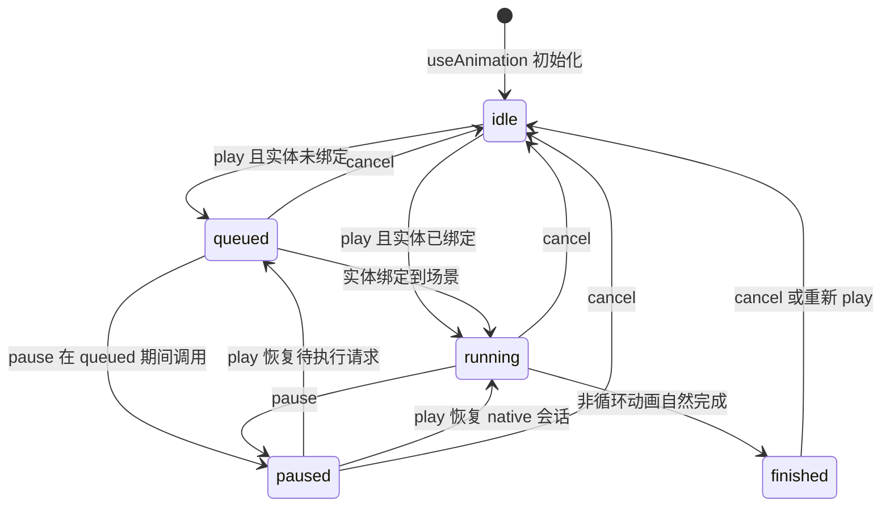
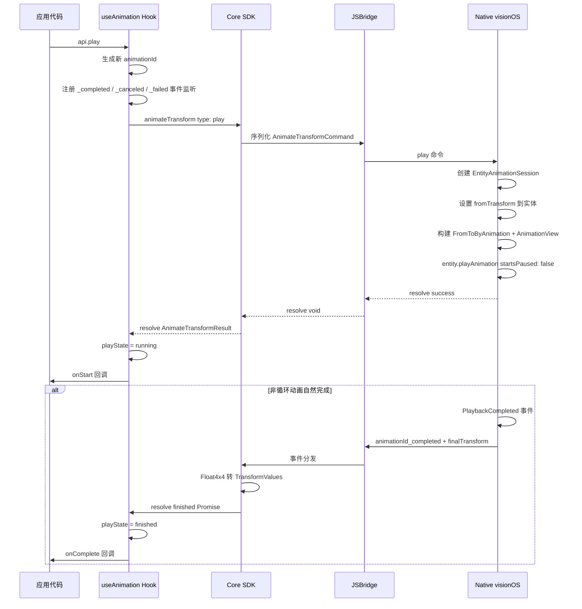
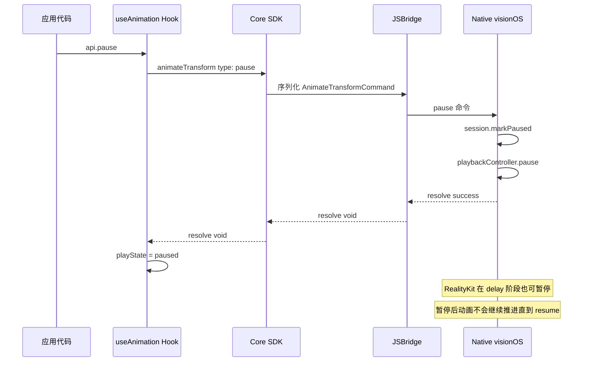
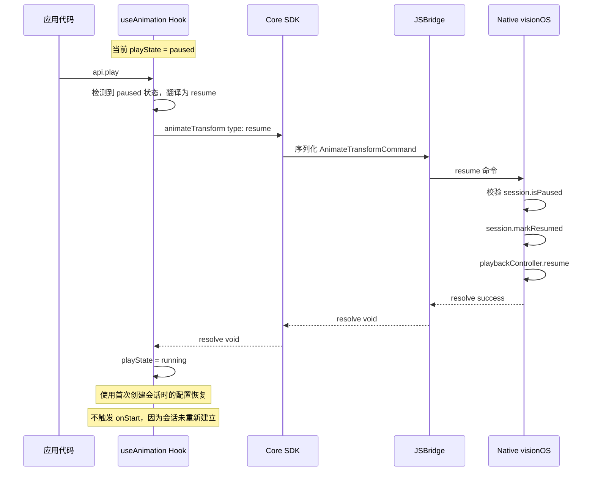
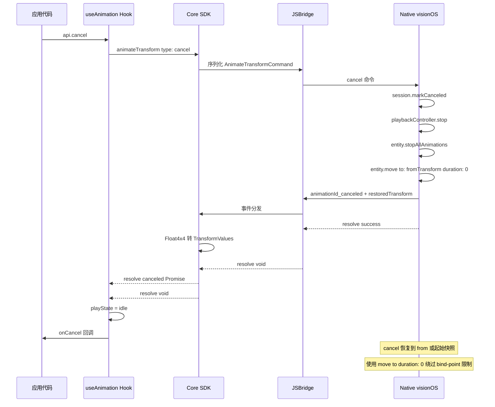

## 背景

完整动机见 proposal。简言之：实体 transform 更新目前是瞬时跳变，缺少 native 过渡能力。本设计文档覆盖 transform-only 动画 API、跨层契约及行为规则。

## 目标 / 非目标

**目标：**

- 围绕 `useAnimation(config)`、实体 `animation` prop 与 `AnimationApi.play/pause/cancel/finished/playState` 定义稳定的对外 API。
- 保持动画由 Native 驱动，避免依赖逐帧 JS 更新。
- 在动画控制某个字段时，避免 React props 同步与动画对同一字段发生竞争。
- 通过 `supports("useAnimation", ["entity"])` 文档化运行时能力检测。
- 使该设计在 React、Core 命令流与 Native 完成/取消行为上可测试、可验证。

**非目标：**

- 支持材质、透明度、颜色等非 transform 属性动画。
- 将 `useAnimation` 扩展到非 `Reality` Entity 的 React 组件，例如 `SpatialDiv`、非 Reality Entity 的普通 `Model` 组件，或其他未接入 `SpatialEntity` 抽象的组件。
- 在本次变更中引入弹簧物理或超出既定范围的复杂 easing。
- 在本次变更中解决大角度旋转等限制（仅文档化现状与边界行为）。
- 引入运行时能力的订阅/动态刷新模型。
- 在单个 hook 内编排多步动画序列（如 react-spring 的 `to: [...]` 数组或 async 脚本）、跨实体的交错动画（如 react-spring 的 `useTrail`）或跨 hook 的顺序编排（如 react-spring 的 `useChain`）。应用代码可通过 `onComplete` → `play()` 链式调用实现基本串联。后续版本可能引入专门的编排原语。

## API 外形

对外契约以 `useAnimation` Hook 为核心。以下类型定义了约定的 API 形状；具体行为语义见配套的 spec 文档。

### Hook 签名

```typescript
function useAnimation(config: AnimationConfig): [AnimatedProps, AnimationApi]
```

### AnimationConfig

```typescript
interface AnimationConfig {
  /**
   * 目标 transform 值（必填）。
   * rotation 值为角度制（degrees）的欧拉角。
   * 单轴超过 180° 的旋转可能因最短路径 SLERP 产生非预期结果。
   */
  to: {
    position?: Vec3
    rotation?: Vec3  // 角度制
    scale?: Vec3
  }

  /** 起始 transform 值。省略则从实体当前状态开始。 */
  from?: {
    position?: Vec3
    rotation?: Vec3
    scale?: Vec3
  }

  /** 时长，单位秒。默认 0.3 */
  duration?: number

  /**
   * 缓动曲线。默认 'easeInOut'
   * 仅接受这四个值，其他字符串在校验时抛错。
   */
  timingFunction?: 'linear' | 'easeIn' | 'easeOut' | 'easeInOut'

  /** 播放前延迟，单位秒。默认 0 */
  delay?: number

  /** 实体挂载后是否自动播放。默认 true */
  autoStart?: boolean

  /**
   * 循环行为。
   * - true：回到 from 重新播放（无限 reset 循环）
   * - { reverse: true }：每轮反向（无限 reverse 循环）
   * - undefined / false：播放一次
   */
  loop?: boolean | { reverse?: boolean }

  /**
   * 播放速率倍数。默认：1
   * 大于 1 加速；0 到 1 之间减速。
   * 必须为正有限数（> 0）。
   * 在会话创建时应用，整个会话期间保持不变。
   * 对应 Native（AVP）侧的 AnimationView.speed 参数。
   */
  playbackRate?: number

  /** native 会话成功建立后触发；首个状态可为 delaying 或 running。 */
  onStart?: () => void

  /** 非循环动画自然结束时触发，携带 Native 侧最终 transform。 */
  onComplete?: (finalValues: TransformValues) => void

  /** 通过 api.cancel() 取消时触发，携带恢复后的 transform。 */
  onCancel?: (currentValues: TransformValues) => void

  /**
   * bridge 或 native 异步操作失败时触发。
   * 若未提供，SDK MUST 通过 console.error 输出错误。
   */
  onError?: (error: AnimationError) => void
}
```

### AnimationError

```typescript
interface AnimationError {
  /** 发生错误的会话。 */
  animationId: string
  /** 失败的 bridge 命令。 */
  command: 'play' | 'pause' | 'resume' | 'cancel'
  /** 可选的机器可读错误码。 */
  code?: string
  /** 人类可读的失败原因。 */
  reason: string
}
```

### AnimationApi

```typescript
interface AnimationApi {
  /** 启动动画；若当前处于 paused，则从暂停处继续。 */
  play(): void

  /** 在当前进度暂停。 */
  pause(): void

  /** 取消动画，实体恢复到 `from`；若省略 `from` 则恢复到起始快照。 */
  cancel(): void

  /** 当前是否处于 queued、delaying 或 running 状态（paused 或 idle 时为 false）。 */
  readonly isAnimating: boolean

  /** 当前是否处于暂停状态。 */
  readonly isPaused: boolean

  /** 当前会话状态。 */
  readonly playState: 'idle' | 'queued' | 'running' | 'paused' | 'finished'

  /** 最近一个当前有效会话是否已自然完成。 */
  readonly finished: boolean
}
```

### AnimatedProps

Hook 返回元组的第一个元素。对应用代码而言是不透明对象，直接传给实体的 `animation` prop 即可。内部携带跨层通信所需的元数据：

```typescript
/**
 * 动画对象——由 useAnimation 创建，传递给实体 animation prop。
 * 应用代码不应直接读取或修改其字段（所有字段均为 @internal）。
 */
interface AnimatedProps {
  /** @internal 唯一标识此动画对象实例 */
  readonly __animationObjectId: string
  /** @internal 本次动画控制的 transform 字段列表 */
  readonly __animatedFields: readonly ('position' | 'rotation' | 'scale')[]
  /** @internal 当前是否存在 alive 的动画会话 */
  readonly __animating: boolean
}

/**
 * @internal
 * 实体层内部使用的扩展接口，用于绑定/解绑动画并查询被抑制的 transform 字段。
 * 应用代码不应直接使用此接口。
 */
interface AnimatedPropsInternal extends AnimatedProps {
  /** 当实体实例可用时由实体层调用，建立动画 → 实体绑定 */
  __bind: (entity: SpatialEntity) => void
  /** 当实体销毁或 animation prop 变更时由实体层调用，解除绑定 */
  __unbind: () => void
  /** 返回当前被 alive 会话抑制的 transform 字段，无会话时返回 null */
  __getSuppressedFields: () => readonly ('position' | 'rotation' | 'scale')[] | null
}
```

- `__animatedFields`：由 `config.to` 中声明了 `position`/`rotation`/`scale` 的字段决定，在 hook 创建时确定。
- `__animating`：当存在 alive 会话（queued/delaying/running/paused）时为 `true`，实体层据此决定是否抑制对应字段的 React props 同步。
- `__bind`/`__unbind`：实体组件在 mount/unmount 或 animation prop 变更时调用，确保动画会话与实体生命周期绑定。
- `__getSuppressedFields`：实体层在执行 transform 同步前调用，跳过被动画控制的字段。

### TransformValues

```typescript
interface TransformValues {
  position?: Vec3
  rotation?: Vec3
  scale?: Vec3
}
```

## 用法示例

### 挂载时入场动画

组合 position 与 scale 动画，带延迟。`autoStart` 默认为 `true`，实体挂载后自动播放。

```tsx
function FloatingBox() {
  const [animation] = useAnimation({
    from: { position: { x: 0, y: -1, z: -2 }, scale: { x: 0.1, y: 0.1, z: 0.1 } },
    to:   { position: { x: 0, y: 1, z: -2 },  scale: { x: 1, y: 1, z: 1 } },
    duration: 0.6,
    delay: 1.5,
    timingFunction: 'easeOut',
  })

  return (
    <Reality>
      <SceneGraph>
        <BoxEntity width={0.3} height={0.3} depth={0.3} animation={animation} />
      </SceneGraph>
    </Reality>
  )
}
```

### 手动触发 play()

设置 `autoStart: false`，交互时调用 `api.play()`。

```tsx
function TapToMove() {
  const [animation, api] = useAnimation({
    from: { position: { x: -1, y: 0, z: -2 } },
    to:   { position: { x: 1, y: 0, z: -2 } },
    duration: 0.8,
    autoStart: false,
  })

  return (
    <Reality onSpatialTap={() => api.play()}>
      <SceneGraph>
        <BoxEntity width={0.3} height={0.3} depth={0.3} animation={animation} />
      </SceneGraph>
    </Reality>
  )
}
```

### 持续反向循环 + 暂停 / 继续

无限往返旋转，点击切换暂停和继续。

```tsx
function SpinningModel() {
  const [animation, api] = useAnimation({
    from: { rotation: { x: 0, y: 0, z: 0 } },
    to:   { rotation: { x: 0, y: 170, z: 0 } },
    duration: 2.0,
    timingFunction: 'linear',
    loop: { reverse: true },
  })

  return (
    <Reality
      onSpatialTap={() => {
        if (api.isPaused) {
          api.play()
        } else if (api.isAnimating) {
          api.pause()
        } else {
          api.play()
        }
      }}
    >
      <SceneGraph>
        <ModelEntity model="robot" scale={{ x: 0.2, y: 0.2, z: 0.2 }} animation={animation} />
      </SceneGraph>
    </Reality>
  )
}
```

### 取消并恢复初始状态

播放期间，animation 接管 `position`，普通 prop 更新被抑制。`cancel()` 后实体恢复到 `from`（若省略 `from` 则恢复到起始快照），因此通常不需要再把中间态同步回 React state。

```tsx
function CancelAndReset() {
  const [animation, api] = useAnimation({
    from: { position: { x: 0, y: 0, z: -2 } },
    to: { position: { x: 2, y: 2, z: -2 } },
    duration: 3.0,
    autoStart: false,
  })

  return (
    <>
      <button onClick={() => api.play()}>Play</button>
      <button onClick={() => api.cancel()}>Cancel</button>
      <Reality>
        <SceneGraph>
          <BoxEntity
            width={0.3} height={0.3} depth={0.3}
            animation={animation}
          />
        </SceneGraph>
      </Reality>
    </>
  )
}
```

### 使用 playbackRate 控制播放速率

通过 `playbackRate` 调整动画的播放速度。大于 1 加速，0 到 1 之间减速。必须为正数。
`playbackRate` 在会话创建时应用，整个会话期间保持不变；如需更改速率，需 `cancel()` 后重新 `play()`。

```tsx
function FastEntry() {
  const [animation] = useAnimation({
    from: { position: { x: 0, y: -1, z: -2 }, scale: { x: 0.1, y: 0.1, z: 0.1 } },
    to:   { position: { x: 0, y: 1, z: -2 },  scale: { x: 1, y: 1, z: 1 } },
    duration: 1.0,
    playbackRate: 2.0, // 以 2 倍速播放，实际耗时 0.5 秒
    timingFunction: 'easeOut',
  })

  return (
    <Reality>
      <SceneGraph>
        <BoxEntity width={0.3} height={0.3} depth={0.3} animation={animation} />
      </SceneGraph>
    </Reality>
  )
}
```

### 通过 playState 响应动画状态

`api.playState` 提供当前会话的精确状态：`idle`、`queued`、`running`、`paused` 或 `finished`。
适合在 UI 中根据动画状态显示不同反馈，或在不同状态下执行不同操作。

```tsx
function StateAwareBox() {
  const [animation, api] = useAnimation({
    from: { position: { x: -1, y: 0, z: -2 } },
    to:   { position: { x: 1, y: 0, z: -2 } },
    duration: 1.0,
    autoStart: false,
  })

  const label = {
    idle: 'Ready',
    queued: 'Queued',
    running: 'Playing',
    paused: 'Paused',
    finished: 'Done',
  }[api.playState]

  return (
    <>
      <div className="controls">
        <span>State: {label}</span>
        <button onClick={() => api.play()} disabled={api.playState === 'running'}>
          Play
        </button>
        <button onClick={() => api.pause()} disabled={api.playState !== 'running'}>
          Pause
        </button>
        <button onClick={() => api.cancel()} disabled={api.playState === 'idle'}>
          Cancel
        </button>
      </div>
      <Reality>
        <SceneGraph>
          <BoxEntity width={0.3} height={0.3} depth={0.3} animation={animation} />
        </SceneGraph>
      </Reality>
    </>
  )
}
```

### 开发者提示：暂停后 play() 使用原始配置恢复

当动画处于暂停状态时，调用 `play()` 会使用**首次创建会话时的配置**从暂停处继续。
如果需要应用更新后的配置（例如新的 `to` 目标或不同的 `duration`），应先调用
`cancel()` 再调用 `play()`，以最新配置启动新会话。

```tsx
// ✅ 恢复已暂停的动画（使用原始配置）
api.play()

// ✅ 用新配置重新开始
api.cancel()
api.play() // 新会话使用 hook 中的最新配置
```

## 动画状态机

动画会话的生命周期由以下五个状态及转换规则定义：

### 状态定义

| 状态 | 含义 | `isAnimating` | `isPaused` | `finished` |
|---|---|---|---|---|
| `idle` | 初始状态，尚未调用 `play()` 或会话已终止 | `false` | `false` | `false` |
| `queued` | 实体尚未绑定到 RealityKit 场景，等待绑定 | `true` | `false` | `false` |
| `running` | 动画正在播放（含 delay 等待期） | `true` | `false` | `false` |
| `paused` | 动画已暂停，可从当前进度恢复 | `false` | `true` | `false` |
| `finished` | 非循环动画自然完成 | `false` | `false` | `true` |

### 状态转换图



### 转换规则

- **idle → queued**：调用 `play()` 时实体尚未绑定到 `Reality` / `SceneGraph`，动画进入排队等待。
- **idle → running**：调用 `play()` 时实体已绑定，Native 会话成功建立。
- **queued → running**：实体挂载到场景后自动转为播放。
- **queued → paused**：在 queued 期间调用 `pause()`，待执行的 play 请求被冻结；实体绑定后仍保持 paused，直到再次调用 `play()`。
- **running → paused**：调用 `pause()`，Native 侧 `AnimationPlaybackController.pause()`。
- **running → finished**：非循环动画自然播放完成，Native 发送 `_completed` 事件。
- **paused → queued**：在 native 会话尚未建立前，调用 `play()` 恢复已暂停的待执行请求。
- **paused → running**：调用 `play()` 恢复已建立的 native 会话，Native 侧 `AnimationPlaybackController.resume()`。
- **任意 alive 状态 → idle**：调用 `cancel()`，实体恢复到 `from`（或起始快照），Native 发送 `_canceled` 事件。
- **finished → idle**：调用 `cancel()` 或再次 `play()` 启动新会话。

## API 调用时序

### play 时序



### pause 时序



### pause 后 play 恢复时序

当已建立的 native 动画会话处于 `paused` 状态时，调用 `play()` 会恢复同一会话。React SDK 将对外 `play()` 翻译为内部 `resume` 命令，但该细节不对应用暴露。若 `pause()` 发生在会话仍处于 queued 阶段，则 `play()` 会恢复待执行的 play 请求，并在 entity 已绑定后建立 native 会话。



### cancel 时序



## Native visionOS 实现概述

本设计的 Native 侧基于 RealityKit 动画框架实现，核心映射关系如下：

### RealityKit API 映射

| 设计概念 | RealityKit API | 说明 |
|---|---|---|
| 动画定义 | `FromToByAnimation<Transform>` | 从 from 到 to 的 transform 动画，支持 timing 和 repeatMode |
| 延迟与速率 | `AnimationView` | 包装动画资源，提供 `delay` 和 `speed` 参数 |
| 播放控制 | `AnimationPlaybackController` | 提供 `pause()` / `resume()` / `stop()` 方法 |
| 完成检测 | `AnimationEvents.PlaybackCompleted` | 通过 Scene 事件订阅检测非循环动画自然完成 |
| 缓动曲线 | `AnimationTimingFunction` | 支持 `.linear` / `.easeIn` / `.easeOut` / `.easeInOut` |
| 循环模式 | `AnimationRepeatMode` | `.none` 播放一次、`.repeat` 重置循环、`.autoReverse` 反向循环 |
| 执行动画 | `Entity.playAnimation` | 在实体上播放 AnimationResource |
| 恢复位置 | `Entity.move(to:relativeTo:duration:0)` | 零时长动画绕过 bind-point 限制，安全设置 transform |

### 关键实现细节

1. **动画构建**：`FromToByAnimation<Transform>` 定义 from→to 的 transform 动画，通过 `AnimationView` 包装以应用 `delay` 和 `speed`，最终通过 `AnimationResource.generate(with:)` 生成可播放资源。

2. **播放与控制**：`entity.playAnimation()` 返回 `AnimationPlaybackController`，后续 `pause()` / `resume()` / `stop()` 均通过该控制器执行。RealityKit 在 delay 阶段也支持暂停和恢复。

3. **Cancel 恢复机制**：调用 `cancel()` 时，先 `stop()` 控制器并 `stopAllAnimations()` 移除所有动画资源，再通过 `entity.move(to:duration:0)` 恢复到 `from` 位置。直接赋值 `entity.transform.matrix` 会被 RealityKit 的 bind-point 系统拒绝，因此使用零时长动画来安全接管 bind-point 所有权。

4. **完成事件**：非循环动画通过 `scene.subscribe(to: AnimationEvents.PlaybackCompleted.self)` 订阅完成事件；循环动画不订阅，因为其永不自然完成。

5. **会话管理**：`EntityAnimationManager` 以 `animationId` 为键管理所有活跃会话，每个实体同一时刻最多一个活跃会话。实体卸载时自动清理关联会话。


## Native PicoOS 实现概述

PicoOS 端基于 PICO Spatial SDK 动画框架实现，与 visionOS 侧保持相同的语义与行为契约。运行时通过 WebView JSBridge 接收 `AnimateTransform` 命令，内部映射到 Spatial SDK 的 Tween Animation 体系。

### PICO Spatial SDK API 映射

| 设计概念 | PICO Spatial SDK API | 说明 |
|---|---|---|
| 动画定义 | `TweenAnimation.createTweenAnimation()` | 创建补间动画，指定 from/to Transform、duration、easeType |
| 绑定目标 | `AnimationBindTarget.bindTransform()` | 将动画绑定到实体的 transform 属性 |
| 生成资源 | `AnimationResource.generateWithTweenAnimation()` | 从 TweenAnimation 生成可播放的 AnimationResource |
| 播放控制 | `AnimationPlaybackController` | `entity.playAnimation()` 返回，提供 `pause()` / `resume()` / `stop()` |
| 完成检测 | `AnimationEvents.Completed` | 通过 `Scene.subscribe(AnimationEvents.Completed, entity, null)` 订阅 |
| 缓动曲线 | `EaseType` | `LINEAR` / `EASE_IN` / `EASE_OUT` / `EASE_INOUT` |
| 循环模式 | `RepeatMode` + `repeatCount` | `NONE` 单次、`RESTART` 重置循环、`REVERSE` 反向循环；`repeatCount = -1` 表示无限 |
| 执行动画 | `Entity.playAnimation()` | 在实体上播放 AnimationResource，返回 controller |
| 恢复位置 | 直接设置 `entity.transform` | Cancel 时通过矩阵赋值恢复到 from 状态 |

### 关键实现细节

1. **动画构建**：通过 `TweenAnimation.createTweenAnimation()` 指定起止 Transform（column-major 4×4 矩阵）、`duration`、`easeType`，再经 `AnimationBindTarget.bindTransform()` 绑定到实体 transform，最后 `AnimationResource.generateWithTweenAnimation()` 生成可播放资源。

2. **播放与控制**：`entity.playAnimation(resource)` 返回 `AnimationPlaybackController`，后续通过该控制器执行 `pause()` / `resume()` / `stop()`。

3. **Cancel 恢复机制**：调用 cancel 时，先 `stop()` 控制器停止动画，再直接将 `entity.transform` 设回 `fromTransform` 矩阵。PicoOS 不存在 visionOS 的 bind-point 限制，因此可直接赋值恢复。恢复后通过 `sendWebMsg` 发送 `{animationId}_canceled` 事件。

4. **完成事件**：非循环动画通过 `scene.subscribe(AnimationEvents.Completed::class.java, entity, null)` 订阅完成事件，在回调中校验 `event.playbackController` 引用一致性以过滤非当前会话的事件。循环动画不订阅。

5. **会话管理**：`EntityAnimationManager` 以 `animationId` 为键管理所有活跃 `EntityAnimationSession`，每个实体同一时刻最多一个活跃会话（新 play 会自动 cancel 旧会话）。实体卸载时通过 `cancelAllForEntity()` 清理。

6. **JSB 路由**：命令类名 `AnimateTransform` 与 JS 端 `commandType` 字段完全一致，通过 `JSBManager` 的 `Class.simpleName` 路由机制自动分发。

### PicoOS 版本要求

- **最低版本**：PicoWebApp Runtime `0.2.2`（UA 标识 `PicoWebApp/0.2.2`）
- **能力检测**：`supports(useAnimation, [entity])` 在 picoOS capability table 中从 `0.2.2` 版本开始返回 `true`

## 跨平台兼容性对照

以下表格对比 visionOS (AVP) 与 PicoOS 两个平台在 Entity Transform Animation 实现上的差异：

### 能力与版本

| 维度 | visionOS (AVP) | PicoOS |
|---|---|---|
| 最低支持版本 | visionOS 1.5+ | PicoWebApp 0.2.2+ |
| 能力检测 | `supports(useAnimation, [entity])` → `true` | `supports(useAnimation, [entity])` → `true` (≥ 0.2.2) |
| SDK 依赖 | RealityKit (Apple) | PICO Spatial SDK 0.10.3+ |
| 开发语言 | Swift | Kotlin |

### 动画功能对照

| 功能 | visionOS (AVP) | PicoOS |
|---|---|---|
| 动画属性 | position / rotation / scale | position / rotation / scale |
| 缓动曲线 | linear / easeIn / easeOut / easeInOut | linear / easeIn / easeOut / easeInOut |
| 循环模式 | none / repeat / autoReverse | none / restart / reverse |
| 无限循环 | `repeatMode = .repeat` / `.autoReverse` 隐式无限 | `repeatCount = -1` 表示无限 |
| 延迟 (delay) | `AnimationView.delay` | `TweenAnimation` duration offset |
| 播放速率 (playbackRate) | `AnimationView.speed` | `AnimationPlaybackController.speed` |
| Pause / Resume | `controller.pause()` / `.resume()` | `controller.pause()` / `.resume()` |
| Cancel 恢复 | `entity.move(to:duration:0)` 零时长动画 | 直接设置 `entity.transform` 矩阵 |
| 完成事件 | `AnimationEvents.PlaybackCompleted` | `AnimationEvents.Completed` |

### JSBridge 协议对照

| 协议要素 | visionOS (AVP) | PicoOS |
|---|---|---|
| 命令名 | `AnimateTransform` | `AnimateTransform` |
| 命令类型 | `play` / `pause` / `resume` / `cancel` | `play` / `pause` / `resume` / `cancel` |
| Transform 格式 | column-major Float4x4 (16 Double) | column-major Float4x4 (16 Double) |
| 完成事件名 | `{animationId}_completed` | `{animationId}_completed` |
| 取消事件名 | `{animationId}_canceled` | `{animationId}_canceled` |
| 失败事件名 | `{animationId}_failed` | `{animationId}_failed` |

### 平台差异与注意事项

1. **Cancel 恢复方式**：visionOS 受 RealityKit bind-point 系统限制，不能直接赋值 transform，需使用 `entity.move(to:duration:0)` 零时长动画绕过；PicoOS 无此限制，直接设置 `entity.transform` 即可。
2. **无限循环表达**：visionOS 通过 `AnimationRepeatMode.repeat` / `.autoReverse` 直接表达无限循环（设置 repeatMode 即隐含无限重复，无 repeatCount 字段），PicoOS 用 `repeatCount = -1`（PICO SDK 约定）。
3. **速率控制层级**：visionOS 在 `AnimationView` 包装层设置 `speed`；PicoOS 在 `AnimationPlaybackController` 上设置（两者对外行为一致）。
4. **事件名差异**：visionOS 完成事件类型为 `AnimationEvents.PlaybackCompleted`，PicoOS 为 `AnimationEvents.Completed`（均映射到相同的 JSBridge 事件名 `_completed`）。
5. **Transform 同步**：两个平台均遵循相同的字段级抑制策略——动画控制的字段在会话期间抑制 React props 同步。

## 跨层契约

### React SDK → Core SDK

React 通过 `SpatialEntity` 上的一个方法驱动完整的动画生命周期。对外暴露的 `api.play()` 在 paused 状态下恢复当前会话；React SDK MAY 将该调用翻译为内部 `resume` 命令，但该细节不对应用暴露：

```typescript
interface SpatialEntity {
  /**
   * `play` 命令返回 `AnimateTransformResult`，携带该会话的 `finished` 和
   * `canceled` Promise。`pause`、`resume`、`cancel` 命令返回 `void`，
   * 表示 native 已确认收到该命令（不产生新的 result 对象）。
   */
  animateTransform(command: AnimateTransformCommand & { type: 'play' }): Promise<AnimateTransformResult>
  animateTransform(command: AnimateTransformCommand): Promise<void>
}

interface AnimateTransformCommand {
  /**
   * 标识动画会话。每次 `play` 命令 MUST 生成一个新的全局唯一
   * `animationId`。`pause`、`resume` 和 `cancel` 命令 MUST 复用创建
   * 该会话的 `play` 命令所生成的 `animationId`。
   */
  animationId: string
  type: 'play' | 'pause' | 'resume' | 'cancel'
  /** type 为 'play' 时必填，其他类型忽略。 */
  entityId?: string
  toTransform?: Float4x4
  fromTransform?: Float4x4
  duration?: number
  timingFunction?: 'linear' | 'easeIn' | 'easeOut' | 'easeInOut'
  delay?: number
  loop?: boolean | { reverse?: boolean }

  /**
   * 播放速率倍数。默认：1
   * 大于 1 加速；0 到 1 之间减速。
   * 必须为正有限数（> 0）。
   * 在会话创建时应用，整个会话期间保持不变。
   * 对应 Native（AVP）侧的 AnimationView.speed 参数。
   */
  playbackRate?: number
}

interface AnimateTransformResult {
  animationId: string
  /** 非循环动画自然完成时 resolve；无限循环时永不 resolve。 */
  finished: Promise<TransformValues>
  /**
   * 通过 cancel() 取消并恢复到 `from` 时 resolve。
   * cancel 之后 `finished` MUST 保持 pending（不 reject）。
   */
  canceled: Promise<TransformValues>
}
```

React SDK 负责在调用 `animateTransform` 之前将 `AnimationConfig`（Vec3 + 角度制欧拉角）转换为 `Float4x4`。

Core SDK 负责将 Native 回传的 `Float4x4` payload 转换回 `TransformValues`（Vec3 + 角度制），并在 resolve `finished` / `canceled` 以及触发生命周期回调之前完成该转换。

若实体在 alive 会话存在期间卸载，SDK MUST 停止或取消 Native 会话，但 MUST 不得 resolve `finished` 或 `canceled`（且 MUST 不得在卸载后触发生命周期回调）。

`animateTransform(...)` MAY 仅在命令无法提交到 Native 之前 reject。命令一旦被成功提交，之后发生的异步失败 MUST 通过 `{animationId}_failed` 事件上报，而不是通过 `finished` / `canceled` Promise 暴露。

### Core SDK ↔ Native（JSBridge）

**JS → Native 命令：**单个 `AnimateTransform` 命令，通过 `type` 字段区分操作，结构与上述 `AnimateTransformCommand` 一致。Core SDK 序列化后通过 bridge 发送。

**Native → JS 事件：**

| 事件名 | 触发时机 | Payload |
|---|---|---|
| `{animationId}_completed` | 动画自然结束（所有循环完成） | `TransformValues` — 最终 transform（由 Core 从 Native `Float4x4` 转换） |
| `{animationId}_canceled` | 调用 `cancel()` | `TransformValues` — 恢复到的 `from` transform，若省略 `from` 则为起始快照（由 Core 从 Native `Float4x4` 转换） |
| `{animationId}_failed` | 某次 `play` / `pause` / `resume` / `cancel` 异步失败 | `AnimationError` — 至少包含 `animationId`、`command`、`reason`，可选 `code` |

`_completed`、`_canceled`、`_failed` 事件监听 MUST 在发送 `play` 命令前完成注册，避免终止或失败事件在监听就绪前触发导致的竞态。

`animationId` MUST 在同一 runtime 进程内全局唯一，避免不同实体或不同会话的事件名发生冲突。

对于同一个 `animationId`：

- `play` 成功建立会话后，Native MUST 只发送一个终止事件（`_completed` 或 `_canceled`），且二者 MUST 互斥。
- 若 `play` 异步失败，Native MUST 至多发送一次 `_failed`，且之后 MUST 不得再发送 `_completed` 或 `_canceled`。
- 若 `pause`、`resume` 或 `cancel` 异步失败，Native MUST 至多为该失败命令发送一次 `_failed`；会话保持失败前状态，之后仍 MAY 正常发送 `_completed` 或 `_canceled`。

## 关键决策

1. **对外 API 以 `useAnimation` + 实体 `animation` prop 为入口**
   - 评审方向偏向明确的 `animation` prop，而不是把动画数据 spread 到实体普通 props 上。
   - 命令式入口采用 `AnimationApi.play()` / `pause()` / `cancel()`；其中 `play()` 在 paused 状态下恢复同一会话，使动词语义更接近 Web Animation API。
   - `animation` prop 仅被接入 `SpatialEntity` 抽象的 Entity 组件接受；范围限制通过 TypeScript 类型定义在编译期静态保证，不额外扩大到非 Entity 组件的运行时校验。在运行时，若实体从未渲染在 `Reality` / `SceneGraph` 下，播放将进入 `queued` 状态，直到实体绑定或被卸载。
   - 备选方案：直接 spread 返回的 animated props 到实体。否决原因：隐藏字段会混入实体 props，容易发生冲突，语义也不清晰。

2. **React 将配置与渲染态 animation 对象分离**
   - `from`、`to`、回调、时序参数、loop 等配置由 hook 内部存储（state/ref），不直接作为渲染 payload 暴露。
   - 渲染态 `animation` 对象只携带 transform 目标值与实体绑定所需的内部元数据。
   - 配置变更仅对下一次 `play()` 生效，且 MUST 不影响当前 alive 会话。
   - 备选方案：把完整 config 放到实体 prop。否决原因：渲染与控制耦合、易产生不必要的 re-render。

3. **Core 与 Native 采用统一的动画命令契约**
   - 最新评审设计倾向用一个 Animation command + `type` 来区分 play/pause/resume/cancel，而不是四个独立命令。
   - 好处：减少 JSBridge 注册点，控制流更集中，所有操作都围绕 `animationId` 会话展开。
   - 备选方案：每个动作一个命令。否决原因：重复注册与解析，收益有限。
4. **动画在 Native 侧播放，并把终态 transform 回传到 JS**
   - Native 负责动画会话、时序、delay、loop、pause/resume 状态。
   - JS 侧收到 completed/canceled 的 transform，用于触发回调并在 cancel 时观察恢复后的状态。
   - 备选方案：在 JS 侧模拟并逐帧通过 bridge 推送。否决原因：bridge 压力大、抖动风险高、与 RealityKit 驱动的评审方向不一致。
   - **Cancel 语义：**调用 `cancel()` 时，实体恢复到该会话的 `from` 状态；若省略 `from`，则恢复到该会话首次 `play` 时捕获的起始快照。Native 侧在恢复完成后通过 canceled 事件回传该 transform，`onCancel` 回调收到的也是恢复后的值。

5. **transform 同步采用按字段抑制策略**
   - 当动画控制某个字段时，只抑制该字段的常规同步，避免与动画竞争。
   - 未被动画控制的字段保持现有行为，不受影响。
   - 备选方案：任意字段动画中就冻结全部 transform 同步。否决原因：会无谓阻断与动画无关的更新。
   - **抑制解除时机：**字段级抑制在动画会话结束时（completion 或 cancel）解除。`__animating` flags 在生命周期回调触发前被清除，因此回调之后的下一个 React 渲染周期将恢复对先前被动画控制字段的常规 transform 同步。

6. **能力检测采用明确的 top-level key**
   - 通过 `supports("useAnimation", ["entity"])` 表达端到端动画能力是否可用。
   - 应用可在缺少 Native bridge/播放能力的环境中做安全分支。
   - 备选方案：不新增 capability key。否决原因：评审明确提到 feature detection 是外部契约的一部分。
   - 后续版本可能引入更多 sub-token（如 `supports("useAnimation", ["opacity"])`）以实现更细粒度的能力检测。当前契约要求 `["entity"]` 作为唯一支持的 sub-token；传入其他 sub-token 返回 `false`。

7. **不支持的 runtime 需要给出 warning**
   - 当 `supports("useAnimation", ["entity"])` 为 `false` 的 runtime 里仍直接使用 `useAnimation` 时，SDK 应给出 warning，而不是完全静默失败。
   - warning 应对每个 hook 实例至多触发一次，避免日志刷屏。
   - 这样既能保留能力检测契约，又能在接入阶段尽早暴露误用。

8. **非法动画配置视为程序错误**
   - 对非法配置，例如不支持的 loop 结构、缺少动画目标、无意义的时序参数，应直接抛错，而不是忽略。
   - 这样能把问题暴露在调用点附近，避免出现难排查的部分生效或静默失败。

9. **实体接入优先走公共抽象层**
   - 新增 `animation` prop 时，应优先接入公共实体抽象层，再下沉到叶子实体组件。
   - 这样可以减少重复逻辑，并保持不同实体类型的 transform 同步行为一致。

10. **异步 bridge 错误通过 `onError` 回调暴露，而非 throw**
    - `play()`、`pause()`、`cancel()` 保持同步 `void` 签名。bridge/native 往返中发生的异步错误通过 `AnimationConfig` 上的 `onError` 回调送达（若未配置 `onError`，则通过 `console.error` 输出）。
    - 同步 `throw` 仅用于调用时即可检测的 programmer error（非法 config、多实体绑定）。
    - 这将错误分为两类：(1) 开发时错误，通过 throw 立即暴露；(2) 运行时/基础设施故障，通过回调异步上报。
    - Native 通过 `{animationId}_failed` 事件上报异步失败，payload 至少包含 `animationId`、`command`、`reason`，可选机器可读的 `code`。
    - `play` 失败表示会话未成功建立，因此后续不得再发送 `_completed` / `_canceled`；`pause`、`resume`、`cancel` 失败只影响该次控制命令，会话保持失败前状态。若失败发生在 paused 后的 `play()` 恢复路径，bridge / native 上报的 `AnimationError.command` MUST 表示为 `resume`。
    - react-spring 没有 `onError` 等价物，因为其动画完全在 JS 端运算，不存在远端失败路径。我们的架构将播放委托给 native 并经由 JSBridge，引入了真实的异步失败模式，因此需要显式的错误通道。
    - 备选方案：将 API 改为 `play(): Promise<void>`。否决原因：迫使所有调用点处理 Promise，增加了成功路径的开销，且偏离了 react-spring 命令式 API 的 fire-and-forget 风格。

11. **旧会话取消失败时不得启动新会话**
    - 对于 `play()` 触发的 restart，或同一实体替换 `animation` prop 触发的 cancel-old/start-new，若取消旧会话失败，SDK MUST 触发 `onError` 并保持旧会话失败前状态。
    - 在这种失败情况下，SDK MUST NOT 启动新会话，也 MUST NOT 触发新会话的 `onStart`。

## 风险 / 权衡

- **风险：**评审文档与最终实现 API 漂移 -> **缓解：**先用 OpenSpec 固化 `play`、`animation` prop、`loop` 与生命周期回调的契约，再进入代码阶段。
- **风险：**React re-render 仍可能发送竞争的 transform 更新 -> **缓解：**为混合字段（部分动画/部分非动画）增加针对性测试，并在实体 transform 同步边界实现字段级抑制。
- **风险：**Native 在 delay、cancel、completed 的事件顺序存在边界情况 -> **缓解：**以 `animationId` 维护单会话记录，并用测试覆盖事件顺序与回调触发。
- **风险：**不同 runtime 支持差异导致行为不一致 -> **缓解：**用 `supports("useAnimation", ["entity"])` gate，并文档化保守返回 false 的策略。
- **风险：**Bridge 开销在复杂动画编排中可能累积 -> **缓解：**单次 play = 1 次 bridge 调用；播放期间零逐帧 bridge 调用；终态事件最多 1 次回调（completion 或 cancel）。每个动画生命周期的 bridge 总流量不超过 2–3 次调用，与时长和帧数无关。
- **风险：**大角度旋转行为可能让开发者困惑 -> **缓解：**明确文档化限制，第一版只覆盖评审范围内的 transform 动画行为。

## 发布与回滚

- 以增量方式在 React 与 Core SDK 增加 API。
- 同一变更中更新 capability table 与公共文档，便于应用按能力分支。
- 在 test-server 示例中验证后再推广到更多 sample。
- 若需要暂停发布，通过 capability key 关闭并避免在 public export 中暴露该能力，直到 Native 支持完善。

## 已确认结论

- 在不支持的 runtime 中，如果未先做能力检测就直接使用 `useAnimation`，SDK 应给出 warning。
- 非法动画配置应直接抛错，而不是静默忽略。
- 实体侧接入优先走公共抽象层，避免在多个组件中重复改动。
