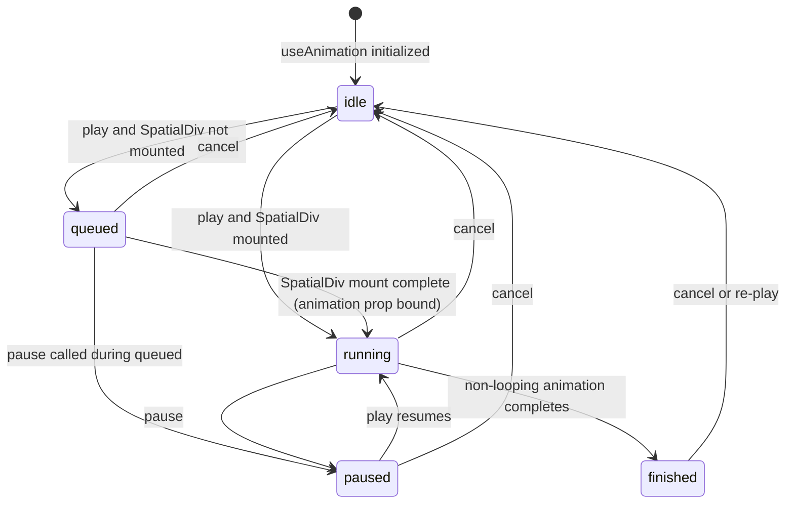
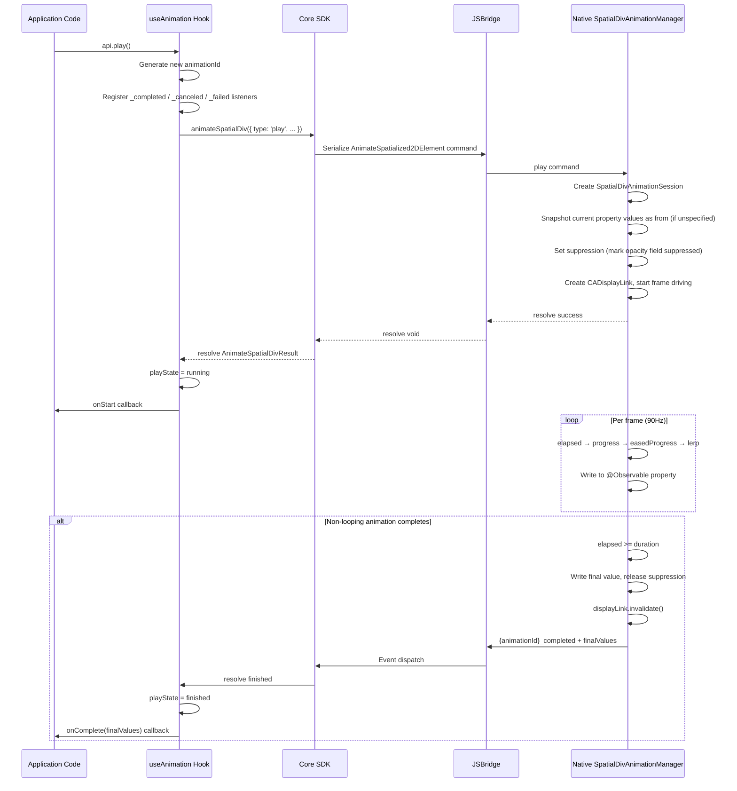
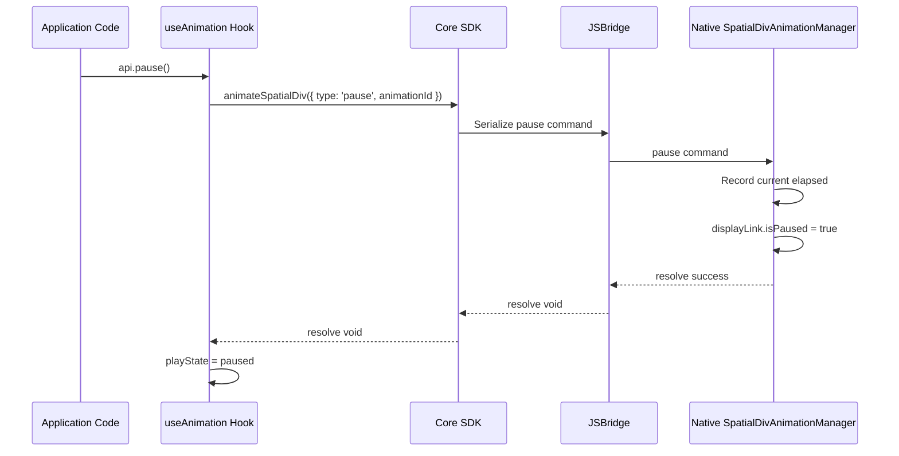
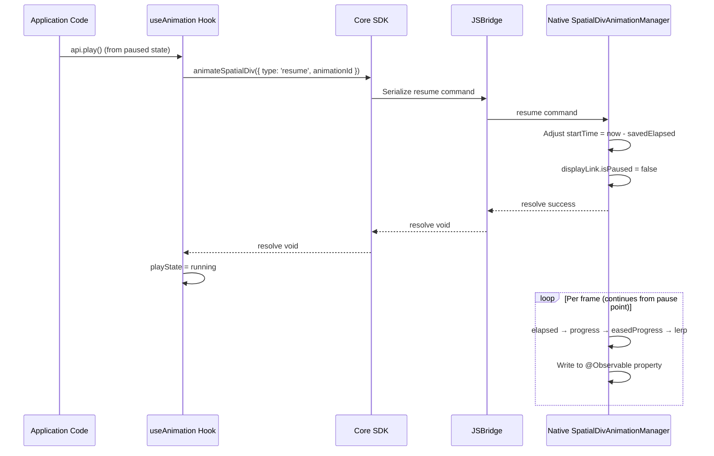
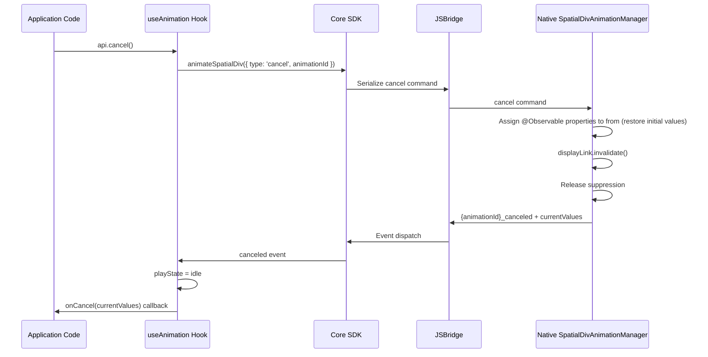

## Context

`SpatialDiv` is synced differently from entities today. On the React side, `PortalInstanceObject` reads DOM `computedStyle`, `getBoundingClientRect()`, and a `DOMMatrix`, then updates native via two separate paths:

- `UpdateSpatialized2DElementProperties`: sync properties such as `width`, `height`, `depth`, `opacity`, and `backOffset`
- `UpdateSpatializedElementTransform`: sync the full transform matrix

This means that if we simply reuse the "any prop change immediately syncs native" model, animation playback will compete with regular DOM syncing. At the same time, v1 requirements restrict `SpatialDiv` animation to visual-only `transform.translate.x/y/z`, `transform.rotate.x/y/z`, `transform.scale.x/y/z`, and `opacity`; fields that affect DOM layout, native spatial panel sizing, depth, or spatial-position semantics are not supported. Therefore, this design is not about supporting arbitrary CSS animations; it is about providing a consistent, minimal-scope visual animation API on top of the current `SpatialDiv` sync architecture.

## Goals / Non-Goals

**Goals:**

- Keep the same API family: `useAnimation(config)` + `animation` prop + `AnimationApi`, aligned with entity animation usage.
- Restrict `SpatialDiv` animation strictly to a whitelisted property set; avoid arbitrary CSS parsing/interpolation.
- Run playback on the native side; avoid per-frame JS DOM updates or per-frame JSBridge traffic.
- Define suppression rules so regular `SpatialDiv` syncing does not overwrite animation mid-states.
- Provide a sub-token runtime capability key `supports('useAnimation', ['element'])` for `SpatialDiv` animation so it can evolve and ship independently from entity animation.

**Non-Goals:**

- Animating arbitrary CSS properties or accepting a full CSS style object as `to` / `from`.
- Supporting `skew`, `perspective`, matrix-level transform interpolation, or arbitrary CSS transform string interpolation.
- Supporting animation for `width`, `height`, `back` / `backOffset`, `depth`, or any field that affects layout, spatial sizing, depth, or spatial-position semantics.
- Split `SpatialDiv` animation capability detection into a separate top-level key.
- Multi-step keyframes, async scripts, or timeline orchestration across multiple `SpatialDiv` instances within a single hook.

## API Surface

The public contract centers on the `useAnimation` hook. The types below define the agreed shape; behavioral semantics are specified in the companion spec.

### Hook Signature

```typescript
function useAnimation(config: SpatialDivAnimationConfig): [SpatialDivAnimatedProps, AnimationApi]
```

### SpatialDivAnimatedValues

```typescript
interface SpatialDivAnimatedValues {
  transform?: {
    translate?: { x?: number; y?: number; z?: number }
    rotate?: { x?: number; y?: number; z?: number }
    scale?: { x?: number; y?: number; z?: number }
  }
  opacity?: number
}
```

### SpatialDivAnimationConfig

```typescript
interface SpatialDivAnimationConfig {
  /**
   * Target values (required).
   * Only accepts visual whitelist fields:
   * transform.translate.x/y/z, transform.rotate.x/y/z, transform.scale.x/y/z, opacity.
   */
  to: SpatialDivAnimatedValues

  /** From values. If omitted, snapshot from current state at play() execution time. */
  from?: SpatialDivAnimatedValues

  /** Duration in seconds. Default: 0.3 */
  duration?: number

  /**
   * Easing curve. Default: 'easeInOut'
   * Only accepts these four values; any other string MUST throw during validation.
   */
  timingFunction?: 'linear' | 'easeIn' | 'easeOut' | 'easeInOut'

  /** Delay before playback starts, in seconds. Default: 0 */
  delay?: number

  /** Whether to auto-start after binding. Default: true */
  autoStart?: boolean

  /**
   * Loop behavior.
   * - true: reset to `from` and repeat (infinite reset loop)
   * - { reverse: true }: reverse between from and to every iteration (infinite reverse loop)
   * - undefined / false: play once
   */
  loop?: boolean | { reverse?: boolean }

  /**
   * Playback rate multiplier. Default: 1
   * Values > 1 speed up; 0 to 1 slow down.
   * Must be greater than 0 and finite. Negative values and zero MUST be rejected.
   * Applied at session creation time and remains constant for the session lifetime.
   * Multiplied into elapsed time within the Session to achieve variable speed.
   */
  playbackRate?: number

  /** Called when the session is successfully established with first state delaying or running. */
  onStart?: () => void

  /** Called when a non-looping animation finishes naturally. Receives native final values. */
  onComplete?: (finalValues: SpatialDivAnimatedValues) => void

  /** Called when canceled via api.cancel(). Receives the restored values. */
  onCancel?: (currentValues: SpatialDivAnimatedValues) => void

  /**
   * Called on asynchronous bridge/native failures.
   * If omitted, the SDK MUST log via console.error.
   */
  onError?: (error: AnimationError) => void
}
```

### AnimationError

```typescript
interface AnimationError {
  /** The session id that failed. */
  animationId: string
  /** The command that failed. */
  command: 'play' | 'pause' | 'resume' | 'cancel'
  /** Optional machine-readable code. */
  code?: string
  /** Human-readable reason. */
  reason: string
}
```

### AnimationApi

```typescript
interface AnimationApi {
  /** Start the animation, or continue it from paused progress. */
  play(): void

  /** Pause the animation at the current progress. */
  pause(): void

  /** Cancel the animation and restore `from`, or the start snapshot when `from` is omitted. */
  cancel(): void

  /** Whether the session is currently queued, delaying, or running (false while paused or idle). */
  readonly isAnimating: boolean

  /** Whether the animation is currently paused. */
  readonly isPaused: boolean

  /** Current session state. */
  readonly playState: 'idle' | 'queued' | 'running' | 'paused' | 'finished'

  /** Whether the most recent current session completed naturally. */
  readonly finished: boolean
}
```

### SpatialDivAnimatedProps

An opaque object returned as the first tuple element. Pass it directly to the spatialized HTML node's `animation` prop; application code SHOULD NOT read or mutate it.

All whitelisted values use numeric inputs:

- `transform.translate.x/y/z`: pixel semantics consistent with existing SpatialDiv CSS transform behavior
- `transform.rotate.x/y/z`: degrees, aligned with CSS `rotateX/Y/Z()`
- `transform.scale.x/y/z`: unitless multipliers, aligned with CSS `scaleX/Y/Z()`
- `opacity`: inclusive range `[0, 1]`

### Internal Hook Dispatch Design

`useAnimation` is the single public entry point. Since React Rules of Hooks forbid calling Hooks inside conditional branches, the implementation uses a **"dual-path unconditional call + active short-circuit"** pattern to dispatch between entity and SpatialDiv paths:

```typescript
export function useAnimation(config: AnimationConfig) {
  // ① Top-level pure computation — determine animation kind (no Hook calls)
  const kind = resolveAnimationKind(config);

  // ② Both internal Hooks called unconditionally, satisfying Rules of Hooks
  const entityResult = useEntityAnimation(config, kind === 'entity');
  const spatialDivResult = useSpatialDivAnimation(config, kind === 'spatialDiv');

  // ③ Return the active side's result
  return kind === 'entity' ? entityResult : spatialDivResult;
}
```

**Design rationale:**

1. **Mutual exclusion**: `resolveAnimationKind` matches the key set in `config.to` against whitelists — entity path keys (`position`, `rotation`, `scale`) and SpatialDiv path keys (`opacity`, `transform.translate.*`, `transform.rotate.*`, `transform.scale.*`) are mutually exclusive; co-presence throws.
2. **Inactive-side short-circuit**: `useSpatialDivAnimation(config, active=false)` still declares all `useState` / `useRef` calls (keeping Hook call order stable), but `useEffect` bodies short-circuit via `if (!active) return` — no Bridge session is established, no CADisplayLink is started. The returned API is a no-op stub.
3. **Zero extra overhead**: The inactive side occupies only a few ref/state slots in memory with no side-effect execution, negligible for frame-level animation performance.
4. **Extensible**: Adding a third path in the future (e.g., WebGL layer animation) requires only a new `useXxxAnimation(config, kind === 'xxx')` line in `useAnimation` — callers remain unaffected.


## Usage Examples

### SpatialDiv Entrance Animation

Combine `transform.translate`, `transform.scale`, and `opacity` to move a card up slightly, scale it into place, and fade it in. `autoStart` defaults to `true`, so playback begins after binding.

```jsx
function FadeInCard() {
  const [animation] = useAnimation({
    from: {
      transform: {
        translate: { y: 24 },
        scale: { x: 0.96, y: 0.96, z: 1 },
      },
      opacity: 0,
    },
    to: {
      transform: {
        translate: { y: 0 },
        scale: { x: 1, y: 1, z: 1 },
      },
      opacity: 1,
    },
    duration: 0.6,
    timingFunction: 'easeOut',
  })

  return (
    <div enable-xr animation={animation} style={{ width: 300, height: 200 }}>
      <h2>Hello Spatial</h2>
    </div>
  )
}
```

### Manual Rotation

Set `autoStart: false` and start on interaction. `transform.rotate.y` aligns with CSS `rotateY()` and uses degrees.

```jsx
function RotatePanel() {
  const [animation, api] = useAnimation({
    from: { transform: { rotate: { y: 0 } } },
    to: { transform: { rotate: { y: 18 } } },
    duration: 1.0,
    autoStart: false,
  })

  return (
    <>
      <button onClick={() => api.play()}>Tilt</button>
      <button onClick={() => api.cancel()}>Cancel</button>
      <div enable-xr animation={animation} style={{ width: 300, height: 180 }}>
        <p>Rotating Panel</p>
      </div>
    </>
  )
}
```

### Looping Float Effect

Use `transform.translate.y` and `loop: { reverse: true }` to float up and down infinitely. Tap to toggle pause/play.

```jsx
function FloatingBadge() {
  const [animation, api] = useAnimation({
    from: { transform: { translate: { x: 0, y: 0, z: 0 } } },
    to:   { transform: { translate: { x: 0, y: 20, z: 0 } } },
    duration: 1.5,
    timingFunction: 'easeInOut',
    loop: { reverse: true },
  })

  return (
    <div
      enable-xr
      animation={animation}
      onClick={() => {
        if (api.isPaused) {
          api.play()
        } else if (api.isAnimating) {
          api.pause()
        } else {
          api.play()
        }
      }}
      style={{ width: 100, height: 100 }}
    >
      <span>Float</span>
    </div>
  )
}
```


## Animation State Machine

The animation session lifecycle is defined by five states and the following transition rules:

### State Definitions

| State | Meaning | `isAnimating` | `isPaused` | `finished` |
|---|---|---|---|---|
| `idle` | Initial state; `play()` not yet called or session terminated | `false` | `false` | `false` |
| `queued` | SpatialDiv not yet mounted (animation prop not bound to native element); waiting | `true` | `false` | `false` |
| `running` | Animation playing (includes delay wait period) | `true` | `false` | `false` |
| `paused` | Animation paused; can resume from current progress | `false` | `true` | `false` |
| `finished` | Non-looping animation completed naturally | `false` | `false` | `true` |

### State Transition Diagram



### Transition Rules

- **idle → queued**: `play()` called but SpatialDiv's `animation` prop not yet bound to a native element (component unmounted or bridge not ready); animation enters queue.
- **idle → running**: `play()` called with SpatialDiv mounted and bridge ready; native session established, CADisplayLink started.
- **queued → running**: After SpatialDiv mounts, play command automatically sent; transitions to playing.
- **queued → paused**: `pause()` called during queued; after mount completes, starts in paused state (CADisplayLink created with `isPaused = true`).
- **running → paused**: `pause()` called; native side sets `displayLink.isPaused = true`, records current elapsed.
- **running → finished**: Non-looping animation completes naturally (elapsed >= duration); native emits `_completed` event.
- **paused → running**: `play()` resumes; native side adjusts startTime and restores `displayLink.isPaused = false`.
- **Any alive state → idle**: `cancel()` called; `@Observable` properties restored to `from` (or initial snapshot), `displayLink.invalidate()`, native emits `_canceled` event.
- **finished → idle**: `cancel()` to clean up, or `play()` again to start a new session.

## API Call Sequence

### play Sequence



### pause Sequence



### pause → play Resume Sequence



### cancel Sequence



## Cross-Layer Contracts

### React SDK → Core SDK

React drives the full lifecycle via a method on `Spatialized2DElement`:

```typescript
interface Spatialized2DElement {
  animateSpatialDiv(command: AnimateSpatialDivCommand): AnimateSpatialDivResult | void
}
```

`animateSpatialDiv()` returns `AnimateSpatialDivResult` when `command.type` is `'play'`. For `'pause'`, `'resume'`, and `'cancel'`, it returns `void`.

```typescript
interface AnimateSpatialDivCommand {
  /**
   * Identifies the animation session. Each `play` MUST generate a new globally unique `animationId`.
   * `pause`, `resume`, and `cancel` MUST reuse the `animationId` created by the `play` for that session.
   */
  animationId: string
  type: 'play' | 'pause' | 'resume' | 'cancel'
  /** Required for 'play'; ignored for other types. */
  elementId?: string
  to?: SpatialDivAnimatedValues
  from?: SpatialDivAnimatedValues
  duration?: number
  timingFunction?: 'linear' | 'easeIn' | 'easeOut' | 'easeInOut'
  delay?: number
  loop?: boolean | { reverse?: boolean }
  /** Playback speed multiplier. Default: 1. Multiplied into elapsed time within the Session to achieve variable speed. */
  playbackRate?: number
}

interface AnimateSpatialDivResult {
  animationId: string
  /** Resolves when a non-looping animation completes naturally. Never resolves for infinite loops. */
  finished: Promise<SpatialDivAnimatedValues>
  /**
   * Resolves when canceled via cancel().
   * After cancel, `finished` MUST remain pending (MUST NOT reject).
   */
  canceled: Promise<SpatialDivAnimatedValues>
}
```

If the element unmounts during an alive session, the SDK MUST cancel the native session, but MUST NOT resolve `finished` or `canceled`, and MUST NOT call lifecycle callbacks after unmount.

`animateSpatialDiv(...)` MAY reject only when the command cannot be submitted (before native accepts it). Once submitted, asynchronous failures MUST be reported via `{animationId}_failed`, not via `finished` / `canceled`.

### Core SDK ↔ Native (JSBridge)

**JS → Native command:** A single `AnimateSpatialized2DElement` command with a `type` discriminator matching `AnimateSpatialDivCommand`. The Core SDK serializes and sends it via the bridge.

**Native → JS events:**

| Event | When | Payload |
|---|---|---|
| `{animationId}_completed` | Natural completion (after all loops) | `SpatialDivAnimatedValues` — native final values |
| `{animationId}_canceled` | `cancel()` is invoked | `SpatialDivAnimatedValues` — restored values |
| `{animationId}_failed` | Async failure of `play` / `pause` / `resume` / `cancel` | `AnimationError` — includes at least `animationId`, `command`, `reason`, optional `code` |

Listeners for `_completed`, `_canceled`, and `_failed` MUST be registered before sending `play`, to avoid races where terminal/failure events arrive before listeners are ready.

`animationId` MUST be globally unique within the runtime process to avoid event name collisions across elements or sessions.

For a given `animationId`:

- After `play` successfully establishes a session, native MUST emit exactly one terminal event (`_completed` or `_canceled`), and they MUST be mutually exclusive.
- If `play` fails asynchronously, native MUST emit at most one `_failed`, and MUST NOT subsequently emit `_completed` or `_canceled`.
- If `pause`, `resume`, or `cancel` fails asynchronously, native MUST emit at most one `_failed` for that failed command; the session remains in the pre-failure state, and `_completed` or `_canceled` MAY still arrive later.


## Native visionOS Implementation Overview

### Architecture Selection

The rendering layer of `SpatialDiv` is based on SwiftUI Views (WKWebView container), fundamentally different from the Entity animation path that uses RealityKit's `FromToByAnimation<Transform>` + `AnimationPlaybackController`. SwiftUI does not provide an equivalent imperative animation playback control API (no pause/resume/cancel/precise completion detection), so the native side must build its own frame-driven animation engine.

**Candidate evaluation:**

| Candidate | Supports pause/resume | Supports cancel-restore | Precise completion callback | Decoupled from View lifecycle | Decision |
|---|---|---|---|---|---|
| `withAnimation` + iOS 17 completion | No | No | Partial | Yes | **Rejected**: Cannot pause/resume/cancel; fails core control semantics |
| `TimelineView(.animation)` | Indirectly | Yes | Yes | No (tied to View body) | **Backup**: Viable but must run within View hierarchy; unsuitable for standalone Manager |
| visionOS 26 `Entity.animate` / `content.animate` | No | No | No | Yes | **Rejected**: Only applies to RealityKit Entities, not SwiftUI Views; no playback control |
| **`CADisplayLink` manual frame driving** | **Native support** | **Native support** | **Native support** | **Yes** | **Adopted** |

Reasons for choosing `CADisplayLink`:

- **Imperative control naturally aligned**: `isPaused = true/false` implements pause/resume in one line, `invalidate()` implements stop — directly maps to the proposal's play/pause/cancel semantics
- **Decoupled from SwiftUI View**: Can run in a standalone Swift class independent of View lifecycle, naturally suited for encapsulation as `SpatialDivAnimationSession`
- **Symmetric with Entity animation architecture**: Entity side has `EntityAnimationManager` / `EntityAnimationSession`; SpatialDiv side establishes symmetric `SpatialDivAnimationManager` / `SpatialDivAnimationSession`
- **Clear property write path**: `SpatializedElement` is an `@Observable` object; the visual whitelist uses existing `opacity` and `transform` vars — direct assignment triggers SwiftUI view updates

### Core Mapping

| Design Concept | Entity Animation (implemented) | SpatialDiv Animation (this proposal) |
|---|---|---|
| Animation definition | `FromToByAnimation<Transform>` | `SpatialDivAnimationSession` (holds CADisplayLink + from/to/duration config) |
| Playback control | `AnimationPlaybackController.pause()/resume()/stop()` | `CADisplayLink.isPaused` + `invalidate()` |
| Completion detection | `AnimationEvents.PlaybackCompleted` (Scene event subscription) | Manual check: elapsed >= duration |
| Easing curves | `AnimationTimingFunction` | Manual cubic approximation (4 timingFunction variants) |
| Loop modes | `AnimationRepeatMode` | Session-internal elapsed modulo (reset) or direction flip (reverse) |
| Cancel restore | `entity.move(to:duration:0)` (bypasses bind-point) | Direct `@Observable` property assignment (no bind-point restriction) |
| Delay & rate | `AnimationView.delay` / `AnimationView.speed` | Session-internal elapsed calculation: subtract delay, multiply by playbackRate |
| Session management | `EntityAnimationManager` (keyed by animationId) | `SpatialDivAnimationManager` (keyed by animationId, at most one active session per element) |
| Property interpolation | RealityKit built-in Transform interpolation | Manual `lerp(from, to, easedProgress)` for opacity and transform SRT components |

### Key Implementation Details

1. **Frame driving**: `CADisplayLink` fires at visionOS 90Hz frame rate. Each frame computes `elapsed → progress → easedProgress → lerp`, writes results to `SpatializedElement`'s `@Observable` properties; SwiftUI automatically responds and updates visuals.

2. **Pause/Resume**: On `pause()`, record current `elapsed` and set `displayLink.isPaused = true`; on `resume()`, adjust `startTime` so elapsed continues from the pause point, then restore `displayLink.isPaused = false`.

3. **Cancel restore**: Directly assign `@Observable` properties to `from` (or initial snapshot), `invalidate()` the displayLink, emit `_canceled` event. Simpler than Entity animation's `entity.move(to:duration:0)` — SwiftUI `@Observable` assignment takes effect immediately without bypassing bind-points.

4. **Transform decomposition and composition**: v1 supports `translate`, `rotate`, and `scale` subfields, and the entire transform is suppressed during animation. At session start, the native side extracts SRT components from the current `AffineTransform3D`; during animation it recomposes a matrix in the fixed order translate → rotate → scale. `rotate.x/y/z` align with CSS `rotateX/Y/Z()` and use degrees; `scale.x/y/z` align with CSS `scaleX/Y/Z()` and use unitless multipliers.

5. **Layout properties excluded**: `width` / `height`, `back` / `backOffset`, and `depth` are not in the animation whitelist, avoiding additional source-of-truth conflicts between native spatial panel sizing, depth/spatial-position semantics, and DOM layout sync.

## Decisions

1. **Reuse the `useAnimation` family and split at the entrypoint based on `config.to` key set**

   The public API remains `useAnimation(config)`. Internally, the hook inspects the key set in `config.to` to route to either the entity path or the `SpatialDiv` path. The two key sets are mutually exclusive:

   - Entity keys: `position`, `rotation`, `scale`
   - SpatialDiv keys: `transform` (v1: `translate` / `rotate` / `scale` sub-fields only), `opacity`

   Rules:

   - If `to` contains keys from both sets, the SDK MUST throw.
   - If `to` contains only entity keys, use the entity path (existing logic, unchanged).
   - If `to` contains only SpatialDiv keys, use the SpatialDiv path (new internal logic).
   - The returned `animation` object carries an internal tag `__kind: 'entity' | 'spatialDiv'` (not exposed as a public API).
   - Entity bindings validate `__kind === 'entity'`; SpatialDiv bindings validate `__kind === 'spatialDiv'`; mismatch MUST throw.

   Impact on entity animation is limited to: (a) one if/else split at the `useAnimation` entrypoint calling existing logic; (b) adding `__kind` on the entity animation object; (c) a single kind check at entity binding time. Entity core logic (validation, Vec3→Float4x4 conversion, bridge commands, suppression, callback dispatch) remains unchanged.

   **Forward compatibility:** the two key sets do not collide today. If future entity animation introduces keys such as `opacity` or `transform` that collide, we MUST introduce an explicit discriminator (for example `target: 'entity' | 'spatialDiv'`) and stop relying on key inference.

   Alternative A: add a separate `useSpatialDivAnimation()`. Pro: zero entity impact. Con: splits the API family and duplicates lifecycle semantics across hooks.

   Alternative B: add a `target` discriminator to config immediately. Rejected because it increases ceremony and is not needed while keys do not collide.

2. **Use sub-token for runtime capability detection `supports('useAnimation', ['element'])`**

   `SpatialDiv` animation reuses the hook name `useAnimation`, so its capability detection also reuses the top-level key `useAnimation`, distinguishing the specific capability via sub-token. `supports('useAnimation', ['entity'])` indicates entity transform animation, while `supports('useAnimation', ['element'])` indicates `SpatialDiv` whitelisted property animation. Native dependencies, applicable component scope, and shipping timelines may differ; sub-tokens enable independent detection.

   Therefore:

   - `supports('useAnimation', ['entity'])` remains for entity transform animation
   - `supports('useAnimation', ['element'])` indicates `SpatialDiv` whitelisted property animation
   - A runtime MAY support only one of them
   - One sub-token result MUST NOT implicitly imply the result of another sub-token or the no-sub-token case

   Alternative: use a dedicated key `supports('useSpatialDivAnimation')`. Rejected because `SpatialDiv` animation shares the `useAnimation` hook name with entity animation, and capability detection should maintain family consistency under the same top-level key. A separate key adds mental overhead and contradicts the design intent of reusing `useAnimation`.

3. **`animation` prop applies only to spatialized HTML nodes created via `enable-xr`**

   `SpatialDiv` animation targets `Spatialized2DElement`, so only nodes on the `Spatialized2DElementContainer` path can play native animations:

   - `animation` may appear on HTML containers that support `enable-xr`
   - If the element is not `enable-xr`, the SDK MUST warn and MUST NOT start native playback
   - One `animation` object MUST NOT bind to multiple elements; the second bind MUST throw immediately

   This matches the entity semantics of one animation object per binding target, and avoids implying that ordinary DOM nodes can use the same capability.

4. **Core / bridge / native use a unified `AnimateSpatialized2DElement` session command**

   `SpatialDiv` animatable fields span both existing sync paths (`transform` and `properties`), so we should not reuse the entity transform-only command as-is. We introduce a unified animation command around `Spatialized2DElement`.

   Alternative: split `transform` vs property animation into two commands. Rejected because a single `SpatialDiv` animation often includes both `transform` and `opacity`, and splitting significantly increases session alignment and failure recovery complexity.

5. **When `from` is omitted, snapshot at play execution time**

   When `from` is omitted, the native side snapshots current values upon receiving the `play` command (consistent with entity animation), rather than having the JS side pre-read and send them down. This avoids extra bridge round-trips. If the element is not yet bound, `play()` enters queued state and the snapshot timing is when binding completes and playback is executed. `delay` only affects when visible motion starts and MUST NOT change snapshot timing. The snapshot MUST cover only fields present in `to`; fields absent from `to` MUST NOT be snapshotted or affected by the session.

   Snapshot sources per field:

   - `opacity`: read from native `Spatialized2DElement` current state
   - `transform.translate.x/y/z`, `transform.rotate.x/y/z`, `transform.scale.x/y/z`: extract the corresponding SRT components from the native `Spatialized2DElement` current transform

6. **Competition handling uses property-level suppression plus transform-wide suppression**

   For `opacity`, the SDK uses field-level suppression: when a session controls the field, `PortalInstanceObject.updateSpatializedElementProperties()` MUST stop pushing regular sync updates for `opacity`, while other uncontrolled fields continue to sync normally.

   For `transform` (v1: `translate` / `rotate` / `scale` sub-fields only), v1 uses transform-wide suppression rather than splitting into individual SRT components. The regular sync path sends a full `DOMMatrix`; suppressing only some components would require finer-grained matrix decomposition/recomposition on both React and native sides, which is higher risk. Therefore v1 rules are:

   - If the animation config includes `transform`, regular `updateTransform(matrix)` is suppressed for the duration of the alive session
   - After the session ends, regular transform sync resumes on the next React render
   - DOM transform updates during the alive session are cached but do not take effect immediately

   Suppression release timing: field-level suppression is released when the session ends (completion or stop). Suppression flags are cleared before lifecycle callbacks fire, so the next React render after callbacks resumes regular syncing using the latest props, and caches are then discarded.

   This means that if the app changes regular CSS transform while a transform animation is alive, those changes are delayed until the session ends. This is an intentional v1 trade-off.

7. **Lifecycle and error semantics match entity animation**
   The semantics of `play`, `pause`, `cancel`, `isAnimating`, `isPaused`, `playState`, `finished`, `onStart`, `onComplete`, `onCancel`, and `onError` match the entity animation proposal to minimize behavioral divergence within the SDK.

   - `play()` remains synchronous `void`
   - Asynchronous bridge/native failures surface via `onError`
   - `cancel()` restores `from` (or the start snapshot when `from` is omitted), consistent with entity animation's `cancel()` semantics
   - `loop: true` is reset loop; `loop: { reverse: true }` is reverse loop

   Alternative: define a Promise-based control API for `SpatialDiv`. Rejected because it breaks API consistency with entity animation.

   **`onComplete` / `onCancel` return scope:** The `SpatialDivAnimatedValues` in callbacks contains only the final or restored values for fields declared in `to`; fields not controlled by the animation do not appear in the return value. This is consistent with the entity animation `TransformValues` callback behavior.

8. **`play()` re-entry semantics match entity animation**
   When an animation session is already alive, `play()` behavior aligns with entity animation:
   - **Paused state**: `play()` continues the same session from its paused progress (resume), does not create a new session, does not generate a new `animationId`, and does not fire `onStart` again.
   - **Running / delaying state**: `play()` is a no-op; the existing session continues uninterrupted. To restart the animation, application code MUST explicitly call `api.cancel()` before calling `api.play()`.
   - **Queued state**: `play()` is a no-op; the queued session remains unchanged.

   This aligns with the Web Animation API where `animation.play()` on an already-running animation is a no-op.

   For the animation prop replacement scenario (React re-render replaces `animationA` with `animationB`), the SDK MUST still cancel the old session before starting the new one; that flow is not affected by this decision.

9. **Config updates do not affect alive sessions**

   When an app updates the config passed to `useAnimation(config)` during React re-renders, the current alive session (delaying/running/paused) MUST NOT be affected. The next `api.play()` MUST use the latest config.

## Risks / Trade-offs

- **Transform-wide suppression freezes regular CSS transform updates during animation** -> Document as a v1 limitation; reserve finer-grained transform composition for later versions.
- **Transform rotate / scale decomposition has edge cases** -> Use a fixed translate → rotate → scale composition order and cover common CSS `rotateX/Y/Z()` and `scaleX/Y/Z()` combinations in tests; keep matrix and skew unsupported to control complexity.
- **Sub-token capability detection enables independent evolution under the same top-level key** -> But requires application-side understanding of sub-token semantics; documentation must explain clearly.
- **`SpatialDiv` animation touches multiple layers (React, core, bridge, native)** -> Use a unified session command, a single failure event model, and focused tests to reduce cross-layer drift.
- **If the app does not sync React state in `onComplete` / `onCancel` after animation ends, regular sync resumption may push stale values to native, causing a visual "flash-back"** -> Consistent with entity animation behavior. Document and demonstrate in examples that apps MUST manually sync state in callbacks to preserve animation end state.
- **v1 assumes a React synchronous rendering model** -> Suppression release and regular sync resumption depend on "the next React render after callbacks." Under Concurrent Mode / Suspense, render timing may be non-deterministic. This is a known limitation. XR apps currently do not enable Concurrent Mode; if needed in the future, it should be addressed at the SDK sync infrastructure level.
- **Sharing the `useAnimation` entrypoint introduces minor entity-side changes** -> Limited to an entrypoint if/else, a `__kind` field, and binding validation; entity core logic remains unchanged. If keys collide in the future, introduce an explicit discriminator.