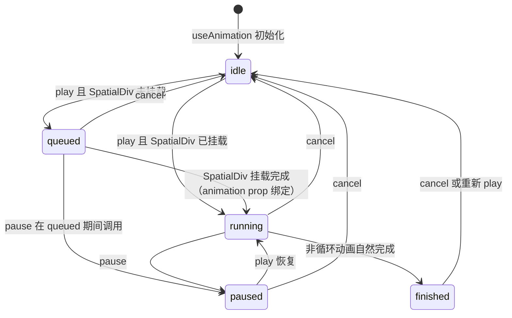
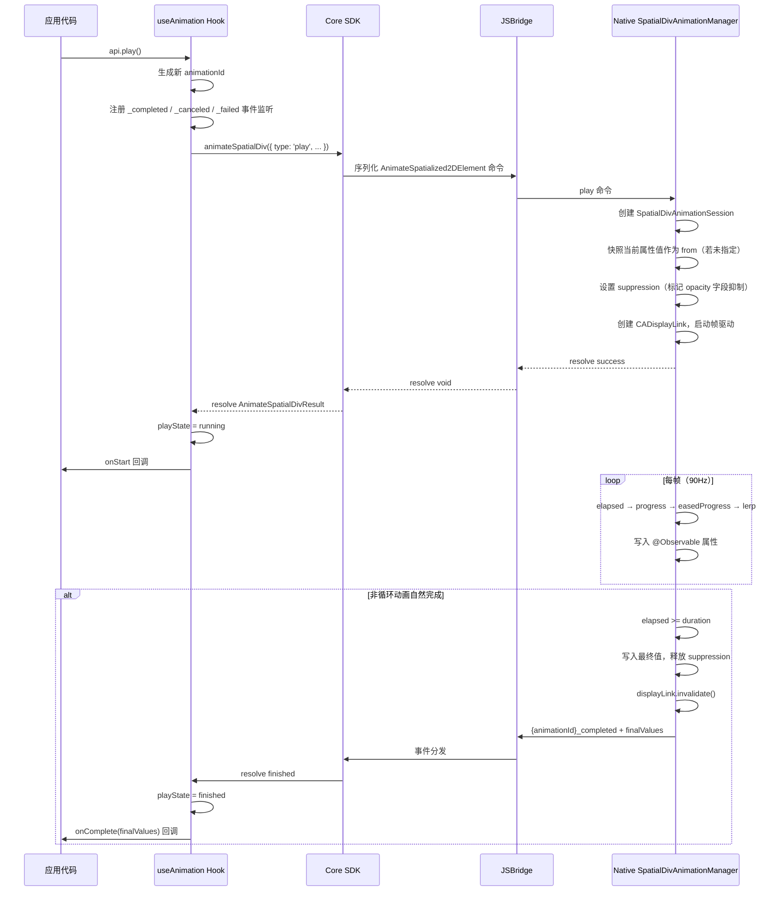
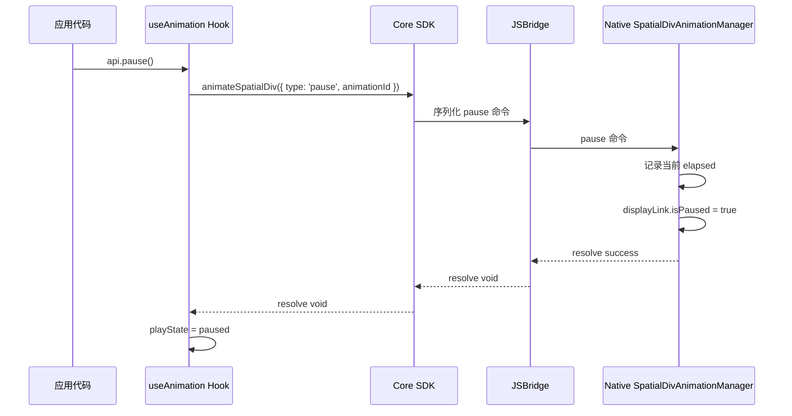
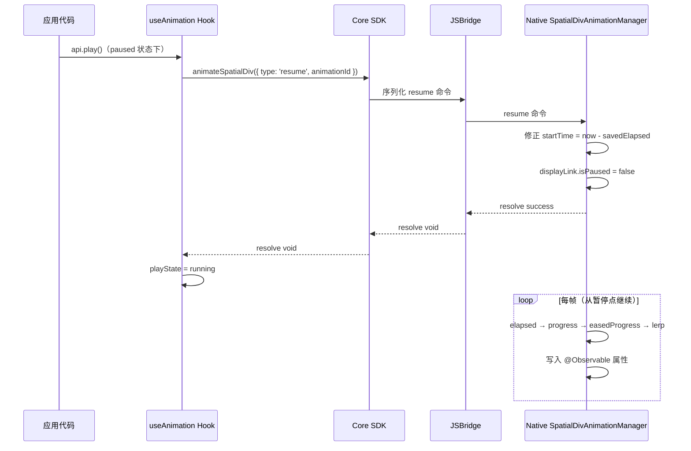
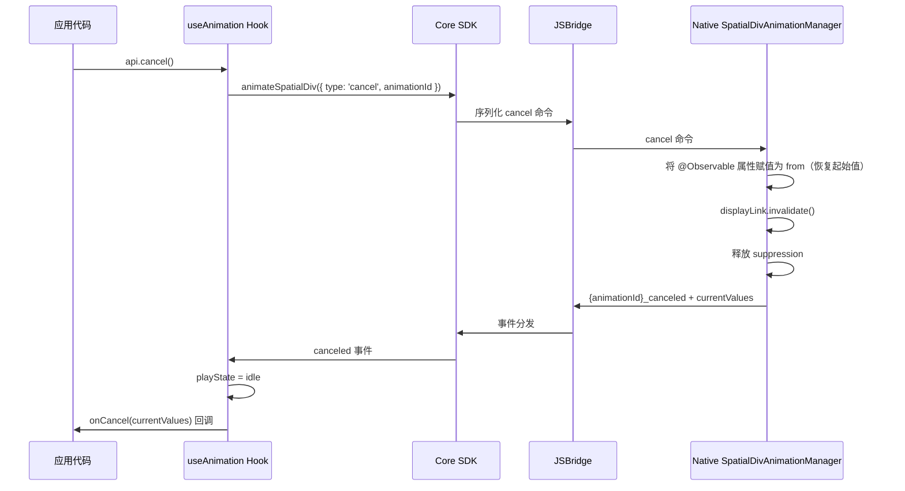

## 背景

`SpatialDiv` 当前的同步路径与实体不同。React 侧通过 `PortalInstanceObject` 读取 DOM 的 `computedStyle`、`getBoundingClientRect()` 和 `DOMMatrix`，再分别走两条链路：

- `UpdateSpatialized2DElementProperties`：同步 `width`、`height`、`depth`、`opacity`、`backOffset` 等属性
- `UpdateSpatializedElementTransform`：同步完整的 transform matrix

这意味着如果直接沿用"普通 props 改变即立刻同步 native"的模型，动画播放会与常规 DOM 同步产生竞争。与此同时，产品需求已将 `SpatialDiv` 动画的第一版范围限制为只影响视觉呈现的 `transform.translate.x/y/z`、`transform.rotate.x/y/z`、`transform.scale.x/y/z` 与 `opacity`，不支持会影响 DOM 布局盒、native 空间面板尺寸、深度或空间位置语义的属性。因此，本设计要解决的核心不是"如何支持任意 CSS 动画"，而是"如何在现有 SpatialDiv 同步架构上，以最小可实现范围提供一致的视觉动画 API"。

## 目标 / 非目标

**目标：**

- 沿用 `useAnimation(config)` + `animation` prop + `AnimationApi` 的 API 家族，保证与实体动画提案的使用方式一致。
- 将 `SpatialDiv` 动画严格限制在白名单属性范围内，避免引入任意 CSS 字符串解析和插值。
- 让播放由 native 侧驱动，避免逐帧 JS 更新 DOM 或 JSBridge。
- 明确动画期间 `SpatialDiv` 常规 DOM 同步的抑制规则，避免普通更新覆盖动画中间态。
- 为 `SpatialDiv` 动画提供 sub-token 形式的 runtime capability key `supports('useAnimation', ['element'])`，使其可以与实体动画独立演进、独立上线。

**非目标：**

- 支持任意 CSS 属性动画，或接受完整 CSS style 对象作为 `to` / `from`。
- 支持 `skew`、`perspective`、矩阵级 transform 插值，或任意 CSS transform 字符串插值。
- 支持 `width`、`height`、`back` / `backOffset`、`depth` 等会影响布局、空间尺寸、深度或空间位置语义的字段动画。
- 在本次提案中将 `SpatialDiv` 动画的 capability 检测拆成独立 top-level key。
- 在单个 hook 内支持多段 keyframe、异步脚本编排或跨多个 `SpatialDiv` 的时间轴编排。

## API 接口

公开契约以 `useAnimation` hook 为中心。以下类型定义了约定的形状；行为语义在 spec 中详细规定。

### Hook 签名

```typescript
function useAnimation(config: SpatialDivAnimationConfig): [SpatialDivAnimatedProps, AnimationApi]
```

### SpatialDivAnimatedValues

```typescript
interface SpatialDivAnimatedValues {
  transform?: {
    translate?: { x?: number; y?: number; z?: number }
    rotate?: { x?: number; y?: number; z?: number }
    scale?: { x?: number; y?: number; z?: number }
  }
  opacity?: number
}
```

### SpatialDivAnimationConfig

```typescript
interface SpatialDivAnimationConfig {
  /**
   * 目标动画值（必填）。
   * 仅接受视觉白名单字段：
   * transform.translate.x/y/z、transform.rotate.x/y/z、transform.scale.x/y/z、opacity。
   */
  to: SpatialDivAnimatedValues

  /** 起始动画值。省略时按 play() 执行时刻从当前状态快照。 */
  from?: SpatialDivAnimatedValues

  /** 动画时长，单位秒。默认值：0.3 */
  duration?: number

  /**
   * 缓动曲线。默认值：'easeInOut'
   * 仅接受以下四个值；其他字符串在校验时直接抛错。
   */
  timingFunction?: 'linear' | 'easeIn' | 'easeOut' | 'easeInOut'

  /** 播放前延迟，单位秒。默认值：0 */
  delay?: number

  /** 元素绑定后是否自动开始播放。默认值：true */
  autoStart?: boolean

  /**
   * 循环行为。
   * - true：重置到 `from` 后重复播放（无限 reset 循环）
   * - { reverse: true }：每一轮在 from 与 to 之间反向（无限 reverse 循环）
   * - undefined / false：播放一次
   */
  loop?: boolean | { reverse?: boolean }

  /**
   * 播放速率倍数。默认：1
   * 大于 1 加速；0 到 1 之间减速。
   * 必须大于 0 且有限。负值和零 MUST 被拒绝。
   * 在会话创建时应用，整个会话期间保持不变。
   * 在 Session 内 elapsed 计算时乘以该值实现变速。
   */
  playbackRate?: number

  /** 会话成功建立且首态为 delaying 或 running 时调用。 */
  onStart?: () => void

  /** 非循环动画自然完成时调用。接收 native 终态值。 */
  onComplete?: (finalValues: SpatialDivAnimatedValues) => void

  /** 通过 api.cancel() 取消时调用，携带恢复后的值。 */
  onCancel?: (currentValues: SpatialDivAnimatedValues) => void

  /**
   * bridge 或 native 操作发生异步错误时调用。
   * 若未提供，SDK MUST 通过 console.error 输出错误。
   */
  onError?: (error: AnimationError) => void
}
```

### AnimationError

```typescript
interface AnimationError {
  /** 遇到错误的会话 id。 */
  animationId: string
  /** 失败的命令。 */
  command: 'play' | 'pause' | 'resume' | 'cancel'
  /** 可选的机器可读错误码。 */
  code?: string
  /** 人类可读的失败原因。 */
  reason: string
}
```

### AnimationApi

```typescript
interface AnimationApi {
  /** 启动动画；若当前处于 paused，则从暂停处继续。 */
  play(): void

  /** 在当前进度暂停。 */
  pause(): void

  /** 取消动画，恢复到 `from`；若省略 `from` 则恢复到起始快照。 */
  cancel(): void

  /** 当前是否处于 queued、delaying 或 running 状态（paused 或 idle 时为 false）。 */
  readonly isAnimating: boolean

  /** 当前是否处于暂停状态。 */
  readonly isPaused: boolean

  /** 当前会话状态。 */
  readonly playState: 'idle' | 'queued' | 'running' | 'paused' | 'finished'

  /** 最近一个当前有效会话是否已自然完成。 */
  readonly finished: boolean
}
```

### SpatialDivAnimatedProps

作为 tuple 第一个元素返回的不透明对象。直接传给空间化 HTML 节点的 `animation` prop，应用代码不应读取或修改其内容。

所有白名单值使用数值型输入：

- `transform.translate.x/y/z`：使用与现有 SpatialDiv CSS transform 一致的像素语义
- `transform.rotate.x/y/z`：单位为 degree，分别对齐 CSS `rotateX/Y/Z()`
- `transform.scale.x/y/z`：无单位倍率，分别对齐 CSS `scaleX/Y/Z()`
- `opacity`：`[0, 1]` 闭区间


### Hook 内部分派设计

`useAnimation` 是面向开发者的统一入口。由于 React Rules of Hooks 禁止在条件分支内调用 Hook，内部采用 **"双路无条件调用 + active 短路"** 模式实现 entity / SpatialDiv 分叉：

```typescript
export function useAnimation(config: AnimationConfig) {
  // ① 顶层纯计算，确定动画 kind（不涉及 Hook 调用）
  const kind = resolveAnimationKind(config);

  // ② 两套内部 Hook 无条件调用，满足 Rules of Hooks
  const entityResult = useEntityAnimation(config, kind === 'entity');
  const spatialDivResult = useSpatialDivAnimation(config, kind === 'spatialDiv');

  // ③ 返回激活侧的结果
  return kind === 'entity' ? entityResult : spatialDivResult;
}
```

**设计要点：**

1. **互斥判定**：`resolveAnimationKind` 根据 `config.to` 的 key 集合做白名单匹配——entity 路径 key（`position`、`rotation`、`scale`）与 SpatialDiv 路径 key（`opacity`、`transform.translate.*`、`transform.rotate.*`、`transform.scale.*`）互斥，同时出现时抛错。
2. **非激活侧短路**：`useSpatialDivAnimation(config, active=false)` 内部所有 `useState` / `useRef` 正常声明（保持 Hook 调用顺序稳定），但 `useEffect` 通过 `if (!active) return` 短路，不建立 Bridge 会话、不启动 CADisplayLink。返回值为 noop API。
3. **零额外开销**：非激活侧仅占几个 ref/state slot 的内存，无副作用执行，对动画帧级性能无影响。
4. **可扩展**：未来新增第三条路径（如 WebGL layer 动画）时，只需在 `useAnimation` 中新增一行 `useXxxAnimation(config, kind === 'xxx')` 即可，调用方无感。

## 用法示例

### SpatialDiv 入场动画

`transform.translate`、`transform.scale` 和 `opacity` 配合实现卡片从下方轻微上移、缩放并淡入的入场效果。`autoStart` 默认为 `true`，元素绑定后自动播放。

```jsx
function FadeInCard() {
  const [animation] = useAnimation({
    from: {
      transform: {
        translate: { y: 24 },
        scale: { x: 0.96, y: 0.96, z: 1 },
      },
      opacity: 0,
    },
    to: {
      transform: {
        translate: { y: 0 },
        scale: { x: 1, y: 1, z: 1 },
      },
      opacity: 1,
    },
    duration: 0.6,
    timingFunction: 'easeOut',
  })

  return (
    <div enable-xr animation={animation} style={{ width: 300, height: 200 }}>
      <h2>Hello Spatial</h2>
    </div>
  )
}
```

### 手动触发旋转

设置 `autoStart: false`，点击按钮后播放。`transform.rotate.y` 对齐 CSS `rotateY()`，单位为 degree。

```jsx
function RotatePanel() {
  const [animation, api] = useAnimation({
    from: { transform: { rotate: { y: 0 } } },
    to: { transform: { rotate: { y: 18 } } },
    duration: 1.0,
    autoStart: false,
  })

  return (
    <>
      <button onClick={() => api.play()}>Tilt</button>
      <button onClick={() => api.cancel()}>Cancel</button>
      <div enable-xr animation={animation} style={{ width: 300, height: 180 }}>
        <p>Rotating Panel</p>
      </div>
    </>
  )
}
```

### 循环浮动效果

使用 `transform.translate.y` 和 `loop: { reverse: true }` 实现无限上下浮动。点击切换暂停 / 恢复。

```jsx
function FloatingBadge() {
  const [animation, api] = useAnimation({
    from: { transform: { translate: { x: 0, y: 0, z: 0 } } },
    to:   { transform: { translate: { x: 0, y: 20, z: 0 } } },
    duration: 1.5,
    timingFunction: 'easeInOut',
    loop: { reverse: true },
  })

  return (
    <div
      enable-xr
      animation={animation}
      onClick={() => {
        if (api.isPaused) {
          api.play()
        } else if (api.isAnimating) {
          api.pause()
        } else {
          api.play()
        }
      }}
      style={{ width: 100, height: 100 }}
    >
      <span>Float</span>
    </div>
  )
}
```


## 动画状态机

动画会话的生命周期由以下五个状态及转换规则定义：

### 状态定义

| 状态 | 含义 | `isAnimating` | `isPaused` | `finished` |
|---|---|---|---|---|
| `idle` | 初始状态，尚未调用 `play()` 或会话已终止 | `false` | `false` | `false` |
| `queued` | SpatialDiv 尚未挂载完成（animation prop 未绑定到 native 元素），等待绑定 | `true` | `false` | `false` |
| `running` | 动画正在播放（含 delay 等待期） | `true` | `false` | `false` |
| `paused` | 动画已暂停，可从当前进度恢复 | `false` | `true` | `false` |
| `finished` | 非循环动画自然完成 | `false` | `false` | `true` |

### 状态转换图



### 转换规则

- **idle → queued**：调用 `play()` 时 SpatialDiv 的 `animation` prop 尚未绑定到 native 元素（组件未挂载或 bridge 未就绪），动画进入排队等待。
- **idle → running**：调用 `play()` 时 SpatialDiv 已挂载且 bridge 就绪，Native 会话成功建立，CADisplayLink 启动。
- **queued → running**：SpatialDiv 挂载完成后自动发送 play 命令转为播放。
- **queued → paused**：在 queued 期间调用 `pause()`，挂载完成后将以 paused 状态开始（CADisplayLink 创建后立即 `isPaused = true`）。
- **running → paused**：调用 `pause()`，Native 侧 `displayLink.isPaused = true`，记录当前 elapsed。
- **running → finished**：非循环动画自然播放完成（elapsed >= duration），Native 发送 `_completed` 事件。
- **paused → running**：调用 `play()` 恢复，Native 侧修正 startTime 并恢复 `displayLink.isPaused = false`。
- **任意 alive 状态 → idle**：调用 `cancel()`，`@Observable` 属性恢复到 `from`（或起始快照），`displayLink.invalidate()`，Native 发送 `_canceled` 事件。
- **finished → idle**：调用 `cancel()` 清理，或再次 `play()` 启动新会话。

## API 调用时序

### play 时序



### pause 时序



### pause 后 play 恢复时序



### cancel 时序



## 跨层契约

### React SDK → Core SDK

React 调用 `Spatialized2DElement` 上的一个方法来驱动完整的动画生命周期：

```typescript
interface Spatialized2DElement {
  animateSpatialDiv(command: AnimateSpatialDivCommand): AnimateSpatialDivResult | void
}
```

`animateSpatialDiv()` 当 `command.type` 为 `'play'` 时返回 `AnimateSpatialDivResult`，其他类型（`'pause'` / `'resume'` / `'cancel'`）返回 `void`。

```typescript
interface AnimateSpatialDivCommand {
  /**
   * 标识动画会话。每次 `play` 命令 MUST 生成一个新的全局唯一 `animationId`。
   * `pause`、`resume`、`cancel` MUST 复用创建该会话的 `play` 命令的 `animationId`。
   */
  animationId: string
  type: 'play' | 'pause' | 'resume' | 'cancel'
  /** type 为 'play' 时必填；其他类型忽略。 */
  elementId?: string
  to?: SpatialDivAnimatedValues
  from?: SpatialDivAnimatedValues
  duration?: number
  timingFunction?: 'linear' | 'easeIn' | 'easeOut' | 'easeInOut'
  delay?: number
  loop?: boolean | { reverse?: boolean }
  /** 播放速率倍数。默认值：1。在 Session 内 elapsed 计算时乘以该值实现变速。 */
  playbackRate?: number
}

interface AnimateSpatialDivResult {
  animationId: string
  /** 非循环动画自然完成时 resolve。无限循环时永不 resolve。 */
  finished: Promise<SpatialDivAnimatedValues>
  /**
   * 动画通过 cancel() 取消时 resolve。
   * cancel 后，`finished` MUST 保持 pending（不得 reject）。
   */
  canceled: Promise<SpatialDivAnimatedValues>
}
```

如果元素在 alive 会话期间卸载，SDK MUST 取消 native 会话，但 MUST NOT resolve `finished` 或 `canceled`（且 MUST NOT 在卸载后调用生命周期回调）。

`animateSpatialDiv(...)` MAY 仅在命令无法提交（native 接受前）时 reject。一旦命令提交成功，后续的异步失败 MUST 通过 `{animationId}_failed` 事件上报，而不是通过 `finished` / `canceled` promise。

### Core SDK ↔ Native (JSBridge)

**JS → Native 命令：** 单个 `AnimateSpatialized2DElement` 命令，带 `type` 鉴别器，与 `AnimateSpatialDivCommand` 形状匹配。Core SDK 序列化后通过 bridge 发送。

**Native → JS 事件：**

| 事件名 | 触发条件 | Payload |
|---|---|---|
| `{animationId}_completed` | 动画自然完成（所有循环结束） | `SpatialDivAnimatedValues` — native 终态值 |
| `{animationId}_canceled` | 调用 `cancel()` | `SpatialDivAnimatedValues` — 恢复后的值 |
| `{animationId}_failed` | `play` / `pause` / `resume` / `cancel` 异步失败 | `AnimationError` — 至少包含 `animationId`、`command`、`reason`，可选 `code` |

`_completed`、`_canceled`、`_failed` 的 listener MUST 在发送 `play` 命令之前注册，以避免终态或失败事件在 listener 就绪前触发的竞态。

`animationId` MUST 在 runtime 进程内全局唯一，确保事件名不会跨元素或跨会话碰撞。

对于给定的 `animationId`：

- `play` 成功建立会话后，native MUST 恰好发出一个终态事件（`_completed` 或 `_canceled`），两者 MUST 互斥。
- 若 `play` 异步失败，native MUST 至多发出一次 `_failed`，且 MUST NOT 随后发出 `_completed` 或 `_canceled`。
- 若 `pause`、`resume`、`cancel` 异步失败，native MUST 为该失败命令至多发出一次 `_failed`；会话保持失败前状态，后续仍 MAY 发出 `_completed` 或 `_canceled`。

## Native visionOS 实现概述

### 架构选型

`SpatialDiv` 的渲染层基于 SwiftUI View（WKWebView 容器），与 Entity 动画基于 RealityKit `FromToByAnimation<Transform>` + `AnimationPlaybackController` 的路径根本不同。SwiftUI 不提供等价的命令式动画播放控制 API（无 pause/resume/cancel/精确完成检测），因此 native 侧需要自建帧驱动动画引擎。

**候选方案评估：**

| 候选方案 | 满足 pause/resume | 满足 cancel 恢复 | 满足精确完成回调 | 与 View 生命周期解耦 | 决策 |
|---|---|---|---|---|---|
| `withAnimation` + iOS 17 completion | 否 | 否 | 部分 | 是 | **否决**：无法暂停/恢复/取消，不满足提案核心控制语义 |
| `TimelineView(.animation)` | 间接可行 | 可行 | 可行 | 否（绑定 View body） | **备选**：可行但需要在 View 体系内运行，不适合独立 Manager |
| visionOS 26 `Entity.animate` / `content.animate` | 否 | 否 | 否 | 是 | **否决**：仅适用于 RealityKit Entity，不适用于 SwiftUI View；且无播放控制 |
| **`CADisplayLink` 手动帧驱动** | **原生支持** | **原生支持** | **原生支持** | **是** | **采用** |

选择 `CADisplayLink` 的原因：

- **命令式控制天然对齐**：`isPaused = true/false` 一行实现暂停/恢复，`invalidate()` 实现停止，与提案的 play/pause/cancel 语义直接映射
- **与 SwiftUI View 解耦**：可在独立 Swift 类中运行，不依赖 View 生命周期，天然适合封装为 `SpatialDivAnimationSession`
- **与 Entity 动画架构对称**：Entity 侧有 `EntityAnimationManager` / `EntityAnimationSession`，SpatialDiv 侧建立对称的 `SpatialDivAnimationManager` / `SpatialDivAnimationSession`
- **属性写入路径清晰**：`SpatializedElement` 是 `@Observable` 对象，视觉白名单需要的 `opacity` 与 `transform` 已作为 `var` 存在，直接赋值即可触发 SwiftUI 视图更新

### 核心映射

| 设计概念 | Entity 动画（已实现） | SpatialDiv 动画（本提案） |
|---|---|---|
| 动画定义 | `FromToByAnimation<Transform>` | `SpatialDivAnimationSession`（持有 CADisplayLink + from/to/duration 配置） |
| 播放控制 | `AnimationPlaybackController.pause()/resume()/stop()` | `CADisplayLink.isPaused` + `invalidate()` |
| 完成检测 | `AnimationEvents.PlaybackCompleted`（Scene 事件订阅） | elapsed >= duration 时手动判定 |
| 缓动曲线 | `AnimationTimingFunction` | 手动实现 cubic 近似（4 种 timingFunction） |
| 循环模式 | `AnimationRepeatMode` | Session 内 elapsed 取模（reset）或方向翻转（reverse） |
| Cancel 恢复 | `entity.move(to:duration:0)`（绕过 bind-point） | 直接赋值 `@Observable` 属性（无 bind-point 限制） |
| 延迟与速率 | `AnimationView.delay` / `AnimationView.speed` | Session 内 elapsed 计算时扣除 delay、乘以 playbackRate |
| 会话管理 | `EntityAnimationManager`（以 animationId 为 key） | `SpatialDivAnimationManager`（以 animationId 为 key，每元素至多一个 active session） |
| 属性插值 | RealityKit 内置 Transform 插值 | 手动 `lerp(from, to, easedProgress)` 插值 opacity 与 transform SRT 分量 |

### 关键实现细节

1. **帧驱动**：`CADisplayLink` 以 visionOS 90Hz 帧率回调。每帧计算 `elapsed → progress → easedProgress → lerp`，将结果写入 `SpatializedElement` 的 `@Observable` 属性，SwiftUI 自动响应变化并更新视觉。

2. **暂停/恢复**：`pause()` 时记录当前 `elapsed` 并设置 `displayLink.isPaused = true`；`resume()` 时修正 `startTime` 使 elapsed 从暂停点继续，再恢复 `displayLink.isPaused = false`。

3. **Cancel 恢复**：直接将 `@Observable` 属性赋值为 `from`（或起始快照），`invalidate()` 销毁 displayLink，发送 `_canceled` 事件。与 Entity 动画的 `entity.move(to:duration:0)` 相比更简单——SwiftUI `@Observable` 对象赋值即生效，无需绕过 bind-point。

4. **Transform 分解与组合**：v1 支持 `translate`、`rotate`、`scale` 子字段，且动画期间 transform 整体抑制。会话开始时需要从当前 `AffineTransform3D` 提取 SRT 分量，动画期间按固定顺序 translate → rotate → scale 重新组合矩阵。`rotate.x/y/z` 与 CSS `rotateX/Y/Z()` 对齐，单位为 degree；`scale.x/y/z` 与 CSS `scaleX/Y/Z()` 对齐，为无单位倍率。

5. **布局属性排除**：`width` / `height`、`back` / `backOffset`、`depth` 不进入动画白名单，避免 native 空间面板尺寸、深度或空间位置语义与 DOM 布局同步产生额外 source-of-truth 竞争。

## 决策

1. **复用同一个 `useAnimation` 家族，通过 `config.to` 的 key 集合在 hook 入口自动分叉**

   对外仍使用同名 `useAnimation(config)`，hook 内部通过检查 `config.to` 的 key 来区分走 entity 路径还是 SpatialDiv 路径。两组 key 集合互斥：

   - Entity key 集合：`position`、`rotation`、`scale`
   - SpatialDiv key 集合：`transform`（v1 仅 `translate` / `rotate` / `scale` 子字段）、`opacity`

   规则：

   - 若 `to` 中同时出现两组 key，SDK MUST 直接抛错
   - 若 `to` 全部为 entity key，走 entity 路径（现有 `useEntityAnimation` 逻辑，完全不改）
   - 若 `to` 全部为 SpatialDiv key，走 SpatialDiv 路径（新增 `useSpatialDivAnimation` 内部逻辑）
   - 返回的 `animation` 对象内部携带 `__kind: 'entity' | 'spatialDiv'` 标记（对应用不可见）
   - entity 组件绑定时校验 `__kind === 'entity'`，SpatialDiv 绑定时校验 `__kind === 'spatialDiv'`，不匹配则抛错

   对 entity 动画的影响仅限于：(a) `useAnimation` 入口新增一层 if/else 分支调用原有逻辑；(b) entity 路径创建 animation 对象时多设一个 `__kind` 字段；(c) entity 组件绑定时加一行 kind 校验。entity 的核心逻辑（config 校验、Vec3→Float4x4、bridge 命令、suppression、callback 调度）完全不变。

   **前向兼容说明：** 当前两组 key 没有碰撞。如果未来 entity 侧也引入 `opacity` 或 `transform` 字段，导致两组 key 出现碰撞，MUST 引入显式 discriminator 字段（如 `target: 'entity' | 'spatialDiv'`）来替代 key 推断。现阶段靠 key 互斥即可。

   备选方案 A 是新增 `useSpatialDivAnimation()`，彻底独立。优点是对 entity 零侵入；缺点是 API 家族分裂，同一套播放生命周期在两个 hook 间重复出现。

   备选方案 B 是在 config 上直接加 `target` discriminator。否决原因是增加了使用侧仪式感，且当前 key 不碰撞，不需要额外消歧。

2. **运行时能力检测使用 sub-token `supports('useAnimation', ['element'])`**

   `SpatialDiv` 动画复用 `useAnimation` 这个 hook 名称，capability 检测也复用 `useAnimation` 这个 top-level key，通过 sub-token 区分具体能力。`supports('useAnimation', ['entity'])` 表示实体 transform 动画，`supports('useAnimation', ['element'])` 表示 `SpatialDiv` 白名单属性动画。两者的 native 依赖、可用组件范围和上线节奏可能不同，通过 sub-token 实现独立检测。

   因此：

   - `supports('useAnimation', ['entity'])` 继续保留给实体 transform 动画提案
   - `supports('useAnimation', ['element'])` 专门表示 `SpatialDiv` 白名单属性动画
   - 某个 runtime MAY 仅支持其一
   - 一个 sub-token 的结果 MUST NOT 隐式推导另一个 sub-token 或无 sub-token 的结果

   备选方案是使用独立 key `supports('useSpatialDivAnimation')`。否决原因是因为 `SpatialDiv` 动画与实体动画共用 `useAnimation` 这个 hook 名称，capability 检测也应保持同一 top-level key 下的家族一致性，独立 key 会增加使用侧的心智负担，且与 API 复用 `useAnimation` 的设计意图不一致。

3. **`animation` prop 仅对 `enable-xr` 产生的 spatialized HTML 节点生效**

   `SpatialDiv` 动画的落点是 `Spatialized2DElement`，因此只有真正走 `Spatialized2DElementContainer` 链路的节点才能播放 native 动画。设计上：

   - `animation` prop 允许出现在支持 `enable-xr` 的 HTML 容器上
   - 若元素未开启 `enable-xr`，SDK MUST warning 且 MUST NOT 启动 native 播放
   - 同一个 `animation` 对象 MUST NOT 绑定到多个元素；第二次绑定时立即抛错

   这样与实体动画保持"一个 animation 对象只对应一个绑定目标"的语义一致，同时避免开发者误以为普通 DOM 节点也能走相同能力。

4. **Core / bridge / native 采用 `AnimateSpatialized2DElement` 会话命令**

   `SpatialDiv` 需要动画的字段跨越 `transform` 和 `properties` 两条现有同步链路，因此不适合简单复用实体侧的 transform-only 命令。设计上新增一个围绕 `Spatialized2DElement` 的统一动画命令。

   备选方案是把 `transform` 动画与属性动画拆成两类命令。否决原因是一个 `SpatialDiv` 动画配置经常同时包含 `transform` 和 `opacity`，拆开后会显著增加会话对齐和失败恢复复杂度。

5. **`from` 缺省时按播放执行时刻快照**

   当 `from` 省略时，native 侧在收到 `play` 命令时自行快照当前值（与实体动画一致），而不是由 JS 侧预先读取再下发。这避免了额外的 bridge 往返。若元素尚未绑定，`play()` 会进入 queued 状态，快照时刻以元素完成绑定并实际执行播放的时间点为准。`delay` 仅影响视觉动效何时开始，MUST NOT 改变起始快照的采集时机。快照 MUST 仅覆盖 `to` 中声明的字段；`to` 中未出现的字段 MUST NOT 被快照或被动画会话影响。

   各字段的快照来源规则：

   - `opacity`：从 native 侧 `Spatialized2DElement` 的当前状态读取
   - `transform.translate.x/y/z`、`transform.rotate.x/y/z`、`transform.scale.x/y/z`：从 native 侧 `Spatialized2DElement` 当前 transform 中提取对应 SRT 分量

6. **竞争处理采用"属性级抑制 + transform 整体抑制"**

   对 `opacity`，SDK 采用字段级抑制：动画会话控制该字段时，`PortalInstanceObject.updateSpatializedElementProperties()` MUST 暂停向 native 推送 `opacity` 的常规同步，但其他未被动画控制的字段仍保持原路径。

   对 `transform`（v1 仅 `translate` / `rotate` / `scale` 子字段），第一版采用"整体抑制"而不是细分到具体 SRT 分量。原因是现有普通同步路径一次性下发完整 `DOMMatrix`，若只抑制局部分量，则需要在 React 和 native 两边都引入更细粒度的矩阵分解与重组逻辑，风险较高。第一版规则因此是：

   - 一旦动画配置包含 `transform`，常规 `updateTransform(matrix)` 同步在 alive 会话期间整体暂停
   - 动画结束后，在下一个 React 渲染周期恢复常规 transform 同步
   - alive 期间收到的最新 DOM transform 仍会被缓存，但不会即时生效

   抑制释放时机：字段级抑制在动画会话结束（自然完成或 stop）时释放。抑制标记在生命周期回调触发之前清除，这样回调之后的下一次 React 渲染周期就会恢复常规同步，使用该渲染周期中的最新 prop 值。缓存在恢复后丢弃。

   这意味着动画期间若应用还在修改普通 CSS transform，也会被延后到会话结束后生效。这是有意接受的 v1 权衡。

7. **生命周期和错误语义完全对齐实体动画**
   `play`、`pause`、`cancel`、`isAnimating`、`isPaused`、`playState`、`finished`、`onStart`、`onComplete`、`onCancel`、`onError` 的含义与实体动画提案保持一致，以减少同一 SDK 内两套动画能力在行为上的差异。

   - `play()` 仍为同步 `void`
   - 异步 bridge / native 失败通过 `onError` 暴露
   - `cancel()` 恢复到 `from`（省略 `from` 时恢复到起始快照），与实体动画的 `cancel()` 语义一致
   - `loop: true` 表示 reset 循环，`loop: { reverse: true }` 表示 reverse 循环

   备选方案是给 `SpatialDiv` 单独定义 Promise 风格控制 API。否决原因是这会破坏与实体动画之间的 API 一致性。

   **`onComplete` / `onCancel` 返回值范围：** 回调中的 `SpatialDivAnimatedValues` 仅包含 `to` 中声明的字段对应的终态或恢复值；未被动画控制的字段不会出现在返回值中。这与实体动画的 `TransformValues` 回调行为一致。

8. **`play()` 重入语义与实体动画一致**
   当动画会话已处于 alive 状态时，`play()` 的行为与实体动画完全对齐：
   - **paused 状态**：`play()` 从暂停进度继续同一会话（resume），不创建新会话，不生成新 `animationId`，不再次触发 `onStart`。
   - **running / delaying 状态**：`play()` 为空操作（no-op），已有会话继续运行不受干扰。若要重新开始动画，应用代码 MUST 显式先调用 `api.cancel()` 再调用 `api.play()`。
   - **queued 状态**：`play()` 为空操作，已排队的会话保持不变。

   此行为与 Web Animation API 对齐——对一个已在播放的 animation 调用 `play()` 是空操作。

   对于 animation prop 替换场景（React re-render 将 `animationA` 替换为 `animationB`），SDK 仍 MUST 先取消旧会话再启动新会话，该流程不受此决策影响。

9. **Config 更新不影响 alive 会话**

   应用在 React re-render 中更新传给 `useAnimation(config)` 的 config 时，当前 alive 会话（delaying / running / paused）MUST NOT 受影响。下一次 `api.play()` MUST 使用最新的 config。

## 风险 / 权衡

- **动画期间整体抑制 transform 会冻结普通 CSS transform 更新** -> 通过 spec 明确这是第一版限制，并将更细粒度的 transform 组合留给后续版本。
- **transform rotate / scale 分解存在边界 case** -> 使用固定的 translate → rotate → scale 组合顺序，并用测试覆盖常见 CSS `rotateX/Y/Z()`、`scaleX/Y/Z()` 组合；不支持 matrix 和 skew 来控制复杂度。
- **Sub-token capability 检测使同一 top-level key 下可独立演进** -> 但需要应用侧理解 sub-token 语义，文档需明确说明。
- **`SpatialDiv` 动画会同时触达 React、core、bridge 和 native 多层** -> 用统一会话命令、单一失败事件模型和聚焦测试用例降低跨层行为漂移风险。
- **共用 `useAnimation` 入口引入轻微的 entity 侧改动** -> 仅限入口 if/else 分支、`__kind` 字段和绑定校验，entity 核心逻辑不变。若未来 key 碰撞需引入显式 discriminator。
- **动画结束后若应用未在 `onComplete` / `onCancel` 中同步 React state，常规同步恢复时可能将旧值推到 native，造成视觉"闪回"** -> 与实体动画行为一致。通过文档和示例明确告知开发者：如需保持动画终态，MUST 在回调中手动同步 state。
- **v1 假设 React 同步渲染模型** -> 抑制释放与常规同步恢复依赖"回调后的下一个 React 渲染周期"。在 Concurrent Mode / Suspense 下渲染时机可能不确定，属于已知限制。XR 应用目前基本不启用 Concurrent Mode，如未来有需求应在 SDK 同步基础设施层统一解决。