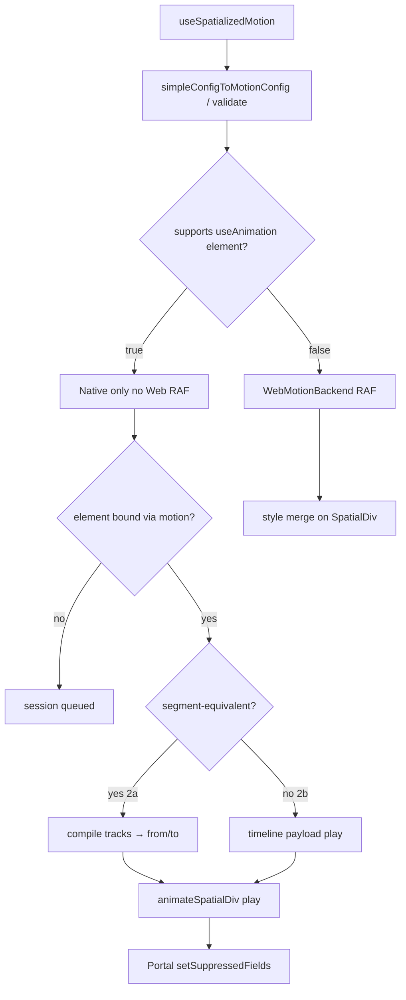

# Phase 2 — Minimal native integration (`simple` → spatial timeline)

Status: **implemented** on branch `proposal/spatial-div-motion-timeline` (2a segment + 2b timeline). This doc is kept for history; **authoritative behavior** is in `design.md`, `specs/spatial-div-motion/spec.md`, and `specs/spatial-div-motion-native-timeline/spec.md`.

## Problem

Phase 1 `useSpatializedMotion` only runs the **Web RAF backend**: it updates React `style` on the spatial **host/probe** DOM path. In AVP / WebSpatial runtime the user sees the **native `Spatialized2DElement`**, not that DOM. Without native `animateSpatialDiv` + Portal **suppression**, Z/opacity motion does not appear in space.

Plan A already works on AVP via `useAnimation` → `animation` prop → bind → `play { from, to }` → `setSuppressedFields`.

Plan B must reuse that pipe without reintroducing a second public style channel.

## Strategy: two slices

| Slice | Scope | Native work | Unblocks |
| --- | --- | --- | --- |
| **2a — Segment native (MVP)** | `simple()` and any timeline that is **segment-equivalent** (one easing, 2 keyframes per track at `0` and `duration`) | **None** in Swift — reuse existing `from`/`to` `play` | `simple-entrance`, fade/slide/Z on AVP |
| **2b — Timeline native** | Arbitrary `tracks[]` (multi-track overlap) | Swift `TimelineEvaluator` + `timeline` on bridge | `multi-track` canonical demo on AVP |

Ship **2a first** (days); **2b** is the original Phase 2 in `tasks.md` §4.



## Native gate (shipped behavior)

On **WebSpatial runtime** (`supports('useAnimation', ['element']) === true`):

- `play()` **always** uses the native backend (segment or timeline). **No Web RAF fallback** on the same hook instance.
- If `motion` has not bound a `Spatialized2DElement` yet, the session is **`queued`** until `__setElement` runs — the card stays at timeline `t=0` until bind (integration must pass `motion={motion}`).

On **plain browser** (`supports === false`): only Web RAF runs.

```typescript
// Playback picker (conceptual)
if (supports('useAnimation', ['element'])) nativePlay() // includes queued when unbound
else webPlay()
```

## Slice 2a — `simple` → existing native segment

### Compilation (TS only)

Add `packages/react/src/spatialized-container/motion/nativeCompile.ts`:

```typescript
/** Returns Plan A-compatible play payload, or null if timeline needs 2b. */
export function motionConfigToNativeSegment(
  config: SpatialDivMotionConfig,
): {
  from: SpatialDivAnimatedValues
  to: SpatialDivAnimatedValues
  duration: number
  timingFunction: TimingFunction
  delay?: number
  loop?: ...
  playbackRate?: number
} | null
```

**Segment-equivalent** when:

1. Every track has **exactly two** keyframes: `at === 0` and `at === config.duration` (within float epsilon).
2. Keyframes are sorted and cover only `[0, duration]`.
3. All tracks share the **same** `easing` (or use config-level default; if tracks disagree → `null` → 2b or Web).
4. Properties ⊆ motion whitelist (already validated).

**Algorithm** (mirror `simple.ts` in reverse):

```typescript
const from: SpatialDivAnimatedValues = {}
const to: SpatialDivAnimatedValues = {}
for (const track of config.tracks) {
  setScalar(from, track.property, track.keyframes[0].value)
  setScalar(to, track.property, track.keyframes[1].value)
}
return { from, to, duration: config.duration, timingFunction: tracks[0].easing ?? 'easeInOut', ... }
```

`useSpatializedMotion.simple({ kind: 'spatialized2d', )` already produces this shape via `simpleConfigToMotionConfig` — no extra sugar work.

**Examples that compile (2a):**

- `simple-entrance`: opacity + `translate.y` + `translate.z` — **one native `play`**, same as Plan A with combined `from`/`to`.
- Single-property fades / Z-only entrances.

**Examples that do not (need 2b or Web):**

- `multi-track`: opacity keyframes at `3` and `5` while translate runs `0–5`.

### Native session (reuse Plan A)

Extract shared module from `useSpatialDivAnimation.ts` (no behavior change to Plan A):

`packages/react/src/spatialized-container/motion/nativeSession.ts`

- `createNativeMotionSession(config, callbacks)` — wraps `animationId`, `doPlay`, `pause`, `resume`, `cancel`, promise handlers (`finished` / `canceled` / `failed`).
- Input: segment payload above + `SpatialDivAnimationConfig`-compatible callbacks (`onStart`, `onComplete`, `onCancel`, `onError`).

`useSpatializedMotionInternal` branches:

```typescript
if (nativeElement && segment) {
  stopWebRaf()
  nativeSession.play(segment) // animateSpatialDiv({ type:'play', from, to, ... })
  return styleFromValues(evaluateMotionTimeline(config, 0)) // or empty style while suppressed
} else {
  runWebBackend()
}
```

While native is **running**, animated fields should **not** be written by Web RAF (native drives entity). Optional: subscribe to native tick events later; for 2a, **omit per-frame `style`** during run and rely on suppression (same as Plan A).

### Portal binding without `animation` prop

Add parallel binding object (internal shape, same as Plan A):

```typescript
export interface SpatialDivMotionBinding {
  readonly __kind: 'spatialDivMotion'
  readonly __motionObjectId: string
  get __animating(): boolean
  __getSuppressedFields(): Set<string> | null
  __setElement(el: Spatialized2DElement | null): void
  __onUnbind(): void
}
```

`useSpatializedMotion` returns:

```typescript
{ style, api, motionBinding?: SpatialDivMotionBinding }
```

`motionBinding` is **only defined** when `supports('useAnimation', ['element'])`.

**SpatialDiv usage (demo / app):**

```tsx
const { style, api, motionBinding } = useSpatializedMotion.simple({ kind: 'spatialized2d', { ... })

<div
  enable-xr
  motion={motionBinding}  // new optional prop — see below
  style={{ width: 320, ...style }}
/>
```

**Container change (minimal):**

In `PortalSpatializedContainer.tsx`, duplicate the existing `animation` `useEffect` block for optional `motion` prop (or generic `spatialMotionBinding`). Same calls:

- `__setElement(spatializedElement)`
- `setSuppressedFields(__getSuppressedFields())`

**Suppression set** (reuse Plan A helper):

```typescript
function getMotionSuppressedFields(config: SpatialDivMotionConfig): Set<string> {
  const fields = new Set<string>()
  for (const track of config.tracks) {
    if (track.property === 'opacity') fields.add('opacity')
    if (track.property.startsWith('transform.')) fields.add('transform')
  }
  return fields
}
```

Same rule as `getSuppressedFieldNames` in `useSpatialDivAnimation.ts`.

### autoStart + bind ordering

Copy Plan A queue semantics:

1. `autoStart` → `play()` → if no element, session `queued`.
2. On `__setElement` → `doPlay` with compiled segment.
3. `onStart` after native accepts play (not before bind).

StrictMode: keep Web backend cleanup from Phase 1; native session must reset `playState` on unmount and send `cancel` if running.

### Pre-bind behavior (shipped)

**Decision:** native-only on WebSpatial — **no Web RAF** before bind. Hold React `style` at `evaluate(config, 0)` while `queued`; native `doPlay` runs when `motion` binds the element.

## Slice 2b — true timeline (shipped)

### Bridge extension

```typescript
// packages/core/src/types/spatialDivAnimation.ts
export interface AnimateSpatialDivCommand {
  // ...existing fields...
  timeline?: SpatialDivMotionTimeline  // seconds-based keyframes, per-track easing
}
```

`SpatialDivMotionTimeline` already exists in `spatialDivMotion.ts` — align `keyframes[].at` to **seconds** on the wire (matches Web evaluator).

### Swift

- Extend `AnimateSpatialized2DElementCommand` with optional `timeline`.
- If `timeline != nil` → `TimelineEvaluator` (per-track segment search + easing) → sample `SpatialDivAnimationTarget` each DisplayLink tick.
- If `timeline == nil` → existing single-segment lerp (unchanged).

**Do not** remove `from`/`to` path; 2a keeps using it.

### Hook (shipped)

```typescript
// WebSpatial: native only (segment or timeline inside nativeSession.buildPlayCommand)
if (supports('useAnimation', ['element'])) nativePlay()
else webPlay()
```

## File checklist (2a MVP)

| File | Change |
| --- | --- |
| `motion/nativeCompile.ts` | `motionConfigToNativeSegment`, `motionConfigToTimeline` (stub for 2b) |
| `motion/nativeSession.ts` | Extract from `useSpatialDivAnimation` |
| `motion/useSpatializedMotion.ts` | Backend picker + `motionBinding` |
| `motion/getMotionSuppressedFields.ts` | Suppression set from tracks |
| `PortalSpatializedContainer.tsx` | Bind `motion` prop |
| `types` (react spatialized-container) | `motion?: SpatialDivMotionBinding` on props |
| `spatialDivAnimation.ts` (core) | Optional `timeline?` on command (type only in 2a if unused) |
| `simple-entrance.tsx` | Pass `motion={motionBinding}` |
| Tests | `nativeCompile.test.ts`, bridge test with mock element, StrictMode + bind |

**No Swift changes for 2a.**

## Acceptance criteria

### 2a (AVP / simulator)

1. `#/spatial-div-motion/simple-entrance` with `translate.z` in `from`/`to`: visible Z + opacity entrance in spatial window.
2. Replay remounts and replays natively.
3. Portal does not overwrite transform/opacity mid-flight (`updateTransform` skipped while suppressed).
4. Plain Chrome: still uses Web RAF when `supports` false or no session (regression).

### 2b

1. `#/spatial-div-motion/multi-track`: 0–3s translate only, 3–5s opacity ramps (canonical scenario) in simulator.
2. Web vs native: same terminal values; easing delta documented if any.

## Risks / notes

| Risk | Mitigation |
| --- | --- |
| Per-track easing in `simple()` with mixed easings | `motionConfigToNativeSegment` returns `null` → Web + warn |
| `timingFunction` only on `simple()`, not per track in segment | Document; 2b adds per-track easing on native |
| Dual backend race on bind | Stop RAF before native `play`; suppression before first `updateProperties` |
| Public `motion` prop vs `animation` | `motion` is Plan B only; keep both during transition; document mutual exclusion |

## Suggested task breakdown (add to `tasks.md`)

```markdown
## 4a. Native segment backend (MVP — no Swift)

- [ ] 4a.1 `motionConfigToNativeSegment` + tests (simple + segment-equivalent timelines)
- [ ] 4a.2 Extract `nativeSession.ts` from `useSpatialDivAnimation`
- [ ] 4a.3 `useSpatializedMotion`: native gate, bind, suppression, stop RAF when native runs
- [ ] 4a.4 `motion` prop binding in `PortalSpatializedContainer`
- [ ] 4a.5 Wire `simple-entrance` (+ manual AVP check)

## 4b. Native timeline backend

- [ ] 4b.1 `timeline` on `AnimateSpatialDivCommand` + JSB encode
- [ ] 4b.2 `TimelineEvaluator` in `SpatialDivAnimationSession.swift`
- [ ] 4b.3 `playTimeline` in hook + multi-track AVP parity test
```

## Reference: Plan A Z entrance (works today)

`/spatial-div-animation/fade-in-entrance` — native segment `translate.z: 0 → 100`. After 2a, Plan B `simple({ from: { translate: { z: 0 }, opacity: 0 }, to: { translate: { z: 100 }, opacity: 1 } })` should be **behaviorally equivalent** on AVP.
