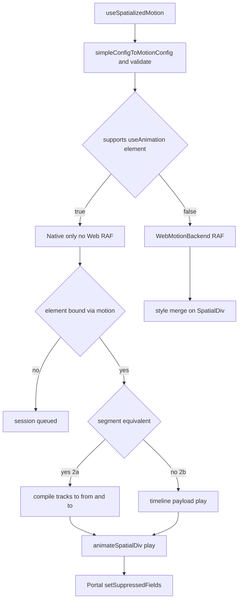

# Phase 2 最小原生集成 `simple` 到 spatial timeline

状态：在分支 `proposal/spatial-div-motion-timeline` 上**已实现** 2a segment 与 2b timeline。本文件仅为历史记录保留；**权威行为定义**见 `design.md`、`specs/spatial-div-motion/spec.md` 与 `specs/spatial-div-motion-native-timeline/spec.md`。

## 问题

Phase 1 的 `useSpatializedMotion` 只运行 **Web RAF 后端**：它会在 spatial **host/probe** DOM 路径上更新 React `style`。在 AVP / WebSpatial runtime 中，用户看到的是原生 `Spatialized2DElement`，而不是该 DOM。缺少原生 `animateSpatialDiv` 加上 Portal **suppression** 时，Z 轴与 `opacity` 的 motion 不会在空间中呈现出来。

Plan A 已经能在 AVP 上工作，链路为 `useAnimation` → `animation` prop → bind → `play { from, to }` → `setSuppressedFields`。

Plan B 必须复用这条管线，同时不能重新引入第二条公开样式通道。

## 策略 两个分片

| 分片 | 范围 | 原生工作 | 解除阻塞 |
| --- | --- | --- | --- |
| **2a 原生 segment 最小可用版本** | `simple()` 以及任何**等价于 segment** 的 timeline 单一 easing 每条 track 在 `0` 和 `duration` 各有 2 个 keyframe | Swift **无需修改**，复用现有 `from` / `to` `play` | AVP 上的 `simple-entrance`、fade、slide、Z 轴效果 |
| **2b 原生 timeline** | 任意 `tracks[]` 多轨重叠 | Swift `TimelineEvaluator` 加 bridge 上的 `timeline` | AVP 上的 `multi-track` 标准演示 |

先交付 **2a**，以天为单位；**2b** 对应 `tasks.md` 第 4 节中原始的 Phase 2。



## 原生 gate 已交付行为

在 **WebSpatial runtime** 中，即 `supports('useAnimation', ['element']) === true`：

- `play()` **始终**使用原生后端，可以是 segment 或 timeline。同一个 hook 实例上**不允许回退到 Web RAF**。
- 如果 `motion` 还没有绑定 `Spatialized2DElement`，session 会进入 **`queued`**，直到 `__setElement` 执行为止，也就是卡片会停留在 timeline `t=0`，直到 bind 完成，因此集成时必须传入 `motion={motion}`。

在 **普通浏览器** 中，即 `supports === false`，只运行 Web RAF。

```typescript
// Playback picker conceptually
if (supports('useAnimation', ['element'])) nativePlay() // includes queued when unbound
else webPlay()
```

## 分片 2a `simple` 到现有原生 segment

### 编译 仅 TS

新增 `packages/react/src/spatialized-container/motion/nativeCompile.ts`：

```typescript
/** Returns Plan A-compatible play payload, or null if timeline needs 2b. */
export function motionConfigToNativeSegment(
  config: SpatialDivMotionConfig,
): {
  from: SpatialDivAnimatedValues
  to: SpatialDivAnimatedValues
  duration: number
  timingFunction: TimingFunction
  delay?: number
  loop?: ...
  playbackRate?: number
} | null
```

满足以下条件时，视为**等价于 segment**：

1. 每条 track 都**恰好有两个** keyframe，且 `at === 0` 与 `at === config.duration`，允许浮点误差。
2. keyframe 已排序，且只覆盖 `[0, duration]`。
3. 所有 track 共享**同一个** `easing`，或使用 config 级默认值。若 track 之间 `easing` 不一致，则返回 `null`，交给 2b 或 Web。
4. 属性集合必须是 motion 白名单子集，这一点会由现有校验保证。

**算法** 反向镜像 `simple.ts`：

```typescript
const from: SpatialDivAnimatedValues = {}
const to: SpatialDivAnimatedValues = {}
for (const track of config.tracks) {
  setScalar(from, track.property, track.keyframes[0].value)
  setScalar(to, track.property, track.keyframes[1].value)
}
return { from, to, duration: config.duration, timingFunction: tracks[0].easing ?? 'easeInOut', ... }
```

`useSpatializedMotion.simple({ kind: 'spatialized2d', )` 已经通过 `simpleConfigToMotionConfig` 生成该形状，因此不需要额外的语法糖工作。

**可编译为 2a 的示例：**

- `simple-entrance`：`opacity` 加 `translate.y` 加 `translate.z`，对应**一次原生 `play`**，与 Plan A 合并后的 `from` / `to` 等价。
- 单属性淡入，或仅 Z 轴入场。

**无法编译为 2a 的示例 需要 2b 或 Web：**

- `multi-track`：`opacity` 的 keyframe 在 `3` 和 `5`，同时 `translate` 运行区间是 `0–5`。

### 原生 session 复用 Plan A

从 `useSpatialDivAnimation.ts` 中提取共享模块，不改变 Plan A 行为：

`packages/react/src/spatialized-container/motion/nativeSession.ts`

- `createNativeMotionSession(config, callbacks)`：封装 `animationId`、`doPlay`、`pause`、`resume`、`cancel` 以及 promise handler，也就是 `finished`、`canceled`、`failed`。
- 输入为上面的 segment payload，加上兼容 `SpatialDivAnimationConfig` 的回调，也就是 `onStart`、`onComplete`、`onCancel`、`onError`。

`useSpatializedMotionInternal` 分支：

```typescript
if (nativeElement && segment) {
  stopWebRaf()
  nativeSession.play(segment) // animateSpatialDiv({ type:'play', from, to, ... })
  return styleFromValues(evaluateMotionTimeline(config, 0)) // or empty style while suppressed
} else {
  runWebBackend()
}
```

当原生处于 **running** 时，不应再由 Web RAF 写入动画字段，因为实体由原生驱动。可选方案是未来订阅原生 tick 事件；对于 2a，运行期间**不提供逐帧 `style`**，而是依赖 suppression，这与 Plan A 相同。

### 不使用 `animation` prop 的 Portal 绑定

新增并行的绑定对象，内部形状与 Plan A 相同：

```typescript
export interface SpatialDivMotionBinding {
  readonly __kind: 'spatialDivMotion'
  readonly __motionObjectId: string
  get __animating(): boolean
  __getSuppressedFields(): Set<string> | null
  __setElement(el: Spatialized2DElement | null): void
  __onUnbind(): void
}
```

`useSpatializedMotion` 返回：

```typescript
{ style, api, motionBinding?: SpatialDivMotionBinding }
```

`motionBinding` **仅在** `supports('useAnimation', ['element'])` 为 true 时定义。

**SpatialDiv 用法 演示或应用：**

```typescript
const spatialDivUsageExample = `
const { style, api, motionBinding } = useSpatializedMotion.simple({
  kind: 'spatialized2d',
  duration: 1,
  from: { opacity: 0 },
  to: { opacity: 1 },
})

<div enable-xr motion={motionBinding} style={{ width: 320, ...style }} />
`
```

**Container 变更 最小版本：**

在 `PortalSpatializedContainer.tsx` 中，为可选 `motion` prop 复制现有 `animation` 的 `useEffect` 逻辑，也可以做成通用的 `spatialMotionBinding`。调用保持一致：

- `__setElement(spatializedElement)`
- `setSuppressedFields(__getSuppressedFields())`

**suppression 集合**，复用 Plan A helper 思路：

```typescript
function getMotionSuppressedFields(config: SpatialDivMotionConfig): Set<string> {
  const fields = new Set<string>()
  for (const track of config.tracks) {
    if (track.property === 'opacity') fields.add('opacity')
    if (track.property.startsWith('transform.')) fields.add('transform')
  }
  return fields
}
```

规则与 `useSpatialDivAnimation.ts` 中的 `getSuppressedFieldNames` 相同。

### autoStart 与 bind 顺序

复制 Plan A 的队列语义：

1. `autoStart` 触发 `play()`，如果此时没有 element，则 session 进入 `queued`。
2. 在 `__setElement` 时，使用已编译的 segment 执行 `doPlay`。
3. `onStart` 在原生接受 `play` 之后触发，而不是在 bind 之前。

StrictMode 下继续沿用 Phase 1 的 Web 后端清理逻辑；原生 session 在组件卸载时必须重置 `playState`，如果仍在运行还要发送 `cancel`。

### bind 之前的行为 已交付

**决策：** WebSpatial 上只使用原生，不在 bind 之前运行 Web RAF。session 处于 `queued` 时，React `style` 保持为 `evaluate(config, 0)`；等 `motion` 绑定元素后，再执行原生 `doPlay`。

## 分片 2b 真正的 timeline 已交付

### Bridge 扩展

```typescript
// packages/core/src/types/spatialDivAnimation.ts
export interface AnimateSpatialDivCommand {
  // ...existing fields...
  timeline?: SpatialDivMotionTimeline  // seconds-based keyframes, per-track easing
}
```

`SpatialDivMotionTimeline` 已经定义在 `spatialDivMotion.ts` 中，wire 层上的 `keyframes[].at` 需要与 Web evaluator 对齐，统一使用**秒**。

### Swift

- 为 `AnimateSpatialized2DElementCommand` 增加可选 `timeline`
- 如果 `timeline != nil`，则使用 `TimelineEvaluator`，按每条 track 做 segment 搜索与 easing 求值，并在每次 DisplayLink tick 上采样 `SpatialDivAnimationTarget`
- 如果 `timeline == nil`，则继续使用现有单段 lerp 逻辑，不变

**不要**移除 `from` / `to` 路径，因为 2a 仍会使用它。

### Hook 已交付

```typescript
// WebSpatial native only segment or timeline inside nativeSession.buildPlayCommand
if (supports('useAnimation', ['element'])) nativePlay()
else webPlay()
```

## 文件清单 2a 最小可用版本

| 文件 | 变更 |
| --- | --- |
| `motion/nativeCompile.ts` | `motionConfigToNativeSegment`、`motionConfigToTimeline`，2b 中先可为 stub |
| `motion/nativeSession.ts` | 从 `useSpatialDivAnimation` 中提取 |
| `motion/useSpatializedMotion.ts` | 后端选择器 加 `motionBinding` |
| `motion/getMotionSuppressedFields.ts` | 从 tracks 生成 suppression 集合 |
| `PortalSpatializedContainer.tsx` | 绑定 `motion` prop |
| `types`，位于 react spatialized-container | 在 props 上新增 `motion?: SpatialDivMotionBinding` |
| `spatialDivAnimation.ts`，位于 core | 在命令上新增可选 `timeline?`，2a 中即使未使用也先加类型 |
| `simple-entrance.tsx` | 传入 `motion={motionBinding}` |
| Tests | `nativeCompile.test.ts`、带 mock element 的 bridge 测试、StrictMode 加 bind 测试 |

**2a 不需要 Swift 改动。**

## 验收标准

### 2a AVP 或 simulator

1. `#/spatial-div-motion/simple-entrance` 在 `from` / `to` 中包含 `translate.z` 时，空间窗口中可以看到明显的 Z 轴加 opacity 入场。
2. Replay 可以重新挂载并重新以原生方式播放。
3. Portal 不会在播放过程中覆盖 `transform` 与 `opacity`，也就是 suppression 生效时应跳过 `updateTransform`。
4. 在普通 Chrome 中，当 `supports` 为 false 或无 session 时，仍然使用 Web RAF，避免回归。

### 2b

1. `#/spatial-div-motion/multi-track` 在 simulator 中满足标准场景，0–3s 只有 `translate`，3–5s `opacity` 再开始上升。
2. Web 与原生的最终值一致，如存在 easing 差异，需要文档说明。

## 风险与说明

| 风险 | 缓解方式 |
| --- | --- |
| `simple()` 中每条 track 的 easing 不一致 | `motionConfigToNativeSegment` 返回 `null`，转为 Web 并给出 warning |
| segment 路径只在 `simple()` 上支持单个 `timingFunction`，不支持每轨独立 easing | 在文档中说明；2b 原生 timeline 会补上每轨 easing |
| bind 时双后端竞争 | 在原生 `play` 之前停止 RAF，并在第一次 `updateProperties` 之前完成 suppression |
| 公开 `motion` prop 与 `animation` prop 并存 | `motion` 只属于 Plan B；迁移期允许两者并存，并在文档中说明互斥关系 |

## 建议的任务拆分 追加到 `tasks.md`

```markdown
## 4a. Native segment backend MVP no Swift

- [ ] 4a.1 `motionConfigToNativeSegment` + tests simple and segment-equivalent timelines
- [ ] 4a.2 Extract `nativeSession.ts` from `useSpatialDivAnimation`
- [ ] 4a.3 `useSpatializedMotion`: native gate, bind, suppression, stop RAF when native runs
- [ ] 4a.4 `motion` prop binding in `PortalSpatializedContainer`
- [ ] 4a.5 Wire `simple-entrance` plus manual AVP check

## 4b. Native timeline backend

- [ ] 4b.1 `timeline` on `AnimateSpatialDivCommand` + JSB encode
- [ ] 4b.2 `TimelineEvaluator` in `SpatialDivAnimationSession.swift`
- [ ] 4b.3 `playTimeline` in hook + multi-track AVP parity test
```

## 参考 Plan A 的 Z 轴入场 当前已可用

`/spatial-div-animation/fade-in-entrance` 使用的是原生 segment `translate.z: 0 → 100`。在 2a 完成后，Plan B 的 `simple({ from: { translate: { z: 0 }, opacity: 0 }, to: { translate: { z: 100 }, opacity: 1 } })` 在 AVP 上应当与其**行为等价**。