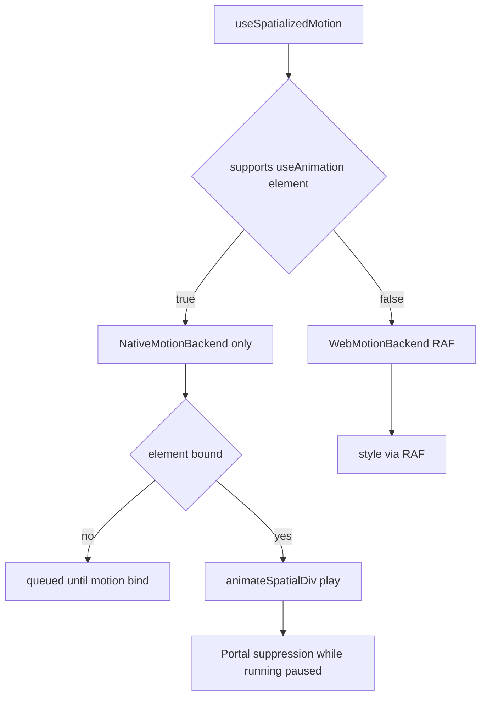

# 背景

`SpatialDiv` 的同步当前依赖 host 与 probe DOM，并在原生动画期间对字段级和 transform 级同步做抑制，见 `packages/react/src/spatialized-container/ARCHITECTURE.md`。Plan A 会话 API 在此基础上新增 `animation` prop 绑定和单段原生插值。本设计作为 Plan B，保留抑制与 bridge 基础设施，但把**作者模型**改为**时间线文档**与**单一 `style` 出口**。

## 目标与非目标

**目标：**

- 以 timeline 为中心的配置，支持按轨道声明关键帧，并由全局 `duration` 控制。
- `useSpatializedMotion` 返回 `{ style, api }`，可直接用于 `<div enable-xr style={...} />`。
- **双后端**：WebSpatial 运行时在 `supports('useAnimation', ['element'])` 为 `true` 时走**原生后端**；普通浏览器走 Web RAF 后端，且不得退化为 no-op。空间节点仍需要 `motion` 绑定。
- 提供 `useSpatializedMotion.simple({ kind: 'spatialized2d', ... })` 语法糖，用于表达与 Plan A 最小场景等价的两关键帧单段动画。
- 复用 Plan A 已有的 bridge、Manager、抑制逻辑以及原生 SRT 合成能力。

**非目标：**

- v1 不提供完整的 `@react-spring/web` 物理弹簧模拟；仅支持 easing 与 keyframe，未来可再扩展为弹簧或预采样曲线。
- 不支持布局或尺寸字段动画，例如 `width`、`height`、`back`、`depth`。
- 不支持任意 CSS transform 字符串作为 motion 输入。
- 不改变 entity `useAnimation` 分支的既有行为。

## API Surface

```typescript
function useSpatializedMotion(
  config: SpatialDivMotionConfig,
): {
  style: SpatialDivMotionStyle
  api: SpatialDivMotionApi
  /** Spatial runtime only — runtime binding; see Integration & documentation. */
  motion?: SpatialDivMotionBindingInternal
}

namespace useSpatializedMotion {
  function simple(config: SpatialDivMotionSimpleConfig): ReturnType<typeof useSpatializedMotion>
}
```

### SpatialDivMotionConfig

```typescript
interface SpatialDivMotionConfig {
  /** Global timeline length in seconds. Must be > 0 and finite. */
  duration: number
  tracks: SpatialDivMotionTrack[]
  delay?: number
  autoStart?: boolean
  loop?: boolean | { reverse?: boolean }
  playbackRate?: number
  onStart?: () => void
  onComplete?: (values: SpatialDivAnimatedValues) => void
  onCancel?: (values: SpatialDivAnimatedValues) => void
  onError?: (error: AnimationError) => void
}

interface SpatialDivMotionTrack {
  property: SpatialDivMotionProperty
  keyframes: Array<{ at: number; value: number }>
  easing?: TimingFunction
}
```

`SpatialDivMotionProperty` 取值限定为：`opacity`、`transform.translate.x|y|z`、`transform.rotate.x|y|z`、`transform.scale.x|y|z`。

### Style outlet

`SpatialDivMotionStyle` 是 `React.CSSProperties` 的受限子集，只包含 motion hook 所拥有的动画字段，即 `opacity` 与组合后的 `transform` CSS 字符串。布局字段仍由调用方在静态样式中提供，例如 `style={{ width: 300, ...motion.style }}`。

## Dual backend



**WebSpatial 运行时** `supports('useAnimation', ['element']) === true` 时，播放必须只走原生后端。若 timeline 与单段动画等价，可以走 segment `from` / `to`；否则走 `timeline`。若 `play()` 发生在 bind 之前，会进入**queued**，直到 `motion` 通过 `__setElement` 绑定完成。visionOS 上**不允许**退回 Web RAF。

**普通 Web** `supports === false` 时，只运行 Web RAF 后端，且必须驱动与原生一致的 `style` 形状。

WebSpatial 上暴露给应用的 `style` 仍是 React 的样式合并目标，并在 `pause`、`complete`、`cancel` 边界被采样；原生播放过程中它不是驱动引擎。

**原生播放期间的 `style` 出口：** 当 session 处于 `running` 时，原生拥有动画字段，Portal suppression 会阻止 DOM 同步覆盖这些字段。Hook 依然暴露一份 `style` 合并目标，但作者应把**暂停、结束、取消**当作 `style` 的采样边界；暂停时使用 motion session 记录的墙钟进度配合 `evaluateMotionTimeline` 采样。不要在原生播放中通过轮询 `style` 来做验收。

## Timeline compilation

- **校验**：`keyframes` 必须按 `at` 排序；`at` 落在 `[0, duration]`；每条 track 至少两个关键帧；不同 track 之间不得重复使用同一 `property`；数值范围应与 Plan A 的白名单规则一致。
- **在时间 `t` 处求值**：逐条 track 定位区间 `[k_i, k_{i+1}]`，套用 easing，计算标量插值；汇总为 `SpatialDivAnimatedValues`，并按 translate → rotate → scale 组合 CSS `transform`。
- **Hold 规则**：若 `t` 早于首个关键帧，则取首值；若晚于最后一个关键帧，则取末值。

## Native evolution using Plan A infrastructure

扩展 `AnimateSpatialized2DElement` 的 `play` payload：

```typescript
{
  type: 'play',
  animationId: string,
  elementId: string,
  timeline: {
    duration: number,
    delay?: number,
    playbackRate?: number,
    loop?: ...,
    tracks: Array<{
      property: string,
      keyframes: Array<{ t: number; value: number }>,
      easing: string,
    }>,
  },
}
```

`SpatialDivAnimationSession` 继续保留 DisplayLink、pause、cancel 等能力；当存在 `timeline` 时，把单段 progress lerp 替换为 `TimelineEvaluator`。

## simple sugar

`simple({ from, to, duration, ... })` 会脱糖为一条 timeline：对 `from` / `to` 中出现的每个标量字段生成一条 track，其关键帧为 `[{ at: 0, value: from }, { at: duration, value: to }]`。

## Integration and documentation

### Public surface versus runtime binding

面对应用开发者的**作者契约**是 `{ style, api }`，以及 `useSpatializedMotion.simple({ kind: 'spatialized2d', ... })` 语法糖。动画值必须只通过 `style` 合并；motion 路径不得使用 Plan A 的 `animation` prop 作为值通道。

**原生 WebSpatial 运行时**还需要额外的**元素绑定**，这样 `useSpatializedMotion` 才能接入 `PortalSpatializedContainer` 创建的 `Spatialized2DElement` 并施加 suppression。目前这一绑定以可选的第三个返回值和同名 DOM prop 暴露：

| 字段或 prop | 面向对象 | 作用 |
| --- | --- | --- |
| `style` | 所有环境 | 动画 `opacity` / `transform` 出口，普通浏览器由 Web RAF 驱动，WebSpatial 上承载边界采样与布局合并 |
| `api` | 所有环境 | `play`、`pause`、`cancel` 与生命周期 |
| `motion` hook 字段与 `motion` prop | Spatial 且 `supports('useAnimation', ['element'])` 为 true | **运行时绑定句柄**，不是 timeline 配置，也不是 CSS |

当 `supports('useAnimation', ['element'])` 为 `false` 时，`motion` 必须是 `undefined`，应用只需使用 `style` 与 `api`。

### 如何向开发者说明 `motion`

文档应明确呈现：

1. **快速开始**：普通浏览器场景中，hook 配合 `<div enable-xr style={{ ...layout, ...style }} />` 即可，Chrome 与 Safari 足够使用，因为此时是 Web RAF 播放。
2. **WebSpatial 运行时接线**：同一节点还必须传入 `motion={motion}`。visionOS 上只会做**原生播放**；缺少 `motion` 时，动画会停在等待 bind 状态。它应被描述为**SDK 运行时接线**，角色类似 Plan A 的 `animation={animation}`，但它不承载动画值，动画值始终在 `style` 中。
3. **不要这样理解**：不要手动操作 `__setElement` / `__getSuppressedFields`；不要把 `motion` 当成第二份样式对象；不要与 Framer Motion 的 `<motion.div>` 混淆。

推荐文档标题可使用 “Runtime binding `motion` spatial only” 与 “Why Web does not need motion”。

### Optional MotionSpatialDiv wrapper recommended for DX

SDK 可以提供一个轻量的 `MotionSpatialDiv` 或同类封装，用来：

- 在内部调用 `useSpatializedMotion`，或接收调用方传入的 `{ style, api, motion }`
- 在内部渲染 `<div enable-xr motion={motion} style={{ ...layout, ...style }} />`

使用该 wrapper 时，**应用不需要手写 `motion`**；绑定工作保留在 SDK 内部完成。这种模式与 `@react-spring/web` 的 `animated(Component)` 类似，即绑定在封装内部完成，应用只关心一份 `style`。

`MotionSpatialDiv` 是可选能力；在它成为默认文档入口之前，底层 `motion` prop 仍保留给自定义树与 test-server demo 使用。

### Comparison to React Spring documentation only

在 test-server 中，`@react-spring/web` 的集成方式是 `useSpring` 配合 `animated(withSpatialized2DElementContainer('div'))`。它没有单独的 binding prop，因为 `animated()` 自己持有 DOM 与 ref 附着逻辑。

WebSpatial 的差异在于，空间目标是通过 Portal 创建出来的 `Spatialized2DElement`，并不是 hook 调用点所在的同一个 React DOM 节点。因此这里需要一个显式的绑定通道，也就是 `motion`，或 Plan A 里的 `animation`。

Plan B 的 Web 后端在作者体验上与 Spring 接近，即浏览器里由 style 驱动 keyframe；但 visionOS 的原生播放依然通过 WebSpatial bridge 完成，而不是让 Spring 直接驱动原生空间实体。

### Relationship to Plan A animation prop

| 维度 | Plan A session | Plan B motion |
| --- | --- | --- |
| 动画值通道 | `style` + `animation` | **仅 `style`** |
| Portal 绑定 prop | `animation` | `motion` |
| 普通 Web 上 `play()` | no-op | Web 后端必须播放 |

绑定机制本身可以复用；差异在于 prop 名称以及动画值通道的划分方式。

## Decisions

1. **采用新的 hook 名称**：使用 `useSpatializedMotion`，避免把 timeline 语义继续塞进 `useAnimation`。
2. **motion 路径不再使用 `animation` prop**：减少双通道 authoring 带来的错误；Plan A 仅作为对照方案保留。
3. **Web 后端是规范的一部分**：它不是只用于开发环境的 fallback。
4. **继续复用 `supports('useAnimation', ['element'])`**：它只作为原生后端的 gate。
5. **绞杀式落地**：先在提案分支交付 Web 后端与 spec，再逐步接入原生 timeline。

## Risks

- Web 与 native 的视觉一致性存在风险，需要在文档中说明允许的 easing 差异，并用标准多轨场景做双端对照测试。
- 原生 timeline 的实现范围较大，通过分阶段任务来控制风险。
- 与 Plan A 相同，Concurrent Mode 仍是限制项，因为 suppression 与 React render 节点耦合，需在文档中明确说明。