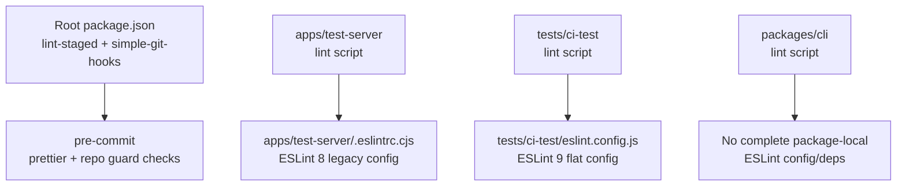
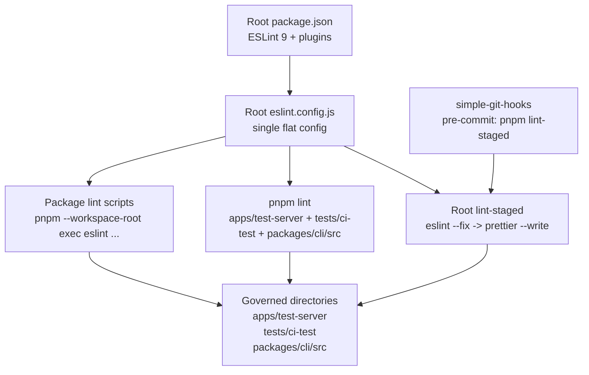

## Context

The repository is a pnpm workspace monorepo. ESLint usage was split across packages:

- `apps/test-server` used ESLint 8 with a legacy `.eslintrc.cjs`.
- `tests/ci-test` used ESLint 9 with a local flat config.
- `packages/cli` exposed a lint script, but had no complete package-local ESLint config or dependency set.
- Root `lint-staged` did not run ESLint fixes.

The design records the implemented governance migration. It is deliberately conservative: centralize the configuration and pre-commit integration without attempting a whole-repository lint cleanup.

## Goals / Non-Goals

**Goals:**

- Use one root ESLint 9 flat config for the governed directories.
- Preserve package-level lint commands as stable developer entry points.
- Add automatic unused import removal through `eslint-plugin-unused-imports`.
- Run `eslint --fix` and `prettier --write` for staged files in governed directories.
- Govern `apps/test-server`, `tests/ci-test`, `packages/cli/src`, `packages/core`, and `packages/react` as one change.
- Avoid changing business code or formatting unrelated files.
- Keep the migration reviewable and isolated from feature work.

**Non-Goals:**

- Enforcing zero warnings across all existing code.
- Fixing historical React Hooks, React Refresh, or CLI inline-disable warnings.
- Migrating every workspace package to ESLint in one pass outside the proposed governance scope.
- Replacing framework-specific lint behavior for Next or other fixture applications.
- Changing SDK runtime behavior or public APIs.

## Architecture

### Architecture Change Overview

Before this change, ESLint ownership and pre-commit behavior were split:



After this change, root configuration owns lint behavior and package scripts are thin entry points:



### Root ESLint ownership

The root `eslint.config.js` owns the ESLint configuration for the governed directories. It uses ESLint 9 flat config and imports these root-level dependencies:

- `@eslint/js`
- `typescript-eslint`
- `globals`
- `eslint-plugin-react-hooks`
- `eslint-plugin-react-refresh`
- `eslint-plugin-unused-imports`

Subdirectories no longer carry their own ESLint config files. This removes version/configuration drift between `apps/test-server` and `tests/ci-test`.

### Rule strategy

The config starts with recommended JavaScript and TypeScript rules, then deliberately disables rules that would force broad historical cleanup. In the base override applied to all linted source files (`**/*.{js,jsx,ts,tsx,cjs,mjs}`), the following rules are turned `off`:

- `no-unused-vars`
- `@typescript-eslint/no-unused-vars`
- `@typescript-eslint/ban-ts-comment`
- `@typescript-eslint/no-explicit-any`
- `@typescript-eslint/no-require-imports`
- `@typescript-eslint/no-unsafe-function-type`
- `@typescript-eslint/no-wrapper-object-types`
- `no-var`
- `prefer-const`
- `unused-imports/no-unused-vars`

Note that unused _variables_ are intentionally left unenforced (`unused-imports/no-unused-vars` is `off`); only unused _imports_ are enforced.

The main enforced rule added by this change is:

- `unused-imports/no-unused-imports` (set to `error`)

This keeps pre-commit enforcement focused on a low-risk automated fix: removing unused imports.

Two additional narrow rule relaxations exist as directory-specific overrides:

- `tests/ci-test/**/*.{ts,tsx}`: `@typescript-eslint/no-unused-expressions` is `off` (Chai/Mocha assertion style).
- `packages/cli/src/**/*.{ts,js}`: `no-empty` and `no-useless-escape` are `off` (see CLI compatibility override below).

### Directory overrides

Browser/React override:

- `apps/test-server/**/*.{ts,tsx}`
- `tests/ci-test/src/**/*.{ts,tsx}`

This override enables browser globals, React Hooks rules, and React Refresh checks.

Node/test override:

- `apps/test-server/*.{js,cjs,mjs}`
- `tests/ci-test/{scripts,test,utils}/**/*.{ts,tsx,js}`
- `tests/ci-test/*.{ts,js}`
- `packages/cli/src/**/*.{ts,js}`

This override enables Node and Mocha globals where needed.

CLI compatibility override:

- `packages/cli/src/**/*.{ts,js}`

This override sets `linterOptions.noInlineConfig: true` and `reportUnusedDisableDirectives: 'off'`, and disables `no-empty` and `no-useless-escape`. The purpose is to avoid blocking the migration on old inline disable comments for the removed `@typescript-eslint/camelcase` rule. Note the side effect: `noInlineConfig: true` disables _all_ inline ESLint directives across `packages/cli/src`, not just the stale `camelcase` ones — this is broader than a targeted fix. The stale `camelcase` comments still surface as `has no effect` warnings and can be cleaned up separately.

### Package lint scripts

Each governed package keeps a local lint script, but delegates execution to the workspace root ESLint installation:

- `apps/test-server`: `pnpm --workspace-root exec eslint apps/test-server --report-unused-disable-directives`
- `tests/ci-test`: `pnpm --workspace-root exec eslint tests/ci-test`
- `packages/cli`: `pnpm --workspace-root exec eslint packages/cli/src`

This keeps package-level commands usable while avoiding package-local ESLint dependency duplication.

### Pre-commit integration

The repository continues to use root `simple-git-hooks`:

```json
"pre-commit": "pnpm lint-staged"
```

Root `lint-staged` now includes directory-specific ESLint fix rules before Prettier:

- `apps/test-server/**/*.{js,jsx,ts,tsx}`
- `tests/ci-test/**/*.{js,jsx,ts,tsx}`
- `packages/cli/src/**/*.{js,ts}`

Each governed staged file group runs:

1. `eslint --fix`
2. `prettier --write`

Existing repository guard tasks remain unchanged.

## Extensibility and SDK Package Integration

This architecture supports incremental implementation without splitting the requirement. The full change covers `apps/test-server`, `tests/ci-test`, `packages/cli/src`, `packages/core`, and `packages/react`. Adding `packages/core` and `packages/react` to the implementation does not require a new configuration system; it requires adding them to the root-owned governance surface:

1. Add or refine root `eslint.config.js` overrides for the package's runtime shape.
2. Add the package path to root `pnpm lint` when the full package lint is expected to pass.
3. Add or update the package-level `lint` script to call `pnpm --workspace-root exec eslint <path>`.
4. Add a directory-specific `lint-staged` glob only after staged-file auto-fix behavior is verified.

The main cost is not the mechanics of wiring a new package. The main cost is discovering and deciding how to handle historical lint findings in that package without mixing cleanup into unrelated feature work.

### Integration cost for `packages/core`

Expected cost: low to medium.

`packages/core` is a TypeScript library/runtime package and does not need React Refresh or React Hooks rules. The likely work is:

- Add a focused root override for `packages/core/**/*.{ts,tsx,js}`.
- Decide whether files should use browser globals, Node globals, or no extra globals by default.
- Run ESLint in report-only mode first to classify historical findings.
- Start with `unused-imports/no-unused-imports` and other low-risk rules before considering stricter TypeScript rules.
- Ensure generated output, type declarations, and package build artifacts remain ignored.

The risk is moderate because this package is part of the published SDK surface. Even automatic fixes should be reviewed carefully, but the config shape should be straightforward.

### Integration cost for `packages/react`

Expected cost: medium.

`packages/react` is larger and closer to user-facing SDK behavior. It contains React SDK code, tests, framework-specific integration points, and likely a mix of browser, Node, and test contexts. The likely work is:

- Add separate root overrides for source, tests, build/config files, and any JSX/runtime-specific files.
- Reuse React Hooks rules where appropriate, but avoid React Refresh rules unless the file shape matches app-style components.
- Run ESLint in report-only mode first because existing React SDK code may surface hooks, unused import, test, and TypeScript warnings.
- Decide whether pre-commit should cover all of `packages/react` or only a safe subset such as `src/**/*.{ts,tsx}`.
- Keep any broad cleanup in a dedicated PR rather than combining it with the governance wiring.

The risk is higher than `packages/core` because rule changes can create noisy review output in core React SDK files. The preferred path is to add lint entry points first, keep enforcement narrow, and expand only after warnings are triaged.

### Suggested implementation order

1. `packages/core`: smaller rule surface, no React-specific lint behavior required.
2. `packages/react`: larger surface, requires careful React/test override design.
3. Fixture applications and compatibility tests: evaluate separately because framework tooling and example-code tolerance differ by fixture.

This keeps the root flat config reusable while avoiding a risky all-at-once monorepo lint migration.

## Risk Management

- The governed set is intentionally limited to known ESLint entry points.
- Warnings are not promoted to errors because existing code has historical React and CLI warnings.
- `packages/cli` is limited to `src` and does not include tests in pre-commit fix.
- Workspace packages outside `packages/core` and `packages/react` remain out of scope until they have dedicated cleanup and validation.

## Follow-Up Work

- Remove stale `@typescript-eslint/camelcase` disable comments in `packages/cli`.
- Decide whether React Hooks / React Refresh warnings in `apps/test-server` should become tracked cleanup work.
- Evaluate fixture app linting separately, especially Next-based fixtures.
