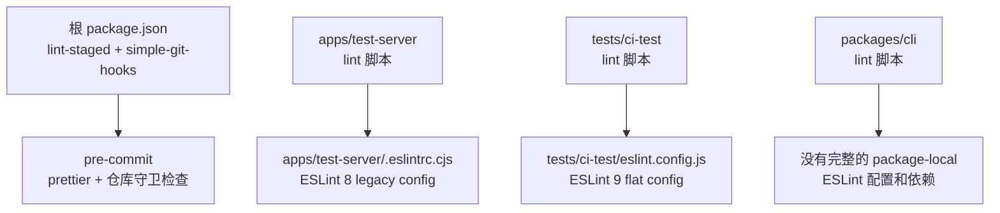
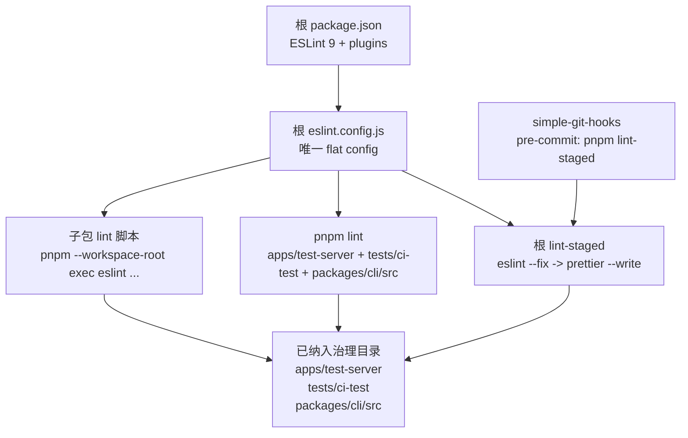

## 上下文

本仓库是 pnpm workspace monorepo。改造前 ESLint 使用方式分裂在多个 package 中：

- `apps/test-server` 使用 ESLint 8 和 legacy `.eslintrc.cjs`。
- `tests/ci-test` 使用 ESLint 9 和本地 flat config。
- `packages/cli` 暴露了 lint 脚本，但没有完整的 package-local ESLint 配置和依赖。
- 根 `lint-staged` 不执行 ESLint 自动修复。

本设计记录已经实施的治理迁移。方案刻意保持保守：统一配置和 pre-commit 集成，但不尝试一次性清理全仓历史 lint 问题。

## 目标 / 非目标

**目标：**

- 对已纳入治理的目录使用一个根级 ESLint 9 flat config。
- 保留 package 级 lint 命令，作为稳定的开发入口。
- 通过 `eslint-plugin-unused-imports` 自动移除未使用 import。
- 对已纳入治理目录中的 staged 文件执行 `eslint --fix` 和 `prettier --write`。
- 将 `apps/test-server`、`tests/ci-test`、`packages/cli/src`、`packages/core` 和 `packages/react` 作为一个完整变更统一治理。
- 不修改业务代码，不格式化无关文件。
- 让本次迁移保持独立、可评审，不混入功能变更。

**非目标：**

- 要求全量历史代码零 warning。
- 修复历史 React Hooks、React Refresh 或 CLI inline-disable warning。
- 在本提案治理范围之外一次性迁移所有 workspace package 到 ESLint。
- 替换 Next 或其他 fixture 应用的框架特定 lint 行为。
- 修改 SDK 运行时行为或公开 API。

## 架构

### 架构变化概览

改造前，ESLint 所有权和 pre-commit 行为是分裂的：



改造后，根配置统一拥有 lint 行为，子包脚本只作为薄入口：



### 根级 ESLint 所有权

根 `eslint.config.js` 负责已纳入治理目录的 ESLint 配置。它使用 ESLint 9 flat config，并从根依赖中引入：

- `@eslint/js`
- `typescript-eslint`
- `globals`
- `eslint-plugin-react-hooks`
- `eslint-plugin-react-refresh`
- `eslint-plugin-unused-imports`

子目录不再维护自己的 ESLint 配置文件，从而消除 `apps/test-server` 和 `tests/ci-test` 之间的版本和配置漂移。

### 规则策略

配置以 JavaScript 和 TypeScript recommended 规则为基础，但会显式关闭会导致大面积历史清理的规则。在应用于所有被 lint 的源文件(`**/*.{js,jsx,ts,tsx,cjs,mjs}`)的基础 override 中，以下规则被设为 `off`：

- `no-unused-vars`
- `@typescript-eslint/no-unused-vars`
- `@typescript-eslint/ban-ts-comment`
- `@typescript-eslint/no-explicit-any`
- `@typescript-eslint/no-require-imports`
- `@typescript-eslint/no-unsafe-function-type`
- `@typescript-eslint/no-wrapper-object-types`
- `no-var`
- `prefer-const`
- `unused-imports/no-unused-vars`

注意:未使用的**变量**是有意不强制的(`unused-imports/no-unused-vars` 为 `off`);只强制未使用的 **import**。

本次主要新增并强制的规则是：

- `unused-imports/no-unused-imports`(设为 `error`)

这样 pre-commit enforcement 聚焦在低风险自动修复：删除未使用 import。

此外还有两处目录级的窄范围规则放宽 override：

- `tests/ci-test/**/*.{ts,tsx}`:`@typescript-eslint/no-unused-expressions` 为 `off`(Chai/Mocha 断言风格)。
- `packages/cli/src/**/*.{ts,js}`:`no-empty` 和 `no-useless-escape` 为 `off`(见下方 CLI 兼容 override)。

### 目录 override

Browser / React override：

- `apps/test-server/**/*.{ts,tsx}`
- `tests/ci-test/src/**/*.{ts,tsx}`

该 override 启用 browser globals、React Hooks 规则和 React Refresh 检查。

Node / test override：

- `apps/test-server/*.{js,cjs,mjs}`
- `tests/ci-test/{scripts,test,utils}/**/*.{ts,tsx,js}`
- `tests/ci-test/*.{ts,js}`
- `packages/cli/src/**/*.{ts,js}`

该 override 为需要的文件启用 Node 和 Mocha globals。

CLI 兼容 override：

- `packages/cli/src/**/*.{ts,js}`

该 override 设置了 `linterOptions.noInlineConfig: true` 与 `reportUnusedDisableDirectives: 'off'`，并关闭 `no-empty` 和 `no-useless-escape`。其目的是避免旧的、针对已移除的 `@typescript-eslint/camelcase` 规则的 inline disable 注释阻塞迁移。需注意副作用:`noInlineConfig: true` 会禁用 `packages/cli/src` 下**所有**的 inline ESLint 指令，而不仅仅是过时的 `camelcase` 注释——影响范围比定向修复更广。这些过时的 `camelcase` 注释仍会以 `has no effect` warning 形式暴露，后续可单独清理。

### 子包 lint 脚本

每个纳入治理的 package 保留本地 lint 脚本，但执行时委托给 workspace root 的 ESLint 安装：

- `apps/test-server`: `pnpm --workspace-root exec eslint apps/test-server --report-unused-disable-directives`
- `tests/ci-test`: `pnpm --workspace-root exec eslint tests/ci-test`
- `packages/cli`: `pnpm --workspace-root exec eslint packages/cli/src`

这样既保留 package 级命令，又避免在子包重复维护 ESLint 依赖。

### Pre-commit 集成

仓库继续使用根 `simple-git-hooks`：

```json
"pre-commit": "pnpm lint-staged"
```

根 `lint-staged` 现在为已纳入治理目录增加目录级 ESLint fix 规则：

- `apps/test-server/**/*.{js,jsx,ts,tsx}`
- `tests/ci-test/**/*.{js,jsx,ts,tsx}`
- `packages/cli/src/**/*.{js,ts}`

每组 staged 文件执行：

1. `eslint --fix`
2. `prettier --write`

已有仓库守卫任务保持不变。

## 可扩展性与 SDK Package 接入

这套架构支持渐进实施，但需求本身不拆分。完整变更覆盖 `apps/test-server`、`tests/ci-test`、`packages/cli/src`、`packages/core` 和 `packages/react`。接入 `packages/core` 和 `packages/react` 时，不需要引入新的配置体系，只需要把它们加入根级治理面：

1. 在根 `eslint.config.js` 中增加或细化该 package 的运行环境 override。
2. 当该 package 的完整 lint 能通过时，把路径加入根 `pnpm lint`。
3. 新增或更新 package 级 `lint` 脚本，统一调用 `pnpm --workspace-root exec eslint <path>`。
4. 只有在 staged 文件自动修复行为验证通过后，才为该目录增加专属 `lint-staged` glob。

扩展的主要成本不在接线本身，而在于发现并决策该 package 的历史 lint 问题如何处理，同时避免把历史清理混入无关功能变更。

### `packages/core` 接入成本

预期成本：低到中等。

`packages/core` 是 TypeScript library/runtime package，不需要 React Refresh 或 React Hooks 规则。预计工作包括：

- 为 `packages/core/**/*.{ts,tsx,js}` 增加聚焦的根级 override。
- 判断默认应使用 browser globals、Node globals，还是不额外引入 globals。
- 先以 report-only 方式运行 ESLint，对历史问题分类。
- 优先接入 `unused-imports/no-unused-imports` 和其他低风险规则，再考虑更严格的 TypeScript 规则。
- 确保生成产物、类型声明和 package build artifacts 仍被 ignore。

风险中等，因为它属于 published SDK surface。即使是自动修复也需要谨慎 review，但配置形态本身相对直接。

### `packages/react` 接入成本

预期成本：中等。

`packages/react` 规模更大，也更接近用户可见 SDK 行为。它包含 React SDK 代码、测试、框架集成点，并且可能混合 browser、Node、test 等上下文。预计工作包括：

- 为 source、tests、build/config 文件以及 JSX/runtime 相关文件分别增加根级 override。
- 在合适范围复用 React Hooks 规则，但不要默认对 SDK 源码套用 app-style 的 React Refresh 规则。
- 先以 report-only 方式运行 ESLint，因为现有 React SDK 代码可能暴露 hooks、unused import、test 和 TypeScript warning。
- 决定 pre-commit 是覆盖整个 `packages/react`，还是先覆盖更安全的子集，例如 `src/**/*.{ts,tsx}`。
- 大面积历史清理应放在独立 PR 中，不和治理接线混在一起。

风险高于 `packages/core`，因为规则变化可能在 React SDK 核心文件中产生大量 review 噪音。推荐路径是先增加 lint 入口，保持 enforcement 窄范围，待 warning 分类后再扩展。

### 建议实施顺序

1. `packages/core`：规则面更小，不需要 React 专属 lint 行为。
2. `packages/react`：代码面更大，需要更谨慎的 React/test override 设计。
3. fixture 应用和兼容性测试：单独评估，因为不同 fixture 的框架工具链和示例代码容忍度不同。

这样可以复用根级 flat config，同时避免高风险的一次性全仓 lint 迁移。

## 风险控制

- 纳入范围刻意限制在已有 ESLint 入口且已验证的目录。
- 不将 warning 升级为 error，因为现有代码包含历史 React 和 CLI warning。
- `packages/cli` 仅覆盖 `src`，不将 test 文件纳入 pre-commit fix。
- `packages/core` 和 `packages/react` 之外的 workspace package 暂不纳入，等待后续单独清理和验证。

## 后续工作

- 清理 `packages/cli` 中过时的 `@typescript-eslint/camelcase` disable 注释。
- 判断 `apps/test-server` 中 React Hooks / React Refresh warning 是否需要独立清理任务。
- 单独评估 fixture 应用的 lint 策略，尤其是 Next fixtures。
