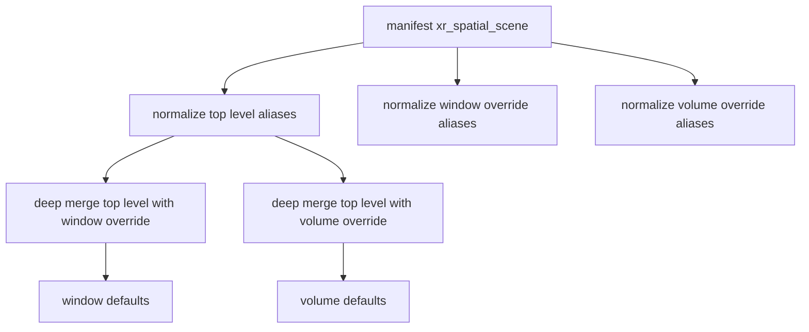
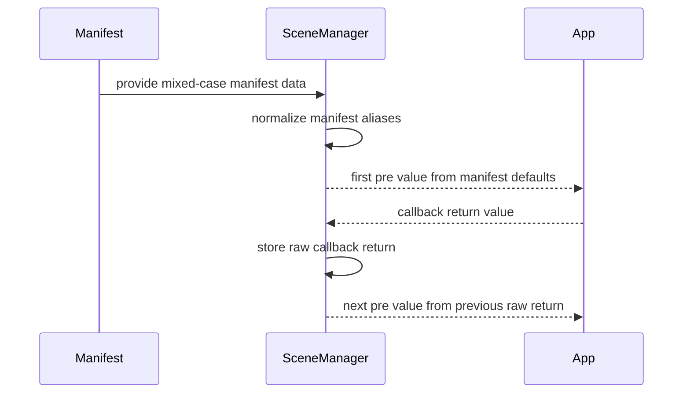

## Context

`xr_spatial_scene` sits between the SDK's built-in scene defaults and application-level `initScene()` callbacks. The branch already adds tests and docs for mixed-case manifest input, but without an OpenSpec design there is no shared contract for how aliases are resolved within a layer, how scene-type overrides interact with top-level values, or which values are normalized before they are exposed to runtime consumers.

## Goals / Non-Goals

**Goals:**
- Define a deterministic alias resolution rule for supported `xr_spatial_scene` keys.
- Keep override priority unchanged while allowing alias forms on both top-level and per-scene override objects.
- Normalize manifest-derived defaults into the runtime camelCase shape before they reach scene initialization paths.
- Preserve existing callback chaining behavior for repeated `initScene()` calls on the same scene name.

**Non-Goals:**
- Introducing new manifest fields beyond the supported alias set in this branch.
- Changing scene unit validation or formatting rules.
- Changing the precedence of `initScene()` callback returns over manifest-derived defaults.
- Normalizing arbitrary callback return values from application code.

## Decisions

### Decision: Resolve aliases inside each object layer before merging layers

The implementation resolves aliases on the source object where they appear, then deep-merges normalized objects across layers.

Rationale:
- This keeps the existing precedence model intact.
- It avoids cross-layer alias leaks where one layer could accidentally suppress another layer's key.

Alternative considered:
- Merge raw objects first, then normalize once. Rejected because the merged object would lose information about which alias originated in which precedence layer.

### Decision: Snake case wins when both aliases exist on the same object

Supported pairs such as `default_size` and `defaultSize`, or `window_scene` and `windowScene`, are resolved with snake_case priority within the same object layer.

Rationale:
- The manifest documentation already centers snake_case names.
- Existing tests in this branch assert that same-layer alias conflicts prefer snake_case.

Alternative considered:
- Prefer camelCase or treat duplicates as an error. Rejected because both would break existing manifests and tests on this branch.

### Decision: Normalize only manifest-derived defaults, not callback chaining state

Manifest input is normalized into the runtime camelCase shape before it is used as the `pre` value for the first `initScene()` call. However, once a callback returns a value, that raw return value is stored and passed back unchanged on later calls for the same scene name.

Rationale:
- This preserves existing chaining semantics validated by the tests in this branch.
- It avoids mutating developer-owned objects after the first callback cycle.

Alternative considered:
- Normalize every callback return before storing it. Rejected because it would silently rewrite application state between calls.

### Decision: Keep support surface intentionally narrow

This change documents and implements aliases only for:
- `default_size` and `defaultSize`
- `world_scaling` and `worldScaling`
- `world_alignment` and `worldAlignment`
- `baseplate_visibility` and `baseplateVisibility`
- `window_scene` and `windowScene`
- `volume_scene` and `volumeScene`
- `min_width` `min_height` `max_width` `max_height` within `resizability`

Rationale:
- These are the aliases covered by the branch implementation and tests.
- Expanding beyond the verified surface would be speculative.

## Risks / Trade-offs

- Risk: mixed naming remains visible in input examples. Mitigation: normalize all manifest-derived runtime defaults to camelCase so downstream logic stays consistent.
- Risk: developers may assume callback returns are also normalized. Mitigation: document that only manifest-derived defaults are normalized and callback chaining preserves raw returns.
- Risk: future alias expansion could drift from this contract. Mitigation: keep the supported alias set explicit in the spec and add scenarios before widening it.

## Migration Plan

No data migration is required. Existing manifests continue to work, and mixed-case manifests become more tolerant without changing the external API shape. Rollback is limited to removing the new normalization paths and the associated tests and docs.

## Open Questions

None for this branch. The supported alias set and precedence behavior are both covered by implementation and tests already present in the PR.