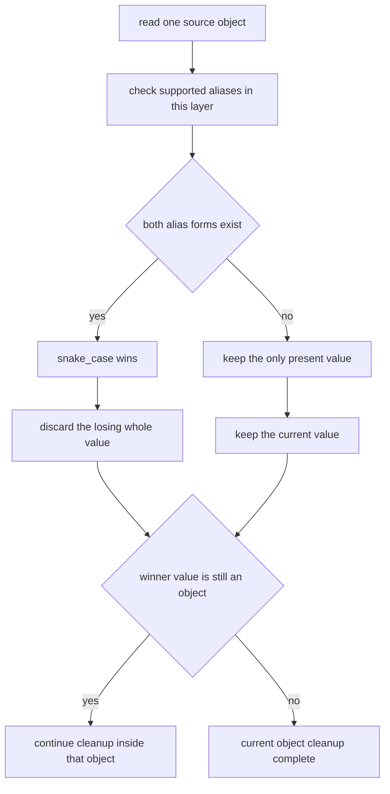
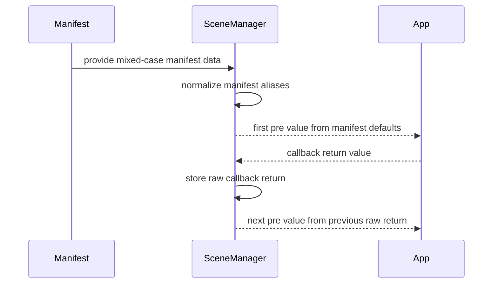

## Context

`xr_spatial_scene` sits between the SDK's built-in scene defaults and application-level `initScene()` callbacks. The branch already adds tests and docs for mixed-case manifest input, but without an OpenSpec design there is no shared contract for how aliases are resolved within a layer, how scene-type overrides interact with top-level values, or which values are normalized before they are exposed to runtime consumers.

## Goals / Non-Goals

**Goals:**
- Define a deterministic alias resolution rule for supported `xr_spatial_scene` keys.
- Keep override priority unchanged while allowing alias forms on both top-level and per-scene override objects.
- Normalize manifest-derived defaults into the runtime camelCase shape before they reach scene initialization paths.
- Preserve existing callback chaining behavior for repeated `initScene()` calls on the same scene name.

**Non-Goals:**
- Introducing new manifest fields beyond the supported alias set in this branch.
- Changing scene unit validation or formatting rules.
- Changing the precedence of `initScene()` callback returns over manifest-derived defaults.
- Normalizing arbitrary callback return values from application code.

## Decisions

### Decision: Field cleanup happens independently

This change starts with field cleanup. Field cleanup only resolves aliases inside the source object where a field appears, and it does not decide whether top-level values or overrides have higher priority. The main source objects here are top-level `xr_spatial_scene`, the window override, and the volume override. Within a single object layer, snake_case wins, the winner owns the whole value for that logical field at that layer, and supported nested aliases continue resolving recursively only inside that winning object value.

Rationale:
- This limits alias conflict handling to one source object at a time and avoids cross-source interference.
- The manifest documentation already centers snake_case names.
- Existing tests in this branch assert that same-layer alias conflicts prefer snake_case.
- This keeps `default_size` whole-value replacement and nested object key conflicts under one recursive rule.

Alternative considered:
- Merge multiple source objects first, then normalize once. Rejected because the merged object would lose information about which alias originated in which precedence layer.
- Prefer camelCase or treat duplicates as an error. Rejected because both would break existing manifests and tests on this branch.

### Decision: Precedence application stays unchanged

After field cleanup finishes, the system deep-merges the normalized objects through the existing precedence chain. This deep merge only applies the pre-existing merge behavior between already cleaned objects and does not participate in alias conflict resolution again. This change does not alter the precedence across built-in defaults, top-level manifest values, per-scene overrides, and `initScene()` callback returns.

This can be read directly as:

- `window defaults = cleaned top level defaults + cleaned window override`
- `volume defaults = cleaned top level defaults + cleaned volume override`

The plus sign here means the existing merge behavior, not literal object addition. Later `initScene()` callbacks can still override these defaults.

Rationale:
- This makes the scope of the change explicit: it changes field cleanup, not the precedence chain.
- It reuses the existing default-merging behavior and lowers regression risk.

Alternative considered:
- Redefine cross-layer precedence while introducing field cleanup. Rejected because that would expand the scope of the change and would not match the current implementation or tests.

### Decision: Normalize only manifest-derived defaults, not callback chaining state

Manifest input is normalized into the runtime camelCase shape before it is used as the `pre` value for the first `initScene()` call. However, once a callback returns a value, that raw return value is stored and passed back unchanged on later calls for the same scene name.

Rationale:
- This preserves existing chaining semantics validated by the tests in this branch.
- It avoids mutating developer-owned objects after the first callback cycle.

Alternative considered:
- Normalize every callback return before storing it. Rejected because it would silently rewrite application state between calls.

### Decision: Keep support surface intentionally narrow

This change documents and implements aliases only for:
- `default_size` and `defaultSize`
- `world_scaling` and `worldScaling`
- `world_alignment` and `worldAlignment`
- `baseplate_visibility` and `baseplateVisibility`
- `window_scene` and `windowScene`
- `volume_scene` and `volumeScene`
- `min_width` `min_height` `max_width` `max_height` within `resizability`

Rationale:
- These are the aliases covered by the branch implementation and tests.
- Expanding beyond the verified surface would be speculative.
- The recursive rule describes how supported aliases behave, but it does not implicitly add support for new paths.

## Risks / Trade-offs

- Risk: mixed naming remains visible in input examples. Mitigation: normalize all manifest-derived runtime defaults to camelCase so downstream logic stays consistent.
- Risk: developers may assume callback returns are also normalized. Mitigation: document that only manifest-derived defaults are normalized and callback chaining preserves raw returns.
- Risk: future alias expansion could drift from this contract. Mitigation: keep the supported alias set explicit in the spec and add scenarios before widening it.

## Migration Plan

No data migration is required. Existing manifests continue to work, and mixed-case manifests become more tolerant without changing the external API shape. Rollback is limited to removing the new normalization paths and the associated tests and docs.

## Open Questions

None for this branch. The supported alias set and precedence behavior are both covered by implementation and tests already present in the PR.