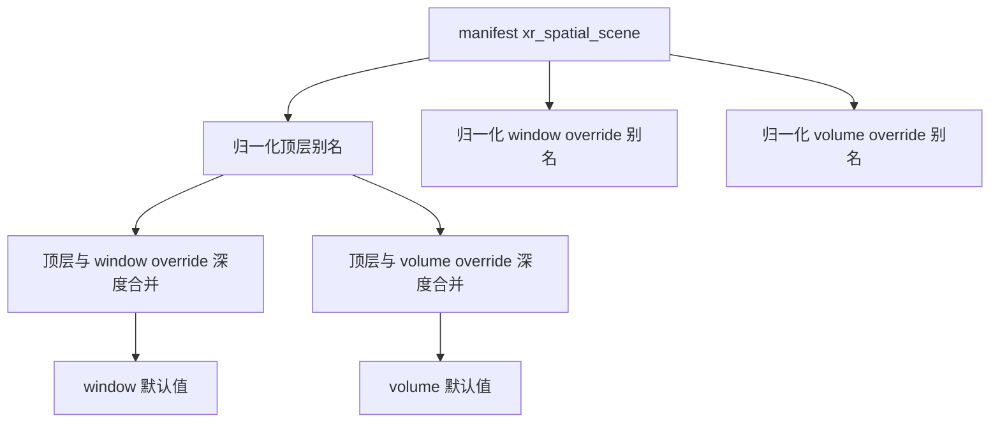
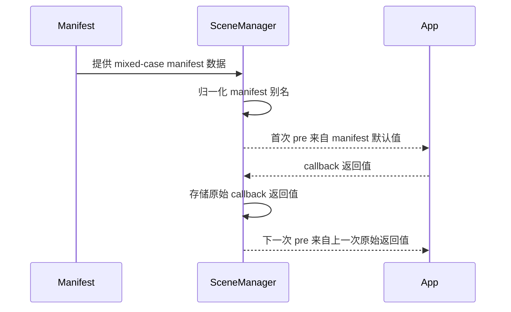

## Context

`xr_spatial_scene` 位于 SDK 内置场景默认值与应用层 `initScene()` 回调之间。当前分支已经补了 mixed-case manifest 输入相关的测试和文档，但还缺少 OpenSpec 设计文档来统一说明同层别名如何解析 场景 override 如何覆盖顶层值 以及哪些值会在暴露给运行时之前完成归一化。

## Goals / Non-Goals

**Goals:**
- 为受支持的 `xr_spatial_scene` 键定义确定性的别名解析规则。
- 在允许顶层和按场景 override 同时使用别名的前提下，保持现有 override 优先级不变。
- 在 manifest 派生默认值进入场景初始化链路前，将其归一化为运行时使用的 camelCase 结构。
- 保持同一场景名重复调用 `initScene()` 时的既有回调链行为。

**Non-Goals:**
- 为当前分支之外的 manifest 字段引入新的别名支持。
- 改变场景单位的校验或格式化规则。
- 改变 `initScene()` 回调返回值高于 manifest 默认值的优先级。
- 归一化应用代码返回的任意 callback 值。

## Decisions

### Decision: 先在各自对象层内解析别名 再进行跨层 merge

实现先在字段出现的源对象内解析别名，再对归一化后的对象按层级做 deep merge。

原因:
- 这样可以保持现有优先级模型不变。
- 可以避免跨层别名串扰，防止某一层的键意外压掉另一层的键。

备选方案:
- 先合并原始对象，再统一归一化。否决原因是合并后会丢失别名来自哪个优先级层的信息。

### Decision: 同层同时存在两种别名时 snake_case 优先

像 `default_size` 和 `defaultSize`，或者 `window_scene` 和 `windowScene` 这样的成对字段，在同一对象层内统一按 snake_case 优先解析。

原因:
- manifest 文档本身以 snake_case 命名为主。
- 当前分支中的测试已经明确断言同层别名冲突时应当优先采用 snake_case。

备选方案:
- 让 camelCase 优先，或者把重复声明视为错误。否决原因是这两种方案都会破坏当前分支已有 manifest 或测试预期。

### Decision: 只归一化 manifest 派生默认值 不归一化 callback 链状态

manifest 输入会先归一化为运行时 camelCase 结构，再作为第一次 `initScene()` 的 `pre` 值使用。但一旦 callback 返回了对象，该返回值会原样保存，并在后续同名场景调用中原样传回。

原因:
- 这样可以保持当前分支测试所验证的既有链式语义。
- 也可以避免在第一次 callback 之后静默改写开发者自有对象。

备选方案:
- 每次都在存储前归一化 callback 返回值。否决原因是会在多次调用之间悄悄重写应用状态。

### Decision: 将支持面限定在当前分支已实现并已验证的别名集合

这个 change 只文档化并实现以下别名:
- `default_size` 和 `defaultSize`
- `world_scaling` 和 `worldScaling`
- `world_alignment` 和 `worldAlignment`
- `baseplate_visibility` 和 `baseplateVisibility`
- `window_scene` 和 `windowScene`
- `volume_scene` 和 `volumeScene`
- `resizability` 中的 `min_width` `min_height` `max_width` `max_height`

原因:
- 这些别名正好与当前分支实现和测试覆盖一致。
- 超出已验证范围继续扩展会变成猜测。

## Risks / Trade-offs

- Risk: 输入示例中仍会看到 mixed naming。Mitigation: 把所有 manifest 派生运行时默认值统一归一化为 camelCase，保证下游逻辑一致。
- Risk: 开发者可能误以为 callback 返回值也会被归一化。Mitigation: 文档中明确只有 manifest 派生默认值会归一化，而 callback 链会保留原始返回值。
- Risk: 未来继续扩别名时可能偏离当前约定。Mitigation: 在扩大支持面之前，先在 spec 中补充明确场景，再新增测试。

## Migration Plan

不需要数据迁移。已有 manifest 会继续工作，mixed-case manifest 则会在不改变外部 API 结构的前提下获得更强兼容性。若回滚，只需移除新增的归一化路径以及对应测试和文档。

## Open Questions

当前分支没有剩余开放问题。受支持的别名集合和优先级行为都已经由实现与测试共同覆盖。