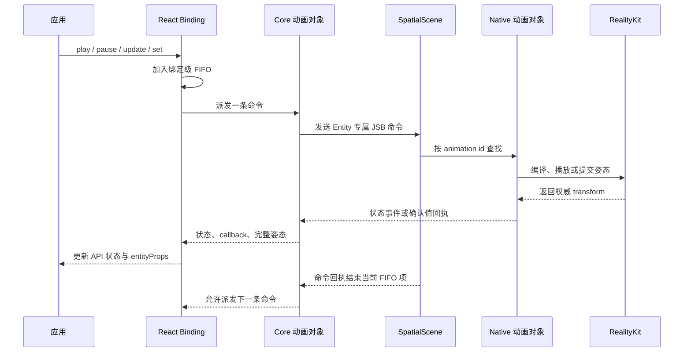

# Entity Motion 架构审查报告

## 审查范围

- 基线：`main...HEAD`
- 分支：`entity-motion-port-20260702`
- 复验基线：`6bd607db`
- 差异规模：95 个文件，新增 15,281 行，删除 4,820 行，净增加 10,461 行
- 提交数量：78
- 涉及层级：React SDK、Core SDK、visionOS Shell、测试服务器、公开文档和 OpenSpec
- 提案：`redesign-entity-motion-api`

## 总体结论

目标架构整体清晰，主要跨层职责与设计一致。当前实现具备以下核心结构：

- Native 作为姿态的唯一权威数据源；
- Entity 使用独立桥接协议；
- 每个 Native 动画对象对应一个 Core 动画对象；
- 每个绑定对象持有独立 FIFO 命令队列；
- 使用执行版本过滤过期事件；
- 播放期间接管完整 transform；
- 姿态提交后从 Native 回读确认值。

当前提案**不具备合入条件**。本轮复验状态如下：

1. **P1-1 已修复。** React 不再预校验 config。`SpatialEntity.createAnimation()` 与 `EntityAnimationObject.update()` 保持 Core 同步校验；Binding 将同步 programmer error 与 Promise rejection 分流，前者通过外部 store 触发 Hook 在渲染阶段抛出，后者继续进入 `onError`。
2. **P1-2 已修复。** Element 保持 `SpatializedPlaybackError { command, code?, reason }`，Entity 使用独立的 `EntityPlaybackError { code, reason }`；双语 OpenSpec 已同步类型名，React experimental 入口已导出 Entity 错误类型，并有公开出口类型测试。
3. OpenSpec 任务 5.3b 尚未完成，缺少 `SpatialScene` handler 直接测试。
4. visionOS 验收任务已勾选，但仓库内没有命令、环境、统计、截图和结果包留痕。
5. 当前分支缺少必需的 changeset，仓库 changeset 校验失败。

## 变更意图

本次变更旨在用 Native 权威的 Entity motion 子系统替换旧 Entity transform animation 路径：

- 暴露 `[animation, api, entityProps]`；
- 通过 Entity 的 `animation` 属性完成绑定；
- 在 Core 归一化稀疏 transform 时间轴；
- 创建并原地更新稳定的 Native 动画对象；
- 串行执行播放、配置更新和姿态设置命令；
- fresh play 时编译完整姿态的 RealityKit sequence；
- React 仅保存 Native 已确认的 transform 镜像；
- target 销毁时级联销毁关联动画对象。

## 整体架构

```mermaid
flowchart LR
    App["应用<br/>配置、控制、Entity 属性"] --> Hook["useEntityAnimation<br/>稳定绑定与 API"]
    Hook --> Binding["EntityMotionBinding<br/>FIFO、绑定代次、姿态镜像"]
    Binding --> Entity["Core SpatialEntity<br/>创建时同步校验"]
    Entity --> CoreObj["EntityAnimationObject<br/>更新时同步校验、状态与事件"]
    CoreObj --> Bridge["Entity 专属 JSB<br/>创建、更新、控制、设置"]
    Bridge --> Scene["visionOS SpatialScene<br/>查找、注册、销毁"]
    Scene --> NativeObj["EntityMotionAnimationObject<br/>状态机与写入所有权"]
    NativeObj --> Compiler["时间轴编译器<br/>完整姿态分段"]
    Compiler --> RealityKit["RealityKit<br/>权威 transform"]
    RealityKit --> NativeObj
    NativeObj --> Event["状态事件或设置/更新回执<br/>完整确认姿态"]
    Event --> CoreObj
    CoreObj --> Binding
    Binding --> Mirror["entityProps<br/>只读确认镜像"]
    Mirror --> App

    style Hook fill:#bbdefb,color:#0d47a1
    style Binding fill:#bbdefb,color:#0d47a1
    style Entity fill:#f3e5f5,color:#7b1fa2
    style CoreObj fill:#f3e5f5,color:#7b1fa2
    style Scene fill:#fff3e0,color:#e65100
    style NativeObj fill:#fff3e0,color:#e65100
    style Compiler fill:#fff3e0,color:#e65100
    style RealityKit fill:#c8e6c9,color:#1a5e20
    style Mirror fill:#c8e6c9,color:#1a5e20
```

## 命令与确认值流转

## 分层审查

| 层级 | 设计职责 | 实现证据 | 结论 |
|---|---|---|---|
| React Hook | 稳定三元组、订阅、提交最新配置 | `useEntityAnimation.ts` 复用同一个 binding，使用 `useSyncExternalStore`，并在全部 Hook 调用后抛出 Core 同步异常 | 符合 |
| React Binding | 单目标约束、FIFO、代次失效、callback 分发、姿态镜像 | `EntityMotionBinding.ts` 实现队列、epoch、generation、同步错误分流和监听器 | 符合 |
| Entity 集成 | 通过 Entity 的 `animation` 属性绑定和解绑 | `useEntity.tsx` 在 Entity 创建后执行绑定 | 部分符合 |
| Core 配置层 | 归一化三种公开写法并同步校验 | `normalizeEntityMotionConfig.ts` 实现封闭字段、有限值、稀疏轨道和默认值 | 符合 |
| Core 目标入口 | 通过 `SpatialEntity.createAnimation(config)` 创建 | `SpatialEntity.ts` 持有 target id 并发送创建命令 | 符合 |
| Core 动画对象 | 稳定 id、配置快照、状态事件、执行版本过滤、销毁后本地行为 | `EntityAnimationObject.ts` 覆盖完整链路 | 符合 |
| Bridge | 独立的创建、更新、控制、设置、状态和错误通道 | Core 与 visionOS 的协议类型一致 | 符合 |
| visionOS 分发 | target 查找、对象查找、注册、回执和销毁 | `SpatialScene.swift` 已注册四个 handler | 部分符合 |
| visionOS 执行 | fresh play 编译、transform 所有权、播放状态机 | `EntityMotionAnimationObject.swift` 内聚执行与所有权 | 符合 |
| 时间轴编译 | 完整姿态时间并集切片和 RealityKit 分段资源 | `EntityMotionTimelineCompiler.swift` 实现校验、采样和分段 | 符合 |
| 姿态契约 | 提交后回读完整 transform，输出规范化 ZYX 欧拉角 | `EntityMotionTransformValues.swift` 实现组合与拆解 | 符合 |
| Capability | 使用顶层 `supports('useEntityAnimation')` 和版本边界 | Core capability 表与测试覆盖 visionOS 1.9.0 | 符合 |
| 验证 | handler、模拟器和验收结果可追溯 | 已有对象级测试，handler 测试和验收留痕不完整 | 未完成 |

## Design 遵循情况

### 已遵循

- 公开三元组与 playback API 符合提案。
- Entity 使用 `animation` 属性绑定，同一 binding 最多连接一个 Entity。
- Native 是姿态权威，React 只镜像完整确认值。
- Core 支持顶层边界、timeline 边界和百分比关键帧。
- Core 与 visionOS 均具备 Entity 专属的创建、更新、控制、设置、状态和错误协议。
- `callbackAction` 集合收敛为 `start`、`complete`、`stop`、`reset`。
- 状态消息强制携带 `playState`，控制成功回执不修改公开状态。
- Native update 保持对象 id，并在替换活跃执行前完成可能失败的准备工作。
- transform 写入所有权在 running 和 paused 期间持续生效。
- target 销毁通过 Native 全局对象注册表级联，并发送 `objectdestroy`。
- RealityKit `Transform` 回读实现了规范化 ZYX 欧拉角。
- Element 与 Entity 错误契约已经分离；Entity Motion 双语 OpenSpec、Core 和 React experimental 入口统一使用 `EntityPlaybackError`。

### 偏差

1. `SpatialScene` handler 为私有方法，缺少目标查找、对象注册、显式销毁、target 先销毁、清理和销毁竞态的直接测试。
2. 需要模拟器验收留痕的任务没有对应的仓库内证据文件。

## 提案完成情况

- 任务清单：73 项中 72 项已勾选，完成度 98.6%。
- 未完成项：5.3b，补充 `SpatialScene` handler 直接测试。
- OpenSpec 严格校验：通过。
- 中英文结构：标题、Requirement、Scenario 和任务数量一致。
- Core 与 React 实现测试：通过。
- visionOS 编译与模拟器测试：本次审查未完成，Xcode 在构建前的 package resolution 阶段失败。
- visionOS 验收可追溯性：仓库内缺失。

## 验证结果

| 检查项 | 结果 |
|---|---|
| `git diff --check main...HEAD` | 通过 |
| `pnpm exec openspec validate redesign-entity-motion-api --strict` | 通过 |
| Core 定向测试 | 125 项通过 |
| React 定向测试 | 42 项通过 |
| P1-1 Core 复验 | 3 个文件、81 项通过 |
| P1-1 React 复验 | 4 个文件、44 项通过 |
| React 包完整测试 | 类型检查与构建通过；45 个文件、517 项通过、4 项 todo |
| `pnpm test` | 通过：Core 592 项、React 511 项、CLI 类型检查、测试服务器类型检查和工作流检查 |
| Core 与 React TypeScript 检查 | 通过 |
| Changeset 校验 | 失败：packages 变更没有新增 changeset |
| `xcodebuild -list` | 构建前阻断：`sandbox_apply: Operation not permitted` |
| 可用模拟器 | Apple Vision Pro，visionOS 26.2，未启动 |

## 合入门槛

**结论：阻断合入。**

1. 解决 `code-review.md` 中其余 P1 问题。
2. 完成 OpenSpec 任务 5.3b。
3. 记录一轮新的 visionOS 与 iwdp 验收证据。
4. 删除由本提案产生的确定性孤立代码和失效配置。
