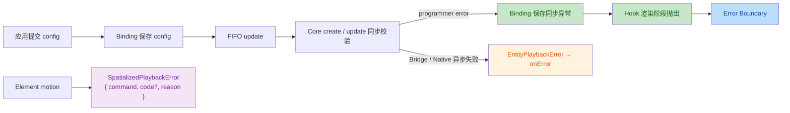

# Entity Motion Code Review 报告

## 审查范围

- 差异范围：`main...HEAD`
- 复验基线：`6bd607db`
- 审查开始时工作区：干净
- 审查维度：正确性、design 遵循、合入条件、可删除内容和过度设计
- 置信度：主审完成二次反证复核；两名独立验证者完成 P1-1、P1-2 交叉验证

## 合入结论

**存在 2 个 P2 问题。**

无剩余 P1。已修复问题统一记录在文末“已修复”章节。

## P0 问题

无。

## P1 问题

| 编号 | 问题 | 影响 | 修改建议 | 代码位置 |
|---|---|---|---|---|

无。

## P2 问题

| 编号 | 问题 | 影响 | 修改建议 | 代码位置 |
|---|---|---|---|---|
| 6 | 已删除的内部子路径仍保留在测试服务器配置中 | alias 指向不存在的文件，并与已完成的任务 9.10 冲突。当前未被引用，但保留了错误的架构入口。 | 删除这三行 alias。 | [`apps/test-server/tsconfig.json:30-32`](../../../apps/test-server/tsconfig.json#L30-L32) |
| 7 | 动态按钮的无障碍标签会过期 | effect 只在按钮首次出现时设置 `aria-label`，而多个按钮会在 Play、Pause、Resume、Destroy 和 Remount 之间改变文字。状态变化后，可访问名称和自动化标识与可见文字不一致。 | 为动态按钮显式设置稳定的无障碍标签，或者在文字变化时同步更新生成标签。 | [`shared.tsx:96-103`](../../../apps/test-server/src/pages/entity-animation/shared.tsx#L96-L103)、[`reverse-loop.tsx:70-72`](../../../apps/test-server/src/pages/entity-animation/reverse-loop.tsx#L70-L72) |

## 验证结果

| 命令 | 结果 |
|---|---|
| `git diff --check main...HEAD` | 通过 |
| `pnpm exec openspec validate redesign-entity-motion-api --strict` | 通过 |
| Core Entity motion 定向测试 | 6 个文件、125 项测试通过 |
| React Entity motion 定向测试 | 5 个文件、42 项测试通过 |
| P1-1 Core 复验 | 3 个文件、81 项测试通过 |
| P1-1 React 复验 | 4 个文件、44 项测试通过 |
| React 包完整测试 | 类型检查与构建通过；45 个文件、517 项通过、4 项 todo |
| Core 与 React TypeScript 复验 | 通过 |
| `pnpm test` | 通过 |
| `pnpm --filter @webspatial/core-sdk lint` | 通过 |
| visionOS Entity motion 定向测试 | 4 个测试类、41 项通过，包含 3 项 `SpatialScene` handler 直接测试 |
| Changeset CI 门禁 | 已新增 Core、React 与 visionOS 的 minor changeset |
| `xcodebuild -project packages/visionOS/web-spatial.xcodeproj -list -json` | 通过 |

## 可删除内容与过度设计

`EntityMotionAnimationObject.swift:L499-527`：**删除**。确认姿态读取切换为 RealityKit `Transform` 后遗留的 float matrix 转换方法没有调用方，无需替代。

`EntityMotionTransformValues.swift:L124-190,L225-236`：**删除**。仿射矩阵拆解及有限矩阵检查只被自身测试调用；生产路径使用 `decompose(Transform)`。同步删除仅验证 shear 的孤立测试。

`normalizeEntityMotionConfig.ts:L353-370`：**删除**。`serializeEntityMotionTimeline` 只为自身单测复制 payload，没有生产调用方；当前生产路径已经直接使用归一化结果。

`apps/test-server/tsconfig.json:L30-32`：**删除**。已移除的 Entity motion 内部子路径映射，无需替代。

`EntityMotionBinding.ts:L15-18,L133-138`：**删除**。update 命令中的 `revision` 被写入但从未读取；保留 `configRevision`，删除命令字段。

预计净删除：约 150 行。

## 应保留范围

以下内容属于本 PR 的必要范围：

- Entity 专属 JSB 协议与 Bridge 契约测试；
- `SpatialScene` handler 注册表、回执和销毁边界测试；
- Core 归一化和 Native 兜底校验；
- 绑定级 FIFO、绑定代次失效和执行版本过滤；
- Native 完整 transform 所有权和提交后回读；
- 三个新增 Demo 页面，分别对应绑定、retarget 和隔离验收；
- 中英文 OpenSpec 文档，其结构数量已保持一致。

协议已经跨层落地后，不建议将 Bridge、Core 对象、React Binding 和 visionOS 状态机拆成相互独立的 PR；它们共同组成一份带版本的跨层契约。当前 PR 的最小化方式是删除确定性孤立代码、关闭上述门槛，并停止无关重构。

## 最终检查清单

- [ ] 删除失效的测试服务器 alias。
- [ ] 修复动态按钮无障碍标签。
- [ ] 删除确认无调用方的 helper 和未使用命令字段。
- [ ] 重新运行 OpenSpec、全仓测试、完整 visionOS 测试和模拟器验收。

## 已修复

| 编号 | 问题 | 修复结果 | 保持项 | 代码位置 |
|---|---|---|---|---|
| 1 | React 吞掉同步 programmer error | React 预校验已移除。初始绑定由 Core `createAnimation()` 同步校验并通过 `useEntity` 进入 Error Boundary；配置 update 由 Core `update()` 同步校验，Binding 保存该异常并通知 Hook 在全部 Hook 调用后抛出。Promise rejection 仍单独进入 `onError`。 | 保留同步错误边界、异步 `onError` 和 FIFO 回归测试。 | [`useEntityAnimation.ts`](../../../packages/react/src/reality/hooks/useEntityAnimation.ts)、[`EntityMotionBinding.ts`](../../../packages/react/src/reality/hooks/EntityMotionBinding.ts)、[`EntityMotionBinding.test.ts`](../../../packages/react/src/reality/hooks/EntityMotionBinding.test.ts)、[`useEntityAnimation.redesign.test.ts`](../../../packages/react/src/reality/hooks/useEntityAnimation.redesign.test.ts) |
| 2 | Entity 变更破坏既有 Element 错误契约 | Element 保持 `SpatializedPlaybackError { command, code?, reason }`；Entity 使用 `EntityPlaybackError { code, reason }` 和封闭错误码。双语 OpenSpec、Core 与 React experimental 入口的命名已统一，并有类型兼容和公开出口测试。 | 保持两类错误契约独立，不引入兼容泛型。 | [`spatializedPlayback.ts:1-17`](../../../packages/core/src/types/motion/spatializedPlayback.ts#L1-L17)、[`entityMotion.ts:45-61`](../../../packages/core/src/types/motion/entityMotion.ts#L45-L61)、[`experimental.ts:9-20`](../../../packages/react/src/experimental.ts#L9-L20)、[`spec.md:126-132`](specs/entity-motion/spec.md#L126-L132) |
| 3 | Native handler 生命周期覆盖不完整 | 新增 3 项直接测试，通过真实 JSB 注册和分发链覆盖目标不存在、类型拒绝、动画注册与查询、显式销毁、target 先销毁、注册表清理，以及 update、control、set 在 teardown 后返回 `ANIMATION_NOT_FOUND`。OpenSpec 任务 5.3b 已完成。 | handler 保持私有；对象级测试继续负责成功路径细节，handler 测试只保护跨层边界。 | [`EntityMotionTests.swift`](../../../packages/visionOS/web-spatialTests/EntityMotionTests.swift)、[`SpatialWebController.swift`](../../../packages/visionOS/web-spatial/webview/SpatialWebController.swift)、[`tasks.zh.md`](tasks.zh.md) |
| 5 | 缺少必需的 changeset | 新增一句话 changeset，将实验性 Entity motion API 对 Core、React 和 visionOS 的变更标记为 minor。 | 保留旧 Entity changeset，不复用其已被取代的 API 描述。 | [`entity-motion-experimental-api.md`](../../../.changeset/entity-motion-experimental-api.md) |

### P1 复验流程

### P1-2 修复结果

1. Entity Motion 双语 proposal、design、spec、tasks 已统一为 `EntityPlaybackError`，Element 的 `SpatializedPlaybackError` 保持不变。
2. React experimental 公开出口已增加 `EntityPlaybackError` 与 `EntityPlaybackErrorCode`，公开出口类型测试已覆盖精确结构和封闭错误码。
3. 修改未触及 Core、Bridge、Native 或 Element motion 运行时行为。

### 已完成检查

- [x] 完成同步 programmer error 传播闭环。
- [x] 完成错误契约闭环：Element 与 Entity 类型独立，React experimental 出口和双语 OpenSpec 已同步。
- [x] 完成 `SpatialScene` handler 注册表、回执和销毁边界测试。
- [x] 新增实验性 Entity motion API 的 minor changeset。
