# `useEntityAnimation` Redesign

## 1. Background

`useEntityAnimation` is the WebSpatial SDK React Hook that drives transform animations for 3D entities in a scene. It supports percentage keyframes, animation-result write-back, and a unified imperative transform setter, and it unifies entity motion onto the generic animation binding, lifecycle, and cross-layer protocol.

This redesign integrates entity motion into the generic animation architecture: the React layer provides the Hook, target binding, and result mirror; Core normalizes and validates configuration; and the visionOS native layer compiles and executes animations with RealityKit. The native transform is the single authoritative data source. Every transform change is confirmed by native before it is mirrored to React, structurally preventing the animation end state from conflicting with stale React base properties and snapping back.

The goals are to:

- Define the responsibility boundaries and data flow across React, Core, and native.
- Define both the “config → canonical tracks → RealityKit animation” path and the “native confirmed transform → `entityProps`” path.
- Entities reuse the existing create, control, and state-event protocol.
- Spatial-element and entity animations reuse the shared playback interface and cross-layer protocol while their corresponding animation objects implement target-specific capabilities.

The public API surface covers animation binding, playback control, and confirmed-transform write-back, with native RealityKit as the unified execution engine. This document fully defines the API shape, behavior boundaries, cross-layer protocol, compilation rules, and module responsibilities for a self-contained technical review.

## 2. Glossary

- **Entity**: a 3D object in the scene, e.g. a box. It has three groups of spatial properties, collectively called its "transform."
- **transform**: an entity's state in space, made of position `position` (meters), rotation `rotation` (degrees), and scale `scale` (multiplier).
- **component**: one of the three transform parts, i.e. `position`, `rotation`, or `scale`.
- **native layer / RealityKit**: the low-level engine on Apple visionOS that actually drives 3D entity motion, implemented in Swift. "Native" in this document refers to this layer.
- **React layer / shared logic layer (Core)**: respectively the user-facing Hook code, and the platform-agnostic logic shared by both ends.
- **JS Bridge command / event**: the channel for sending and receiving messages between JavaScript and the native layer. Commands go from JS to native; events come back from native to JS.
- **authoritative data source**: which side a given piece of data defers to. In this design, an entity's real transform defers only to the native layer.
- **mirror**: React copies the transform the native layer has already confirmed and uses that copy for rendering. That copy is the mirror.
- **`entityProps`**: the transform mirror the Hook returns to the user, of the form `{ position?, rotation?, scale? }`. Spread onto the component, it keeps the entity resting at the animation's end state.
- **confirmed transform**: after the native layer finishes an action, it reads back the entity's real transform and reports it. React updates `entityProps` only from such values.
- **track / channel**: a curve describing how a single property (e.g. `position.y`) changes over time; the two are interchangeable and both refer to the keyframe sequence of one single property. Compilation slices at the union of channel keyframe times, samples a full pose at each slice point, and plays the whole transform (see 5.3).
- **keyframe**: a time point on a curve and its value, e.g. "at 0.6s, `position.y` = 0.25."
- **timingFunction**: a curve describing the pacing between two frames, e.g. constant-speed `linear`, slow-then-fast `easeIn`.
- **baseline**: the current native value when each fresh play is accepted; it fills fields omitted from the config to form the full pose for that playback run.
- **start confirmation**: after a fresh play compiles successfully, Native combines config `from` / `0%` values with that run's baseline, commits the complete start pose to the target, and reads back confirmed values. Native emits `start` as soon as that confirmation succeeds, and React updates `entityProps` without waiting for delay to end.
- **fresh play**: the first playback after creation, or playback restarted after `complete`, `finish`, `stop`, or `reset`; `autoStart` is also a fresh play. Continuing `play` after `pause` resumes the current run and is not a fresh play.
- **spherical linear interpolation (slerp)**: the interpolation RealityKit uses for rotation, always taking the shortest path between two orientations.
- **no-op**: after the command is received, the entity and `entityProps` retain their current values.
- **registry**: the table the native layer uses to look up entities or animation objects by id.
- **binding command queue**: the per-binding FIFO that serializes playback commands and `set` before they enter the JS Bridge. It is a React/Core ordering mechanism, not a second native animation queue.
- **command reply**: the JSB success or failure receipt returned after Native has finished the command's synchronous state and transform commit work. When a command emits a state event, Native emits that event before returning the success reply.

## 3. Functional Scope

`useEntityAnimation` lets users describe animations with position, rotation, and scale, bind them to an entity, and receive the native-confirmed transform. The functional scope is:

| Capability | Description |
|---|---|
| Transform animation | The property allowlist is `position`, `rotation`, and `scale`; non-transform properties such as `opacity` produce an explicit validation failure. |
| Timeline forms | Supports top-level `from` / `to`, `timeline.from` / `timeline.to`, and percentage keyframes such as `0% → 50% → 100%`. |
| Target binding | Returns `animation`, which binds through the entity component's `animation` property. |
| Playback control | `api` provides `play`, `pause`, `stop`, `reset`, and `finish`. |
| Result write-back | Native reports transforms at confirmed lifecycle points; React exposes them as `entityProps` to preserve the confirmed end state. |
| Imperative set | In an inactive state, `api.set(patch)` merges a sparse patch onto the native committed transform. |
| Lifecycle and errors | Reuses the generic animation create, control, destroy, target-invalidation, and error-event path. |
| Capability detection | Detects the complete capability through `supports('useEntityAnimation')`. |

## 4. Design Approach and Trade-offs

### 4.1 Design Principles

#### The native layer is the single authoritative data source

An entity's transform defers to native RealityKit. React maintains a read-only mirror of native-confirmed transforms.

`entityProps` is only a React-side mirror of the transform native has already confirmed. Data flows in one direction:

```text
React config / api.set
  -> native animation engine (single authority)
  -> confirmed transform
  -> entityProps mirror
```

From this a few rules follow:

- Play, stop, reset, finish, `api.set` — every operation that changes the transform goes to the native layer first.
- When native returns a failed command result, the entity transform and `entityProps` retain their current values.
- When native accepts a command, it reports the confirmed transform through an animation state event, and React then updates `entityProps`.
- React mirrors native-confirmed transforms back to the user; writes during active animation are handled as no-ops.
- `entityProps` starts empty. The first confirmation fills it with the complete committed `position`, `rotation`, and `scale` values. While the binding remains attached, this complete mirror owns the inactive transform; unbinding returns control to React props.

#### Reuse the generic animation architecture

`useEntityAnimation` reuses the generic animation's binding, target resolution, animation-object lifecycle, and the "create — control — event" pipeline as much as possible. The entity path's differences are concentrated in only a few places:

- Description: uses `position` / `rotation` / `scale`.
- Validation: the property allowlist is `position`, `rotation`, and `scale`; other properties produce an explicit validation failure.
- Result exit: `entityProps`.
- Target type: `SpatialEntity`.
- Execution engine: RealityKit.

### 4.2 Why RealityKit

The native execution engine is chosen as **RealityKit**, because:

1. **One execution engine.** Entity motion and generic animation share a single RealityKit engine, avoiding a separate execution path for entities.
2. **It is inherently the execution engine for 3D entities.** With many entities animating concurrently, native engine playback scales better than per-frame writes from the SDK.
3. **It meets both the playback and reporting needs.** It can control playback state, read an entity's current transform, and emit an event when playback completes — enough to implement stop, reset, and finish, and to report the confirmed transform to callbacks and `entityProps`.

The main added cost is a compiler: translating the normalized entity tracks into transform animations RealityKit can execute.

#### Execution advantages of native RealityKit playback

All entity animations use native RealityKit playback and gain these properties:

- **Render-tick synchronization.** Transform animation stays aligned with RealityKit render commits.
- **System compositing.** Animation participates directly in visionOS system compositing and reprojection.
- **Scene-system integration.** Transform animation naturally participates in the scene graph, coordinate spaces, anchors, and collision system.
- **High-quality interpolation.** RealityKit applies spherical linear interpolation to rotation.
- **Complete playback semantics.** RealityKit provides easing, looping, delay, playback rate, pause, and completion events.
- **Unified execution semantics.** Element and entity paths both use native animation objects.

### 4.3 Layer Responsibilities and Overall Architecture

#### Overall Architecture

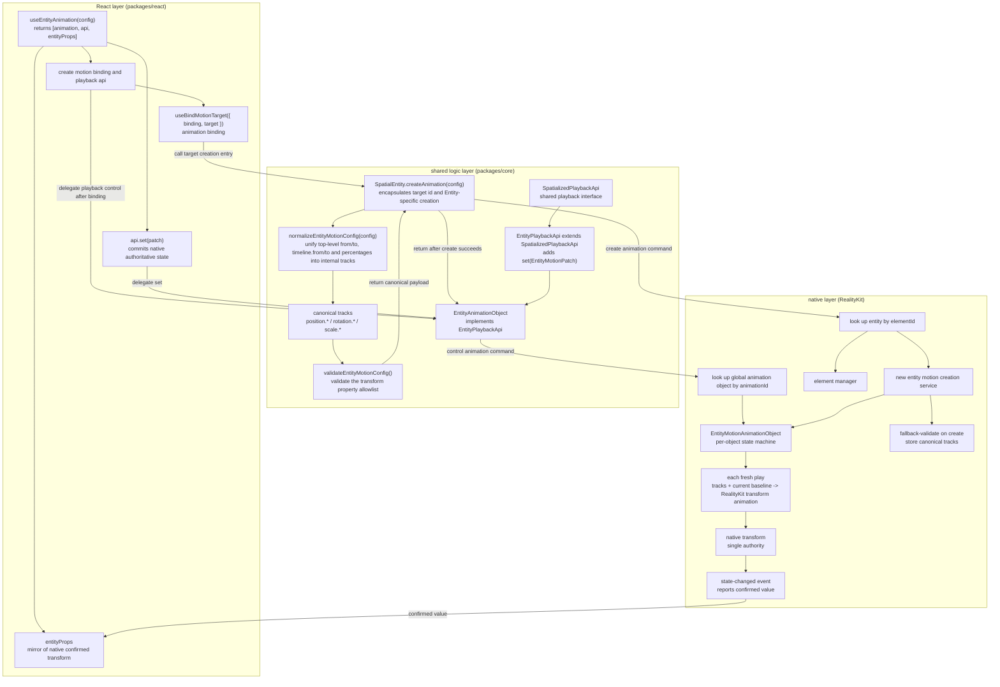

**Responsibilities per layer:**

- **React layer** handles the Hook API, binding lifecycle, the `entityProps` mirror, callback dispatch, and re-render. Once target binding completes, the binder calls `SpatialEntity.createAnimation(config)`.
- **Shared logic layer** uses `SpatialEntity.createAnimation(config)` to encapsulate the target id plus Entity-specific normalization and validation, send the create command, and return an `EntityAnimationObject`. `EntityPlaybackApi` extends the existing `SpatializedPlaybackApi` and adds `set` only for Entity; `EntityAnimationObject` and the ordinary `AnimationObject` implement their respective interfaces without inheriting from each other. Normalization folds the three public authoring forms into internal canonical entity tracks; when `timeline` and top-level `from` / `to` are both present, `timeline` is the sole effective input and development mode logs a duplicate-declaration warning. `elementId` is the spatial-object id transport field in the Core-to-native create command.
- **Native layer** stores animation objects in `SpatialScene.spatialObjects` and reuses the `SpatialObject` lifecycle. `SpatialScene` resolves create targets and control objects; each Entity animation object owns its state machine, fresh-play compilation, RealityKit execution, and confirmed-pose reporting.

#### Cross-layer class diagram

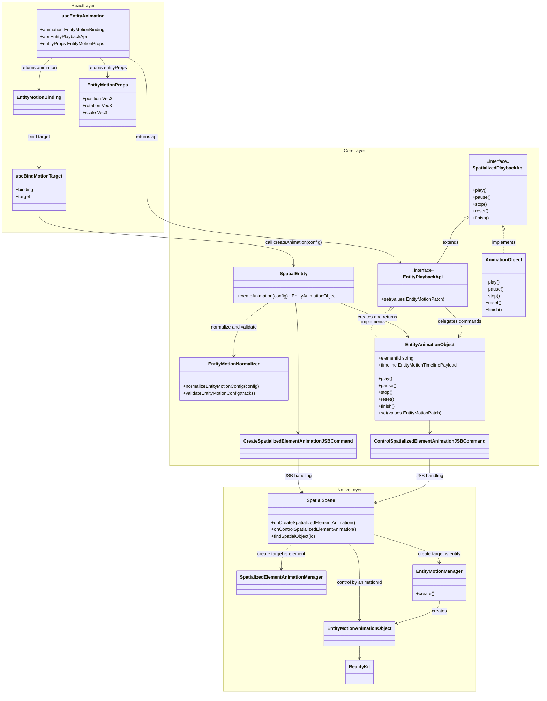

The diagram presents React, shared-logic, and native classes together; each class remains in its labeled layer. Create commands resolve their target by `elementId` in `SpatialScene.spatialObjects` and enter the element or entity creation path by target runtime type. Control commands resolve an animation object by `animationId` in the same global table and invoke the matching control path by animation-object runtime type. Managers do not own a second animation registry.

#### Cross-layer Communication Overview

- Core sends create and control commands to Native through `CreateSpatializedElementAnimationJSBCommand` and `ControlSpatializedElementAnimationJSBCommand`.
- Native reports playback state, confirmed transforms, and classified errors to Core through `spatialanimationstatechanged`.
- React consumes the state events forwarded by Core and updates callbacks and `entityProps`.

Section 5.2 Core SDK defines the JSB payloads and error types, Section 5.3 Native defines command-processing rules, and Section 5.1 React SDK defines the state-event mapping into React.

#### Cross-layer Sequences

##### From config to native transform (playback)

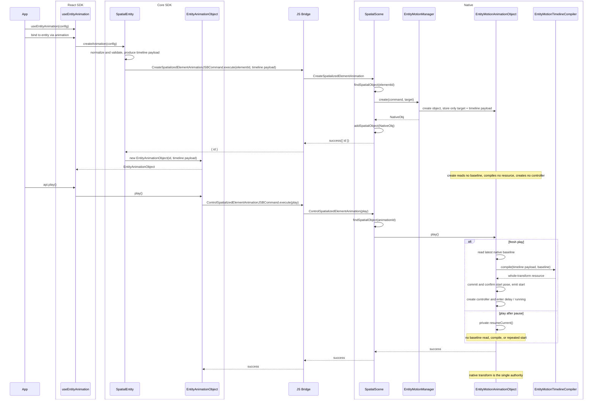

##### From native confirmed transform to React mirror

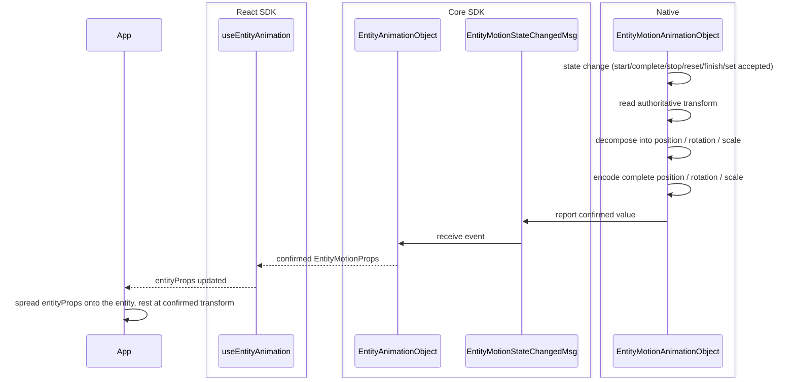

Native decides whether `api.set` takes effect: it accepts patches while playback is inactive and the native object exists, and handles all other timing as no-ops with a console warning. The first confirmed value comes from a fresh-play start-pose confirmation or an accepted `set`, so `entityProps` may be empty before then.

### 4.4 Key Trade-offs

- **Command names keep the `Element` wording.** Entities reuse the existing create and control commands. Their target-state semantics cover spatial objects, and `elementId` identifies a spatial object.
- **Accept native compilation cost on fresh play.** Each fresh play makes the entity animation object read the current baseline and invoke the compiler for multi-keyframe handling, sparse keyframes, rotation conversion, and whole-transform serial compilation in exchange for an up-to-date baseline, native RealityKit playback, system compositing, and one execution model.
- **Slice into a serial chain of full poses.** Cut the timeline into a set of nodes, each carrying a complete `position` / `rotation` / `scale`, then chain them in order into one whole-transform animation. The visionOS RealityKit animation binding granularity is the whole `.transform`, and current easing requirements apply per segment. A serial chain of full poses therefore aligns visionOS and picoOS, where native animation binds the whole transform; all channels within one segment share a single `timingFunction`.
- **Own the whole transform through the binding lifecycle.** Once the animation is active, the entire `.transform` is owned by the animation. For example, animating only `position.y` freezes `position.x` / `position.z` — and `rotation` / `scale` too — at baseline during playback. After native produces the first confirmed state, `entityProps` persists the complete committed transform while the binding remains attached; inactive dynamic writes use `api.set`, and unbinding returns control to React props.
- **`set` uses sparse patch objects.** In v1, `api.set` accepts a sparse patch object and consumers read the latest confirmed transform through `entityProps`.
- **Dispatch directly by runtime type.** In v1, `SpatialScene` dispatches elements and entities to their respective managers; real duplication between the two paths is the trigger for extracting a shared protocol.
- **Measure large-scale concurrency.** Native RealityKit playback is preferable to per-frame JS writes, but high entity counts still require dedicated performance validation.

## 5. Module Design

### 5.1 React SDK

- **Public interface:** `useEntityAnimation` returns `[animation, api, entityProps]`; the entity component receives `EntityMotionBinding` through its `animation` property.
- **Playback control:** `EntityPlaybackApi` provides `play`, `pause`, `stop`, `reset`, `finish`, and `set`; `api.set(values)` submits a sparse state patch to native.
- **Target binding:** `useBindMotionTarget({ binding, target })` maintains one binding per `SpatialEntity` and calls `target.createAnimation(config)` after binding. Unbinding clears the binding-owned `entityProps` mirror so ordinary React transform props become authoritative again.
- **Command sequencing:** `EntityMotionBinding` reuses the Element animation binding's pending-command and sequential-flush model. It serializes commands per binding and does not send the next command until the current JSB reply settles.
- **Result mirror:** `entityProps` mirrors native-confirmed `position`, `rotation`, and `scale`, driving React re-render and lifecycle callbacks.

#### Binding command queue and completion semantics

The public `EntityPlaybackApi` remains a `void` command surface. Internally, each `EntityMotionBinding` owns one FIFO command chain so call order is preserved without exposing bridge promises to application code.

- Before the target binding and native animation-object creation complete, `play`, `pause`, `stop`, `reset`, and `finish` enter the pending-command queue in call order. After creation succeeds, the binding flushes them sequentially and awaits each internal `EntityAnimationObject` command promise before sending the next command.
- When `autoStart` is enabled, its generated `play` command is inserted at the front of the pending playback commands when creation succeeds, matching the existing Element animation behavior.
- `api.set` before binding or native animation-object creation never enters the queue. It remains a console warning plus no-op and is never replayed later.
- After the native animation object exists, all playback commands and `set` enter the same per-binding FIFO. A failure or a warning-plus-no-op settles that queue item and allows the next item to run; it does not poison or reorder the queue.
- A JSB success reply means Native has completed the command's synchronous state transition and any required transform commit. If the command produces `start`, `pause`, `stop`, `reset`, `finish`, or `set`, Native emits the corresponding state event before returning that success reply. A natural asynchronous `complete` event remains independent of the earlier `play` reply.
- Unbinding, target replacement, config-driven object replacement, or destruction invalidates the current queue generation and drops every command that has not been sent. The in-flight command may settle under the documented teardown race, but its reply cannot dispatch another command from the invalidated generation.

This ordering makes consecutive calls deterministic. In particular, `set → play` waits for the accepted `set` reply before fresh play reads its baseline; `stop → play` waits for the stopped transform commit; and `play → pause` waits until Native has accepted the play command.

#### Class Diagram

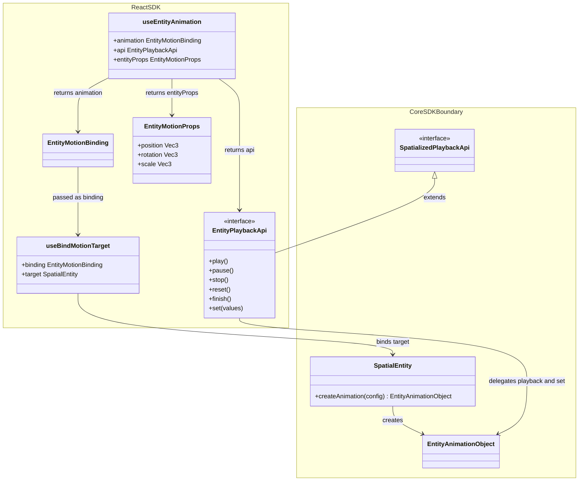

#### State-event Mapping

React consumes `EntityMotionStateChangedMsg` forwarded by Core and maps native actions to user callbacks and `entityProps` updates:

| native action | mapped user callback | updates entityProps |
|---|---|---|
| `start` | `onStart` | yes (once after Native accepts the fresh-play start pose, without waiting for delay to end) |
| `complete` | `onComplete` | yes (end state) |
| `finish` | `onComplete` | yes (end state) |
| `stop` | `onStop` | yes (current transform) |
| `reset` | `onReset` | yes (starting transform) |
| `set` | internal commit | yes (merged transform) |
| `error` | `onError` | no |
| `pause` | playback state change | no |

Event `values` use the `EntityMotionProps` shape with `position`, `rotation`, and `scale`. Classified errors reach the user through `onError`, while `entityProps` retains its current value.

### 5.2 Core SDK

- **Target creation entry:** `SpatialEntity.createAnimation(config)` uses its own id, performs Entity-specific normalization and validation, sends the shared create command, and returns an `EntityAnimationObject`. Ordinary `SpatializedElement.createAnimation(config)` still returns `AnimationObject`.
- **Playback interfaces:** the existing `SpatializedPlaybackApi` keeps common playback methods and state and does not contain `set`; `EntityPlaybackApi extends SpatializedPlaybackApi` and adds only `set(EntityMotionPatch)`.
- **Animation objects:** `AnimationObject extends SpatialObject implements SpatializedPlaybackApi`; `EntityAnimationObject extends SpatialObject implements EntityPlaybackApi`. The two concrete classes do not inherit from each other. They may reuse create / control / event helpers internally while retaining their respective timeline and confirmed-value types; `elementId` is the spatial-object id transport field in the Core-to-native create command.
- **Types and functions:** Core defines entity-motion types, `EntityMotionPatch`, `EntityMotionProps`, the property allowlist, normalization and validation functions, and the internal canonical timeline.

#### Class Diagram

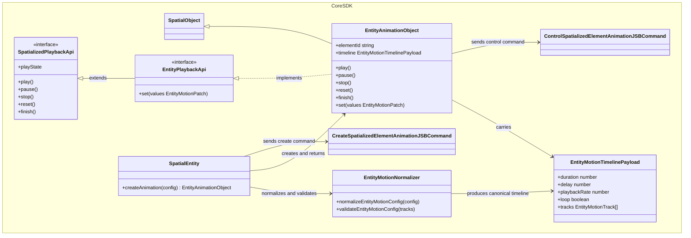

#### JSB Protocol

Core defines the wire contract for create commands, control commands, state events, and classified errors.

##### Create animation command

`elementId` is a spatial-object id and can point to an element or an entity:

```text
CreateSpatializedElementAnimation {
  elementId: string
  timeline: EntityMotionTimeline | SpatializedMotionTimeline
}
```

##### Control animation command

```text
ControlSpatializedElementAnimation {
  animationId: string
  type: 'play' | 'pause' | 'stop' | 'reset' | 'finish' | 'destroy' | 'set'
  values?: EntityMotionPatch
}
```

`api.set` reuses the control command, accepts a deeply sparse `EntityMotionPatch`, and is sent to Native as `type: 'set'`. Calls before binding or before native animation-object creation are classified as no-ops, log a console warning, and are not stashed as later commands. JSB does not expose `resume`; a `play` received while paused makes the native animation object resume its current controller internally.

```text
type EntityMotionProps = {
  position?: Vec3
  rotation?: Vec3
  scale?: Vec3
}

type EntityMotionPatch = {
  position?: Partial<Vec3>
  rotation?: Partial<Vec3>
  scale?: Partial<Vec3>
}
```

`EntityMotionPatch` represents any deep subset of `EntityMotionProps`. Native merges the supplied axes and reports complete `position`, `rotation`, and `scale` values in every confirmed event, each as a complete `Vec3`.

##### State-changed event

```text
type EntityMotionNativePlayState = 'idle' | 'running' | 'paused' | 'finished'
type EntityMotionPlayState = 'queued' | EntityMotionNativePlayState

interface EntityMotionStateChangedDetail {
  animationId: string
  action:
    | 'play' | 'pause' | 'stop' | 'reset' | 'finish' | 'destroy' | 'set'
    | 'start' | 'complete' | 'error'
  playState: EntityMotionNativePlayState
  finished: boolean
  values?: EntityMotionProps
  error?: SpatializedPlaybackError
}

interface EntityMotionStateChangedMsg {
  type: 'spatialanimationstatechanged'
  detail: EntityMotionStateChangedDetail
}
```

`values` use the entity target's `EntityMotionProps`, containing `position`, `rotation`, and `scale`.

`queued` is a React binding state while commands await native animation-object creation. Native state events carry `idle`, `running`, `paused`, or `finished`. The public `finished` flag is derived from `playState === 'finished'`; every other state reports `finished: false`.

##### Playback error type

Both target types share a closed error-code set:

```text
type SpatializedPlaybackError = {
  code:
    | 'TARGET_NOT_FOUND'
    | 'UNSUPPORTED_TARGET'
    | 'ANIMATION_NOT_FOUND'
    | 'INVALID_TIMELINE'
    | 'COMPILATION_FAILED'
    | 'INVALID_CONTROL_STATE'
    | 'INVALID_SET_VALUES'
  message?: string
}
```

#### Types, normalization, and validation

Normalization is done by the shared logic layer's `normalizeEntityMotionConfig`, folding the three public authoring shapes into one internal timeline data.

**Input:** the three public authoring shapes, folded by these rules:

- **Top-level `from` / `to`** is equivalent to `timeline.from` / `timeline.to`, expanded into a start and an end frame.
- **`timeline.from` / `timeline.to`** are the `0%` / `100%` frames and may be mixed with percentage keys.
- **Percentage keyframes** `0% → 50% → 100%` are converted to seconds via `at = percentage × duration`.

The full normalization rules include `timeline` precedence, mandatory boundaries, and `duration` defaults, detailed later in this section.

**Output:** a platform-agnostic `EntityMotionTimelinePayload`, shown below:

```text
type EntityMotionTimelinePayload = {
  duration: number
  delay?: number
  playbackRate?: number
  loop?: boolean | { reverse?: boolean }
  tracks: EntityMotionTrack[]
}

type EntityMotionTrack = {
  property: EntityMotionProperty
  keyframes: EntityMotionKeyframe[]
  timingFunction?: TimingFunction
}

type EntityMotionProperty =
  | 'position.x' | 'position.y' | 'position.z'
  | 'rotation.x' | 'rotation.y' | 'rotation.z'
  | 'scale.x'    | 'scale.y'    | 'scale.z'

type EntityMotionKeyframe = {
  at: number
  value: number
  timingFunction?: TimingFunction
}
```

**v1 timing encoding convention:** The public `timingFunction` has global segment semantics, and the current payload stores it on tracks and keyframes. Core copies the top-level default to every track and copies a timeline node's override to every property keyframe produced from that node. All timing values present at the same `at` use one consistent value. Every public timeline node contains at least one supported transform scalar, which preserves the node during track normalization. Any track carrying a global node may carry that node's shared timing value. The track/keyframe fields also reserve structural room for future per-property timing; that capability will introduce matching public authoring and versioned protocol semantics.

Example:

```text
{
  duration: 1.2,
  tracks: [
    {
      property: 'position.y',
      timingFunction: 'linear',
      keyframes: [
        { at: 0, value: 0 },
        { at: 0.6, value: 0.25 },
        { at: 1.2, value: 0 },
      ],
    },
    {
      property: 'rotation.y',
      timingFunction: 'linear',
      keyframes: [
        { at: 0, value: 0 },
        { at: 1.2, value: 180 },
      ],
    },
  ],
}
```

Normalization and validation rules:

- Top-level `from` / `to` and `timeline.from` / `timeline.to` fold into the same internal tracks.
- `timeline.from` / `timeline.to` represent `0%` / `100%` and may be mixed with percentage keyframes; duplicate declarations of the same boundary produce an explicit error.
- When `timeline` and top-level `from` / `to` both appear, `timeline` is the sole effective input and development mode logs a duplicate-declaration warning.
- Pure top-level `from` / `to` uses a default `duration` of 0.3s.
- Every animation provides both start and end boundaries; fields inside those boundary frames may remain sparse, with missing scalar values falling back to the Native baseline during compilation.

#### Capability detection

Docs and examples use top-level capability detection:

```text
supports('useEntityAnimation')
```

### 5.3 Native

- **Command entry:** `SpatialScene` receives create and control commands. Create looks up a target by `elementId`; control looks up a global animation object by `animationId` and dispatches by its runtime type.
- **Execution subsystem:** `EntityMotionManager` only provides Entity animation-object creation. Animation objects reuse `SpatialScene.spatialObjects` and the `SpatialObject` lifecycle, while `EntityMotionAnimationObject` owns per-object control and fresh/resume decisions.
- **Confirmed-value reporting:** `EntityMotionAnimationObject` reads and decomposes the native transform and reports confirmed values through state events.

#### Class Diagram

Readability and testability drive subsystem decomposition, and its file organization may evolve independently from the element path. The following responsibility boundaries are recommended; manager helpers may be merged or split according to logic complexity and reuse needs. The existing `SpatializedElementAnimationObject` and the new `EntityMotionAnimationObject` both inherit from `SpatialObject` and reuse the same lifecycle. They are sibling types with no direct inheritance relationship; this design does not introduce a shared Native playback interface in advance.

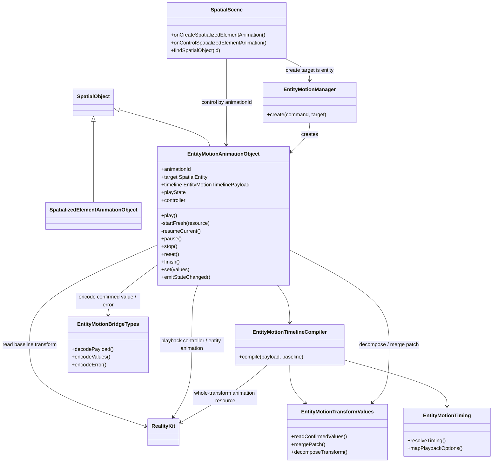

**Responsibilities per class:**

- **Entity motion manager (`EntityMotionManager`):** provides Entity animation-object creation: it fallback-validates the create payload, constructs an animation object that stores the canonical timeline, and hands it to `SpatialScene` for registration. It owns no private registry, handles no per-object controls, and stores no playback state.
- **Entity animation object (`EntityMotionAnimationObject`):** represents a single entity animation, holding the `animationId`, target entity, canonical timeline, playback state, current playback controller, and resource, and handling all of that object's state transitions. `play()` calls private `resumeCurrent()` while paused; in another fresh-play-eligible state it reads the baseline, invokes the compiler, and starts through private `startFresh(resource)`. After every start-pose confirmation / end state / accepted `set`, it obtains the complete confirmed transform via the decomposition helper, encodes it via the bridge helper, then emits a state-changed event.
- **Timeline compiler (`EntityMotionTimelineCompiler`):** on each fresh play, accepts the canonical timeline and that run's baseline and slices and compiles them into one chained whole-transform RealityKit animation resource.
- **Bridge types (`EntityMotionBridgeTypes`):** carry the native bridge encode/decode structures, including timeline data, control values, confirmed values, and errors. If the command types are sufficient, this part may exist as a few scattered structs.
- **Playback parameter mapping (`EntityMotionTiming`):** maps the single easing already resolved for each segment, plus delay, loop, and playback rate, to the RealityKit representation; all four built-in easings map directly.
- **Transform decomposition and merge (`EntityMotionTransformValues`):** responsible for decomposing the confirmed value from the entity transform, merging the sparse `api.set` patch onto the committed baseline, and converting between Euler degrees and the RealityKit rotation representation.

#### JSB Command Processing

`SpatialScene` looks up the spatial-object registry by `elementId` and dispatches create commands by runtime type:

```text
is element -> element manager
is entity  -> EntityMotionManager
otherwise  -> UNSUPPORTED_TARGET
```

Processing rules:

- When the registry lacks `elementId`, create fails with `TARGET_NOT_FOUND`.
- After create succeeds, `SpatialScene` adds the animation object to global `spatialObjects` as a `SpatialObject`; `animationId` is its spatial id.
- Control commands look up an animation object by `animationId` in global `spatialObjects`, then enter the Element or Entity control path by animation-object runtime type. Only `EntityMotionAnimationObject` handles Entity-only `set`.
- Synchronous command errors return through the JSB reply; only asynchronous playback failures after command acceptance return through one `spatialanimationstatechanged` error event.
- A successful JSB reply is returned only after the command's synchronous native state transition and transform commit have completed. When that command emits a state event, Native emits the event before resolving the success reply; the binding queue uses reply settlement as the boundary for dispatching the next command.
- When fresh-play compilation fails, the control command fails and the animation remains inactive.

Native accepts and commits `api.set` while inactive. While active, it keeps the transform unchanged and returns `INVALID_CONTROL_STATE`; Core maps that `set` result to warning + no-op without triggering `onError`. The JSB shape remains unchanged.

#### Timeline compilation

Compilation is triggered by `EntityMotionAnimationObject.play()` on every fresh play: after the command is accepted and before entering delay / running, it reads the current transform as that run's baseline, slices the canonical timeline into full-pose nodes, and compiles the playback resource. Animation creation only validates and stores the canonical timeline. A paused `play()` resumes the current controller without reading the baseline, compiling, or producing a new `start`; loops within one run reuse that run's resource.

##### Input: internal timeline

The compilation input is exactly the normalization output `EntityMotionTimelinePayload` (structure in the section above), whose target has already been resolved to an entity.

##### Compilation flow

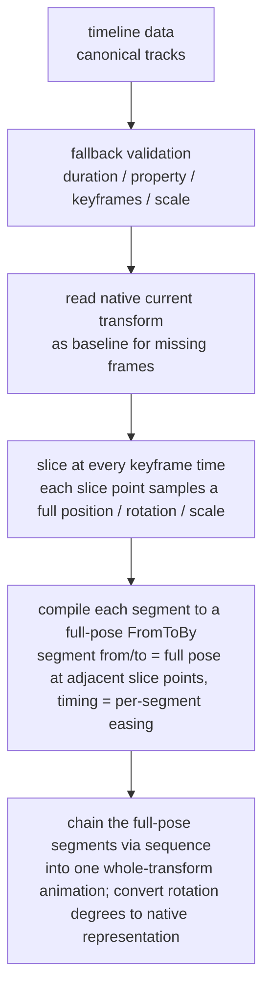

##### Slicing the timeline into full-pose nodes and chaining them

The whole timeline maps to a single bind target — the entire `transform`. Take the union of all channels' keyframe times as the slice points; adjacent slice points form a segment, and every slice point samples a complete `position` / `rotation` / `scale`, so each segment is a "full pose to full pose" transition.

**Per segment — expressed with `FromToByAnimation<Transform>`.** Each segment's `from` / `to` are the full poses at the two adjacent slice points, `duration` is the segment length, `timing` is the single easing Core already resolved for that segment, and `bindTarget` is fixed to `.transform`. The visionOS animation binding granularity is the whole `.transform`, which is the root reason for choosing full-pose slicing.

**Chaining — connect end to end with `sequence`.** The full-pose segment animations are chained in time order via `AnimationResource.sequence(with:)` into a single animation, so each segment carries its own easing yet plays continuously. A timeline with only a start and an end frame becomes one `FromToByAnimation<Transform>`. `delay` / `speed` / `loop` act at the top of this chained animation.

Consider an example (`position.y` has 3 keyframes, `rotation.y` has only start and end, the slice-point union is `0 / 0.6s / 1.2s`, giving 2 segments):

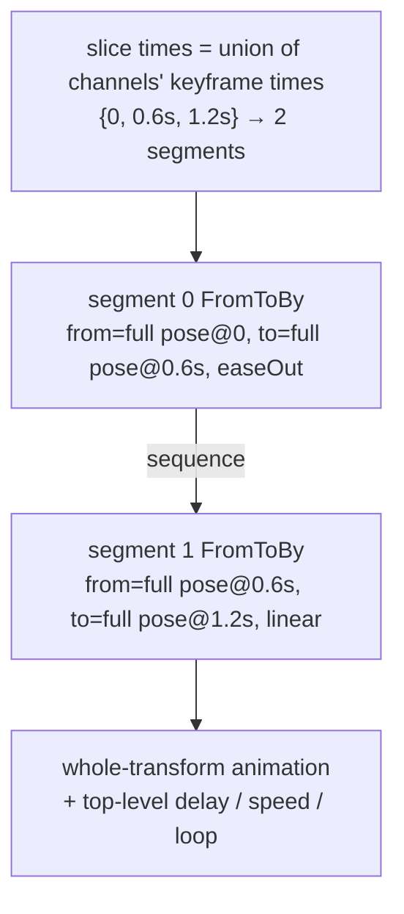

Each segment carries a full pose and joins the chain in time order; `delay` / `speed` / `loop` act at the top of the chained animation.

##### Output: the controllable playback object and sample code

The final compilation output is the controllable playback object. Reusing the example above (2 full-pose segments), the following shows it on visionOS and picoOS: each segment compiles into a full-pose `FromToBy`, chained via `sequence` into one animation resource, then handed to the engine — obtaining a playback controller that can pause / resume / stop / change speed, i.e. a "controllable playback object." Both platforms bind the whole transform, so the code lines up.

Platform verification has passed on visionOS and picoOS for whole-transform binding, multi-segment sequence, per-segment easing, top-level delay / speed / loop, controller pause / internal resume / stop, and completion. The snippets below show resource construction and controller shape only; before handing the resource to the engine, `EntityMotionTiming` applies the verified top-level delay / speed / loop settings once to the whole sequence rather than repeating them on each segment.

visionOS (RealityKit / Swift):

```swift
import RealityKit

// Reuse the example; every slice point carries a full position / rotation / scale, only y and rotation-about-y change
let base = entity.transform

// Sample a slice point's full pose (x / z / scale frozen at baseline, only pos.y and rot.y move)
func pose(y: Float, deg: Float) -> Transform {
    var t = base
    t.translation = SIMD3(base.translation.x, y, base.translation.z)
    t.rotation = simd_quatf(angle: deg * .pi / 180, axis: SIMD3(0, 1, 0))
    return t
}

// Segment 0: full pose from t=0 to t=0.6s
let seg0 = FromToByAnimation<Transform>(
    name: "seg0",
    from: pose(y: 0,    deg: 0),
    to:   pose(y: 0.25, deg: 90),
    duration: 0.6,
    timing: .easeOut,                 // segment 0 own easing
    bindTarget: .transform            // can only bind the whole transform
)
// Segment 1: full pose from t=0.6s to t=1.2s
let seg1 = FromToByAnimation<Transform>(
    name: "seg1",
    from: pose(y: 0.25, deg: 90),
    to:   pose(y: 0,    deg: 180),
    duration: 0.6,
    timing: .linear,                  // segment 1 own easing, different from segment 0
    bindTarget: .transform
)

// Chain the full-pose segments in time order into one animation via sequence
let clip = try AnimationResource.sequence(with: [
    try AnimationResource.generate(with: seg0),
    try AnimationResource.generate(with: seg1),
])

// Controllable playback object: the controller supports pause / resume / stop / speed
let controller = entity.playAnimation(clip, transitionDuration: 0, startsPaused: true)
controller.resume()          // native-object internal start / resume; not a JSB resume command
// controller.pause()        // pause
// controller.stop()         // stop
// controller.speed = 2.0    // top-level playback rate acts on the whole chained animation
```

picoOS (Pico Spatial SDK / Kotlin):

```kotlin
// Reuse the same example; every slice point carries a full Transform, x / z / scale frozen at baseline
val base = entity.getComponent(Transform::class.java) ?: Transform()

// Sample a slice point's full pose (only pos.y and rotation-about-y change)
fun pose(y: Float, deg: Float): Transform {
    val q = Quaternion.fromAxisAngle(Vector3(0f, 1f, 0f), deg)
    return Transform(Vector3(base.position.x, y, base.position.z), q, base.scale)
}

// Segment 0: full pose from t=0 to t=0.6s
val seg0 = TweenAnimation.createTweenAnimation(
    "seg0",
    AnimationBindTarget.bindTransform(),   // can only bind the whole transform
    pose(0f,    0f),                        // from (full pose)
    pose(0.25f, 90f),                       // to (full pose)
    null,                                   // by
    0.6f, 0f, RepeatMode.None, 0,           // duration / delay / repeatMode / repeatCount
    EaseType.EaseOut,                       // segment 0 easing
    0f, 1f, false, null, null, null
)
// Segment 1: full pose from t=0.6s to t=1.2s
val seg1 = TweenAnimation.createTweenAnimation(
    "seg1",
    AnimationBindTarget.bindTransform(),
    pose(0.25f, 90f),
    pose(0f,    180f),
    null,
    0.6f, 0f, RepeatMode.None, 0,
    EaseType.Linear,                        // segment 1 easing, different from segment 0
    0f, 1f, false, null, null, null
)

// Chain the full-pose segments in time order into one animation via sequence
val clip = AnimationResource.sequence(with = listOf(
    AnimationResource.generateWithTweenAnimation(seg0),
    AnimationResource.generateWithTweenAnimation(seg1),
))

// Controllable playback object
val controller = entity.playAnimation(clip)
// controller.pause() / controller.resume() / controller.stop() // native-object internal control
// controller.speed = 2f     // top-level playback rate acts on the whole chained animation
```

##### Compilation rules

1. **Property allowlist:** accept only `position.*`, `rotation.*`, `scale.*`. `opacity`, material, component properties, etc. all fail explicitly.
2. **Time range:** `duration` must be positive; each keyframe's `at` must fall within `[0, duration]`.
3. **Ordering and duplicates:** each track's keyframes are sorted non-decreasing by `at`; each property maps to one unique track.
4. **Slice times are the union across channels:** take the union of all channels' keyframe times as the timeline's slice points; adjacent slice points form a segment. For example `position.y` at `0, 0.6, 1.2` and `rotation.y` at `0, 1.2` give the union `0, 0.6, 1.2`, cut into `[0, 0.6]` and `[0.6, 1.2]`.
5. **Each slice point samples a full pose; missing frames fall back per channel:** every slice point must provide a complete `position` / `rotation` / `scale`. A channel with a keyframe gap derives the slice-point value solely through linear interpolation in time between its own numeric keyframes. The span before the channel's first keyframe falls back to the native baseline at playback start, and the span after its last keyframe holds the last value. Components absent from the config, such as `scale.*`, are sampled at the baseline and retain that value during playback—the animation therefore owns the entire transform while it plays.
6. **Serial chaining of full poses:** adjacent slice points form a full-pose `FromToByAnimation<Transform>`, and the segments are chained in time order via `sequence` into one whole-transform animation, all bound to the whole transform (`bindTarget: .transform`); see "Slicing the timeline into full-pose nodes and chaining them."
7. **Rotation:** `rotation.*` input is Euler degrees; at compile time it is converted to the rotation representation RealityKit requires, and RealityKit applies shortest-path spherical interpolation. If a rotation channel's single-frame increment reaches or exceeds 180°, or spans multiple axes, the actual path may differ from per-axis intuition; users define a specific multi-turn or multi-axis path through explicit intermediate keyframes.
8. **Scale:** `scale.*` must be non-negative; an invalid scale fails outright.
9. **One easing per segment:** public-authoring `timingFunction` belongs to a global timeline node. In v1, Core duplicates that global value into the existing track/keyframe fields and guarantees one consistent timing value at each `at`; Native accepts this consistent global-timing form. Native resolves one timing value for each adjacent pair in the keyframe-time union and applies it exactly once when constructing the final whole-transform segment. Slice-point value sampling uses linear time interpolation, while final segment playback applies easing. The closed easing enum is `linear` / `easeIn` / `easeOut` / `easeInOut`, with every value mapping directly to a RealityKit built-in curve.
10. **Loop / playback rate / delay:** these playback parameters live at the top of the timeline and apply uniformly to the whole chained animation, executed by the RealityKit playback layer. Loops within one fresh play reuse that run's resource without reading a new baseline or recompiling on every iteration.
11. **Explicit failure:** when a segment is outside RealityKit's expression range, the fresh-play control command must fail and leave the animation inactive.

The cross-platform capability combinations above have been verified and passed; this design does not introduce an SDK-managed segment-queue fallback. Future integration tests guard against regressions from platform upgrades or implementation changes rather than treating these capabilities as open assumptions.

#### Transform decomposition and confirmed-value reporting

The values native reports back to React must be in the entity API shape:

```text
type EntityMotionProps = {
  position?: Vec3
  rotation?: Vec3
  scale?: Vec3
}
```

Decomposition rules:

- `position` comes from the translation part of the native transform.
- `scale` comes from the scale part of the native transform.
- `rotation` uses Euler degrees, consistent with the entity property.
- After decomposition, report the complete committed transform independently of the animation config and the fields written by `api.set`.
- Both callback values and `entityProps` use `EntityMotionProps`; every confirmed value contains complete `position`, `rotation`, and `scale` values, each as a complete `Vec3`. `api.set(values)` accepts a deeply sparse `EntityMotionPatch`. For example, after axis-wise merging `set({ position: { y: 0.3 } })`, the confirmed result contains the complete position, rotation, and scale.

#### Native Internal Sequences

**Create sequence:**

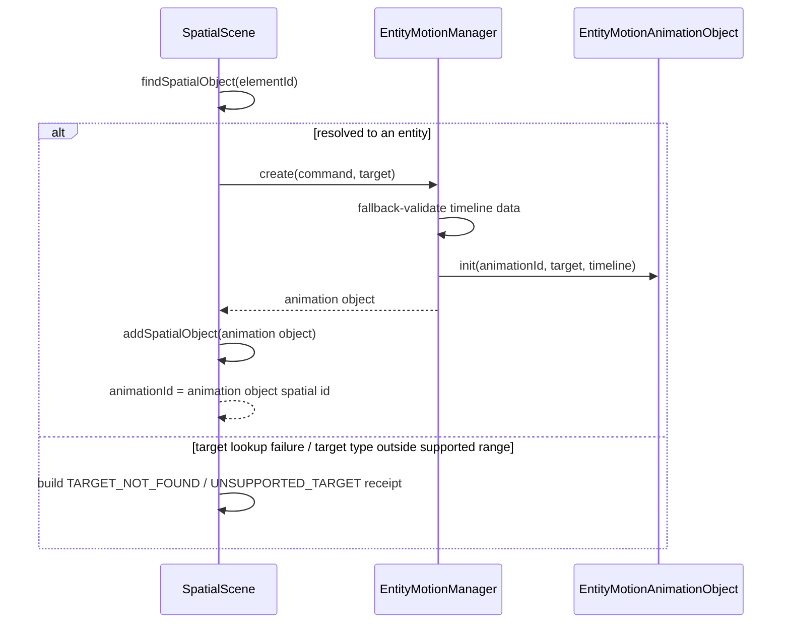

**Play and complete sequence:**

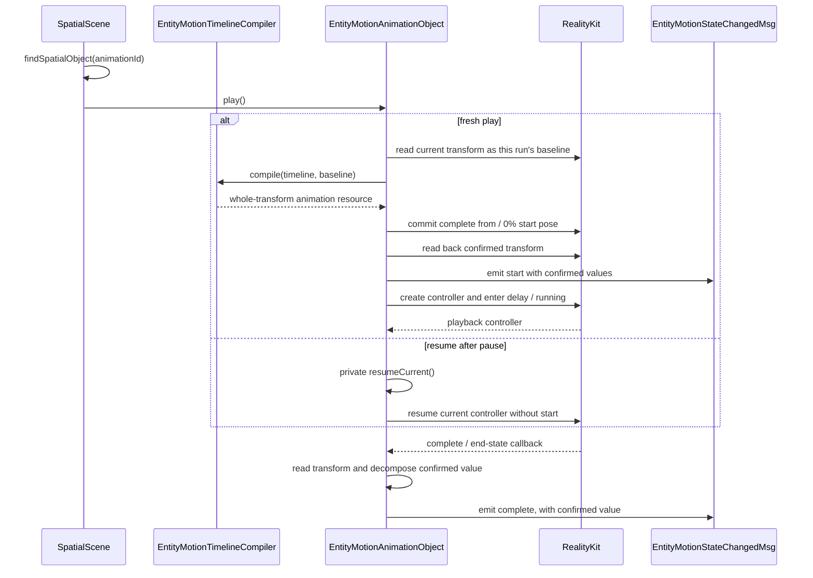

Create only stores the canonical timeline; `SpatialScene` registers the animation object and returns its `animationId`. Each fresh play reads the latest baseline and compiles that run's RealityKit resource, then commits and confirms the complete start pose. `start` and the first `entityProps` update happen after that confirmation without waiting for delay to end. A `play` after pause reuses the current resource and controller without reading the baseline, compiling, or producing another `start`.

State-command matrix:

| Native state | `play` | `pause` | `stop` | `reset` | `finish` | `set` |
|---|---|---|---|---|---|---|
| `idle` | fresh play → `running`; emit `start` once after start-pose confirmation | keep `idle` | keep `idle` | commit start pose → `idle`; emit `reset` | commit end pose → `finished`; emit `finish` | commit patch; keep `idle` |
| `running` (including delay) | keep current run | → `paused`; emit `pause` | commit current pose → `idle`; emit `stop` | commit start pose → `idle`; emit `reset` | commit end pose → `finished`; emit `finish` | keep current run; warning receipt |
| `paused` | resume current controller → `running` | keep `paused` | commit current pose → `idle`; emit `stop` | commit start pose → `idle`; emit `reset` | commit end pose → `finished`; emit `finish` | keep paused run; warning receipt |
| `finished` | fresh play → `running`; emit `start` once after start-pose confirmation | keep `finished` | keep `finished` | commit start pose → `idle`; emit `reset` | keep `finished` | commit patch; keep `finished` |

For `reset` and `finish`, an existing run supplies its confirmed start and end poses. Before the first run, the compiler reads the current native transform as the baseline on demand and computes the configured start or end pose. `finish` always commits the configured `to` / `100%` pose for ordinary, reset-loop, and reverse-loop playback.

Each fresh play allocates a monotonically increasing `runId`, stores the current controller identity, and initializes one-shot lifecycle gates. A controller completion event belongs to the active run when both its controller identity and captured `runId` match. `stop`, `reset`, `finish`, and `destroy` advance the run generation and retire the current controller identity. Native serializes controller callbacks and command handlers; the first processed action commits its transition, and each later action evaluates the resulting state through the matrix above.

Lifecycle gates provide these callback counts: one `onStart` for each accepted fresh play, one `onComplete` from either natural completion or `finish` for that run, one `onStop` for each accepted transition from `running` / `paused` to `idle`, and one `onReset` for each accepted `reset`. Repeated commands that keep the current state also keep the existing callback counts.

**Pause sequence:**

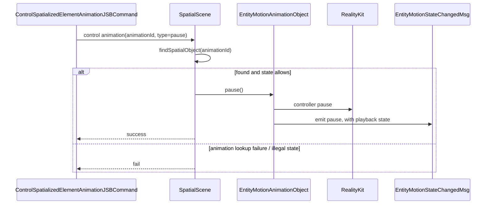

**Stop, reset, finish sequence:**

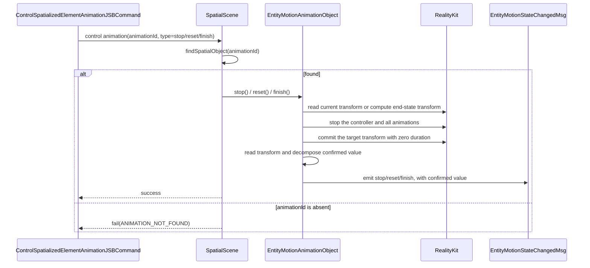

**set sequence:**

```mermaid
sequenceDiagram
    participant JSB as ControlSpatializedElementAnimationJSBCommand
    participant Scene as SpatialScene
    participant Obj as EntityMotionAnimationObject
    participant RK as RealityKit
    participant Event as EntityMotionStateChangedMsg

    JSB->>Scene: control animation(animationId, type=set, values)
    Scene->>Scene: findSpatialObject(animationId)
    alt animationId is absent
        Scene-->>JSB: fail(ANIMATION_NOT_FOUND)
    else animation delayed / playing / paused
        Scene-->>JSB: fail(INVALID_CONTROL_STATE)
        Note over JSB: Core maps to warning + no-op; no onError
    else animation idle / at end state
        Scene->>Obj: set(values)
        Obj->>RK: read current transform as committed baseline
        Obj->>Obj: merge sparse patch onto baseline
        Obj->>RK: commit merged transform with zero duration
        Obj->>Obj: read transform and decompose confirmed value
        Obj->>Event: emit set, with confirmed value
        Scene-->>JSB: success
    end
```

Pause reuses the compiled whole-transform chain and controls the current playback controller. Stop / reset / finish terminate the current playback and commit the end-state transform with zero duration. While inactive, `set` merges the sparse patch onto the committed transform and commits it directly.

A native Entity animation object has the same lifecycle as one target binding. When the target is destroyed, `SpatialScene` cascades destruction to associated animations through the global `SpatialObject` lifecycle and retains no invalid object.

Boundary constraint: `SpatialScene` owns global `spatialObjects`, create-target lookup, control-animation lookup, runtime-type dispatch, command receipts, and the `SpatialObject` lifecycle. `EntityMotionManager` only provides Entity animation-object creation; `EntityMotionAnimationObject` owns per-object compilation, playback state, controls, confirmed values, and resource release. Extract a shared protocol only after real duplication appears; do not introduce a second registry in advance.
