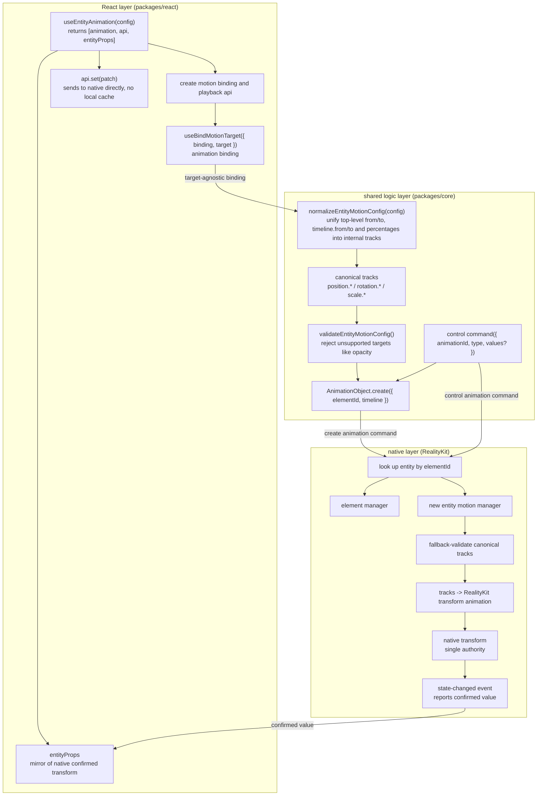
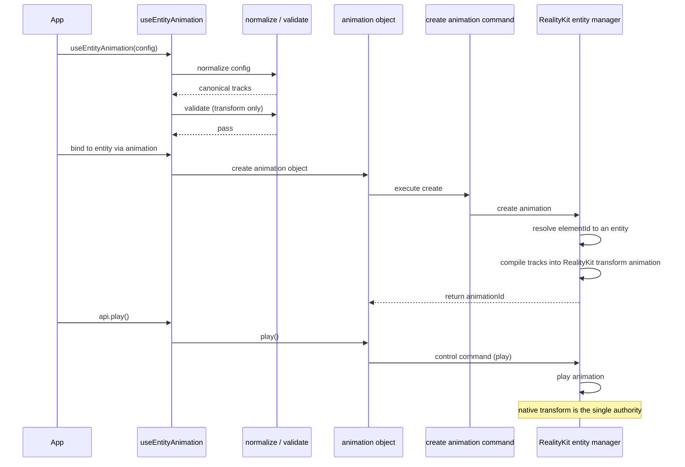
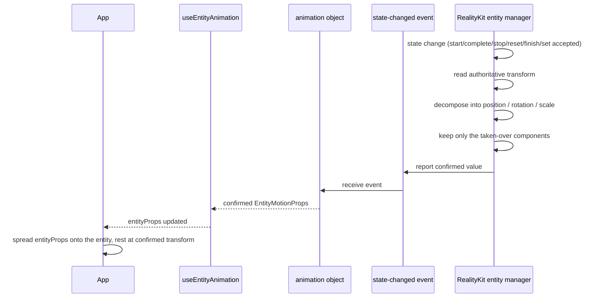
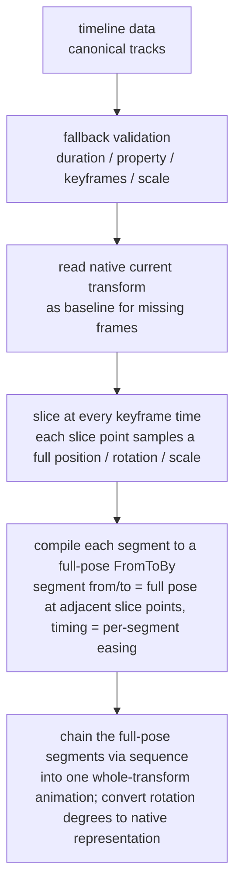
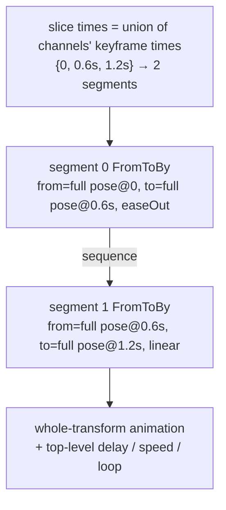
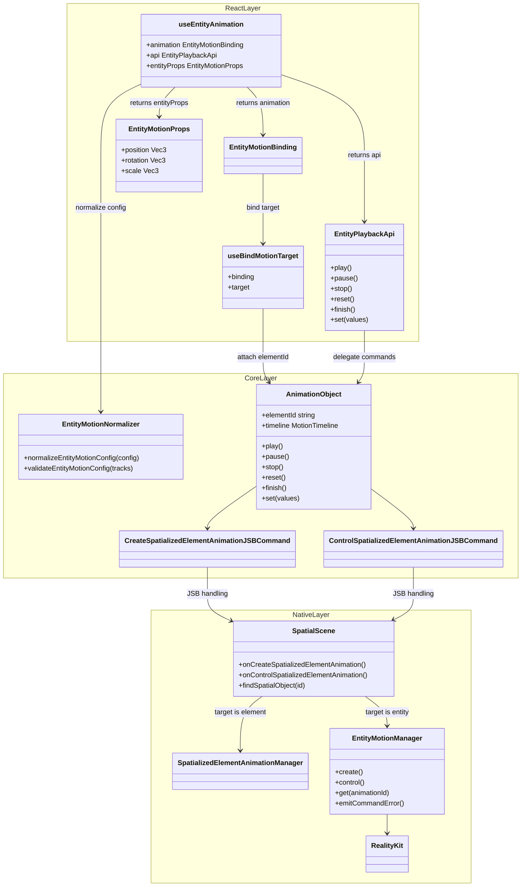
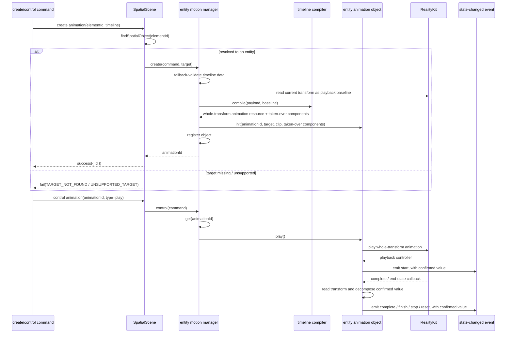
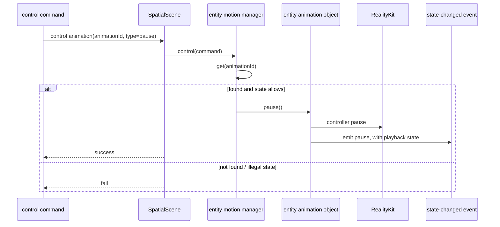
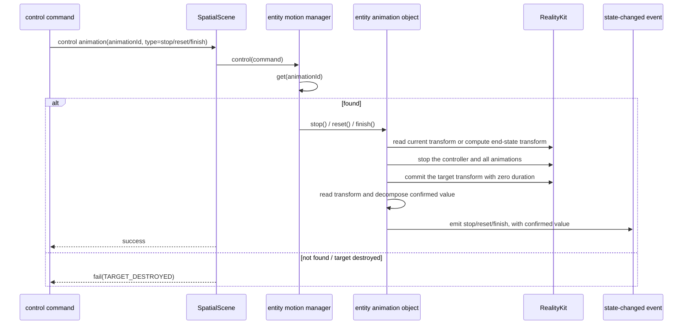
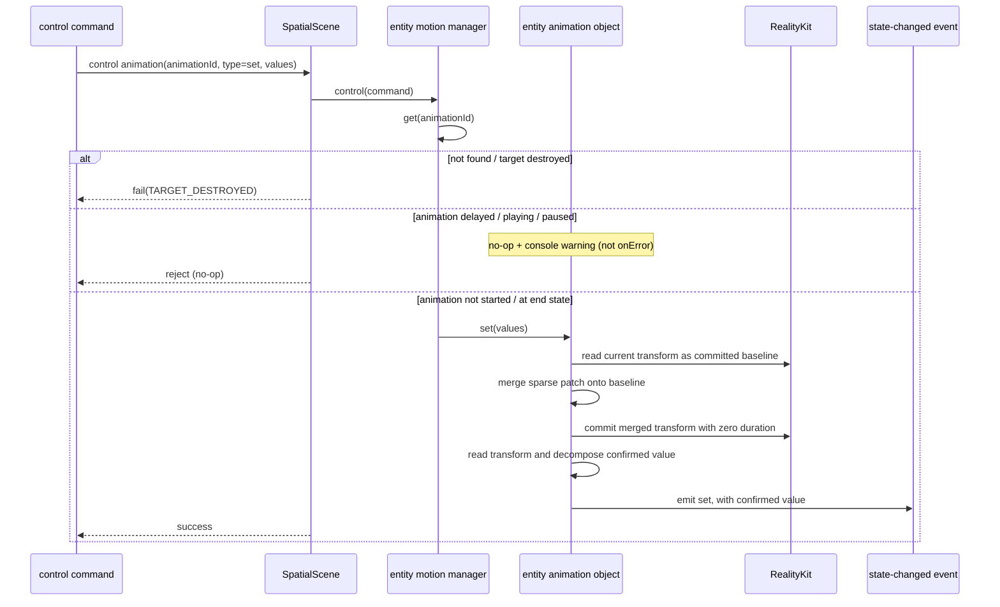

# `useEntityAnimation` Redesign

## 1. Background

`useEntityAnimation` is the WebSpatial SDK React Hook that drives transform animations for 3D entities in a scene. It supports percentage keyframes, animation-result write-back, and a unified imperative transform setter, and it unifies entity motion onto the generic animation binding, lifecycle, and cross-layer protocol.

This redesign integrates entity motion into the generic animation architecture: the React layer provides the Hook, target binding, and result mirror; Core normalizes and validates configuration; and the visionOS native layer compiles and executes animations with RealityKit. The native transform is the single authoritative data source. Every transform change is confirmed by native before it is mirrored to React, structurally preventing the animation end state from conflicting with stale React base properties and snapping back.

The goals are to:

- Define the responsibility boundaries and data flow across React, Core, and native.
- Define both the “config → canonical tracks → RealityKit animation” path and the “native confirmed transform → `entityProps`” path.
- Reuse the create, control, and state-event protocol instead of adding a parallel entity command path.
- Generalize animation objects from spatial-element-only objects into motion objects that can target different runtime object types.

This design does not provide public seek, scrub, or progress-read APIs, and it does not use an SDK-side per-frame sampler. It defines the API shape, behavior boundaries, cross-layer protocol, compilation rules, and module responsibilities required for a self-contained technical review.

## 2. Glossary

- **Entity**: a 3D object in the scene, e.g. a box. It has three groups of spatial properties, collectively called its "transform."
- **transform**: an entity's state in space, made of position `position` (meters), rotation `rotation` (degrees), and scale `scale` (multiplier).
- **component**: one of the three transform parts, i.e. `position`, `rotation`, or `scale`.
- **native layer / RealityKit**: the low-level engine on Apple visionOS that actually drives 3D entity motion, implemented in Swift. "Native" in this document refers to this layer.
- **React layer / shared logic layer (Core)**: respectively the user-facing Hook code, and the platform-agnostic logic shared by both ends.
- **JS Bridge command / event**: the channel for sending and receiving messages between JavaScript and the native layer. Commands go from JS to native; events come back from native to JS.
- **authoritative data source**: which side a given piece of data defers to. In this design, an entity's real transform defers only to the native layer.
- **mirror**: React copies the transform the native layer has already confirmed and uses that copy for rendering. That copy is the mirror.
- **`entityProps`**: the transform mirror the Hook returns to the user, of the form `{ position?, rotation?, scale? }`. Spread onto the component, it keeps the entity resting at the animation's end state.
- **confirmed transform**: after the native layer finishes an action, it reads back the entity's real transform and reports it. React updates `entityProps` only from such values.
- **track / channel**: a curve describing how a single property (e.g. `position.y`) changes over time; the two are interchangeable and both refer to the keyframe sequence of one single property. Note that compilation does not bind and play per channel; instead it slices at the union of channel keyframe times, samples a full pose at each slice point, and plays the whole transform (see 5.3).
- **keyframe**: a time point on a curve and its value, e.g. "at 0.6s, `position.y` = 0.25."
- **timingFunction**: a curve describing the pacing between two frames, e.g. constant-speed `linear`, slow-then-fast `easeIn`.
- **baseline**: a channel's current native value at the moment playback starts; used as a fallback when the channel lacks a starting keyframe.
- **spherical linear interpolation (slerp)**: the interpolation RealityKit uses for rotation, always taking the shortest path between two orientations.
- **no-op**: a command is received but produces no effect; neither the entity nor `entityProps` changes.
- **registry**: the table the native layer uses to look up entities or animation objects by id.

## 3. Functional Scope

`useEntityAnimation` lets users describe animations with position, rotation, and scale, bind them to an entity, and receive the native-confirmed transform. The functional scope is:

| Capability | Description |
|---|---|
| Transform animation | Supports only `position`, `rotation`, and `scale`; rejects non-transform properties such as `opacity`. |
| Timeline forms | Supports top-level `from` / `to`, `timeline.from` / `timeline.to`, and percentage keyframes such as `0% → 50% → 100%`. |
| Target binding | Returns `animation`, which binds through the entity component's `animation` property. |
| Playback control | `api` provides `play`, `pause`, `stop`, `reset`, and `finish`. |
| Result write-back | Native reports transforms at confirmed lifecycle points; React exposes them as `entityProps` so the entity does not snap back at the end state. |
| Imperative set | In an inactive state, `api.set(patch)` merges a sparse patch onto the native committed transform. |
| Lifecycle and errors | Reuses the generic animation create, control, destroy, target-invalidation, and error-event path. |
| Capability detection | Detects the complete capability through `supports('useEntityAnimation')`. |

## 4. Design Approach and Trade-offs

### 4.1 Design Principles

#### The native layer is the single authoritative data source

An entity's transform defers only to native RealityKit. React does not keep a second transform that could conflict with native, and does not maintain a pending-commit cache or a predicted end state.

`entityProps` is only a React-side mirror of the transform native has already confirmed. Data flows in one direction:

```text
React config / api.set
  -> native animation engine (single authority)
  -> confirmed transform
  -> entityProps mirror
```

From this a few rules follow:

- Play, stop, reset, finish, `api.set` — every operation that changes the transform goes to the native layer first.
- When native rejects a command, that write is void and `entityProps` is not updated.
- When native accepts a command, it reports the confirmed transform through an animation state event, and React then updates `entityProps`.
- React only mirrors the transform native has confirmed back to the user; while an animation is in progress, writes are never queued for replay.
- `entityProps` may be empty before the first confirmed transform arrives. After confirmation, it contains only the components the animation has taken over plus the components written by `api.set`, with fields limited to `position` / `rotation` / `scale`; components that were not taken over never enter `entityProps`.

#### Reuse the generic animation architecture

`useEntityAnimation` reuses the generic animation's binding, target resolution, animation-object lifecycle, and the "create — control — event" pipeline as much as possible. The entity path's differences are concentrated in only a few places:

- Description: uses `position` / `rotation` / `scale`.
- Validation: allows only transforms, rejects `opacity`.
- Result exit: goes through `entityProps`, not CSS `style`.
- Target type: `SpatialEntity`.
- Execution engine: RealityKit.

### 4.2 Why RealityKit

The native execution engine is chosen as **RealityKit**, because:

1. **One execution engine.** Entity motion and generic animation share a single RealityKit engine, avoiding a separate execution path for entities.
2. **It is inherently the execution engine for 3D entities.** With many entities animating concurrently, native engine playback scales better than per-frame writes from the SDK.
3. **It meets both the playback and reporting needs.** It can control playback state, read an entity's current transform, and emit an event when playback completes — enough to implement stop, reset, and finish, and to report the confirmed transform to callbacks and `entityProps`.

The main added cost is a compiler: translating the normalized entity tracks into transform animations RealityKit can execute.

#### Why the per-frame sampling scheme was rejected

An alternative is to drop RealityKit and instead drive the transform with a timer sampling frame by frame and hand-written interpolation. Setting aside its worse performance, the following problems alone are enough to reject it:

- **Out of sync with the render tick.** A transform written per frame and RealityKit's own render commit are not on the same beat, which easily causes jitter, tearing, or a one-frame lag.
- **No system compositing semantics.** RealityKit animation can participate in visionOS system compositing and reprojection; discrete transforms produced by CPU sampling get no such treatment.
- **Outside the scene system.** RealityKit transform animation naturally sits inside the scene graph, coordinate spaces, anchors, and the collision system; hand-written sampling floats outside it.
- **Poor interpolation quality.** Rotation needs spherical linear interpolation; hand-written per-frame linear interpolation easily produces artifacts.
- **Rebuilding playback semantics.** Easing, looping, delay, playback rate, pause, and completion events would all have to be implemented from scratch.
- **Two execution semantics.** The element path uses native animation objects; sampling entities separately would give one animation API two execution models.

A hybrid that uses RealityKit for some shapes and a sampler for the rest is rejected too: one entity API can have only one execution semantics.

### 4.3 Overall Architecture



**Responsibilities per layer:**

- **React layer** handles the Hook API, binding lifecycle, the `entityProps` mirror, callback dispatch, and re-render; it keeps no independent transform cache.
- **Shared logic layer** normalizes the three public authoring forms (top-level `from` / `to`, `timeline.from` / `timeline.to`, and percentage keyframes) into internal canonical entity tracks. Top-level `from` / `to` is equivalent shorthand for `timeline.from` / `timeline.to`, and both fold into the same internal track set; when both are present `timeline` wins, the top-level pair is ignored, and a warning is logged in development mode. The animation object's `elementId` field in this design means "spatial object id."
- **Native layer** looks up the target, does fallback validation, compiles and executes with RealityKit, accepts or rejects commands, decomposes the final transform, and reports it back through events.

### 4.4 Key Trade-offs

- **Command names keep the `Element` wording.** The create and control commands contain `Element` in their names, with no parallel path. Their target-state semantics cover spatial objects, and `elementId` identifies a spatial object.
- **Accept native compiler cost.** Concentrate multi-keyframe handling, sparse keyframes, rotation conversion, and whole-transform serial compilation in the entity motion manager and compiler in exchange for native RealityKit playback, system compositing, and one execution model.
- **Slice into a serial chain of full poses.** Cut the timeline into a set of nodes, each carrying a complete `position` / `rotation` / `scale`, then chain them in order into one whole-transform animation. Two reasons drive this trade-off: first, visionOS (RealityKit) can only bind the whole `.transform` and does not support per-channel binding (e.g. `.transform.translation`); second, there is currently no requirement to control `timingFunction` independently per channel. So we drop per-channel parallelism in favor of a serial chain of full poses, which naturally aligns visionOS and picoOS (both bind the whole transform natively); the cost is that all channels within one segment share a single `timingFunction`.
- **Take over by component.** Once any field of a component appears in the animation, the animation owns that entire component. For example, animating only `position.y` freezes `position.x` / `position.z` at baseline during playback; components absent from the config remain driven by React props.
- **Do not support functional `set`.** `api.set(prev => next)` cannot guarantee that `prev` is the live native transform, so v1 accepts sparse patch objects only; consumers read the latest confirmed transform through `entityProps`.
- **Do not add a generic adapter layer yet.** v1 dispatches by runtime type inside `SpatialScene` to either the element or entity manager. Extract a shared protocol only after real duplication appears.
- **Measure large-scale concurrency.** Native RealityKit playback is preferable to per-frame JS writes, but high entity counts still require dedicated performance validation.

## 5. Module Design

### 5.1 Communication Protocol (JS Bridge)

Reuse the commands and events; do not add a parallel channel for entities:

- Create animation: `CreateSpatializedElementAnimationJSBCommand`
- Control animation: `ControlSpatializedElementAnimationJSBCommand`
- State event: `spatialanimationstatechanged`

#### Create animation command

The command name and the `elementId` field carry a spatial object. `elementId` means a spatial object id, which can point to an element or an entity:

```text
CreateSpatializedElementAnimation {
  elementId: string
  timeline: EntityMotionTimeline | SpatializedMotionTimeline
}
```

Native looks up the registry by `elementId`, then dispatches by runtime type:

```text
is element -> element manager
is entity  -> entity motion manager
otherwise  -> fail
```

Rules:

- When `elementId` is not found in the registry, create must fail explicitly.
- When the resolved object is neither an element nor an entity, create must fail with "unsupported target."
- The control command no longer carries `elementId`; it locates the already-created animation solely by `animationId`.
- When the target object is destroyed, its associated animation must be destroyed or invalidated; subsequent control must fail and be surfaced through an error event.

#### Control animation command

Reuse the command and add a `set` type:

```text
ControlSpatializedElementAnimation {
  animationId: string
  type: 'play' | 'pause' | 'stop' | 'reset' | 'finish' | 'destroy' | 'set'
  values?: EntityMotionPatch
}
```

`api.set` adds no command. It accepts only a sparse patch object `EntityMotionPatch` (the write-side type, same shape as the read-side `EntityMotionProps` but named distinctly), and does not support the `(prev) => next` function form. It is sent to native as `type: 'set'`:

- Native rejects: the command fails or triggers an error event, and `entityProps` is not updated.
- Native accepts: native merges the patch onto the currently committed transform, applies it, then reports the confirmed value through a state event, and React then updates `entityProps`.

#### State-changed event

The state event carries a named detail type:

```text
interface EntityMotionStateChangedDetail {
  animationId: string
  action:
    | 'play' | 'pause' | 'stop' | 'reset' | 'finish' | 'destroy' | 'set'
    | 'start' | 'complete' | 'error'
  playState: 'idle' | 'queued' | 'running' | 'paused' | 'finished'
  finished: boolean
  values?: EntityMotionProps
  error?: SpatializedPlaybackError
}

interface EntityMotionStateChangedMsg {
  type: 'spatialanimationstatechanged'
  detail: EntityMotionStateChangedDetail
}
```

`values` is the entity target's transform value `EntityMotionProps` (i.e. `position` / `rotation` / `scale`).

The `action` set native reports is larger than the public callback set. Its mapping to user callbacks and `entityProps` is:

| native action | mapped user callback | updates entityProps |
|---|---|---|
| `start` | `onStart` | yes (once, at the moment of start) |
| `complete` | `onComplete` | yes (end state) |
| `finish` | `onComplete` | yes (end state) |
| `stop` | `onStop` | yes (current transform) |
| `reset` | `onReset` | yes (starting transform) |
| `set` | none (internal commit only) | yes (merged transform) |
| `error` | `onError` | no |
| `pause` | none (playback state change only) | no |

#### Playback error classification

When `action` is `error`, it carries `error`. The error codes are a closed set shared by both target types:

```text
type SpatializedPlaybackError = {
  code:
    | 'TARGET_NOT_FOUND'     // elementId not in the registry
    | 'UNSUPPORTED_TARGET'   // resolved object is neither element nor entity
    | 'TARGET_DESTROYED'     // target destroyed, animation invalidated
  message?: string
}
```

All three reach the user through `onError`. There is one exception: a rejected `api.set` write (while the animation is active, or before the binding / native object is created) is not an error. It is a no-op that only prints a console warning and does not go to `onError`. The error codes must be distinguishable so the app can branch by type rather than parsing the `message` text.

### 5.2 Cross-layer Sequences

#### From config to native transform (playback)



#### From native confirmed transform to React mirror



Whether `api.set` takes effect is decided solely by native: native does not buffer the patch while the animation is active, and a write when unbound or before the native object exists is likewise void — these writes are no-ops that only log a console warning. Create / bind produces a confirmed value only at the first lifecycle commit (a playback end state or an accepted `set`), so `entityProps` may be empty before then.

### 5.3 Timeline Normalization and Compilation

Entity motion goes from public config to a playable object in two stages, which live in two layers with strictly separated responsibilities:

1. **Normalization (JS / shared logic layer):** fold the three public authoring shapes (top-level `from` / `to`, `timeline.from` / `timeline.to`, percentage keyframes) into one platform-agnostic internal timeline data `EntityMotionTimelinePayload`. This step only expands, merges, and resolves values, producing platform-agnostic internal data entirely on the JS side.
2. **Compilation (native / RealityKit):** the native entity motion manager takes the normalized internal timeline, reads the baseline transform, slices it at the union of channel keyframe times into full-pose segments, compiles each into a full-pose `FromToByAnimation<Transform>`, then chains them via `sequence` into one whole-transform animation, finally producing a playable object (animation resource + playback controller). This step is the actual **compilation**.

#### Normalization (JS layer)

Normalization is done by the shared logic layer's `normalizeEntityMotionConfig`, folding the three public authoring shapes into one internal timeline data.

**Input:** the three public authoring shapes, folded by these rules:

- **Top-level `from` / `to`** is equivalent to `timeline.from` / `timeline.to`, expanded into a start and an end frame.
- **`timeline.from` / `timeline.to`** are the `0%` / `100%` frames and may be mixed with percentage keys.
- **Percentage keyframes** `0% → 50% → 100%` are converted to seconds via `at = percentage × duration`.

The full normalization rules (`timeline` precedence, mandatory boundaries, `duration` defaults, etc.) are in Section 5.6, "Changes per Layer · Shared logic layer."

**Output:** a platform-agnostic `EntityMotionTimelinePayload`, shown below:

```text
type EntityMotionTimelinePayload = {
  duration: number
  delay?: number
  playbackRate?: number
  loop?: boolean | { reverse?: boolean }
  tracks: EntityMotionTrack[]
}

type EntityMotionTrack = {
  property: EntityMotionProperty
  keyframes: EntityMotionKeyframe[]
  timingFunction?: TimingFunction
}

type EntityMotionProperty =
  | 'position.x' | 'position.y' | 'position.z'
  | 'rotation.x' | 'rotation.y' | 'rotation.z'
  | 'scale.x'    | 'scale.y'    | 'scale.z'

type EntityMotionKeyframe = {
  at: number
  value: number
  timingFunction?: TimingFunction
}
```

Example:

```text
{
  duration: 1.2,
  tracks: [
    {
      property: 'position.y',
      timingFunction: 'easeOut',
      keyframes: [
        { at: 0, value: 0 },
        { at: 0.6, value: 0.25 },
        { at: 1.2, value: 0 },
      ],
    },
    {
      property: 'rotation.y',
      timingFunction: 'linear',
      keyframes: [
        { at: 0, value: 0 },
        { at: 1.2, value: 180 },
      ],
    },
  ],
}
```

#### Compilation (native / RealityKit)

Compilation is done by the native entity motion manager: it takes the normalized internal timeline, reads the baseline transform, slices the timeline into a set of full-pose nodes and compiles it segment by segment, finally producing a controllable playback object.

##### Input: internal timeline

The compilation input is exactly the normalization output `EntityMotionTimelinePayload` (structure in the section above), whose target has already been resolved to an entity.

##### Compilation flow



##### Slicing the timeline into full-pose nodes and chaining them

The whole timeline maps to a single bind target — the entire `transform`. Take the union of all channels' keyframe times as the slice points; adjacent slice points form a segment, and every slice point samples a complete `position` / `rotation` / `scale`, so each segment is a "full pose to full pose" transition.

**Per segment — expressed with `FromToByAnimation<Transform>`.** Each segment's `from` / `to` are the full poses at the two adjacent slice points, `duration` is the segment length, `timing` is the segment's easing (easing priority is in compilation rule 9), and `bindTarget` is fixed to `.transform`. visionOS can only bind the whole `.transform` and does not support per-channel binding (e.g. `.transform.translation`), which is the root reason for choosing full-pose slicing.

**Chaining — connect end to end with `sequence`.** The full-pose segment animations are chained in time order via `AnimationResource.sequence(with:)` into a single animation, so each segment carries its own easing yet plays continuously. A timeline with only a start and an end frame degenerates to a single segment — one `FromToByAnimation<Transform>`, with no `sequence` needed. `delay` / `speed` / `loop` act at the top of this chained animation.

Consider an example (`position.y` has 3 keyframes, `rotation.y` has only start and end, the slice-point union is `0 / 0.6s / 1.2s`, giving 2 segments):



Each segment carries a full pose, chained top-to-bottom in time order; there is no longer a "cross-channel parallel" layer, and `delay` / `speed` / `loop` act only at the top of the chained animation.

##### Output: the controllable playback object and sample code

The final compilation output is the controllable playback object. Reusing the example above (2 full-pose segments), the following shows it on visionOS and picoOS: each segment compiles into a full-pose `FromToBy`, chained via `sequence` into one animation resource, then handed to the engine — obtaining a playback controller that can pause / resume / stop / change speed, i.e. a "controllable playback object." Both platforms bind the whole transform, so the code lines up.

visionOS (RealityKit / Swift):

```swift
import RealityKit

// Reuse the example; every slice point carries a full position / rotation / scale, only y and rotation-about-y change
let base = entity.transform

// Sample a slice point's full pose (x / z / scale frozen at baseline, only pos.y and rot.y move)
func pose(y: Float, deg: Float) -> Transform {
    var t = base
    t.translation = SIMD3(base.translation.x, y, base.translation.z)
    t.rotation = simd_quatf(angle: deg * .pi / 180, axis: SIMD3(0, 1, 0))
    return t
}

// Segment 0: full pose from t=0 to t=0.6s
let seg0 = FromToByAnimation<Transform>(
    name: "seg0",
    from: pose(y: 0,    deg: 0),
    to:   pose(y: 0.25, deg: 90),
    duration: 0.6,
    timing: .easeOut,                 // segment 0 own easing
    bindTarget: .transform            // can only bind the whole transform
)
// Segment 1: full pose from t=0.6s to t=1.2s
let seg1 = FromToByAnimation<Transform>(
    name: "seg1",
    from: pose(y: 0.25, deg: 90),
    to:   pose(y: 0,    deg: 180),
    duration: 0.6,
    timing: .linear,                  // segment 1 own easing, different from segment 0
    bindTarget: .transform
)

// Chain the full-pose segments in time order into one animation via sequence
let clip = try AnimationResource.sequence(with: [
    try AnimationResource.generate(with: seg0),
    try AnimationResource.generate(with: seg1),
])

// Controllable playback object: the controller supports pause / resume / stop / speed
let controller = entity.playAnimation(clip, transitionDuration: 0, startsPaused: true)
controller.resume()          // play
// controller.pause()        // pause
// controller.stop()         // stop
// controller.speed = 2.0    // top-level playback rate acts on the whole chained animation
```

picoOS (Pico Spatial SDK / Kotlin):

```kotlin
// Reuse the same example; every slice point carries a full Transform, x / z / scale frozen at baseline
val base = entity.getComponent(Transform::class.java) ?: Transform()

// Sample a slice point's full pose (only pos.y and rotation-about-y change)
fun pose(y: Float, deg: Float): Transform {
    val q = Quaternion.fromAxisAngle(Vector3(0f, 1f, 0f), deg)
    return Transform(Vector3(base.position.x, y, base.position.z), q, base.scale)
}

// Segment 0: full pose from t=0 to t=0.6s
val seg0 = TweenAnimation.createTweenAnimation(
    "seg0",
    AnimationBindTarget.bindTransform(),   // can only bind the whole transform
    pose(0f,    0f),                        // from (full pose)
    pose(0.25f, 90f),                       // to (full pose)
    null,                                   // by
    0.6f, 0f, RepeatMode.None, 0,           // duration / delay / repeatMode / repeatCount
    EaseType.EaseOut,                       // segment 0 easing
    0f, 1f, false, null, null, null
)
// Segment 1: full pose from t=0.6s to t=1.2s
val seg1 = TweenAnimation.createTweenAnimation(
    "seg1",
    AnimationBindTarget.bindTransform(),
    pose(0.25f, 90f),
    pose(0f,    180f),
    null,
    0.6f, 0f, RepeatMode.None, 0,
    EaseType.Linear,                        // segment 1 easing, different from segment 0
    0f, 1f, false, null, null, null
)

// Chain the full-pose segments in time order into one animation via sequence
val clip = AnimationResource.sequence(with = listOf(
    AnimationResource.generateWithTweenAnimation(seg0),
    AnimationResource.generateWithTweenAnimation(seg1),
))

// Controllable playback object
val controller = entity.playAnimation(clip)
// controller.pause() / controller.resume() / controller.stop()
// controller.speed = 2f     // top-level playback rate acts on the whole chained animation
```

##### Compilation rules

1. **Property allowlist:** accept only `position.*`, `rotation.*`, `scale.*`. `opacity`, material, component properties, etc. all fail explicitly.
2. **Time range:** `duration` must be positive; each keyframe's `at` must fall within `[0, duration]`.
3. **Ordering and duplicates:** each track's keyframes are sorted non-decreasing by `at`; multiple tracks for the same property are not allowed.
4. **Slice times are the union across channels:** take the union of all channels' keyframe times as the timeline's slice points; adjacent slice points form a segment. For example `position.y` at `0, 0.6, 1.2` and `rotation.y` at `0, 1.2` give the union `0, 0.6, 1.2`, cut into `[0, 0.6]` and `[0.6, 1.2]`.
5. **Each slice point samples a full pose; missing frames fall back per channel:** every slice point must provide a complete `position` / `rotation` / `scale`. If a channel has no keyframe at that moment, its value is interpolated among its own keyframes; the span before the channel's first keyframe falls back to the native baseline at playback start, and the span after its last keyframe holds the last value. Because the whole transform is bound, a component that never appears in the config (e.g. no `scale.*`) is sampled at the baseline and held constant during playback — i.e. the entire transform is owned by the animation while it plays.
6. **Serial chaining of full poses:** adjacent slice points form a full-pose `FromToByAnimation<Transform>`, and the segments are chained in time order via `sequence` into one whole-transform animation, all bound to the whole transform (`bindTarget: .transform`); see "Slicing the timeline into full-pose nodes and chaining them." There is no per-channel parallelism and no `group`.
7. **Rotation:** `rotation.*` input is Euler degrees; at compile time it is converted to the rotation representation RealityKit requires, avoiding per-frame interpolation of Euler angles. RealityKit uses shortest-path spherical interpolation for orientation, so if a rotation channel's single-frame increment reaches or exceeds 180°, or spans multiple axes, the actual path may differ from per-axis intuition; when a specific multi-turn or multi-axis path is needed, add intermediate keyframes explicitly. The compiler does not densify keyframes automatically — that is the user's responsibility.
8. **Scale:** `scale.*` must be non-negative; an invalid scale fails outright.
9. **Easing priority:** keyframe-level easing takes priority over track-level, and track-level over the timeline default. Easing values are a closed enum `linear` / `easeIn` / `easeOut` / `easeInOut`, all mapping directly to RealityKit built-in curves; custom bezier easing is not supported, and there is no easing that requires a fallback. In addition, because each segment binds the whole transform, `position` / `rotation` / `scale` within one segment share that segment's easing.
10. **Loop / playback rate / delay:** these playback parameters live at the top of the timeline and apply uniformly to the whole chained animation, executed by the RealityKit playback layer.
11. **Explicit failure:** if RealityKit cannot express a segment, it must report the error explicitly through command failure or an error event, and must not silently ignore it.

### 5.4 Transform Decomposition and Reporting

The values native reports back to React must be in the entity API shape:

```text
type EntityMotionProps = {
  position?: Vec3
  rotation?: Vec3
  scale?: Vec3
}
```

Decomposition rules:

- `position` comes from the translation part of the native transform.
- `scale` comes from the scale part of the native transform.
- `rotation` uses Euler degrees, consistent with the entity property.
- After decomposition it must be trimmed by the components this animation object currently takes over: report only the components the animation took over plus the components written by `api.set`; components not taken over do not enter the reported value, so that spreading them does not overwrite components the user is still driving live via React props. If `api.set` writes a component that the config did not animate, that component is merged into the taken-over set and thereafter also appears in `entityProps`.
- Both the callback value and `entityProps` use the `EntityMotionProps` shape; `api.set(values)` accepts the same-shaped write-side `EntityMotionPatch`, naming the read and write sides distinctly.

### 5.5 Capability Detection

Docs and examples use top-level capability detection uniformly:

```text
supports('useEntityAnimation')
```

The sub-token form `supports('useEntityAnimation', ['entity'])` is removed from the public contract; only the top-level form remains, and no `entity` sub-token is kept.

### 5.6 Responsibilities per Layer

#### React layer (`packages/react`)

- **Public interface:** `useEntityAnimation` is the public Hook name; the entity component provides the `animation` binding entry; entity props include the `position` / `rotation` / `scale` hierarchy.
- **Return value:** the return value is `[animation, api, entityProps]`; `api` provides `play` / `pause` / `stop` / `reset` / `finish` and `set`; `api.set` sends the `set` control command and writes no local cache.
- **Binding:** provide the motion binding, `api.set(values)`, and the `entityProps` result exit. The entity component supports `animation` binding; the binder is `useBindMotionTarget({ binding, target })`, keeping the "one binding per target" constraint.

#### Shared logic layer (`packages/core`)

- **Depends on:** the animation object's lifecycle model, the create / control command classes, and the state-changed event channel.
- **Animation object:** distinguishes timeline and reported values by target type; `elementId` is a transport field meaning a spatial object id; the create command uses `elementId` and resolves through the registry; the control command supports `set` and optional `values`.
- **Types and functions:** the entity-motion types, `EntityMotionPatch`, the property allowlist, the normalization function, the validation function, and the internal timeline data and track shape. Three authoring forms are exposed publicly: top-level `from` / `to`, `timeline.from` / `timeline.to`, and percentage keyframes; the internal track is not a public form. `normalizeEntityMotionConfig` folds all three into the same internal track set, with these rules:
  - **Top-level `from` / `to` is equivalent to `timeline.from` / `timeline.to`**: both normalize down the exact same internal track path.
  - **Inside a `timeline`, `from` = `0%` and `to` = `100%`**: `timeline.from` / `timeline.to` may be mixed with percentage keys in the same `timeline`; defining the same frame twice (`from` and `0%`, or `to` and `100%`) in one `timeline` is an error.
  - **`timeline` takes precedence**: when `timeline` and top-level `from` / `to` are both present, `timeline` is used, the top-level pair is ignored, and a warning is logged in development mode.
  - **For pure top-level `from` / `to` with no percentages, `duration` defaults to 0.3s**.
  - **Every animation requires both boundaries**: every shape MUST have a start boundary (top-level `from`, `timeline.from`, or the `0%` frame) and an end boundary (top-level `to`, `timeline.to`, or the `100%` frame); supplying only one throws an error and does not fill the missing boundary frame from the entity's current baseline. This constraint applies to all three shapes. Distinguish two levels: what is required is the **existence of the boundary frames**; **fields** within a boundary frame MAY still be sparse — when a channel lacks a keyframe in a boundary frame, it still falls back to the native baseline under the per-channel missing-frame rule (see "each slice point samples a full pose; missing frames fall back per channel" above).

#### Native layer (RealityKit)

- **Depends on:** the object registry, the element motion manager path, the RealityKit execution environment, and the create / control / event cross-end protocol.
- **Dispatch and reporting:** on create, look up the object by `elementId` and dispatch by runtime type to the element manager or the entity manager; on control, support all commands for entity animation; report the confirmed value on every start / end state / accepted `set`; keep a single native execution path.
- **Entity motion subsystem:** the entity native motion subsystem, with the entity motion manager as the native entry for entity create / control, responsible for fallback-validating canonical tracks, compile scheduling, animation registration, control and `set` routing, lifecycle, and target invalidation; transform decomposition and event reporting are done by the manager / animation object / bridge helpers per responsibility. The target adapter layer is kept only as a conceptual boundary; v1 does not add an entity forwarding layer.

### 5.7 Class Diagram and Native Subsystem



The diagram above is conceptual: for readability it draws the React, shared logic, and native classes together, which does not mean they are on the same layer. Native target resolution happens inside `SpatialScene` create / control handling: `findSpatialObject` looks up the registry and dispatches by runtime type to the element manager or the entity manager. The target adapter layer is only a conceptual boundary: if real duplication appears between the element and entity paths later, extract a shared protocol or adapter layer then; v1 does not add an entity forwarding layer. The main state and orchestration of the entity native motion subsystem are concentrated in the entity motion manager and its helpers.

#### RealityKit entity motion subsystem

How the subsystem is split is driven by readability and testability, not by matching the element path's file count. Below are recommended responsibility boundaries; in implementation the manager's internal helpers may be merged, and split only when the logic is complex or clearly reusable.


**Responsibilities per class:**

- **Entity motion manager (`EntityMotionManager`):** the native entry for entity motion. It receives the create and control dispatched from `SpatialScene`, and manages the animation registry and lifecycle. On create it invokes the compiler, builds the animation object, registers it, and returns an `animationId`; on control it finds the object by `animationId` and calls the corresponding method. It handles command-failure receipts, destruction, and target invalidation, so `SpatialScene` does not hold entity animation state. Confirmed-value event reporting is done by the animation object; the manager reports errors only when the lookup / validation stage fails outright.
- **Entity animation object (`EntityMotionAnimationObject`):** represents a single entity animation, holding the `animationId`, target entity, playback state, taken-over components, playback controller, and resources, and handling that single object's state transitions. After every start / end state / accepted `set`, it obtains the confirmed value via the decomposition helper, encodes it via the bridge helper, then emits a state-changed event.
- **Timeline compiler (`EntityMotionTimelineCompiler`):** slices and compiles the normalized timeline data into one chained whole-transform RealityKit animation resource; it does not parse the public `from` / `to` or percentages.
- **Bridge types (`EntityMotionBridgeTypes`):** carry the native bridge encode/decode structures, including timeline data, control values, confirmed values, and errors. If the command types are sufficient, this part may exist as a few scattered structs.
- **Playback parameter mapping (`EntityMotionTiming`):** maps easing, delay, loop, and playback rate to the RealityKit representation; all four built-in easings map directly.
- **Transform decomposition and merge (`EntityMotionTransformValues`):** responsible for decomposing the confirmed value from the entity transform, merging the sparse `api.set` patch onto the committed baseline, and converting between Euler degrees and the RealityKit rotation representation.

**Create-and-play sequence:**



Create only builds the native animation object and the compiled plan and returns an `animationId`; it does not additionally report an initial confirmed value. `entityProps` is still updated only on confirmation events like start, end state, and an accepted `set`. What the entity animation object holds is the chained whole-transform animation / controller compiled from the whole timeline, not a single track; slicing and per-segment granularity exist only inside the compiler.

**Pause sequence:**



**Stop, reset, finish sequence:**



**set sequence:**



Pause only controls the current playback controller and does not recompile the chained whole-transform animation. Stop / reset / finish terminate the current playback and commit the end-state transform with zero duration. `set` uses no RealityKit animation resource; it only merges the sparse patch onto the committed transform and commits it while inactive.

Boundary constraint: `SpatialScene` only does target lookup, type dispatch, and command receipts; entity-specific compilation and playback state do not scatter into its handling logic. v1 adds no forwarding-only entity layer; the registry, create / control orchestration, and lifecycle all belong to the entity motion manager. If the two paths later need a unified target boundary, extract a shared protocol or a thin wrapper then.
