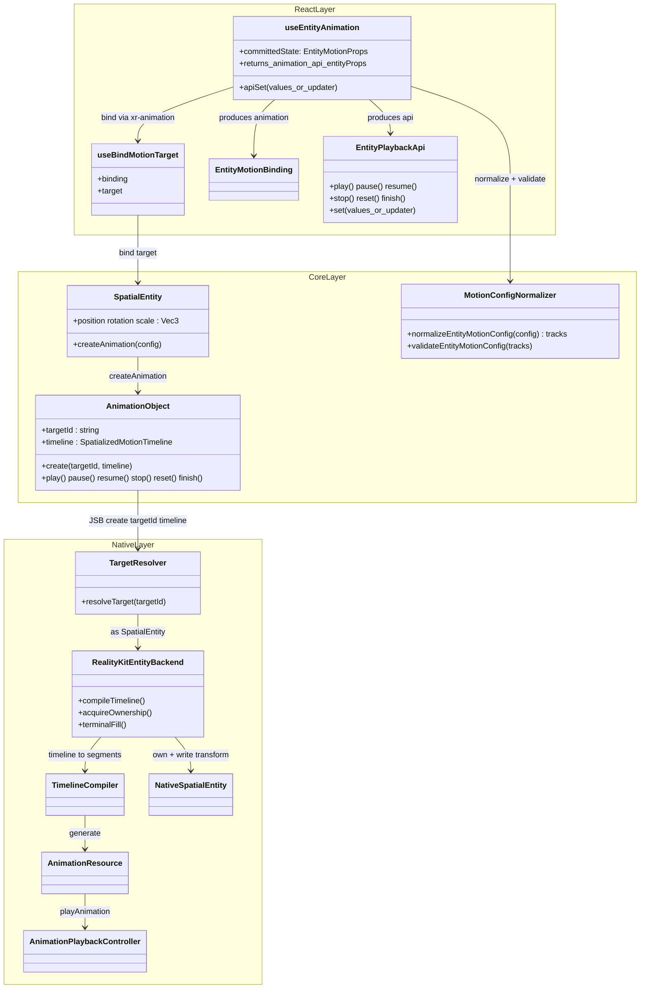
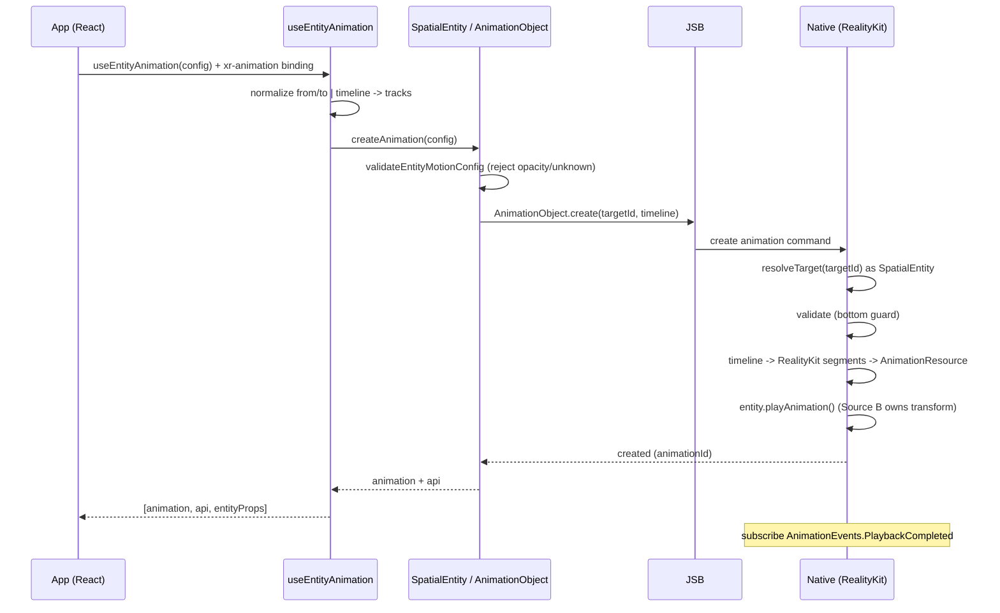
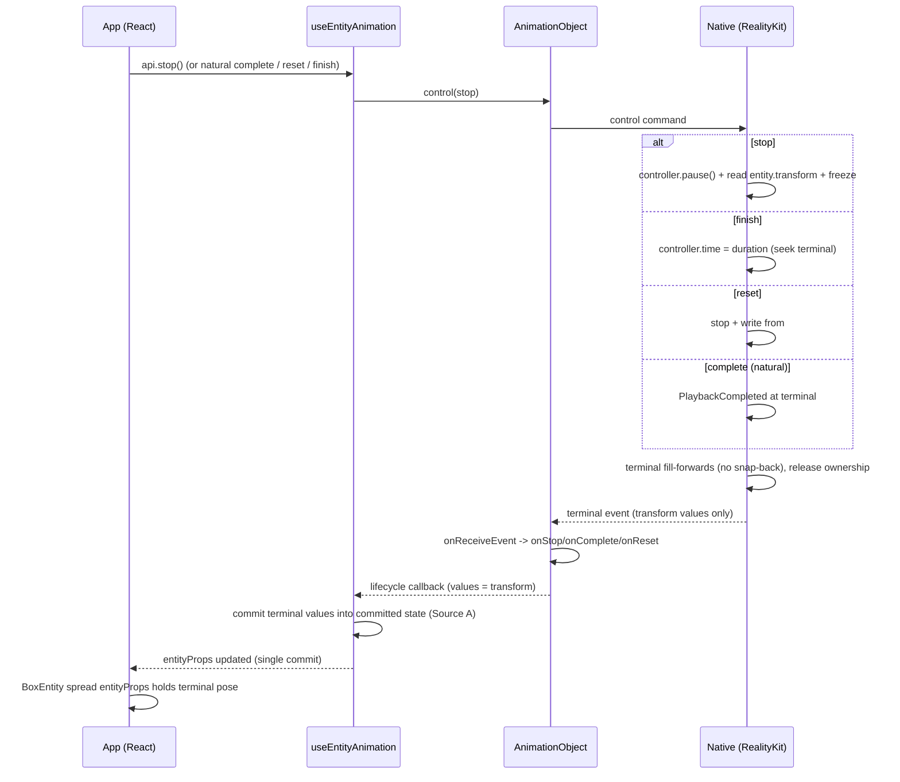

## Context

`proposal.md` is the single source of truth for the public API surface, and `specs/` is the source of truth for normative behavior. This document only describes the **implementation architecture** required to deliver that target state; it does not restate the public API contract or the behavioral requirements.

The redesign turns `useEntityAnimation` into an Entity adapter over the shared `useAnimation` motion family (`useEntityAnimation = useAnimation config + Entity props outlet`). It adds percentage `timeline`, the `entityProps` outlet, `api.set`, and the recommended `xr-animation` binding, while keeping `animation` as a compatible binding. This is a non-breaking enhancement.

**Backend decision (settled):** the native execution backend is **RealityKit**. The existing `useEntityAnimation` already animates entities through RealityKit (`SpatialEntity.animateTransform` builds a `FromToBy`-style transform animation and plays it via the RealityKit playback controller). We continue on that proven path. The additional work is not a new backend — it is (1) adding an internal `tracks` normalization layer on the frontend so percentage `timeline` / `from`-`to` desugar into a uniform track payload, and (2) adapting the Entity path onto the `AnimationObject` create/control contract that the spatialized motion family already uses.

## Goals / Non-Goals

**Goals:**
- Define the three-layer implementation (React / Core / Native) that realizes the proposal's target-state API on a RealityKit backend
- Specify the data flow from authoring config to native transform, and the terminal write-back flow from native to `entityProps`
- Specify the frontend `tracks` normalization layer and the `AnimationObject` adaptation for Entity targets
- Provide class and sequence diagrams that map 1:1 to real module and command names

**Non-Goals:**
- Restating the public API definition that lives in `proposal.md`
- Restating normative behavior that lives in `specs/`
- Designing a CADisplayLink sampler backend (explicitly not chosen; see Backend Rationale)
- A public seek / scrub / progress API (proposal Non-Goal)

## Backend Rationale (RealityKit)

RealityKit is retained because:

1. **It already works for Entity.** The current Entity path is RealityKit-based, so this is continuation, not a rewrite.
2. **It is the natural execution engine for a 3D entity.** Animating an entity's transform is exactly what RealityKit's animation system is for; engine-native playback scales better than an SDK-driven per-frame writer when many entities animate concurrently.
3. **The proposal's playback + reporting requirements are all reachable.** `AnimationPlaybackController` exposes `time` (readable/writable), `duration`, `speed`, `isPlaying`; `entity.transform` is readable at any moment; `AnimationEvents.PlaybackCompleted` provides completion. This is sufficient to implement `stop` (pause + read current transform + freeze), `reset` (stop + write `from`), `finish` (seek `time = duration` or write terminal), and to report terminal values to `onStop` / `onReset` / `entityProps`.

The only genuine incremental cost is the **timeline → RealityKit segment compiler** (percentage normalization, partial-keyframe fill, per-channel segment synthesis). This is contained in the Native layer and does not affect the JS/Core contract.

### Why Plan B (full CADisplayLink sampler) is rejected

Plan B would run the entire Entity path on a CADisplayLink per-frame sampler instead of RealityKit. Beyond the two obvious costs (worse per-frame performance and throwing away the existing RealityKit implementation), it is rejected for reasons that hold **even if performance were equal and code reuse were free**:

**Rendering / timing correctness (the hardest reasons):**
- **Frame desync with RealityKit's render loop.** A CADisplayLink callback fires on the main thread at display refresh, but the transforms it writes are not on the same beat as RealityKit's own render/commit cycle. This risks jitter, tearing, and one-frame lag — the pose computed for a frame is not guaranteed to land on that frame's commit. RealityKit's animation system is inside the render loop and interpolates frame-accurately.
- **visionOS compositor semantics.** On visionOS the app does not own the render loop the way iOS does; the compositor performs reprojection / extrapolation (especially under head motion), per-eye and at variable high refresh. Declarative RealityKit animations are reprojected correctly by the system compositor; discrete poses from a CPU sampler cannot participate in reprojection and are more prone to artifacts under head motion. This is platform-specific and cannot be patched around in a sampler.

**Engine capabilities bypassed:**
- **Detaches from the scene graph / anchoring / physics.** RealityKit transform animations live inside the scene graph, coordinate spaces, anchors, and collision systems; hand-writing raw transforms bypasses these and desyncs from anchoring / physics.
- **Interpolation quality.** Rotation needs quaternion slerp; a per-frame Euler lerp introduces gimbal / interpolation artifacts. RealityKit does correct transform interpolation.

**Semantic consistency & maintenance:**
- **Reimplements a whole playback semantics by hand.** easing / timingFunction, loop, delay, playbackRate, seek(time), mid-flight pause/resume take-over, and completion events are all provided by RealityKit; a sampler must reimplement all of them and keep them bug-for-bug correct.
- **Splits from the rest of the motion family.** The spatialized-element path is already RealityKit-backed. Using a sampler only for Entity means one motion API carries two execution semantics — the same animation config could compute different easing on element vs entity, causing behavior drift and double maintenance cost.
- **Cross-JSB per-frame driving.** If the sampler lives in the JS/SDK layer, driving it every frame across the bridge is expensive and couples animation smoothness to JS-thread health (a JS stall stalls the animation). RealityKit runs natively, decoupled from the JS thread.

A mixed variant (some shapes via RealityKit, some via a sampler) is not considered either: one Entity API must carry exactly one execution semantics.

## Layered Architecture

```
┌───────────────────────────────────────────────────────────────────────┐
│ React layer  (packages/react)                                          │
│   useEntityAnimation(config): [animation, api, entityProps]            │
│     - owns committed transform state (Source A)                       │
│     - api.set (value | updater), sparse merge, no bare api.get        │
│     - commits entityProps at lifecycle points only (not per frame)    │
│   useBindMotionTarget({ binding, target })   <- generalized binder    │
│     - xr-animation (recommended) + animation (compatible)             │
└───────────────┬───────────────────────────────────────────────────────┘
                │ target-agnostic binding
┌───────────────▼───────────────────────────────────────────────────────┐
│ Core layer  (packages/core)                                            │
│   normalizeEntityMotionConfig(config) -> tracks (internal)            │
│     from/to  ─┐                                                        │
│     timeline ─┼─►  uniform track payload (position.* rotation.* scale.*)│
│     tracks   ─┘                                                        │
│   validateEntityMotionConfig()  -> reject opacity / unknown property  │
│   SpatialEntity.createAnimation(config)                               │
│   AnimationObject.create({ targetId, timeline })  <- targetId         │
└───────────────┬───────────────────────────────────────────────────────┘
                │ JSB: create({ targetId, timeline }) / control(type)
┌───────────────▼───────────────────────────────────────────────────────┐
│ Native layer  (RealityKit backend)                                     │
│   resolveTarget(targetId) via spatialObjects -> as? SpatialEntity     │
│   validateEntityMotionConfig() (bottom guard)                         │
│   timeline -> RealityKit transform segments -> AnimationResource      │
│   entity.playAnimation() / AnimationPlaybackController                │
│   transform ownership (whole-transform granularity)                   │
│   terminal fill (forwards) -> emit terminal transform back to Core    │
└───────────────────────────────────────────────────────────────────────┘
```

**Layer responsibilities:**

- **React** owns the *committed transform state* (Source A of the compositor), produces `entityProps`, implements `api.set`, and only commits values into `entityProps` at start / complete / stop / reset / finish and on each `api.set`.
- **Core** desugars the public authoring shapes (`from`/`to`, percentage `timeline`) and the internal `tracks` into one normalized timeline payload, validates that only `position.* / rotation.* / scale.*` appear, and generalizes `AnimationObject` from `elementId` to `targetId`.
- **Native** resolves the target by id, re-validates as a bottom guard, compiles the timeline into RealityKit segments, plays via the RealityKit controller, owns the whole transform while active, and on terminal state fills-forward and emits the terminal transform back up so `entityProps` can mirror it.

## Data Flow

### Authoring -> native transform (play)

```
useEntityAnimation(config)                       // position/rotation/scale, from/to or timeline
  -> normalizeEntityMotionConfig                 // desugar -> internal tracks (position.* ...)
  -> validateEntityMotionConfig                  // reject opacity / unknown
  -> SpatialEntity.createAnimation(config)
  -> AnimationObject.create({ targetId, timeline })
  -> JSB create command { targetId, timeline }
  -> Native resolveTarget(targetId) as? SpatialEntity
  -> timeline -> RealityKit transform segments -> AnimationResource
  -> entity.playAnimation(controller)
  -> RealityKit drives the entity transform (Source B, authoritative while active)
```

### Terminal -> React (write-back)

```
RealityKit terminal (complete / stop / reset / finish)
  -> terminal fill-forwards (no snap-back)
  -> native emits terminal transform event
  -> AnimationObject.onReceiveEvent -> onComplete/onStop/onReset (values = transform only)
  -> useEntityAnimation commits terminal values into committed state (Source A)
  -> entityProps updates (single commit, not per frame)
  -> <BoxEntity {...entityProps} /> re-declares the terminal pose
```

### Compositor (which source wins)

```
animation active (delay / running / paused)   -> Source B (xr-animation / RealityKit) wins
animation inactive (idle / terminal)          -> Source A (props / entityProps / api.set) wins
```

`api.set` always writes Source A; when it becomes visible is decided by the compositor. Ownership granularity is the **whole transform** in v1 (no field-level translate/rotate/scale merge), because a RealityKit entity transform is ultimately a single matrix and partial merge introduces edge-case complexity.

## Key Changes per Layer

### React layer (`packages/react`)
1. `useEntityAnimation` returns the 3-tuple `[animation, api, entityProps]` (today it returns a 2-tuple `[AnimatedProps, AnimationApi]`).
2. `api` surface changes from `play/pause/cancel` to `play/pause/resume/stop/reset/finish` **plus** `set` (state setter, not a playback command).
3. Add committed-state store + `entityProps` outlet; commit only at lifecycle points and on `api.set`.
4. Keep `animation` binding compatible; add `xr-animation` as the recommended binding.
5. Generalize the binder: `useBindSpatializedMotion` (element-only, `spatialized2d/static3d/dynamic3d`) -> `useBindMotionTarget({ binding, target })` so an Entity target can bind through the same lifecycle. Preserve the single-binding invariant (one animation object cannot drive two entities).

### Core layer (`packages/core`)
1. Add `normalizeEntityMotionConfig`: desugar `from`/`to` and percentage `timeline` into the internal `tracks` payload with Entity-style paths (`position.* / rotation.* / scale.*`). `tracks` stays internal / non-public.
2. Add `validateEntityMotionConfig`: allow transform tracks, reject `opacity` and unknown properties (throw or route to `onError`).
3. `SpatialEntity.createAnimation(config)` mirrors the spatialized path.
4. Generalize `AnimationObject`: `AnimationObjectCreateOptions.elementId` -> `targetId`; `CreateSpatializedElementAnimationJSBCommand` payload `elementId` -> `targetId`.
5. Callbacks are notifications only; return values ignored; values carry transform fields only.

### Native layer (RealityKit)
1. Create-animation command decodes `{ targetId, timeline }`; `resolveTarget(targetId)` looks up `spatialObjects` and dispatches by runtime type (`as? SpatialEntity` -> Entity backend, `as? SpatializedElement` -> existing path, else error).
2. Bottom-guard validator (JS/Core validation does not replace it).
3. Timeline compiler: percentage normalization, partial-keyframe fill, per-channel (translate/rotate/scale) segment synthesis -> `AnimationResource`.
4. Playback: `entity.playAnimation()`; pause/resume via controller; `stop` = pause + read `entity.transform` + freeze; `reset` = stop + write `from`; `finish` = `controller.time = duration` (or write terminal); completion via `AnimationEvents.PlaybackCompleted`.
5. Whole-transform ownership / suppression while active; terminal fill-forwards and emit terminal transform back to Core for `entityProps`.

## Class Diagram



## Sequence Diagram — Play (authoring -> native)



## Sequence Diagram — Terminal & write-back (stop / complete / reset / finish)



## Sequence Diagram — api.set take-over (Source A while inactive)

```mermaid
sequenceDiagram
    participant App as App (React)
    participant Hook as useEntityAnimation
    participant Entity as BoxEntity

    Note over Hook: animation inactive (idle / terminal) -> Source A wins
    App->>Hook: api.set(position y=0.3)
    Hook->>Hook: sparse merge into committed state (rotation/scale unchanged)
    Hook-->>App: entityProps updated (single commit)
    App->>Entity: spread entityProps
    Note over App,Hook: read current via entityProps or api.set(prev=>...); no bare api.get
    App->>Hook: api.set(prev => position y = prev.y + 0.1)
    Hook->>Hook: atomic read-modify-write on committed state
```

## Risks / Trade-offs

- **Timeline compiler is the main new cost.** Percentage normalization, partial-keyframe fill, and per-channel segment synthesis live in the Native RealityKit backend. Risk is contained to Native and does not touch the JS/Core contract.
- **No native timeline query for segment index / arbitrary sample.** RealityKit exposes `controller.time` and `entity.transform`, which are enough for the proposal (no public seek/progress). If a future public seek/progress API is added, the backend must track logical playback state or fall back to a sampler.
- **Whole-transform ownership** means concurrent React writes to non-animated channels are also suppressed while active. Accepted for v1; field-level merge deferred.
- **Concurrency at scale.** Engine-native playback scales better than a per-frame SDK writer, but a large number of simultaneous Entity animations should still be profiled.

## Decisions

- `proposal.md` remains the source of truth for the public API; `specs/` for behavior; this document for implementation architecture only.
- Backend is RealityKit (continuation of the existing Entity path, i.e. Plan A); Plan B (moving the whole path to a CADisplayLink sampler) is rejected.
- Frontend adds an internal `tracks` normalization layer; `AnimationObject` generalizes `elementId` -> `targetId`; the binder generalizes to `useBindMotionTarget`.
