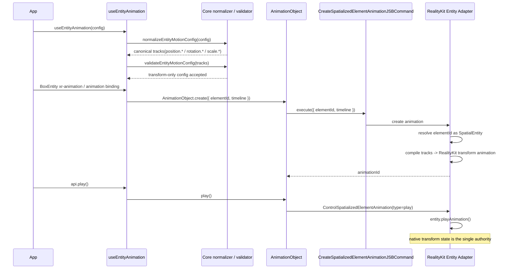
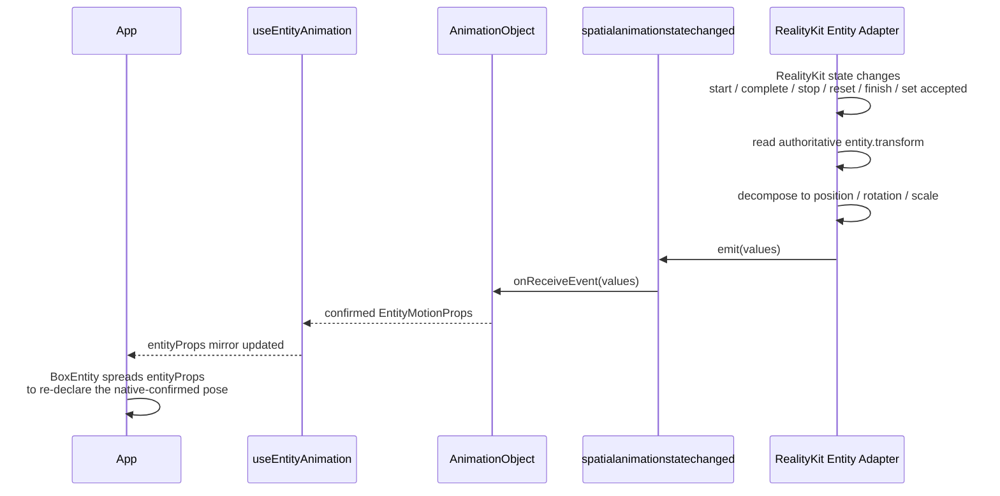
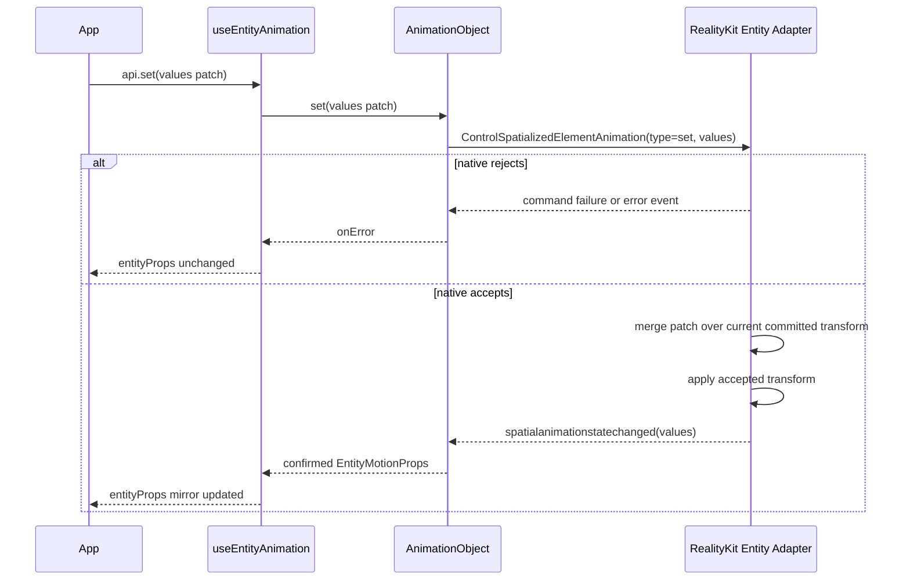
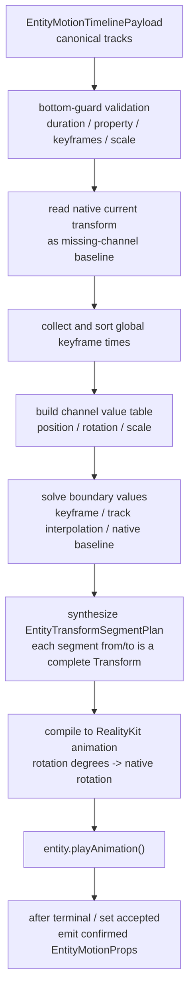
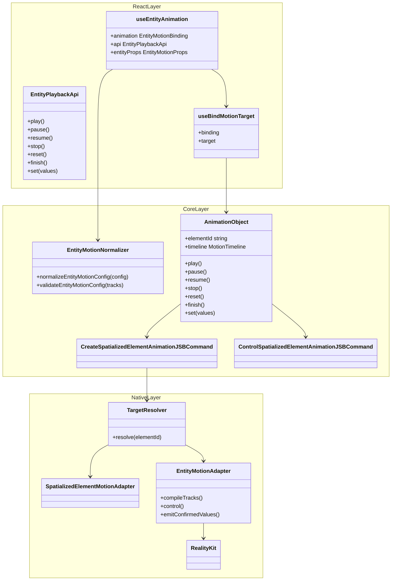

## Context

`proposal.md` is the single source of truth for the public API surface, and `specs/` is the source of truth for normative behavior. This document only describes the **implementation architecture** required to deliver that target state; it does not restate the public API contract or the behavioral requirements.

The redesign turns `useEntityAnimation` into an Entity adapter over the shared `useAnimation` motion family (`useEntityAnimation = useAnimation config + Entity props outlet`). It adds percentage `timeline`, the `entityProps` outlet, `api.set`, and the recommended `xr-animation` binding, while keeping `animation` as a compatible binding. This is a non-breaking enhancement.

## Design Principles

### Native is the only authoritative data source

For Entity motion, native RealityKit backend state is the only authoritative source of transform truth. React does not maintain a separate committed cache, pending state, or second transform source that can compete with native.

`entityProps` is a React mirror outlet for transform state that native has confirmed:

```text
React config / api.set
  -> native Entity motion backend (single authority)
  -> confirmed transform state
  -> entityProps mirror outlet
```

This means:

- Playback, terminal commands, reset, finish, and `api.set` all enter native before they can change transform state.
- If native rejects a command, the write is ineffective and `entityProps` does not update.
- If native accepts a command, it emits the confirmed transform through the existing animation state event, and React updates `entityProps` from that event.
- React mirrors native-confirmed state for users; it does not predict terminal values or queue replay writes made while animation is active.

### Reuse the `useAnimation` architecture

`useEntityAnimation` should reuse the `useAnimation` binding / target resolution / `AnimationObject` lifecycle / create-control-event chain as much as possible. Entity-specific behavior is limited to an adapter:

- authoring: `position` / `rotation` / `scale`
- validation: transform-only, reject `opacity`
- outlet: `entityProps`, not CSS `style`
- target adapter: `SpatialEntity`
- native execution: RealityKit Entity backend

## Goals / Non-Goals

**Goals:**
- Define the React / Core / Native architecture that realizes the proposal's target-state API on a RealityKit backend
- Specify the data flow from config -> canonical tracks -> native transform
- Specify the write-back flow from native confirmed transform -> `entityProps` mirror
- Specify reuse of the existing `CreateSpatializedElementAnimationJSBCommand` / `ControlSpatializedElementAnimationJSBCommand`, with no parallel Entity JSB commands
- Specify how `AnimationObject` generalizes from element-only to target adapters

**Non-Goals:**
- Restating the public API definition that lives in `proposal.md`
- Restating normative behavior that lives in `specs/`
- Designing a CADisplayLink sampler backend (explicitly not chosen; see Backend Rationale)
- A public seek / scrub / progress API (proposal Non-Goal)
- Adding `CreateEntityAnimationJSBCommand` / `ControlEntityAnimationJSBCommand`

## Backend Rationale (RealityKit)

Backend decision: native execution uses **RealityKit**.

RealityKit is retained because:

1. **It already works for Entity.** The current `useEntityAnimation` path already animates entities through RealityKit, so this is continuation, not a rewrite.
2. **It is the natural execution engine for a 3D entity.** Animating entity transform is exactly what RealityKit's animation system is for; engine-native playback scales better than an SDK-driven per-frame writer when many entities animate concurrently.
3. **The proposal's playback + reporting requirements are reachable.** RealityKit controllers can control playback state, `entity.transform` can be read in native, and `AnimationEvents.PlaybackCompleted` provides completion. This is sufficient to implement `stop`, `reset`, `finish`, and report native-confirmed transform values to callbacks and `entityProps`.

The main incremental cost is the **canonical tracks -> RealityKit Entity timeline compiler**. It compiles JS/Core-normalized Entity tracks into RealityKit-executable transform animation.

### Why Plan B (full CADisplayLink sampler) is rejected

Plan B would run the entire Entity path on a CADisplayLink per-frame sampler instead of RealityKit. Beyond worse per-frame performance and throwing away the existing RealityKit implementation, it is rejected for reasons that hold even if performance were equal:

- **Frame desync with RealityKit's render loop.** CADisplayLink transform writes are not on the same beat as RealityKit's own render / commit loop, risking jitter, tearing, or one-frame lag.
- **visionOS compositor semantics.** RealityKit animations can participate in system composition and reprojection; discrete poses from a CPU sampler cannot provide the same semantics.
- **Detaches from the scene graph / anchoring / physics.** RealityKit transform animations live inside scene graph, coordinate space, anchor, and collision systems.
- **Interpolation quality.** Rotation needs quaternion slerp; per-frame Euler lerp introduces interpolation artifacts.
- **Reimplements playback semantics.** easing, loop, delay, playbackRate, pause/resume, and completion events would all need to be rebuilt.
- **Splits from the motion family.** The spatialized-element path already uses native-backed animation objects; sampling only Entity would give one motion API two execution semantics.

A mixed variant (some shapes via RealityKit, some via sampler) is also rejected: one Entity API must carry exactly one execution semantics.

## Layered Architecture

```text
┌───────────────────────────────────────────────────────────────────────┐
│ React layer (packages/react)                                           │
│   useEntityAnimation(config): [animation, api, entityProps]            │
│     - creates EntityMotionBinding / playback api                      │
│     - exposes entityProps (mirror of native confirmed transform)       │
│     - api.set(values patch) sends to native, no local cache write      │
│   useBindMotionTarget({ binding, target })                            │
│     - xr-animation (recommended) + animation (compatible)              │
└───────────────┬───────────────────────────────────────────────────────┘
                │ target-agnostic binding
┌───────────────▼───────────────────────────────────────────────────────┐
│ Core layer (packages/core)                                             │
│   normalizeEntityMotionConfig(config) -> canonical tracks             │
│     from/to  ─┐                                                        │
│     timeline ─┼─► tracks(position.* rotation.* scale.*)                │
│     tracks   ─┘ internal only                                          │
│   validateEntityMotionConfig() -> reject opacity / unknown property   │
│   AnimationObject.create({ elementId, timeline })                     │
│   ControlSpatializedElementAnimation({ animationId, type, values? })  │
└───────────────┬───────────────────────────────────────────────────────┘
                │ JSB: reuse existing create/control/event protocol
┌───────────────▼───────────────────────────────────────────────────────┐
│ Native layer (RealityKit backend)                                      │
│   resolveSpatialObject(elementId) via spatialObjects                  │
│     - SpatializedElement -> existing element adapter                   │
│     - SpatialEntity -> new Entity adapter                             │
│   validate canonical tracks (bottom guard)                            │
│   tracks -> RealityKit transform animation                            │
│   native transform state is the single authority                       │
│   spatialanimationstatechanged -> confirmed values                    │
└───────────────────────────────────────────────────────────────────────┘
```

**Layer responsibilities:**

- **React** owns hook API, binding lifecycle, `entityProps` mirroring, callback dispatch, and rerender. React does not maintain a separate transform cache.
- **Core** normalizes public authoring shapes (`from`/`to`, percentage `timeline`) and internal `tracks` into canonical Entity tracks. `AnimationObject` keeps the existing `elementId` wire field, whose target-state meaning is the spatial object id.
- **Native** owns target resolution, bottom-guard validation, RealityKit compilation and execution, command accept/reject decisions, final transform decomposition, and event emission.

## JSB Protocol

The target state reuses existing JSB command types, with no parallel Entity JSB:

- `CreateSpatializedElementAnimationJSBCommand`
- `ControlSpatializedElementAnimationJSBCommand`
- `spatialanimationstatechanged` event

The old `AnimateTransformJSBCommand` is an internal implementation protocol, not a public compatibility promise. The target state may stop using it or delete it without public breaking change.

### CreateSpatializedElementAnimation

The command name and `elementId` field are retained for compatibility. In the target state, `elementId` is a historical wire name whose meaning is the spatial object id; it may identify either a `SpatializedElement` or a `SpatialEntity`.

```text
CreateSpatializedElementAnimation {
  elementId: string
  timeline: EntityMotionTimeline | SpatializedMotionTimeline
}
```

Native looks up `spatialObjects` by `elementId`, then dispatches by runtime type:

```text
spatial object is SpatializedElement -> existing spatialized element adapter
spatial object is SpatialEntity      -> Entity motion adapter
otherwise                           -> failure
```

If `elementId` is not found in the `spatialObjects` registry, create MUST fail explicitly instead of silently queueing. If the resolved spatial object is neither `SpatializedElement` nor `SpatialEntity`, create MUST fail as an unsupported animation target. `ControlSpatializedElementAnimation` does not carry `elementId` again; it addresses an already-created animation object by `animationId`. If the target spatial object is destroyed, associated animations MUST be destroyed or invalidated, and later control commands MUST fail through command failure / error event instead of silently becoming no-ops.

### ControlSpatializedElementAnimation

Control continues to use the existing command type and adds `set`:

```text
ControlSpatializedElementAnimation {
  animationId: string
  type: 'play' | 'pause' | 'resume' | 'stop' | 'reset' | 'finish' | 'destroy' | 'set'
  values?: EntityMotionProps
}
```

`api.set` does not add a JSB command. It only accepts an `EntityMotionProps` patch object and does not support the `(prev) => next` updater form. It sends `type: 'set'` to native:

- native rejects: command failure or error event, `entityProps` does not update.
- native accepts: native merges the patch over the current committed `entity.transform`, applies the transform, then emits confirmed values through `spatialanimationstatechanged`; React updates `entityProps`.

### spatialanimationstatechanged

The event channel is reused:

```text
detail: {
  animationId: string
  action: 'start' | 'complete' | 'stop' | 'reset' | 'finish' | 'set' | 'failed' | ...
  playState: 'idle' | 'queued' | 'running' | 'paused' | 'finished'
  finished: boolean
  values?: SpatializedVisualValues | EntityMotionProps
  error?: SpatializedPlaybackError
}
```

`values` is target-specific:

- spatialized target: `SpatializedVisualValues`
- Entity target: `EntityMotionProps` (`position` / `rotation` / `scale`)

## Data Flow

### Authoring config -> native transform (play)



### native confirmed transform -> React mirror



### api.set



`api.set` is not a playback command: it does not seek, start, or change playback progress. It also does not write local pending state; native is the only layer that decides whether the write takes effect. Native does not stash set patches during active animation, and set before binding or before native object creation is invalid; those failures are exposed through the existing command failure / error event path and do not update `entityProps`.

## Entity Tracks and RealityKit Compilation

The Native Entity adapter only accepts the canonical Entity timeline payload normalized by JS/Core. This payload is an internal shape, not public hook config. Native does not parse percentage keys and does not desugar `from` / `to`; those are JS/Core normalizer responsibilities.

### Input

The input is a timeline payload whose target has already resolved to Entity:

```text
type EntityMotionTimelinePayload = {
  duration: number
  delay?: number
  playbackRate?: number
  loop?: boolean | { reverse?: boolean }
  tracks: EntityMotionTrack[]
}

type EntityMotionTrack = {
  property: EntityMotionProperty
  keyframes: EntityMotionKeyframe[]
  timingFunction?: TimingFunction
}

type EntityMotionProperty =
  | 'position.x' | 'position.y' | 'position.z'
  | 'rotation.x' | 'rotation.y' | 'rotation.z'
  | 'scale.x'    | 'scale.y'    | 'scale.z'

type EntityMotionKeyframe = {
  at: number
  value: number
  timingFunction?: TimingFunction
}
```

Example input:

```text
{
  duration: 1.2,
  tracks: [
    {
      property: 'position.y',
      keyframes: [
        { at: 0, value: 0 },
        { at: 0.6, value: 0.25 },
        { at: 1.2, value: 0 },
      ],
    },
    {
      property: 'rotation.y',
      keyframes: [
        { at: 0, value: 0 },
        { at: 1.2, value: 180 },
      ],
    },
  ],
}
```

### Output

The output is not React state. It is a native executable plan plus confirmed values after execution:

```text
EntityMotionTimelinePayload
  -> EntityTransformSegmentPlan
  -> RealityKit AnimationResource / playback controller
  -> spatialanimationstatechanged(values)
```

`EntityTransformSegmentPlan` is an internal Native adapter execution plan, not a public JS/Core type:

```text
type EntityTransformSegmentPlan = {
  duration: number
  delay: number
  playbackRate: number
  loop?: boolean | { reverse?: boolean }
  segments: EntityTransformSegment[]
}

type EntityTransformSegment = {
  fromTime: number
  toTime: number
  from: CompleteEntityTransform
  to: CompleteEntityTransform
  timingFunction: TimingFunction
}

type CompleteEntityTransform = {
  position: Vec3
  rotationDegrees: Vec3
  scale: Vec3
}
```

### Compilation Flow



### Compilation Rules

1. **Property whitelist:** Accept only `position.*`, `rotation.*`, and `scale.*`. `opacity`, `transform.translate.*`, material properties, and component properties MUST fail explicitly.
2. **Time range:** `duration` MUST be positive. Each keyframe `at` MUST be within `[0, duration]`.
3. **Ordering and duplicates:** Keyframes in each track MUST be sorted by non-decreasing `at`. Duplicate tracks for the same property are not allowed.
4. **Global timeline:** Native collects keyframe times across all tracks and sorts them into segment boundaries. For example, `0, 0.6, 1.2` produces `[0, 0.6]` and `[0.6, 1.2]`.
5. **Boundary value solving:** If a property has no explicit keyframe at a segment boundary, the Native adapter MUST evaluate that property's own track at that time. If the time is between two keyframes, use that track's timing function to compute the boundary value. If the time is before the property's first keyframe, use the corresponding channel from the current native transform. If the time is after the last keyframe, use the last keyframe value.
6. **Complete Transform:** Each segment `from` and `to` MUST be a complete position / rotation / scale transform. Partial channels must not be passed directly to RealityKit.
7. **Rotation:** `rotation.*` inputs use Entity API Euler degrees. Native converts them to the rotation representation required by RealityKit during compilation, avoiding per-frame Euler interpolation.
8. **Scale:** `scale.*` MUST be non-negative. Invalid scale fails immediately.
9. **Timing function:** keyframe-level `timingFunction` takes precedence over track-level, which takes precedence over the timeline default. If different properties in the same time span require different timing functions, the Native adapter MUST choose a RealityKit-expressible per-channel compilation strategy; if it cannot express the shape, it MUST fail explicitly rather than degrading into wrong semantics.
10. **Loop / playbackRate / delay:** These playback parameters remain on the segment plan and are executed by the RealityKit playback/controller layer.
11. **Terminal fill:** `complete` / `finish` stop at terminal, `reset` stops at start, and `stop` freezes at the current native transform. These confirmed values are emitted back to React through events.
12. **Explicit failure:** If RealityKit cannot express a segment plan, the Native adapter MUST fail through command failure or error event. It must not silently ignore the limitation.

### Example: Sparse Tracks to Segment Plan

Input tracks:

```text
position.y: (0 -> 0), (0.6 -> 0.25), (1.2 -> 0)
rotation.y: (0 -> 0), (1.2 -> 180)
```

Assume the native current transform is:

```text
position: { x: 0, y: 0, z: 0.8 }
rotation: { x: 0, y: 0, z: 0 }
scale:    { x: 1, y: 1, z: 1 }
```

Compiled result:

```text
segments:
  [0, 0.6]
    from: position { x: 0, y: 0,    z: 0.8 }, rotation { x: 0, y: 0,   z: 0 }, scale { x: 1, y: 1, z: 1 }
    to:   position { x: 0, y: 0.25, z: 0.8 }, rotation { x: 0, y: 90,  z: 0 }, scale { x: 1, y: 1, z: 1 }
  [0.6, 1.2]
    from: position { x: 0, y: 0.25, z: 0.8 }, rotation { x: 0, y: 90,  z: 0 }, scale { x: 1, y: 1, z: 1 }
    to:   position { x: 0, y: 0,    z: 0.8 }, rotation { x: 0, y: 180, z: 0 }, scale { x: 1, y: 1, z: 1 }
```

Here `rotation.y` only has keyframes at `0` and `1.2`; the value at the `0.6` boundary is computed by the Native adapter using that track's timing function during compilation. It is only used to generate the complete boundary Transform for the segment; per-frame interpolation inside each segment remains RealityKit's responsibility.

## Transform Decomposition and Values

Native values sent back to React must use the Entity API shape:

```text
type EntityMotionProps = {
  position?: Vec3
  rotation?: Vec3
  scale?: Vec3
}
```

Decomposition rules:

- `position` comes from native transform translation.
- `scale` comes from native transform scale.
- `rotation` uses Euler degrees, consistent with Entity props / config.
- callback values, `entityProps`, and `api.set(values)` patches all use this same shape.

## Capability

Target-state docs and demos use the top-level capability:

```text
supports('useAnimation')
```

`supports('useAnimation', ['entity'])` is removed from the documented contract; only the top-level `supports('useAnimation')` key is used, and no `entity` sub-token is reserved.

## Key Changes per Layer

### React layer (`packages/react`)

1. `useEntityAnimation` returns `[animation, api, entityProps]`.
2. `api` exposes `play/pause/resume/stop/reset/finish` and `set`.
3. `entityProps` reflects native-confirmed values only.
4. `api.set` sends `ControlSpatializedElementAnimation(type: 'set')`; it does not write a local cache.
5. Entity components support `xr-animation` binding and keep compatible `animation` binding.
6. The binder generalizes to `useBindMotionTarget({ binding, target })` while preserving the single-binding single-target invariant.

### Core layer (`packages/core`)

1. Add Entity motion types, property whitelist, normalizer, and validator.
2. Keep `AnimationObjectCreateOptions.elementId` as the wire field and document it as a historical name for spatial object id.
3. `CreateSpatializedElementAnimationJSBCommand` payload continues to use `elementId` and resolves it through the spatial object registry.
4. `ControlSpatializedElementAnimationJSBCommand` supports `set` and optional `values`.
5. `AnimationObject` values widen from spatialized-only to target-specific values.

### Native layer (RealityKit)

1. `onCreateSpatializedElementAnimation` looks up the spatial object by `elementId` and dispatches to spatialized / Entity adapter by runtime type.
2. Entity adapter compiles canonical Entity tracks to RealityKit transform animation.
3. `onControlSpatializedElementAnimation` supports Entity animation object `play/pause/resume/stop/reset/finish/destroy/set`.
4. Every accepted start / terminal / set operation emits confirmed Entity values.
5. Delete or stop using the old `AnimateTransform` Entity-specific path.

## Class Diagram



## Risks / Trade-offs

- **Historical naming confusion.** Reusing `CreateSpatializedElementAnimation` / `ControlSpatializedElementAnimation` keeps "element" in the command names. Documentation must make clear that target-state semantics generalize them into the motion animation object protocol.
- **Timeline compiler is the main new cost.** Multi-keyframes, sparse keyframes, rotation conversion, and segment synthesis are concentrated in the native Entity adapter.
- **Whole-transform ownership.** Entity transform is ultimately a native Transform; v1 does not implement field-level ownership composition.
- **No updater form.** Because native is the single authority, `api.set(prev => next)` would imply React `setState` semantics, but `prev` cannot be promised as a real-time native transform. v1 only supports patch objects; reads of the current confirmed state go through `entityProps`.
- **Large concurrent animations still need profiling.** RealityKit native playback is better than JS per-frame writes, but scale should still be measured.

## Decisions

- Native RealityKit backend is the only authoritative data source for Entity motion.
- `entityProps` is a React mirror outlet for native-confirmed transform, not a local source of truth.
- Reuse `CreateSpatializedElementAnimationJSBCommand` / `ControlSpatializedElementAnimationJSBCommand` and the existing event channel; do not add parallel Entity JSB.
- JS/Core normalizes `from`/`to` and `timeline` into canonical Entity tracks; Native executes canonical payload and performs bottom-guard validation.
- The old `AnimateTransformJSBCommand` is an internal implementation protocol and may be replaced or removed.
