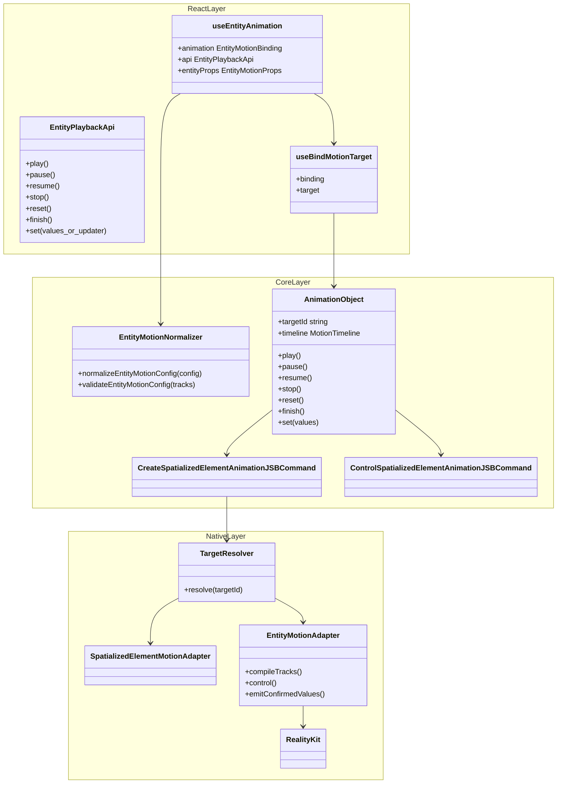
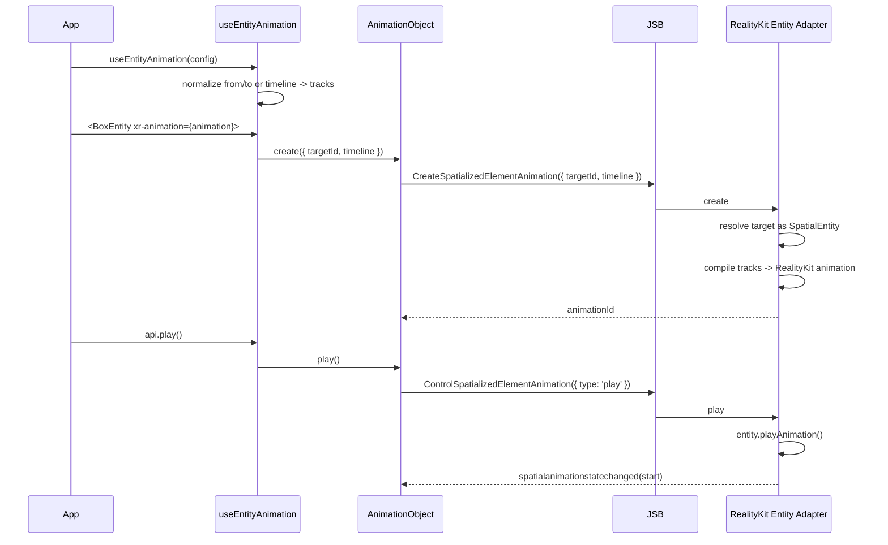
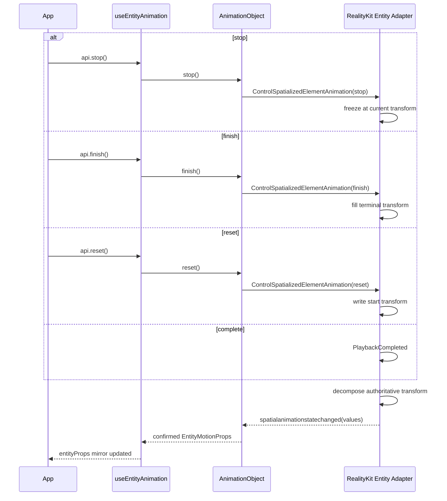
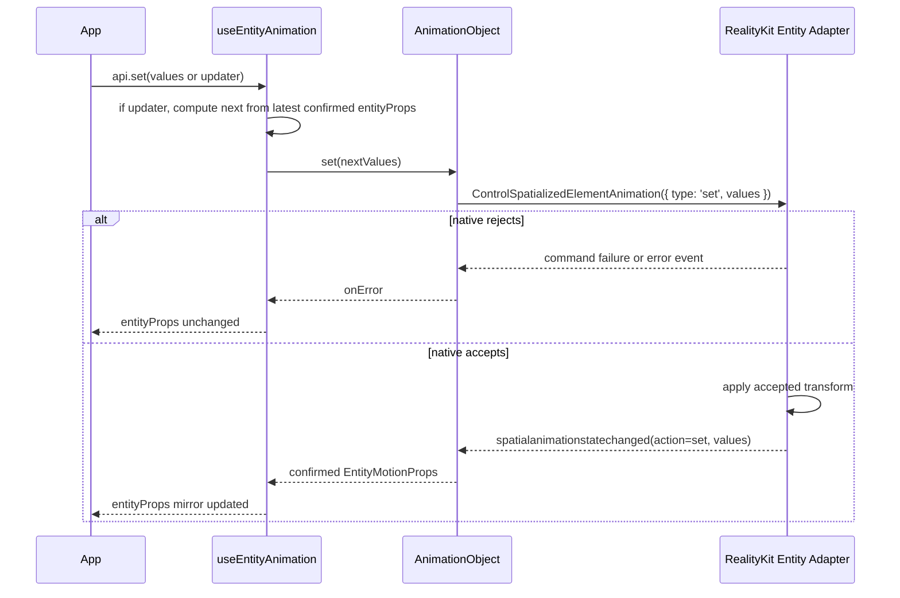

## Context

`proposal.md` is the single source of truth for the public API surface, and `specs/` is the source of truth for normative behavior. This document only describes the **implementation architecture** required to deliver that target state; it does not restate the public API contract or the behavioral requirements.

The redesign turns `useEntityAnimation` into an Entity adapter over the shared `useAnimation` motion family (`useEntityAnimation = useAnimation config + Entity props outlet`). It adds percentage `timeline`, the `entityProps` outlet, `api.set`, and the recommended `xr-animation` binding, while keeping `animation` as a compatible binding. This is a non-breaking enhancement.

## Design Principles

### Native is the only authoritative data source

For Entity motion, native RealityKit backend state is the only authoritative source of transform truth. React does not maintain a separate committed cache, pending state, or second transform source that can compete with native.

`entityProps` is a React mirror outlet for transform state that native has confirmed:

```text
React config / props / api.set
  -> native Entity motion backend (single authority)
  -> confirmed transform state
  -> entityProps mirror outlet
```

This means:

- Playback, terminal commands, reset, finish, and `api.set` all enter native before they can change transform state.
- If native rejects a command, the write is ineffective and `entityProps` does not update.
- If native accepts a command, it emits the confirmed transform through the existing animation state event, and React updates `entityProps` from that event.
- React mirrors native-confirmed state for users; it does not predict terminal values or queue replay writes made while animation is active.

### Reuse the `useAnimation` architecture

`useEntityAnimation` should reuse the `useAnimation` binding / target resolution / `AnimationObject` lifecycle / create-control-event chain as much as possible. Entity-specific behavior is limited to an adapter:

- authoring: `position` / `rotation` / `scale`
- validation: transform-only, reject `opacity`
- outlet: `entityProps`, not CSS `style`
- target adapter: `SpatialEntity`
- native execution: RealityKit Entity backend

## Goals / Non-Goals

**Goals:**
- Define the React / Core / Native architecture that realizes the proposal's target-state API on a RealityKit backend
- Specify the data flow from config -> canonical tracks -> native transform
- Specify the write-back flow from native confirmed transform -> `entityProps` mirror
- Specify reuse of the existing `CreateSpatializedElementAnimationJSBCommand` / `ControlSpatializedElementAnimationJSBCommand`, with no parallel Entity JSB commands
- Specify how `AnimationObject` generalizes from element-only to target adapters

**Non-Goals:**
- Restating the public API definition that lives in `proposal.md`
- Restating normative behavior that lives in `specs/`
- Designing a CADisplayLink sampler backend (explicitly not chosen; see Backend Rationale)
- A public seek / scrub / progress API (proposal Non-Goal)
- Adding `CreateEntityAnimationJSBCommand` / `ControlEntityAnimationJSBCommand`

## Backend Rationale (RealityKit)

Backend decision: native execution uses **RealityKit**.

RealityKit is retained because:

1. **It already works for Entity.** The current `useEntityAnimation` path already animates entities through RealityKit, so this is continuation, not a rewrite.
2. **It is the natural execution engine for a 3D entity.** Animating entity transform is exactly what RealityKit's animation system is for; engine-native playback scales better than an SDK-driven per-frame writer when many entities animate concurrently.
3. **The proposal's playback + reporting requirements are reachable.** RealityKit controllers can control playback state, `entity.transform` can be read in native, and `AnimationEvents.PlaybackCompleted` provides completion. This is sufficient to implement `stop`, `reset`, `finish`, and report native-confirmed transform values to callbacks and `entityProps`.

The main incremental cost is the **canonical tracks -> RealityKit Entity timeline compiler**. It compiles JS/Core-normalized Entity tracks into RealityKit-executable transform animation.

### Why Plan B (full CADisplayLink sampler) is rejected

Plan B would run the entire Entity path on a CADisplayLink per-frame sampler instead of RealityKit. Beyond worse per-frame performance and throwing away the existing RealityKit implementation, it is rejected for reasons that hold even if performance were equal:

- **Frame desync with RealityKit's render loop.** CADisplayLink transform writes are not on the same beat as RealityKit's own render / commit loop, risking jitter, tearing, or one-frame lag.
- **visionOS compositor semantics.** RealityKit animations can participate in system composition and reprojection; discrete poses from a CPU sampler cannot provide the same semantics.
- **Detaches from the scene graph / anchoring / physics.** RealityKit transform animations live inside scene graph, coordinate space, anchor, and collision systems.
- **Interpolation quality.** Rotation needs quaternion slerp; per-frame Euler lerp introduces interpolation artifacts.
- **Reimplements playback semantics.** easing, loop, delay, playbackRate, pause/resume, and completion events would all need to be rebuilt.
- **Splits from the motion family.** The spatialized-element path already uses native-backed animation objects; sampling only Entity would give one motion API two execution semantics.

A mixed variant (some shapes via RealityKit, some via sampler) is also rejected: one Entity API must carry exactly one execution semantics.

## Layered Architecture

```text
┌───────────────────────────────────────────────────────────────────────┐
│ React layer (packages/react)                                           │
│   useEntityAnimation(config): [animation, api, entityProps]            │
│     - creates EntityMotionBinding / playback api                      │
│     - exposes entityProps (mirror of native confirmed transform)       │
│     - api.set(value | updater) sends to native, no local cache write   │
│   useBindMotionTarget({ binding, target })                            │
│     - xr-animation (recommended) + animation (compatible)              │
└───────────────┬───────────────────────────────────────────────────────┘
                │ target-agnostic binding
┌───────────────▼───────────────────────────────────────────────────────┐
│ Core layer (packages/core)                                             │
│   normalizeEntityMotionConfig(config) -> canonical tracks             │
│     from/to  ─┐                                                        │
│     timeline ─┼─► tracks(position.* rotation.* scale.*)                │
│     tracks   ─┘ internal only                                          │
│   validateEntityMotionConfig() -> reject opacity / unknown property   │
│   AnimationObject.create({ targetId, timeline })                      │
│   ControlSpatializedElementAnimation({ animationId, type, values? })  │
└───────────────┬───────────────────────────────────────────────────────┘
                │ JSB: reuse existing create/control/event protocol
┌───────────────▼───────────────────────────────────────────────────────┐
│ Native layer (RealityKit backend)                                      │
│   resolveTarget(targetId) via spatialObjects                          │
│     - SpatializedElement -> existing element adapter                   │
│     - SpatialEntity -> new Entity adapter                             │
│   validate canonical tracks (bottom guard)                            │
│   tracks -> RealityKit transform animation                            │
│   native transform state is the single authority                       │
│   spatialanimationstatechanged -> confirmed values                    │
└───────────────────────────────────────────────────────────────────────┘
```

**Layer responsibilities:**

- **React** owns hook API, binding lifecycle, `entityProps` mirroring, callback dispatch, and rerender. React does not maintain a separate transform cache.
- **Core** normalizes public authoring shapes (`from`/`to`, percentage `timeline`) and internal `tracks` into canonical Entity tracks, and generalizes `AnimationObject` from `elementId` to `targetId`.
- **Native** owns target resolution, bottom-guard validation, RealityKit compilation and execution, command accept/reject decisions, final transform decomposition, and event emission.

## JSB Protocol

The target state reuses existing JSB command types, with no parallel Entity JSB:

- `CreateSpatializedElementAnimationJSBCommand`
- `ControlSpatializedElementAnimationJSBCommand`
- `spatialanimationstatechanged` event

The old `AnimateTransformJSBCommand` is an internal implementation protocol, not a public compatibility promise. The target state may stop using it or delete it without public breaking change.

### CreateSpatializedElementAnimation

The command name is retained, but its meaning generalizes from element-only to motion target creation:

```text
CreateSpatializedElementAnimation {
  targetId: string
  timeline: EntityMotionTimeline | SpatializedMotionTimeline
}
```

Implementation may temporarily read the old `elementId` field for compatibility, but the design semantics use `targetId`. Native looks up `spatialObjects` by `targetId`, then dispatches by runtime type:

```text
target is SpatializedElement -> existing spatialized element adapter
target is SpatialEntity      -> Entity motion adapter
otherwise                    -> failure
```

### ControlSpatializedElementAnimation

Control continues to use the existing command type and adds `set`:

```text
ControlSpatializedElementAnimation {
  animationId: string
  type: 'play' | 'pause' | 'resume' | 'stop' | 'reset' | 'finish' | 'destroy' | 'set'
  values?: EntityMotionProps
}
```

`api.set` does not add a JSB command. It sends `type: 'set'` to native:

- native rejects: command failure or error event, `entityProps` does not update.
- native accepts: native applies / composes the transform, then emits confirmed values through `spatialanimationstatechanged`; React updates `entityProps`.

### spatialanimationstatechanged

The event channel is reused:

```text
detail: {
  animationId: string
  action: 'start' | 'complete' | 'stop' | 'reset' | 'finish' | 'set' | 'failed' | ...
  playState: 'idle' | 'queued' | 'running' | 'paused' | 'finished'
  finished: boolean
  values?: SpatializedVisualValues | EntityMotionProps
  error?: SpatializedPlaybackError
}
```

`values` is target-specific:

- spatialized target: `SpatializedVisualValues`
- Entity target: `EntityMotionProps` (`position` / `rotation` / `scale`)

## Data Flow

### Authoring config -> native transform (play)

```text
useEntityAnimation(config)
  -> normalizeEntityMotionConfig(config)        // from/to or timeline -> canonical tracks
  -> validateEntityMotionConfig(tracks)         // transform-only, reject opacity
  -> EntityMotionBinding binds to Entity via xr-animation / animation
  -> AnimationObject.create({ targetId, timeline })
  -> CreateSpatializedElementAnimationJSBCommand({ targetId, timeline })
  -> Native resolveTarget(targetId) as SpatialEntity
  -> Entity adapter compiles tracks -> RealityKit transform animation
  -> entity.playAnimation()
  -> native becomes the single transform authority
```

### native confirmed transform -> React mirror

```text
RealityKit state changes (start / complete / stop / reset / finish / set accepted)
  -> native reads authoritative entity.transform
  -> transform decomposes to { position, rotation, scale }
  -> spatialanimationstatechanged(values)
  -> AnimationObject.onReceiveEvent
  -> useEntityAnimation updates entityProps mirror
  -> <BoxEntity {...entityProps} /> re-declares the native-confirmed pose
```

### api.set

```text
api.set(values or updater)
  -> if updater, React computes next values from latest native-confirmed entityProps
  -> ControlSpatializedElementAnimationJSBCommand({ type: 'set', values })
  -> native accepts or rejects
  -> accepted command emits confirmed values from native
  -> React updates entityProps mirror
```

`api.set` is not a playback command: it does not seek, start, or change playback progress. It also does not write local pending state; native is the only layer that decides whether the write takes effect.

## Entity Tracks and RealityKit Compilation

JS/Core outputs canonical Entity tracks:

```text
position.x | position.y | position.z
rotation.x | rotation.y | rotation.z
scale.x    | scale.y    | scale.z
```

The Native Entity adapter accepts canonical tracks only; it does not parse percentage keys. Native responsibilities:

1. Validate the property whitelist, duration, keyframe ordering, non-negative scale, and other bottom constraints.
2. Fill sparse keyframes: missing channels use the current native transform or previous known value, so every segment can synthesize a complete Transform.
3. Accept rotation as Euler degrees to match the Entity API, then convert to the RealityKit rotation representation during compilation, avoiding per-frame Euler lerp.
4. Synthesize each time span into a RealityKit transform animation segment. Multi-keyframe timelines are represented as ordered segments; each segment has a complete Transform start and end.
5. Apply terminal fill-forward: complete / finish stops at terminal, reset stops at start, stop freezes at current native transform.

If RealityKit cannot support a specific multi-segment shape, the limitation must fail explicitly through command failure / error event. It must not be silently ignored.

## Transform Decomposition and Values

Native values sent back to React must use the Entity API shape:

```text
type EntityMotionProps = {
  position?: Vec3
  rotation?: Vec3
  scale?: Vec3
}
```

Decomposition rules:

- `position` comes from native transform translation.
- `scale` comes from native transform scale.
- `rotation` uses Euler degrees, consistent with Entity props / config.
- callback values, `entityProps`, and `api.set` updater `prev` all use this same shape.

## Capability

Target-state docs and demos use the top-level capability:

```text
supports('useAnimation')
```

`supports('useAnimation', ['entity'])` may only be mentioned in migration or compatibility context; it is not the recommended target-state contract.

## Key Changes per Layer

### React layer (`packages/react`)

1. `useEntityAnimation` returns `[animation, api, entityProps]`.
2. `api` exposes `play/pause/resume/stop/reset/finish` and `set`.
3. `entityProps` reflects native-confirmed values only.
4. `api.set` sends `ControlSpatializedElementAnimation(type: 'set')`; it does not write a local cache.
5. Entity components support `xr-animation` binding and keep compatible `animation` binding.
6. The binder generalizes to `useBindMotionTarget({ binding, target })` while preserving the single-binding single-target invariant.

### Core layer (`packages/core`)

1. Add Entity motion types, property whitelist, normalizer, and validator.
2. Generalize `AnimationObjectCreateOptions.elementId` to `targetId`.
3. `CreateSpatializedElementAnimationJSBCommand` payload uses `targetId` semantics.
4. `ControlSpatializedElementAnimationJSBCommand` supports `set` and optional `values`.
5. `AnimationObject` values widen from spatialized-only to target-specific values.

### Native layer (RealityKit)

1. `onCreateSpatializedElementAnimation` looks up target by `targetId` and dispatches to spatialized / Entity adapter.
2. Entity adapter compiles canonical Entity tracks to RealityKit transform animation.
3. `onControlSpatializedElementAnimation` supports Entity animation object `play/pause/resume/stop/reset/finish/destroy/set`.
4. Every accepted terminal / set operation emits confirmed Entity values.
5. Delete or stop using the old `AnimateTransform` Entity-specific path.

## Class Diagram



## Sequence Diagrams

### Play



### Terminal write-back



### api.set



## Risks / Trade-offs

- **Historical naming confusion.** Reusing `CreateSpatializedElementAnimation` / `ControlSpatializedElementAnimation` keeps "element" in the command names. Documentation must make clear that target-state semantics generalize them into the motion animation object protocol.
- **Timeline compiler is the main new cost.** Multi-keyframes, sparse keyframes, rotation conversion, and segment synthesis are concentrated in the native Entity adapter.
- **Whole-transform ownership.** Entity transform is ultimately a native Transform; v1 does not implement field-level ownership composition.
- **Updater uses the latest confirmed mirror.** Because native is the single authority, `api.set(prev => next)` can only use the latest native-confirmed `entityProps`, not a real-time native sample.
- **Large concurrent animations still need profiling.** RealityKit native playback is better than JS per-frame writes, but scale should still be measured.

## Decisions

- Native RealityKit backend is the only authoritative data source for Entity motion.
- `entityProps` is a React mirror outlet for native-confirmed transform, not a local source of truth.
- Reuse `CreateSpatializedElementAnimationJSBCommand` / `ControlSpatializedElementAnimationJSBCommand` and the existing event channel; do not add parallel Entity JSB.
- JS/Core normalizes `from`/`to` and `timeline` into canonical Entity tracks; Native executes canonical payload and performs bottom-guard validation.
- The old `AnimateTransformJSBCommand` is an internal implementation protocol and may be replaced or removed.
