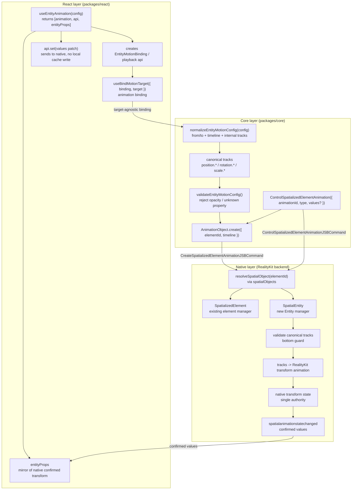
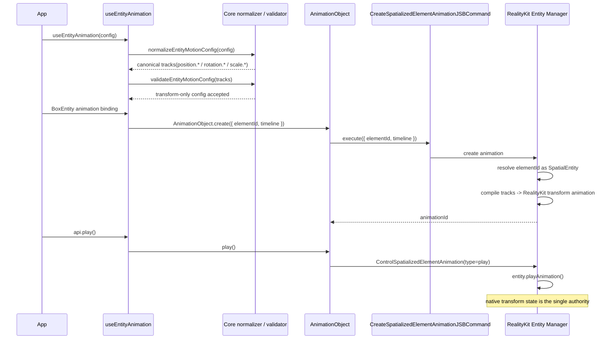
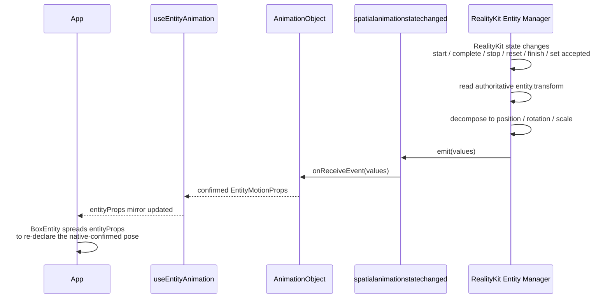
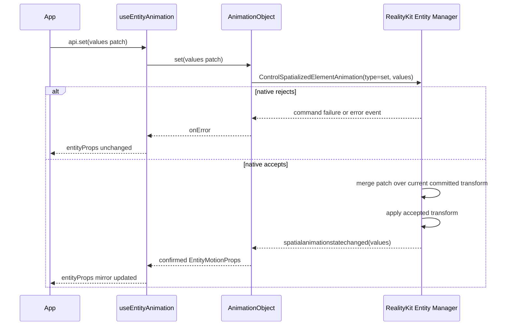
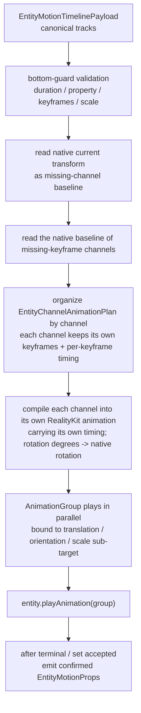
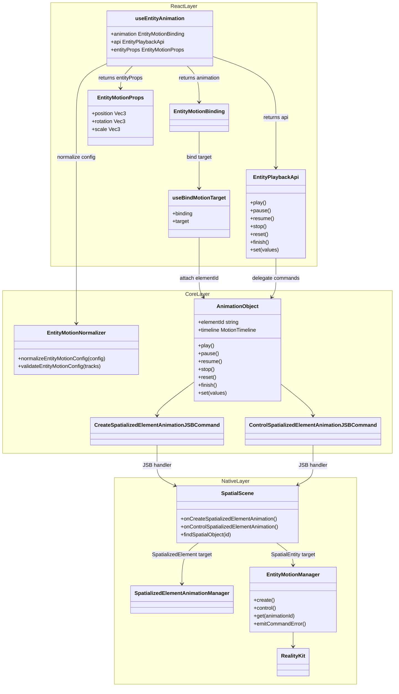
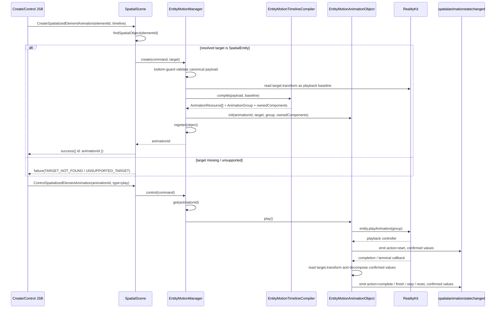
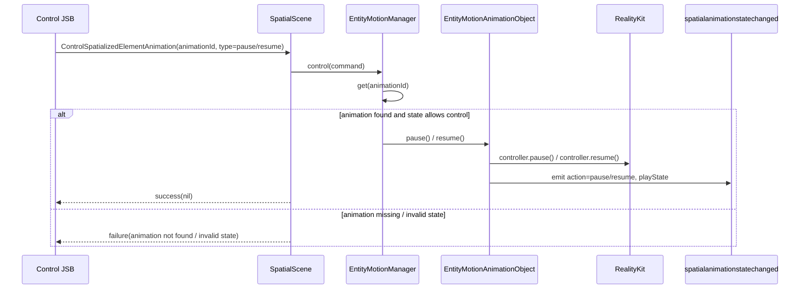
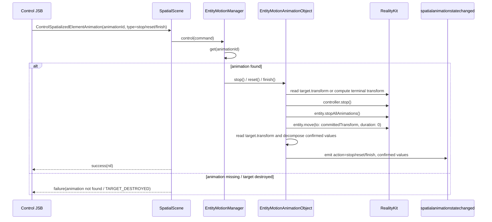
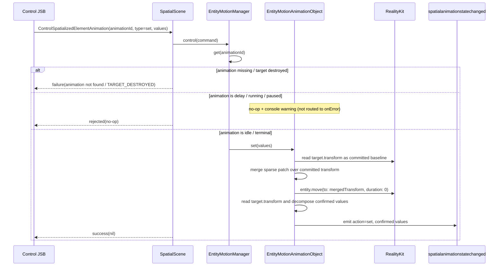

## Context

`proposal.md` is the single source of truth for the public API surface, and `specs/` is the source of truth for normative behavior. This document only describes the **implementation architecture** required to deliver that target state; it does not restate the public API contract or the behavioral requirements.

The redesign turns `useEntityAnimation` into the Entity-specific surface over the shared `useAnimation` motion family (`useEntityAnimation = useAnimation config + Entity props outlet`). It adds percentage `timeline`, the `entityProps` outlet, `api.set`, and the `animation` binding. This is a non-breaking enhancement.

## Design Principles

### Native is the only authoritative data source

For Entity motion, native RealityKit backend state is the only authoritative source of transform truth. React does not maintain a separate committed cache, pending state, or second transform source that can compete with native.

`entityProps` is a React mirror outlet for transform state that native has confirmed:

```text
React config / api.set
  -> native Entity motion backend (single authority)
  -> confirmed transform state
  -> entityProps mirror outlet
```

This means:

- Playback, terminal commands, reset, finish, and `api.set` all enter native before they can change transform state.
- If native rejects a command, the write is ineffective and `entityProps` does not update.
- If native accepts a command, it emits the confirmed transform through the existing animation state event, and React updates `entityProps` from that event.
- React mirrors native-confirmed state for users; it does not predict terminal values or queue replay writes made while animation is active.
- Before the first confirmed state, `entityProps` may be empty; after confirmation it mirrors the transform components owned by the animation system (the animated components plus components written via `api.set`), limited to `position` / `rotation` / `scale`; components that are not owned do not enter `entityProps`.

### Reuse the `useAnimation` architecture

`useEntityAnimation` should reuse the `useAnimation` binding / target resolution / `AnimationObject` lifecycle / create-control-event chain as much as possible. Entity-specific behavior is limited to the Entity-specific surface and native manager boundary:

- authoring: `position` / `rotation` / `scale`
- validation: transform-only, reject `opacity`
- outlet: `entityProps`, not CSS `style`
- target type: `SpatialEntity`
- native execution: RealityKit Entity backend

## Goals / Non-Goals

**Goals:**
- Define the React / Core / Native architecture that realizes the proposal's target-state API on a RealityKit backend
- Specify the data flow from config -> canonical tracks -> native transform
- Specify the write-back flow from native confirmed transform -> `entityProps` mirror
- Specify reuse of the existing `CreateSpatializedElementAnimationJSBCommand` / `ControlSpatializedElementAnimationJSBCommand`, with no parallel Entity JSB commands
- Specify how `AnimationObject` generalizes from element-only to target-aware motion objects

**Non-Goals:**
- Restating the public API definition that lives in `proposal.md`
- Restating normative behavior that lives in `specs/`
- Designing a CADisplayLink sampler backend (explicitly not chosen; see Backend Rationale)
- A public seek / scrub / progress API (proposal Non-Goal)
- Adding `CreateEntityAnimationJSBCommand` / `ControlEntityAnimationJSBCommand`

## Backend Rationale (RealityKit)

Backend decision: native execution uses **RealityKit**.

RealityKit is retained because:

1. **It already works for Entity.** The current `useEntityAnimation` path already animates entities through RealityKit, so this is continuation, not a rewrite.
2. **It is the natural execution engine for a 3D entity.** Animating entity transform is exactly what RealityKit's animation system is for; engine-native playback scales better than an SDK-driven per-frame writer when many entities animate concurrently.
3. **The proposal's playback + reporting requirements are reachable.** RealityKit controllers can control playback state, `entity.transform` can be read in native, and `AnimationEvents.PlaybackCompleted` provides completion. This is sufficient to implement `stop`, `reset`, `finish`, and report native-confirmed transform values to callbacks and `entityProps`.

The main incremental cost is the **canonical tracks -> RealityKit Entity timeline compiler**. It compiles JS/Core-normalized Entity tracks into RealityKit-executable transform animation.

### Why Plan B (full CADisplayLink sampler) is rejected

Plan B would run the entire Entity path on a CADisplayLink per-frame sampler instead of RealityKit. Beyond worse per-frame performance and throwing away the existing RealityKit implementation, it is rejected for reasons that hold even if performance were equal:

- **Frame desync with RealityKit's render loop.** CADisplayLink transform writes are not on the same beat as RealityKit's own render / commit loop, risking jitter, tearing, or one-frame lag.
- **visionOS compositor semantics.** RealityKit animations can participate in system composition and reprojection; discrete poses from a CPU sampler cannot provide the same semantics.
- **Detaches from the scene graph / anchoring / physics.** RealityKit transform animations live inside scene graph, coordinate space, anchor, and collision systems.
- **Interpolation quality.** Rotation needs quaternion slerp; per-frame Euler lerp introduces interpolation artifacts.
- **Reimplements playback semantics.** easing, loop, delay, playbackRate, pause/resume, and completion events would all need to be rebuilt.
- **Splits from the motion family.** The spatialized-element path already uses native-backed animation objects; sampling only Entity would give one motion API two execution semantics.

A mixed variant (some shapes via RealityKit, some via sampler) is also rejected: one Entity API must carry exactly one execution semantics.

## Layered Architecture



**Layer responsibilities:**

- **React** owns hook API, binding lifecycle, `entityProps` mirroring, callback dispatch, and rerender. React does not maintain a separate transform cache.
- **Core** normalizes public authoring shapes (`from`/`to`, percentage `timeline`) and internal `tracks` into canonical Entity tracks. `AnimationObject` keeps the existing `elementId` wire field, whose target-state meaning is the spatial object id.
- **Native** owns target resolution, bottom-guard validation, RealityKit compilation and execution, command accept/reject decisions, final transform decomposition, and event emission.

## JSB Protocol

The target state reuses existing JSB command types, with no parallel Entity JSB:

- `CreateSpatializedElementAnimationJSBCommand`
- `ControlSpatializedElementAnimationJSBCommand`
- `spatialanimationstatechanged` event

The old `AnimateTransformJSBCommand` is an internal implementation protocol, not a public compatibility promise. The target state deletes it; because it is not a public API, this is not a breaking change.

### CreateSpatializedElementAnimation

The command name and `elementId` field are retained for compatibility. In the target state, `elementId` is a historical wire name whose meaning is the spatial object id; it may identify either a `SpatializedElement` or a `SpatialEntity`.

```text
CreateSpatializedElementAnimation {
  elementId: string
  timeline: EntityMotionTimeline | SpatializedMotionTimeline
}
```

Native looks up `spatialObjects` by `elementId`, then dispatches by runtime type:

```text
spatial object is SpatializedElement -> existing spatialized element manager
spatial object is SpatialEntity      -> EntityMotionManager
otherwise                           -> failure
```

If `elementId` is not found in the `spatialObjects` registry, create MUST fail explicitly instead of silently queueing. If the resolved spatial object is neither `SpatializedElement` nor `SpatialEntity`, create MUST fail as an unsupported animation target. `ControlSpatializedElementAnimation` does not carry `elementId` again; it addresses an already-created animation object by `animationId`. If the target spatial object is destroyed, associated animations MUST be destroyed or invalidated, and later control commands MUST fail through command failure / error event instead of silently becoming no-ops.

### ControlSpatializedElementAnimation

Control continues to use the existing command type and adds `set`:

```text
ControlSpatializedElementAnimation {
  animationId: string
  type: 'play' | 'pause' | 'resume' | 'stop' | 'reset' | 'finish' | 'destroy' | 'set'
  values?: EntityMotionPatch
}
```

`api.set` does not add a JSB command. It only accepts an `EntityMotionPatch` object (the write-side patch type, same shape as the read-side `EntityMotionProps`) and does not support the `(prev) => next` updater form. It sends `type: 'set'` to native:

- native rejects: command failure or error event, `entityProps` does not update.
- native accepts: native merges the patch over the current committed `entity.transform`, applies the transform, then emits confirmed values through `spatialanimationstatechanged`; React updates `entityProps`.

### spatialanimationstatechanged

The event channel is reused:

```text
detail: {
  animationId: string
  action: 'start' | 'complete' | 'stop' | 'reset' | 'finish' | 'set' | 'failed' | ...
  playState: 'idle' | 'queued' | 'running' | 'paused' | 'finished'
  finished: boolean
  values?: SpatializedVisualValues | EntityMotionProps
  error?: SpatializedPlaybackError
}
```

`values` is target-specific:

- spatialized target: `SpatializedVisualValues`
- Entity target: `EntityMotionProps` (`position` / `rotation` / `scale`)

### Determining the `values` shape and discarding stale events

Consumers MUST NOT rely on a new event field to decide whether `values` is `SpatializedVisualValues` or `EntityMotionProps`. The event carries `animationId`; the receiver reverse-looks-up the local animation object created for that `animationId` and uses that object's known target type to interpret `values`. If `animationId` matches no live local animation object (unknown or stale, e.g. after `destroy`), the event MUST be discarded without dispatch and MUST NOT update `entityProps`.

### `SpatializedPlaybackError`

`error` is present when `action` is `'failed'`. `SpatializedPlaybackError.code` is a closed classification set shared by both targets:

```text
type SpatializedPlaybackError = {
  code:
    | 'TARGET_NOT_FOUND'           // elementId not in the spatial object registry
    | 'UNSUPPORTED_TARGET'         // resolved object is neither SpatializedElement nor SpatialEntity
    | 'TARGET_DESTROYED'           // the spatial object was destroyed; the animation is invalid
  message?: string
}
```

All of these reach the user through the `onError` callback. Rejected `api.set` writes (during an active animation, or before binding / native object creation) are the exception: they are no-ops that emit a console warning and are NOT routed to `onError`. The `code` MUST be distinguishable so application code can branch on the failure kind rather than parsing `message`.

## Data Flow

### Authoring config -> native transform (play)



### native confirmed transform -> React mirror



### api.set



`api.set` is not a playback command: it does not seek, start, or change playback progress. It also does not write local pending state; native is the only layer that decides whether the write takes effect. Native does not stash set patches during active animation, and set before binding or before native object creation is invalid; those failures are exposed through the existing command failure / error event path and do not update `entityProps`. `create` / bind does not emit an extra initial confirmed value, so `entityProps` may be empty until the first lifecycle commit (a play terminal or an accepted set) and is not promised readable at mount.

## Entity Tracks and RealityKit Compilation

The Native Entity motion manager only accepts the canonical Entity timeline payload normalized by JS/Core. This payload is an internal shape, not public hook config. Native does not parse percentage keys and does not desugar `from` / `to`; those are JS/Core normalizer responsibilities.

### Input

The input is a timeline payload whose target has already resolved to Entity:

```text
type EntityMotionTimelinePayload = {
  duration: number
  delay?: number
  playbackRate?: number
  loop?: boolean | { reverse?: boolean }
  tracks: EntityMotionTrack[]
}

type EntityMotionTrack = {
  property: EntityMotionProperty
  keyframes: EntityMotionKeyframe[]
  timingFunction?: TimingFunction
}

type EntityMotionProperty =
  | 'position.x' | 'position.y' | 'position.z'
  | 'rotation.x' | 'rotation.y' | 'rotation.z'
  | 'scale.x'    | 'scale.y'    | 'scale.z'

type EntityMotionKeyframe = {
  at: number
  value: number
  timingFunction?: TimingFunction
}
```

Example input:

```text
{
  duration: 1.2,
  tracks: [
    {
      property: 'position.y',
      keyframes: [
        { at: 0, value: 0 },
        { at: 0.6, value: 0.25 },
        { at: 1.2, value: 0 },
      ],
    },
    {
      property: 'rotation.y',
      keyframes: [
        { at: 0, value: 0 },
        { at: 1.2, value: 180 },
      ],
    },
  ],
}
```

### Output

The output is not React state. It is a native executable plan plus confirmed values after execution:

```text
EntityMotionTimelinePayload
  -> EntityChannelAnimationPlan (per-channel)
  -> RealityKit AnimationResource[] + AnimationGroup
  -> spatialanimationstatechanged(values)
```

`EntityChannelAnimationPlan` is an internal Native manager / compiler execution plan, not a public JS/Core type. It is organized by **transform channel**: each channel carries its own keyframes and per-keyframe timing function, rather than merging all channels into segments that share a single boundary:

```text
type EntityChannelAnimationPlan = {
  duration: number
  delay: number
  playbackRate: number
  loop?: boolean | { reverse?: boolean }
  channels: EntityChannelPlan[]
}

type EntityChannelPlan = {
  channel: EntityMotionProperty   // position.x / rotation.y / scale.z ...
  baseline: number                // the native value of this channel at playback start, used when a keyframe is missing
  keyframes: EntityChannelKeyframe[]
}

type EntityChannelKeyframe = {
  at: number
  value: number
  timingFunction: TimingFunction  // the timing used from this keyframe to the next
}
```

**Why per-channel instead of per-segment:**

If all channels are merged into shared time segments, each segment can carry only one `timingFunction`. But within the same time span, different channels may require different timing functions (for example `position.y` uses `easeOut` while `rotation.y` uses `linear`); a single slot cannot express two curves at once — once merged into segments, the per-channel timing information is already lost before it reaches RealityKit. The per-frame per-track sampling CADisplayLink element path does not have this problem, because each track independently takes its own timing.

Therefore the per-channel structure is preserved: each channel is compiled into its own RealityKit animation (carrying its own timing function), then played in parallel through an `AnimationGroup` bound to the corresponding sub-target (translation / orientation / scale). This way per-channel timing is never lost along the whole path, consistent with the element-path semantics.

### Compilation Flow



### Compilation Rules

1. **Property whitelist:** Accept only `position.*`, `rotation.*`, and `scale.*`. `opacity`, `transform.translate.*`, material properties, and component properties MUST fail explicitly.
2. **Time range:** `duration` MUST be positive. Each keyframe `at` MUST be within `[0, duration]`.
3. **Ordering and duplicates:** Keyframes in each track MUST be sorted by non-decreasing `at`. Duplicate tracks for the same property are not allowed.
4. **Timeline and keyframe intervals:** Each channel forms intervals from its own keyframe times and does not share global segment boundaries with other channels. For example, a channel's `0, 0.6, 1.2` only affects that channel's own `[0, 0.6]` and `[0.6, 1.2]` intervals.
5. **Missing-keyframe baseline and non-animated components:** Each channel is compiled independently. If a channel has no explicit keyframe at time `0`, use that channel's native current transform value at playback start as the baseline; if it is later than the channel's last keyframe, hold the last keyframe value. Channels do not share boundaries and do not interpolate against each other. **Component granularity distinguishes two kinds of absence:** (a) *non-animated scalars within an animated component* — e.g. animating only `position.y` freezes `position.x` / `position.z` to baseline because the RealityKit translation sub-target is bound as a whole; (b) *entirely absent components* — e.g. if the config has no `scale.*`, no animation is generated for the scale sub-target, scale is not owned by the animation, and it is driven by React props during the animation.
6. **Per-channel parallelism:** Each channel is compiled into its own RealityKit animation, played in parallel through an `AnimationGroup` and bound to the corresponding sub-target (translation / orientation / scale). Native does not merge multiple channels into a segment that shares timing, so that per-channel timing functions are not lost.
7. **Rotation:** `rotation.*` inputs use Entity API Euler degrees. Native converts them to the rotation representation required by RealityKit during compilation, avoiding per-frame Euler interpolation. Because RealityKit interpolates orientation as a shortest-path quaternion slerp, a rotation channel whose keyframe delta is ≥180° or spans multiple axes may follow a path that differs from per-axis Euler intuition; author intermediate keyframes when a specific multi-turn or multi-axis path is required.
8. **Scale:** `scale.*` MUST be non-negative. Invalid scale fails immediately.
9. **Timing function (per-channel):** keyframe-level `timingFunction` takes precedence over track-level, which takes precedence over the timeline default. The resolved per-keyframe timing stays on each channel's keyframes and is carried by that channel's own RealityKit animation, not merged with other channels. Therefore different channels using different timing functions within the same time span is natively supported; segment merging is no longer needed, and there is no case that cannot be expressed and has to degrade. RealityKit built-in timing (linear / easeIn / easeOut / easeInOut) maps directly; a custom cubic-bezier with no matching built-in curve bakes that channel into a `SampledAnimation`.
10. **Loop / playbackRate / delay:** These playback parameters remain at the top level of `EntityChannelAnimationPlan`, apply uniformly to the whole `AnimationGroup`, and are executed by the RealityKit playback/controller layer. A looping animation has no natural `complete` terminal, so `entityProps` is NOT updated at each loop boundary; it is only committed on `stop` / `finish` / native-accepted `api.set`.
11. **Terminal fill:** `complete` / `finish` stop at terminal, `reset` stops at start, and `stop` freezes at the current native transform. These confirmed values are emitted back to React through events.
12. **Explicit failure:** If RealityKit cannot express a channel plan (for example a timing that cannot be baked), the Native manager MUST fail through command failure or error event. It must not silently ignore the limitation.

### Example: Sparse Tracks to Per-Channel Plan

Input tracks:

```text
position.y: (0 -> 0), (0.6 -> 0.25), (1.2 -> 0)   timing: easeOut
rotation.y: (0 -> 0), (1.2 -> 180)                timing: linear
```

Assume the native current transform is:

```text
position: { x: 0, y: 0, z: 0.8 }
rotation: { x: 0, y: 0, z: 0 }
scale:    { x: 1, y: 1, z: 1 }
```

Compiled result (each channel is independent and shares no boundaries):

```text
channels:
  position.y  baseline 0
    keyframes: (0, 0, easeOut) (0.6, 0.25, easeOut) (1.2, 0, easeOut)
    -> RealityKit animation(easeOut), bound to translation.y
  rotation.y  baseline 0
    keyframes: (0, 0, linear) (1.2, 180, linear)
    -> RealityKit animation(linear), bound to orientation (about y)

Undeclared scalars within the same component (position.x/z, rotation.x/z)
are bound with their sub-target and frozen to the native baseline at playback start.
Entirely absent components (scale.*) generate no animation, are not owned by
the animation, and are driven by React props during the animation.
```

Compared to the old segment approach: `position.y`'s `easeOut` and `rotation.y`'s `linear` are no longer squeezed into one segment sharing a single `timingFunction`, and `rotation.y` no longer needs an artificial intermediate boundary value at `0.6` — it plays with just its own `(0, 1.2)` two keyframes + `linear`. This is the key difference of per-channel compilation over segment merging.

## Transform Decomposition and Values

Native values sent back to React must use the Entity API shape:

```text
type EntityMotionProps = {
  position?: Vec3
  rotation?: Vec3
  scale?: Vec3
}
```

Decomposition rules:

- `position` comes from native transform translation.
- `scale` comes from native transform scale.
- `rotation` uses Euler degrees, consistent with Entity props / config.
- callback values and `entityProps` use this `EntityMotionProps` shape; `api.set(values)` takes the same-shaped `EntityMotionPatch`, named distinctly to separate the write side from the read side.

## Capability

Target-state docs and demos use the top-level capability:

```text
supports('useEntityAnimation')
```

`supports('useEntityAnimation', ['entity'])` is removed from the documented contract; only the top-level `supports('useEntityAnimation')` key is used, and no `entity` sub-token is reserved.

## Key Changes per Layer

### React layer (`packages/react`)

- **Reuse / mostly reuse:** Keep `useEntityAnimation` as the public Entity motion hook name, keep the existing Entity `animation` compatible binding entry, and reuse the Entity props hierarchy for `position` / `rotation` / `scale`.
- **Generalize / replace:** Change `useEntityAnimation` from the old `[AnimatedProps, AnimationApi]` shape to `[animation, api, entityProps]`; `api` exposes `play/pause/resume/stop/reset/finish` and `set`; `api.set` sends `ControlSpatializedElementAnimation(type: 'set')` and does not write a local cache. The legacy entity-transform-animation leftovers are deleted, including the JS-side suppression mechanism (`animation.__getSuppressedFields` and the suppression-release base-props re-sync path). The final transform is composed only through Source A (static/base props + `entityProps`) and Source B (`animation`) per-component arbitration; after a terminal state, `entityProps` overrides stale base props (fill-forwards, no snap-back). Deleting this path is what makes the old snap-back conflict structurally impossible.
- **Add:** Add `EntityMotionBinding`, `EntityPlaybackApi.set(values)`, and the `EntityMotionProps` mirror outlet. Entity components support the `animation` binding; the binder adds or generalizes to `useBindMotionTarget({ binding, target })` while preserving the single-binding single-target invariant.

### Core layer (`packages/core`)

- **Reuse / mostly reuse:** Reuse the `AnimationObject` lifecycle model, the `CreateSpatializedElementAnimationJSBCommand` / `ControlSpatializedElementAnimationJSBCommand` command classes, and the `spatialanimationstatechanged` event channel.
- **Generalize / replace:** Widen `AnimationObject` from spatialized-only to target-specific timeline / values; keep `AnimationObjectCreateOptions.elementId` as the wire field and document it as the historical name for spatial object id; `CreateSpatializedElementAnimationJSBCommand` payload continues to use `elementId` and resolves it through the spatial object registry; `ControlSpatializedElementAnimationJSBCommand` supports `set` and optional `values`.
- **Add:** Add Entity motion types, `EntityMotionPatch`, property whitelist, `normalizeEntityMotionConfig`, `validateEntityMotionConfig`, and the canonical `EntityMotionTimelinePayload` / tracks shape. Public authoring still exposes only `from` / `to` and percentage `timeline`; `tracks` remains an internal execution shape.

### Native layer (RealityKit)

- **Reuse / mostly reuse:** Reuse the `spatialObjects` registry, the existing spatialized element motion manager path, the RealityKit execution environment, and the existing create / control / event cross-boundary protocol.
- **Generalize / replace:** `onCreateSpatializedElementAnimation` looks up the spatial object by `elementId` and changes from accepting only `SpatializedElement` to dispatching by runtime type to the spatialized element manager or Entity motion manager; `onControlSpatializedElementAnimation` supports Entity animation object `play/pause/resume/stop/reset/finish/destroy/set`; every accepted start / terminal / set operation emits confirmed Entity values. Delete the old `AnimateTransform` Entity-specific path outright (not merely stop using it), including the legacy entity-transform-animation leftovers on the JS side: the suppression mechanism `animation.__getSuppressedFields` and the suppression-release base-props re-sync path. Do not leave a second native execution path.
- **Add:** Add the Entity native motion subsystem. `EntityMotionManager` is the native entry for SpatialEntity create / control and owns bottom-guard validation for canonical Entity tracks, timeline compilation orchestration, the animation registry, Entity control / set routing, lifecycle, and target invalidation; native confirmed transform decomposition and `spatialanimationstatechanged` emission are split across the manager / object / bridge helpers by responsibility. `MotionTargetAdapter` remains only a conceptual boundary; v1 does not require a new Entity forwarding layer.

## Class Diagram



This is a conceptual class diagram: it groups React hooks, the Core `AnimationObject`, and Native handlers / managers for readability, not as one uniform class layer. Native target resolution is not a new `TargetResolver` class; it is the lookup performed by the existing `SpatialScene.onCreateSpatializedElementAnimation` / `onControlSpatializedElementAnimation` handlers through `findSpatialObject` / the `spatialObjects` registry, followed by runtime target-type dispatch to the existing `SpatializedElementAnimationManager` or the new `EntityMotionManager`. `MotionTargetAdapter` remains only a conceptual boundary: if real duplication appears between the element and Entity paths later, the implementation can extract a Swift protocol or adapter then; v1 does not add a new Entity forwarding layer. The main Entity native motion state and orchestration live in `EntityMotionManager` and its object / compiler / bridge / timing / values helpers.

### RealityKit Entity Motion Subsystem

The Entity native motion subsystem should be split for readability and testability, not to mirror the element path's file count. The following boundaries are recommended design responsibilities; implementation may merge manager-internal helpers and only split them when complexity or reuse makes the split pay for itself.


**Recommended responsibilities:**

- `EntityMotionManager`: Native entry for SpatialEntity motion. It receives create / control after `SpatialScene` dispatches the target, owns the animation registry and lifecycle, and handles create / control routing. On create, it calls the compiler, creates the `EntityMotionAnimationObject`, registers it, and returns `animationId`; on control, it looks up the object by `animationId` and invokes play / pause / resume / stop / reset / finish / set. It also handles JSB resolution for command failures, destroy, and target-destroyed invalidation so `SpatialScene` does not hold Entity animation state. The `spatialanimationstatechanged` emit of confirmed values is done by the object (see below); the manager only reports errors when it fails outright during the lookup / validation stage.
- `EntityMotionAnimationObject`: Represents one Entity animation object. It stores `animationId`, target `SpatialEntity`, playState, owned components, RealityKit playback controller / resources, and handles per-object play / pause / resume / stop / reset / finish / set state transitions; after each start / terminal / accepted set it decomposes confirmed values via `EntityMotionTransformValues`, encodes them via `EntityMotionBridgeTypes`, and emits `spatialanimationstatechanged`.
- `EntityMotionTimelineCompiler`: Compiles the JS/Core-normalized `EntityMotionTimelinePayload` into a per-channel RealityKit execution plan, `AnimationResource`, and `AnimationGroup`. It does not parse public `from` / `to` or percentage keys.
- `EntityMotionBridgeTypes`: Holds native bridge decode / encode structures, including canonical payloads, control `values`, confirmed `EntityMotionProps`, and `SpatializedPlaybackError`. If the existing command types are sufficient, this responsibility may live as several structs instead of one file.
- `EntityMotionTiming`: Maps timingFunction, delay, loop, and playbackRate to RealityKit playback / timing representations. When a cubic-bezier cannot map directly, the compiler decides whether to bake the channel into sampled animation.
- `EntityMotionTransformValues`: Reads confirmed values from `entity.transform`, merges `api.set` sparse patches over the native committed baseline, and converts between Entity API Euler degrees and RealityKit rotation representation.

**create + play sequence:**



`create` only creates the native animation object and compiled plan, then returns `animationId`; it does not emit an extra initial confirmed value. `entityProps` still updates only from native confirmed events such as start, terminal lifecycle, and accepted `set`. `EntityMotionAnimationObject` owns the group/controller compiled from the whole `EntityMotionTimelinePayload`, not a single track; single-track / channel granularity only exists inside the compiler's `EntityChannelPlan`.

**pause / resume sequence:**



**stop / reset / finish sequence:**



**set sequence:**



`pause` / `resume` only control the current RealityKit playback controller and do not recompile the `AnimationGroup`. `stop` / `reset` / `finish` terminate the current playback and commit the terminal transform through `entity.move(duration: 0)`. `set` does not use a RealityKit animation resource; it only commits a sparse patch merged over the native committed transform while the animation is inactive.

Boundary rule: `SpatialScene` should only perform target lookup / runtime type dispatch / JSB resolve; Entity-specific compilation and playback state should not spread through `SpatialScene` handlers. v1 does not add an Entity forwarding layer that only forwards calls; registry, create/control orchestration, and lifecycle belong to `EntityMotionManager`. If the element and Entity paths later need a uniform target boundary, extract a Swift protocol or thin facade then.

## Risks / Trade-offs

- **Historical naming confusion.** Reusing `CreateSpatializedElementAnimation` / `ControlSpatializedElementAnimation` keeps "element" in the command names. Documentation must make clear that target-state semantics generalize them into the motion animation object protocol.
- **Timeline compiler is the main new cost.** Multi-keyframes, sparse keyframes, rotation conversion, and per-channel compilation are all concentrated in the native Entity motion manager / compiler.
- **Two costs of per-channel compilation.** To let different channels keep their own timing function within the same time span, multiple channels cannot be merged into a single complete-Transform animation: (1) each channel must be compiled into its own RealityKit animation bound to a sub-target (translation / orientation / scale) and played in parallel through an `AnimationGroup`, rather than one whole-Transform animation; (2) custom timing (when there is no matching RealityKit built-in curve) may require baking that channel into a `SampledAnimation`.
- **Per-component ownership and sub-target binding granularity.** Ownership granularity is the transform component (`position` / `rotation` / `scale`), because RealityKit sub-target binding is itself per component (translation / orientation / scale), not per scalar (`position.x` vs `position.y`). A component is owned entirely by the animation as soon as any of its channels appear in the config; a component that does not appear at all stays with React props and is driven normally during the animation. Note the scalar sub-granularity: if only `position.y` is animated, that channel's RealityKit animation binds the whole translation sub-target, so `position.x` / `position.z` are frozen to the playback-start native baseline during the animation rather than flowing through props — this is dictated by sub-target binding granularity, not by the ownership model. Cross-component composition (position animated while rotation flows through props) is fully supported.
- **No updater form.** Because native is the single authority, `api.set(prev => next)` would imply React `setState` semantics, but `prev` cannot be promised as a real-time native transform. v1 only supports patch objects; reads of the current confirmed state go through `entityProps`.
- **Large concurrent animations still need profiling.** RealityKit native playback is better than JS per-frame writes, but scale should still be measured.

## Decisions

- Native RealityKit backend is the only authoritative data source for Entity motion.
- `entityProps` is a React mirror outlet for native-confirmed transform, not a local source of truth.
- Reuse `CreateSpatializedElementAnimationJSBCommand` / `ControlSpatializedElementAnimationJSBCommand` and the existing event channel; do not add parallel Entity JSB.
- JS/Core normalizes `from`/`to` and `timeline` into canonical Entity tracks; Native executes canonical payload and performs bottom-guard validation.
- **Native uses per-channel timing compilation.** Each transform channel is compiled into its own RealityKit animation carrying its own timing function, bound in parallel to the translation / orientation / scale sub-targets through an `AnimationGroup`, rather than merging all channels into a segment that shares a single `timingFunction`. Reason: after segment merging each segment can carry only one timing function, so different curves for different channels within the same time span cannot be expressed and are lost before reaching native; per-channel is consistent with the per-frame per-track sampling semantics of the CADisplayLink element path. Costs are in Risks.
- **The Entity compilation output does not reuse `SpatializedMotionConfig` / `SpatializedMotionTrack`.** Three reasons: (1) **Different stage** — `SpatializedMotion*Config` is a public authoring config (with `onStart`/`onComplete`/`autoStart` callbacks, un-desugared tracks, and an optional `timingFunction` with three-level fallback), whereas `EntityChannelAnimationPlan` is a native-compiled executable plan (percentages resolved, `from`/`to` desugared, missing-keyframe `baseline` solved, timing collapsed onto each keyframe); the config has nowhere to place `baseline` / resolved timing, and the callback fields are noise. (2) **Different domain** — `SpatializedMotionTrack.property` is the CSS/element visual domain (`opacity` / `transform.translate.*` / `transform.rotate.*` / `transform.scale.*`), while Entity is the pose domain (`position.*` / `rotation.*` / `scale.*`) and explicitly rejects `opacity`; the value domain also differs (`SpatializedVisualValues` vs `EntityMotionProps`, the latter using Euler degrees for rotation). Reuse would mix `opacity`/`transform.translate` into Entity channels and degrade structural constraints into runtime validation. (3) **Avoid cross-path coupling** — this redesign only reuses the cross-boundary protocol (JSB command / events); internal data types are not reused. The element path (CADisplayLink per-track sampler) and the Entity path (RealityKit per-channel plan) each hold their own compilation output, so that element-side property whitelist or `SpatializedVisualValues` changes do not ripple into Entity. If a "normalized timeline" counterpart is needed, the element side is `SpatializedMotionTimeline` and the Entity side is `EntityMotionTimelinePayload`, and those are independent as well.
- **Ownership granularity is per-component, not the whole transform.** A transform component (`position` / `rotation` / `scale`) is owned entirely by the animation during an active animation as soon as any of its fields appear in the config; a component that does not appear in the config at all stays with React props and is driven normally during the animation. Rationale: (1) the old entity transform animation API this proposal replaces was already per-component (per-field suppression cache, non-animated fields keep updating), so per-component keeps the replacement non-breaking; (2) the whole-transform rationale (element path sends DOMMatrix whole, splitting needs matrix decompose/recompose) does not apply to Entity — Entity props are already component-structured and per-channel compilation provides the execution foundation; (3) the ownership decision is pushed to native (based on components declared in config), with no dual-authority React-side cache. Boundary: granularity stops at the component, not the scalar (`position.x` vs `position.y`), because RealityKit sub-target binding is per-component; non-animated scalars within an animated component are frozen to baseline via their sub-target (see Risks).
- The old `AnimateTransformJSBCommand` is an internal implementation protocol and is removed, not merely left unused.
