# `useEntityAnimation` Redesign

## 1. Background

`useEntityAnimation` is the WebSpatial SDK React Hook that drives transform animations for 3D entities in a scene. It supports percentage keyframes, animation-result write-back, and a unified imperative transform setter, and it unifies entity motion onto the generic animation binding, lifecycle, and cross-layer protocol.

This redesign integrates entity motion into the generic animation architecture: the React layer provides the Hook, target binding, and result mirror; Core normalizes and validates configuration; and the visionOS native layer compiles and executes animations with RealityKit. The native transform is the single authoritative data source. Every transform change is confirmed by native before it is mirrored to React, structurally preventing the animation end state from conflicting with stale React base properties and snapping back.

The goals are to:

- Define the responsibility boundaries and data flow across React, Core, and native.
- Define both the “config → canonical tracks → RealityKit animation” path and the “native confirmed transform → `entityProps`” path.
- Entities reuse the existing create, control, and state-event protocol.
- Animation objects support spatial elements, entities, and other runtime object types through one motion model.

The public API surface covers animation binding, playback control, and confirmed-transform write-back, with native RealityKit as the unified execution engine. This document fully defines the API shape, behavior boundaries, cross-layer protocol, compilation rules, and module responsibilities for a self-contained technical review.

## 2. Glossary

- **Entity**: a 3D object in the scene, e.g. a box. It has three groups of spatial properties, collectively called its "transform."
- **transform**: an entity's state in space, made of position `position` (meters), rotation `rotation` (degrees), and scale `scale` (multiplier).
- **component**: one of the three transform parts, i.e. `position`, `rotation`, or `scale`.
- **native layer / RealityKit**: the low-level engine on Apple visionOS that actually drives 3D entity motion, implemented in Swift. "Native" in this document refers to this layer.
- **React layer / shared logic layer (Core)**: respectively the user-facing Hook code, and the platform-agnostic logic shared by both ends.
- **JS Bridge command / event**: the channel for sending and receiving messages between JavaScript and the native layer. Commands go from JS to native; events come back from native to JS.
- **authoritative data source**: which side a given piece of data defers to. In this design, an entity's real transform defers only to the native layer.
- **mirror**: React copies the transform the native layer has already confirmed and uses that copy for rendering. That copy is the mirror.
- **`entityProps`**: the transform mirror the Hook returns to the user, of the form `{ position?, rotation?, scale? }`. Spread onto the component, it keeps the entity resting at the animation's end state.
- **confirmed transform**: after the native layer finishes an action, it reads back the entity's real transform and reports it. React updates `entityProps` only from such values.
- **track / channel**: a curve describing how a single property (e.g. `position.y`) changes over time; the two are interchangeable and both refer to the keyframe sequence of one single property. Compilation slices at the union of channel keyframe times, samples a full pose at each slice point, and plays the whole transform (see 5.3).
- **keyframe**: a time point on a curve and its value, e.g. "at 0.6s, `position.y` = 0.25."
- **timingFunction**: a curve describing the pacing between two frames, e.g. constant-speed `linear`, slow-then-fast `easeIn`.
- **baseline**: a channel's current native value at the moment playback starts; used as a fallback when the channel lacks a starting keyframe.
- **spherical linear interpolation (slerp)**: the interpolation RealityKit uses for rotation, always taking the shortest path between two orientations.
- **no-op**: after the command is received, the entity and `entityProps` retain their current values.
- **registry**: the table the native layer uses to look up entities or animation objects by id.

## 3. Functional Scope

`useEntityAnimation` lets users describe animations with position, rotation, and scale, bind them to an entity, and receive the native-confirmed transform. The functional scope is:

| Capability | Description |
|---|---|
| Transform animation | The property allowlist is `position`, `rotation`, and `scale`; non-transform properties such as `opacity` produce an explicit validation failure. |
| Timeline forms | Supports top-level `from` / `to`, `timeline.from` / `timeline.to`, and percentage keyframes such as `0% → 50% → 100%`. |
| Target binding | Returns `animation`, which binds through the entity component's `animation` property. |
| Playback control | `api` provides `play`, `pause`, `stop`, `reset`, and `finish`. |
| Result write-back | Native reports transforms at confirmed lifecycle points; React exposes them as `entityProps` to preserve the confirmed end state. |
| Imperative set | In an inactive state, `api.set(patch)` merges a sparse patch onto the native committed transform. |
| Lifecycle and errors | Reuses the generic animation create, control, destroy, target-invalidation, and error-event path. |
| Capability detection | Detects the complete capability through `supports('useEntityAnimation')`. |

## 4. Design Approach and Trade-offs

### 4.1 Design Principles

#### The native layer is the single authoritative data source

An entity's transform defers to native RealityKit. React maintains a read-only mirror of native-confirmed transforms.

`entityProps` is only a React-side mirror of the transform native has already confirmed. Data flows in one direction:

```text
React config / api.set
  -> native animation engine (single authority)
  -> confirmed transform
  -> entityProps mirror
```

From this a few rules follow:

- Play, stop, reset, finish, `api.set` — every operation that changes the transform goes to the native layer first.
- When native returns a failed command result, the entity transform and `entityProps` retain their current values.
- When native accepts a command, it reports the confirmed transform through an animation state event, and React then updates `entityProps`.
- React mirrors native-confirmed transforms back to the user; writes during active animation are handled as no-ops.
- `entityProps` may be empty before the first confirmed transform arrives. After confirmation, it contains the components the animation has taken over plus the components written by `api.set`, with fields limited to `position` / `rotation` / `scale`.

#### Reuse the generic animation architecture

`useEntityAnimation` reuses the generic animation's binding, target resolution, animation-object lifecycle, and the "create — control — event" pipeline as much as possible. The entity path's differences are concentrated in only a few places:

- Description: uses `position` / `rotation` / `scale`.
- Validation: the property allowlist is `position`, `rotation`, and `scale`; other properties produce an explicit validation failure.
- Result exit: `entityProps`.
- Target type: `SpatialEntity`.
- Execution engine: RealityKit.

### 4.2 Why RealityKit

The native execution engine is chosen as **RealityKit**, because:

1. **One execution engine.** Entity motion and generic animation share a single RealityKit engine, avoiding a separate execution path for entities.
2. **It is inherently the execution engine for 3D entities.** With many entities animating concurrently, native engine playback scales better than per-frame writes from the SDK.
3. **It meets both the playback and reporting needs.** It can control playback state, read an entity's current transform, and emit an event when playback completes — enough to implement stop, reset, and finish, and to report the confirmed transform to callbacks and `entityProps`.

The main added cost is a compiler: translating the normalized entity tracks into transform animations RealityKit can execute.

#### Execution advantages of native RealityKit playback

All entity animations use native RealityKit playback and gain these properties:

- **Render-tick synchronization.** Transform animation stays aligned with RealityKit render commits.
- **System compositing.** Animation participates directly in visionOS system compositing and reprojection.
- **Scene-system integration.** Transform animation naturally participates in the scene graph, coordinate spaces, anchors, and collision system.
- **High-quality interpolation.** RealityKit applies spherical linear interpolation to rotation.
- **Complete playback semantics.** RealityKit provides easing, looping, delay, playback rate, pause, and completion events.
- **Unified execution semantics.** Element and entity paths both use native animation objects.

### 4.3 Layer Responsibilities and Overall Architecture

#### Overall Architecture

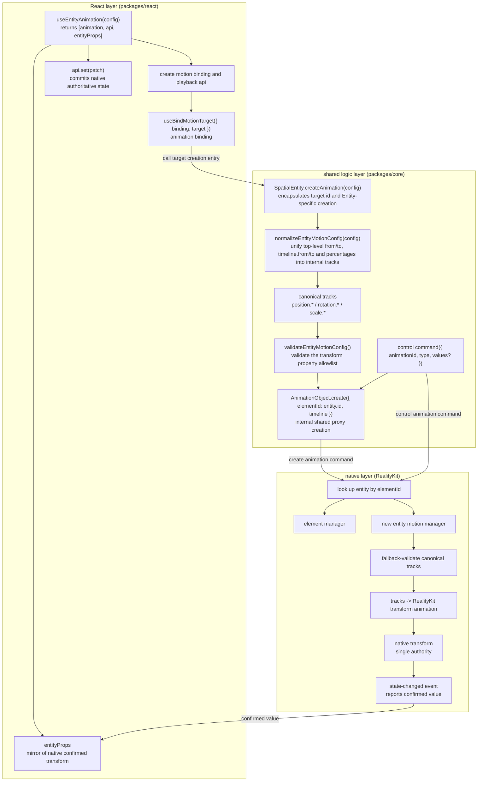

**Responsibilities per layer:**

- **React layer** handles the Hook API, binding lifecycle, the `entityProps` mirror, callback dispatch, and re-render. Once target binding completes, the binder calls `SpatialEntity.createAnimation(config)`.
- **Shared logic layer** uses `SpatialEntity.createAnimation(config)` to encapsulate the target id plus Entity-specific normalization and validation, then delegates the canonical timeline to the shared `AnimationObject`. Normalization folds the three public authoring forms (top-level `from` / `to`, `timeline.from` / `timeline.to`, and percentage keyframes) into internal canonical entity tracks. When `timeline` and top-level `from` / `to` are both present, `timeline` is the sole effective input and development mode logs a duplicate-declaration warning. `elementId` is the spatial-object id transport field in the Core-to-native create command.
- **Native layer** looks up the target, performs fallback validation, compiles and executes with RealityKit, returns command results, decomposes the final transform, and reports it through events.

#### Cross-layer class diagram

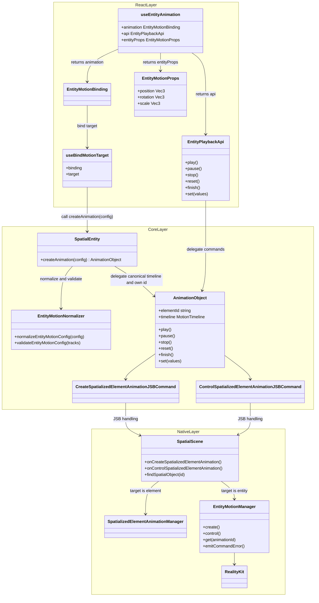

The diagram presents React, shared-logic, and native classes together; each class remains in its labeled layer. Native target resolution happens inside `SpatialScene` create / control handling: `findSpatialObject` looks up the registry and dispatches by runtime type to the element manager or the entity manager.

#### Cross-layer Protocol

Entities reuse these commands and events:

- Create animation: `CreateSpatializedElementAnimationJSBCommand`
- Control animation: `ControlSpatializedElementAnimationJSBCommand`
- State event: `spatialanimationstatechanged`

##### Create animation command

The command name and the `elementId` field carry a spatial object. `elementId` means a spatial object id, which can point to an element or an entity:

```text
CreateSpatializedElementAnimation {
  elementId: string
  timeline: EntityMotionTimeline | SpatializedMotionTimeline
}
```

Native looks up the registry by `elementId`, then dispatches by runtime type:

```text
is element -> element manager
is entity  -> entity motion manager
otherwise  -> fail
```

Rules:

- When the registry lookup for `elementId` returns empty, create must fail explicitly.
- Elements and entities are valid animation targets; other object types fail with `UNSUPPORTED_TARGET`.
- The control command locates the created animation by `animationId`.
- When the target object is destroyed, its associated animation must be destroyed or invalidated; subsequent control must fail and be surfaced through an error event.

##### Control animation command

Reuse the command and add a `set` type:

```text
ControlSpatializedElementAnimation {
  animationId: string
  type: 'play' | 'pause' | 'stop' | 'reset' | 'finish' | 'destroy' | 'set'
  values?: EntityMotionPatch
}
```

`api.set` reuses the control command, accepts a sparse patch object `EntityMotionPatch` (the write-side type, with the same shape as the distinctly named read-side `EntityMotionProps`), and is sent to native as `type: 'set'`:

- Native returns failure: the command fails or triggers an error event, and `entityProps` retains its current value.
- Native accepts: native merges the patch onto the currently committed transform, applies it, then reports the confirmed value through a state event, and React then updates `entityProps`.

##### State-changed event

The state event carries a named detail type:

```text
interface EntityMotionStateChangedDetail {
  animationId: string
  action:
    | 'play' | 'pause' | 'stop' | 'reset' | 'finish' | 'destroy' | 'set'
    | 'start' | 'complete' | 'error'
  playState: 'idle' | 'queued' | 'running' | 'paused' | 'finished'
  finished: boolean
  values?: EntityMotionProps
  error?: SpatializedPlaybackError
}

interface EntityMotionStateChangedMsg {
  type: 'spatialanimationstatechanged'
  detail: EntityMotionStateChangedDetail
}
```

`values` is the entity target's transform value `EntityMotionProps` (i.e. `position` / `rotation` / `scale`).

The `action` set native reports is larger than the public callback set. Its mapping to user callbacks and `entityProps` is:

| native action | mapped user callback | updates entityProps |
|---|---|---|
| `start` | `onStart` | yes (once, at the moment of start) |
| `complete` | `onComplete` | yes (end state) |
| `finish` | `onComplete` | yes (end state) |
| `stop` | `onStop` | yes (current transform) |
| `reset` | `onReset` | yes (starting transform) |
| `set` | internal commit | yes (merged transform) |
| `error` | `onError` | retains current value |
| `pause` | playback state change | retains current value |

##### Playback error classification

When `action` is `error`, it carries `error`. The error codes are a closed set shared by both target types:

```text
type SpatializedPlaybackError = {
  code:
    | 'TARGET_NOT_FOUND'     // registry lacks elementId
    | 'UNSUPPORTED_TARGET'   // target type falls outside the element/entity set
    | 'TARGET_DESTROYED'     // target destroyed, animation invalidated
  message?: string
}
```

All three error classes reach the user through `onError`. An `api.set` write during active animation, before binding, or before native-object creation is classified as a no-op and logs a console warning. Stable error codes provide the application branching contract.

#### Cross-layer Sequences

##### From config to native transform (playback)

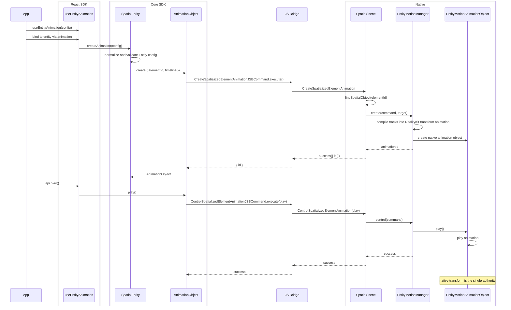

##### From native confirmed transform to React mirror

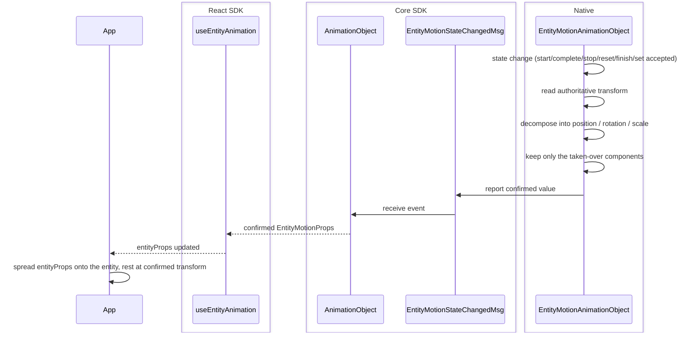

Native decides whether `api.set` takes effect: it accepts patches while playback is inactive and the native object exists, and handles all other timing as no-ops with a console warning. The first lifecycle commit—a playback end state or an accepted `set`—produces the first confirmed value, so `entityProps` may be empty before then.

### 4.4 Key Trade-offs

- **Command names keep the `Element` wording.** Entities reuse the existing create and control commands. Their target-state semantics cover spatial objects, and `elementId` identifies a spatial object.
- **Accept native compiler cost.** Concentrate multi-keyframe handling, sparse keyframes, rotation conversion, and whole-transform serial compilation in the entity motion manager and compiler in exchange for native RealityKit playback, system compositing, and one execution model.
- **Slice into a serial chain of full poses.** Cut the timeline into a set of nodes, each carrying a complete `position` / `rotation` / `scale`, then chain them in order into one whole-transform animation. The visionOS RealityKit animation binding granularity is the whole `.transform`, and current easing requirements apply per segment. A serial chain of full poses therefore aligns visionOS and picoOS, where native animation binds the whole transform; all channels within one segment share a single `timingFunction`.
- **Take over the whole transform.** Once the animation is active, the entire `.transform` is owned by the animation. For example, animating only `position.y` freezes `position.x` / `position.z` — and `rotation` / `scale` too — at baseline during playback; they can be taken over by React props / `api.set` only after the animation ends.
- **`set` uses sparse patch objects.** In v1, `api.set` accepts a sparse patch object and consumers read the latest confirmed transform through `entityProps`.
- **Dispatch directly by runtime type.** In v1, `SpatialScene` dispatches elements and entities to their respective managers; real duplication between the two paths is the trigger for extracting a shared protocol.
- **Measure large-scale concurrency.** Native RealityKit playback is preferable to per-frame JS writes, but high entity counts still require dedicated performance validation.

## 5. Module Design

### 5.1 React SDK

- **Public interface:** `useEntityAnimation` returns `[animation, api, entityProps]`; the entity component receives `EntityMotionBinding` through its `animation` property.
- **Playback control:** `EntityPlaybackApi` provides `play`, `pause`, `stop`, `reset`, `finish`, and `set`; `api.set(values)` submits a sparse state patch to native.
- **Target binding:** `useBindMotionTarget({ binding, target })` maintains one binding per `SpatialEntity` and calls `target.createAnimation(config)` after binding.
- **Result mirror:** `entityProps` mirrors native-confirmed `position`, `rotation`, and `scale`, driving React re-render and lifecycle callbacks.

#### Class Diagram

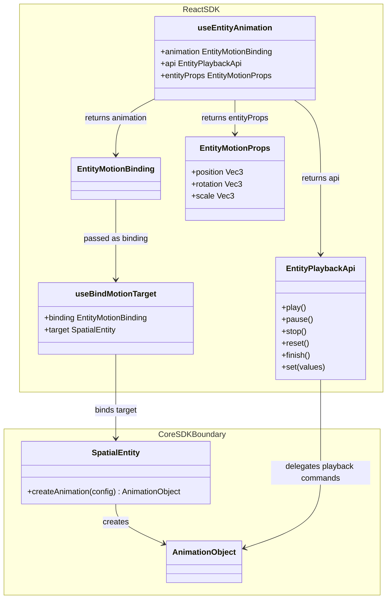

### 5.2 Core SDK

- **Target creation entry:** `SpatialEntity.createAnimation(config)` uses its own id, performs Entity-specific normalization and validation, then delegates the canonical timeline to the shared `AnimationObject` creation flow.
- **Animation object:** `AnimationObject` carries target-specific timelines and reported values, owns create / control commands, playback state, and event subscriptions; `elementId` is the spatial-object id transport field in the Core-to-native create command.
- **Types and functions:** Core defines entity-motion types, `EntityMotionPatch`, `EntityMotionProps`, the property allowlist, normalization and validation functions, and the internal canonical timeline.

#### Class Diagram

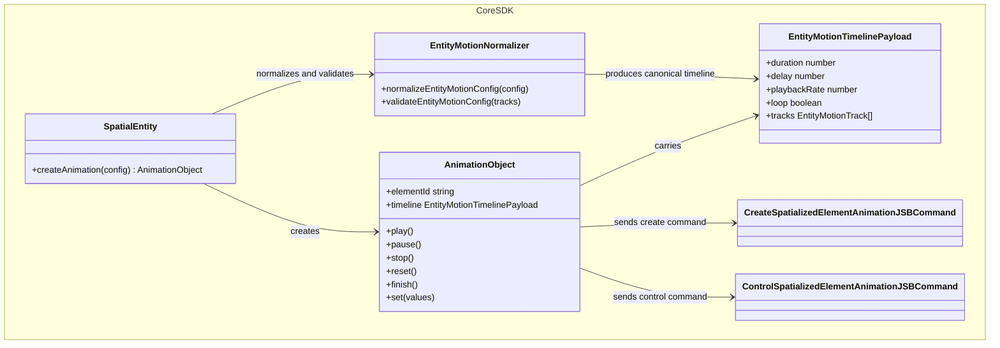

#### Types, normalization, and validation

Normalization is done by the shared logic layer's `normalizeEntityMotionConfig`, folding the three public authoring shapes into one internal timeline data.

**Input:** the three public authoring shapes, folded by these rules:

- **Top-level `from` / `to`** is equivalent to `timeline.from` / `timeline.to`, expanded into a start and an end frame.
- **`timeline.from` / `timeline.to`** are the `0%` / `100%` frames and may be mixed with percentage keys.
- **Percentage keyframes** `0% → 50% → 100%` are converted to seconds via `at = percentage × duration`.

The full normalization rules include `timeline` precedence, mandatory boundaries, and `duration` defaults, detailed later in this section.

**Output:** a platform-agnostic `EntityMotionTimelinePayload`, shown below:

```text
type EntityMotionTimelinePayload = {
  duration: number
  delay?: number
  playbackRate?: number
  loop?: boolean | { reverse?: boolean }
  tracks: EntityMotionTrack[]
}

type EntityMotionTrack = {
  property: EntityMotionProperty
  keyframes: EntityMotionKeyframe[]
  timingFunction?: TimingFunction
}

type EntityMotionProperty =
  | 'position.x' | 'position.y' | 'position.z'
  | 'rotation.x' | 'rotation.y' | 'rotation.z'
  | 'scale.x'    | 'scale.y'    | 'scale.z'

type EntityMotionKeyframe = {
  at: number
  value: number
  timingFunction?: TimingFunction
}
```

Example:

```text
{
  duration: 1.2,
  tracks: [
    {
      property: 'position.y',
      timingFunction: 'easeOut',
      keyframes: [
        { at: 0, value: 0 },
        { at: 0.6, value: 0.25 },
        { at: 1.2, value: 0 },
      ],
    },
    {
      property: 'rotation.y',
      timingFunction: 'linear',
      keyframes: [
        { at: 0, value: 0 },
        { at: 1.2, value: 180 },
      ],
    },
  ],
}
```

Normalization and validation rules:

- Top-level `from` / `to` and `timeline.from` / `timeline.to` fold into the same internal tracks.
- `timeline.from` / `timeline.to` represent `0%` / `100%` and may be mixed with percentage keyframes; duplicate declarations of the same boundary produce an explicit error.
- When `timeline` and top-level `from` / `to` both appear, `timeline` is the sole effective input and development mode logs a duplicate-declaration warning.
- Pure top-level `from` / `to` uses a default `duration` of 0.3s.
- Every animation provides both start and end boundaries; fields inside those boundary frames may remain sparse, with missing scalar values falling back to the Native baseline during compilation.

#### Capability detection

Docs and examples use top-level capability detection:

```text
supports('useEntityAnimation')
```

### 5.3 Native

- **Command entry:** `SpatialScene` receives create and control commands, looks up the target by `elementId`, and dispatches by runtime type.
- **Execution subsystem:** `EntityMotionManager` owns fallback validation, compilation scheduling, animation registration, control and `set` routing, lifecycle, and target invalidation.
- **Confirmed-value reporting:** `EntityMotionAnimationObject` reads and decomposes the native transform and reports confirmed values through state events.

#### Class Diagram

Readability and testability drive subsystem decomposition, and its file organization may evolve independently from the element path. The following responsibility boundaries are recommended; manager helpers may be merged or split according to logic complexity and reuse needs.

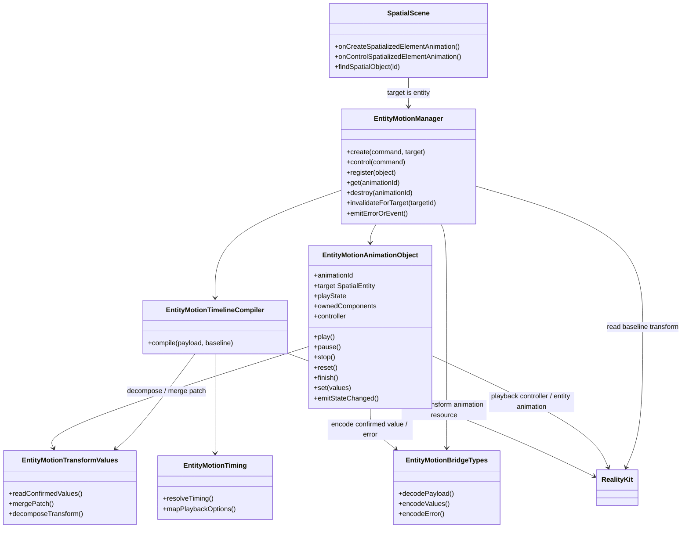

**Responsibilities per class:**

- **Entity motion manager (`EntityMotionManager`):** the native entry for entity motion. It receives create and control dispatches from `SpatialScene` and centrally owns the animation registry and lifecycle. On create it invokes the compiler, builds the animation object, registers it, and returns an `animationId`; on control it finds the object by `animationId` and calls the corresponding method. It handles command-failure receipts, destruction, target invalidation, and lookup / validation errors. The animation object reports confirmed-value events.
- **Entity animation object (`EntityMotionAnimationObject`):** represents a single entity animation, holding the `animationId`, target entity, playback state, taken-over components, playback controller, and resources, and handling that single object's state transitions. After every start / end state / accepted `set`, it obtains the confirmed value via the decomposition helper, encodes it via the bridge helper, then emits a state-changed event.
- **Timeline compiler (`EntityMotionTimelineCompiler`):** accepts normalized timeline data and slices and compiles it into one chained whole-transform RealityKit animation resource.
- **Bridge types (`EntityMotionBridgeTypes`):** carry the native bridge encode/decode structures, including timeline data, control values, confirmed values, and errors. If the command types are sufficient, this part may exist as a few scattered structs.
- **Playback parameter mapping (`EntityMotionTiming`):** maps easing, delay, loop, and playback rate to the RealityKit representation; all four built-in easings map directly.
- **Transform decomposition and merge (`EntityMotionTransformValues`):** responsible for decomposing the confirmed value from the entity transform, merging the sparse `api.set` patch onto the committed baseline, and converting between Euler degrees and the RealityKit rotation representation.

#### Timeline compilation

Compilation is done by the native entity motion manager: it takes the normalized internal timeline, reads the baseline transform, slices the timeline into a set of full-pose nodes and compiles it segment by segment, finally producing a controllable playback object.

##### Input: internal timeline

The compilation input is exactly the normalization output `EntityMotionTimelinePayload` (structure in the section above), whose target has already been resolved to an entity.

##### Compilation flow

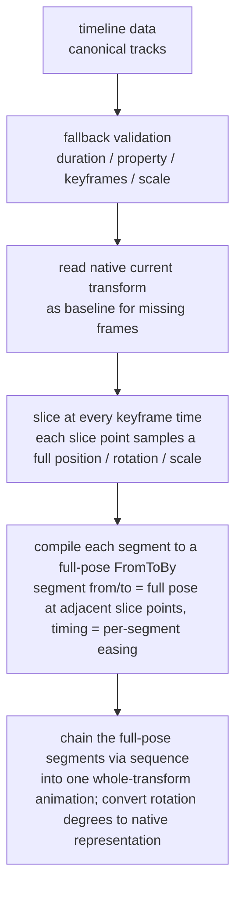

##### Slicing the timeline into full-pose nodes and chaining them

The whole timeline maps to a single bind target — the entire `transform`. Take the union of all channels' keyframe times as the slice points; adjacent slice points form a segment, and every slice point samples a complete `position` / `rotation` / `scale`, so each segment is a "full pose to full pose" transition.

**Per segment — expressed with `FromToByAnimation<Transform>`.** Each segment's `from` / `to` are the full poses at the two adjacent slice points, `duration` is the segment length, `timing` is the segment's easing (easing priority is in compilation rule 9), and `bindTarget` is fixed to `.transform`. The visionOS animation binding granularity is the whole `.transform`, which is the root reason for choosing full-pose slicing.

**Chaining — connect end to end with `sequence`.** The full-pose segment animations are chained in time order via `AnimationResource.sequence(with:)` into a single animation, so each segment carries its own easing yet plays continuously. A timeline with only a start and an end frame becomes one `FromToByAnimation<Transform>`. `delay` / `speed` / `loop` act at the top of this chained animation.

Consider an example (`position.y` has 3 keyframes, `rotation.y` has only start and end, the slice-point union is `0 / 0.6s / 1.2s`, giving 2 segments):

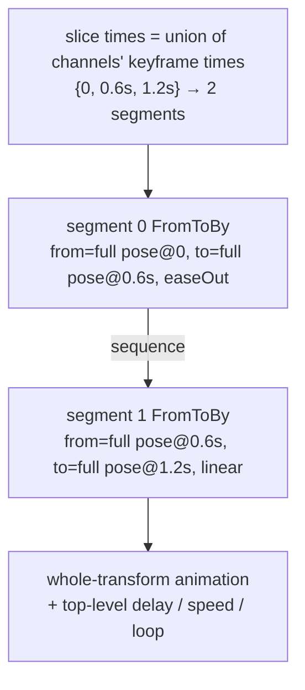

Each segment carries a full pose and joins the chain in time order; `delay` / `speed` / `loop` act at the top of the chained animation.

##### Output: the controllable playback object and sample code

The final compilation output is the controllable playback object. Reusing the example above (2 full-pose segments), the following shows it on visionOS and picoOS: each segment compiles into a full-pose `FromToBy`, chained via `sequence` into one animation resource, then handed to the engine — obtaining a playback controller that can pause / resume / stop / change speed, i.e. a "controllable playback object." Both platforms bind the whole transform, so the code lines up.

visionOS (RealityKit / Swift):

```swift
import RealityKit

// Reuse the example; every slice point carries a full position / rotation / scale, only y and rotation-about-y change
let base = entity.transform

// Sample a slice point's full pose (x / z / scale frozen at baseline, only pos.y and rot.y move)
func pose(y: Float, deg: Float) -> Transform {
    var t = base
    t.translation = SIMD3(base.translation.x, y, base.translation.z)
    t.rotation = simd_quatf(angle: deg * .pi / 180, axis: SIMD3(0, 1, 0))
    return t
}

// Segment 0: full pose from t=0 to t=0.6s
let seg0 = FromToByAnimation<Transform>(
    name: "seg0",
    from: pose(y: 0,    deg: 0),
    to:   pose(y: 0.25, deg: 90),
    duration: 0.6,
    timing: .easeOut,                 // segment 0 own easing
    bindTarget: .transform            // can only bind the whole transform
)
// Segment 1: full pose from t=0.6s to t=1.2s
let seg1 = FromToByAnimation<Transform>(
    name: "seg1",
    from: pose(y: 0.25, deg: 90),
    to:   pose(y: 0,    deg: 180),
    duration: 0.6,
    timing: .linear,                  // segment 1 own easing, different from segment 0
    bindTarget: .transform
)

// Chain the full-pose segments in time order into one animation via sequence
let clip = try AnimationResource.sequence(with: [
    try AnimationResource.generate(with: seg0),
    try AnimationResource.generate(with: seg1),
])

// Controllable playback object: the controller supports pause / resume / stop / speed
let controller = entity.playAnimation(clip, transitionDuration: 0, startsPaused: true)
controller.resume()          // play
// controller.pause()        // pause
// controller.stop()         // stop
// controller.speed = 2.0    // top-level playback rate acts on the whole chained animation
```

picoOS (Pico Spatial SDK / Kotlin):

```kotlin
// Reuse the same example; every slice point carries a full Transform, x / z / scale frozen at baseline
val base = entity.getComponent(Transform::class.java) ?: Transform()

// Sample a slice point's full pose (only pos.y and rotation-about-y change)
fun pose(y: Float, deg: Float): Transform {
    val q = Quaternion.fromAxisAngle(Vector3(0f, 1f, 0f), deg)
    return Transform(Vector3(base.position.x, y, base.position.z), q, base.scale)
}

// Segment 0: full pose from t=0 to t=0.6s
val seg0 = TweenAnimation.createTweenAnimation(
    "seg0",
    AnimationBindTarget.bindTransform(),   // can only bind the whole transform
    pose(0f,    0f),                        // from (full pose)
    pose(0.25f, 90f),                       // to (full pose)
    null,                                   // by
    0.6f, 0f, RepeatMode.None, 0,           // duration / delay / repeatMode / repeatCount
    EaseType.EaseOut,                       // segment 0 easing
    0f, 1f, false, null, null, null
)
// Segment 1: full pose from t=0.6s to t=1.2s
val seg1 = TweenAnimation.createTweenAnimation(
    "seg1",
    AnimationBindTarget.bindTransform(),
    pose(0.25f, 90f),
    pose(0f,    180f),
    null,
    0.6f, 0f, RepeatMode.None, 0,
    EaseType.Linear,                        // segment 1 easing, different from segment 0
    0f, 1f, false, null, null, null
)

// Chain the full-pose segments in time order into one animation via sequence
val clip = AnimationResource.sequence(with = listOf(
    AnimationResource.generateWithTweenAnimation(seg0),
    AnimationResource.generateWithTweenAnimation(seg1),
))

// Controllable playback object
val controller = entity.playAnimation(clip)
// controller.pause() / controller.resume() / controller.stop()
// controller.speed = 2f     // top-level playback rate acts on the whole chained animation
```

##### Compilation rules

1. **Property allowlist:** accept only `position.*`, `rotation.*`, `scale.*`. `opacity`, material, component properties, etc. all fail explicitly.
2. **Time range:** `duration` must be positive; each keyframe's `at` must fall within `[0, duration]`.
3. **Ordering and duplicates:** each track's keyframes are sorted non-decreasing by `at`; each property maps to one unique track.
4. **Slice times are the union across channels:** take the union of all channels' keyframe times as the timeline's slice points; adjacent slice points form a segment. For example `position.y` at `0, 0.6, 1.2` and `rotation.y` at `0, 1.2` give the union `0, 0.6, 1.2`, cut into `[0, 0.6]` and `[0.6, 1.2]`.
5. **Each slice point samples a full pose; missing frames fall back per channel:** every slice point must provide a complete `position` / `rotation` / `scale`. A channel with a keyframe gap interpolates among its own keyframes; the span before the channel's first keyframe falls back to the native baseline at playback start, and the span after its last keyframe holds the last value. Components absent from the config, such as `scale.*`, are sampled at the baseline and retain that value during playback—the animation therefore owns the entire transform while it plays.
6. **Serial chaining of full poses:** adjacent slice points form a full-pose `FromToByAnimation<Transform>`, and the segments are chained in time order via `sequence` into one whole-transform animation, all bound to the whole transform (`bindTarget: .transform`); see "Slicing the timeline into full-pose nodes and chaining them."
7. **Rotation:** `rotation.*` input is Euler degrees; at compile time it is converted to the rotation representation RealityKit requires, and RealityKit applies shortest-path spherical interpolation. If a rotation channel's single-frame increment reaches or exceeds 180°, or spans multiple axes, the actual path may differ from per-axis intuition; users define a specific multi-turn or multi-axis path through explicit intermediate keyframes.
8. **Scale:** `scale.*` must be non-negative; an invalid scale fails outright.
9. **Easing priority:** keyframe-level easing takes priority over track-level, and track-level over the timeline default. The closed easing enum is `linear` / `easeIn` / `easeOut` / `easeInOut`, with every value mapping directly to a RealityKit built-in curve. Because each segment binds the whole transform, `position` / `rotation` / `scale` within one segment share that segment's easing.
10. **Loop / playback rate / delay:** these playback parameters live at the top of the timeline and apply uniformly to the whole chained animation, executed by the RealityKit playback layer.
11. **Explicit failure:** a segment outside RealityKit's expression range must produce a command failure or an error event.

#### Transform decomposition and confirmed-value reporting

The values native reports back to React must be in the entity API shape:

```text
type EntityMotionProps = {
  position?: Vec3
  rotation?: Vec3
  scale?: Vec3
}
```

Decomposition rules:

- `position` comes from the translation part of the native transform.
- `scale` comes from the scale part of the native transform.
- `rotation` uses Euler degrees, consistent with the entity property.
- After decomposition, trim by the components this animation object currently takes over: report the animation-owned components plus the components written by `api.set`. If `api.set` writes a component outside the animated config, that component joins the taken-over set and thereafter also appears in `entityProps`.
- Both the callback value and `entityProps` use the `EntityMotionProps` shape; `api.set(values)` accepts the same-shaped write-side `EntityMotionPatch`, naming the read and write sides distinctly.

#### Native Internal Sequences

**Create and compile sequence:**

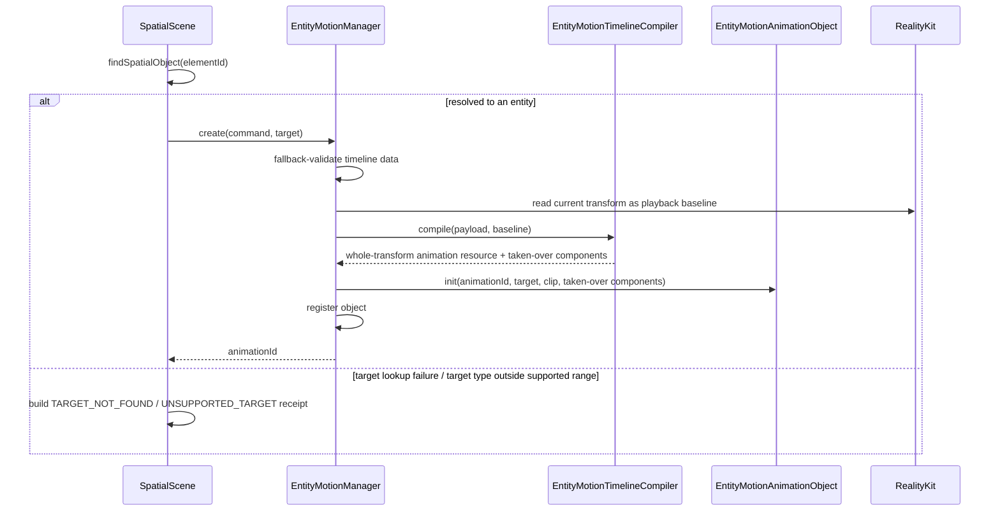

**Play and complete sequence:**

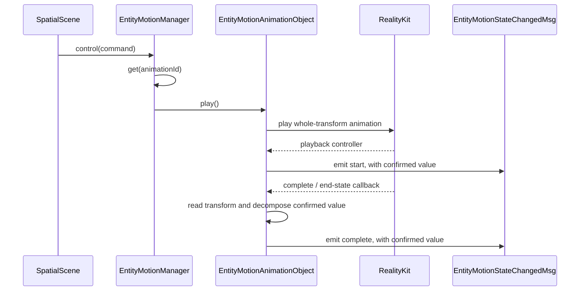

Create and compile build the native animation object and compiled plan and return an `animationId`. Playback obtains the RealityKit controller, while start and completion callbacks produce confirmed values. The entity animation object holds the chained whole-transform animation / controller compiled from the full timeline; track slicing and per-segment granularity belong to the compiler.

**Pause sequence:**

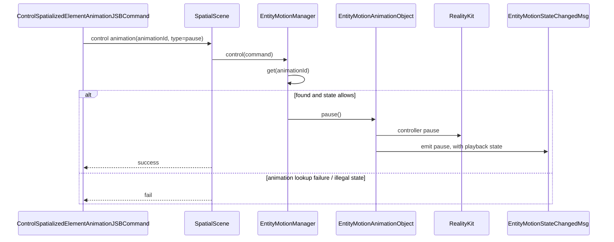

**Stop, reset, finish sequence:**

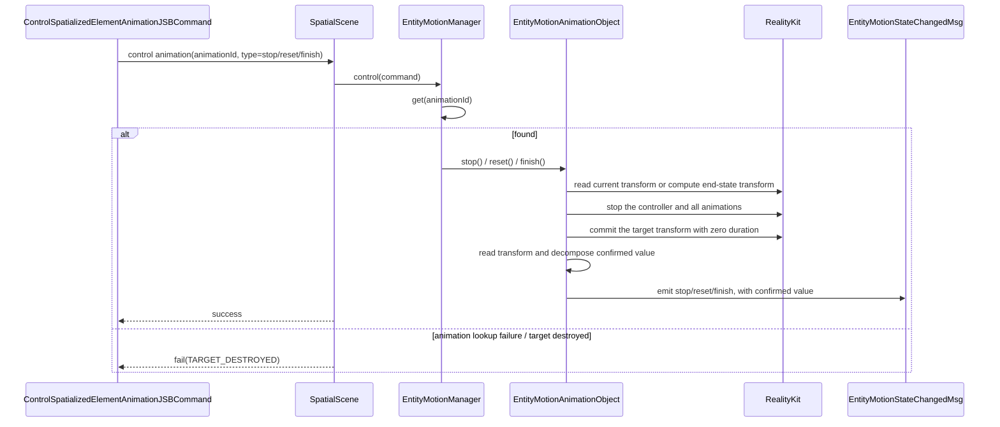

**set sequence:**

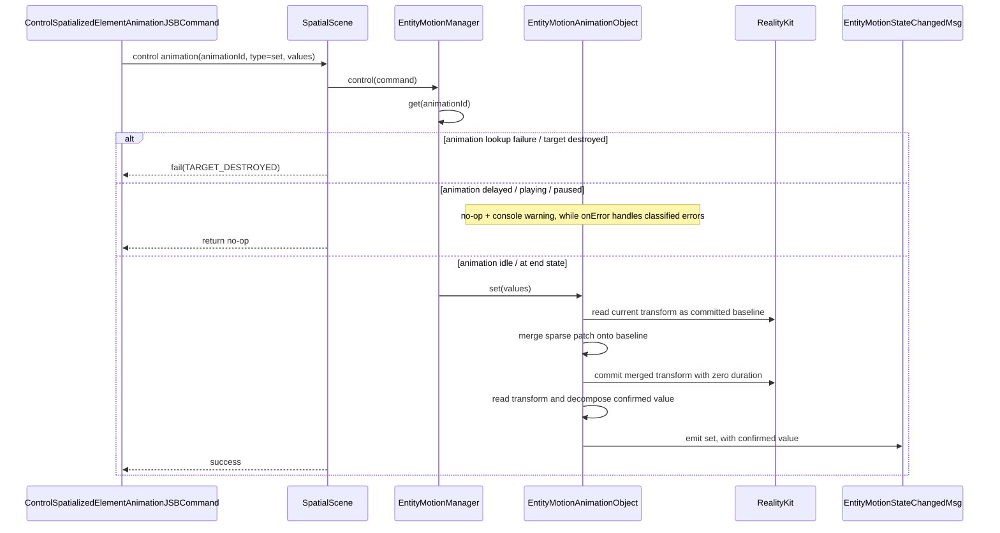

Pause reuses the compiled whole-transform chain and controls the current playback controller. Stop / reset / finish terminate the current playback and commit the end-state transform with zero duration. While inactive, `set` merges the sparse patch onto the committed transform and commits it directly.

Boundary constraint: `SpatialScene` owns target lookup, type dispatch, and command receipts; the entity motion manager centrally owns entity-specific compilation, playback state, the registry, create / control orchestration, and lifecycle. A shared protocol or thin wrapper becomes appropriate when the two paths develop a unified target-boundary requirement.
