# `useEntityAnimation` Redesign

## 1. Background

`useEntityAnimation` is the WebSpatial SDK React Hook that drives transform animations for 3D entities in a scene. It supports percentage keyframes, animation-result write-back, and a unified imperative transform setter, and it unifies entity motion onto the generic animation binding and lifecycle.

This redesign integrates entity motion into the generic animation architecture: the React layer provides the Hook, target binding, and result mirror; Core normalizes and validates configuration; and the visionOS native layer compiles and executes animations with RealityKit. The native transform is the single authoritative data source. Every transform change is confirmed by native before it is mirrored to React, structurally preventing the animation end state from conflicting with stale React base properties and snapping back.

The goals are to:

- Define the responsibility boundaries and data flow across React, Core, and native.
- Define both the “config → canonical tracks → RealityKit animation” path and the “native confirmed transform → `entityProps`” path.
- Entities use dedicated create, control, and set protocols, while state events report only playback state and native-confirmed transforms.
- Spatial-element and entity animations reuse the shared playback interface while using target-specific animation objects and cross-layer protocols.

The public API surface covers animation binding, playback control, and confirmed-transform write-back, with native RealityKit as the unified execution engine. This document fully defines the API shape, behavior boundaries, cross-layer protocol, compilation rules, and module responsibilities for a self-contained technical review.

## 2. Glossary

- **Entity**: a 3D object in the scene, e.g. a box. It has three groups of spatial properties, collectively called its "transform."
- **transform**: an entity's state in space, made of position `position` (meters), rotation `rotation` (degrees), and scale `scale` (multiplier).
- **component**: one of the three transform parts, i.e. `position`, `rotation`, or `scale`.
- **native layer / RealityKit**: the low-level engine on Apple visionOS that actually drives 3D entity motion, implemented in Swift. "Native" in this document refers to this layer.
- **React layer / shared logic layer (Core)**: respectively the user-facing Hook code, and the platform-agnostic logic shared by both ends.
- **JS Bridge command / event**: the channel for sending and receiving messages between JavaScript and the native layer. Commands go from JS to native; events come back from native to JS.
- **authoritative data source**: which side a given piece of data defers to. In this design, an entity's real transform defers only to the native layer.
- **mirror**: React copies the transform the native layer has already confirmed and uses that copy for rendering. That copy is the mirror.
- **`entityProps`**: the transform mirror the Hook returns to the user, of the form `{ position?, rotation?, scale? }`. Spread onto the component, it keeps the entity resting at the animation's end state.
- **confirmed transform**: after the native layer finishes an action, it reports the Entity's complete current transform. React updates `entityProps` only from such values.
- **track / channel**: a curve describing how a single property (e.g. `position.y`) changes over time; the two are interchangeable and both refer to the keyframe sequence of one single property. Compilation slices at the union of channel keyframe times, samples a full pose at each slice point, and plays the whole transform (see 5.3).
- **keyframe**: a time point on a curve and its value, e.g. "at 0.6s, `position.y` = 0.25."
- **timingFunction**: a curve describing the pacing between two frames, e.g. constant-speed `linear`, slow-then-fast `easeIn`.
- **baseline**: the current native value when each fresh play is accepted; it fills fields omitted from the config to form the full pose for that playback run.
- **start confirmation**: after a fresh play compiles successfully, Native combines config `from` / `0%` values with that run's baseline, commits the complete start pose to the target, and reports the Entity's complete current transform. Native emits `start` as soon as that confirmation succeeds, and React updates `entityProps` without waiting for delay to end.
- **fresh play**: the first playback after creation, or playback restarted after `complete`, `finish`, `stop`, or `reset`; `autoStart` is also a fresh play. With no config update, continuing `play` after `pause` resumes the current run; after a paused update, `play` starts a new execution from the saved pose.
- **spherical linear interpolation (slerp)**: the interpolation RealityKit uses for rotation, always taking the shortest path between two orientations.
- **no-op**: after the command is received, the entity and `entityProps` retain their current values.
- **registry**: the table the native layer uses to look up entities or animation objects by id.
- **binding command queue**: the per-binding FIFO that serializes playback commands and `set` before they enter the JS Bridge. It is a React/Core ordering mechanism, not a second native animation queue.
- **command reply**: the JSB success or failure receipt returned after Native has finished the command's synchronous state and transform commit work. When a command emits a state event, Native emits that event before returning the success reply.

## 3. Design Goals

`useEntityAnimation` lets users describe animations with position, rotation, and scale, bind them to an entity, and receive the native-confirmed transform. The functional scope is:

| Capability | Description |
|---|---|
| Transform animation | The property allowlist is `position`, `rotation`, and `scale`; non-transform properties such as `opacity` produce an explicit validation failure. |
| Timeline forms | Supports top-level `from` / `to`, `timeline.from` / `timeline.to`, and percentage keyframes such as `0% → 50% → 100%`. |
| Target binding | Returns `animation`, which binds through the entity component's `animation` property. |
| Playback control | `api` provides `play`, `pause`, `stop`, `reset`, and `finish`. |
| Result write-back | Native reports transforms at confirmed lifecycle points; React exposes them as `entityProps` to preserve the confirmed end state. |
| Imperative set | In an inactive state, `api.set(update)` merges a sparse update onto the native committed transform. |
| Lifecycle and errors | Reuses the generic animation binding and lifecycle while using Entity-specific JSB commands and error events. |
| Capability detection | Detects the complete capability through `supports('useEntityAnimation')`. |

## 4. Design Approach and Trade-offs

### 4.1 Design Principles

#### The native layer is the single authoritative data source

An entity's transform defers to native RealityKit. React maintains a read-only mirror of native-confirmed transforms.

`entityProps` is only a React-side mirror of the transform native has already confirmed. Data flows in one direction:

```text
React config / api.set
  -> native animation engine (single authority)
  -> confirmed transform
  -> entityProps mirror
```

From this a few rules follow:

- Play, stop, reset, finish, `api.set` — every operation that changes the transform goes to the native layer first.
- When an ordinary playback, control, or config-update command fails, the entity transform and `entityProps` retain their current values. Only initial animation-object creation failure enters the binding-termination path.
- When native accepts a playback control command, it reports the confirmed transform through an animation state event. When it accepts `set`, it reports the confirmed transform through `SetEntityAnimationResult`. React updates `entityProps` from the value Core forwards.
- React mirrors native-confirmed transforms back to the user; writes during active animation are handled as no-ops.
- `entityProps` starts empty. The first confirmation fills it with the complete committed `position`, `rotation`, and `scale` values. While playback is inactive, the component's combined React props control the transform; spreading `entityProps` after base props preserves the confirmed pose.

#### Reuse the generic animation architecture

`useEntityAnimation` reuses the generic animation's binding, target resolution, animation-object lifecycle, and the "create — control — event" pipeline as much as possible. The entity path's differences are concentrated in only a few places:

- Description: uses `position` / `rotation` / `scale`.
- Validation: the property allowlist is `position`, `rotation`, and `scale`; other properties produce an explicit validation failure.
- Result exit: `entityProps`.
- Target type: `SpatialEntity`.
- Execution engine: RealityKit.

### 4.2 Why RealityKit

The native execution engine is chosen as **RealityKit**, because:

1. **One execution engine.** Entity motion and generic animation share a single RealityKit engine, avoiding a separate execution path for entities.
2. **It is inherently the execution engine for 3D entities.** With many entities animating concurrently, native engine playback scales better than per-frame writes from the SDK.
3. **It meets both the playback and reporting needs.** It can control playback state, read an entity's current transform, and emit an event when playback completes — enough to implement stop, reset, and finish, and to report the confirmed transform to callbacks and `entityProps`.

The main added cost is a compiler: translating the normalized entity tracks into transform animations RealityKit can execute.

#### Execution advantages of native RealityKit playback

All entity animations use native RealityKit playback and gain these properties:

- **Render-tick synchronization.** Transform animation stays aligned with RealityKit render commits.
- **System compositing.** Animation participates directly in visionOS system compositing and reprojection.
- **Scene-system integration.** Transform animation naturally participates in the scene graph, coordinate spaces, anchors, and collision system.
- **High-quality interpolation.** RealityKit applies spherical linear interpolation to rotation.
- **Complete playback semantics.** RealityKit provides easing, looping, delay, playback rate, pause, and completion events.
- **Unified execution semantics.** Element and entity paths both use native animation objects.

### 4.3 Layer Responsibilities and Overall Architecture

#### Overall Architecture

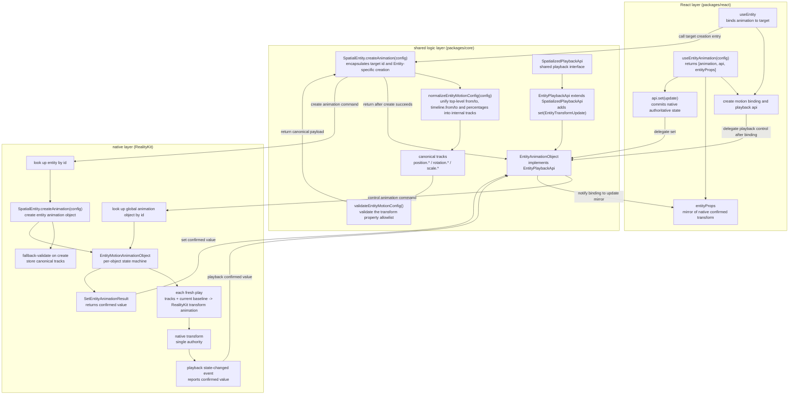
```mermaid
flowchart TB
    subgraph React["React layer (packages/react)"]
        UseEntity["useEntityAnimation(config)<br/>returns [animation, api, entityProps]"]
        ReactBinding["create motion binding and playback api"]
        EntityProps["entityProps<br/>mirror of native confirmed transform"]
        ApiSet["api.set(update)<br/>commits native authoritative state"]
        BindTarget["useEntity<br/>binds animation to target"]

        UseEntity --> ReactBinding
        UseEntity --> EntityProps
        UseEntity --> ApiSet
        BindTarget --> ReactBinding
    end

    subgraph Core["shared logic layer (packages/core)"]
        EntityCreate["SpatialEntity.createAnimation(config)<br/>encapsulates target id and Entity-specific creation"]
        Normalize["normalizeEntityMotionConfig(config)<br/>unify top-level from/to, timeline.from/to and percentages into internal tracks"]
        Tracks["canonical tracks<br/>position.* / rotation.* / scale.*"]
        Validate["validateEntityMotionConfig()<br/>validate the transform property allowlist"]
        PlaybackApi["SpatializedPlaybackApi<br/>shared playback interface"]
        EntityApi["EntityPlaybackApi extends SpatializedPlaybackApi<br/>adds set(EntityTransformUpdate)"]
        CoreAnimationObject["EntityAnimationObject<br/>implements EntityPlaybackApi"]

        EntityCreate --> Normalize
        Normalize --> Tracks
        Tracks --> Validate
        Validate -->|"return canonical payload"| EntityCreate
        EntityCreate -->|"return after create succeeds"| CoreAnimationObject
        PlaybackApi --> EntityApi
        EntityApi --> CoreAnimationObject
    end

    subgraph Native["native layer (RealityKit)"]
        Resolve["look up entity by id"]
        ResolveAnimation["look up global animation object by id"]
        EntityCreateNative["SpatialEntity.createAnimation(config)<br/>create entity animation object"]
        AnimationObject["EntityMotionAnimationObject<br/>per-object state machine"]
        NativeValidate["fallback-validate on create<br/>store canonical tracks"]
        Compile["each fresh play<br/>tracks + current baseline -> RealityKit transform animation"]
        Authority["native transform<br/>single authority"]
        Event["playback state-changed event<br/>reports confirmed value"]
        SetResult["SetEntityAnimationResult<br/>returns confirmed value"]

        Resolve --> EntityCreateNative
        ResolveAnimation --> AnimationObject
        EntityCreateNative --> NativeValidate
        EntityCreateNative --> AnimationObject
        AnimationObject --> Compile
        Compile --> Authority
        Authority --> Event
        AnimationObject --> SetResult
    end

    BindTarget -->|"call target creation entry"| EntityCreate
    ReactBinding -->|"delegate playback control after binding"| CoreAnimationObject
    ApiSet -->|"delegate set"| CoreAnimationObject
    EntityCreate -->|"create animation command"| Resolve
    CoreAnimationObject -->|"control animation command"| ResolveAnimation
    Event -->|"playback confirmed value"| CoreAnimationObject
    SetResult -->|"set confirmed value"| CoreAnimationObject
    CoreAnimationObject -->|"notify binding to update mirror"| EntityProps
```

**Responsibilities per layer:**

- **React layer** handles the Hook API, target-binding coordination, the `entityProps` mirror, command queuing, callback dispatch, and re-render. `useEntityAnimation` creates one `EntityMotionBinding` and one stable `EntityPlaybackApi` facade; `useEntity` calls the binding's `__bind` and `__unbind` entries. As the React glue layer, `EntityMotionBinding` stores the latest desired config, connects the current target to the Core animation object, and calls `SpatialEntity.createAnimation(config)`.
- **Shared logic layer** uses the target's own `SpatialObject.id` in `SpatialEntity.createAnimation(config)`, performs Entity-specific normalization and validation, sends the create command, and returns an `EntityAnimationObject`. `EntityPlaybackApi` extends the existing `SpatializedPlaybackApi` and adds `set` only for Entity; `EntityAnimationObject` and the ordinary `AnimationObject` implement their respective interfaces without inheriting from each other. Normalization folds the three public authoring forms into internal canonical entity tracks; when `timeline` and top-level `from` / `to` are both present, `timeline` is the sole effective input and development mode logs a duplicate-declaration warning.
- **Native layer** stores animation objects in `SpatialScene.spatialObjects` and reuses the `SpatialObject` lifecycle. `SpatialScene` resolves create targets and animation objects; the target Entity creates an `EntityMotionAnimationObject` through `createAnimation(config)`, and the animation object owns its state machine, fresh-play compilation, RealityKit execution, and confirmed-pose reporting.

#### Cross-layer class diagram

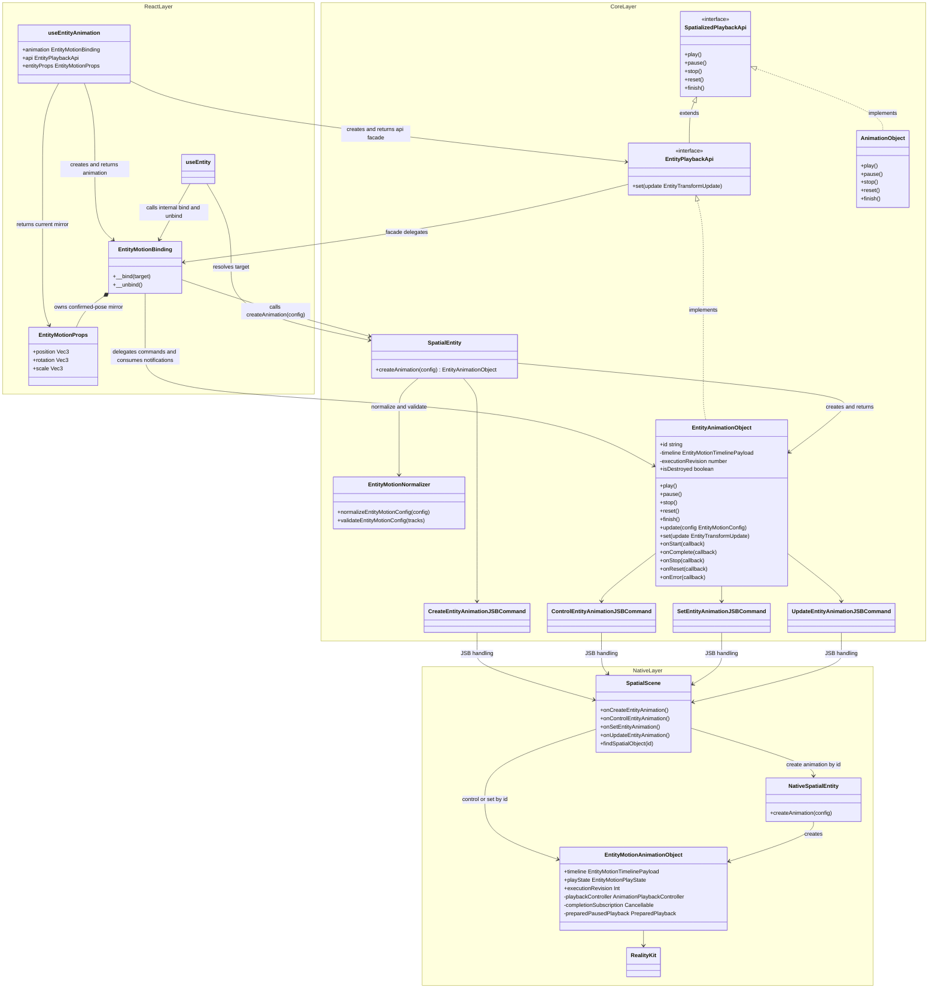
```mermaid
classDiagram
    namespace ReactLayer {
        class useEntityAnimation {
            +animation EntityMotionBinding
            +api EntityPlaybackApi
            +entityProps EntityMotionProps
        }
        class useEntity
        class EntityMotionBinding {
            +__bind(target)
            +__unbind()
        }
        class EntityMotionProps {
            +position Vec3
            +rotation Vec3
            +scale Vec3
        }
    }
    namespace CoreLayer {
        class SpatialEntity {
            +createAnimation(config) EntityAnimationObject
        }
        class EntityMotionNormalizer {
            +normalizeEntityMotionConfig(config)
            +validateEntityMotionConfig(tracks)
        }
        class SpatializedPlaybackApi {
            <<interface>>
            +play()
            +pause()
            +stop()
            +reset()
            +finish()
        }
        class EntityPlaybackApi {
            <<interface>>
            +set(update EntityTransformUpdate)
        }
        class AnimationObject {
            +play()
            +pause()
            +stop()
            +reset()
            +finish()
        }
        class EntityAnimationObject {
            +id string
            -timeline EntityMotionTimelinePayload
            -executionRevision number
            +isDestroyed boolean
            +play()
            +pause()
            +stop()
            +reset()
            +finish()
            +update(config EntityMotionConfig)
            +set(update EntityTransformUpdate)
            +onStart(callback)
            +onComplete(callback)
            +onStop(callback)
            +onReset(callback)
            +onError(callback)
        }
        class CreateEntityAnimationJSBCommand
        class ControlEntityAnimationJSBCommand
        class SetEntityAnimationJSBCommand
        class UpdateEntityAnimationJSBCommand
    }
    namespace NativeLayer {
        class SpatialScene {
            +onCreateEntityAnimation()
            +onControlEntityAnimation()
            +onSetEntityAnimation()
            +onUpdateEntityAnimation()
            +findSpatialObject(id)
        }
        class NativeSpatialEntity {
            +createAnimation(config)
        }
        class EntityMotionAnimationObject {
            +timeline EntityMotionTimelinePayload
            +playState EntityMotionPlayState
            +executionRevision Int
            -playbackController AnimationPlaybackController
            -completionSubscription Cancellable
            -preparedPausedPlayback PreparedPlayback
        }
        class RealityKit
    }
    useEntityAnimation --> EntityMotionBinding : creates and returns animation
    useEntityAnimation --> EntityPlaybackApi : creates and returns api facade
    useEntityAnimation --> EntityMotionProps : returns current mirror
    EntityMotionBinding *-- EntityMotionProps : owns confirmed-pose mirror
    useEntity --> EntityMotionBinding : calls internal bind and unbind
    useEntity --> SpatialEntity : resolves target
    EntityPlaybackApi --> EntityMotionBinding : facade delegates
    EntityMotionBinding --> SpatialEntity : calls createAnimation(config)
    EntityMotionBinding --> EntityAnimationObject : delegates commands and consumes notifications
    SpatialEntity --> EntityMotionNormalizer : normalize and validate
    SpatializedPlaybackApi <|-- EntityPlaybackApi : extends
    SpatializedPlaybackApi <|.. AnimationObject : implements
    EntityPlaybackApi <|.. EntityAnimationObject : implements
    SpatialEntity --> EntityAnimationObject : creates and returns
    SpatialEntity --> CreateEntityAnimationJSBCommand
    EntityAnimationObject --> ControlEntityAnimationJSBCommand
    EntityAnimationObject --> SetEntityAnimationJSBCommand
    EntityAnimationObject --> UpdateEntityAnimationJSBCommand
    CreateEntityAnimationJSBCommand --> SpatialScene : JSB handling
    ControlEntityAnimationJSBCommand --> SpatialScene : JSB handling
    SetEntityAnimationJSBCommand --> SpatialScene : JSB handling
    UpdateEntityAnimationJSBCommand --> SpatialScene : JSB handling
    SpatialScene --> NativeSpatialEntity : create animation by id
    SpatialScene --> EntityMotionAnimationObject : control or set by id
    NativeSpatialEntity --> EntityMotionAnimationObject : creates
    EntityMotionAnimationObject --> RealityKit
```

The diagram presents React, shared-logic, and native classes together; each class remains in its labeled layer. The `id` in a create request is the target Entity's `SpatialObject.id`; the `id` in the create reply is the new animation object's `SpatialObject.id`. Core constructs `EntityAnimationObject` with the reply `id`, and later control, set, and event traffic uses that object `id` directly. The Entity protocol introduces no extra id aliases.

#### Cross-layer Communication Overview

- Core sends create, in-place config update, playback control, and transform-set commands through `CreateEntityAnimationJSBCommand`, `UpdateEntityAnimationJSBCommand`, `ControlEntityAnimationJSBCommand`, and `SetEntityAnimationJSBCommand`.
- Native reports playback state and confirmed transforms through `spatialanimationstatechanged`, and asynchronous post-acceptance errors through `entityanimationerror`.
- Core `EntityAnimationObject` directly consumes both event types. It updates its playback state and invokes matching `onXXX` debug listeners, after which React `EntityMotionBinding` updates public state, lifecycle callbacks, and `entityProps`.

Section 5.2 Core SDK defines the JSB payloads and error types, Section 5.3 Native defines command-processing rules, and Section 5.1 React SDK defines the state-event mapping into React.

#### Cross-layer Sequences

##### From config to native transform (playback)

```mermaid
sequenceDiagram
    participant App
    box React SDK
        participant Hook as useEntityAnimation
    end
    box Core SDK
        participant Entity as SpatialEntity
        participant Obj as EntityAnimationObject
    end
    participant Bridge as JS Bridge
    box Native
        participant Scene as SpatialScene
        participant NativeEntity as SpatialEntity
        participant NativeObj as EntityMotionAnimationObject
        participant Compiler as EntityMotionTimelineCompiler
    end

    App->>Hook: useEntityAnimation(config)
    App->>Hook: bind to entity via animation
    Hook->>Entity: createAnimation(config)
    Entity->>Entity: normalize and validate, produce timeline payload
    Entity->>Bridge: CreateEntityAnimationJSBCommand.execute(id, timeline payload)
    Bridge->>Scene: CreateEntityAnimation
    Scene->>Scene: findSpatialObject(id)
    Scene->>NativeEntity: createAnimation(timeline payload)
    NativeEntity->>NativeObj: create object, store only target + timeline payload
    NativeEntity-->>Scene: NativeObj
    Scene->>Scene: addSpatialObject(NativeObj)
    Scene-->>Bridge: success({ id })
    Bridge-->>Entity: { id }
    Entity->>Obj: new EntityAnimationObject(id, config, timeline payload)
    Obj-->>Hook: EntityAnimationObject
    Note over NativeObj: create reads no baseline, compiles no resource, creates no controller
    App->>Hook: api.play()
    Hook->>Obj: play()
    Obj->>Bridge: ControlEntityAnimationJSBCommand.execute(id, play)
    Bridge->>Scene: ControlEntityAnimation
    Scene->>Scene: findSpatialObject(id)
    Scene->>NativeObj: play()
    alt fresh play
        NativeObj->>NativeObj: read latest native baseline
        NativeObj->>Compiler: compile(timeline payload, baseline)
        Compiler-->>NativeObj: whole-transform resource
        NativeObj->>NativeObj: commit and confirm start pose
        NativeObj->>NativeObj: create controller and enter delay / running
        NativeObj->>Event: send start state message with running
    else play after pause
        NativeObj->>NativeObj: private resumeCurrent()
        NativeObj->>Event: emit state message carrying only running
        Note over NativeObj: reuse current baseline, resource, and controller; preserve onStart count
    end
    NativeObj-->>Scene: success
    Scene-->>Bridge: success
    Bridge-->>Obj: success
    Note over NativeObj: native transform is the single authority
```

##### From native confirmed transform to React mirror

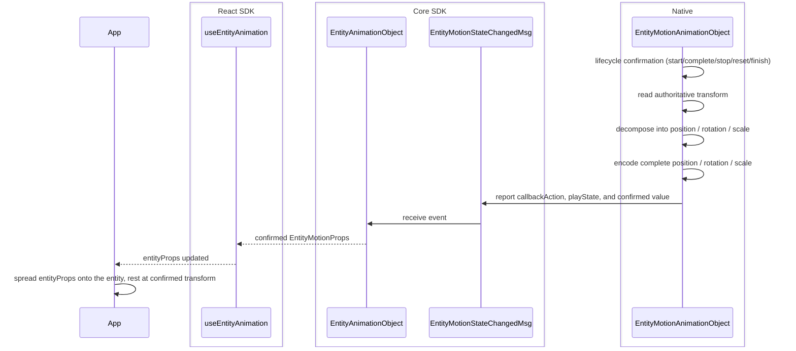
```mermaid
sequenceDiagram
    participant App
    box React SDK
        participant Hook as useEntityAnimation
    end
    box Core SDK
        participant Obj as EntityAnimationObject
        participant Event as EntityMotionStateChangedMsg
    end
    box Native
        participant NativeObj as EntityMotionAnimationObject
    end

    NativeObj->>NativeObj: lifecycle confirmation (start/complete/stop/reset/finish)
    NativeObj->>NativeObj: read authoritative transform
    NativeObj->>NativeObj: decompose into position / rotation / scale
    NativeObj->>NativeObj: encode complete position / rotation / scale
    NativeObj->>Event: report callbackAction, playState, and confirmed value
    Event->>Obj: receive event
    Obj-->>Hook: confirmed EntityMotionProps
    Hook-->>App: entityProps updated
    App->>App: spread entityProps onto the entity, rest at confirmed transform
```

Native decides whether `api.set` takes effect: it accepts updates while playback is inactive and the native object exists, and handles all other timing as no-ops with a console warning. An accepted `set` returns its confirmed transform through `SetEntityAnimationResult` rather than a state event. The first confirmed value comes from a fresh-play start-pose confirmation or an accepted `set`, so `entityProps` may be empty before then.

### 4.4 Key Trade-offs

- **Entity uses a dedicated bridge protocol.** Creation, in-place config update, playback control, and transform setting use separate Entity-specific commands. All four commands use `SpatialObject.id` directly and do not inherit Element animation protocol fields.
- **Accept native compilation cost on fresh play.** Each fresh play makes the entity animation object read the current baseline and invoke the compiler for multi-keyframe handling, sparse keyframes, rotation conversion, and whole-transform serial compilation in exchange for an up-to-date baseline, native RealityKit playback, system compositing, and one execution model.
- **Slice into a serial chain of full poses.** Cut the timeline into a set of nodes, each carrying a complete `position` / `rotation` / `scale`, then chain them in order into one whole-transform animation. The visionOS RealityKit animation binding granularity is the whole `.transform`, and current easing requirements apply per segment. A serial chain of full poses therefore aligns visionOS and picoOS, where native animation binds the whole transform; all channels within one segment share a single `timingFunction`.
- **Protect the whole transform only while playback is active.** On each fresh play, Native enables whole-transform write protection before committing the start pose. For example, animating only `position.y` freezes `position.x` / `position.z` — and `rotation` / `scale` too — at baseline during playback. Delay, running, and pause keep this protection, so `SpatialScene` accepts ordinary React transform updates without applying them. Stop, reset, finish, and natural completion commit the corresponding pose, remove the protection, and report the Entity's complete current transform so Core can update `entityProps`. Ordinary React transform updates apply again while playback is inactive. Unbinding, binding termination, and animation-object destruction also remove the protection as cleanup paths. This matches the Element animation's native animating-mask behavior.
- **`set` uses a sparse update object.** In v1, `api.set` accepts `EntityTransformUpdate`, and consumers read the latest confirmed transform through `entityProps`.
- **Entity handlers dispatch directly.** The four Entity-specific handlers on `SpatialScene` independently perform create, in-place config update, playback control, and transform set without entering the Element animation manager.
- **Measure large-scale concurrency.** Native RealityKit playback is preferable to per-frame JS writes, but high entity counts still require dedicated performance validation.

## 5. System/Module Design

### 5.1 React SDK

- **Public interface:** `useEntityAnimation` creates one `EntityMotionBinding` and one stable `EntityPlaybackApi` facade, reads the binding's current confirmed-pose mirror, and returns `[animation, api, entityProps]`; the entity component receives `EntityMotionBinding` through its `animation` property.
- **Playback control:** `EntityPlaybackApi` provides `play`, `pause`, `stop`, `reset`, `finish`, and `set`, delegating commands to `EntityMotionBinding`; the binding delegates them to the current `EntityAnimationObject` in FIFO order. `api.set(update)` submits a sparse transform update to native.
- **Target binding:** `useEntity` consumes the entity component's `animation` property and calls the binding's `__bind(target)` and `__unbind()` entries during effect setup and cleanup. `EntityMotionBinding` ensures that it connects to at most one `SpatialEntity` at a time and calls `target.createAnimation(config)` after binding. On unbinding or target replacement, the binding performs cleanup and clears its owned `entityProps` mirror to `{}`. Continuing to spread the returned object then restores control to ordinary React transform props.
- **Command sequencing:** `EntityMotionBinding` reuses the Element animation binding's pending-command and sequential-flush model. It serializes commands per binding and does not send the next command until the current JSB reply settles.
- **Result mirror:** `EntityMotionBinding` owns `entityProps`, consumes confirmed values from the current `EntityAnimationObject`, and schedules React re-render. `useEntityAnimation` reads the current mirror on every render and returns it as the third tuple item. `entityProps` contains native-confirmed `position`, `rotation`, and `scale`.

#### Object responsibilities and call relationships

- **`useEntityAnimation`:** Owns `EntityMotionBinding`, creates stable `EntityPlaybackApi`, submits the latest config, subscribes to state, and returns `entityProps`.
- **`EntityMotionBinding`:** Stores the desired config, target, animation object, confirmed pose, and command queue. It binds targets, creates or updates objects, serializes commands, and notifies React. `playState` is `queued` while commands await an object, reads the object state when present, and is `idle` otherwise.
- **`EntityPlaybackApi`:** Delegates playback, `set`, and state reads to `EntityMotionBinding`. Config updates preserve this object.
- **`useEntity`:** Provides the component's `animation` property and resolved `SpatialEntity`, then uses a React effect to call the binding's internal `__bind(target)` and `__unbind()` entries.
- **`EntityMotionProps`:** Is the read-only confirmed-pose snapshot owned by `EntityMotionBinding`. Applications read the snapshot through the `useEntityAnimation` return value.
- **`SpatialEntity`:** Provides the `createAnimation(config)` entry. `EntityMotionBinding` calls it with the latest desired config.
- **`EntityAnimationObject`:** Stores the committed config, canonical timeline, execution revision, and playback state. It executes update, playback, and `set`, then reports state, pose, and errors. Updates preserve the object and id.

`EntityMotionBinding` stores the desired config. `EntityAnimationObject` stores the config committed by Native. Binding generation isolates target attachments; execution revision isolates runs on one object.

In this document, “binding lifecycle” means the React target-attachment session. `EntityAnimationObject` owns the playback state machine and manages the playback lifecycle.

#### Binding command queue and completion semantics

The public `EntityPlaybackApi` remains a `void` command surface. The concrete `EntityAnimationObject.set(update)` returns `Promise<EntityMotionProps | void>` so the binding can await the Native reply and update `entityProps`. Each `EntityMotionBinding` owns one FIFO command chain without exposing that promise to application code.

- During native animation-object creation, `play`, `pause`, `stop`, `reset`, and `finish` queue in call order. The `play` generated by `autoStart` goes first.
- The state is `idle` while the Native animation object is being created. If playback is requested during creation, the command waits to run and the state changes to `queued`.
- After creation succeeds, Native first confirms `idle`, then the binding runs the queue in order. Each command completes before the next command runs.
- `api.set` before binding, before native animation-object creation, or after the current binding lifecycle terminates never enters the queue. It remains a console warning plus no-op.
- After the native animation object exists, `update`, playback commands, and `set` share one queue. Failure settles only the current item.
- When a control command produces a state message, Native submits the message before completing an empty success reply. `SetEntityAnimation` returns the complete confirmed transform in its success reply. Natural completion produces an independent asynchronous completion state message.
- Unbinding or target replacement invalidates the current binding generation and drops unsent commands. Native object destruction is detected before each dequeue; the binding clears the unsent queue and advances its command epoch, so an in-flight command cannot dispatch another command after settling. Same-target updates preserve the generation.
- Callback-only updates replace references immediately. Equivalent configs send no command. Consecutive unsent tail updates coalesce to the latest value; all other commands preserve FIFO order.

This ordering makes consecutive calls deterministic. In particular, `set → play` waits for the accepted `set` reply before fresh play reads its baseline; `stop → play` waits for the stopped transform commit; and `play → pause` waits until Native has accepted the play command.

#### Unbinding, rebinding, and config updates

Unbinding or target replacement destroys the object. Same-target config changes use `EntityAnimationObject.update(config)`. `SpatialEntity.createAnimation(config)` and `EntityAnimationObject.update(config)` synchronously normalize and validate initial and updated config respectively. React does not prevalidate config. Core compares canonical timelines and playback options. Callbacks and `autoStart` are excluded. `autoStart` only controls implicit `play` after initial creation.

- Unbinding increments the binding generation, retires the current `EntityAnimationObject`, destroys its native object, clears `entityProps` to `{}`, and schedules a React render. The returned empty object remains safe to spread after static/base props.
- Rebinding to a different target performs the same cleanup before creating the new target's animation object. The new target begins with an empty mirror and establishes its own confirmed values.
- An execution-config change appends `update` to the existing FIFO. It preserves the Core object, Native object, id, and binding generation. Success commits the new config, execution revision, and confirmed pose. Failure preserves the old run, fires `onError` once, and continues the queue.
- A callback-only update preserves the object, queue, state, and `entityProps`; later events use the latest callbacks.
- `update A → pause → update B` preserves order. Only adjacent unsent updates coalesce. After an in-flight update settles, the binding reconciles the latest config again.
- Replies and events must match the binding generation, id, and execution revision. A new run drops late completion from the old controller.
- Initial creation failure terminates the binding. Update failure preserves the binding and `entityProps`.

#### In-place retarget during playback

Native validates and prepares the new timeline before stopping the old controller and committing the new definition. Commit advances the execution revision. All potentially failing preparation must finish before the old controller stops.

- During `running` or `delay`, Native uses the current pose as this run's temporary `0%`, then starts the new delay, duration, and playback options from the beginning.
- The temporary `0%` replaces controlled tracks. Uncontrolled components use the current pose. The first segment keeps the new `0%` easing. A later first keyframe interpolates from the current value.
- The temporary start applies only to this retarget. Later `reset`, `finish`, and replay use the new config's declared boundaries.
- The old run fires neither `onStop` nor `onComplete`. The new run fires `onStart` once. The success reply updates `entityProps` with the complete current pose.
- During `paused`, Native stores the current pose and new definition and remains paused. The next `play` starts a new run and fires `onStart`.
- During `idle` or `finished`, Native only installs the definition. Active updates always run the new timeline, including when its end equals the current pose.

#### Class Diagram

In this diagram, `+` marks members callable by other React SDK source modules, and `-` marks class-private state. `<<public>>` marks application-public API, while `<<opaque>>` marks a public type that applications pass through without calling its internal members. Package exports and public type declarations determine application visibility.

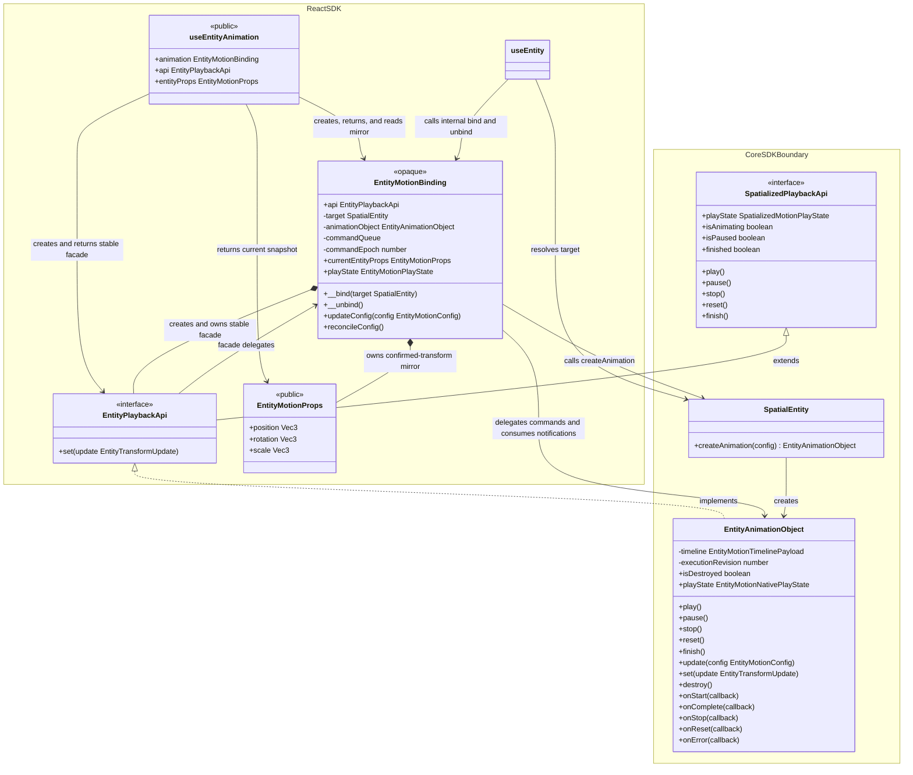
```mermaid
classDiagram
    namespace ReactSDK {
        class useEntityAnimation {
            <<public>>
            +animation EntityMotionBinding
            +api EntityPlaybackApi
            +entityProps EntityMotionProps
        }
        class EntityPlaybackApi {
            <<interface>>
            <<public>>
            +set(update EntityTransformUpdate)
        }
        class EntityMotionBinding {
            <<opaque>>
            +api EntityPlaybackApi
            -target SpatialEntity
            -animationObject EntityAnimationObject
            -commandQueue
            -commandEpoch number
            +currentEntityProps EntityMotionProps
            +playState EntityMotionPlayState
            +__bind(target SpatialEntity)
            +__unbind()
            +updateConfig(config EntityMotionConfig)
            +reconcileConfig()
        }
        class EntityMotionProps {
            <<public>>
            +position Vec3
            +rotation Vec3
            +scale Vec3
        }
        class useEntity
    }
    namespace CoreSDKBoundary {
        class SpatializedPlaybackApi {
            <<interface>>
            +play()
            +pause()
            +stop()
            +reset()
            +finish()
            +playState SpatializedMotionPlayState
            +isAnimating boolean
            +isPaused boolean
            +finished boolean
        }
        class SpatialEntity {
            +createAnimation(config) EntityAnimationObject
        }
        class EntityAnimationObject {
            -timeline EntityMotionTimelinePayload
            -executionRevision number
            +isDestroyed boolean
            +playState EntityMotionNativePlayState
            +play()
            +pause()
            +stop()
            +reset()
            +finish()
            +update(config EntityMotionConfig)
            +set(update EntityTransformUpdate)
            +destroy()
            +onStart(callback)
            +onComplete(callback)
            +onStop(callback)
            +onReset(callback)
            +onError(callback)
        }
    }
    useEntityAnimation --> EntityMotionBinding : creates, returns, and reads mirror
    useEntityAnimation --> EntityPlaybackApi : creates and returns stable facade
    useEntityAnimation --> EntityMotionProps : returns current snapshot
    EntityMotionBinding *-- EntityPlaybackApi : creates and owns stable facade
    EntityMotionBinding *-- EntityMotionProps : owns confirmed-transform mirror
    useEntity --> EntityMotionBinding : calls internal bind and unbind
    useEntity --> SpatialEntity : resolves target
    SpatializedPlaybackApi <|-- EntityPlaybackApi : extends
    EntityPlaybackApi <|.. EntityAnimationObject : implements
    EntityPlaybackApi --> EntityMotionBinding : facade delegates
    EntityMotionBinding --> SpatialEntity : calls createAnimation
    EntityMotionBinding --> EntityAnimationObject : delegates commands and consumes notifications
    SpatialEntity --> EntityAnimationObject : creates
```

#### State-event Mapping

Core `EntityAnimationObject` directly consumes one `EntityMotionStateChangedMsg` shape: `playState` updates state, while optional `callbackAction` plus complete `values` update callbacks and `entityProps`.

| scenario | `playState` | `callbackAction` / callback |
|---|---|---|
| fresh play | `running` | `start` / `onStart` |
| resume after pause | `running` | — |
| pause | `paused` | — |
| natural completion or `finish()` | `finished` | `complete` / `onComplete` |
| stop | `idle` | `stop` / `onStop` |
| reset | `idle` | `reset` / `onReset` |

`values` contain complete `position`, `rotation`, and `scale`. `set` updates `entityProps` from `SetEntityAnimationResult.values`; `EntityAnimationErrorMsg` triggers `onError`.

### 5.2 Core SDK

- **Target creation entry:** `SpatialEntity.createAnimation(config)` uses its own id, performs Entity-specific normalization and validation, sends `CreateEntityAnimation`, and returns an `EntityAnimationObject`. Ordinary `SpatializedElement.createAnimation(config)` still returns `AnimationObject`.
- **Playback interfaces:** the existing `SpatializedPlaybackApi` keeps common playback methods and state and does not contain `set`; `EntityPlaybackApi extends SpatializedPlaybackApi` and adds only `set(EntityTransformUpdate)`.
- **Animation objects:** `AnimationObject` and `EntityAnimationObject` implement their respective playback interfaces without inheriting from each other. `EntityAnimationObject` uses `SpatialObject.id`, stores the committed config, canonical timeline, and execution revision, and exposes `update(config)` plus `onXXX` debug listeners. Both `finish` and natural completion fire `onComplete`.
- **Types and functions:** Core defines entity-motion types, `EntityTransformUpdate`, `EntityMotionProps`, the property allowlist, normalization and validation functions, and the internal canonical timeline.

The `onXXX` methods on `EntityAnimationObject` only register observers; they send no control or update commands and do not change animation configuration. Their parameters align with React callbacks:

```text
onStart(listener: (values: EntityMotionProps) => void)
onComplete(listener: (values: EntityMotionProps) => void)
onStop(listener: (values: EntityMotionProps) => void)
onReset(listener: (values: EntityMotionProps) => void)
onError(listener: (error: EntityPlaybackError) => void)
```

State events trigger the first four methods, while the dedicated error event triggers `onError`. `pause` only updates playback state, so there is no `onPause`.

#### Class Diagram

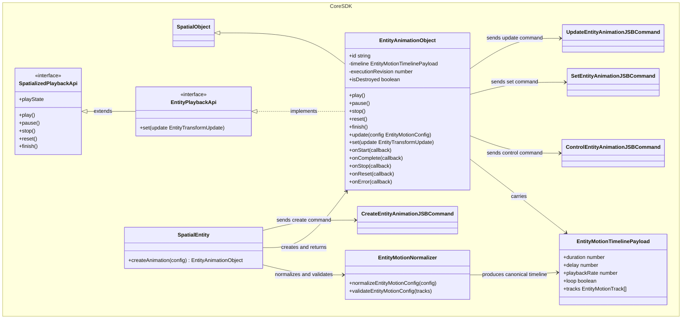
```mermaid
classDiagram
    namespace CoreSDK {
        class SpatialObject
        class SpatializedPlaybackApi {
            <<interface>>
            +play()
            +pause()
            +stop()
            +reset()
            +finish()
            +playState
        }
        class EntityPlaybackApi {
            <<interface>>
            +set(update EntityTransformUpdate)
        }
        class SpatialEntity {
            +createAnimation(config) EntityAnimationObject
        }
        class EntityMotionNormalizer {
            +normalizeEntityMotionConfig(config)
            +validateEntityMotionConfig(tracks)
        }
        class EntityMotionTimelinePayload {
            +duration number
            +delay number
            +playbackRate number
            +loop boolean
            +tracks EntityMotionTrack[]
        }
        class EntityAnimationObject {
            +id string
            -timeline EntityMotionTimelinePayload
            -executionRevision number
            +isDestroyed boolean
            +play()
            +pause()
            +stop()
            +reset()
            +finish()
            +update(config EntityMotionConfig)
            +set(update EntityTransformUpdate)
            +onStart(callback)
            +onComplete(callback)
            +onStop(callback)
            +onReset(callback)
            +onError(callback)
        }
        class CreateEntityAnimationJSBCommand
        class ControlEntityAnimationJSBCommand
        class SetEntityAnimationJSBCommand
        class UpdateEntityAnimationJSBCommand
    }
    SpatializedPlaybackApi <|-- EntityPlaybackApi : extends
    SpatialObject <|-- EntityAnimationObject
    EntityPlaybackApi <|.. EntityAnimationObject : implements
    SpatialEntity --> EntityMotionNormalizer : normalizes and validates
    EntityMotionNormalizer --> EntityMotionTimelinePayload : produces canonical timeline
    SpatialEntity --> EntityAnimationObject : creates and returns
    EntityAnimationObject --> EntityMotionTimelinePayload : carries
    SpatialEntity --> CreateEntityAnimationJSBCommand : sends create command
    EntityAnimationObject --> ControlEntityAnimationJSBCommand : sends control command
    EntityAnimationObject --> SetEntityAnimationJSBCommand : sends set command
    EntityAnimationObject --> UpdateEntityAnimationJSBCommand : sends update command
```

#### JSB Protocol

Core defines Entity-specific wire contracts for create, in-place update, control, set, state, and error messages. These protocols do not depend on the Spatialized Element animation protocol.

##### Create animation command

The create request `id` is the target Entity's `SpatialObject.id`. A successful create reply also returns only `id`, whose value is the new animation object's `SpatialObject.id`:

```text
CreateEntityAnimation {
  id: string
  timeline: EntityMotionTimelinePayload
}

CreateEntityAnimationResult {
  id: string
}
```

##### In-place animation update command

```text
UpdateEntityAnimation {
  id: string
  timeline: EntityMotionTimelinePayload
}

UpdateEntityAnimationResult {
  values: EntityMotionProps
  revision: number
}
```

A successful reply means the candidate execution definition has committed on the same Native object. Core only then replaces its current config and timeline snapshots and updates `entityProps` from `values`. A failed reply does not commit the candidate definition.

##### Control animation command

```text
ControlEntityAnimation {
  id: string
  type: 'play' | 'pause' | 'stop' | 'reset' | 'finish' | 'destroy'
}
```

A successful control reply uses an empty payload to confirm current-command completion. The binding then sends the next waiting command, while `EntityMotionStateChangedMsg` updates public `playState`.

##### Set animation transform command

```text
SetEntityAnimation {
  id: string
  update: EntityTransformUpdate
}

SetEntityAnimationResult {
  values: EntityMotionProps
}
```

`api.set` uses the dedicated set command and accepts a deeply sparse `EntityTransformUpdate`. Native merges the update, changes the Entity, and returns its complete current transform through `SetEntityAnimationResult`; Core updates `entityProps` from `values` without a state event. Calls before binding or before native animation-object creation are classified as no-ops, log a console warning, and are not stashed as later commands. JSB does not expose `resume`; a `play` received while paused makes the Native animation object resume an unchanged current controller or start the saved new definition after a paused update.

```text
type EntityMotionProps = {
  position?: Vec3
  rotation?: Vec3
  scale?: Vec3
}

type EntityTransformUpdate = {
  position?: Partial<Vec3>
  rotation?: Partial<Vec3>
  scale?: Partial<Vec3>
}
```

`EntityTransformUpdate` represents any deep subset of `EntityMotionProps`. Native merges the supplied axes. Confirmed values in playback state events and `SetEntityAnimationResult.values` both contain complete `position`, `rotation`, and `scale`, each as a complete `Vec3`.

##### State-changed event

```text
type EntityMotionNativePlayState = 'idle' | 'running' | 'paused' | 'finished'
type EntityMotionPlayState = 'queued' | EntityMotionNativePlayState

interface EntityMotionStateChangedDetail {
  id: string
  revision: number
  playState: EntityMotionNativePlayState
  callbackAction?: 'start' | 'complete' | 'stop' | 'reset'
  values?: EntityMotionProps
}

interface EntityMotionStateChangedMsg {
  type: 'spatialanimationstatechanged'
  detail: EntityMotionStateChangedDetail
}
```

Every playback-state confirmation or lifecycle callback uses the same `EntityMotionStateChangedMsg`. `revision` and `playState` are always present; messages that trigger a user callback carry both `callbackAction` and complete `values`. Explicit `finish()` and natural completion both use `callbackAction: 'complete'`. Pause and resume update state through messages containing only `id`, `revision`, and `playState`.

`queued` is a React binding state while commands await native animation-object creation. The native creation reply confirms the initial `idle` state. On creation failure, the React binding settles the public state to `idle` and terminates the current binding lifecycle. Later Native state messages confirm `idle`, `running`, `paused`, or `finished`. During a healthy binding lifecycle, the creation reply and Native state messages are the exclusive sources of public playback state. The public `finished` flag is derived from `playState === 'finished'`.

##### Entity error event and error type

State events do not carry errors. Asynchronous failures after Native accepts a command use the dedicated Entity event:

```text
interface EntityAnimationErrorDetail {
  id: string
  error: EntityPlaybackError
}

interface EntityAnimationErrorMsg {
  type: 'entityanimationerror'
  detail: EntityAnimationErrorDetail
}
```

```text
type EntityPlaybackError = {
  code:
    | 'TARGET_NOT_FOUND'
    | 'UNSUPPORTED_TARGET'
    | 'ANIMATION_NOT_FOUND'
    | 'INVALID_TIMELINE'
    | 'COMPILATION_FAILED'
    | 'INVALID_CONTROL_STATE'
    | 'INVALID_SET_VALUES'
  reason: string
}
```

The discovery phase determines error delivery:

- Synchronous Core validation of public config and method arguments throws the built-in `Error` and does not trigger `onError`.
- A JSB command failure returns through that command's reply. Core converts the reply to one `EntityPlaybackError` and triggers `onError`.
- An asynchronous native failure after a successful command reply is reported exactly once through `entityanimationerror`. Core `EntityAnimationObject` consumes the event and triggers `onError`.
- One failure chooses one outlet. State events never carry errors, preventing duplicate `onError` delivery.
- Initial animation-object creation failure terminates the current binding lifecycle. Config-update failure preserves the old execution and current binding lifecycle; other asynchronous playback errors preserve their existing state semantics.
- Calling `api.set` during active playback is an expected state rejection and remains warning + no-op without an error event or `onError`.

Users handle codes as follows:

| Code | Recommended handling |
|---|---|
| `TARGET_NOT_FOUND` | Verify that the target Entity exists and remains in a valid lifecycle, then bind again. |
| `UNSUPPORTED_TARGET` | Verify that `id` belongs to an animatable Entity and perform capability detection before creation. |
| `ANIMATION_NOT_FOUND` | Stop using the destroyed or invalid animation object, bind again, and obtain a new object `id`. |
| `INVALID_TIMELINE` | Correct timeline times, properties, keyframes, or values. Core normally catches public-config errors synchronously. |
| `COMPILATION_FAILED` | Simplify or adjust the keyframe combination Native cannot compile and record `reason` for diagnosis. |
| `INVALID_CONTROL_STATE` | Wait for an allowed state or stop playback first. The SDK converts active-playback `set` to warning + no-op. |
| `INVALID_SET_VALUES` | Correct `EntityTransformUpdate` so it contains at least one valid transform scalar. |

#### Types, normalization, and validation

Normalization is done by the shared logic layer's `normalizeEntityMotionConfig`, folding the three public authoring shapes into one internal timeline data.

**Input:** the three public authoring shapes, folded by these rules:

- **Top-level `from` / `to`** is equivalent to `timeline.from` / `timeline.to`, expanded into a start and an end frame.
- **`timeline.from` / `timeline.to`** are the `0%` / `100%` frames and may be mixed with percentage keys.
- **Percentage keyframes** `0% → 50% → 100%` are converted to seconds via `at = percentage × duration`.

The full normalization rules include `timeline` precedence, mandatory boundaries, and `duration` defaults, detailed later in this section.

**Output:** a platform-agnostic `EntityMotionTimelinePayload`, shown below:

```text
type EntityMotionTimelinePayload = {
  duration: number
  delay?: number
  playbackRate?: number
  loop?: boolean | { reverse?: boolean }
  tracks: EntityMotionTrack[]
}

type EntityMotionTrack = {
  property: EntityMotionProperty
  keyframes: EntityMotionKeyframe[]
  timingFunction?: TimingFunction
}

type EntityMotionProperty =
  | 'position.x' | 'position.y' | 'position.z'
  | 'rotation.x' | 'rotation.y' | 'rotation.z'
  | 'scale.x'    | 'scale.y'    | 'scale.z'

type EntityMotionKeyframe = {
  at: number
  value: number
  timingFunction?: TimingFunction
}
```

**v1 timing encoding convention:** The public `timingFunction` has global segment semantics, and the current payload stores it on tracks and keyframes. Core copies the top-level default to every track and copies a timeline node's override to every property keyframe produced from that node. All timing values present at the same `at` use one consistent value. Every public timeline node contains at least one supported transform scalar, which preserves the node during track normalization. Any track carrying a global node may carry that node's shared timing value. The track/keyframe fields also reserve structural room for future per-property timing; that capability will introduce matching public authoring and versioned protocol semantics.

Example:

```text
{
  duration: 1.2,
  tracks: [
    {
      property: 'position.y',
      timingFunction: 'linear',
      keyframes: [
        { at: 0, value: 0 },
        { at: 0.6, value: 0.25 },
        { at: 1.2, value: 0 },
      ],
    },
    {
      property: 'rotation.y',
      timingFunction: 'linear',
      keyframes: [
        { at: 0, value: 0 },
        { at: 1.2, value: 180 },
      ],
    },
  ],
}
```

Normalization and validation rules:

- Top-level `from` / `to` and `timeline.from` / `timeline.to` fold into the same internal tracks.
- `timeline.from` / `timeline.to` represent `0%` / `100%` and may be mixed with percentage keyframes; duplicate declarations of the same boundary produce an explicit error.
- When `timeline` and top-level `from` / `to` both appear, `timeline` is the sole effective input and development mode logs a duplicate-declaration warning.
- Pure top-level `from` / `to` uses a default `duration` of 0.3s.
- Every animation provides both start and end boundaries; fields inside those boundary frames may remain sparse, with missing scalar values falling back to the Native baseline during compilation.

#### Capability detection

Docs and examples use top-level capability detection:

```text
supports('useEntityAnimation')
```

### 5.3 Native

- **Command entry:** `SpatialScene` separately receives `CreateEntityAnimation`, `UpdateEntityAnimation`, `ControlEntityAnimation`, and `SetEntityAnimation`. All four commands look up their corresponding `SpatialObject` by `id`.
- **Execution subsystem:** after create resolves a target Entity, it calls `entity.createAnimation(config)`. Animation objects reuse `SpatialScene.spatialObjects` and the `SpatialObject` lifecycle, while `EntityMotionAnimationObject` owns per-object control and fresh/resume decisions.
- **Confirmed-value reporting:** playback lifecycle points report confirmed values through state events; `update` and `set` report confirmed values through `UpdateEntityAnimationResult` and `SetEntityAnimationResult`, respectively.
- **Error reporting:** asynchronous failures after a successful command reply use `entityanimationerror` rather than the state event.

#### Class Diagram

Readability and testability drive subsystem decomposition, and its file organization may evolve independently from the element path. The existing `SpatializedElementAnimationObject` and the new `EntityMotionAnimationObject` both inherit from `SpatialObject` and reuse the same lifecycle. They are sibling types with no direct inheritance relationship; this design does not introduce a shared Native playback interface in advance.

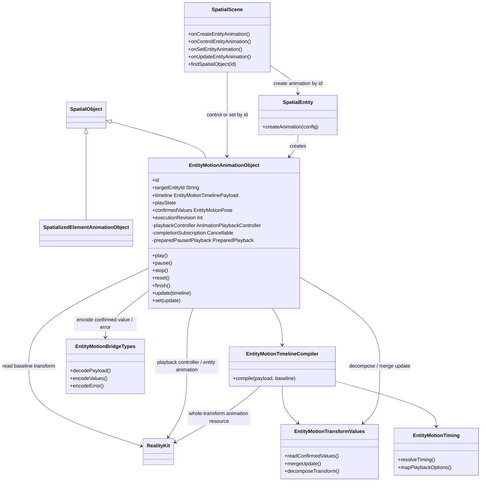
```mermaid
classDiagram
    class SpatialObject
    class SpatializedElementAnimationObject
    class SpatialScene {
        +onCreateEntityAnimation()
        +onControlEntityAnimation()
        +onSetEntityAnimation()
        +onUpdateEntityAnimation()
        +findSpatialObject(id)
    }
    class SpatialEntity {
        +createAnimation(config)
    }
    class EntityMotionAnimationObject {
        +id
        +targetEntityId String
        +timeline EntityMotionTimelinePayload
        +playState
        +confirmedValues EntityMotionPose
        +executionRevision Int
        -playbackController AnimationPlaybackController
        -completionSubscription Cancellable
        -preparedPausedPlayback PreparedPlayback
        +play()
        +pause()
        +stop()
        +reset()
        +finish()
        +update(timeline)
        +set(update)
    }
    class EntityMotionTimelineCompiler {
        +compile(payload, baseline)
    }
    class EntityMotionBridgeTypes {
        +decodePayload()
        +encodeValues()
        +encodeError()
    }
    class EntityMotionTiming {
        +resolveTiming()
        +mapPlaybackOptions()
    }
    class EntityMotionTransformValues {
        +readConfirmedValues()
        +mergeUpdate()
        +decomposeTransform()
    }
    class RealityKit

    SpatialObject <|-- SpatializedElementAnimationObject
    SpatialObject <|-- EntityMotionAnimationObject
    SpatialScene --> SpatialEntity : create animation by id
    SpatialScene --> EntityMotionAnimationObject : control or set by id
    SpatialEntity --> EntityMotionAnimationObject : creates
    EntityMotionAnimationObject --> EntityMotionTimelineCompiler
    EntityMotionTimelineCompiler --> EntityMotionTiming
    EntityMotionTimelineCompiler --> EntityMotionTransformValues
    EntityMotionAnimationObject --> RealityKit : read baseline transform
    EntityMotionAnimationObject --> EntityMotionTransformValues : decompose / merge update
    EntityMotionAnimationObject --> EntityMotionBridgeTypes : encode confirmed value / error
    EntityMotionAnimationObject --> RealityKit : playback controller / entity animation
    EntityMotionTimelineCompiler --> RealityKit : whole-transform animation resource
```

**Responsibilities per class:**

- **Target entity (`SpatialEntity`):** `createAnimation(config)` fallback-validates the create payload, constructs an animation object that stores the target and canonical timeline, and returns it to `SpatialScene` for registration. The Entity owns no animation registry or playback state.
- **Entity animation object (`EntityMotionAnimationObject`):** stores the target id and weak target reference, canonical timeline, confirmed pose, execution revision, compiled timeline, baseline, playback controller, completion subscription, and paused prepared playback. `update()` prepares and commits a new definition, then retargets or stores a paused definition according to state. `play()` resumes an unchanged paused run or starts the updated run from its saved pose. Controller identity, execution revision, and the completion gate reject stale or duplicate completion. The object emits events through `emitStateChanged()` and `emitError()`. `update` and `set` return the complete confirmed pose.
- **Timeline compiler (`EntityMotionTimelineCompiler`):** on each fresh play, accepts the canonical timeline and that run's baseline and slices and compiles them into one chained whole-transform RealityKit animation resource.
- **Bridge types (`EntityMotionBridgeTypes`):** carry the native bridge encode/decode structures, including timeline data, control values, confirmed values, and errors. If the command types are sufficient, this part may exist as a few scattered structs.
- **Playback parameter mapping (`EntityMotionTiming`):** maps the single easing already resolved for each segment, plus delay, loop, and playback rate, to the RealityKit representation; all four built-in easings map directly.
- **Transform decomposition and merge (`EntityMotionTransformValues`):** responsible for decomposing the confirmed value from the entity transform, merging the sparse `api.set` update onto the committed baseline, and converting between Euler degrees and the RealityKit rotation representation.

#### JSB Command Processing

`SpatialScene` looks up the spatial-object registry by the create request `id`:

```text
is entity -> entity.createAnimation(config)
otherwise -> UNSUPPORTED_TARGET
```

Processing rules:

- When the registry lacks the target `id`, create fails with `TARGET_NOT_FOUND`.
- After create succeeds, `SpatialScene` adds the animation object to global `spatialObjects` as a `SpatialObject`; the success reply returns that object's `id` and confirms its initial `idle` state.
- Control commands look up an `EntityMotionAnimationObject` by `id` in global `spatialObjects`. The set command uses the same lookup and separately invokes `set(update)`.
- Synchronous command errors return through the JSB reply; only asynchronous playback failures after command acceptance return through one `entityanimationerror`.
- When playback state changes, Native first sends a state message carrying the latest `playState`, then returns the successful control reply.
- When fresh-play compilation fails, the control command fails and the animation remains inactive.

The successful create reply carries only the animation object's `id` and confirms an existing object in `idle`; a failed reply confirms that no object was created and lets the binding settle to `idle`, clear pending commands, and dispatch the classified error.

Native accepts and commits `api.set` while inactive. While active, it keeps the transform unchanged and returns `INVALID_CONTROL_STATE` through the `SetEntityAnimation` reply; Core maps that result to warning + no-op without triggering `onError`.

#### Timeline compilation

Compilation is triggered by `EntityMotionAnimationObject.play()` on every fresh play: after the command is accepted and before entering delay / running, it reads the current transform as that run's baseline, slices the canonical timeline into full-pose nodes, and compiles the playback resource. Animation creation only validates and stores the canonical timeline. In an unchanged paused state, `play()` resumes the current controller without reading the baseline, compiling, or producing a new `start`; after a paused update, `play()` starts a new execution from the saved pose and produces a new `start`; loops within one run reuse that run's resource.

##### Input: internal timeline

The compilation input is exactly the normalization output `EntityMotionTimelinePayload` (structure in the section above), whose target has already been resolved to an entity.

##### Compilation flow

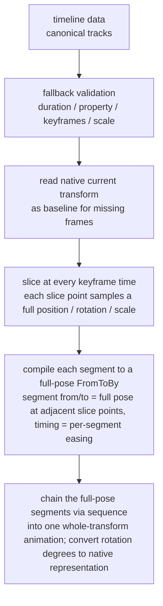
```mermaid
flowchart TB
    Payload["timeline data<br/>canonical tracks"]
    Validate["fallback validation<br/>duration / property / keyframes / scale"]
    Snapshot["read native current transform<br/>as baseline for missing frames"]
    Slice["slice at every keyframe time<br/>each slice point samples a full position / rotation / scale"]
    Segment["compile each segment to a full-pose FromToBy<br/>segment from/to = full pose at adjacent slice points, timing = per-segment easing"]
    Seq["chain the full-pose segments via sequence<br/>into one whole-transform animation; convert rotation degrees to native representation"]

    Payload --> Validate
    Validate --> Snapshot
    Snapshot --> Slice
    Slice --> Segment
    Segment --> Seq
```

##### Slicing the timeline into full-pose nodes and chaining them

The whole timeline maps to a single bind target — the entire `transform`. Take the union of all channels' keyframe times as the slice points; adjacent slice points form a segment, and every slice point samples a complete `position` / `rotation` / `scale`, so each segment is a "full pose to full pose" transition.

**Per segment — expressed with `FromToByAnimation<Transform>`.** Each segment's `from` / `to` are the full poses at the two adjacent slice points, `duration` is the segment length, `timing` is the single easing Core already resolved for that segment, and `bindTarget` is fixed to `.transform`. The visionOS animation binding granularity is the whole `.transform`, which is the root reason for choosing full-pose slicing.

**Chaining — connect end to end with `sequence`.** The full-pose segment animations are chained in time order via `AnimationResource.sequence(with:)` into a single animation, so each segment carries its own easing yet plays continuously. A timeline with only a start and an end frame becomes one `FromToByAnimation<Transform>`. `delay` / `speed` / `loop` act at the top of this chained animation.

Consider an example (`position.y` has 3 keyframes, `rotation.y` has only start and end, the slice-point union is `0 / 0.6s / 1.2s`, giving 2 segments):

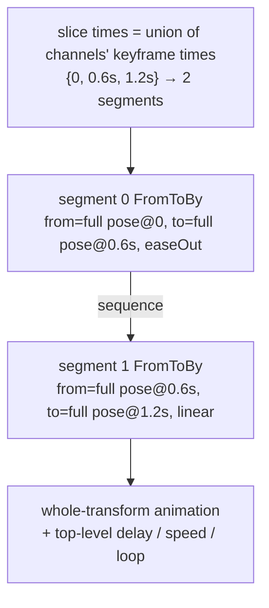
```mermaid
flowchart TB
    Slice["slice times = union of channels' keyframe times<br/>{0, 0.6s, 1.2s} → 2 segments"]
    S0["segment 0 FromToBy<br/>from=full pose@0, to=full pose@0.6s, easeOut"]
    S1["segment 1 FromToBy<br/>from=full pose@0.6s, to=full pose@1.2s, linear"]
    Clip["whole-transform animation<br/>+ top-level delay / speed / loop"]

    Slice --> S0
    S0 -->|sequence| S1
    S1 --> Clip
```

Each segment carries a full pose and joins the chain in time order; `delay` / `speed` / `loop` act at the top of the chained animation.

##### Output: the controllable playback object and sample code

The final compilation output is the controllable playback object. Reusing the example above (2 full-pose segments), the following shows it on visionOS and picoOS: each segment compiles into a full-pose `FromToBy`, chained via `sequence` into one animation resource, then handed to the engine — obtaining a playback controller that can pause / resume / stop / change speed, i.e. a "controllable playback object." Both platforms bind the whole transform, so the code lines up.

Platform capability validation on visionOS and picoOS is recorded through the Section 8 acceptance tasks, covering whole-transform binding, multi-segment sequence, per-segment easing, top-level delay / speed / loop, controller pause / internal resume / stop, and completion. The snippets below show resource construction and controller shape only; before handing the resource to the engine, `EntityMotionTiming` applies the top-level delay / speed / loop settings once to the whole sequence rather than repeating them on each segment.

visionOS (RealityKit / Swift):

```swift
import RealityKit

// Reuse the example; every slice point carries a full position / rotation / scale, only y and rotation-about-y change
let base = entity.transform

// Sample a slice point's full pose (x / z / scale frozen at baseline, only pos.y and rot.y move)
func pose(y: Float, deg: Float) -> Transform {
    var t = base
    t.translation = SIMD3(base.translation.x, y, base.translation.z)
    t.rotation = simd_quatf(angle: deg * .pi / 180, axis: SIMD3(0, 1, 0))
    return t
}

// Segment 0: full pose from t=0 to t=0.6s
let seg0 = FromToByAnimation<Transform>(
    name: "seg0",
    from: pose(y: 0,    deg: 0),
    to:   pose(y: 0.25, deg: 90),
    duration: 0.6,
    timing: .easeOut,                 // segment 0 own easing
    bindTarget: .transform            // can only bind the whole transform
)
// Segment 1: full pose from t=0.6s to t=1.2s
let seg1 = FromToByAnimation<Transform>(
    name: "seg1",
    from: pose(y: 0.25, deg: 90),
    to:   pose(y: 0,    deg: 180),
    duration: 0.6,
    timing: .linear,                  // segment 1 own easing, different from segment 0
    bindTarget: .transform
)

// Chain the full-pose segments in time order into one animation via sequence
let clip = try AnimationResource.sequence(with: [
    try AnimationResource.generate(with: seg0),
    try AnimationResource.generate(with: seg1),
])

// Controllable playback object: the controller supports pause / resume / stop / speed
let controller = entity.playAnimation(clip, transitionDuration: 0, startsPaused: true)
controller.resume()          // native-object internal start / resume; not a JSB resume command
// controller.pause()        // pause
// controller.stop()         // stop
// controller.speed = 2.0    // top-level playback rate acts on the whole chained animation
```

picoOS (Pico Spatial SDK / Kotlin):

```kotlin
import com.pico.spatial.core.ecs.Entity
import com.pico.spatial.core.ecs.TransformComponent
import com.pico.spatial.core.ecs.animation.AnimationBindTarget
import com.pico.spatial.core.ecs.animation.AnimationPlaybackController
import com.pico.spatial.core.ecs.animation.EaseType
import com.pico.spatial.core.ecs.animation.RepeatMode
import com.pico.spatial.core.ecs.animation.TweenAnimation
import com.pico.spatial.core.ecs.resource.AnimationResource
import com.pico.spatial.core.math.Quat
import com.pico.spatial.core.math.Transform
import com.pico.spatial.core.math.Vector3

fun playSequencedTransformAnimation(entity: Entity): AnimationPlaybackController {
    val transformComponent = entity.components.get(TransformComponent::class.java)
    val base = transformComponent?.let {
        Transform(it.position, it.quaternion, it.scaleVector)
    } ?: Transform()

    // Sample a slice point's full pose; x / z / scale remain at the baseline.
    fun pose(y: Float, deg: Float): Transform {
        val radians = Math.toRadians(deg.toDouble()).toFloat()
        val q = Quat(Vector3(0f, 1f, 0f), radians)
        return Transform(
            Vector3(base.position.x, y, base.position.z),
            q,
            base.scale,
        )
    }

    val seg0 = TweenAnimation.createTweenAnimation(
        name = "seg0",
        bindTarget = AnimationBindTarget.bindTransform(),
        from = pose(0f, 0f),
        to = pose(0.25f, 90f),
        by = null,
        duration = 0.6f,
        delay = 0f,
        repeatMode = RepeatMode.NONE,
        repeatCount = 0,
        easeType = EaseType.EASE_OUT,
        offset = 0f,
        speed = 1f,
        additive = false,
        trimStart = null,
        trimEnd = null,
        trimDuration = null,
    )

    val seg1 = TweenAnimation.createTweenAnimation(
        name = "seg1",
        bindTarget = AnimationBindTarget.bindTransform(),
        from = pose(0.25f, 90f),
        to = pose(0f, 180f),
        by = null,
        duration = 0.6f,
        delay = 0f,
        repeatMode = RepeatMode.NONE,
        repeatCount = 0,
        easeType = EaseType.LINEAR,
        offset = 0f,
        speed = 1f,
        additive = false,
        trimStart = null,
        trimEnd = null,
        trimDuration = null,
    )

    val clip = AnimationResource.sequence(
        with = listOf(
            AnimationResource.generateWithTweenAnimation(seg0),
            AnimationResource.generateWithTweenAnimation(seg1),
        )
    )

    val controller = entity.playAnimation(clip)
    controller.setSpeed(2f)
    return controller
}

// Use controller.pause(), controller.resume(), and controller.stop() for playback control.
```

##### Compilation rules

1. **Property allowlist:** accept only `position.*`, `rotation.*`, `scale.*`. `opacity`, material, component properties, etc. all fail explicitly.
2. **Time range:** `duration` must be positive; each keyframe's `at` must fall within `[0, duration]`.
3. **Ordering and duplicates:** each track's keyframes are sorted non-decreasing by `at`; each property maps to one unique track.
4. **Slice times are the union across channels:** take the union of all channels' keyframe times as the timeline's slice points; adjacent slice points form a segment. For example `position.y` at `0, 0.6, 1.2` and `rotation.y` at `0, 1.2` give the union `0, 0.6, 1.2`, cut into `[0, 0.6]` and `[0.6, 1.2]`.
5. **Sparse channel completion:** the compiler generates a full pose at every slice point. Values interpolate linearly between adjacent keyframes; a late first keyframe interpolates from the baseline at time zero; values after the final keyframe hold its value; remaining components use the baseline throughout playback.
6. **Serial chaining of full poses:** adjacent slice points form a full-pose `FromToByAnimation<Transform>`, and the segments are chained in time order via `sequence` into one whole-transform animation, all bound to the whole transform (`bindTarget: .transform`); see "Slicing the timeline into full-pose nodes and chaining them."
7. **Rotation:** `rotation.*` input is Euler degrees; at compile time it is converted to the rotation representation RealityKit requires, and RealityKit applies shortest-path spherical interpolation. If a rotation channel's single-frame increment reaches or exceeds 180°, or spans multiple axes, the actual path may differ from per-axis intuition; users define a specific multi-turn or multi-axis path through explicit intermediate keyframes.
8. **Scale:** `scale.*` must be non-negative; an invalid scale fails outright.
9. **One easing per segment:** public-authoring `timingFunction` belongs to a global timeline node. In v1, Core duplicates that global value into the existing track/keyframe fields and guarantees one consistent timing value at each `at`; Native accepts this consistent global-timing form. Native resolves one timing value for each adjacent pair in the keyframe-time union and applies it exactly once when constructing the final whole-transform segment. Slice-point value sampling uses linear time interpolation, while final segment playback applies easing. The closed easing enum is `linear` / `easeIn` / `easeOut` / `easeInOut`, with every value mapping directly to a RealityKit built-in curve.
10. **Loop / playback rate / delay:** these playback parameters live at the top of the timeline and apply uniformly to the whole chained animation, executed by the RealityKit playback layer. Loops within one fresh play reuse that run's resource without reading a new baseline or recompiling on every iteration.
11. **Explicit failure:** when a segment is outside RealityKit's expression range, the fresh-play control command must fail and leave the animation inactive.

The cross-platform capability combinations above depend on the Section 8 acceptance records; this design does not introduce an SDK-managed segment-queue fallback. Acceptance records include platform versions, SDK versions, fixtures, executed commands, and results.

#### Transform decomposition and confirmed-value reporting

The values native reports back to React must be in the entity API shape:

```text
type EntityMotionProps = {
  position?: Vec3
  rotation?: Vec3
  scale?: Vec3
}
```

Decomposition rules:

- `start`, `stop`, `reset`, `finish`, natural completion, and successful `set` first complete their corresponding transform commit and then read the Entity's complete current transform again. That readback is the shared source for state-message `values`, callback values, and `SetEntityAnimationResult.values`.
- `position` comes from the translation part of the native transform.
- `scale` comes from the scale part of the native transform.
- `rotation` uses Euler degrees in the Entity's parent-relative local, right-handed coordinate system, where +X points right, +Y points up, and +Z points toward the viewer. Composition uses ZYX intrinsic rotation, equivalent to XYZ extrinsic rotation, with matrix order `Rz × Ry × Rx`. Confirmed native rotation is decomposed from its rotation matrix with `y` in `[-90°, 90°]` and `x` / `z` in `(-180°, 180°]`; at gimbal lock, `z` is fixed to `0°` and `x` is derived from the matrix. Equivalent quaternions therefore produce the same Euler result. A sparse `api.set` rotation update merges onto this canonical complete Euler baseline before recomposition.
- After decomposition, report the complete committed transform independently of the animation config and the fields written by `api.set`.
- Both callback values and `entityProps` use `EntityMotionProps`; every confirmed value contains complete `position`, `rotation`, and `scale` values, each as a complete `Vec3`. `api.set(update)` accepts a deeply sparse `EntityTransformUpdate`. For example, after axis-wise merging `set({ position: { y: 0.3 } })`, the confirmed result contains the complete position, rotation, and scale.

#### Native Internal Sequences

**Create sequence:**

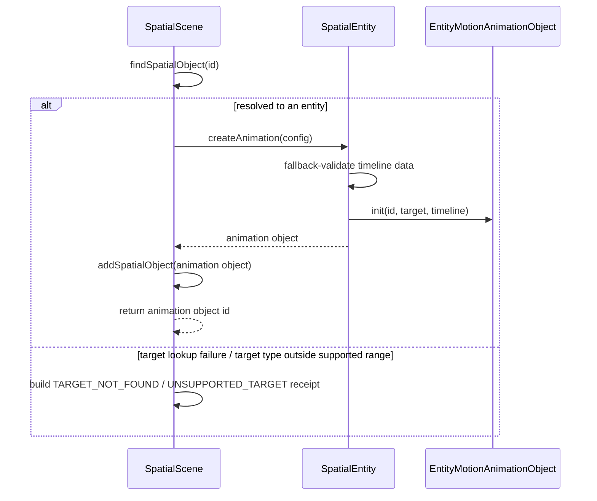
```mermaid
sequenceDiagram
    participant Scene as SpatialScene
    participant Entity as SpatialEntity
    participant Obj as EntityMotionAnimationObject

    Scene->>Scene: findSpatialObject(id)
    alt resolved to an entity
        Scene->>Entity: createAnimation(config)
        Entity->>Entity: fallback-validate timeline data
        Entity->>Obj: init(id, target, timeline)
        Entity-->>Scene: animation object
        Scene->>Scene: addSpatialObject(animation object)
        Scene-->>Scene: return animation object id
    else target lookup failure / target type outside supported range
        Scene->>Scene: build TARGET_NOT_FOUND / UNSUPPORTED_TARGET receipt
    end
```

**Play and complete sequence:**

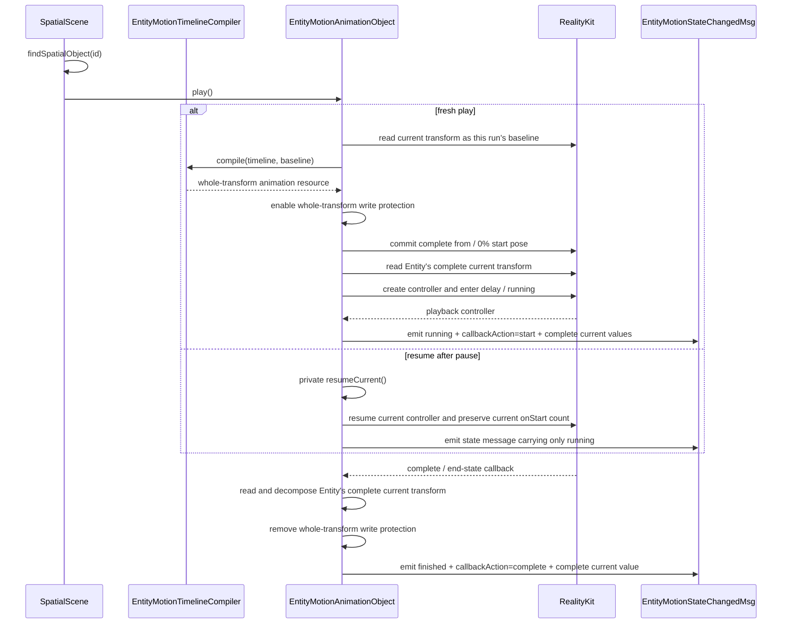
```mermaid
sequenceDiagram
    participant Scene as SpatialScene
    participant Compiler as EntityMotionTimelineCompiler
    participant Obj as EntityMotionAnimationObject
    participant RK as RealityKit
    participant Event as EntityMotionStateChangedMsg

    Scene->>Scene: findSpatialObject(id)
    Scene->>Obj: play()
    alt fresh play
        Obj->>RK: read current transform as this run's baseline
        Obj->>Compiler: compile(timeline, baseline)
        Compiler-->>Obj: whole-transform animation resource
        Obj->>Obj: enable whole-transform write protection
        Obj->>RK: commit complete from / 0% start pose
        Obj->>RK: read Entity's complete current transform
        Obj->>RK: create controller and enter delay / running
        RK-->>Obj: playback controller
        Obj->>Event: emit running + callbackAction=start + complete current values
    else resume after pause
        Obj->>Obj: private resumeCurrent()
        Obj->>RK: resume current controller and preserve current onStart count
        Obj->>Event: emit state message carrying only running
    end
    RK-->>Obj: complete / end-state callback
    Obj->>Obj: read and decompose Entity's complete current transform
    Obj->>Obj: remove whole-transform write protection
    Obj->>Event: emit finished + callbackAction=complete + complete current value
```

Create only stores the canonical timeline; `SpatialScene` registers the animation object and returns its `id`. Each fresh play reads the latest baseline and compiles that run's RealityKit resource, then commits and confirms the complete start pose. `start` and the first `entityProps` update happen after that confirmation without waiting for delay to end. With no config update, a `play` after pause reuses the current resource and controller without reading the baseline, compiling, or producing another `start`; after a paused update it follows the new-execution path.

State-command matrix:

| Native state | `play` | `pause` | `stop` | `reset` | `finish` | `set` |
|---|---|---|---|---|---|---|
| `idle` | fresh play → `running`; emit `callbackAction: start` after start-pose confirmation | keep `idle` | keep `idle` | commit start pose → `idle`; emit `callbackAction: reset` | commit end pose → `finished`; emit `callbackAction: complete` | commit update; keep `idle` |
| `running` (including delay) | keep current run | → `paused`; emit paused state message | commit current pose → `idle`; emit `callbackAction: stop` | commit start pose → `idle`; emit `callbackAction: reset` | commit end pose → `finished`; emit `callbackAction: complete` | keep current run; warning receipt |
| `paused` | resume current controller → `running`; emit running state message | keep `paused` | commit current pose → `idle`; emit `callbackAction: stop` | commit start pose → `idle`; emit `callbackAction: reset` | commit end pose → `finished`; emit `callbackAction: complete` | keep paused run; warning receipt |
| `finished` | fresh play → `running`; emit `callbackAction: start` after start-pose confirmation | keep `finished` | keep `finished` | commit start pose → `idle`; emit `callbackAction: reset` | keep `finished` | commit update; keep `finished` |

For `reset` and `finish`, an existing run supplies its confirmed start and end poses. Before the first run, the compiler reads the current native transform as the baseline on demand and computes the configured start or end pose. `finish` always commits the configured `to` / `100%` pose for ordinary, reset-loop, and reverse-loop playback.

Lifecycle gates provide these callback counts: one `onStart` for each accepted fresh play; one `onComplete` when the animation naturally enters `finished`, or when `finish()` moves it from `idle`, `running`, or `paused` to `finished`; one `onStop` for each accepted transition from `running` / `paused` to `idle`; and one `onReset` for each accepted `reset`. An accepted `finish` in `idle` preserves the existing `onStart` count. Repeated commands that keep the current state also keep the existing callback counts.

**Pause sequence:**

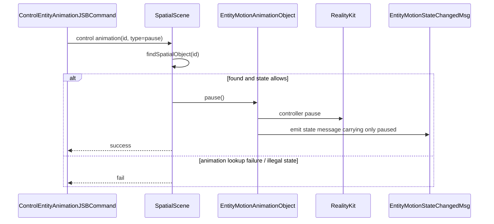
```mermaid
sequenceDiagram
    participant JSB as ControlEntityAnimationJSBCommand
    participant Scene as SpatialScene
    participant Obj as EntityMotionAnimationObject
    participant RK as RealityKit
    participant Event as EntityMotionStateChangedMsg

    JSB->>Scene: control animation(id, type=pause)
    Scene->>Scene: findSpatialObject(id)
    alt found and state allows
        Scene->>Obj: pause()
        Obj->>RK: controller pause
        Obj->>Event: emit state message carrying only paused
        Scene-->>JSB: success
    else animation lookup failure / illegal state
        Scene-->>JSB: fail
    end
```

**Stop, reset, finish sequence:**

```mermaid
sequenceDiagram
    participant JSB as ControlEntityAnimationJSBCommand
    participant Scene as SpatialScene
    participant Obj as EntityMotionAnimationObject
    participant RK as RealityKit
    participant Event as EntityMotionStateChangedMsg

    JSB->>Scene: control animation(id, type=stop/reset/finish)
    Scene->>Scene: findSpatialObject(id)
    alt found
        Scene->>Obj: stop() / reset() / finish()
        Obj->>RK: read current transform or compute end-state transform
        Obj->>RK: stop current business playback controller
        Note over RK: unrelated Entity and descendant animations keep playing
        Obj->>RK: commit target transform with zero duration
        Obj->>Obj: read and decompose Entity's complete current transform
        Obj->>Obj: remove whole-transform write protection
        Obj->>Event: stop/reset carry their callbackAction; finish carries callbackAction=complete; all carry complete current values
        Scene-->>JSB: success
    else id is absent
        Scene-->>JSB: fail(ANIMATION_NOT_FOUND)
    end
```

**set sequence:**

```mermaid
sequenceDiagram
    participant Core as EntityAnimationObject
    participant JSB as SetEntityAnimationJSBCommand
    participant Scene as SpatialScene
    participant Obj as EntityMotionAnimationObject
    participant RK as RealityKit

    Core->>JSB: execute(id, update)
    JSB->>Scene: set animation transform(id, update)
    Scene->>Scene: findSpatialObject(id)
    alt id is absent
        Scene-->>JSB: fail(ANIMATION_NOT_FOUND)
    else animation delayed / playing / paused
        Scene-->>JSB: fail(INVALID_CONTROL_STATE)
        Note over JSB: Core maps to warning + no-op; no onError
    else animation idle / at end state
        Scene->>Obj: set(update)
        Obj->>RK: read current transform as committed baseline
        Obj->>Obj: merge sparse update onto baseline
        Obj->>RK: commit merged transform with zero duration
        Obj->>Obj: read and decompose Entity's complete current transform
        Obj-->>Scene: EntityMotionProps
        Scene-->>JSB: success({ values })
        JSB-->>Core: SetEntityAnimationResult
        Core->>Core: update entityProps from values
    end
```

Pause reuses the compiled whole-transform chain, controls the current playback controller, and keeps whole-transform write protection active. Stop / reset / finish stop that controller, commit the target pose with zero duration, and remove the protection before reporting the resulting complete transform. Natural completion performs the same removal before its `complete` event. While inactive, `set` merges the sparse update onto the committed transform, commits it with zero duration, and returns the Entity's complete current transform through the success reply. `set` preserves the existing `playState` and emits no state event.

A native Entity animation object has the same lifecycle as one target binding. When the target is destroyed, `SpatialScene` cascades destruction to associated animations through the global `SpatialObject` lifecycle and sends `objectdestroy` for each animation id. Core consumes that message, marks the animation object destroyed, and unregisters the event receiver for that animation id. Later playback completes locally as a no-op; `set` logs a warning and completes locally as a no-op while preserving the existing `onError` count. In-flight commands continue to use the `ANIMATION_NOT_FOUND` race result.

Boundary constraint: `SpatialScene` owns global `spatialObjects`, create-target lookup, animation-object lookup, the four Entity command replies, and the `SpatialObject` lifecycle. `SpatialEntity.createAnimation(config)` creates Entity animation objects; `EntityMotionAnimationObject` owns per-object update, compilation, playback state, controls, confirmed values, event emission, and resource release. Entity and Element paths keep separate protocols while sharing the global `spatialObjects` lifecycle.

## 6. Risk Assessment

| Risk | Mitigation |
|---|---|
| Platform capability validation lacks traceable records | Section 8 acceptance tasks record platform versions, SDK versions, fixtures, executed commands, and results |
| Controller-scoped stop affects unrelated animations on the same Entity or descendants | Native cleanup stops only the controller held by the current `EntityMotionAnimationObject`; 8.4/8.5 cover unrelated animations remaining active |
| Zero-duration pose commits affect unrelated animations or terminal state | The command matrix bounds commits for `stop` / `reset` / `finish` / `set`; 8.4/8.5 cover terminal commits |
| Missing transform write protection lets React writes override active animation | `SpatialScene` checks the animating mask at the ordinary Entity transform update entry; stop, reset, finish, natural completion, unbind, and destruction remove the protection; 4.3/8.2 cover the behavior |
| Config update fails after the old execution has already been damaged | Native completes every potentially failing candidate-preparation step before stopping the old controller; failure atomically preserves the old execution, and Section 9 covers RealityKit feasibility plus rollback tests |
| Using `id` in both create requests and replies causes semantic confusion | Protocol direction fixes the meaning: request means target Entity id, reply means animation-object id; Core/native contract tests assert both |
| State and error events report the same failure twice | Each failure chooses either a command reply or `entityanimationerror`; state events carry no errors |
| The four Entity JSB commands drift between Core and Native | Bridge contract tests separately cover create, update, control, set, and both event types |
