## 背景

`proposal.md` 是公共 API surface 的唯一主来源,`specs/` 是规范性行为的唯一主来源。本文档只描述实现目标态所需的**实现架构**,不重复公共 API 契约,也不重复行为需求。

本次重设计把 `useEntityAnimation` 变成共享 `useAnimation` 运动家族之上的 Entity 适配器(`useEntityAnimation = useAnimation 配置 + Entity props outlet`)。它新增百分比 `timeline`、`entityProps` outlet、`api.set`,以及 `animation` 绑定。这是一次非破坏性增强。

## 设计原则

### Native 是唯一权威数据源

Entity motion 的 transform 状态以 native RealityKit backend 为唯一权威数据源。React 不维护独立的 committed cache、pending state 或第二份可竞争的 transform source。

`entityProps` 是 native 已确认 transform 状态的 React mirror outlet:

```text
React config / api.set
  -> native Entity motion backend(唯一权威)
  -> confirmed transform state
  -> entityProps mirror outlet
```

这意味着:

- 播放、终止、reset、finish、`api.set` 等会改变 transform 的操作都必须先进入 native。
- native 拒绝命令时,对应写入无效,`entityProps` 不更新。
- native 接受命令时,通过现有 animation state event 回传确认后的 transform,React 再更新 `entityProps`。
- React 侧只负责把 native 确认过的状态镜像给用户,不自行预测终态、不排队 replay 活跃期间的写入。
- 首个 confirmed state 之前 `entityProps` 可能为空;confirmed 之后它镜像动画系统已接管的 transform 分量(被动画的分量,加上 `api.set` 写入的分量),字段范围限定在 `position` / `rotation` / `scale` 之内,未被接管的分量不进入 `entityProps`。

### 复用 `useAnimation` 架构

`useEntityAnimation` 应尽可能复用 `useAnimation` 的 binding / target resolution / `AnimationObject` lifecycle / create-control-event 链路。Entity 差异被限制在 Entity-specific surface 与 native manager 边界:

- authoring: `position` / `rotation` / `scale`
- validation: transform-only,拒绝 `opacity`
- outlet: `entityProps`,不是 CSS `style`
- target type: `SpatialEntity`
- native execution: RealityKit Entity backend

## Goals / Non-Goals

**Goals:**
- 定义在 RealityKit backend 上实现 proposal 目标态 API 的 React / Core / Native 三层架构
- 明确 config -> canonical tracks -> native transform 的数据流
- 明确 native confirmed transform -> `entityProps` mirror 的写回流
- 明确复用现有 `CreateSpatializedElementAnimationJSBCommand` / `ControlSpatializedElementAnimationJSBCommand`,不新增平行 Entity JSB
- 明确 `AnimationObject` 从 element-only 泛化为 target-aware motion object 模型

**Non-Goals:**
- 重复 `proposal.md` 中的公共 API 定义
- 重复 `specs/` 中的规范性行为
- 设计 CADisplayLink 采样器 backend(明确未采用,见 Backend 理由)
- 提供公共 seek / scrub / progress API(proposal Non-Goal)
- 新增 `CreateEntityAnimationJSBCommand` / `ControlEntityAnimationJSBCommand`

## Backend 理由(RealityKit)

Backend 决策:原生执行 backend 为 **RealityKit**。

保留 RealityKit 的原因:

1. **Entity 路径本来就能用。** 现有 `useEntityAnimation` 已经通过 RealityKit 驱动实体动画,所以这是延续,不是重写。
2. **它天生就是 3D 实体的执行引擎。** 驱动实体 transform 正是 RealityKit 动画系统的本职;当大量实体并发动画时,引擎原生播放比 SDK 逐帧写入扩展性更好。
3. **proposal 的播放 + 上报需求都能达到。** RealityKit controller 可控制播放状态,`entity.transform` 可在 native 侧读取,`AnimationEvents.PlaybackCompleted` 提供完成事件。这足以实现 `stop`、`reset`、`finish`,并把 native 确认后的 transform 上报给 callbacks 和 `entityProps`。

主要新增成本是 **canonical tracks -> RealityKit Entity timeline 编译器**。它负责把 JS/Core 归一化后的 Entity tracks 编译成 RealityKit 可执行的 transform animation。

### 为什么否决 Plan B(全 CADisplayLink 采样器)

Plan B 是把整条 Entity 路径改用 CADisplayLink 逐帧采样器而非 RealityKit。除了逐帧性能更差、要放弃现有 RealityKit 实现之外,以下理由即使性能打平也仍成立:

- **与 RealityKit 渲染帧不同步。** CADisplayLink 写入的 transform 与 RealityKit 自己的 render / commit loop 不在同一节拍上,容易出现抖动、撕裂或单帧延迟。
- **visionOS 合成器语义。** RealityKit 动画可参与系统合成与 reprojection;CPU 采样器产出的离散姿态无法获得同等语义。
- **脱离场景图 / anchoring / 物理体系。** RealityKit transform 动画天然处于场景图、坐标空间、anchor、碰撞体系内。
- **插值质量。** 旋转需要四元数 slerp;手写 Euler 逐帧 lerp 容易出现插值伪影。
- **重复实现播放语义。** easing、loop、delay、playbackRate、pause/resume、完成事件都要重新实现。
- **与 motion family 分裂。** spatialized element 路径已使用 native-backed animation object;Entity 单独采样会让同一 motion API 出现两套执行语义。

混合变体(部分形态走 RealityKit、部分走采样器)同样不采用:一套 Entity API 必须只承载一种执行语义。

## 分层架构

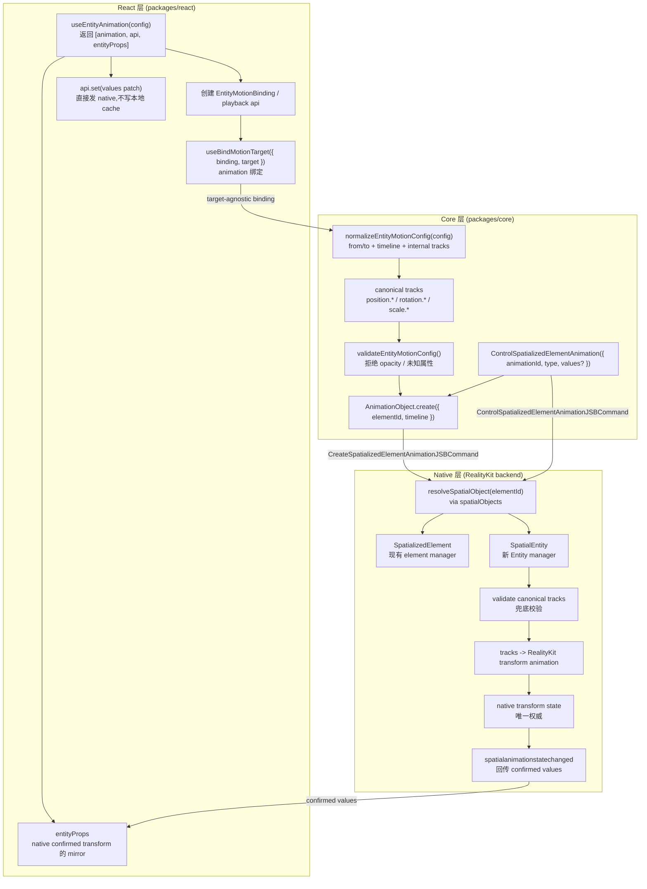

**各层职责:**

- **React** 负责 hook API、binding 生命周期、`entityProps` mirror、callback 分发和 rerender。React 不维护独立 transform cache。
- **Core** 负责把公共编写形态(`from`/`to`、百分比 `timeline`)和内部 `tracks` 归一化为 canonical Entity tracks。`AnimationObject` 保留现有 wire 字段 `elementId`,其目标态含义是 spatial object id。
- **Native** 负责 target resolution、兜底校验、RealityKit 编译与执行、命令接受/拒绝、最终 transform 拆解与事件回传。

## JSB 协议

目标态复用现有 JSB command type,不新增平行 Entity JSB:

- `CreateSpatializedElementAnimationJSBCommand`
- `ControlSpatializedElementAnimationJSBCommand`
- `spatialanimationstatechanged` event

旧 `AnimateTransformJSBCommand` 是内部实现协议,不是公开承诺 API。目标态直接删除它;因其非公开 API,不构成 public breaking change。

### CreateSpatializedElementAnimation

命令名与 `elementId` 字段都保留以兼容现有链路。目标态里,`elementId` 是历史 wire 字段名,实际含义是 spatial object id;它可以指向 `SpatializedElement`,也可以指向 `SpatialEntity`。

```text
CreateSpatializedElementAnimation {
  elementId: string
  timeline: EntityMotionTimeline | SpatializedMotionTimeline
}
```

Native 通过 `elementId` 查 `spatialObjects`,再按运行时类型分发:

```text
spatial object is SpatializedElement -> existing spatialized element manager
spatial object is SpatialEntity      -> EntityMotionManager
otherwise                           -> failure
```

如果 `elementId` 在 `spatialObjects` registry 中找不到,create MUST 显式失败,不能静默排队。若查到的 spatial object 类型不是 `SpatializedElement` 或 `SpatialEntity`,create MUST 以 unsupported animation target 失败。`ControlSpatializedElementAnimation` 不重复携带 `elementId`;它只通过 `animationId` 找已创建的 animation object。若目标 spatial object 已销毁,关联 animation MUST 被销毁或失效,后续 control MUST 失败并通过 command failure / error event 暴露,不能 silent no-op。

### ControlSpatializedElementAnimation

控制命令继续复用现有 command type,并增加 `set` 控制类型:

```text
ControlSpatializedElementAnimation {
  animationId: string
  type: 'play' | 'pause' | 'resume' | 'stop' | 'reset' | 'finish' | 'destroy' | 'set'
  values?: EntityMotionPatch
}
```

`api.set` 不新增 JSB。它只接受 `EntityMotionPatch` object(写入侧 patch 类型，与读取侧 `EntityMotionProps` 同形态),不支持 `(prev) => next` updater 形式。它发送 `type: 'set'` 到 native:

- native 拒绝:命令失败或 error event,`entityProps` 不更新。
- native 接受:native 基于当前 committed `entity.transform` 合并 patch、应用 transform 后,通过 `spatialanimationstatechanged` 回传 confirmed values,React 再更新 `entityProps`。

### spatialanimationstatechanged

事件通道继续复用:

```text
detail: {
  animationId: string
  action: 'start' | 'complete' | 'stop' | 'reset' | 'finish' | 'set' | 'failed' | ...
  playState: 'idle' | 'queued' | 'running' | 'paused' | 'finished'
  finished: boolean
  values?: SpatializedVisualValues | EntityMotionProps
  error?: SpatializedPlaybackError
}
```

`values` 是 target-specific:

- spatialized target: `SpatializedVisualValues`
- Entity target: `EntityMotionProps`(`position` / `rotation` / `scale`)

### `values` 判型与丢弃过期事件

消费方 MUST NOT 依赖事件上的新字段来判断 `values` 是 `SpatializedVisualValues` 还是 `EntityMotionProps`。事件携带 `animationId`;接收方以 `animationId` 反查本地为该 id 创建的 animation object,用该对象已知的 target 类型来解释 `values`。若 `animationId` 匹配不到任何存活的本地 animation object(未知或过期,例如 `destroy` 之后),该事件 MUST 被丢弃、不分发,且 MUST NOT 更新 `entityProps`。

### `SpatializedPlaybackError`

`action` 为 `'failed'` 时携带 `error`。`SpatializedPlaybackError.code` 是两类 target 共享的封闭分类集合:

```text
type SpatializedPlaybackError = {
  code:
    | 'TARGET_NOT_FOUND'           // elementId 不在 spatial object registry 中
    | 'UNSUPPORTED_TARGET'         // 解析到的对象既不是 SpatializedElement 也不是 SpatialEntity
    | 'TARGET_DESTROYED'           // spatial object 已销毁,动画失效
  message?: string
}
```

以上都会通过 `onError` 回调抵达用户。被拒绝的 `api.set` 写入(活跃动画期间,或绑定 / native object 创建之前)是例外:它们是 no-op,只输出 console warning,不路由到 `onError`。`code` MUST 可区分,以便应用代码按失败类型分支,而不是解析 `message`。

## 数据流

### 编写配置 -> native transform(play)

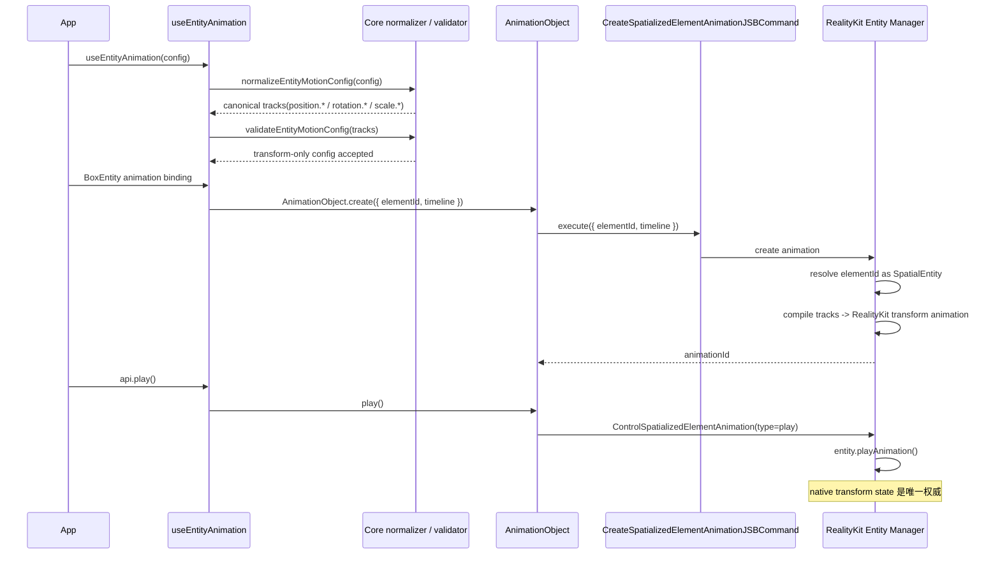

### native confirmed transform -> React mirror

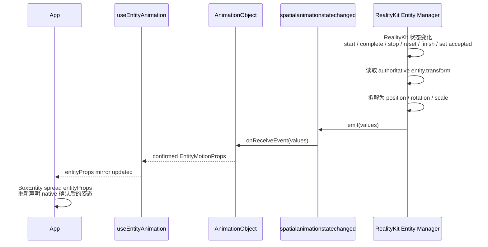

### api.set

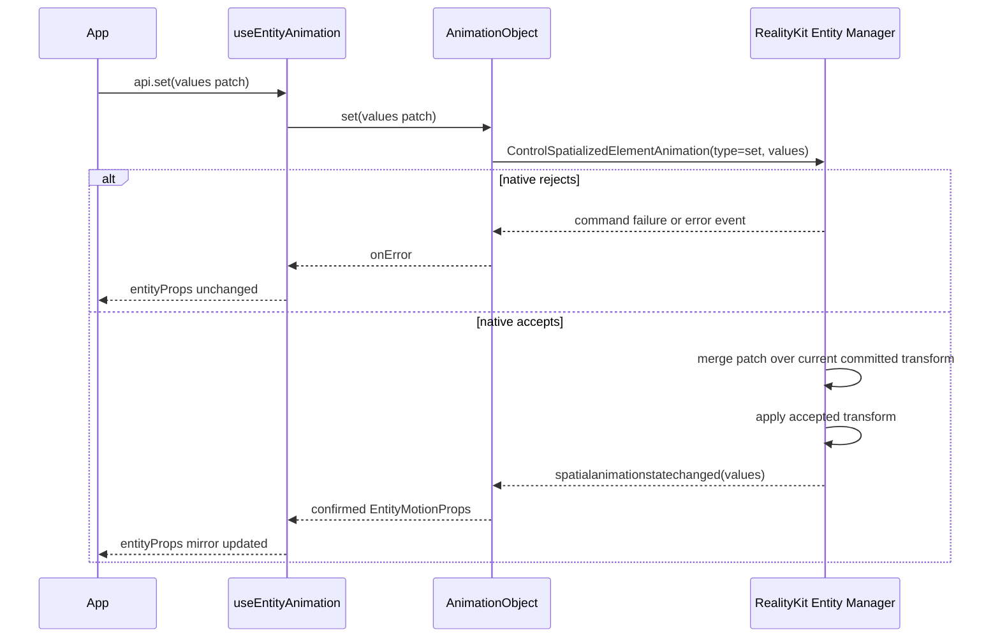

`api.set` 不是 playback 命令,不 seek、不 start、不改变播放进度。它也不写本地 pending state;native 是唯一决定该写入是否生效的地方。活跃动画期间 native 不暂存 set patch,未绑定或 native object 尚未创建前的 set 也无效;这些失败通过既有 command failure / error event 暴露,且不会更新 `entityProps`。`create` / bind 不会额外 emit 初始 confirmed value,因此首个 lifecycle 提交(一次 play 终态或被接受的 set)之前 `entityProps` 可能为空,也不承诺 mount 时即可读。

## Entity tracks 与 RealityKit 编译

Native Entity motion manager 只接受 JS/Core 已归一化的 canonical Entity timeline payload。该 payload 是内部形态,不是 public hook config。Native 不解析百分比 key,也不把 `from` / `to` 再次脱糖;这些都属于 JS/Core normalizer 的职责。

### 输入

输入是一份 target 已经解析为 Entity 的 timeline payload:

```text
type EntityMotionTimelinePayload = {
  duration: number
  delay?: number
  playbackRate?: number
  loop?: boolean | { reverse?: boolean }
  tracks: EntityMotionTrack[]
}

type EntityMotionTrack = {
  property: EntityMotionProperty
  keyframes: EntityMotionKeyframe[]
  timingFunction?: TimingFunction
}

type EntityMotionProperty =
  | 'position.x' | 'position.y' | 'position.z'
  | 'rotation.x' | 'rotation.y' | 'rotation.z'
  | 'scale.x'    | 'scale.y'    | 'scale.z'

type EntityMotionKeyframe = {
  at: number
  value: number
  timingFunction?: TimingFunction
}
```

示例输入:

```text
{
  duration: 1.2,
  tracks: [
    {
      property: 'position.y',
      keyframes: [
        { at: 0, value: 0 },
        { at: 0.6, value: 0.25 },
        { at: 1.2, value: 0 },
      ],
    },
    {
      property: 'rotation.y',
      keyframes: [
        { at: 0, value: 0 },
        { at: 1.2, value: 180 },
      ],
    },
  ],
}
```

### 输出

输出不是 React state,而是 native 可执行计划和执行后的 confirmed values:

```text
EntityMotionTimelinePayload
  -> EntityChannelAnimationPlan(per-channel)
  -> RealityKit AnimationResource[] + AnimationGroup
  -> spatialanimationstatechanged(values)
```

`EntityChannelAnimationPlan` 是 Native manager / compiler 内部执行计划,不作为 JS/Core 公共类型。它按 **transform channel** 组织,每个 channel 携带自己的 keyframes 和 per-keyframe timing function,而不是把所有 channel 合并成共享同一段边界的 segment:

```text
type EntityChannelAnimationPlan = {
  duration: number
  delay: number
  playbackRate: number
  loop?: boolean | { reverse?: boolean }
  channels: EntityChannelPlan[]
}

type EntityChannelPlan = {
  channel: EntityMotionProperty   // position.x / rotation.y / scale.z ...
  baseline: number                // 播放起点该 channel 的 native 值,缺帧时使用
  keyframes: EntityChannelKeyframe[]
}

type EntityChannelKeyframe = {
  at: number
  value: number
  timingFunction: TimingFunction  // 该关键帧到下一关键帧区间使用的 timing
}
```

**为什么按 channel 而不是按 segment:**

如果把所有 channel 合并到共享的时间段(segment),每段只能携带一个 `timingFunction`。但同一时间段内不同 channel 可能需要不同 timing function(例如 `position.y` 用 `easeOut`、`rotation.y` 用 `linear`),单一 slot 无法同时表达两条曲线——一旦按 segment 合并,per-channel 的 timing 信息在进入 RealityKit 前就已经丢失。逐帧 per-track 采样的 CADisplayLink element 路径不存在这个问题,因为每条 track 独立取自己的 timing。

因此保留 per-channel 结构:每个 channel 单独编译成一个 RealityKit animation(携带自己的 timing function),再通过 `AnimationGroup` 并行播放,并绑定到对应 sub-target(translation / orientation / scale)。这样 per-channel timing 在整条链路上都不丢失,与 element 路径语义一致。

### 编译流程

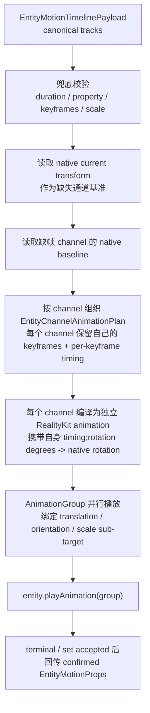

### 编译规则

1. **Property whitelist:** 只接受 `position.*`、`rotation.*`、`scale.*`。`opacity`、`transform.translate.*`、material / component property 等都必须显式失败。
2. **时间范围:** `duration` 必须为正数;每个 keyframe 的 `at` 必须在 `[0, duration]` 内。
3. **排序与重复:** 每条 track 的 keyframes 必须按 `at` 非递减排序;同一 property 不允许重复 track。
4. **时间轴与 keyframe 区间:** 每个 channel 按自己的 keyframe times 形成区间,不与其它 channel 共享全局 segment 边界。例如某 channel 的 `0, 0.6, 1.2` 只影响该 channel 自己的 `[0, 0.6]` 与 `[0.6, 1.2]` 两个区间。
5. **缺帧 baseline 与非动画分量:** 每个 channel 独立编译。若某 channel 在 `0` 时刻没有显式 keyframe,使用播放起点该 channel 的 native current transform 值作为 baseline;若晚于该 channel 最后一个 keyframe,保持最后一个 keyframe 值。channel 之间不共享边界,也不互相插值。**分量粒度区分两种缺帧:**(a)*被动画分量内的非动画标量*——例如只动画 `position.y`,则 `position.x` / `position.z` 因 RealityKit translation sub-target 被整体绑定而以 baseline 冻结;(b)*完全未出现的分量*——例如 config 没有任何 `scale.*`,则不为 scale sub-target 生成 animation,scale 不被动画持有,动画期间仍由 React props 驱动。
6. **Per-channel 并行:** 每个 channel 编译为独立的 RealityKit animation,通过 `AnimationGroup` 并行播放并绑定到对应 sub-target(translation / orientation / scale)。Native 不把多个 channel 合并成共享 timing 的 segment,以保证 per-channel timing function 不丢失。
7. **Rotation:** `rotation.*` 输入单位是 Entity API 的 Euler degrees。Native 编译时转换为 RealityKit transform 所需的旋转表示,避免用 Euler 做逐帧插值。由于 RealityKit 以最短路径四元数 slerp 插值 orientation,某个 rotation channel 若关键帧增量 ≥180° 或跨多轴,其路径可能与逐轴 Euler 直觉不同;需要特定的多圈或多轴路径时,应显式补充中间关键帧。
8. **Scale:** `scale.*` 必须为非负数。非法 scale 直接失败。
9. **Timing function(per-channel):** keyframe 级 `timingFunction` 优先于 track 级,track 级优先于 timeline 默认值。解析后的 per-keyframe timing 保留在各 channel 的 keyframe 上,由该 channel 自己的 RealityKit animation 携带,不与其它 channel 合并。因此同一时间段内不同 channel 使用不同 timing function 是原生支持的,不再需要 segment 合并,也不会出现无法表达而降级的情况。对于 RealityKit 内建 timing(linear / easeIn / easeOut / easeInOut)直接映射;自定义 cubic-bezier 若无对应内建曲线,则将该 channel bake 成 `SampledAnimation`。
10. **Loop / playbackRate / delay:** 这些 playback 参数保留在 `EntityChannelAnimationPlan` 顶层,对整个 `AnimationGroup` 统一生效,由 RealityKit playback/controller 层执行。循环动画没有自然的 `complete` 终态,因此 `entityProps` 不在每个 loop 边界更新,只在 `stop` / `finish` / native 接受的 `api.set` 时提交。
11. **Terminal fill:** `complete` / `finish` 停在终态,`reset` 停在起点,`stop` 停在当前 native transform;这些 confirmed values 通过事件回传给 React。
12. **失败显式化:** 如果 RealityKit 无法表达某个 channel plan(例如无法 bake 的 timing),Native manager 必须通过 command failure 或 error event 显式失败,不能 silent ignore。

### 示例:稀疏 tracks 到 per-channel plan

输入 tracks:

```text
position.y: (0 -> 0), (0.6 -> 0.25), (1.2 -> 0)   timing: easeOut
rotation.y: (0 -> 0), (1.2 -> 180)                timing: linear
```

假设 native current transform 为:

```text
position: { x: 0, y: 0, z: 0.8 }
rotation: { x: 0, y: 0, z: 0 }
scale:    { x: 1, y: 1, z: 1 }
```

编译结果(每个 channel 独立,不共享边界):

```text
channels:
  position.y  baseline 0
    keyframes: (0, 0, easeOut) (0.6, 0.25, easeOut) (1.2, 0, easeOut)
    -> RealityKit animation(easeOut),绑定 translation.y
  rotation.y  baseline 0
    keyframes: (0, 0, linear) (1.2, 180, linear)
    -> RealityKit animation(linear),绑定 orientation(绕 y)

同一分量内未声明的标量(position.x/z、rotation.x/z)随所属 sub-target
被绑定,以播放起点的 native baseline 冻结。
完全未出现的分量(scale.*)不生成 animation,不被动画持有,
动画期间仍由 React props 驱动。
```

对比旧的 segment 方案:`position.y` 的 `easeOut` 与 `rotation.y` 的 `linear` 不再被压进同一段共享一个 `timingFunction`,`rotation.y` 也不需要在 `0.6` 处求一个人为的中间边界值——它只按自己的 `(0, 1.2)` 两帧 + `linear` 播放。这就是 per-channel 编译相对 segment 合并的关键区别。

## Transform 拆解与 values

Native 回传给 React 的 Entity values 必须是 Entity API 形态:

```text
type EntityMotionProps = {
  position?: Vec3
  rotation?: Vec3
  scale?: Vec3
}
```

拆解规则:

- `position` 来自 native transform translation。
- `scale` 来自 native transform scale。
- `rotation` 使用 Entity props / config 一致的 Euler degrees。
- callback values 和 `entityProps` 使用这个 `EntityMotionProps` shape；`api.set(values)` 接受同形态的 `EntityMotionPatch`，命名区分写入侧与读取侧。

## Capability

目标态文档和 demo 使用顶层 capability:

```text
supports('useEntityAnimation')
```

`supports('useEntityAnimation', ['entity'])` 从文档化契约中移除;仅使用顶层 `supports('useEntityAnimation')` key,不保留任何 `entity` sub-token。

## 各层关键改动

### React 层 (`packages/react`)

- **复用 / 基本复用:** 保留 `useEntityAnimation` 作为公开 Entity motion hook 名称,保留 Entity 组件现有 `animation` 兼容绑定入口,并复用现有 Entity props 的 `position` / `rotation` / `scale` 层级。
- **改造 / 替换:** `useEntityAnimation` 从旧的 `[AnimatedProps, AnimationApi]` 形态改为 `[animation, api, entityProps]`;`api` 暴露 `play/pause/resume/stop/reset/finish` 和 `set`;`api.set` 发送 `ControlSpatializedElementAnimation(type: 'set')`,不写本地 cache。删除旧 entity-transform-animation 遗留,包括 JS 侧 suppression 机制(`animation.__getSuppressedFields` 与 suppression 释放后 base props 重同步路径)。最终 transform 只由 Source A(static/base props + `entityProps`)与 Source B(`animation`)的分量级仲裁组合;terminal 后由 `entityProps` 覆盖 stale base props(fill-forwards,不 snap-back)。删除这条路径,正是让旧的 snap-back 冲突结构上不可能发生的原因。
- **新增:** 新增 `EntityMotionBinding`、`EntityPlaybackApi.set(values)`、`EntityMotionProps` mirror outlet。Entity 组件支持 `animation` 绑定;绑定器新增/泛化为 `useBindMotionTarget({ binding, target })`,保留单 binding 单 target 不变量。

### Core 层 (`packages/core`)

- **复用 / 基本复用:** 复用 `AnimationObject` 的生命周期模型、`CreateSpatializedElementAnimationJSBCommand` / `ControlSpatializedElementAnimationJSBCommand` 命令类,以及 `spatialanimationstatechanged` 事件通道。
- **改造 / 替换:** `AnimationObject` 从 spatialized-only 扩展为 target-specific timeline / values;`AnimationObjectCreateOptions.elementId` 保持为 wire 字段,并文档化为 spatial object id 的历史字段名;`CreateSpatializedElementAnimationJSBCommand` payload 继续使用 `elementId`,并通过 spatial object registry 解析;`ControlSpatializedElementAnimationJSBCommand` 支持 `set` 和 optional `values`。
- **新增:** 新增 Entity motion 类型、`EntityMotionPatch`、property whitelist、`normalizeEntityMotionConfig`、`validateEntityMotionConfig`,以及 canonical `EntityMotionTimelinePayload` / tracks 形态。公开 authoring 仍只暴露 `from` / `to` 与百分比 `timeline`,`tracks` 只作为内部执行形态。

### Native 层 (RealityKit)

- **复用 / 基本复用:** 复用 `spatialObjects` registry、现有 spatialized element motion manager 路径、RealityKit 执行环境,以及现有 create / control / event 的跨边界协议。
- **改造 / 替换:** `onCreateSpatializedElementAnimation` 按 `elementId` 查找 spatial object,并从只接受 `SpatializedElement` 改为按 runtime type 分发到 spatialized element manager 或 Entity motion manager;`onControlSpatializedElementAnimation` 支持 Entity animation object 的 `play/pause/resume/stop/reset/finish/destroy/set`;每个 accepted start / terminal / set 操作都回传 confirmed Entity values。直接删除旧 `AnimateTransform` Entity 专用链路(不是仅停止使用),包括 JS 侧旧 entity-transform-animation 遗留:suppression 机制 `animation.__getSuppressedFields` 与 suppression 释放后 base props 重同步路径,不保留第二条 native 执行路径。
- **新增:** 新增 Entity native motion 子系统,由 `EntityMotionManager` 作为 SpatialEntity create / control 的 native 入口,负责 canonical Entity tracks 兜底校验、timeline 编译调度、animation registry、Entity control / set routing、lifecycle 与 target invalidation;native confirmed transform 拆解与 `spatialanimationstatechanged` 回传由 manager / object / bridge helper 按职责完成。`MotionTargetAdapter` 只保留为 conceptual boundary,不要求 v1 新增 Entity 转发层。

## 类图

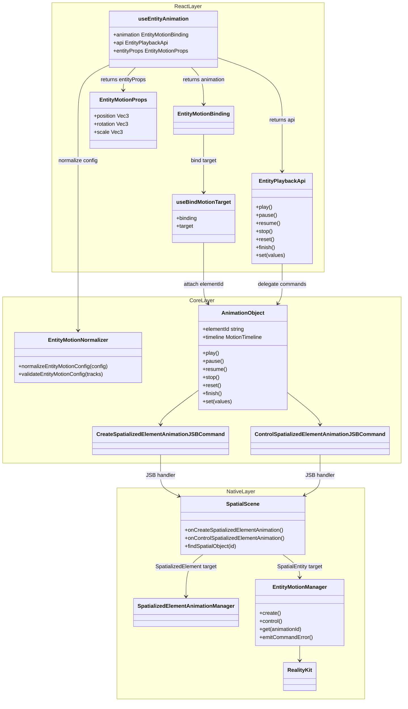

本图是 conceptual class diagram:为便于阅读把 React hook、Core `AnimationObject`、Native handler / manager 归在一起,并非表示它们是同一层 class。Native 的 target resolution 不是新增 `TargetResolver` 类,而是已有 `SpatialScene.onCreateSpatializedElementAnimation` / `onControlSpatializedElementAnimation` handler 中通过 `findSpatialObject` / `spatialObjects` registry 完成 lookup,再按 runtime target type 分发到现有 `SpatializedElementAnimationManager` 或新的 `EntityMotionManager`。`MotionTargetAdapter` 只作为 conceptual boundary 存在:如果未来 element / Entity 两条路径出现真实重复,可以再抽 Swift protocol 或 adapter;v1 不新增 Entity 转发层。Entity native motion 子系统的主要状态与 orchestration 在 `EntityMotionManager` 及其 object / compiler / bridge / timing / values helpers 中。

### RealityKit Entity motion 子系统

Entity native motion 子系统的拆分应服务于可读性与测试性,不是为了和 element path 文件数量对齐。以下是推荐职责边界;实现时可以合并 manager 内部 helper,只在逻辑复杂或复用明显时拆分。

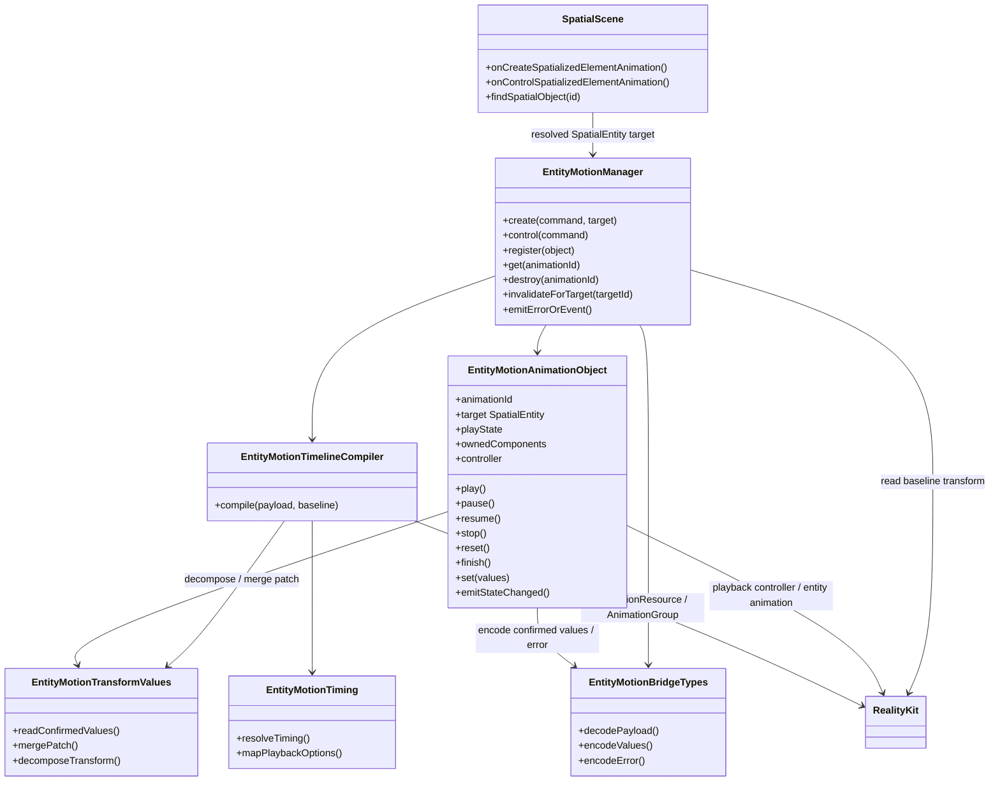

**建议职责:**

- `EntityMotionManager`: 作为 SpatialEntity motion 的 native 入口,承接 `SpatialScene` 分发后的 create / control,管理 animation registry 与 lifecycle,负责 create / control routing:create 时调用 compiler、创建 `EntityMotionAnimationObject`、register 并返回 `animationId`;control 时按 `animationId` 找 object 并调用 play / pause / resume / stop / reset / finish / set;负责 command failure 的 JSB resolve、destroy / target destroyed invalidation,避免 `SpatialScene` 持有 Entity animation 状态。confirmed values 的 `spatialanimationstatechanged` emit 由 object 完成(见下),manager 只在 lookup / 校验阶段直接失败时负责 error 上报。
- `EntityMotionAnimationObject`: 表示单个 Entity animation object,保存 `animationId`、目标 `SpatialEntity`、playState、owned components、RealityKit playback controller / resources,并负责单对象的 play / pause / resume / stop / reset / finish / set 状态转换;每次 start / terminal / accepted set 后借 `EntityMotionTransformValues` 拆解 confirmed values、经 `EntityMotionBridgeTypes` 编码,并 emit `spatialanimationstatechanged`。
- `EntityMotionTimelineCompiler`: 把 JS/Core 归一化后的 `EntityMotionTimelinePayload` 编译为 per-channel RealityKit 可执行计划、`AnimationResource` 与 `AnimationGroup`;它不解析 public `from` / `to` 或百分比 key。
- `EntityMotionBridgeTypes`: 承载 native bridge 的 decode / encode 结构,包括 canonical payload、control `values`、confirmed `EntityMotionProps` 与 `SpatializedPlaybackError`。如果现有 command types 已足够,该职责可作为若干 struct 分散存在。
- `EntityMotionTiming`: 负责 timingFunction、delay、loop、playbackRate 到 RealityKit playback / timing 表达的映射;无法直接映射的 cubic-bezier 由 compiler 决定是否 bake 成 sampled animation。
- `EntityMotionTransformValues`: 负责从 `entity.transform` 拆解 confirmed values、把 `api.set` sparse patch 合并到 native committed baseline、以及 Entity API Euler degrees 与 RealityKit rotation 表达之间的转换。

**create + play 时序:**

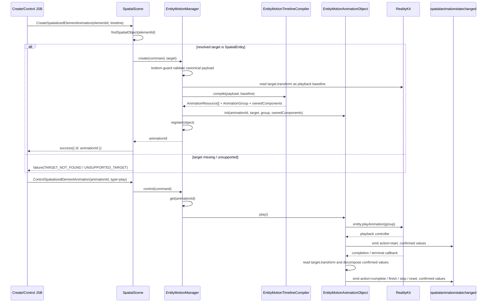

`create` 只创建 native animation object 与 compiled plan,并返回 `animationId`;它不会额外 emit initial confirmed value。`entityProps` 仍只从 start、terminal lifecycle、accepted `set` 等 native confirmed event 更新。`EntityMotionAnimationObject` 持有的是整条 `EntityMotionTimelinePayload` 编译后的 group/controller,不是单个 track;单 track / channel 粒度只存在于 compiler 的 `EntityChannelPlan` 内部。

**pause / resume 时序:**

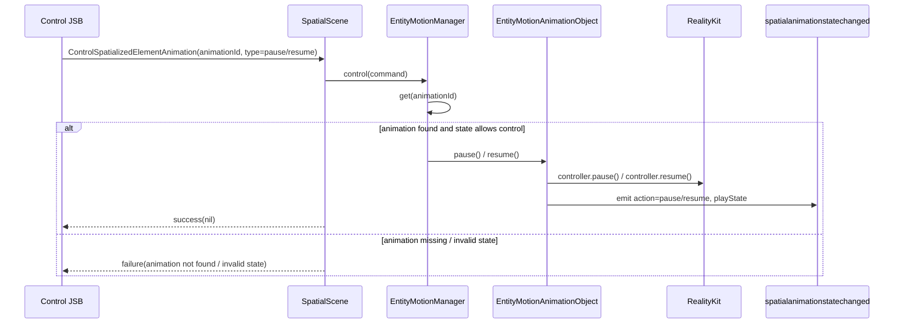

**stop / reset / finish 时序:**

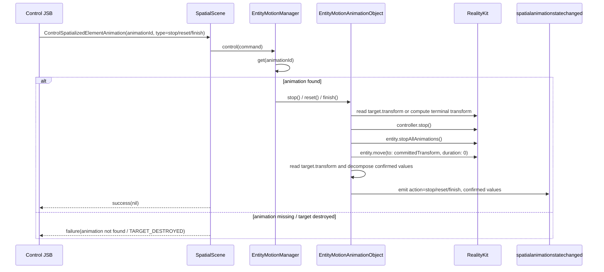

**set 时序:**

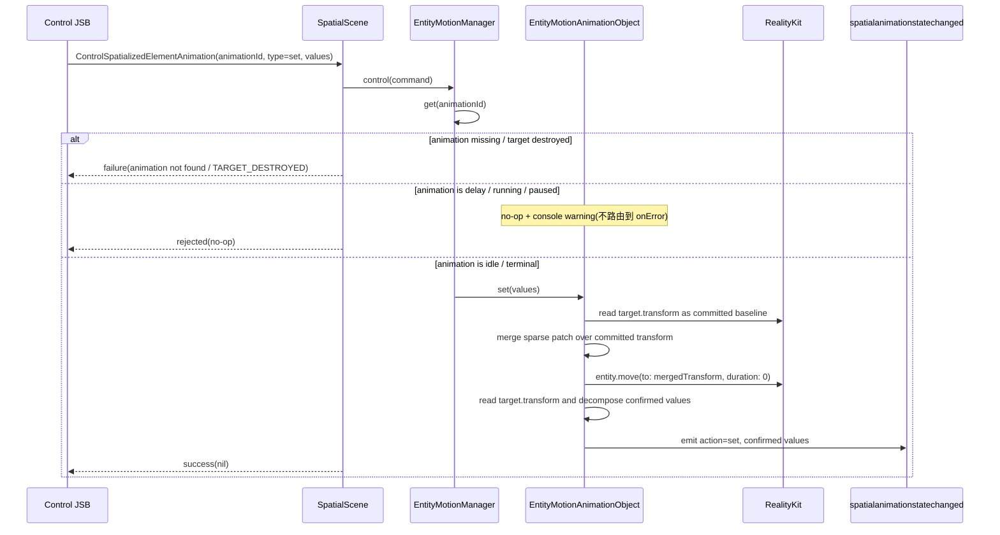

`pause` / `resume` 只控制当前 RealityKit playback controller,不重新编译 `AnimationGroup`。`stop` / `reset` / `finish` 终止当前 playback,并通过 `entity.move(duration: 0)` 提交 terminal transform。`set` 不使用 RealityKit animation resource,只在非活跃状态下把 sparse patch 合并到 native committed transform 后提交。

边界约束: `SpatialScene` 只做 target lookup / runtime type dispatch / JSB resolve;Entity-specific 编译与播放状态不要散落在 `SpatialScene` handler 中。v1 不新增只负责转发的 Entity forwarding layer;registry、create/control orchestration 与 lifecycle 归 `EntityMotionManager`。如果未来 element / Entity 路径需要统一 target boundary,再抽 Swift protocol 或 thin facade。

## Risks / Trade-offs

- **历史命名误导。** 复用 `CreateSpatializedElementAnimation` / `ControlSpatializedElementAnimation` 会保留 element 字样。文档必须明确其目标态语义已泛化为 motion animation object 协议。
- **Timeline 编译器是主要新增成本。** 多关键帧、稀疏关键帧、rotation 转换和 per-channel 编译都集中在 native Entity motion manager / compiler。
- **Per-channel 编译的两项代价。** 为了让同一时间段内不同 channel 能各自保留 timing function,不能把多 channel 合并成一个完整 Transform 动画:(1) 必须把每个 channel 编译为独立 RealityKit animation 并绑定到 sub-target(translation / orientation / scale),再用 `AnimationGroup` 并行播放,而不是一条整 Transform 动画;(2) 自定义 timing(无对应 RealityKit 内建曲线时)可能需要把该 channel bake 成 `SampledAnimation`。
- **分量级 ownership 与 sub-target 绑定粒度。** Ownership 粒度是 transform 分量(`position` / `rotation` / `scale`),因为 RealityKit 的 sub-target 绑定就是分量级的(translation / orientation / scale),不是标量级(`position.x` vs `position.y`)。某个分量只要有任一 channel 出现在 config,整个分量归动画;完全没出现的分量归 React props,动画期间照常驱动。注意标量子粒度:若只动画 `position.y`,该 channel 的 RealityKit animation 绑定整个 translation sub-target,因此 `position.x` / `position.z` 在动画期间以播放起点的 native baseline 冻结,而不是走 props——这是 sub-target 绑定粒度决定的,不是 ownership 模型的选择。跨分量组合(position 动画 + rotation 走 props)则完全支持。
- **不提供 updater form。** 因为 native 是唯一权威,`api.set(prev => next)` 会暗示 React `setState` 语义,但 `prev` 无法承诺为实时 native transform。v1 只支持 patch object;读当前 confirmed 状态通过 `entityProps` 完成。
- **大量并发动画仍需 profiling。** RealityKit 原生播放优于 JS 逐帧写入,但规模并发仍应实测。

## Decisions

- Native RealityKit backend 是 Entity motion 的唯一权威数据源。
- `entityProps` 是 native confirmed transform 的 React mirror outlet,不是本地 source of truth。
- 复用 `CreateSpatializedElementAnimationJSBCommand` / `ControlSpatializedElementAnimationJSBCommand` 和现有事件通道,不新增 Entity 平行 JSB。
- JS/Core 负责 `from`/`to`、`timeline` 到 canonical Entity tracks 的归一化;Native 只执行 canonical payload 并做兜底校验。
- **Native 采用 per-channel timing 编译。** 每个 transform channel 单独编译为携带自身 timing function 的 RealityKit animation,经 `AnimationGroup` 并行绑定到 translation / orientation / scale sub-target,而不是把所有 channel 合并成共享单一 `timingFunction` 的 segment。原因:segment 合并后每段只能带一个 timing function,同一时间段内不同 channel 的不同曲线无法表达,在进入 native 前就丢失;per-channel 则与 CADisplayLink element 路径的逐帧 per-track 采样语义一致。代价见 Risks。
- **Entity 编译产出不复用 `SpatializedMotionConfig` / `SpatializedMotionTrack`。** 理由有三:(1) **阶段不同**——`SpatializedMotion*Config` 是 public authoring 配置(带 `onStart`/`onComplete`/`autoStart` 回调、未脱糖 tracks、三级 fallback 的可选 `timingFunction`),而 `EntityChannelAnimationPlan` 是 native 编译后的可执行计划(已解百分比、已脱糖 `from`/`to`、已求缺帧 `baseline`、timing 已塔缩到每个 keyframe);config 里无处安放 `baseline`/已解析 timing,回调字段又是噪声。(2) **域不同**——`SpatializedMotionTrack.property` 是 CSS/element 视觉域(`opacity` / `transform.translate.*` / `transform.rotate.*` / `transform.scale.*`),Entity 是 pose 域(`position.*` / `rotation.*` / `scale.*`)且显式拒绝 `opacity`;value 域也不同(`SpatializedVisualValues` vs `EntityMotionProps`,后者 rotation 是 Euler degrees)。复用会把 `opacity`/`transform.translate` 混进 Entity 通道,并把结构约束降级成运行时校验。(3) **避免跨路径耦合**——本次重设计只复用跨边界协议(JSB command / 事件),内部数据类型不复用;element 路径(CADisplayLink per-track sampler)与 Entity 路径(RealityKit per-channel plan)各自持有编译产出,以免 element 侧 property 白名单或 `SpatializedVisualValues` 变动波及 Entity。若需对标“归一化 timeline”,element 侧是 `SpatializedMotionTimeline`、Entity 侧是 `EntityMotionTimelinePayload`,两者也各自独立。
- **Ownership 粒度采用分量级(per-component),而不是整个 transform。** 某个 transform 分量(`position` / `rotation` / `scale`)只要有任一字段出现在 config,该分量在 active animation 期间整体归动画;完全没出现在 config 的分量归 React props,动画期间照常驱动。理由:(1) 本提案替换的旧 entity transform animation API 本身就是分量级 ownership(按字段维护抑制缓存、非动画字段照常更新),采用分量级可保持非破坏性替换;(2) 整体抑制的理由(element 路径 DOMMatrix 整体下发、拆分需矩阵分解/重组)不适用于 Entity——Entity props 本就是分量结构,per-channel 编译已提供分量级执行基础;(3) ownership 判定下推到 native(以 config 声明的分量为准),不引入 React 侧双权威缓存。边界:粒度止于分量,不做标量级(`position.x` vs `position.y`),因为 RealityKit sub-target 绑定就是分量级的;被动画分量内的非动画标量随 sub-target 冻结到 baseline(见 Risks)。
- 旧 `AnimateTransformJSBCommand` 是内部实现协议,已删除,而非仅停止使用。
