# `useEntityAnimation` 重设计

## 1. 背景

`useEntityAnimation` 是 WebSpatial SDK 中驱动场景内 3D 物体姿态动画的 React Hook。它支持百分比关键帧、动画结果回写和统一的命令式姿态设置,并把物体动画统一到通用动画的绑定和生命周期上。

本次重设计将物体动画接入通用动画架构:React 层提供 Hook、绑定和结果镜像,Core 层完成配置归一化与校验,visionOS 原生层使用 RealityKit 编译和执行动画。原生姿态是唯一权威数据源,所有姿态变更经原生确认后再回传 React,从结构上避免动画终态与 React 基础属性冲突导致的回弹。

本设计的目标是:

- 给出 React、Core、原生三层的职责边界和数据流。
- 明确“配置 → 规范轨道 → RealityKit 动画”和“原生确认姿态 → `entityProps`”两条链路。
- 物体使用独立的创建、控制和设置协议,状态事件只回传播放状态与原生确认姿态。
- 空间元素与物体动画复用通用播放接口,分别使用目标专属的动画对象和跨端协议。

本设计的公开 API 范围是动画绑定、播放控制和确认姿态回写,执行引擎统一为原生 RealityKit。本文完整定义 API 形态、行为边界、跨端协议、编译规则和模块职责,可独立用于技术评审。

## 2. 名词解释

- **物体(Entity)**:场景里的一个 3D 对象,例如一个盒子。它有三组空间属性,合称"姿态"。
- **姿态(transform)**:物体在空间中的状态,由位置 `position`(米)、旋转 `rotation`(度)、缩放 `scale`(倍数)三部分组成。
- **分量**:指姿态三部分之一,即 `position`、`rotation` 或 `scale`。
- **原生层 / RealityKit**:苹果 visionOS 上真正驱动 3D 物体运动的底层引擎,由 Swift 实现。本文说"原生"即指这一层。
- **React 层 / 公共逻辑层(Core)**:分别是面向使用者的 Hook 代码,和两端共用的、与平台无关的逻辑代码。
- **JS Bridge 命令 / 事件**:JavaScript 与原生层之间收发消息的通道。命令由 JS 发往原生,事件由原生回传给 JS。
- **权威数据源**:某份数据以谁为准。本设计中物体的真实姿态只以原生层为准。
- **镜像(mirror)**:React 侧把原生层已确认的姿态复制一份出来供渲染使用,这份复制就叫镜像。
- **`entityProps`**:Hook 返回给使用者的姿态镜像,形如 `{ position?, rotation?, scale? }`,展开到组件上可让物体停在动画终点。
- **确认姿态(confirmed transform)**:原生层执行完一个动作后,回读物体真实姿态并回传的那份值。React 只用这种值更新 `entityProps`。
- **轨道(track)/ 通道(channel)**:一条描述单个属性(如 `position.y`)随时间变化的曲线;二者可互换,均指某单个属性的关键帧序列。编译时把各通道关键帧时间取并集切片、每个切点采样出完整姿态后整体播放(见 5.3)。
- **关键帧(keyframe)**:曲线上的一个时间点及其取值,例如"第 0.6 秒时 `position.y` = 0.25"。
- **缓动函数(timingFunction)**:描述两帧之间快慢变化的曲线,如匀速 `linear`、先慢后快 `easeIn`。
- **基准值(baseline)**:每次 fresh play 被接受时的原生当前值;当某个字段未写入 config 时,用它补全本轮播放的完整姿态。
- **起始姿态确认(start confirmation)**:fresh play 编译成功后,Native 把 config 的 `from` / `0%` 与本轮 baseline 合成为完整起始姿态,提交给目标并回读确认值。确认成功后立即发出 `start`,React 据此更新 `entityProps`;该事件不等待 delay 结束。
- **fresh play**:创建后的首次播放,或动画在 `complete` / `finish` / `stop` / `reset` 后重新开始播放;`autoStart` 也属于 fresh play。`pause` 后继续 `play` 是恢复当前播放,不属于 fresh play。
- **球面线性插值(slerp)**:RealityKit 对旋转采用的插值方式,总是走两个朝向之间的最短路径。
- **空操作(no-op)**:命令被接收后,物体和 `entityProps` 保持原值。
- **注册表(registry)**:原生层用来按 id 查找物体或动画对象的表。
- **绑定命令队列(binding command queue)**:每个绑定对象独立持有的 FIFO 队列。该队列在命令进入 JS Bridge 前,依次执行播放命令和 `set`。它属于 React/Core 的顺序控制机制,不是第二套原生动画队列。
- **命令回执(command reply)**:原生层完成命令的同步状态变更和姿态提交后,通过 JSB 返回的成功或失败结果。命令需要产生状态事件时,原生层先发出事件,再返回成功回执。

## 3. 设计目标

`useEntityAnimation` 让使用者用位置、旋转、缩放描述动画,将动画绑定到物体,并在原生确认后获得物体姿态。功能清单如下:

| 功能 | 说明 |
|---|---|
| 姿态动画 | 属性白名单为 `position`、`rotation`、`scale`;`opacity` 等非姿态属性触发显式校验失败。 |
| 多种时间轴写法 | 支持顶层 `from` / `to`、`timeline.from` / `timeline.to` 和 `0% → 50% → 100%` 百分比关键帧。 |
| 动画绑定 | Hook 返回 `animation`,通过物体组件的 `animation` 属性绑定目标。 |
| 播放控制 | `api` 提供 `play`、`pause`、`stop`、`reset`、`finish`。 |
| 结果回写 | 原生在开始、完成、停止、重置、结束等确认节点回传姿态,React 以 `entityProps` 暴露结果,避免终态回弹。 |
| 命令式设置 | 非活跃状态下通过 `api.set(update)` 在原生已提交姿态上合并稀疏更新。 |
| 生命周期与错误 | 复用通用动画的绑定与生命周期,使用 Entity 专属 JSB 命令和错误事件。 |
| 能力检测 | 通过 `supports('useEntityAnimation')` 检测整体能力。 |

## 4. 设计思路及折衷

### 4.1 设计原则

#### 原生层是唯一权威数据源

物体姿态以原生 RealityKit 为准。React 维护原生确认姿态的只读镜像。

`entityProps` 只是原生已确认姿态在 React 侧的镜像,数据只朝一个方向流动:

```text
React 配置 / api.set
  -> 原生动画引擎(唯一权威)
  -> 确认后的姿态
  -> entityProps 镜像
```

由此得到几条规则:

- 播放、停止、重置、结束、`api.set` 等一切会改变姿态的操作,都要先进原生层。
- 普通播放或控制命令结果为失败时,物体姿态与 `entityProps` 保持原值。动画对象创建或姿态交接失败进入绑定终止流程。
- 原生接受播放控制命令时,通过动画状态事件回传确认姿态;接受 `set` 时,通过 `SetEntityAnimationResult` 回传确认姿态。React 收到 Core 转发的确认值后更新 `entityProps`。
- React 把原生确认过的姿态镜像给使用者;动画进行中的写入按空操作处理。
- `entityProps` 初始为空。首次确认后,它包含完整的已提交 `position`、`rotation`、`scale` 值。当前绑定生命周期正常存续期间,播放空闲状态下的变换由这份完整镜像控制;解绑或绑定终止后由 React 属性控制。

#### 复用通用动画架构

`useEntityAnimation` 尽量复用通用动画的绑定、目标解析、动画对象生命周期和"创建—控制—事件"链路。物体路径的差异只集中在以下几处:

- 描述方式:用 `position` / `rotation` / `scale`。
- 校验:属性白名单为 `position`、`rotation`、`scale`,其它属性触发显式校验失败。
- 结果出口:`entityProps`。
- 目标类型:`SpatialEntity`。
- 执行引擎:RealityKit。

### 4.2 RealityKit 选型

原生执行引擎选定为 **RealityKit**,原因:

1. **统一执行引擎。** 物体动画与通用动画共用 RealityKit 一套引擎,避免为物体单开一套执行路径。
2. **它天生就是 3D 物体的执行引擎。** 大量物体并发动画时,引擎原生播放比 SDK 逐帧写入扩展性更好。
3. **播放和上报需求它都能满足。** 它能控制播放状态,能读到物体当前姿态,能在播放完成时给出事件,足以实现停止、重置、结束,并把确认姿态上报给回调和 `entityProps`。

主要新增成本是一个编译器:把归一化后的物体轨道翻译成 RealityKit 能执行的姿态动画。

#### RealityKit 原生播放的执行优势

物体动画全部使用 RealityKit 原生播放,具备以下优势:

- **同步渲染节拍。** 姿态动画与 RealityKit 渲染提交保持同一节拍。
- **参与系统合成。** 动画直接参与 visionOS 的系统合成与重投影。
- **融入场景体系。** 姿态动画天然处在场景图、坐标空间、锚点和碰撞体系内。
- **提供高质量插值。** RealityKit 使用球面线性插值处理旋转。
- **复用完整播放语义。** RealityKit 提供缓动、循环、延迟、播放速率、暂停和完成事件。
- **统一执行语义。** 元素与物体路径统一使用原生动画对象。

### 4.3 各层职责与整体架构

#### 整体架构

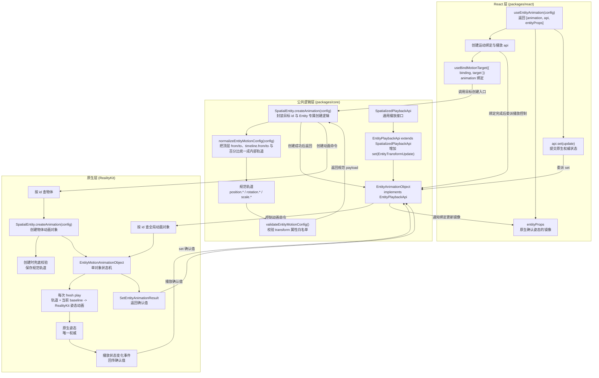

**各层职责:**

- **React 层**负责 Hook API、绑定生命周期、`entityProps` 镜像、回调分发和重渲染。目标绑定完成后,绑定器调用 `SpatialEntity.createAnimation(config)`。
- **公共逻辑层**由 `SpatialEntity.createAnimation(config)` 使用目标自身的 `SpatialObject.id`,执行 Entity 专属归一化与校验,发送创建命令并返回 `EntityAnimationObject`。`EntityPlaybackApi` 扩展现有 `SpatializedPlaybackApi` 并只为 Entity 增加 `set`;`EntityAnimationObject` 与普通 `AnimationObject` 分别实现对应接口,两个具体类之间没有继承关系。归一化会把对外的三种书写形态折叠成内部规范物体轨道;当 `timeline` 与顶层 `from` / `to` 同时出现时,`timeline` 是唯一生效输入,开发模式同时打印重复声明警告。
- **原生层**由 `SpatialScene.spatialObjects` 统一持有动画对象并复用 `SpatialObject` 生命周期。`SpatialScene` 负责创建目标查找和动画对象查找;目标 Entity 通过 `createAnimation(config)` 创建 `EntityMotionAnimationObject`;动画对象负责单对象状态机、fresh play 编译、RealityKit 执行和确认姿态回传。

#### 跨层类图

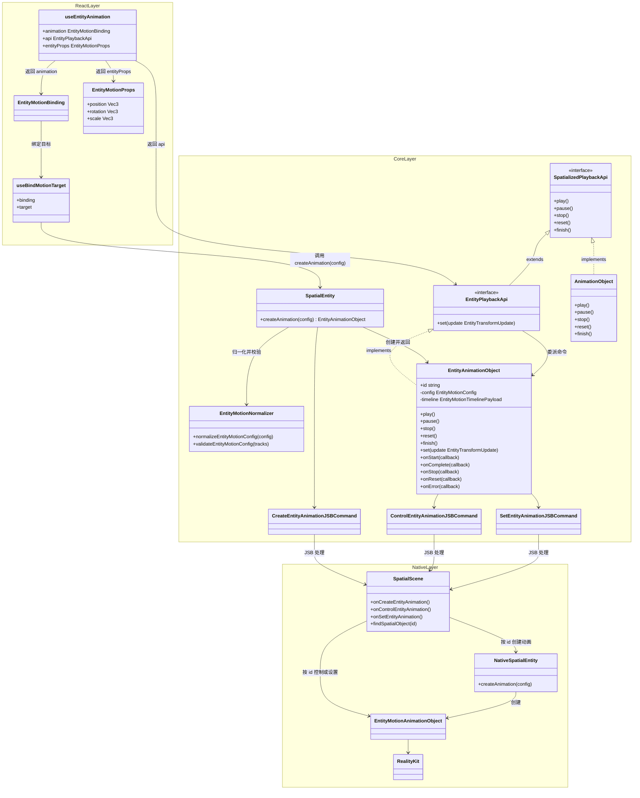

上图集中展示 React、公共逻辑和原生三层的类,各类归属图中标注的层级。创建请求的 `id` 是目标 Entity 的 `SpatialObject.id`;创建回执的 `id` 是新建动画对象的 `SpatialObject.id`。Core 使用回执中的 `id` 构造 `EntityAnimationObject`,后续控制、设置和事件都直接使用该对象的 `id`。Entity 协议不引入额外的 id 别名。

#### 跨层通信概览

- Core 通过 `CreateEntityAnimationJSBCommand`、`ControlEntityAnimationJSBCommand` 和 `SetEntityAnimationJSBCommand` 向 Native 分别发送创建、播放控制和姿态设置命令。
- Native 通过 `spatialanimationstatechanged` 向 Core 回传播放状态和确认姿态,通过 `entityanimationerror` 回传命令接受后发生的异步错误。
- Core `EntityAnimationObject` 是两类事件的直接消费者。它更新自身播放状态并触发对应的 `onXXX` 调试监听器,再由 React `EntityMotionBinding` 更新公开状态、生命周期 callback 和 `entityProps`。

JSB payload 与错误类型由 5.2 Core SDK 定义,命令处理规则由 5.3 Native 定义,状态事件到 React 的映射由 5.1 React SDK 定义。

#### 跨层时序

##### 从配置到原生姿态(播放)

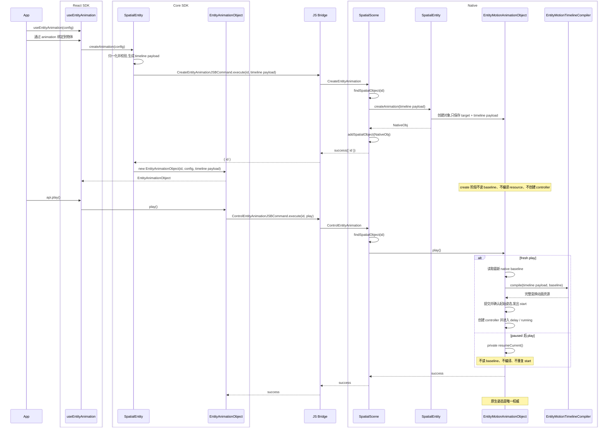

##### 从原生确认姿态到 React 镜像

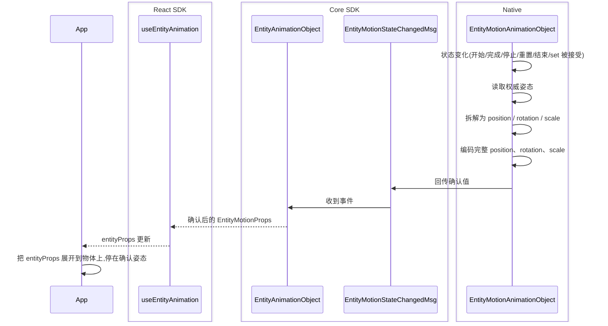

`api.set` 是否生效由原生决定:原生仅在动画处于非活跃状态且原生对象已经创建时接受更新,其它时机按空操作处理并打印控制台警告。首个确认值来自 fresh play 起始姿态确认或一次被接受的 `set`;在此之前 `entityProps` 可能为空。

### 4.4 关键折中

- **Entity 使用独立桥接协议。** 创建、播放控制和姿态设置分别使用 Entity 专属命令。三条命令都直接使用 `SpatialObject.id`,避免继承 Element 动画协议及其字段语义。
- **承担 fresh play 的原生编译成本。** 每次 fresh play 都由物体动画对象读取当前 baseline,再调用编译器完成多关键帧、稀疏关键帧、旋转换算和整姿态串联编译,换取最新 baseline、RealityKit 原生播放、系统合成和统一播放语义。
- **切片为整姿态串联。** 把时间轴切成若干节点、每个节点携带完整的 `position` / `rotation` / `scale`,再按先后顺序串联成一条整姿态动画播放。visionOS(RealityKit)的动画绑定粒度是整个 `.transform`,当前缓动需求也以整段为单位。因此采用整姿态串联,天然对齐 visionOS 与 picoOS(两端原生都绑定整 transform);同一区间内各通道共用一个 `timingFunction`。
- **绑定生命周期内持有完整变换。** 动画进入活跃状态后,整个 `.transform` 由动画控制。例如只动画 `position.y` 时,`position.x`、`position.z`、`rotation`、`scale` 在播放期间都保持本轮基准姿态。原生层产生首个已确认状态后,`entityProps` 在当前绑定生命周期正常存续期间持久化完整的已提交变换;播放空闲时的动态写入使用 `api.set`,解绑或绑定终止后由 React 属性控制。Entity motion 复用 Element 动画的 Native animating mask 仲裁机制:目标 Entity 保存完整 transform 的动画 owner,`EntityMotionAnimationObject` 在提交首个已确认状态时获取 owner,`SpatialScene` 在普通 Entity transform 更新入口检查 owner。owner 存续期间,普通更新返回成功并保持当前原生 transform;解绑、绑定终止或销毁动画对象时释放 owner。
- **`set` 使用稀疏更新对象。** v1 的 `api.set` 接受 `EntityTransformUpdate`,当前确认姿态通过 `entityProps` 读取。
- **Entity handler 直接分发。** `SpatialScene` 的三条 Entity 专属 handler 分别完成创建、播放控制和姿态设置,不经过 Element 动画管理器。
- **并发性能需要实测。** RealityKit 原生播放优于 JS 逐帧写入,但海量物体并发仍需专项性能验证。

## 5. 系统/模块设计

### 5.1 React SDK

- **公开接口:** `useEntityAnimation` 返回 `[animation, api, entityProps]`;物体组件通过 `animation` 属性接收 `EntityMotionBinding`。
- **播放控制:** `EntityPlaybackApi` 提供 `play`、`pause`、`stop`、`reset`、`finish` 和 `set`;`api.set(update)` 把稀疏 transform 更新提交给原生。
- **目标绑定:** `useBindMotionTarget({ binding, target })` 维护一个绑定对应一个 `SpatialEntity` 的约束,绑定完成后调用 `target.createAnimation(config)`。解绑和目标替换会把绑定持有的 `entityProps` 镜像清空为 `{}`,继续展开返回对象时由普通 React 变换属性控制。
- **命令顺序:** `EntityMotionBinding` 复用 Element 动画绑定在对象创建前暂存命令、创建后逐条执行的机制。每个绑定对象独立串行执行命令,当前命令收到 JSB 回执后才发送下一条命令。
- **结果镜像:** `entityProps` 镜像原生确认的 `position`、`rotation`、`scale`,并驱动 React 重渲染与生命周期回调。

#### 绑定命令队列与完成语义

公开的 `EntityPlaybackApi` 保持 `void` 命令接口。内部由每个 `EntityMotionBinding` 持有一条 FIFO 命令链,在不向应用暴露 JSB Promise 的前提下保持调用顺序。

- 目标绑定或原生动画对象创建完成前,`play`、`pause`、`stop`、`reset`、`finish` 按调用顺序进入待执行命令队列。原生层创建回执首先确认初始 `idle` 状态。创建成功回执到达后,绑定对象逐条执行队列中的命令。当前 `EntityAnimationObject` 的内部命令 Promise 完成后,才发送下一条命令。创建失败回执使公开状态收敛为 `idle`,使当前绑定代次失效,清空动画对象引用、控制器派生状态、待执行队列和 `entityProps`,触发 React 渲染以恢复基础属性控制,通过 `onError` 报告一次错误,并终止当前绑定生命周期。
- `autoStart` 开启时,创建成功后生成的 `play` 命令插入待执行播放命令的队首。该行为与现有 Element 动画一致。
- 绑定、原生动画对象创建前或当前绑定生命周期终止后调用 `api.set` 时,该命令不进入队列。SDK 输出控制台警告并执行空操作。
- 原生动画对象创建后,所有播放命令和 `set` 进入同一条绑定命令队列。命令失败或 `set` 被转换为“警告并执行空操作”时,SDK 结束当前队列项并继续执行下一项。失败不会阻塞队列,也不会改变后续命令的顺序。
- JSB 成功回执表示原生层已完成该命令的同步状态转换和所需姿态提交。播放控制命令产生 `start`、`pause`、`stop`、`reset` 或 `finish` 状态事件时,原生层先发出对应事件,再返回成功回执。`SetEntityAnimation` 不产生状态事件,原生层在提交并回读姿态后直接通过成功回执返回完整确认值。自然完成产生的异步 `complete` 事件不属于此前 `play` 命令的回执。
- 解绑、目标替换、配置变更导致动画对象替换或销毁时,绑定对象使当前队列批次失效,并丢弃所有尚未发送的命令。正在执行的命令可以按既有销毁竞态规则完成,但其回执不得继续触发已失效队列中的下一条命令。

该顺序保证连续调用具有确定行为。`set → play` 会等待已接受的 `set` 返回回执,再由 fresh play 读取基准值;`stop → play` 会等待停止后的姿态提交完成;`play → pause` 会等待原生层接受 `play` 命令。

#### 解绑、重新绑定与配置更新

`EntityMotionBinding` 沿用 Element 动画的销毁并重建生命周期。绑定对象根据生效的时间轴、时长、缓动、延迟、播放速率、循环和 `autoStart` 计算归一化执行签名。等价的公开配置写法生成同一个签名。生命周期回调引用独立于执行签名存储和刷新。

- 解绑时,绑定对象推进绑定代次、注销当前 `EntityAnimationObject`、销毁对应原生对象、把 `entityProps` 清空为 `{}`,并触发 React 渲染。返回的空对象可以继续安全地展开在基础属性之后。
- 重新绑定不同目标时,绑定对象先完成同一套清理,再为新目标创建动画对象。新目标从空镜像开始,并建立自身的确认值。
- 当前绑定生命周期正常且同一目标的归一化执行签名发生变化时,绑定对象保持旧对象和旧代次至销毁成功。旧对象销毁成功并释放 transform owner 后,`entityProps` 包含完整确认姿态时,绑定对象通过普通 Entity transform 更新入口提交该姿态并等待更新成功;`entityProps` 为空时,当前原生 transform 保持权威,绑定对象直接进入新对象创建。随后绑定对象推进代次并使用最新配置创建新对象。替换对象的首次 fresh play 读取当前原生 transform 作为基准姿态,其中包括已提交的确认姿态。该交接保持现有 `entityProps` 和生命周期回调次数。姿态交接或新对象创建失败时,绑定对象执行与初次创建失败相同的终止流程。旧对象销毁失败时,绑定对象保持旧对象、旧代次和原有播放状态,清理本次替换产生的待执行命令,并触发一次 `onError`。
- 当前绑定生命周期正常时,仅更新回调会保持当前动画对象、控制器、队列、状态和 `entityProps`,并替换后续已接受事件使用的回调引用。当前绑定生命周期终止后,config 和 callback 更新只刷新绑定保存的最新值。
- 替换开始后发出的命令归属新的绑定代次,并等待该代次的动画对象。创建完成后,`autoStart: true` 在该代次待执行命令的队首加入一次隐式 `play`;`autoStart: false` 直接执行显式待执行命令。
- 绑定代次和动画对象身份同时匹配当前对象的命令回执或状态事件会更新绑定。当前代次是状态、`entityProps` 和公开生命周期回调更新的唯一来源。替换清理由销毁生命周期完成。
- 创建或交接失败终止当前绑定生命周期后,所有 playback 方法和 `api.set` 均输出控制台警告并执行空操作。显式解绑后重新绑定,或创建新的 binding,会使用届时最新的 config 和 callback 开启新代次。

#### 类图

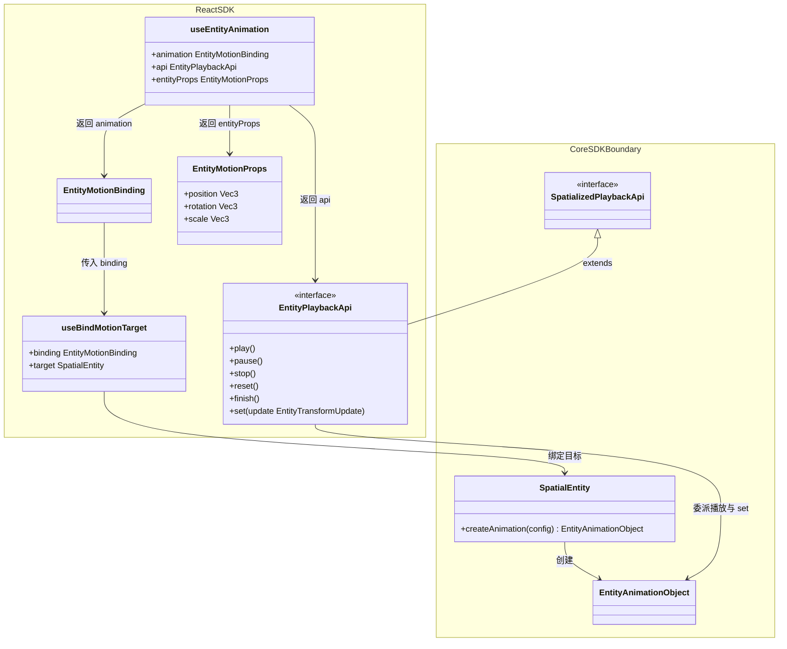

#### 状态事件映射

Core `EntityAnimationObject` 直接消费 Native 发出的 `EntityMotionStateChangedMsg`,将 Native action 映射到自身状态和 `onXXX` 调试监听器。React `EntityMotionBinding` 再消费这些对象级通知,更新用户 callback 和 `entityProps`:

| Native action | 对应用户 callback | 是否更新 entityProps |
|---|---|---|
| `start` | `onStart` | 是(fresh play 起始姿态被 Native 接受后一次,不等待 delay 结束) |
| `complete` | `onComplete` | 是(终态) |
| `finish` | `onComplete` | 是(终态) |
| `stop` | `onStop` | 是(当前姿态) |
| `reset` | `onReset` | 是(起点姿态) |
| `pause` | 播放状态变化 | 否 |

状态事件中的 `values` 使用 `EntityMotionProps` 形态,包含 `position`、`rotation`、`scale`。`set` 不改变播放状态,因此不进入该表;Core 从 `SetEntityAnimationResult.values` 取得合并后的确认姿态并更新 `entityProps`。错误不进入状态事件,Core 通过独立的 `EntityAnimationErrorMsg` 触发 `onError`。动画对象创建或姿态交接失败会额外清空 `entityProps` 并终止当前绑定生命周期;其它错误保持当前 `entityProps`。

### 5.2 Core SDK

- **目标创建入口:** `SpatialEntity.createAnimation(config)` 使用自身 id,执行 Entity 专属归一化与校验,发送 `CreateEntityAnimation` 并返回 `EntityAnimationObject`。普通 `SpatializedElement.createAnimation(config)` 仍返回 `AnimationObject`。
- **播放接口:** 现有 `SpatializedPlaybackApi` 保持通用播放方法与状态,不包含 `set`;`EntityPlaybackApi extends SpatializedPlaybackApi`,只增加 `set(EntityTransformUpdate)`。
- **动画对象:** `AnimationObject extends SpatialObject implements SpatializedPlaybackApi`;`EntityAnimationObject extends SpatialObject implements EntityPlaybackApi`。两个具体类之间没有继承关系。`EntityAnimationObject` 直接使用继承自 `SpatialObject` 的 `id`,私有保存公开 `config` 和归一化后的 `timeline`,并提供与 React callback 对齐的 `onStart`、`onComplete`、`onStop`、`onReset`、`onError` 调试监听方法。`finish` 与自然完成共同触发 `onComplete`。
- **类型与函数:** Core 定义物体运动类型、`EntityTransformUpdate`、`EntityMotionProps`、属性白名单、归一化函数、校验函数以及内部规范时间轴。

`EntityAnimationObject` 的 `onXXX` 方法只注册观察回调,不发送控制命令,也不改变动画配置或执行签名。参数与 React callback 保持一致:

```text
onStart(listener: (values: EntityMotionProps) => void)
onComplete(listener: (values: EntityMotionProps) => void)
onStop(listener: (values: EntityMotionProps) => void)
onReset(listener: (values: EntityMotionProps) => void)
onError(listener: (error: SpatializedPlaybackError) => void)
```

状态事件触发前四类方法,专用错误事件触发 `onError`。`pause` 只更新播放状态,因此不增加 `onPause`。

#### 类图

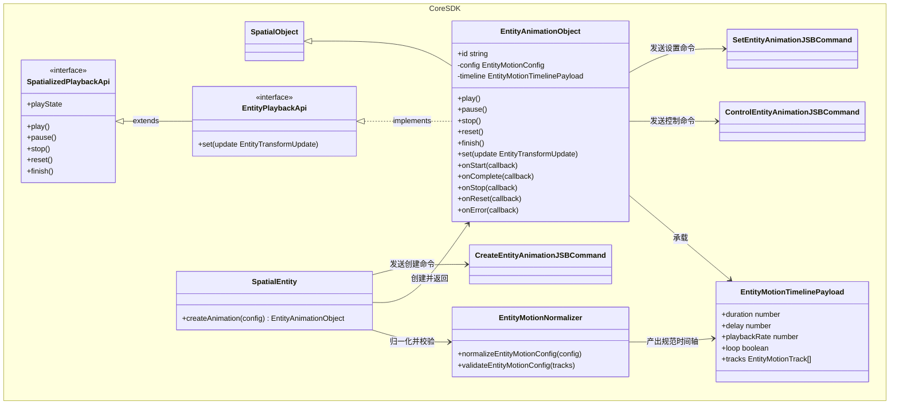

#### JSB 协议

Core 定义 Entity 专属的创建命令、控制命令、设置命令、状态事件和错误事件 wire contract。这些协议不依赖 Spatialized Element 动画协议。

##### 创建动画命令

创建请求的 `id` 直接取目标 Entity 的 `SpatialObject.id`。创建成功回执也只返回 `id`,该值是新建动画对象的 `SpatialObject.id`:

```text
CreateEntityAnimation {
  id: string
  timeline: EntityMotionTimelinePayload
}

CreateEntityAnimationResult {
  id: string
}
```

##### 控制动画命令

```text
ControlEntityAnimation {
  id: string
  type: 'play' | 'pause' | 'stop' | 'reset' | 'finish' | 'destroy'
}
```

##### 设置动画姿态命令

```text
SetEntityAnimation {
  id: string
  update: EntityTransformUpdate
}

SetEntityAnimationResult {
  values: EntityMotionProps
}
```

`api.set` 使用独立设置命令,接受深度稀疏的 `EntityTransformUpdate`。Native 在合并更新、提交姿态并回读完整确认值后返回 `SetEntityAnimationResult`;Core 使用 `values` 更新 `entityProps`,不发送状态事件。绑定前或原生动画对象创建前的调用归类为空操作并打印控制台警告,也不会暂存为后续命令。JSB 不提供 `resume`;paused 后调用 `play` 时由 Native 动画对象内部恢复当前 controller。

```text
type EntityMotionProps = {
  position?: Vec3
  rotation?: Vec3
  scale?: Vec3
}

type EntityTransformUpdate = {
  position?: Partial<Vec3>
  rotation?: Partial<Vec3>
  scale?: Partial<Vec3>
}
```

`EntityTransformUpdate` 表示 `EntityMotionProps` 的任意深度子集。原生层按轴合并更新;播放状态事件中的确认值和 `SetEntityAnimationResult.values` 都携带完整的 `position`、`rotation`、`scale`,且每项都是完整的 `Vec3`。

##### 状态变化事件

```text
type EntityMotionNativePlayState = 'idle' | 'running' | 'paused' | 'finished'
type EntityMotionPlayState = 'queued' | EntityMotionNativePlayState

interface EntityMotionStateChangedDetail {
  id: string
  action:
    | 'start' | 'complete' | 'pause' | 'stop' | 'reset' | 'finish'
  playState: EntityMotionNativePlayState
  values?: EntityMotionProps
}

interface EntityMotionStateChangedMsg {
  type: 'spatialanimationstatechanged'
  detail: EntityMotionStateChangedDetail
}
```

`values` 使用物体目标的 `EntityMotionProps`,包含 `position`、`rotation`、`scale`。

`queued` 是命令等待原生动画对象创建期间的 React 绑定状态。原生层创建回执确认初始 `idle` 状态。创建失败时,React 绑定把公开状态收敛为 `idle` 并终止当前绑定生命周期。后续原生层控制回执和状态事件确认 `idle`、`running`、`paused` 或 `finished`。正常绑定生命周期中的原生层回执与状态事件是公开播放状态的唯一数据源。公开 `finished` 标记由 `playState === 'finished'` 派生,不进入 JSB 状态事件。

##### Entity 错误事件与错误类型

状态事件不承载错误。原生命令接受后发生的异步错误通过 Entity 专用事件回传:

```text
interface EntityAnimationErrorDetail {
  id: string
  error: SpatializedPlaybackError
}

interface EntityAnimationErrorMsg {
  type: 'entityanimationerror'
  detail: EntityAnimationErrorDetail
}
```

`SpatializedPlaybackError` 不重复携带命令名称。Core 在命令回执处理中已经持有当前命令上下文,异步错误也由对应动画对象接收。对用户稳定开放错误码和可读原因:

```text
type SpatializedPlaybackError = {
  code:
    | 'TARGET_NOT_FOUND'
    | 'UNSUPPORTED_TARGET'
    | 'ANIMATION_NOT_FOUND'
    | 'INVALID_TIMELINE'
    | 'COMPILATION_FAILED'
    | 'INVALID_CONTROL_STATE'
    | 'INVALID_SET_VALUES'
  reason: string
}
```

错误出口由发现错误的阶段决定:

- Core 对公开 config 和方法参数执行的同步校验失败直接抛出内置 `Error`,不触发 `onError`。
- JSB 命令执行失败通过当前命令回执返回。Core 将回执转换为一次 `SpatializedPlaybackError`,再触发 `onError`。
- 命令成功回执后发生的原生异步失败只通过一次 `entityanimationerror` 回传。Core `EntityAnimationObject` 消费该事件并触发 `onError`。
- 同一失败只选择一个出口,状态事件不携带错误,从而避免重复触发 `onError`。
- 动画对象创建或姿态交接失败会终止当前绑定生命周期。其它异步播放错误保持既有状态语义。
- 动画活跃期间调用 `api.set` 属于预期状态拒绝,保持 warning + no-op,不触发错误事件或 `onError`。

用户按错误码处理:

| 错误码 | 建议处理 |
|---|---|
| `TARGET_NOT_FOUND` | 检查目标 Entity 是否已经创建且仍处于有效生命周期,再重新绑定动画。 |
| `UNSUPPORTED_TARGET` | 检查传入 `id` 是否属于支持动画的 Entity,并在创建前执行能力检测。 |
| `ANIMATION_NOT_FOUND` | 停止使用已经销毁或失效的动画对象,重新绑定并取得新的对象 `id`。 |
| `INVALID_TIMELINE` | 修正动画配置中的时间、属性、关键帧或取值。公开配置通常由 Core 同步拦截。 |
| `COMPILATION_FAILED` | 简化或调整 Native 无法编译的关键帧组合,并记录 `reason` 用于问题定位。 |
| `INVALID_CONTROL_STATE` | 等待当前状态允许该操作,或先停止动画。活跃期间的 `set` 由 SDK 转换为 warning + no-op。 |
| `INVALID_SET_VALUES` | 修正 `EntityTransformUpdate`,确保至少包含一个合法的 transform 标量。 |

#### 类型、归一化与校验

归一化由公共逻辑层的 `normalizeEntityMotionConfig` 完成,把三种对外写法统一成同一套内部时间轴数据。

**输入:** 对外的三种书写形态,折叠规则为:

- **顶层 `from` / `to`** 等价于 `timeline.from` / `timeline.to`,展开成起止两帧。
- **`timeline.from` / `timeline.to`** 即 `0%` / `100%` 帧,可与百分比 key 混写。
- **百分比关键帧** `0% → 50% → 100%` 按 `at = 百分比 × duration` 折算成秒。

完整归一化规则包括 `timeline` 优先、边界必填和 `duration` 默认值,详见本节后文。

**输出:** 平台无关的 `EntityMotionTimelinePayload`,结构如下:

```text
type EntityMotionTimelinePayload = {
  duration: number
  delay?: number
  playbackRate?: number
  loop?: boolean | { reverse?: boolean }
  tracks: EntityMotionTrack[]
}

type EntityMotionTrack = {
  property: EntityMotionProperty
  keyframes: EntityMotionKeyframe[]
  timingFunction?: TimingFunction
}

type EntityMotionProperty =
  | 'position.x' | 'position.y' | 'position.z'
  | 'rotation.x' | 'rotation.y' | 'rotation.z'
  | 'scale.x'    | 'scale.y'    | 'scale.z'

type EntityMotionKeyframe = {
  at: number
  value: number
  timingFunction?: TimingFunction
}
```

**v1 缓动编码约定:** 公开配置中的 `timingFunction` 始终表示全局时间段的缓动,当前 payload 把它存放在 track 和 keyframe 中。Core 把顶层默认值复制到每条 track,并把时间轴节点上的覆盖值复制到该节点产生的所有属性 keyframe。同一个 `at` 上的缓动值统一使用唯一值。每个公开时间轴节点至少包含一个受支持的姿态标量,归一化过程据此保留该节点。包含某个全局节点的任意 track 都可以携带该节点的共享缓动值。track/keyframe 中的字段也为未来按属性设置缓动保留结构空间;该能力将同步引入对应的公开配置语义和带版本的协议语义。

示例:

```text
{
  duration: 1.2,
  tracks: [
    {
      property: 'position.y',
      timingFunction: 'linear',
      keyframes: [
        { at: 0, value: 0 },
        { at: 0.6, value: 0.25 },
        { at: 1.2, value: 0 },
      ],
    },
    {
      property: 'rotation.y',
      timingFunction: 'linear',
      keyframes: [
        { at: 0, value: 0 },
        { at: 1.2, value: 180 },
      ],
    },
  ],
}
```

归一化与校验规则:

- 顶层 `from` / `to` 与 `timeline.from` / `timeline.to` 折叠到同一套内部轨道。
- `timeline.from` / `timeline.to` 分别表示 `0%` / `100%`,并可与百分比关键帧混写;同一边界重复声明时显式报错。
- `timeline` 与顶层 `from` / `to` 同时出现时,`timeline` 作为唯一生效输入,开发模式打印重复声明警告。
- 纯顶层 `from` / `to` 形态的 `duration` 默认 0.3 秒。
- 每个动画同时提供起始和结束边界;边界帧内部字段可保持稀疏,缺帧标量在 Native 编译时回落到 baseline。

#### 能力检测

文档和示例统一使用顶层能力检测:

```text
supports('useEntityAnimation')
```

### 5.3 Native

- **命令入口:** `SpatialScene` 分别承接 `CreateEntityAnimation`、`ControlEntityAnimation` 和 `SetEntityAnimation`。三条命令都使用 `id` 查询对应的 `SpatialObject`。
- **执行子系统:** 创建命令解析到目标 Entity 后调用 `entity.createAnimation(config)`。动画对象复用 `SpatialScene.spatialObjects` 与 `SpatialObject` 生命周期,单对象控制和 fresh/resume 判断由 `EntityMotionAnimationObject` 内聚。
- **确认值回传:** 播放生命周期节点通过状态事件回传确认值;`set` 通过 `SetEntityAnimationResult` 回传确认值。
- **错误回传:** 命令成功回执后发生的异步错误通过 `entityanimationerror` 回传,不进入状态事件。

#### 类图

子系统以可读性和可测试性为拆分标准,文件组织可独立于元素路径。以下是推荐职责边界。现有 `SpatializedElementAnimationObject` 与新增 `EntityMotionAnimationObject` 都继承 `SpatialObject`,复用同一生命周期,两者是兄弟类型,没有直接继承关系;当前不预先抽取 Native 公共播放接口。

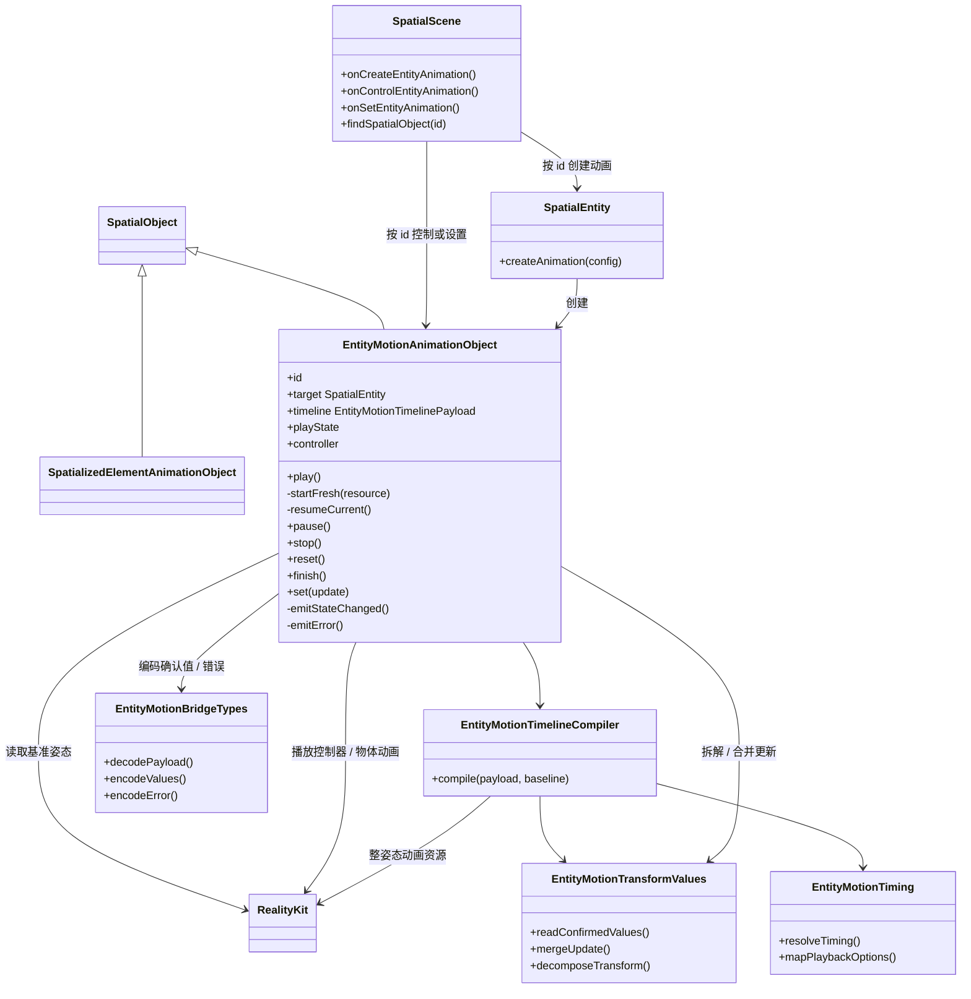

**各类职责:**

- **目标物体(`SpatialEntity`):** `createAnimation(config)` 兜底校验创建 payload,构造保存目标与规范时间轴的动画对象并返回给 `SpatialScene` 注册。Entity 不维护动画 registry 或播放状态。
- **物体动画对象(`EntityMotionAnimationObject`):** 表示单个物体动画,直接使用继承自 `SpatialObject` 的 `id`,保存目标物体、规范时间轴、播放状态、当前播放控制器与资源,负责全部单对象状态转换。`play()` 在 `paused` 状态下调用私有方法 `resumeCurrent()`,其它可开始新一轮播放的状态读取基准姿态、调用编译器并通过私有方法 `startFresh(resource)` 启动。起始姿态确认和播放生命周期终态通过私有方法 `emitStateChanged()` 发出状态变化事件。`set` 被接受后直接返回包含完整确认姿态的 `SetEntityAnimationResult`。异步错误通过私有方法 `emitError()` 发出专用错误事件。
- **时间轴编译器(`EntityMotionTimelineCompiler`):** 在每次 fresh play 时接受规范时间轴和本轮 baseline,将其切片编译为一条串联的整姿态 RealityKit 动画资源。
- **桥接类型(`EntityMotionBridgeTypes`):** 承载原生桥接的编解码结构,包括时间轴数据、控制值、确认值和错误。若命令类型已够用,这部分可作为若干结构体分散存在。
- **播放参数映射(`EntityMotionTiming`):** 把已经按全局时间段解析完成的唯一缓动函数、延迟、循环、播放速率映射到 RealityKit 的表达;四种内建缓动函数全部直接映射。
- **姿态拆解与合并(`EntityMotionTransformValues`):** 负责从物体姿态拆解确认值、把 `api.set` 的稀疏更新合并到已提交基准上,以及欧拉角度数与 RealityKit 旋转表示之间的换算。

#### JSB 命令处理

`SpatialScene` 按创建请求的 `id` 查询空间对象注册表:

```text
是物体   -> entity.createAnimation(config)
其它     -> UNSUPPORTED_TARGET
```

处理规则:

- 注册表缺少目标 `id` 时,创建以 `TARGET_NOT_FOUND` 失败。
- 创建成功后,`SpatialScene` 把动画对象作为 `SpatialObject` 加入全局 `spatialObjects`;成功回执返回该对象的 `id` 并确认其初始状态为 `idle`。
- 控制命令通过 `id` 在全局 `spatialObjects` 查找 `EntityMotionAnimationObject`。设置命令使用同一套查找规则,并单独调用 `set(update)`。
- 同步命令错误通过 JSB reply 回传;仅命令接受后发生的异步播放错误通过一次 `entityanimationerror` 回传。
- JSB 成功回执只在原生层完成命令的同步状态转换和姿态提交后返回。播放控制命令需要产生状态事件时,原生层先发出事件,再返回成功回执。设置命令在姿态提交和回读完成后通过回执返回完整确认值,不产生状态事件。绑定命令队列收到回执后,才发送下一条命令。
- fresh play 编译失败时,控制命令失败,动画保持非活跃。

创建成功回执只携带动画对象的 `id`,确认对象已经创建并处于 `idle`;失败回执确认对象创建结束,绑定对象据此收敛到 `idle`、清理待执行命令并分发分类错误。

Native 在非活跃时接受并提交 `api.set`;活跃时保持姿态不变并通过 `SetEntityAnimation` 回执返回 `INVALID_CONTROL_STATE`,Core 将该结果转为 warning + no-op,不触发 `onError`。

#### 时间轴编译

编译在每次 fresh play 时由 `EntityMotionAnimationObject.play()` 触发:命令被接受后、进入 delay / running 前读取当前姿态作为本轮 baseline,再把规范时间轴切成若干携带完整姿态的节点并逐段编译,最终产出本轮播放资源。创建动画只校验并保存规范时间轴。paused 状态下的 `play()` 直接恢复当前控制器,不读取 baseline、不编译也不产生新的 `start`;单次播放内部的 loop 复用本轮资源。

##### 输入:内部时间轴

编译的输入就是归一化的产物 `EntityMotionTimelinePayload`(结构见上节),且目标已解析为物体。

##### 编译流程

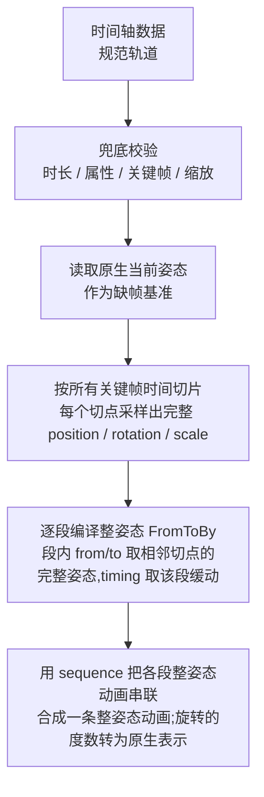

##### 时间轴切片为整姿态节点并串联

整条时间轴只对应一个绑定目标——整个 `transform`。把所有通道的关键帧时间取并集作为切点,相邻切点之间构成一段;每个切点都采样出完整的 `position` / `rotation` / `scale`,于是每段就是一次“整姿态到整姿态”的过渡。

**逐段——用 `FromToByAnimation<Transform>` 表达。** 每段的 `from` / `to` 取相邻两个切点的完整姿态,`duration` 取该段时长,`timing` 取 Core 已为该全局时间段解析出的唯一缓动函数,`bindTarget` 固定为 `.transform`。visionOS 的动画绑定粒度是整个 `.transform`,这也是选择整姿态切片的根本原因。

**串联——用 `sequence` 首尾相接。** 各段整姿态动画按时间顺序用 `AnimationResource.sequence(with:)` 串成一条动画,让每段各自带缓动、又连续播放。只有起止两帧的时间轴退化为单个 `FromToByAnimation<Transform>`。`delay` / `speed` / `loop` 作用在这条串联动画的顶层。

以一个例子说明(`position.y` 有 3 帧、`rotation.y` 只有起止 2 帧,切点并集为 `0 / 0.6s / 1.2s`,共 2 段):

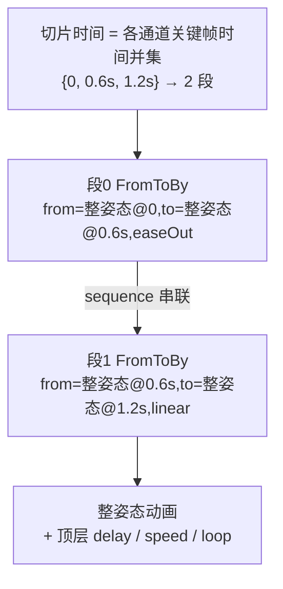

每段都携带完整姿态并按时间顺序串联,`delay` / `speed` / `loop` 作用在串联动画顶层。

##### 输出:可控播放对象与代码演示

编译的最终输出是可控播放对象。沿用上文示例(2 段整姿态),下面分别用 visionOS 与 picoOS 演示:每段编成一个整姿态 `FromToBy`,用 `sequence` 串成一条动画资源,最后交给引擎播放,拿到可暂停 / 恢复 / 停止 / 变速的播放控制器——即“可控播放对象”。两端都绑定整个 transform,写法对齐。

visionOS 与 picoOS 的平台能力按第 8 节验收任务留痕验证,覆盖整 transform 绑定、多段动画序列、每段独立缓动函数、顶层 delay / speed / loop、controller pause / internal resume / stop 以及 completion。以下代码只展示资源构造和 controller 形态;`EntityMotionTiming` 在交给引擎前把顶层 delay / speed / loop 统一应用到整条动画序列,不由单个时间段重复设置。

visionOS(RealityKit / Swift):

```swift
import RealityKit

// 沿用示例;每个切点携带完整 position / rotation / scale,只有 y 与绕 y 旋转在变
let base = entity.transform

// 采样某切点的完整姿态(x / z / scale 冻结在基准,只有 pos.y 与 rot.y 在动)
func pose(y: Float, deg: Float) -> Transform {
    var t = base
    t.translation = SIMD3(base.translation.x, y, base.translation.z)
    t.rotation = simd_quatf(angle: deg * .pi / 180, axis: SIMD3(0, 1, 0))
    return t
}

// 段0:整姿态从 t=0 到 t=0.6s
let seg0 = FromToByAnimation<Transform>(
    name: "seg0",
    from: pose(y: 0,    deg: 0),
    to:   pose(y: 0.25, deg: 90),
    duration: 0.6,
    timing: .easeOut,                 // 段0 自己的缓动
    bindTarget: .transform            // 只能绑定整个 transform
)
// 段1:整姿态从 t=0.6s 到 t=1.2s
let seg1 = FromToByAnimation<Transform>(
    name: "seg1",
    from: pose(y: 0.25, deg: 90),
    to:   pose(y: 0,    deg: 180),
    duration: 0.6,
    timing: .linear,                  // 段1 与段0 分别采用各自缓动
    bindTarget: .transform
)

// 各段整姿态动画按时间顺序用 sequence 串成一条动画
let clip = try AnimationResource.sequence(with: [
    try AnimationResource.generate(with: seg0),
    try AnimationResource.generate(with: seg1),
])

// 得到可控播放对象:控制器支持暂停 / 恢复 / 停止 / 变速
let controller = entity.playAnimation(clip, transitionDuration: 0, startsPaused: true)
controller.resume()          // Native object 内部开始 / 恢复;不是 JSB resume 命令
// controller.pause()        // pause
// controller.stop()         // stop
// controller.speed = 2.0    // 顶层播放速率作用在整条串联动画
```

picoOS(Pico Spatial SDK / Kotlin):

```kotlin
import com.pico.spatial.core.ecs.Entity
import com.pico.spatial.core.ecs.TransformComponent
import com.pico.spatial.core.ecs.animation.AnimationBindTarget
import com.pico.spatial.core.ecs.animation.AnimationPlaybackController
import com.pico.spatial.core.ecs.animation.EaseType
import com.pico.spatial.core.ecs.animation.RepeatMode
import com.pico.spatial.core.ecs.animation.TweenAnimation
import com.pico.spatial.core.ecs.resource.AnimationResource
import com.pico.spatial.core.math.Quat
import com.pico.spatial.core.math.Transform
import com.pico.spatial.core.math.Vector3

fun playSequencedTransformAnimation(entity: Entity): AnimationPlaybackController {
    val transformComponent = entity.components.get(TransformComponent::class.java)
    val base = transformComponent?.let {
        Transform(it.position, it.quaternion, it.scaleVector)
    } ?: Transform()

    // 采样切点的完整姿态,x / z / scale 保持基准值。
    fun pose(y: Float, deg: Float): Transform {
        val radians = Math.toRadians(deg.toDouble()).toFloat()
        val q = Quat(Vector3(0f, 1f, 0f), radians)
        return Transform(
            Vector3(base.position.x, y, base.position.z),
            q,
            base.scale,
        )
    }

    val seg0 = TweenAnimation.createTweenAnimation(
        name = "seg0",
        bindTarget = AnimationBindTarget.bindTransform(),
        from = pose(0f, 0f),
        to = pose(0.25f, 90f),
        by = null,
        duration = 0.6f,
        delay = 0f,
        repeatMode = RepeatMode.NONE,
        repeatCount = 0,
        easeType = EaseType.EASE_OUT,
        offset = 0f,
        speed = 1f,
        additive = false,
        trimStart = null,
        trimEnd = null,
        trimDuration = null,
    )

    val seg1 = TweenAnimation.createTweenAnimation(
        name = "seg1",
        bindTarget = AnimationBindTarget.bindTransform(),
        from = pose(0.25f, 90f),
        to = pose(0f, 180f),
        by = null,
        duration = 0.6f,
        delay = 0f,
        repeatMode = RepeatMode.NONE,
        repeatCount = 0,
        easeType = EaseType.LINEAR,
        offset = 0f,
        speed = 1f,
        additive = false,
        trimStart = null,
        trimEnd = null,
        trimDuration = null,
    )

    val clip = AnimationResource.sequence(
        with = listOf(
            AnimationResource.generateWithTweenAnimation(seg0),
            AnimationResource.generateWithTweenAnimation(seg1),
        )
    )

    val controller = entity.playAnimation(clip)
    controller.setSpeed(2f)
    return controller
}

// 使用 controller.pause()、controller.resume() 和 controller.stop() 控制播放。
```

##### 编译规则

1. **属性白名单:** 只接受 `position.*`、`rotation.*`、`scale.*`。`opacity`、材质、组件属性等一律显式失败。
2. **时间范围:** `duration` 必须为正;每个关键帧的 `at` 必须落在 `[0, duration]` 内。
3. **排序与重复:** 每条轨道的关键帧按 `at` 非递减排序;每个属性对应一条唯一轨道。
4. **切片时间取各通道并集:** 把所有通道的关键帧时间取并集作为整条时间轴的切点,相邻切点之间构成一段。例如 `position.y` 在 `0, 0.6, 1.2`、`rotation.y` 在 `0, 1.2`,并集 `0, 0.6, 1.2` 切成 `[0, 0.6]` 与 `[0.6, 1.2]` 两段。
5. **每个切点采样完整姿态,缺帧按通道回落:** 每个切点都要给出完整的 `position` / `rotation` / `scale`。某通道在该时刻存在关键帧空缺时,仅按时间比例在它自己的数值关键帧之间做线性插值,得到切点值。早于该通道首帧的时段回落到播放起点的原生基准值,晚于末帧的时段保持末帧值。配置中空缺的分量(例如 `scale.*`)会被采样为基准值并在播放期间保持原值——即整个 transform 在动画期间都由动画持有。
6. **逐段串联整姿态:** 相邻切点构成一段整姿态 `FromToByAnimation<Transform>`,各段按时间顺序用 `sequence` 串成一条整姿态动画,统一绑定到整个 transform(`bindTarget: .transform`),详见“时间轴切片为整姿态节点并串联”。
7. **旋转:** `rotation.*` 输入是欧拉角度数,编译时转成 RealityKit 所需的旋转表示,由 RealityKit 使用最短路径球面插值处理。某个旋转通道若单帧增量达到或超过 180°、或跨多轴,实际路径可能区别于逐轴直觉;特定的多圈或多轴路径由使用者通过中间关键帧显式定义。
8. **缩放:** `scale.*` 必须非负,非法缩放直接失败。
9. **每段唯一缓动函数:** 公开配置中的 `timingFunction` 属于全局时间轴节点。v1 由 Core 把该全局值复制到现有 track/keyframe 字段,并保证同一个 `at` 上的缓动值统一且唯一;Native 接受这种全局缓动形态。Native 对关键帧时间并集中的每对相邻节点解析一个缓动值,并在构造最终整姿态分段时应用一次。切点值采样使用线性时间插值,最终分段播放应用缓动。缓动函数的取值是封闭枚举 `linear` / `easeIn` / `easeOut` / `easeInOut`,全部直接映射到 RealityKit 内建曲线。
10. **循环 / 播放速率 / 延迟:** 这些播放参数放在时间轴顶层,对整条串联动画统一生效,由 RealityKit 播放层执行。同一次 fresh play 内的 loop 复用本轮资源,每圈不重新读取 baseline 或编译。
11. **失败显式化:** RealityKit 无法表达某个段时,fresh play 的控制命令必须失败,动画保持非活跃。

上述跨端能力组合以第 8 节验收记录为准;本设计不引入 SDK 自行调度分段队列的降级方案。验收记录包含平台版本、SDK 版本、fixtures、执行命令和结果。

#### 姿态拆解与确认值回传

原生回传给 React 的值必须是物体 API 的形态:

```text
type EntityMotionProps = {
  position?: Vec3
  rotation?: Vec3
  scale?: Vec3
}
```

拆解规则:

- `position` 来自原生姿态的平移部分。
- `scale` 来自原生姿态的缩放部分。
- `rotation` 使用角度制欧拉角和 Entity 相对父节点的局部右手坐标系，其中 +X 向右、+Y 向上、+Z 朝向观察者。旋转按 ZYX intrinsic 顺序组合，等价于 XYZ extrinsic，矩阵顺序为 `Rz × Ry × Rx`。原生层确认的旋转通过旋转矩阵拆解，`y` 位于 `[-90°, 90°]`，`x` 和 `z` 位于 `(-180°, 180°]`；gimbal lock 时固定 `z = 0°`，并从矩阵计算 `x`。等价 quaternion 因此产生相同的欧拉角结果。`api.set` 的稀疏 rotation update 先合并到这份规范化完整欧拉角基准，再重新组合姿态。
- 拆解结果始终包含完整的已提交变换,其范围独立于动画配置和 `api.set` 写入字段。
- 回调值和 `entityProps` 都采用 `EntityMotionProps` 形态;每个已确认值都包含完整的 `position`、`rotation`、`scale`,且每项都是完整的 `Vec3`。`api.set(update)` 接受深度稀疏的 `EntityTransformUpdate`。例如 `set({ position: { y: 0.3 } })` 按轴合并后,确认结果包含完整的位置、旋转和缩放。

#### Native 内部时序

**创建时序:**

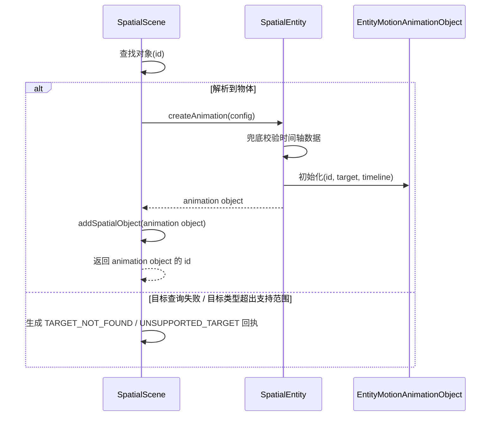

**播放与完成时序:**

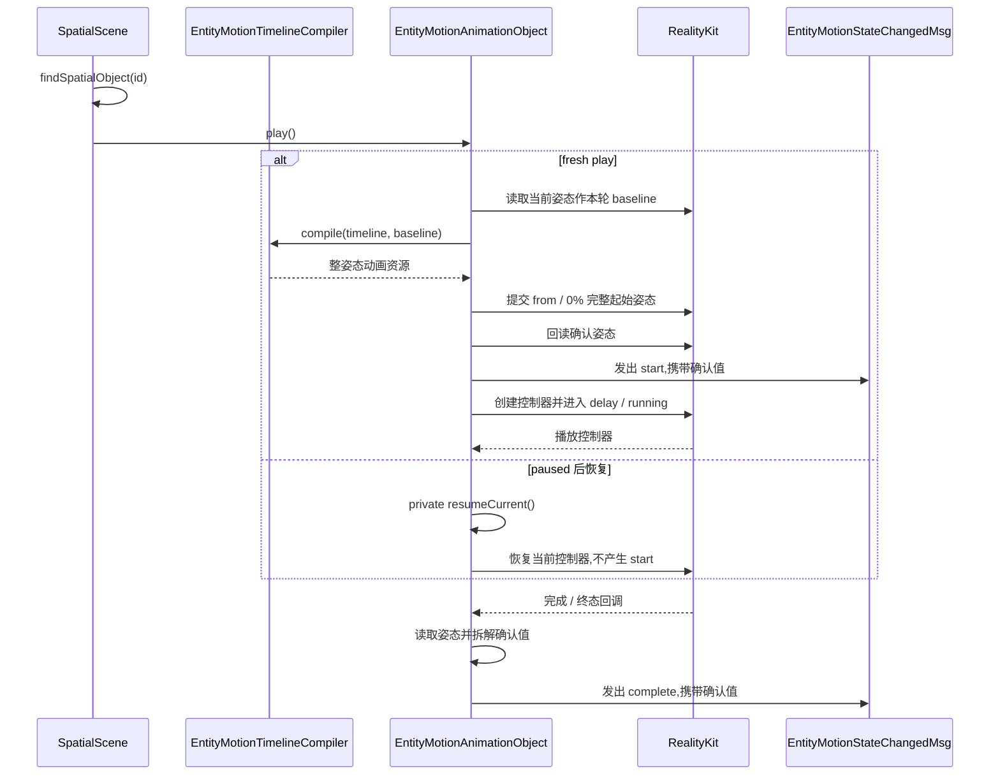

创建阶段只保存规范时间轴,由 `SpatialScene` 注册 animation object 并返回其 `id`。每次 fresh play 读取最新 baseline 并编译本轮 RealityKit 资源,随后提交并确认完整起始姿态;`start` 和首个 `entityProps` 更新发生在确认成功后,不等待 delay 结束。paused 后的 `play` 直接复用当前资源和控制器,不读取 baseline、不编译、不产生新的 `start`。

状态命令矩阵:

| 原生层状态 | `play` | `pause` | `stop` | `reset` | `finish` | `set` |
|---|---|---|---|---|---|---|
| `idle` | fresh play → `running`;起始姿态确认后发出一次 `start` | 保持 `idle` | 保持 `idle` | 提交起始姿态 → `idle`;发出 `reset` | 提交终点姿态 → `finished`;发出 `finish` | 提交更新;保持 `idle` |
| `running`(包含 delay) | 保持当前运行 | → `paused`;发出 `pause` | 提交当前姿态 → `idle`;发出 `stop` | 提交起始姿态 → `idle`;发出 `reset` | 提交终点姿态 → `finished`;发出 `finish` | 保持当前运行;返回警告回执 |
| `paused` | 恢复当前控制器 → `running` | 保持 `paused` | 提交当前姿态 → `idle`;发出 `stop` | 提交起始姿态 → `idle`;发出 `reset` | 提交终点姿态 → `finished`;发出 `finish` | 保持暂停运行;返回警告回执 |
| `finished` | fresh play → `running`;起始姿态确认后发出一次 `start` | 保持 `finished` | 保持 `finished` | 提交起始姿态 → `idle`;发出 `reset` | 保持 `finished` | 提交更新;保持 `finished` |

`reset` 和 `finish` 优先使用当前运行的已确认起始姿态和终点姿态。首次运行之前调用时,编译器按需读取当前原生层 transform 作为基准姿态,并计算配置声明的起始姿态或终点姿态。普通播放、reset loop 和 reverse loop 的 `finish` 统一提交配置声明的 `to` / `100%` 姿态。

生命周期门闩保证以下回调次数:每次接受 fresh play 时触发一次 `onStart`;动画自然进入 `finished`,或 `finish()` 使动画从 `idle`、`running`、`paused` 进入 `finished` 时触发一次 `onComplete`;每次从 `running` / `paused` 转到 `idle` 的已接受 `stop` 触发一次 `onStop`;每次接受 `reset` 时触发一次 `onReset`。`idle` 状态下接受 `finish` 时保持现有 `onStart` 次数。保持当前状态的重复命令同时保持现有回调次数。

**暂停时序:**

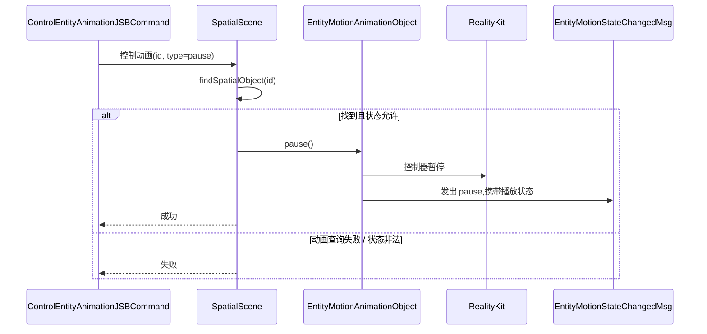

**停止、重置、结束时序:**

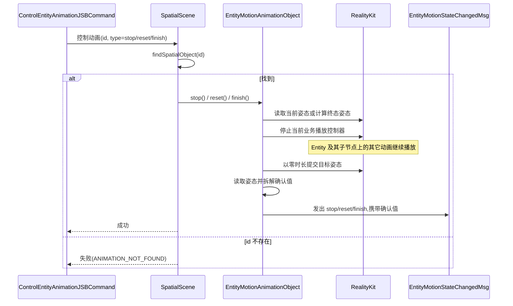

**set 时序:**

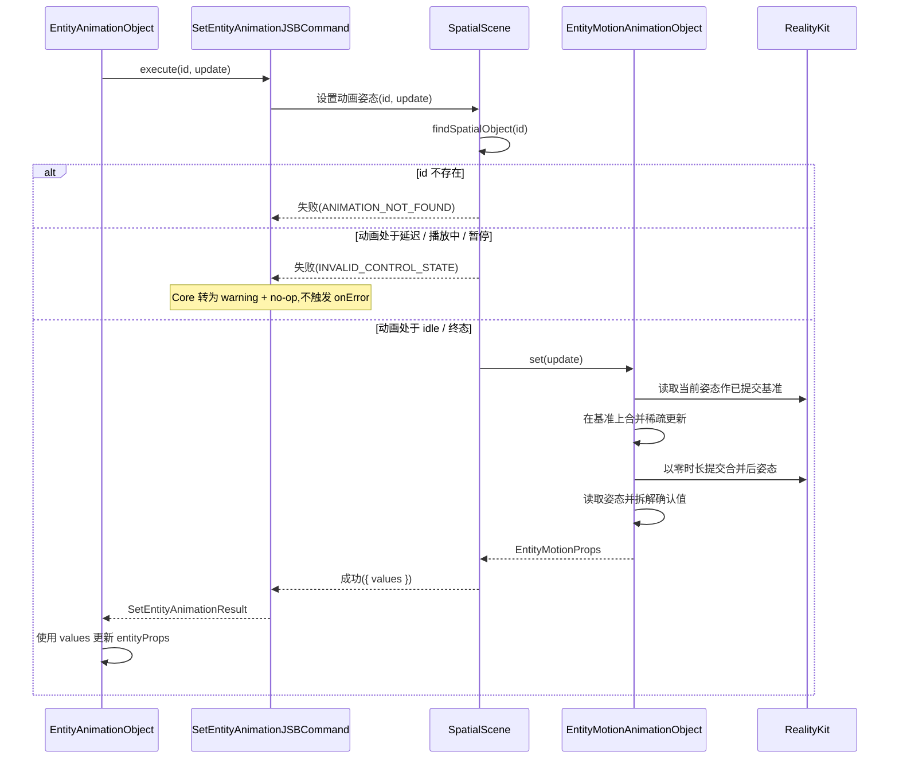

暂停复用已编译的整姿态串联动画并控制当前播放控制器。停止 / 重置 / 结束会停止该控制器,并以零时长提交目标姿态。`set` 在非活跃状态下把稀疏更新合并到已提交姿态后以零时长提交,回读完整确认姿态并通过成功回执返回。`set` 保持原有 `playState`,不发送状态事件。

Native Entity animation object 与一次 target binding 同生命周期;target 销毁时,`SpatialScene` 通过全局 `SpatialObject` lifecycle 级联销毁关联动画,不保留失效对象。

边界约束:`SpatialScene` 负责全局 `spatialObjects`、创建目标查找、动画对象查找、三条 Entity 命令回执和 `SpatialObject` lifecycle。`SpatialEntity.createAnimation(config)` 负责创建 Entity 动画对象;`EntityMotionAnimationObject` 内聚单对象编译、播放状态、控制、确认值、事件发送和资源释放。Entity 与 Element 路径保持独立协议,并共享全局 `spatialObjects` 生命周期。

## 6. 风险评估

| 风险 | 缓解 |
|---|---|
| 平台能力验证缺少可追溯记录 | 第 8 节验收任务记录平台版本、SDK 版本、fixtures、执行命令和结果 |
| 控制器级停止影响同一 Entity 或子节点上的其它动画 | 原生清理只停止当前 `EntityMotionAnimationObject` 持有的控制器,8.4/8.5 覆盖其它动画保持运行 |
| 零时长姿态提交影响其它动画或终态 | 状态命令矩阵限定 `stop` / `reset` / `finish` / `set` 的提交动作,8.4/8.5 覆盖终态提交 |
| transform owner 仲裁遗漏导致 React 写入覆盖动画 | `SpatialScene` 在普通 Entity transform 更新入口检查 owner,4.3/8.2 覆盖 ownership |
| 动画对象创建或同目标姿态交接失败后继续执行产生状态歧义 | 失败通过 `onError` 报告并终止当前绑定生命周期,清空镜像和待执行命令;4.3a 覆盖终止与显式重新绑定 |
| 创建请求和创建回执都使用 `id` 导致语义混淆 | 协议按消息方向固定含义:请求为目标 Entity id,回执为动画对象 id;Core/Native contract 测试分别断言 |
| 状态事件和错误事件重复报告同一失败 | 同一失败只选择命令回执或 `entityanimationerror` 一个出口,状态事件不承载错误 |
| 三条 Entity JSB 命令在 Core 与 Native 间发生结构漂移 | Bridge contract 测试分别覆盖创建、控制、设置命令和两类事件 |
