# `useEntityAnimation` 重设计

## 1. 背景

`useEntityAnimation` 是 WebSpatial SDK 中驱动场景内 3D 物体姿态动画的 React Hook。它支持百分比关键帧、动画结果回写和统一的命令式姿态设置,并把物体动画统一到通用动画的绑定、生命周期和跨端协议上。

本次重设计将物体动画接入通用动画架构:React 层提供 Hook、绑定和结果镜像,Core 层完成配置归一化与校验,visionOS 原生层使用 RealityKit 编译和执行动画。原生姿态是唯一权威数据源,所有姿态变更经原生确认后再回传 React,从结构上避免动画终态与 React 基础属性冲突导致的回弹。

本设计的目标是:

- 给出 React、Core、原生三层的职责边界和数据流。
- 明确“配置 → 规范轨道 → RealityKit 动画”和“原生确认姿态 → `entityProps`”两条链路。
- 物体复用现有创建、控制和状态事件协议。
- 动画对象统一支持空间元素和物体等目标类型。

本设计的公开 API 范围是动画绑定、播放控制和确认姿态回写,执行引擎统一为原生 RealityKit。本文完整定义 API 形态、行为边界、跨端协议、编译规则和模块职责,可独立用于技术评审。

## 2. 名词解释

- **物体(Entity)**:场景里的一个 3D 对象,例如一个盒子。它有三组空间属性,合称"姿态"。
- **姿态(transform)**:物体在空间中的状态,由位置 `position`(米)、旋转 `rotation`(度)、缩放 `scale`(倍数)三部分组成。
- **分量**:指姿态三部分之一,即 `position`、`rotation` 或 `scale`。
- **原生层 / RealityKit**:苹果 visionOS 上真正驱动 3D 物体运动的底层引擎,由 Swift 实现。本文说"原生"即指这一层。
- **React 层 / 公共逻辑层(Core)**:分别是面向使用者的 Hook 代码,和两端共用的、与平台无关的逻辑代码。
- **JS Bridge 命令 / 事件**:JavaScript 与原生层之间收发消息的通道。命令由 JS 发往原生,事件由原生回传给 JS。
- **权威数据源**:某份数据以谁为准。本设计中物体的真实姿态只以原生层为准。
- **镜像(mirror)**:React 侧把原生层已确认的姿态复制一份出来供渲染使用,这份复制就叫镜像。
- **`entityProps`**:Hook 返回给使用者的姿态镜像,形如 `{ position?, rotation?, scale? }`,展开到组件上可让物体停在动画终点。
- **确认姿态(confirmed transform)**:原生层执行完一个动作后,回读物体真实姿态并回传的那份值。React 只用这种值更新 `entityProps`。
- **轨道(track)/ 通道(channel)**:一条描述单个属性(如 `position.y`)随时间变化的曲线;二者可互换,均指某单个属性的关键帧序列。编译时把各通道关键帧时间取并集切片、每个切点采样出完整姿态后整体播放(见 5.3)。
- **关键帧(keyframe)**:曲线上的一个时间点及其取值,例如"第 0.6 秒时 `position.y` = 0.25"。
- **缓动函数(timingFunction)**:描述两帧之间快慢变化的曲线,如匀速 `linear`、先慢后快 `easeIn`。
- **基准值(baseline)**:某通道开始播放时的原生当前值;当该通道缺少起始关键帧时用它兜底。
- **球面线性插值(slerp)**:RealityKit 对旋转采用的插值方式,总是走两个朝向之间的最短路径。
- **空操作(no-op)**:命令被接收后,物体和 `entityProps` 保持原值。
- **注册表(registry)**:原生层用来按 id 查找物体或动画对象的表。

## 3. 要实现的功能

`useEntityAnimation` 让使用者用位置、旋转、缩放描述动画,将动画绑定到物体,并在原生确认后获得物体姿态。功能清单如下:

| 功能 | 说明 |
|---|---|
| 姿态动画 | 属性白名单为 `position`、`rotation`、`scale`;`opacity` 等非姿态属性触发显式校验失败。 |
| 多种时间轴写法 | 支持顶层 `from` / `to`、`timeline.from` / `timeline.to` 和 `0% → 50% → 100%` 百分比关键帧。 |
| 动画绑定 | Hook 返回 `animation`,通过物体组件的 `animation` 属性绑定目标。 |
| 播放控制 | `api` 提供 `play`、`pause`、`stop`、`reset`、`finish`。 |
| 结果回写 | 原生在开始、完成、停止、重置、结束等确认节点回传姿态,React 以 `entityProps` 暴露结果,避免终态回弹。 |
| 命令式设置 | 非活跃状态下通过 `api.set(patch)` 在原生已提交姿态上合并稀疏补丁。 |
| 生命周期与错误 | 复用通用动画的创建、控制、销毁、目标失效和错误事件链路。 |
| 能力检测 | 通过 `supports('useEntityAnimation')` 检测整体能力。 |

## 4. 设计思路及折中

### 4.1 设计原则

#### 原生层是唯一权威数据源

物体姿态以原生 RealityKit 为准。React 维护原生确认姿态的只读镜像。

`entityProps` 只是原生已确认姿态在 React 侧的镜像,数据只朝一个方向流动:

```text
React 配置 / api.set
  -> 原生动画引擎(唯一权威)
  -> 确认后的姿态
  -> entityProps 镜像
```

由此得到几条规则:

- 播放、停止、重置、结束、`api.set` 等一切会改变姿态的操作,都要先进原生层。
- 原生命令结果为失败时,物体姿态与 `entityProps` 保持原值。
- 原生接受命令时,通过动画状态事件回传确认姿态,React 再更新 `entityProps`。
- React 把原生确认过的姿态镜像给使用者;动画进行中的写入按空操作处理。
- 首个确认姿态到来前 `entityProps` 可能为空。确认之后,它包含被动画接管的分量和被 `api.set` 写入的分量,字段范围限定在 `position` / `rotation` / `scale` 之内。

#### 复用通用动画架构

`useEntityAnimation` 尽量复用通用动画的绑定、目标解析、动画对象生命周期和"创建—控制—事件"链路。物体路径的差异只集中在以下几处:

- 描述方式:用 `position` / `rotation` / `scale`。
- 校验:属性白名单为 `position`、`rotation`、`scale`,其它属性触发显式校验失败。
- 结果出口:`entityProps`。
- 目标类型:`SpatialEntity`。
- 执行引擎:RealityKit。

### 4.2 RealityKit 选型

原生执行引擎选定为 **RealityKit**,原因:

1. **统一执行引擎。** 物体动画与通用动画共用 RealityKit 一套引擎,避免为物体单开一套执行路径。
2. **它天生就是 3D 物体的执行引擎。** 大量物体并发动画时,引擎原生播放比 SDK 逐帧写入扩展性更好。
3. **播放和上报需求它都能满足。** 它能控制播放状态,能读到物体当前姿态,能在播放完成时给出事件,足以实现停止、重置、结束,并把确认姿态上报给回调和 `entityProps`。

主要新增成本是一个编译器:把归一化后的物体轨道翻译成 RealityKit 能执行的姿态动画。

#### RealityKit 原生播放的执行优势

物体动画全部使用 RealityKit 原生播放,具备以下优势:

- **同步渲染节拍。** 姿态动画与 RealityKit 渲染提交保持同一节拍。
- **参与系统合成。** 动画直接参与 visionOS 的系统合成与重投影。
- **融入场景体系。** 姿态动画天然处在场景图、坐标空间、锚点和碰撞体系内。
- **提供高质量插值。** RealityKit 使用球面线性插值处理旋转。
- **复用完整播放语义。** RealityKit 提供缓动、循环、延迟、播放速率、暂停和完成事件。
- **统一执行语义。** 元素与物体路径统一使用原生动画对象。

### 4.3 各层职责与整体架构

#### 整体架构

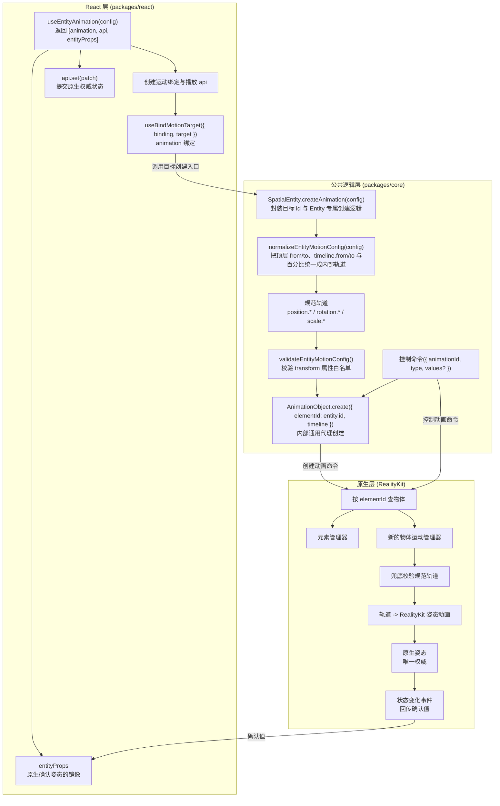

**各层职责:**

- **React 层**负责 Hook API、绑定生命周期、`entityProps` 镜像、回调分发和重渲染。目标绑定完成后,绑定器调用 `SpatialEntity.createAnimation(config)`。
- **公共逻辑层**由 `SpatialEntity.createAnimation(config)` 封装目标 id、Entity 专属归一化与校验,再把规范时间轴委托给通用 `AnimationObject`。归一化会把对外的三种书写形态(顶层 `from` / `to`、`timeline.from` / `timeline.to`、百分比关键帧)折叠成内部的规范物体轨道;当 `timeline` 与顶层 `from` / `to` 同时出现时,`timeline` 作为唯一生效输入,开发模式同时打印重复声明警告。`elementId` 是 Core 到原生创建命令的空间对象 id 传输字段。
- **原生层**负责查找目标、兜底校验、用 RealityKit 编译并执行、返回命令结果、拆解最终姿态并通过事件回传。

#### 跨层类图

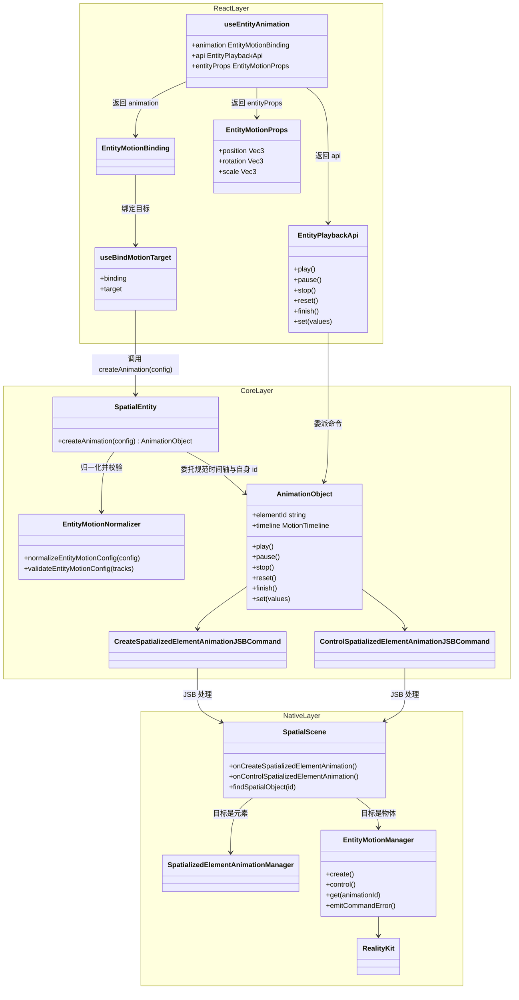

上图集中展示 React、公共逻辑和原生三层的类,各类归属图中标注的层级。原生的目标解析在 `SpatialScene` 的创建 / 控制处理里进行:通过 `findSpatialObject` 查注册表,再按运行时类型分发到元素管理器或物体管理器。

#### 跨层协议

物体复用以下命令与事件:

- 创建动画:`CreateSpatializedElementAnimationJSBCommand`
- 控制动画:`ControlSpatializedElementAnimationJSBCommand`
- 状态事件:`spatialanimationstatechanged`

##### 创建动画命令

命令名与 `elementId` 字段承载空间对象。`elementId` 实际含义是空间对象 id,既可指向元素,也可指向物体:

```text
CreateSpatializedElementAnimation {
  elementId: string
  timeline: EntityMotionTimeline | SpatializedMotionTimeline
}
```

原生按 `elementId` 查注册表,再按运行时类型分发:

```text
是元素   -> 元素管理器
是物体   -> 物体运动管理器
其它     -> 失败
```

规则:

- `elementId` 的注册表查询结果为空时,创建必须显式失败。
- 元素和物体是合法的动画目标;其它对象类型以 `UNSUPPORTED_TARGET` 失败。
- 控制命令通过 `animationId` 查找已创建的动画。
- 目标对象已销毁时,关联动画必须被销毁或失效;后续控制必须失败并通过错误事件暴露。

##### 控制动画命令

复用命令,并新增 `set` 类型:

```text
ControlSpatializedElementAnimation {
  animationId: string
  type: 'play' | 'pause' | 'stop' | 'reset' | 'finish' | 'destroy' | 'set'
  values?: EntityMotionPatch
}
```

`api.set` 复用控制命令,接受稀疏补丁对象 `EntityMotionPatch`(写入侧类型,与读取侧的 `EntityMotionProps` 同形态,但命名区分),并以 `type: 'set'` 发往原生:

- 原生返回失败:命令失败或触发错误事件,`entityProps` 保持原值。
- 原生接受:原生在当前已提交姿态上合并补丁、应用后,通过状态事件回传确认值,React 再更新 `entityProps`。

##### 状态变化事件

状态事件携带一个具名的 detail 类型:

```text
interface EntityMotionStateChangedDetail {
  animationId: string
  action:
    | 'play' | 'pause' | 'stop' | 'reset' | 'finish' | 'destroy' | 'set'
    | 'start' | 'complete' | 'error'
  playState: 'idle' | 'queued' | 'running' | 'paused' | 'finished'
  finished: boolean
  values?: EntityMotionProps
  error?: SpatializedPlaybackError
}

interface EntityMotionStateChangedMsg {
  type: 'spatialanimationstatechanged'
  detail: EntityMotionStateChangedDetail
}
```

`values` 为物体目标的姿态值 `EntityMotionProps`(即 `position` / `rotation` / `scale`)。

原生回传的 `action` 集合比对外回调多。它与用户回调、`entityProps` 的对应关系如下:

| 原生 action | 对应用户回调 | 是否更新 entityProps |
|---|---|---|
| `start` | `onStart` | 是(开始那一刻一次) |
| `complete` | `onComplete` | 是(终态) |
| `finish` | `onComplete` | 是(终态) |
| `stop` | `onStop` | 是(当前姿态) |
| `reset` | `onReset` | 是(起点姿态) |
| `set` | 无(仅内部提交) | 是(合并后的姿态) |
| `error` | `onError` | 否 |
| `pause` | 无(仅播放状态变更) | 否 |

##### 播放错误分类

`action` 为 `error` 时携带 `error`。错误码是两类目标共享的封闭集合:

```text
type SpatializedPlaybackError = {
  code:
    | 'TARGET_NOT_FOUND'     // 注册表缺少 elementId
    | 'UNSUPPORTED_TARGET'   // 目标类型超出元素和物体集合
    | 'TARGET_DESTROYED'     // 目标已销毁,动画失效
  message?: string
}
```

以上三类错误都会通过 `onError` 抵达用户。动画活跃期间、绑定前或原生对象创建前的 `api.set` 写入归类为空操作并打印控制台警告。错误码提供稳定的应用分支依据。

#### 跨层时序

##### 从配置到原生姿态(播放)

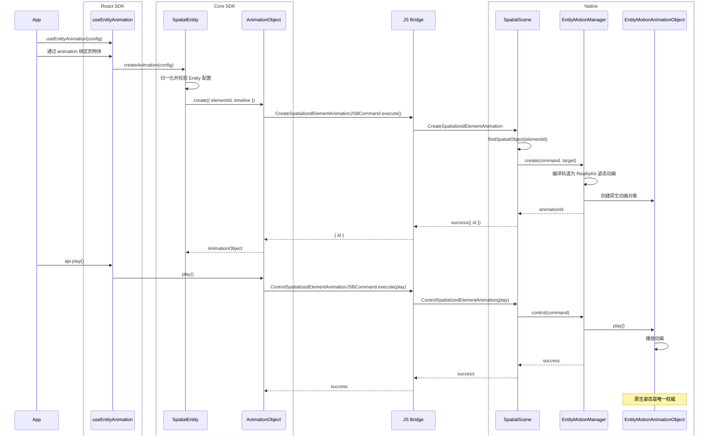

##### 从原生确认姿态到 React 镜像

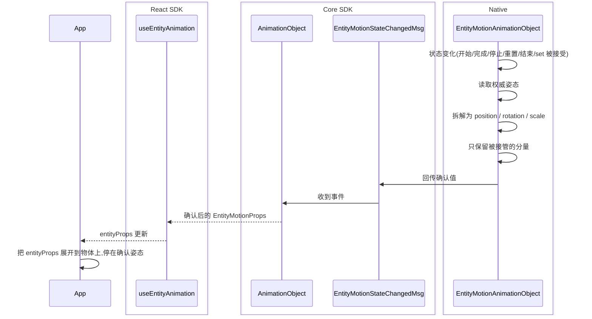

`api.set` 是否生效由原生决定:原生仅在动画处于非活跃状态且原生对象已经创建时接受补丁,其它时机按空操作处理并打印控制台警告。首次生命周期提交(一次播放终态或一次被接受的 `set`)产出首个确认值,在此之前 `entityProps` 可能为空。

### 4.4 关键折中

- **命令名保留 `Element` 字样。** 物体复用现有创建和控制命令;其目标态语义为空间对象,`elementId` 表示空间对象 id。
- **承担原生编译成本。** 多关键帧、稀疏关键帧、旋转换算和整姿态串联编译集中在物体运动管理器与编译器,换取 RealityKit 原生播放、系统合成和统一播放语义。
- **切片为整姿态串联。** 把时间轴切成若干节点、每个节点携带完整的 `position` / `rotation` / `scale`,再按先后顺序串联成一条整姿态动画播放。visionOS(RealityKit)的动画绑定粒度是整个 `.transform`,当前缓动需求也以整段为单位。因此采用整姿态串联,天然对齐 visionOS 与 picoOS(两端原生都绑定整 transform);同一区间内各通道共用一个 `timingFunction`。
- **整 transform 接管。** 动画一旦活跃,整个 `.transform` 由动画接管。例如只动画 `position.y` 时,`position.x` / `position.z` 乃至 `rotation` / `scale` 在播放期间都冻结在基准值;动画结束后才可由 React 属性 / `api.set` 接管。
- **`set` 使用稀疏补丁对象。** v1 的 `api.set` 接受稀疏补丁对象,当前确认姿态通过 `entityProps` 读取。
- **按运行时类型直接分发。** v1 在 `SpatialScene` 中把元素和物体分别分发到对应管理器;两条路径出现真实重复时再提取公共协议。
- **并发性能需要实测。** RealityKit 原生播放优于 JS 逐帧写入,但海量物体并发仍需专项性能验证。

## 5. 模块设计

### 5.1 React SDK

- **公开接口:** `useEntityAnimation` 返回 `[animation, api, entityProps]`;物体组件通过 `animation` 属性接收 `EntityMotionBinding`。
- **播放控制:** `EntityPlaybackApi` 提供 `play`、`pause`、`stop`、`reset`、`finish` 和 `set`;`api.set(values)` 把稀疏状态补丁提交给原生。
- **目标绑定:** `useBindMotionTarget({ binding, target })` 维护一个 binding 对应一个 `SpatialEntity` 的约束,绑定完成后调用 `target.createAnimation(config)`。
- **结果镜像:** `entityProps` 镜像原生确认的 `position`、`rotation`、`scale`,并驱动 React 重渲染与生命周期回调。

#### 类图

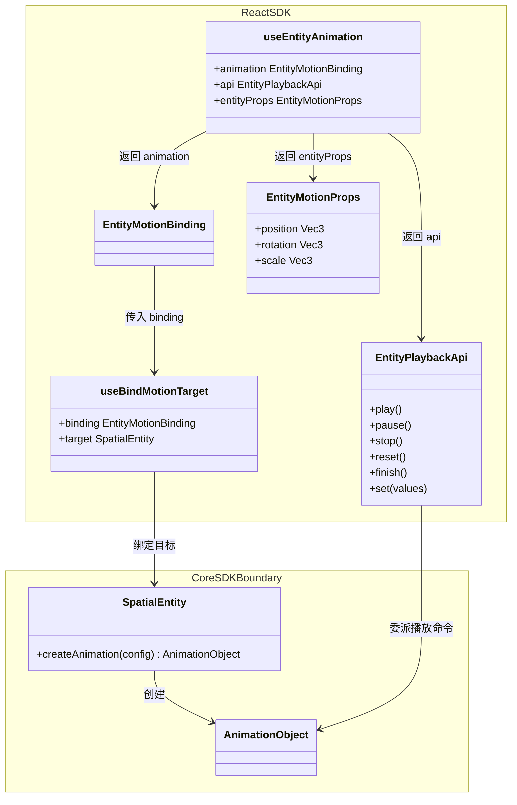

### 5.2 Core SDK

- **目标创建入口:** `SpatialEntity.createAnimation(config)` 使用自身 id,执行 Entity 专属归一化与校验,再把规范时间轴委托给通用 `AnimationObject` 创建流程。
- **动画对象:** `AnimationObject` 按目标类型承载时间轴与回传值,负责创建 / 控制命令、播放状态和事件订阅;`elementId` 是 Core 到原生创建命令的空间对象 id 传输字段。
- **类型与函数:** Core 定义物体运动类型、`EntityMotionPatch`、`EntityMotionProps`、属性白名单、归一化函数、校验函数以及内部规范时间轴。

#### 类图

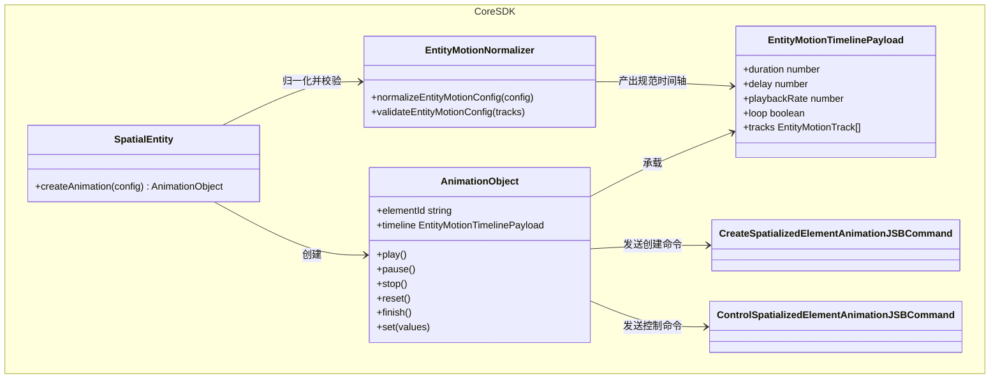

#### 类型、归一化与校验

归一化由公共逻辑层的 `normalizeEntityMotionConfig` 完成,把三种对外写法统一成同一套内部时间轴数据。

**输入:** 对外的三种书写形态,折叠规则为:

- **顶层 `from` / `to`** 等价于 `timeline.from` / `timeline.to`,展开成起止两帧。
- **`timeline.from` / `timeline.to`** 即 `0%` / `100%` 帧,可与百分比 key 混写。
- **百分比关键帧** `0% → 50% → 100%` 按 `at = 百分比 × duration` 折算成秒。

完整归一化规则包括 `timeline` 优先、边界必填和 `duration` 默认值,详见本节后文。

**输出:** 平台无关的 `EntityMotionTimelinePayload`,结构如下:

```text
type EntityMotionTimelinePayload = {
  duration: number
  delay?: number
  playbackRate?: number
  loop?: boolean | { reverse?: boolean }
  tracks: EntityMotionTrack[]
}

type EntityMotionTrack = {
  property: EntityMotionProperty
  keyframes: EntityMotionKeyframe[]
  timingFunction?: TimingFunction
}

type EntityMotionProperty =
  | 'position.x' | 'position.y' | 'position.z'
  | 'rotation.x' | 'rotation.y' | 'rotation.z'
  | 'scale.x'    | 'scale.y'    | 'scale.z'

type EntityMotionKeyframe = {
  at: number
  value: number
  timingFunction?: TimingFunction
}
```

示例:

```text
{
  duration: 1.2,
  tracks: [
    {
      property: 'position.y',
      timingFunction: 'easeOut',
      keyframes: [
        { at: 0, value: 0 },
        { at: 0.6, value: 0.25 },
        { at: 1.2, value: 0 },
      ],
    },
    {
      property: 'rotation.y',
      timingFunction: 'linear',
      keyframes: [
        { at: 0, value: 0 },
        { at: 1.2, value: 180 },
      ],
    },
  ],
}
```

归一化与校验规则:

- 顶层 `from` / `to` 与 `timeline.from` / `timeline.to` 折叠到同一套内部轨道。
- `timeline.from` / `timeline.to` 分别表示 `0%` / `100%`,并可与百分比关键帧混写;同一边界重复声明时显式报错。
- `timeline` 与顶层 `from` / `to` 同时出现时,`timeline` 作为唯一生效输入,开发模式打印重复声明警告。
- 纯顶层 `from` / `to` 形态的 `duration` 默认 0.3 秒。
- 每个动画同时提供起始和结束边界;边界帧内部字段可保持稀疏,缺帧标量在 Native 编译时回落到 baseline。

#### 能力检测

文档和示例统一使用顶层能力检测:

```text
supports('useEntityAnimation')
```

### 5.3 Native

- **命令入口:** `SpatialScene` 承接创建和控制命令,通过 `elementId` 查找目标并按运行时类型分发。
- **执行子系统:** `EntityMotionManager` 负责兜底校验、编译调度、动画注册、控制与 `set` 路由、生命周期和目标失效。
- **确认值回传:** `EntityMotionAnimationObject` 读取并拆解原生姿态,通过状态事件回传确认值。

#### 类图

子系统以可读性和可测试性为拆分标准,文件组织可独立于元素路径。以下是推荐职责边界;管理器内部辅助可按逻辑复杂度和复用需求合并或拆分。

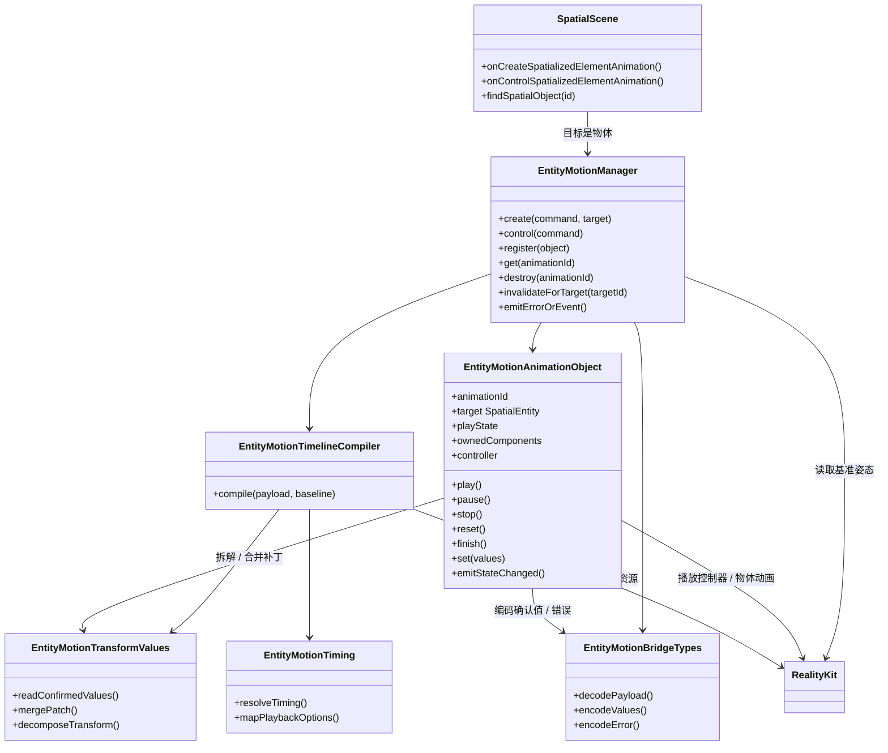

**各类职责:**

- **物体运动管理器(`EntityMotionManager`):** 物体运动的原生入口。承接 `SpatialScene` 分发过来的创建与控制,集中管理动画注册表与生命周期。创建时调用编译器、生成动画对象、注册并返回 `animationId`;控制时按 `animationId` 找到对象并调用对应方法。负责命令失败的回执、销毁、目标失效处理,并在查找 / 校验阶段直接失败时上报错误。确认值的事件回传由动画对象完成。
- **物体动画对象(`EntityMotionAnimationObject`):** 表示单个物体动画,保存 `animationId`、目标物体、播放状态、被接管分量、播放控制器与资源,负责单个对象的状态转换。每次开始 / 终态 / `set` 被接受后,借拆解辅助得到确认值、经桥接辅助编码,再发出状态变化事件。
- **时间轴编译器(`EntityMotionTimelineCompiler`):** 接受归一化后的时间轴数据,将其切片编译为一条串联的整姿态 RealityKit 动画资源。
- **桥接类型(`EntityMotionBridgeTypes`):** 承载原生桥接的编解码结构,包括时间轴数据、控制值、确认值和错误。若命令类型已够用,这部分可作为若干结构体分散存在。
- **播放参数映射(`EntityMotionTiming`):** 把缓动、延迟、循环、播放速率映射到 RealityKit 的表达;四种内建缓动全部直接映射。
- **姿态拆解与合并(`EntityMotionTransformValues`):** 负责从物体姿态拆解确认值、把 `api.set` 的稀疏补丁合并到已提交基准上,以及欧拉角度数与 RealityKit 旋转表示之间的换算。

#### 时间轴编译

编译由原生物体运动管理器完成:拿到归一化的内部时间轴,读取基准姿态,把时间轴切成若干携带完整姿态的节点并逐段编译,最终产出可控播放对象。

##### 输入:内部时间轴

编译的输入就是归一化的产物 `EntityMotionTimelinePayload`(结构见上节),且目标已解析为物体。

##### 编译流程

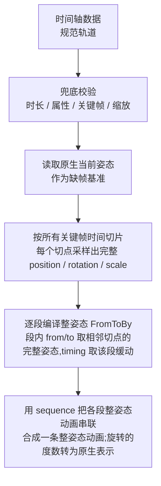

##### 时间轴切片为整姿态节点并串联

整条时间轴只对应一个绑定目标——整个 `transform`。把所有通道的关键帧时间取并集作为切点,相邻切点之间构成一段;每个切点都采样出完整的 `position` / `rotation` / `scale`,于是每段就是一次“整姿态到整姿态”的过渡。

**逐段——用 `FromToByAnimation<Transform>` 表达。** 每段的 `from` / `to` 取相邻两个切点的完整姿态,`duration` 取该段时长,`timing` 取该段缓动(缓动优先级见编译规则 9),`bindTarget` 固定为 `.transform`。visionOS 的动画绑定粒度是整个 `.transform`,这也是选择整姿态切片的根本原因。

**串联——用 `sequence` 首尾相接。** 各段整姿态动画按时间顺序用 `AnimationResource.sequence(with:)` 串成一条动画,让每段各自带缓动、又连续播放。只有起止两帧的时间轴退化为单个 `FromToByAnimation<Transform>`。`delay` / `speed` / `loop` 作用在这条串联动画的顶层。

以一个例子说明(`position.y` 有 3 帧、`rotation.y` 只有起止 2 帧,切点并集为 `0 / 0.6s / 1.2s`,共 2 段):

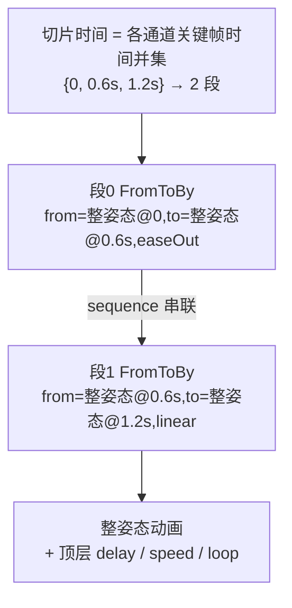

每段都携带完整姿态并按时间顺序串联,`delay` / `speed` / `loop` 作用在串联动画顶层。

##### 输出:可控播放对象与代码演示

编译的最终输出是可控播放对象。沿用上文示例(2 段整姿态),下面分别用 visionOS 与 picoOS 演示:每段编成一个整姿态 `FromToBy`,用 `sequence` 串成一条动画资源,最后交给引擎播放,拿到可暂停 / 恢复 / 停止 / 变速的播放控制器——即“可控播放对象”。两端都绑定整个 transform,写法对齐。

visionOS(RealityKit / Swift):

```swift
import RealityKit

// 沿用示例;每个切点携带完整 position / rotation / scale,只有 y 与绕 y 旋转在变
let base = entity.transform

// 采样某切点的完整姿态(x / z / scale 冻结在基准,只有 pos.y 与 rot.y 在动)
func pose(y: Float, deg: Float) -> Transform {
    var t = base
    t.translation = SIMD3(base.translation.x, y, base.translation.z)
    t.rotation = simd_quatf(angle: deg * .pi / 180, axis: SIMD3(0, 1, 0))
    return t
}

// 段0:整姿态从 t=0 到 t=0.6s
let seg0 = FromToByAnimation<Transform>(
    name: "seg0",
    from: pose(y: 0,    deg: 0),
    to:   pose(y: 0.25, deg: 90),
    duration: 0.6,
    timing: .easeOut,                 // 段0 自己的缓动
    bindTarget: .transform            // 只能绑定整个 transform
)
// 段1:整姿态从 t=0.6s 到 t=1.2s
let seg1 = FromToByAnimation<Transform>(
    name: "seg1",
    from: pose(y: 0.25, deg: 90),
    to:   pose(y: 0,    deg: 180),
    duration: 0.6,
    timing: .linear,                  // 段1 与段0 分别采用各自缓动
    bindTarget: .transform
)

// 各段整姿态动画按时间顺序用 sequence 串成一条动画
let clip = try AnimationResource.sequence(with: [
    try AnimationResource.generate(with: seg0),
    try AnimationResource.generate(with: seg1),
])

// 得到可控播放对象:控制器支持暂停 / 恢复 / 停止 / 变速
let controller = entity.playAnimation(clip, transitionDuration: 0, startsPaused: true)
controller.resume()          // play
// controller.pause()        // pause
// controller.stop()         // stop
// controller.speed = 2.0    // 顶层播放速率作用在整条串联动画
```

picoOS(Pico Spatial SDK / Kotlin):

```kotlin
// 沿用同一示例;每个切点携带完整 Transform,x / z / scale 冻结在基准
val base = entity.getComponent(Transform::class.java) ?: Transform()

// 采样某切点的完整姿态(只有 pos.y 与绕 y 旋转在变)
fun pose(y: Float, deg: Float): Transform {
    val q = Quaternion.fromAxisAngle(Vector3(0f, 1f, 0f), deg)
    return Transform(Vector3(base.position.x, y, base.position.z), q, base.scale)
}

// 段0:整姿态从 t=0 到 t=0.6s
val seg0 = TweenAnimation.createTweenAnimation(
    "seg0",
    AnimationBindTarget.bindTransform(),   // 只能绑定整个 transform
    pose(0f,    0f),                        // from(完整姿态)
    pose(0.25f, 90f),                       // to(完整姿态)
    null,                                   // by
    0.6f, 0f, RepeatMode.None, 0,           // duration / delay / repeatMode / repeatCount
    EaseType.EaseOut,                       // 段0 缓动
    0f, 1f, false, null, null, null
)
// 段1:整姿态从 t=0.6s 到 t=1.2s
val seg1 = TweenAnimation.createTweenAnimation(
    "seg1",
    AnimationBindTarget.bindTransform(),
    pose(0.25f, 90f),
    pose(0f,    180f),
    null,
    0.6f, 0f, RepeatMode.None, 0,
    EaseType.Linear,                        // 段1 与段0 分别采用各自缓动
    0f, 1f, false, null, null, null
)

// 各段整姿态动画按时间顺序用 sequence 串成一条动画
val clip = AnimationResource.sequence(with = listOf(
    AnimationResource.generateWithTweenAnimation(seg0),
    AnimationResource.generateWithTweenAnimation(seg1),
))

// 得到可控播放对象
val controller = entity.playAnimation(clip)
// controller.pause() / controller.resume() / controller.stop()
// controller.speed = 2f     // 顶层播放速率作用在整条串联动画
```

##### 编译规则

1. **属性白名单:** 只接受 `position.*`、`rotation.*`、`scale.*`。`opacity`、材质、组件属性等一律显式失败。
2. **时间范围:** `duration` 必须为正;每个关键帧的 `at` 必须落在 `[0, duration]` 内。
3. **排序与重复:** 每条轨道的关键帧按 `at` 非递减排序;每个属性对应一条唯一轨道。
4. **切片时间取各通道并集:** 把所有通道的关键帧时间取并集作为整条时间轴的切点,相邻切点之间构成一段。例如 `position.y` 在 `0, 0.6, 1.2`、`rotation.y` 在 `0, 1.2`,并集 `0, 0.6, 1.2` 切成 `[0, 0.6]` 与 `[0.6, 1.2]` 两段。
5. **每个切点采样完整姿态,缺帧按通道回落:** 每个切点都要给出完整的 `position` / `rotation` / `scale`。某通道在该时刻存在关键帧空缺时,则在它自己的关键帧之间插值取值;早于该通道首帧的时段回落到播放起点的原生基准值,晚于末帧的时段保持末帧值。配置中空缺的分量(例如 `scale.*`)会被采样为基准值并在播放期间保持原值——即整个 transform 在动画期间都由动画持有。
6. **逐段串联整姿态:** 相邻切点构成一段整姿态 `FromToByAnimation<Transform>`,各段按时间顺序用 `sequence` 串成一条整姿态动画,统一绑定到整个 transform(`bindTarget: .transform`),详见“时间轴切片为整姿态节点并串联”。
7. **旋转:** `rotation.*` 输入是欧拉角度数,编译时转成 RealityKit 所需的旋转表示,由 RealityKit 使用最短路径球面插值处理。某个旋转通道若单帧增量达到或超过 180°、或跨多轴,实际路径可能区别于逐轴直觉;特定的多圈或多轴路径由使用者通过中间关键帧显式定义。
8. **缩放:** `scale.*` 必须非负,非法缩放直接失败。
9. **缓动优先级:** 关键帧级缓动优先于轨道级,轨道级优先于时间轴默认值。缓动取值是封闭枚举 `linear` / `easeIn` / `easeOut` / `easeInOut`,全部直接映射到 RealityKit 内建曲线。此外,由于每段绑定整个 transform,同一段内 `position` / `rotation` / `scale` 共用该段的缓动。
10. **循环 / 播放速率 / 延迟:** 这些播放参数放在时间轴顶层,对整条串联动画统一生效,由 RealityKit 播放层执行。
11. **失败显式化:** RealityKit 无法表达某个段时,必须通过命令失败或错误事件显式报错。

#### 姿态拆解与确认值回传

原生回传给 React 的值必须是物体 API 的形态:

```text
type EntityMotionProps = {
  position?: Vec3
  rotation?: Vec3
  scale?: Vec3
}
```

拆解规则:

- `position` 来自原生姿态的平移部分。
- `scale` 来自原生姿态的缩放部分。
- `rotation` 用与物体属性一致的欧拉角度数。
- 拆解后必须按该动画对象当前接管的分量裁剪:回传被动画接管的分量,以及被 `api.set` 写入的分量。若 `api.set` 写入了一个配置里没动画的分量,该分量并入被接管集合,后续也出现在 `entityProps` 中。
- 回调值和 `entityProps` 都用 `EntityMotionProps` 形态;`api.set(values)` 接受同形态的写入侧 `EntityMotionPatch`,命名区分读写两侧。

#### Native 内部时序

**创建与编译时序:**

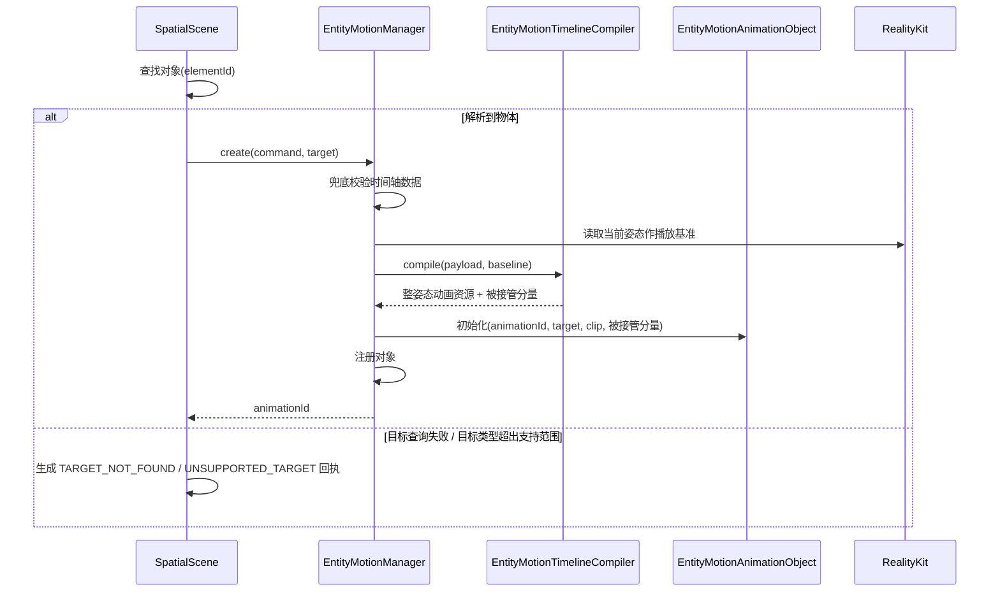

**播放与完成时序:**

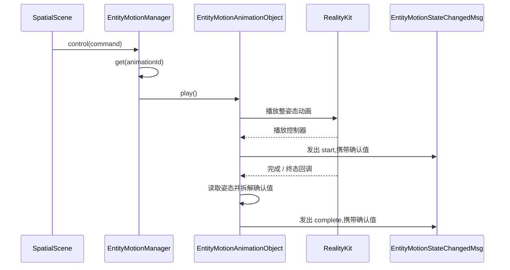

创建与编译阶段生成原生动画对象和编译计划并返回 `animationId`。播放阶段取得 RealityKit 控制器,开始和完成回调产出确认值。物体动画对象持有整条时间轴编译后的整姿态串联动画 / 控制器;轨道切片与单段粒度属于编译器内部实现。

**暂停时序:**

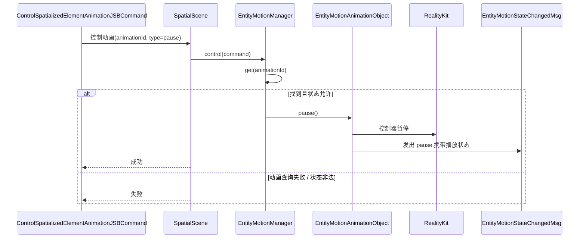

**停止、重置、结束时序:**

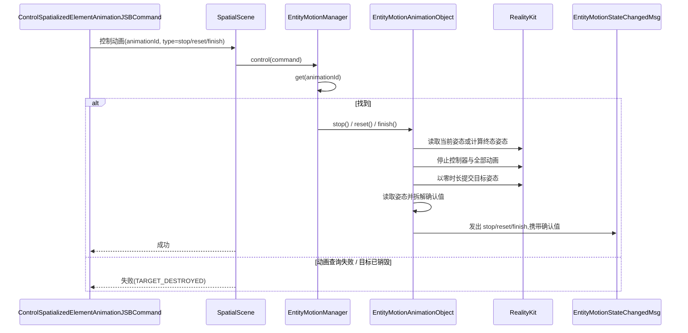

**set 时序:**

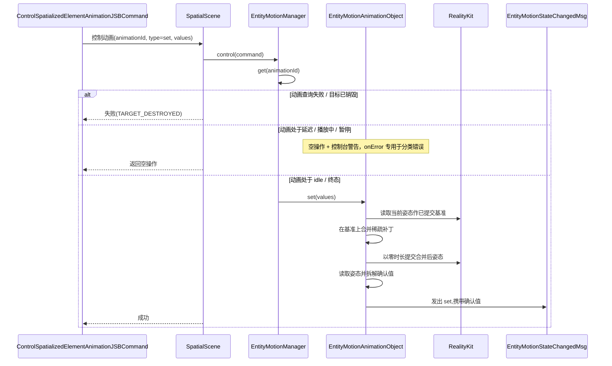

暂停复用已编译的整姿态串联动画并控制当前播放控制器。停止 / 重置 / 结束会终止当前播放,并以零时长提交终态姿态。`set` 在非活跃状态下把稀疏补丁合并到已提交姿态后直接提交。

边界约束:`SpatialScene` 负责目标查找、类型分发和命令回执;物体运动管理器集中负责物体专属编译、播放状态、注册表、创建 / 控制编排与生命周期。两条路径出现统一目标边界需求时,再提取公共协议或薄封装。
