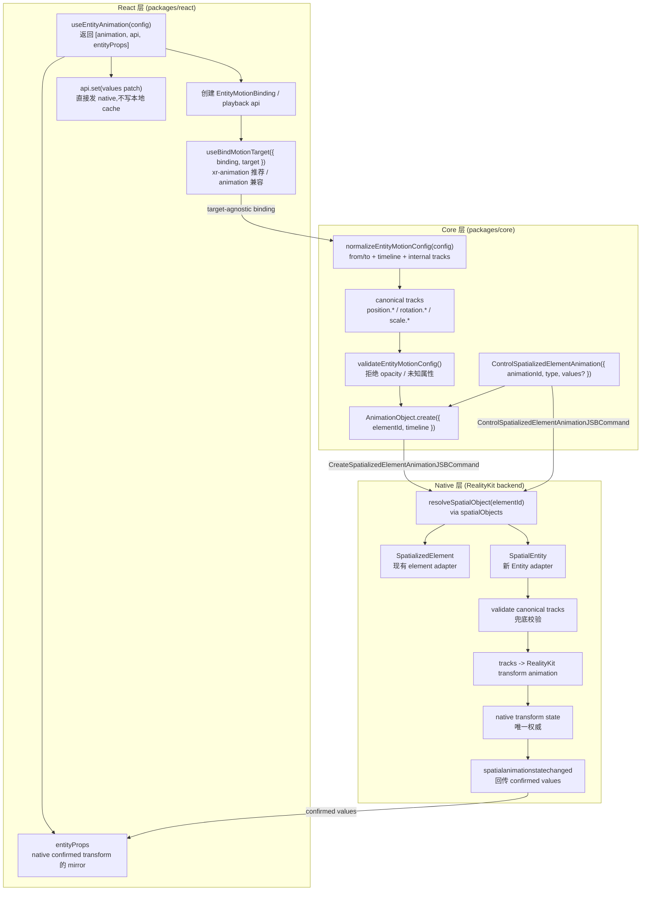
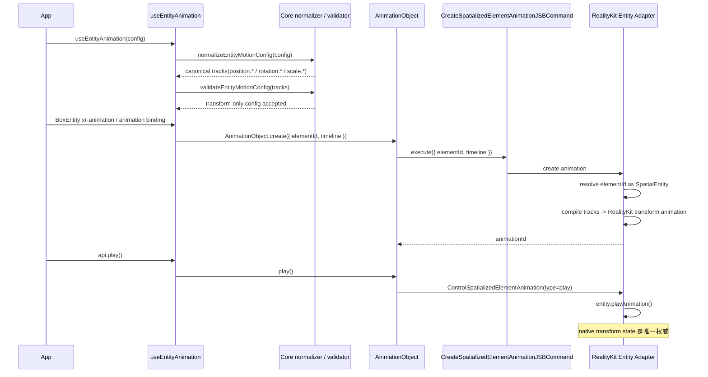
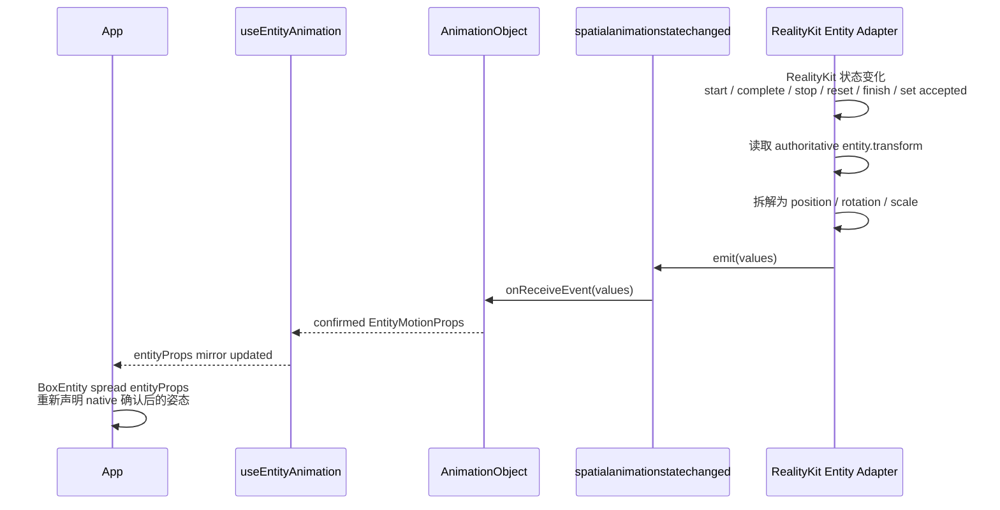
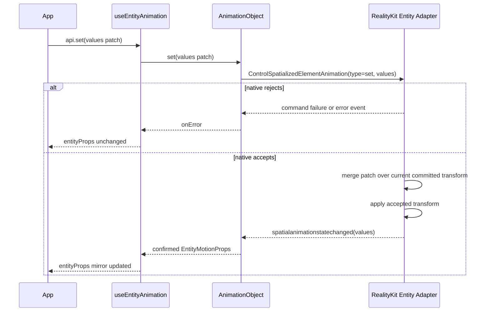
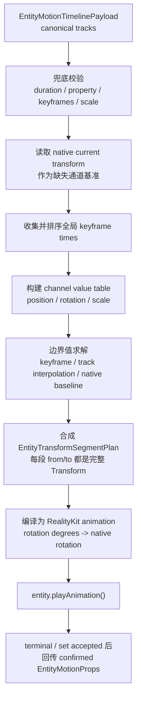
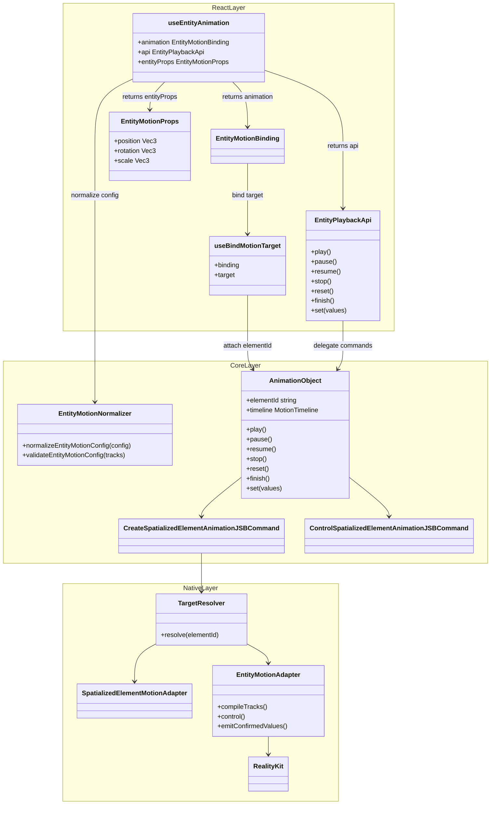

## 背景

`proposal.md` 是公共 API surface 的唯一主来源,`specs/` 是规范性行为的唯一主来源。本文档只描述实现目标态所需的**实现架构**,不重复公共 API 契约,也不重复行为需求。

本次重设计把 `useEntityAnimation` 变成共享 `useAnimation` 运动家族之上的 Entity 适配器(`useEntityAnimation = useAnimation 配置 + Entity props outlet`)。它新增百分比 `timeline`、`entityProps` outlet、`api.set`,以及推荐的 `xr-animation` 绑定,同时保留 `animation` 作为兼容绑定。这是一次非破坏性增强。

## 设计原则

### Native 是唯一权威数据源

Entity motion 的 transform 状态以 native RealityKit backend 为唯一权威数据源。React 不维护独立的 committed cache、pending state 或第二份可竞争的 transform source。

`entityProps` 是 native 已确认 transform 状态的 React mirror outlet:

```text
React config / api.set
  -> native Entity motion backend(唯一权威)
  -> confirmed transform state
  -> entityProps mirror outlet
```

这意味着:

- 播放、终止、reset、finish、`api.set` 等会改变 transform 的操作都必须先进入 native。
- native 拒绝命令时,对应写入无效,`entityProps` 不更新。
- native 接受命令时,通过现有 animation state event 回传确认后的 transform,React 再更新 `entityProps`。
- React 侧只负责把 native 确认过的状态镜像给用户,不自行预测终态、不排队 replay 活跃期间的写入。
- 首个 confirmed state 之前 `entityProps` 可能为空;confirmed 之后它是完整 pose(`position` / `rotation` / `scale`),而不是 touched-fields patch。

### 复用 `useAnimation` 架构

`useEntityAnimation` 应尽可能复用 `useAnimation` 的 binding / target resolution / `AnimationObject` lifecycle / create-control-event 链路。Entity 差异被限制在 adapter:

- authoring: `position` / `rotation` / `scale`
- validation: transform-only,拒绝 `opacity`
- outlet: `entityProps`,不是 CSS `style`
- target adapter: `SpatialEntity`
- native execution: RealityKit Entity backend

## Goals / Non-Goals

**Goals:**
- 定义在 RealityKit backend 上实现 proposal 目标态 API 的 React / Core / Native 三层架构
- 明确 config -> canonical tracks -> native transform 的数据流
- 明确 native confirmed transform -> `entityProps` mirror 的写回流
- 明确复用现有 `CreateSpatializedElementAnimationJSBCommand` / `ControlSpatializedElementAnimationJSBCommand`,不新增平行 Entity JSB
- 明确 `AnimationObject` 从 element-only 泛化为 target adapter 模型

**Non-Goals:**
- 重复 `proposal.md` 中的公共 API 定义
- 重复 `specs/` 中的规范性行为
- 设计 CADisplayLink 采样器 backend(明确未采用,见 Backend 理由)
- 提供公共 seek / scrub / progress API(proposal Non-Goal)
- 新增 `CreateEntityAnimationJSBCommand` / `ControlEntityAnimationJSBCommand`
- 字段级 ownership 组合(position 动画 + rotation/scale 由 props 动态接管);当前整矩阵动画路径下字段级共存会产生未定义行为,列为 future work / v2

## Backend 理由(RealityKit)

Backend 决策:原生执行 backend 为 **RealityKit**。

保留 RealityKit 的原因:

1. **Entity 路径本来就能用。** 现有 `useEntityAnimation` 已经通过 RealityKit 驱动实体动画,所以这是延续,不是重写。
2. **它天生就是 3D 实体的执行引擎。** 驱动实体 transform 正是 RealityKit 动画系统的本职;当大量实体并发动画时,引擎原生播放比 SDK 逐帧写入扩展性更好。
3. **proposal 的播放 + 上报需求都能达到。** RealityKit controller 可控制播放状态,`entity.transform` 可在 native 侧读取,`AnimationEvents.PlaybackCompleted` 提供完成事件。这足以实现 `stop`、`reset`、`finish`,并把 native 确认后的 transform 上报给 callbacks 和 `entityProps`。

主要新增成本是 **canonical tracks -> RealityKit Entity timeline 编译器**。它负责把 JS/Core 归一化后的 Entity tracks 编译成 RealityKit 可执行的 transform animation。

### 为什么否决 Plan B(全 CADisplayLink 采样器)

Plan B 是把整条 Entity 路径改用 CADisplayLink 逐帧采样器而非 RealityKit。除了逐帧性能更差、要放弃现有 RealityKit 实现之外,以下理由即使性能打平也仍成立:

- **与 RealityKit 渲染帧不同步。** CADisplayLink 写入的 transform 与 RealityKit 自己的 render / commit loop 不在同一节拍上,容易出现抖动、撕裂或单帧延迟。
- **visionOS 合成器语义。** RealityKit 动画可参与系统合成与 reprojection;CPU 采样器产出的离散姿态无法获得同等语义。
- **脱离场景图 / anchoring / 物理体系。** RealityKit transform 动画天然处于场景图、坐标空间、anchor、碰撞体系内。
- **插值质量。** 旋转需要四元数 slerp;手写 Euler 逐帧 lerp 容易出现插值伪影。
- **重复实现播放语义。** easing、loop、delay、playbackRate、pause/resume、完成事件都要重新实现。
- **与 motion family 分裂。** spatialized element 路径已使用 native-backed animation object;Entity 单独采样会让同一 motion API 出现两套执行语义。

混合变体(部分形态走 RealityKit、部分走采样器)同样不采用:一套 Entity API 必须只承载一种执行语义。

## 分层架构



**各层职责:**

- **React** 负责 hook API、binding 生命周期、`entityProps` mirror、callback 分发和 rerender。React 不维护独立 transform cache。
- **Core** 负责把公共编写形态(`from`/`to`、百分比 `timeline`)和内部 `tracks` 归一化为 canonical Entity tracks。`AnimationObject` 保留现有 wire 字段 `elementId`,其目标态含义是 spatial object id。
- **Native** 负责 target resolution、兜底校验、RealityKit 编译与执行、命令接受/拒绝、最终 transform 拆解与事件回传。

## JSB 协议

目标态复用现有 JSB command type,不新增平行 Entity JSB:

- `CreateSpatializedElementAnimationJSBCommand`
- `ControlSpatializedElementAnimationJSBCommand`
- `spatialanimationstatechanged` event

旧 `AnimateTransformJSBCommand` 是内部实现协议,不是公开承诺 API。目标态可以停止使用或删除它,不构成 public breaking change。

### CreateSpatializedElementAnimation

命令名与 `elementId` 字段都保留以兼容现有链路。目标态里,`elementId` 是历史 wire 字段名,实际含义是 spatial object id;它可以指向 `SpatializedElement`,也可以指向 `SpatialEntity`。

```text
CreateSpatializedElementAnimation {
  elementId: string
  timeline: EntityMotionTimeline | SpatializedMotionTimeline
}
```

Native 通过 `elementId` 查 `spatialObjects`,再按运行时类型分发:

```text
spatial object is SpatializedElement -> existing spatialized element adapter
spatial object is SpatialEntity      -> Entity motion adapter
otherwise                           -> failure
```

如果 `elementId` 在 `spatialObjects` registry 中找不到,create MUST 显式失败,不能静默排队。若查到的 spatial object 类型不是 `SpatializedElement` 或 `SpatialEntity`,create MUST 以 unsupported animation target 失败。`ControlSpatializedElementAnimation` 不重复携带 `elementId`;它只通过 `animationId` 找已创建的 animation object。若目标 spatial object 已销毁,关联 animation MUST 被销毁或失效,后续 control MUST 失败并通过 command failure / error event 暴露,不能 silent no-op。

### ControlSpatializedElementAnimation

控制命令继续复用现有 command type,并增加 `set` 控制类型:

```text
ControlSpatializedElementAnimation {
  animationId: string
  type: 'play' | 'pause' | 'resume' | 'stop' | 'reset' | 'finish' | 'destroy' | 'set'
  values?: EntityMotionProps
}
```

`api.set` 不新增 JSB。它只接受 `EntityMotionProps` patch object,不支持 `(prev) => next` updater 形式。它发送 `type: 'set'` 到 native:

- native 拒绝:命令失败或 error event,`entityProps` 不更新。
- native 接受:native 基于当前 committed `entity.transform` 合并 patch、应用 transform 后,通过 `spatialanimationstatechanged` 回传 confirmed values,React 再更新 `entityProps`。

### spatialanimationstatechanged

事件通道继续复用:

```text
detail: {
  animationId: string
  action: 'start' | 'complete' | 'stop' | 'reset' | 'finish' | 'set' | 'failed' | ...
  playState: 'idle' | 'queued' | 'running' | 'paused' | 'finished'
  finished: boolean
  values?: SpatializedVisualValues | EntityMotionProps
  error?: SpatializedPlaybackError
}
```

`values` 是 target-specific:

- spatialized target: `SpatializedVisualValues`
- Entity target: `EntityMotionProps`(`position` / `rotation` / `scale`)

## 数据流

### 编写配置 -> native transform(play)



### native confirmed transform -> React mirror



### api.set



`api.set` 不是 playback 命令,不 seek、不 start、不改变播放进度。它也不写本地 pending state;native 是唯一决定该写入是否生效的地方。活跃动画期间 native 不暂存 set patch,未绑定或 native object 尚未创建前的 set 也无效;这些失败通过既有 command failure / error event 暴露,且不会更新 `entityProps`。

## Entity tracks 与 RealityKit 编译

Native Entity adapter 只接受 JS/Core 已归一化的 canonical Entity timeline payload。该 payload 是内部形态,不是 public hook config。Native 不解析百分比 key,也不把 `from` / `to` 再次脱糖;这些都属于 JS/Core normalizer 的职责。

### 输入

输入是一份 target 已经解析为 Entity 的 timeline payload:

```text
type EntityMotionTimelinePayload = {
  duration: number
  delay?: number
  playbackRate?: number
  loop?: boolean | { reverse?: boolean }
  tracks: EntityMotionTrack[]
}

type EntityMotionTrack = {
  property: EntityMotionProperty
  keyframes: EntityMotionKeyframe[]
  timingFunction?: TimingFunction
}

type EntityMotionProperty =
  | 'position.x' | 'position.y' | 'position.z'
  | 'rotation.x' | 'rotation.y' | 'rotation.z'
  | 'scale.x'    | 'scale.y'    | 'scale.z'

type EntityMotionKeyframe = {
  at: number
  value: number
  timingFunction?: TimingFunction
}
```

示例输入:

```text
{
  duration: 1.2,
  tracks: [
    {
      property: 'position.y',
      keyframes: [
        { at: 0, value: 0 },
        { at: 0.6, value: 0.25 },
        { at: 1.2, value: 0 },
      ],
    },
    {
      property: 'rotation.y',
      keyframes: [
        { at: 0, value: 0 },
        { at: 1.2, value: 180 },
      ],
    },
  ],
}
```

### 输出

输出不是 React state,而是 native 可执行计划和执行后的 confirmed values:

```text
EntityMotionTimelinePayload
  -> EntityTransformSegmentPlan
  -> RealityKit AnimationResource / playback controller
  -> spatialanimationstatechanged(values)
```

`EntityTransformSegmentPlan` 是 Native adapter 内部执行计划,不作为 JS/Core 公共类型:

```text
type EntityTransformSegmentPlan = {
  duration: number
  delay: number
  playbackRate: number
  loop?: boolean | { reverse?: boolean }
  segments: EntityTransformSegment[]
}

type EntityTransformSegment = {
  fromTime: number
  toTime: number
  from: CompleteEntityTransform
  to: CompleteEntityTransform
  timingFunction: TimingFunction
}

type CompleteEntityTransform = {
  position: Vec3
  rotationDegrees: Vec3
  scale: Vec3
}
```

### 编译流程



### 编译规则

1. **Property whitelist:** 只接受 `position.*`、`rotation.*`、`scale.*`。`opacity`、`transform.translate.*`、material / component property 等都必须显式失败。
2. **时间范围:** `duration` 必须为正数;每个 keyframe 的 `at` 必须在 `[0, duration]` 内。
3. **排序与重复:** 每条 track 的 keyframes 必须按 `at` 非递减排序;同一 property 不允许重复 track。
4. **全局时间轴:** Native 从所有 tracks 收集 keyframe time,排序后形成 segment 边界。例如 `0, 0.6, 1.2` 会生成 `[0, 0.6]` 与 `[0.6, 1.2]` 两段。
5. **边界值求解:** 某个 property 在某个 segment 边界没有显式 keyframe 时,Native adapter 必须按该 property 自己的 track 在该时间点求值。若该时间点位于两个 keyframes 之间,使用该 track 的 timing function 计算边界值;若早于该 property 第一个 keyframe,使用 native current transform 的对应通道;若晚于最后一个 keyframe,使用最后一个 keyframe 值。
6. **完整 Transform:** 每个 segment 的 `from` 和 `to` 都必须是完整的 position / rotation / scale,不能把 partial channel 直接交给 RealityKit。
7. **Rotation:** `rotation.*` 输入单位是 Entity API 的 Euler degrees。Native 编译时转换为 RealityKit transform 所需的旋转表示,避免用 Euler 做逐帧插值。
8. **Scale:** `scale.*` 必须为非负数。非法 scale 直接失败。
9. **Timing function:** keyframe 级 `timingFunction` 优先于 track 级,track 级优先于 timeline 默认值。若同一时间段内不同 property 需要不同 timing function,Native adapter 必须选择 RealityKit 可表达的 per-channel 编译方式;如果无法表达,必须显式失败,不能降级成错误语义。
10. **Loop / playbackRate / delay:** 这些 playback 参数保留在 segment plan 上,由 RealityKit playback/controller 层执行。
11. **Terminal fill:** `complete` / `finish` 停在终态,`reset` 停在起点,`stop` 停在当前 native transform;这些 confirmed values 通过事件回传给 React。
12. **失败显式化:** 如果 RealityKit 无法表达某类 segment plan,Native adapter 必须通过 command failure 或 error event 显式失败,不能 silent ignore。

### 示例:稀疏 tracks 到 segment plan

输入 tracks:

```text
position.y: (0 -> 0), (0.6 -> 0.25), (1.2 -> 0)
rotation.y: (0 -> 0), (1.2 -> 180)
```

假设 native current transform 为:

```text
position: { x: 0, y: 0, z: 0.8 }
rotation: { x: 0, y: 0, z: 0 }
scale:    { x: 1, y: 1, z: 1 }
```

编译结果:

```text
segments:
  [0, 0.6]
    from: position { x: 0, y: 0,    z: 0.8 }, rotation { x: 0, y: 0,   z: 0 }, scale { x: 1, y: 1, z: 1 }
    to:   position { x: 0, y: 0.25, z: 0.8 }, rotation { x: 0, y: 90,  z: 0 }, scale { x: 1, y: 1, z: 1 }
  [0.6, 1.2]
    from: position { x: 0, y: 0.25, z: 0.8 }, rotation { x: 0, y: 90,  z: 0 }, scale { x: 1, y: 1, z: 1 }
    to:   position { x: 0, y: 0,    z: 0.8 }, rotation { x: 0, y: 180, z: 0 }, scale { x: 1, y: 1, z: 1 }
```

这里 `rotation.y` 只有 `0` 和 `1.2` 两个关键帧,在 `0.6` 边界的值由 native adapter 按该 track 的 timing function 在编译时求得。它只用于生成完整 segment 的边界 Transform;segment 内逐帧插值仍交给 RealityKit。

## Transform 拆解与 values

Native 回传给 React 的 Entity values 必须是 Entity API 形态:

```text
type EntityMotionProps = {
  position?: Vec3
  rotation?: Vec3
  scale?: Vec3
}
```

拆解规则:

- `position` 来自 native transform translation。
- `scale` 来自 native transform scale。
- `rotation` 使用 Entity props / config 一致的 Euler degrees。
- callback values、`entityProps`、`api.set(values)` patch 都使用同一 shape。

## Capability

目标态文档和 demo 使用顶层 capability:

```text
supports('useAnimation')
```

`supports('useAnimation', ['entity'])` 从文档化契约中移除;仅使用顶层 `supports('useAnimation')` key,不保留任何 `entity` sub-token。

## 各层关键改动

### React 层 (`packages/react`)

1. `useEntityAnimation` 返回 `[animation, api, entityProps]`。
2. `api` 暴露 `play/pause/resume/stop/reset/finish` 和 `set`。
3. `entityProps` 只反映 native confirmed values。
4. `api.set` 发送 `ControlSpatializedElementAnimation(type: 'set')`,不写本地 cache。
5. Entity 组件支持 `xr-animation` 绑定,并保留 `animation` 兼容绑定。
6. 绑定器泛化为 `useBindMotionTarget({ binding, target })`,保留单 binding 单 target 不变量。

### Core 层 (`packages/core`)

1. 新增 Entity motion 类型、property whitelist、normalizer 和 validator。
2. `AnimationObjectCreateOptions.elementId` 保持为 wire 字段,并文档化为 spatial object id 的历史字段名。
3. `CreateSpatializedElementAnimationJSBCommand` payload 继续使用 `elementId`,并通过 spatial object registry 解析。
4. `ControlSpatializedElementAnimationJSBCommand` 支持 `set` 和 optional `values`。
5. `AnimationObject` 的 values 类型从 spatialized-only 扩展为 target-specific values。

### Native 层 (RealityKit)

1. `onCreateSpatializedElementAnimation` 按 `elementId` 查找 spatial object,并按运行时类型分发到 spatialized / Entity adapter。
2. Entity adapter 编译 canonical Entity tracks 到 RealityKit transform animation。
3. `onControlSpatializedElementAnimation` 支持 Entity animation object 的 `play/pause/resume/stop/reset/finish/destroy/set`。
4. 每个 accepted start / terminal / set 操作都回传 confirmed Entity values。
5. 删除或停止使用旧 `AnimateTransform` Entity 专用链路。

## 类图



## Risks / Trade-offs

- **历史命名误导。** 复用 `CreateSpatializedElementAnimation` / `ControlSpatializedElementAnimation` 会保留 element 字样。文档必须明确其目标态语义已泛化为 motion animation object 协议。
- **Timeline 编译器是主要新增成本。** 多关键帧、稀疏关键帧、rotation 转换和 segment 合成都集中在 native Entity adapter。
- **Whole-transform ownership。** Entity transform 最终是一个 native Transform;v1 不做字段级所有权合成。动画下发的是完整 transform,未在 config 声明的字段按播放起点快照冻结,因此 active animation 期间无法让 React props 动态接管某个字段(如 position 动画 + rotation 走 props)——这会与 native 单一权威冲突并产生未定义行为。字段级 ownership 组合列为 future work / v2。
- **不提供 updater form。** 因为 native 是唯一权威,`api.set(prev => next)` 会暗示 React `setState` 语义,但 `prev` 无法承诺为实时 native transform。v1 只支持 patch object;读当前 confirmed 状态通过 `entityProps` 完成。
- **大量并发动画仍需 profiling。** RealityKit 原生播放优于 JS 逐帧写入,但规模并发仍应实测。

## Decisions

- Native RealityKit backend 是 Entity motion 的唯一权威数据源。
- `entityProps` 是 native confirmed transform 的 React mirror outlet,不是本地 source of truth。
- 复用 `CreateSpatializedElementAnimationJSBCommand` / `ControlSpatializedElementAnimationJSBCommand` 和现有事件通道,不新增 Entity 平行 JSB。
- JS/Core 负责 `from`/`to`、`timeline` 到 canonical Entity tracks 的归一化;Native 只执行 canonical payload 并做兜底校验。
- 旧 `AnimateTransformJSBCommand` 是内部实现协议,可被替换或删除。
