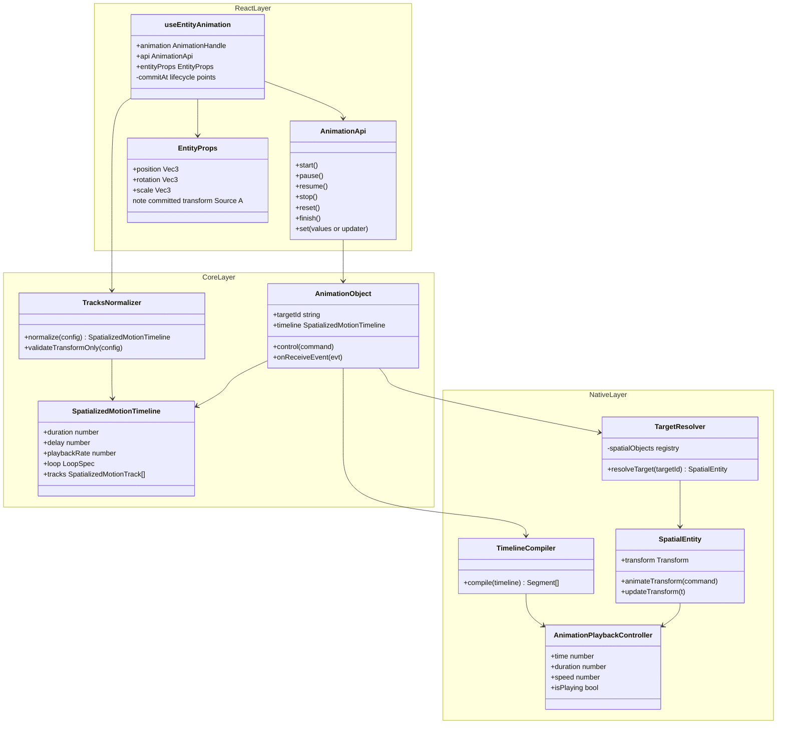
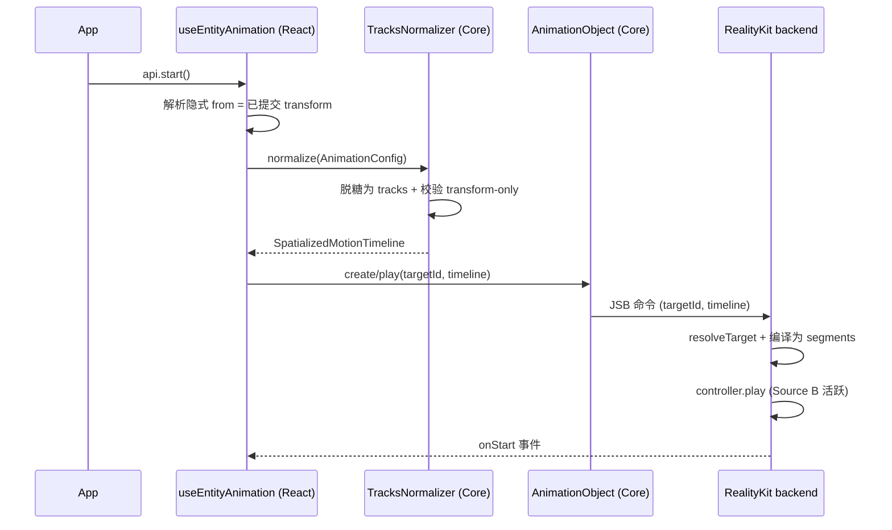
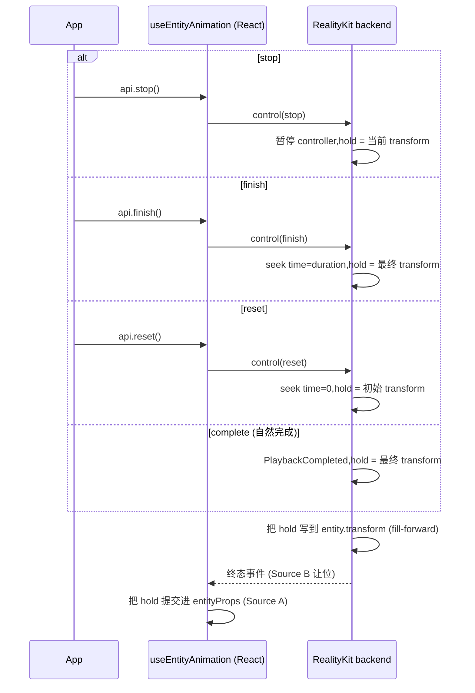
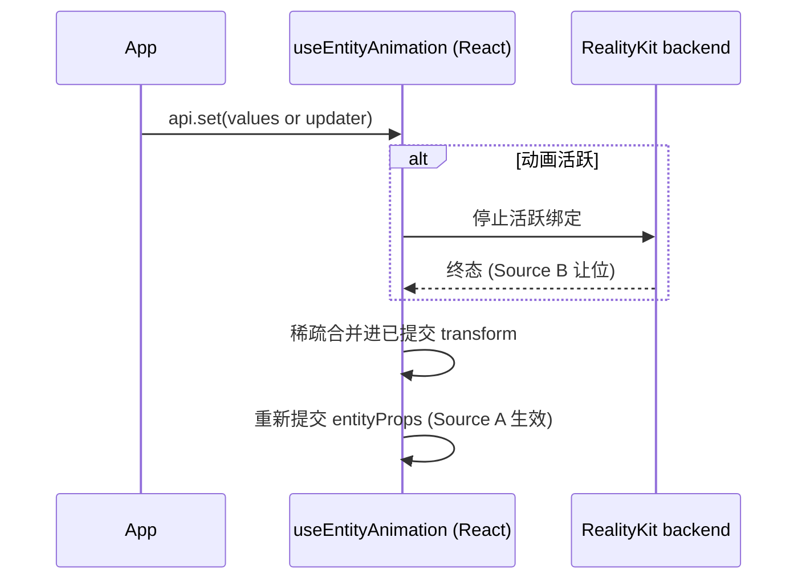

## 背景

`proposal.md` 是公共 API surface 的唯一主来源,`specs/` 是规范性行为的唯一主来源。本文档只描述实现目标态所需的**实现架构**,不重复公共 API 契约,也不重复行为需求。

本次重设计把 `useEntityAnimation` 变成共享 `useAnimation` 运动家族之上的 Entity 适配器(`useEntityAnimation = useAnimation 配置 + Entity props 出口`)。它新增百分比 `timeline`、`entityProps` 出口、`api.set`,以及推荐的 `xr-animation` 绑定,同时保留 `animation` 作为兼容绑定。这是一次非破坏性增强。

**Backend 决策(已定):** 原生执行 backend 为 **RealityKit**。现有的 `useEntityAnimation` 已经通过 RealityKit 驱动实体动画(`SpatialEntity.animateTransform` 构造 `FromToBy` 风格的 transform 动画并交给 RealityKit 播放控制器执行)。我们延续这条已被验证的路径。新增工作量并不是一个新 backend,而是:(1)在前端加一层内部 `tracks` 归一化层,使百分比 `timeline` / `from`-`to` 都脱糖成统一的 track payload;(2)把 Entity 路径接到 spatialized 运动家族已经在用的 `AnimationObject` create/control 契约上。

## Goals / Non-Goals

**Goals:**
- 定义在 RealityKit backend 上实现 proposal 目标态 API 的三层实现(React / Core / Native)
- 明确从编写配置到原生 transform 的数据流,以及从原生到 `entityProps` 的终态写回流
- 明确前端 `tracks` 归一化层,以及 Entity 目标的 `AnimationObject` 适配
- 提供与真实模块名、命令名 1:1 对应的类图和时序图

**Non-Goals:**
- 重复 `proposal.md` 中的公共 API 定义
- 重复 `specs/` 中的规范性行为
- 设计 CADisplayLink 采样器 backend(明确未采用,见 Backend 理由)
- 提供公共 seek / scrub / progress API(proposal Non-Goal)

## Backend 理由(RealityKit)

保留 RealityKit 的原因:

1. **Entity 路径本来就能用。** 现有 Entity 路径基于 RealityKit,所以这是延续,不是重写。
2. **它天生就是 3D 实体的执行引擎。** 驱动实体的 transform 正是 RealityKit 动画系统的本职;当大量实体并发动画时,引擎原生播放比 SDK 逐帧写入扩展性更好。
3. **proposal 的播放 + 上报需求都能达到。** `AnimationPlaybackController` 暴露 `time`(可读/可写)、`duration`、`speed`、`isPlaying`;`entity.transform` 任意时刻可读;`AnimationEvents.PlaybackCompleted` 提供完成事件。这足以实现 `stop`(暂停 + 读当前 transform + 冻结)、`reset`(stop + 写 `from`)、`finish`(seek `time = duration` 或写终态),并把终态值上报给 `onStop` / `onReset` / `entityProps`。

唯一真正的增量成本是 **timeline → RealityKit segment 编译器**(百分比归一化、部分关键帧填充、逐通道 segment 合成)。它被收敛在 Native 层,不影响 JS/Core 契约。

### 为什么否决 Plan B(全 CADisplayLink 采样器)

Plan B 是把整条 Entity 路径改用 CADisplayLink 逐帧采样器而非 RealityKit。除了两条显而易见的成本(逐帧性能更差、要放弃现有 RealityKit 实现)之外,以下理由**即使性能打平、即使不心疼旧代码,也仍成立**:

**渲染 / 时序正确性(最硬的理由):**
- **与 RealityKit 渲染帧不同步。** CADisplayLink 回调在主线程按屏幕刷新触发,但它写入的 transform 与 RealityKit 自己的渲染 / 提交循环并不在同一节拍上,易出现抖动、撕裂、单帧延迟——为某一帧算好的姿态不保证正好落在该帧的提交上。RealityKit 的动画系统在渲染循环内部,插值是帧精确的。
- **visionOS 合成器语义。** visionOS 下应用并不像 iOS 那样独占渲染循环,合成器会做 reprojection / 外插(尤其头动时),且每眼、可变高刷。声明式 RealityKit 动画能被系统合成器正确重投影;CPU 采样器算出的离散姿态无法参与 reprojection,头动时更易出现观感异常。这是空间计算平台特有、采样器方案先天补不上的。

**引擎能力被绕过:**
- **脱离场景图 / 锚定 / 物理。** RealityKit 的 transform 动画天然在场景图、坐标空间、anchor、碰撞体系之内;手写裸 transform 会绕过这些,和 anchoring / 物理失步。
- **插值质量。** 旋转需走四元数 slerp,采样器若用 Euler 逐帧 lerp 会有 gimbal / 插值伪影;RealityKit 做的是正确的 transform 插值。

**语义一致性与维护面:**
- **要手工重造一整套播放语义。** easing / timingFunction、loop、delay、playbackRate、seek(time)、中途 pause/resume 接管、完成事件——这些 RealityKit 已提供,采样器全得自己实现并保证 bug-for-bug 正确。
- **与运动家族其余部分分裂。** spatialized element 路径已是 RealityKit backing。Entity 单独用采样器 → 同一套运动 API 出现两种执行语义,同一份动画配置在 element 与 entity 上可能算出不同缓动,导致行为漂移 + 双份维护成本。
- **跨 JSB 逐帧驱动。** 若采样器落在 JS/SDK 层,每帧过桥驱动开销大,且动画平滑度被 JS 线程健康度绑架(JS 卡一下动画就卡一下)。RealityKit 原生执行,与 JS 线程解耦。

混合变体(部分形态走 RealityKit、部分走采样器)同样不予考虑:一套 Entity API 必须只承载一种执行语义。

## 分层架构

```
┌───────────────────────────────────────────────────────────────────────┐
│ React 层  (packages/react)                                             │
│   useEntityAnimation(config): [animation, api, entityProps]            │
│     - 拥有已提交的 transform 状态 (Source A)                          │
│     - api.set (value | updater),稀疏合并,无裸 api.get               │
│     - 仅在生命周期节点提交 entityProps(非逐帧)                       │
│   useBindMotionTarget({ binding, target })   <- 泛化后的绑定器        │
│     - xr-animation(推荐) + animation(兼容)                        │
└───────────────┬───────────────────────────────────────────────────────┘
                │ 目标无关的绑定
┌───────────────▼───────────────────────────────────────────────────────┐
│ Core 层  (packages/core)                                               │
│   normalizeEntityMotionConfig(config) -> tracks (内部)               │
│     from/to  ─┐                                                        │
│     timeline ─┼─►  统一 track payload (position.* rotation.* scale.*) │
│     tracks   ─┘                                                        │
│   validateEntityMotionConfig()  -> 拒绝 opacity / 未知属性            │
│   SpatialEntity.createAnimation(config)                               │
│   AnimationObject.create({ targetId, timeline })  <- targetId         │
└───────────────┬───────────────────────────────────────────────────────┘
                │ JSB: create({ targetId, timeline }) / control(type)
┌───────────────▼───────────────────────────────────────────────────────┐
│ Native 层  (RealityKit backend)                                        │
│   resolveTarget(targetId) via spatialObjects -> as? SpatialEntity     │
│   validateEntityMotionConfig() (兜底校验)                             │
│   timeline -> RealityKit transform segments -> AnimationResource      │
│   entity.playAnimation() / AnimationPlaybackController                │
│   transform 所有权(整 transform 粒度)                               │
│   终态填充(forwards) -> 把终态 transform 回传给 Core                 │
└───────────────────────────────────────────────────────────────────────┘
```

**各层职责:**

- **React** 拥有 *已提交的 transform 状态*(compositor 的 Source A),产出 `entityProps`,实现 `api.set`,并且只在 start / complete / stop / reset / finish 以及每次 `api.set` 时把值提交进 `entityProps`。
- **Core** 把公共编写形态(`from`/`to`、百分比 `timeline`)和内部 `tracks` 脱糖成一份归一化 timeline payload,校验只允许 `position.* / rotation.* / scale.*` 出现,并把 `AnimationObject` 从 `elementId` 泛化到 `targetId`。
- **Native** 按 id 解析目标,再做兜底校验,把 timeline 编译为 RealityKit segment,通过 RealityKit 控制器播放,活跃期间拥有整个 transform,终态时 fill-forward 并把终态 transform 回传,使 `entityProps` 能镜像它。

## 数据流

### 编写配置 -> 原生 transform(play)

```
useEntityAnimation(config)                       // position/rotation/scale,from/to 或 timeline
  -> normalizeEntityMotionConfig                 // 脱糖 -> 内部 tracks (position.* ...)
  -> validateEntityMotionConfig                  // 拒绝 opacity / 未知属性
  -> SpatialEntity.createAnimation(config)
  -> AnimationObject.create({ targetId, timeline })
  -> JSB create 命令 { targetId, timeline }
  -> Native resolveTarget(targetId) as? SpatialEntity
  -> timeline -> RealityKit transform segments -> AnimationResource
  -> entity.playAnimation(controller)
  -> RealityKit 驱动实体 transform(Source B,活跃期间权威)
```

### 终态 -> React(写回)

```
RealityKit 终态 (complete / stop / reset / finish)
  -> 终态 fill-forwards(不回弹)
  -> native 发出终态 transform 事件
  -> AnimationObject.onReceiveEvent -> onComplete/onStop/onReset(values 仅含 transform)
  -> useEntityAnimation 把终态值提交进已提交状态(Source A)
  -> entityProps 更新(单次提交,非逐帧)
  -> <BoxEntity {...entityProps} /> 重新声明终态姿态
```

### Compositor(哪个 source 生效)

```
动画活跃 (delay / running / paused)   -> Source B (xr-animation / RealityKit) 生效
动画非活跃 (idle / 终态)              -> Source A (props / entityProps / api.set) 生效
```

`api.set` 始终写 Source A;何时可见由 compositor 决定。v1 的所有权粒度是**整个 transform**(不做字段级 translate/rotate/scale 合并),因为 RealityKit 实体 transform 本质是单个矩阵,部分合并会引入边界复杂度。

## 各层关键改动

### React 层 (`packages/react`)
1. `useEntityAnimation` 返回 3 元组 `[animation, api, entityProps]`(现在返回 2 元组 `[AnimatedProps, AnimationApi]`)。
2. `api` 表面从 `play/pause/cancel` 改为 `play/pause/resume/stop/reset/finish`,**外加** `set`(状态设置器,不是播放命令)。
3. 新增已提交状态存储 + `entityProps` 出口;只在生命周期节点和 `api.set` 时提交。
4. 保留 `animation` 绑定兼容;新增 `xr-animation` 作为推荐绑定。
5. 泛化绑定器:`useBindSpatializedMotion`(仅 element,`spatialized2d/static3d/dynamic3d`)-> `useBindMotionTarget({ binding, target })`,使 Entity 目标可通过同一生命周期绑定。保留单绑定不变式(一个动画对象不能驱动两个实体)。

### Core 层 (`packages/core`)
1. 新增 `normalizeEntityMotionConfig`:把 `from`/`to` 和百分比 `timeline` 脱糖成内部 `tracks` payload,使用 Entity 风格路径(`position.* / rotation.* / scale.*`)。`tracks` 保持内部 / 非公共。
2. 新增 `validateEntityMotionConfig`:允许 transform track,拒绝 `opacity` 和未知属性(抛错或路由到 `onError`)。
3. `SpatialEntity.createAnimation(config)` 镜像 spatialized 路径。
4. 泛化 `AnimationObject`:`AnimationObjectCreateOptions.elementId` -> `targetId`;`CreateSpatializedElementAnimationJSBCommand` payload `elementId` -> `targetId`。
5. 回调只是通知;返回值忽略;values 只携带 transform 字段。

### Native 层 (RealityKit)
1. create-animation 命令解码 `{ targetId, timeline }`;`resolveTarget(targetId)` 查 `spatialObjects` 并按运行时类型分派(`as? SpatialEntity` -> Entity backend,`as? SpatializedElement` -> 现有路径,否则报错)。
2. 兜底校验器(JS/Core 校验不替代它)。
3. Timeline 编译器:百分比归一化、部分关键帧填充、逐通道(translate/rotate/scale)segment 合成 -> `AnimationResource`。
4. 播放:`entity.playAnimation()`;pause/resume 走控制器;`stop` = pause + 读 `entity.transform` + 冻结;`reset` = stop + 写 `from`;`finish` = `controller.time = duration`(或写终态);完成走 `AnimationEvents.PlaybackCompleted`。
5. 活跃期间整 transform 所有权 / 抑制;终态 fill-forwards 并把终态 transform 回传给 Core 供 `entityProps` 使用。

## 类图



## 时序图

### 1. Play(激活)



### 2. 终态与写回



### 3. api.set 接管



## Risks / Trade-offs

- **Timeline 编译器是主要新增成本。** 百分比归一化、部分关键帧填充、逐通道 segment 合成都在 Native RealityKit backend 中。风险被收敛在 Native,不触及 JS/Core 契约。
- **没有原生 timeline 查询 segment 索引 / 任意采样。** RealityKit 暴露 `controller.time` 和 `entity.transform`,对 proposal 足够(无公共 seek/progress)。若未来新增公共 seek/progress API,backend 需追踪逻辑播放状态或退回采样器。
- **整 transform 所有权** 意味着活跃期间对非动画通道的并发 React 写入也会被抑制。v1 接受;字段级合并延后。
- **规模并发。** 引擎原生播放比逐帧 SDK 写入扩展性好,但大量同时进行的 Entity 动画仍应做性能剖析。

## Decisions

- `proposal.md` 仍是公共 API 的主来源;`specs/` 是行为主来源;本文档只负责实现架构。
- Backend 为 RealityKit(延续现有 Entity 路径,即 Plan A);否决整条路径改用 CADisplayLink 采样器的 Plan B。
- 前端新增内部 `tracks` 归一化层;`AnimationObject` 泛化 `elementId` -> `targetId`;绑定器泛化为 `useBindMotionTarget`。
