# `useEntityAnimation` 重设计

## 1. 背景

`useEntityAnimation` 是 WebSpatial SDK 中驱动场景内 3D 物体姿态动画的 React Hook。它支持百分比关键帧、动画结果回写和统一的命令式姿态设置,并把物体动画统一到通用动画的绑定、生命周期和跨端协议上。

本次重设计将物体动画接入通用动画架构:React 层提供 Hook、绑定和结果镜像,Core 层完成配置归一化与校验,visionOS 原生层使用 RealityKit 编译和执行动画。原生姿态是唯一权威数据源,所有姿态变更经原生确认后再回传 React,从结构上避免动画终态与 React 基础属性冲突导致的回弹。

本设计的目标是:

- 给出 React、Core、原生三层的职责边界和数据流。
- 明确“配置 → 规范轨道 → RealityKit 动画”和“原生确认姿态 → `entityProps`”两条链路。
- 复用创建、控制和状态事件协议,不为物体新增平行命令。
- 将动画对象从只服务空间元素泛化为可面向不同目标类型的运动对象。

本设计不提供公开的进度跳转、拖拽或进度读取 API,也不采用 SDK 逐帧采样方案。API 形态、行为边界、跨端协议、编译规则和模块职责均在本文定义,无需依赖其他设计文档即可完成技术评审。

## 2. 名词解释

- **物体(Entity)**:场景里的一个 3D 对象,例如一个盒子。它有三组空间属性,合称"姿态"。
- **姿态(transform)**:物体在空间中的状态,由位置 `position`(米)、旋转 `rotation`(度)、缩放 `scale`(倍数)三部分组成。
- **分量**:指姿态三部分之一,即 `position`、`rotation` 或 `scale`。
- **原生层 / RealityKit**:苹果 visionOS 上真正驱动 3D 物体运动的底层引擎,由 Swift 实现。本文说"原生"即指这一层。
- **React 层 / 公共逻辑层(Core)**:分别是面向使用者的 Hook 代码,和两端共用的、与平台无关的逻辑代码。
- **JS Bridge 命令 / 事件**:JavaScript 与原生层之间收发消息的通道。命令由 JS 发往原生,事件由原生回传给 JS。
- **权威数据源**:某份数据以谁为准。本设计中物体的真实姿态只以原生层为准。
- **镜像(mirror)**:React 侧把原生层已确认的姿态复制一份出来供渲染使用,这份复制就叫镜像。
- **`entityProps`**:Hook 返回给使用者的姿态镜像,形如 `{ position?, rotation?, scale? }`,展开到组件上可让物体停在动画终点。
- **确认姿态(confirmed transform)**:原生层执行完一个动作后,回读物体真实姿态并回传的那份值。React 只用这种值更新 `entityProps`。
- **轨道(track)/ 通道(channel)**:一条描述单个属性(如 `position.y`)随时间变化的曲线。本文把编译时按变换子目标(平移 / 旋转 / 缩放)组织的形态称"通道",把配置归一化后的中间形态称"轨道"。
- **关键帧(keyframe)**:曲线上的一个时间点及其取值,例如"第 0.6 秒时 `position.y` = 0.25"。
- **缓动函数(timingFunction)**:描述两帧之间快慢变化的曲线,如匀速 `linear`、先慢后快 `easeIn`。
- **基准值(baseline)**:某通道开始播放时的原生当前值;当该通道缺少起始关键帧时用它兜底。
- **球面线性插值(slerp)**:RealityKit 对旋转采用的插值方式,总是走两个朝向之间的最短路径。
- **空操作(no-op)**:命令被接收但不产生任何效果,物体和 `entityProps` 都不变。
- **注册表(registry)**:原生层用来按 id 查找物体或动画对象的表。

## 3. 要实现的功能

`useEntityAnimation` 让使用者用位置、旋转、缩放描述动画,将动画绑定到物体,并在原生确认后获得物体姿态。功能清单如下:

| 功能 | 说明 |
|---|---|
| 姿态动画 | 仅支持 `position`、`rotation`、`scale`,拒绝 `opacity` 等非姿态属性。 |
| 多种时间轴写法 | 支持顶层 `from` / `to`、`timeline.from` / `timeline.to` 和 `0% → 50% → 100%` 百分比关键帧。 |
| 动画绑定 | Hook 返回 `animation`,通过物体组件的 `animation` 属性绑定目标。 |
| 播放控制 | `api` 提供 `play`、`pause`、`stop`、`reset`、`finish`。 |
| 结果回写 | 原生在开始、完成、停止、重置、结束等确认节点回传姿态,React 以 `entityProps` 暴露结果,避免终态回弹。 |
| 命令式设置 | 非活跃状态下通过 `api.set(patch)` 在原生已提交姿态上合并稀疏补丁。 |
| 生命周期与错误 | 复用通用动画的创建、控制、销毁、目标失效和错误事件链路。 |
| 能力检测 | 通过 `supports('useEntityAnimation')` 检测整体能力。 |

## 4. 设计思路及折中

### 4.1 设计原则

#### 原生层是唯一权威数据源

物体姿态只以原生 RealityKit 为准。React 不保存第二份可能与原生冲突的姿态,也不维护待提交缓存或预测终态。

`entityProps` 只是原生已确认姿态在 React 侧的镜像,数据只朝一个方向流动:

```text
React 配置 / api.set
  -> 原生动画引擎(唯一权威)
  -> 确认后的姿态
  -> entityProps 镜像
```

由此得到几条规则:

- 播放、停止、重置、结束、`api.set` 等一切会改变姿态的操作,都要先进原生层。
- 原生拒绝命令时,该次写入无效,`entityProps` 不更新。
- 原生接受命令时,通过动画状态事件回传确认姿态,React 再更新 `entityProps`。
- React 只负责把原生确认过的姿态镜像给使用者,动画进行中的写入一律不排队补播。
- 首个确认姿态到来前 `entityProps` 可能为空。确认之后,它只包含被动画接管的分量,以及被 `api.set` 写入的分量,字段范围限定在 `position` / `rotation` / `scale` 之内;没被接管的分量不会进入 `entityProps`。

#### 复用通用动画架构

`useEntityAnimation` 尽量复用通用动画的绑定、目标解析、动画对象生命周期和"创建—控制—事件"链路。物体路径的差异只集中在以下几处:

- 描述方式:用 `position` / `rotation` / `scale`。
- 校验:只允许姿态,拒绝 `opacity`。
- 结果出口:走 `entityProps`,而非 CSS 的 `style`。
- 目标类型:`SpatialEntity`。
- 执行引擎:RealityKit。

### 4.2 RealityKit 选型

原生执行引擎选定为 **RealityKit**,原因:

1. **统一执行引擎。** 物体动画与通用动画共用 RealityKit 一套引擎,避免为物体单开一套执行路径。
2. **它天生就是 3D 物体的执行引擎。** 大量物体并发动画时,引擎原生播放比 SDK 逐帧写入扩展性更好。
3. **播放和上报需求它都能满足。** 它能控制播放状态,能读到物体当前姿态,能在播放完成时给出事件,足以实现停止、重置、结束,并把确认姿态上报给回调和 `entityProps`。

主要新增成本是一个编译器:把归一化后的物体轨道翻译成 RealityKit 能执行的姿态动画。

#### 为什么否决逐帧采样方案

另一种方案是放弃 RealityKit,改用定时器逐帧采样、手写插值来驱动姿态。撇开性能更差这一点,以下问题就足以否决它:

- **与渲染节拍不同步。** 逐帧写入的姿态和 RealityKit 自己的渲染提交不在同一拍上,容易抖动、撕裂或延迟一帧。
- **拿不到系统合成语义。** RealityKit 动画能参与 visionOS 的系统合成与重投影,CPU 采样产出的离散姿态得不到同等待遇。
- **脱离场景体系。** RealityKit 姿态动画天然处在场景图、坐标空间、锚点、碰撞体系之内,手写采样则游离在外。
- **插值质量差。** 旋转需要球面线性插值,手写逐帧线性插值容易出现伪影。
- **要重造播放语义。** 缓动、循环、延迟、播放速率、暂停、完成事件全得自己实现一遍。
- **两套执行语义。** 元素路径使用原生动画对象,物体单独采样会让同一套动画 API 出现两种执行方式。

只对部分形态用 RealityKit、其余用采样器的混合方案同样否决:一套物体 API 只能有一种执行语义。

### 4.3 整体架构

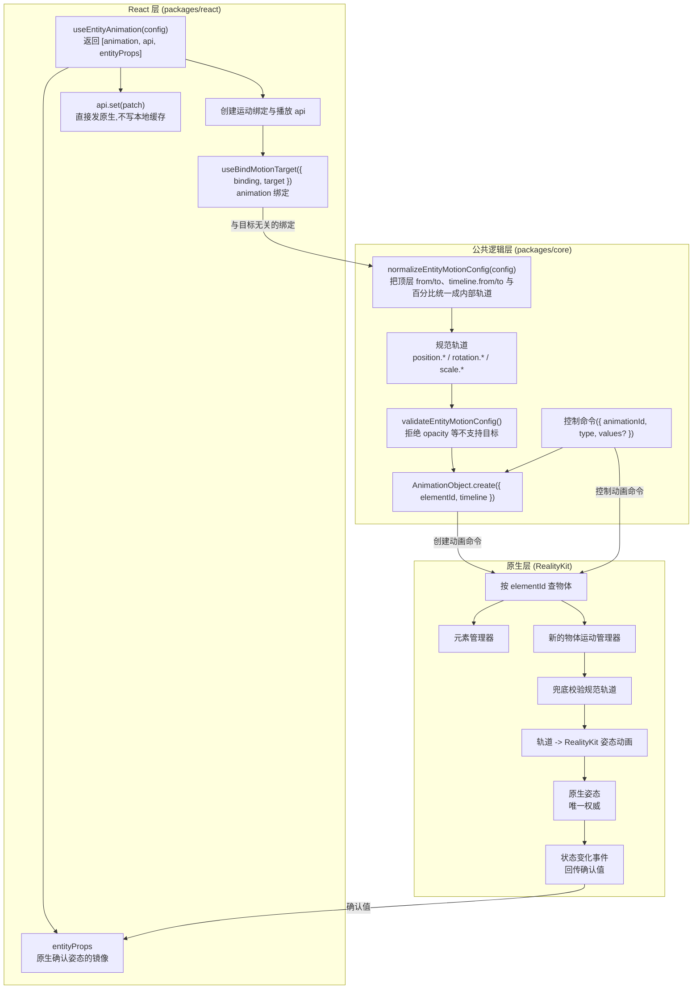

**各层职责:**

- **React 层**负责 Hook API、绑定生命周期、`entityProps` 镜像、回调分发和重渲染,不保存独立姿态缓存。
- **公共逻辑层**负责把对外的三种书写形态(顶层 `from` / `to`、`timeline.from` / `timeline.to`、百分比关键帧)归一化成内部的规范物体轨道。顶层 `from` / `to` 是 `timeline.from` / `timeline.to` 的等价简写,两者折叠到同一套内部轨道;当两者同时出现时以 `timeline` 为准,顶层被忽略并在开发模式打印警告。动画对象的 `elementId` 字段在本设计中含义是"空间对象 id"。
- **原生层**负责查找目标、兜底校验、用 RealityKit 编译并执行、接受或拒绝命令、拆解最终姿态并通过事件回传。

### 4.4 关键折中

- **命令名保留 `Element` 字样。** 创建和控制命令名含 `Element`,不新增平行链路;其目标态语义为空间对象,`elementId` 表示空间对象 id。
- **承担原生编译成本。** 多关键帧、稀疏关键帧、旋转换算和逐通道编译集中在物体运动管理器与编译器,换取 RealityKit 原生播放、系统合成和统一播放语义。
- **按通道编译。** 每个通道独立编译并在动画组中并行播放,以保留逐通道缓动;代价是不能合并为一条完整姿态动画。
- **按分量接管。** 某分量出现任一动画字段后,整个分量由动画接管。例如只动画 `position.y` 时,`position.x` / `position.z` 在播放期间冻结在基准值;完全未出现的分量仍由 React 属性驱动。
- **不提供函数式 `set`。** `api.set(prev => next)` 无法保证 `prev` 是实时原生姿态,因此 v1 只接受稀疏补丁对象;当前确认姿态通过 `entityProps` 读取。
- **暂不抽象统一适配层。** v1 在 `SpatialScene` 中按运行时类型分发到元素或物体管理器;只有两条路径出现真实重复时才提取公共协议。
- **并发性能需要实测。** RealityKit 原生播放优于 JS 逐帧写入,但海量物体并发仍需专项性能验证。

## 5. 模块设计

### 5.1 通信协议(JS Bridge)

复用命令与事件,不为物体新增平行通道:

- 创建动画:`CreateSpatializedElementAnimationJSBCommand`
- 控制动画:`ControlSpatializedElementAnimationJSBCommand`
- 状态事件:`spatialanimationstatechanged`

#### 创建动画命令

命令名与 `elementId` 字段承载空间对象。`elementId` 实际含义是空间对象 id,既可指向元素,也可指向物体:

```text
CreateSpatializedElementAnimation {
  elementId: string
  timeline: EntityMotionTimeline | SpatializedMotionTimeline
}
```

原生按 `elementId` 查注册表,再按运行时类型分发:

```text
是元素   -> 元素管理器
是物体   -> 物体运动管理器
其它     -> 失败
```

规则:

- `elementId` 在注册表中查不到时,创建必须显式失败。
- 查到的对象既不是元素也不是物体时,创建必须以"不支持的目标"失败。
- 控制命令不再携带 `elementId`,只靠 `animationId` 找到已创建的动画。
- 目标对象已销毁时,关联动画必须被销毁或失效;后续控制必须失败并通过错误事件暴露。

#### 控制动画命令

复用命令,并新增 `set` 类型:

```text
ControlSpatializedElementAnimation {
  animationId: string
  type: 'play' | 'pause' | 'stop' | 'reset' | 'finish' | 'destroy' | 'set'
  values?: EntityMotionPatch
}
```

`api.set` 不新增命令。它只接受一个稀疏补丁对象 `EntityMotionPatch`(写入侧类型,与读取侧的 `EntityMotionProps` 同形态,但命名区分),不支持 `(prev) => next` 这种函数写法。它以 `type: 'set'` 发往原生:

- 原生拒绝:命令失败或触发错误事件,`entityProps` 不更新。
- 原生接受:原生在当前已提交姿态上合并补丁、应用后,通过状态事件回传确认值,React 再更新 `entityProps`。

#### 状态变化事件

状态事件携带一个具名的 detail 类型:

```text
interface EntityMotionStateChangedDetail {
  animationId: string
  action:
    | 'play' | 'pause' | 'stop' | 'reset' | 'finish' | 'destroy' | 'set'
    | 'start' | 'complete' | 'error'
  playState: 'idle' | 'queued' | 'running' | 'paused' | 'finished'
  finished: boolean
  values?: EntityMotionProps
  error?: SpatializedPlaybackError
}

interface EntityMotionStateChangedMsg {
  type: 'spatialanimationstatechanged'
  detail: EntityMotionStateChangedDetail
}
```

`values` 为物体目标的姿态值 `EntityMotionProps`(即 `position` / `rotation` / `scale`)。

原生回传的 `action` 集合比对外回调多。它与用户回调、`entityProps` 的对应关系如下:

| 原生 action | 对应用户回调 | 是否更新 entityProps |
|---|---|---|
| `start` | `onStart` | 是(开始那一刻一次) |
| `complete` | `onComplete` | 是(终态) |
| `finish` | `onComplete` | 是(终态) |
| `stop` | `onStop` | 是(当前姿态) |
| `reset` | `onReset` | 是(起点姿态) |
| `set` | 无(仅内部提交) | 是(合并后的姿态) |
| `error` | `onError` | 否 |
| `pause` | 无(仅播放状态变更) | 否 |

#### 播放错误分类

`action` 为 `error` 时携带 `error`。错误码是两类目标共享的封闭集合:

```text
type SpatializedPlaybackError = {
  code:
    | 'TARGET_NOT_FOUND'     // elementId 不在注册表中
    | 'UNSUPPORTED_TARGET'   // 解析到的对象既不是元素也不是物体
    | 'TARGET_DESTROYED'     // 目标已销毁,动画失效
  message?: string
}
```

以上三类都会通过 `onError` 抵达用户。有一个例外:被拒绝的 `api.set` 写入(动画活跃期间,或绑定 / 原生对象创建之前)不算错误,它是空操作,只打印一条控制台警告,不进 `onError`。错误码必须能区分,好让应用按类型分支处理,而不是去解析 `message` 文本。

### 5.2 跨层时序

#### 从配置到原生姿态(播放)

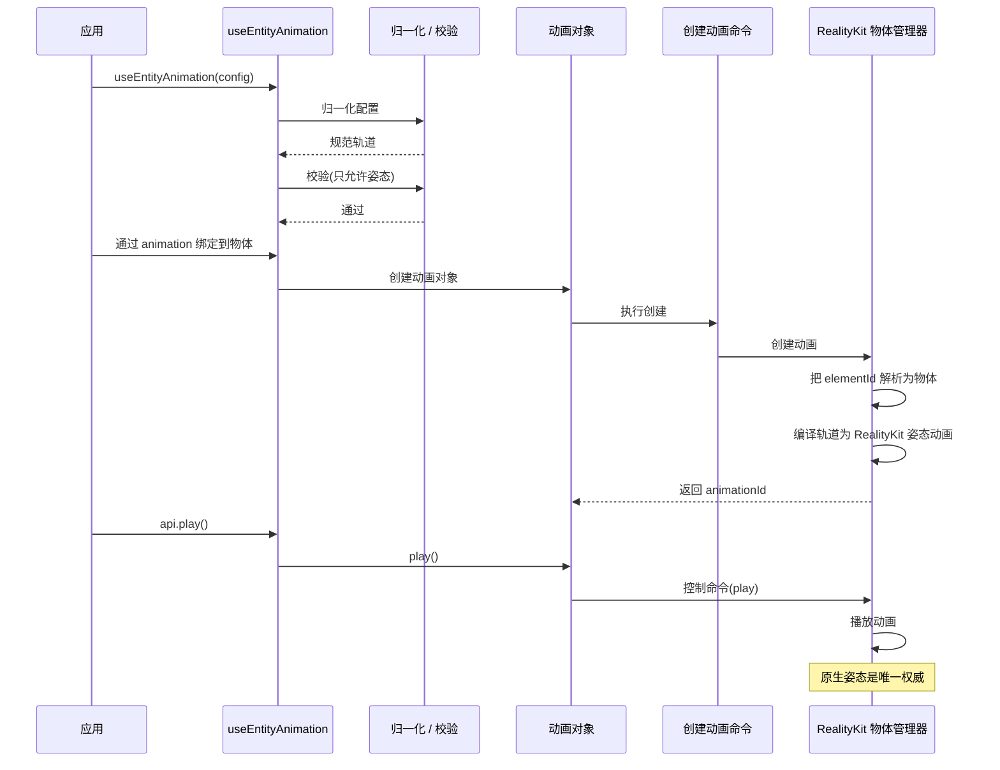

#### 从原生确认姿态到 React 镜像

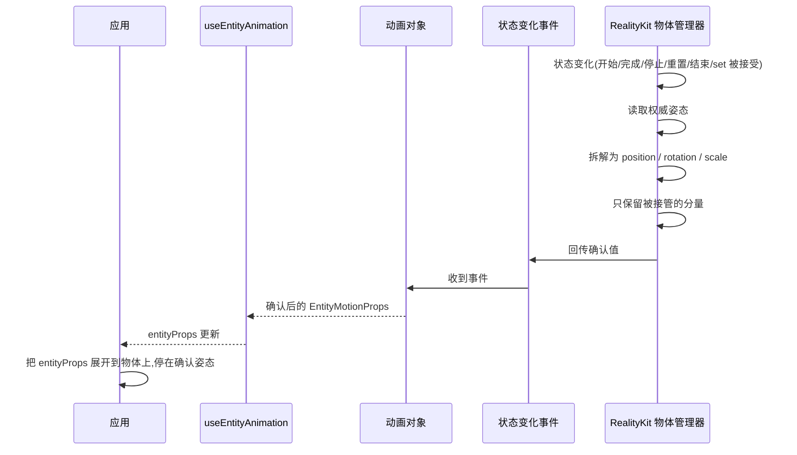

`api.set` 是否生效只由原生决定:动画活跃期间原生不暂存补丁,未绑定或原生对象尚未创建时的写入同样无效——这些写入是空操作,仅打印控制台警告。创建 / 绑定只在首次生命周期提交(一次播放终态或一次被接受的 `set`)时才产出确认值,因此在此之前 `entityProps` 可能为空。

### 5.3 时间轴归一化与编译

物体动画从对外配置到可播放对象要经过两个阶段,分属两层,职责严格分开:

1. **归一化(JS / 公共逻辑层):** 把对外的三种书写形态(顶层 `from` / `to`、`timeline.from` / `timeline.to`、百分比关键帧)折叠成一套与平台无关的内部时间轴数据 `EntityMotionTimelinePayload`。这一步只做展开、合并、求值,产物是平台无关的内部数据,全程在 JS 侧完成。
2. **编译(native / RealityKit):** 原生物体运动管理器拿到已归一化的内部时间轴,读取基准姿态,按通道切段,把每段编成 `FromToByAnimation`,再用 `sequence` 串联、`group` 并联,最终产出可播放对象(动画资源 / 动画组 + 播放控制器)。这一步才是**编译**。

#### 归一化(JS 层)

归一化由公共逻辑层的 `normalizeEntityMotionConfig` 完成,把三种对外写法统一成同一套内部时间轴数据。

**输入:** 对外的三种书写形态,折叠规则为:

- **顶层 `from` / `to`** 等价于 `timeline.from` / `timeline.to`,展开成起止两帧。
- **`timeline.from` / `timeline.to`** 即 `0%` / `100%` 帧,可与百分比 key 混写。
- **百分比关键帧** `0% → 50% → 100%` 按 `at = 百分比 × duration` 折算成秒。

完整归一化规则(`timeline` 优先、边界必填、`duration` 默认值等)见“5.6 各层改动 · 公共逻辑层”。

**输出:** 平台无关的 `EntityMotionTimelinePayload`,结构如下:

```text
type EntityMotionTimelinePayload = {
  duration: number
  delay?: number
  playbackRate?: number
  loop?: boolean | { reverse?: boolean }
  tracks: EntityMotionTrack[]
}

type EntityMotionTrack = {
  property: EntityMotionProperty
  keyframes: EntityMotionKeyframe[]
  timingFunction?: TimingFunction
}

type EntityMotionProperty =
  | 'position.x' | 'position.y' | 'position.z'
  | 'rotation.x' | 'rotation.y' | 'rotation.z'
  | 'scale.x'    | 'scale.y'    | 'scale.z'

type EntityMotionKeyframe = {
  at: number
  value: number
  timingFunction?: TimingFunction
}
```

示例:

```text
{
  duration: 1.2,
  tracks: [
    {
      property: 'position.y',
      timingFunction: 'easeOut',
      keyframes: [
        { at: 0, value: 0 },
        { at: 0.6, value: 0.25 },
        { at: 1.2, value: 0 },
      ],
    },
    {
      property: 'rotation.y',
      timingFunction: 'linear',
      keyframes: [
        { at: 0, value: 0 },
        { at: 1.2, value: 180 },
      ],
    },
  ],
}
```

#### 编译(native / RealityKit)

编译由原生物体运动管理器完成:拿到归一化的内部时间轴,读取基准姿态,按通道组织并逐段编译,最终产出可控播放对象。

##### 输入:内部时间轴

编译的输入就是归一化的产物 `EntityMotionTimelinePayload`(结构见上节),且目标已解析为物体。

##### 编译流程

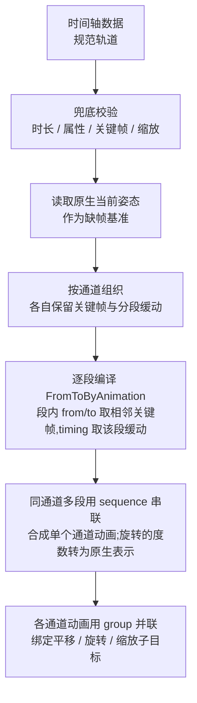

##### 通道内多段串联与通道间并联

一个通道对应一个变换子目标(平移 / 旋转 / 缩放),它的多段以及通道之间的组合分两层完成。

**通道内多段——用 `sequence` 串联。** 一个通道按自己的关键帧被切成若干相邻区间,每个区间编译成一个 `FromToByAnimation<Transform>`:`from` / `to` 取该区间首尾关键帧的值,`duration` 取区间时长,`timing` 取该段自己的缓动(缓动优先级见编译规则 9)。同一通道的这些分段动画按时间顺序用 `AnimationResource.sequence(with:)` 串成一个通道动画,从而让每一段各自带缓动、又首尾相接连续播放。只有起止两帧的通道退化为单段,直接是一个 `FromToByAnimation`,无需 `sequence`。

**通道间——用 `group` 并联。** 各通道串好的通道动画彼此独立、同时播放,用 `AnimationResource.group(with:)` 合成一个动画组,再分别绑定到平移 / 旋转 / 缩放子目标(`bindTarget`)。这就是前面所说“动画组”的具体原语:`group` 负责并联,`sequence` 负责串联,两者组合表达“多通道并行、每通道内多段串行”的完整时间轴。

以一个含两个通道的例子说明(`position.y` 有 3 帧 = 2 段,`rotation.y` 只有起止 2 帧 = 1 段):

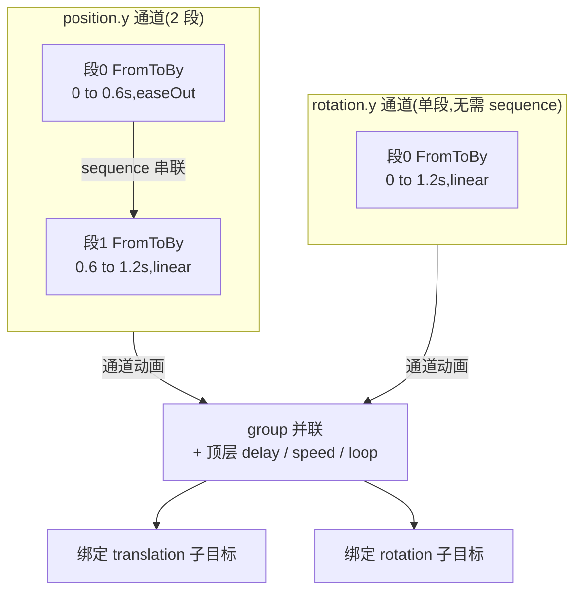

横向是并联(通道间用 `group`),每个通道内纵向是串联(多段用 `sequence`);`delay` / `speed` / `loop` 只作用在 `group` 这一层。

##### 输出:可控播放对象与代码演示

编译的最终输出是可控播放对象。沿用上文示例(`position.y` 两段、`rotation.y` 单段),下面分别用 visionOS 与 picoOS 演示两端差异:把多段 `FromToBy` 用 `sequence` 串成通道动画,再用 `group` 把各通道并联成一个动画资源,最后交给引擎播放,拿到可暂停 / 恢复 / 停止 / 变速的播放控制器——即“可控播放对象”。

visionOS(RealityKit / Swift):

```swift
import RealityKit

// 沿用示例;x / z 冻结在基准值,只动画 y
let base = entity.transform.translation

// position.y 通道:两段 FromToBy,各带缓动,再用 sequence 串联
let posSeg0 = FromToByAnimation<SIMD3<Float>>(
    name: "pos.seg0",
    from: SIMD3(base.x, 0,    base.z),
    to:   SIMD3(base.x, 0.25, base.z),
    duration: 0.6,
    timing: .easeOut,                 // 段0 自己的缓动
    bindTarget: .transform.translation
)
let posSeg1 = FromToByAnimation<SIMD3<Float>>(
    name: "pos.seg1",
    from: SIMD3(base.x, 0.25, base.z),
    to:   SIMD3(base.x, 0,    base.z),
    duration: 0.6,
    timing: .easeIn,                  // 段1 自己的缓动,与段0 不同
    bindTarget: .transform.translation
)
let posChannel = try AnimationResource.sequence(with: [
    try AnimationResource.generate(with: posSeg0),
    try AnimationResource.generate(with: posSeg1),
])

// rotation.y 通道:单段,无需 sequence
let rotSeg = FromToByAnimation<simd_quatf>(
    name: "rot.seg0",
    from: simd_quatf(angle: 0,   axis: SIMD3(0, 1, 0)),
    to:   simd_quatf(angle: .pi, axis: SIMD3(0, 1, 0)),   // 180°
    duration: 1.2,
    timing: .linear,
    bindTarget: .transform.rotation
)
let rotChannel = try AnimationResource.generate(with: rotSeg)

// 通道间并联:group 合成一个动画资源
let clip = try AnimationResource.group(with: [posChannel, rotChannel])

// 得到可控播放对象:控制器支持暂停 / 恢复 / 停止 / 变速
let controller = entity.playAnimation(clip, transitionDuration: 0, startsPaused: true)
controller.resume()          // play
// controller.pause()        // pause
// controller.stop()         // stop
// controller.speed = 2.0    // 顶层播放速率作用在整个 group
```

picoOS(Pico Spatial SDK / Kotlin):

```kotlin
// 沿用同一示例;x / z 冻结在基准值
val base = entity.getComponent(Transform::class.java)?.position ?: Vector3(0f, 0f, 0f)

// position.y 通道:两段 TweenAnimation,各自生成 AnimationResource,再 sequence 串联
val posSeg0 = TweenAnimation.createTweenAnimation(
    "pos.seg0",
    AnimationBindTarget.bindPosition(),
    Vector3(base.x, 0f,    base.z),   // from
    Vector3(base.x, 0.25f, base.z),   // to
    null,                             // by
    0.6f, 0f, RepeatMode.None, 0,     // duration / delay / repeatMode / repeatCount
    EaseType.EaseOut,                 // 段0 缓动
    0f, 1f, false, null, null, null
)
val posSeg1 = TweenAnimation.createTweenAnimation(
    "pos.seg1",
    AnimationBindTarget.bindPosition(),
    Vector3(base.x, 0.25f, base.z),
    Vector3(base.x, 0f,    base.z),
    null,
    0.6f, 0f, RepeatMode.None, 0,
    EaseType.EaseIn,                  // 段1 缓动,与段0 不同
    0f, 1f, false, null, null, null
)
val posChannel = AnimationResource.sequence(with = listOf(
    AnimationResource.generateWithTweenAnimation(posSeg0),
    AnimationResource.generateWithTweenAnimation(posSeg1),
))

// rotation.y 通道:单段,用欧拉角度数
val rotSeg = TweenAnimation.createTweenAnimation(
    "rot.seg0",
    AnimationBindTarget.bindEulerAngles(),
    EulerAngles(0f, 0f,   0f),        // from
    EulerAngles(0f, 180f, 0f),        // to(绕 y 轴 180°)
    null,
    1.2f, 0f, RepeatMode.None, 0,
    EaseType.Linear,
    0f, 1f, false, null, null, null
)
val rotChannel = AnimationResource.generateWithTweenAnimation(rotSeg)

// 通道间并联:group 合成
val clip = AnimationResource.group(with = listOf(posChannel, rotChannel))

// 得到可控播放对象
val controller = entity.playAnimation(clip)
// controller.pause() / controller.resume() / controller.stop()
// controller.speed = 2f     // 顶层播放速率作用在整个 group
```

##### 编译规则

1. **属性白名单:** 只接受 `position.*`、`rotation.*`、`scale.*`。`opacity`、材质、组件属性等一律显式失败。
2. **时间范围:** `duration` 必须为正;每个关键帧的 `at` 必须落在 `[0, duration]` 内。
3. **排序与重复:** 每条轨道的关键帧按 `at` 非递减排序;同一属性不允许出现多条轨道。
4. **各通道独立区间:** 每个通道按自己的关键帧时间划分区间,不与其他通道共享全局边界。例如某通道的 `0, 0.6, 1.2` 只影响它自己的 `[0, 0.6]` 和 `[0.6, 1.2]` 两段。
5. **缺帧与非动画分量,分两种情况:**
   - 若某通道首帧不在 `0` 时刻(例如该通道的标量到 `50%` 才首次出现),用播放起点的原生当前值作该通道基准,并把 `[0, 首帧]` 这段按**从基准值到首帧值的插值**处理——即该通道从一开始就在运动,而非停在原地等到首帧才动;若某时刻晚于该通道最后一帧,则保持最后一帧的值。缺帧只向下回落到原生基准值,绝不向后借用后续关键帧的值。通道之间不共享边界、不互相插值。
   - (a) *被动画分量内的非动画标量*:例如只动画 `position.y`,则 `position.x` / `position.z` 因平移子目标被整体绑定而冻结在基准值。
   - (b) *完全没出现的分量*:例如配置里没有任何 `scale.*`,则不为缩放子目标生成动画,缩放不被动画持有,动画期间仍由 React 属性驱动。
6. **逐段串联、逐通道并行:** 每个通道内的多段用 `sequence` 串成单个通道动画,通道之间用 `group` 并联播放并绑定到对应子目标(平移 / 旋转 / 缩放),详见“通道内多段串联与通道间并联”。不合并成共享缓动的时间段。
7. **旋转:** `rotation.*` 输入是欧拉角度数,编译时转成 RealityKit 所需的旋转表示,避免用欧拉角逐帧插值。RealityKit 对朝向用最短路径球面插值,因此某个旋转通道若单帧增量达到或超过 180°、或跨多轴,实际路径可能与逐轴直觉不同;需要特定的多圈或多轴路径时,应显式补中间关键帧。编译器不自动加密关键帧,这是使用者的责任。
8. **缩放:** `scale.*` 必须非负,非法缩放直接失败。
9. **缓动优先级:** 关键帧级缓动优先于轨道级,轨道级优先于时间轴默认值。缓动取值是封闭枚举 `linear` / `easeIn` / `easeOut` / `easeInOut`,全部直接映射到 RealityKit 内建曲线,不支持自定义贝塞尔,也不存在需要降级处理的缓动。
10. **循环 / 播放速率 / 延迟:** 这些播放参数放在时间轴顶层,对整个动画组统一生效,由 RealityKit 播放层执行。
11. **失败显式化:** 若 RealityKit 无法表达某个通道,必须通过命令失败或错误事件显式报错,不能悄悄忽略。

### 5.4 姿态拆解与回传

原生回传给 React 的值必须是物体 API 的形态:

```text
type EntityMotionProps = {
  position?: Vec3
  rotation?: Vec3
  scale?: Vec3
}
```

拆解规则:

- `position` 来自原生姿态的平移部分。
- `scale` 来自原生姿态的缩放部分。
- `rotation` 用与物体属性一致的欧拉角度数。
- 拆解后必须按该动画对象当前接管的分量裁剪:只回传被动画接管的分量,以及被 `api.set` 写入的分量;没被接管的分量不进入回传值,以免展开时覆盖使用者仍在用 React 属性实时控制的分量。若 `api.set` 写入了一个配置里没动画的分量,该分量并入被接管集合,后续也出现在 `entityProps` 中。
- 回调值和 `entityProps` 都用 `EntityMotionProps` 形态;`api.set(values)` 接受同形态的写入侧 `EntityMotionPatch`,命名区分读写两侧。

### 5.5 能力检测

文档和示例统一用顶层能力检测:

```text
supports('useEntityAnimation')
```

带子标记的 `supports('useEntityAnimation', ['entity'])` 从对外契约中移除,只保留顶层写法,不再保留任何 `entity` 子标记。

### 5.6 各层职责

#### React 层(`packages/react`)

- **公开接口:** `useEntityAnimation` 作为公开 Hook 名,物体组件提供 `animation` 绑定入口,物体属性含 `position` / `rotation` / `scale` 层级。
- **返回值:** 返回值为 `[animation, api, entityProps]`;`api` 提供 `play` / `pause` / `stop` / `reset` / `finish` 和 `set`;`api.set` 发送 `set` 控制命令,不写本地缓存。
- **绑定:** 提供运动绑定、`api.set(values)`、`entityProps` 结果出口。物体组件支持 `animation` 绑定;绑定器为 `useBindMotionTarget({ binding, target })`,保持"一个绑定对应一个目标"的约束。

#### 公共逻辑层(`packages/core`)

- **依赖:** 动画对象的生命周期模型、创建 / 控制命令类,以及状态变化事件通道。
- **动画对象:** 按目标类型区分时间轴与回传值;`elementId` 为传输字段,表示空间对象 id;创建命令用 `elementId` 通过注册表解析;控制命令支持 `set` 和可选 `values`。
- **类型与函数:** 物体运动相关类型、`EntityMotionPatch`、属性白名单、归一化函数、校验函数,以及内部的时间轴数据与轨道形态。对外暴露三种书写形态:顶层 `from` / `to`、`timeline.from` / `timeline.to`、百分比关键帧;内部轨道不作为对外写法。`normalizeEntityMotionConfig` 负责把这三种形态折叠成同一套内部轨道,规则为:
  - **顶层 `from` / `to` 等价于 `timeline.from` / `timeline.to`**:两者归一化后走完全相同的内部轨道路径。
  - **`timeline` 内 `from` = `0%`、`to` = `100%`**:`timeline.from` / `timeline.to` 可与百分比 key 混合在同一个 `timeline` 里;同一 `timeline` 内 `from` 与 `0%`(或 `to` 与 `100%`)重复定义同一帧时报错。
  - **`timeline` 优先**:当 `timeline` 与顶层 `from` / `to` 同时出现时,采用 `timeline`,忽略顶层 `from` / `to`,并在开发模式打印一条警告。
  - **纯顶层 `from` / `to` 且未使用百分比时,`duration` 默认 0.3 秒**。
  - **每个动画都要求起止两端都提供**:任一形态都 MUST 同时具备起始边界(顶层 `from`、`timeline.from` 或 `0%` 帧)与结束边界(顶层 `to`、`timeline.to` 或 `100%` 帧),缺任一端直接报错,不会用物体当前基准或 baseline 补缺失的边界帧。此约束作用于全部三种形态。注意区分两个层级:被强制的是**边界帧的存在性**;边界帧内部的**字段**仍可稀疏,某通道在边界帧缺关键帧时,仍按逐通道缺帧规则回落到 native baseline(见上文"缺帧与非动画分量")。

#### 原生层(RealityKit)

- **依赖:** 对象注册表、元素运动管理器路径、RealityKit 执行环境,以及创建 / 控制 / 事件跨端协议。
- **分发与回传:** 创建动画时按 `elementId` 查对象,按运行时类型分发到元素管理器或物体管理器;控制动画时支持物体动画的全部命令;每次开始 / 终态 / `set` 被接受都回传确认值;只保留一条原生执行路径。
- **物体运动子系统:** 物体原生运动子系统,由物体运动管理器作为物体创建 / 控制的原生入口,负责规范轨道兜底校验、编译调度、动画注册、控制与 `set` 路由、生命周期与目标失效;姿态拆解与事件回传由管理器 / 动画对象 / 桥接辅助按职责完成。

### 5.7 类图与原生子系统

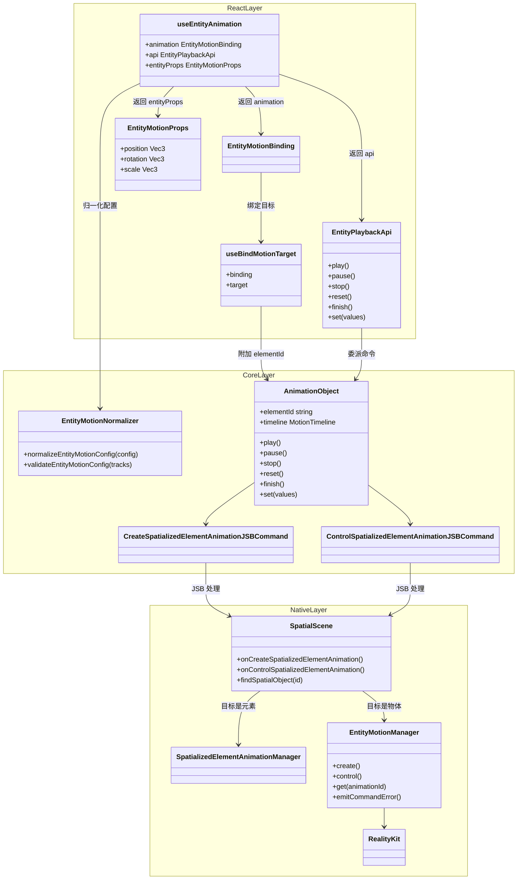

上图是概念图:为便于阅读把 React、公共逻辑、原生三层的类画在一起,并不表示它们同层。原生的目标解析在 `SpatialScene` 的创建 / 控制处理里进行:通过 `findSpatialObject` 查注册表,再按运行时类型分发到元素管理器或物体管理器。物体原生运动子系统的主要状态与编排集中在物体运动管理器及其辅助里(边界约束见本节末尾)。

#### RealityKit 物体运动子系统

子系统怎么拆,以可读性和可测试性为准,不追求和元素路径文件数对齐。以下是推荐职责边界;实现时可把管理器内部的辅助合并,只在逻辑复杂或明显可复用时才拆分。

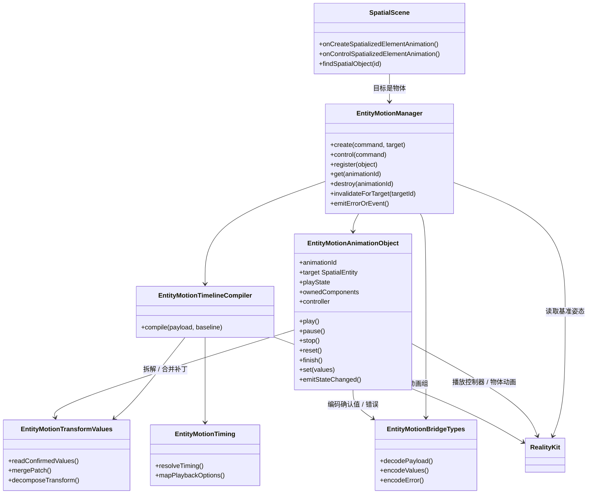

**各类职责:**

- **物体运动管理器(`EntityMotionManager`):** 物体运动的原生入口。承接 `SpatialScene` 分发过来的创建与控制,管理动画注册表与生命周期。创建时调用编译器、生成动画对象、注册并返回 `animationId`;控制时按 `animationId` 找到对象并调用对应方法。负责命令失败的回执、销毁与目标失效处理,不让 `SpatialScene` 持有物体动画状态。确认值的事件回传由动画对象完成,管理器只在查找 / 校验阶段直接失败时上报错误。
- **物体动画对象(`EntityMotionAnimationObject`):** 表示单个物体动画,保存 `animationId`、目标物体、播放状态、被接管分量、播放控制器与资源,负责单个对象的状态转换。每次开始 / 终态 / `set` 被接受后,借拆解辅助得到确认值、经桥接辅助编码,再发出状态变化事件。
- **时间轴编译器(`EntityMotionTimelineCompiler`):** 把归一化后的时间轴数据编译为逐通道的 RealityKit 动画资源与动画组;它不解析对外的 `from` / `to` 或百分比。
- **桥接类型(`EntityMotionBridgeTypes`):** 承载原生桥接的编解码结构,包括时间轴数据、控制值、确认值和错误。若命令类型已够用,这部分可作为若干结构体分散存在。
- **播放参数映射(`EntityMotionTiming`):** 把缓动、延迟、循环、播放速率映射到 RealityKit 的表达;四种内建缓动全部直接映射。
- **姿态拆解与合并(`EntityMotionTransformValues`):** 负责从物体姿态拆解确认值、把 `api.set` 的稀疏补丁合并到已提交基准上,以及欧拉角度数与 RealityKit 旋转表示之间的换算。

**创建加播放时序:**

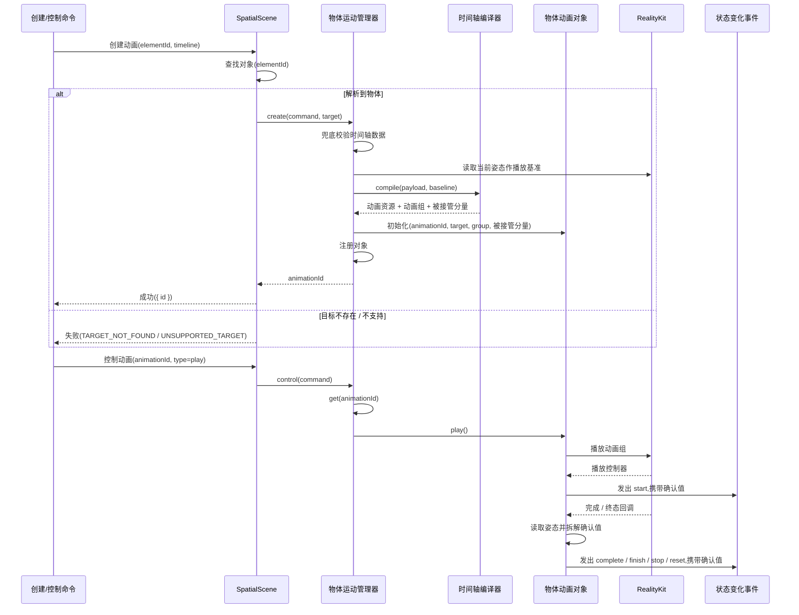

创建只生成原生动画对象和编译好的计划、返回 `animationId`,不额外回传初始确认值。`entityProps` 仍只在开始、终态、被接受的 `set` 等确认事件时更新。物体动画对象持有的是整条时间轴编译后的动画组 / 控制器,不是单条轨道;单通道粒度只存在于编译器内部。

**暂停时序:**

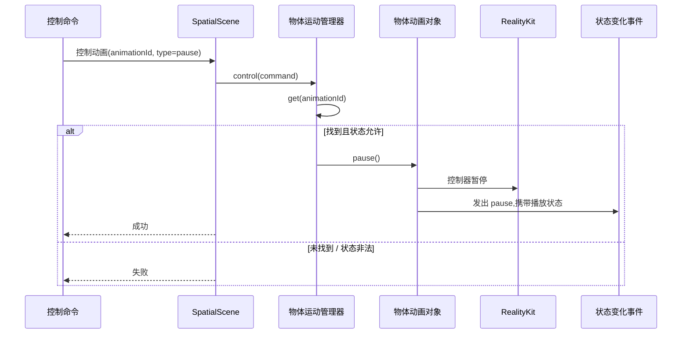

**停止、重置、结束时序:**

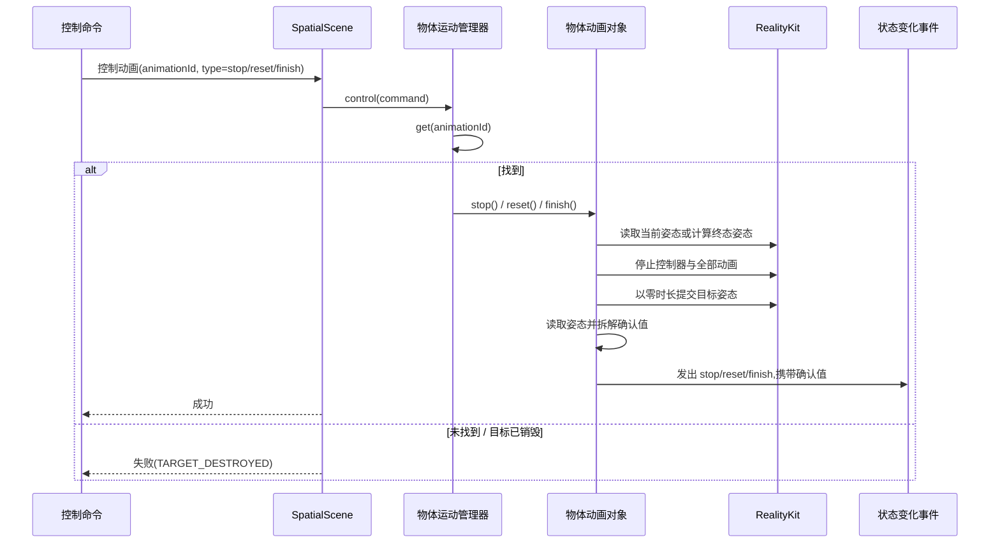

**set 时序:**

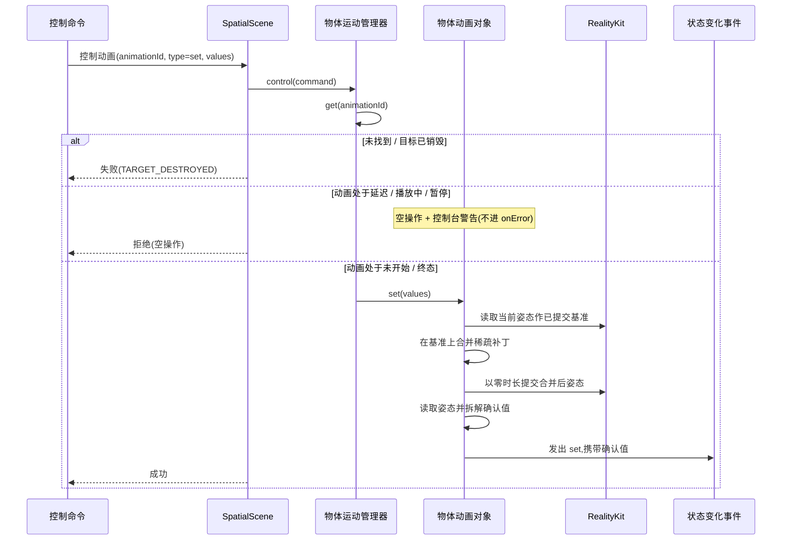

暂停只控制当前播放控制器,不重新编译动画组。停止 / 重置 / 结束会终止当前播放,并以零时长提交终态姿态。`set` 不使用 RealityKit 动画资源,只在非活跃状态下把稀疏补丁合并到已提交姿态后提交。

边界约束:`SpatialScene` 只做目标查找、类型分发和命令回执,物体专属的编译与播放状态不散落在它的处理逻辑里。v1 不新增只做转发的物体层;注册表、创建 / 控制编排与生命周期都归物体运动管理器。将来若两条路径需要统一目标边界,再抽公共协议或薄封装。
