# `useEntityAnimation` 重设计

## 1. 背景

`useEntityAnimation` 是 WebSpatial SDK 中驱动场景内 3D 物体姿态动画的 React Hook。它支持百分比关键帧、动画结果回写和统一的命令式姿态设置,并把物体动画统一到通用动画的绑定和生命周期上。

本次重设计将物体动画接入通用动画架构:React 层提供 Hook、绑定和结果镜像,Core 层完成配置归一化与校验,visionOS 原生层使用 RealityKit 编译和执行动画。原生姿态是唯一权威数据源,所有姿态变更经原生确认后再回传 React,从结构上避免动画终态与 React 基础属性冲突导致的回弹。

本设计的目标是:

- 给出 React、Core、原生三层的职责边界和数据流。
- 明确“配置 → 规范轨道 → RealityKit 动画”和“原生确认姿态 → `entityProps`”两条链路。
- 物体使用独立的创建、控制和设置协议,状态事件只回传播放状态与原生确认姿态。
- 空间元素与物体动画复用通用播放接口,分别使用目标专属的动画对象和跨端协议。

本设计的公开 API 范围是动画绑定、播放控制和确认姿态回写,执行引擎统一为原生 RealityKit。本文完整定义 API 形态、行为边界、跨端协议、编译规则和模块职责,可独立用于技术评审。

## 2. 名词解释

- **物体(Entity)**:场景里的一个 3D 对象,例如一个盒子。它有三组空间属性,合称"姿态"。
- **姿态(transform)**:物体在空间中的状态,由位置 `position`(米)、旋转 `rotation`(度)、缩放 `scale`(倍数)三部分组成。
- **分量**:指姿态三部分之一,即 `position`、`rotation` 或 `scale`。
- **原生层 / RealityKit**:苹果 visionOS 上真正驱动 3D 物体运动的底层引擎,由 Swift 实现。本文说"原生"即指这一层。
- **React 层 / 公共逻辑层(Core)**:分别是面向使用者的 Hook 代码,和两端共用的、与平台无关的逻辑代码。
- **JS Bridge 命令 / 事件**:JavaScript 与原生层之间收发消息的通道。命令由 JS 发往原生,事件由原生回传给 JS。
- **权威数据源**:某份数据以谁为准。本设计中物体的真实姿态只以原生层为准。
- **镜像(mirror)**:React 侧把原生层已确认的姿态复制一份出来供渲染使用,这份复制就叫镜像。
- **`entityProps`**:Hook 返回给使用者的姿态镜像,形如 `{ position?, rotation?, scale? }`,展开到组件上可让物体停在动画终点。
- **确认姿态(confirmed transform)**:原生层执行完一个动作后,返回 Entity 当前的完整 transform。React 只用这种值更新 `entityProps`。
- **轨道(track)/ 通道(channel)**:一条描述单个属性(如 `position.y`)随时间变化的曲线;二者可互换,均指某单个属性的关键帧序列。编译时把各通道关键帧时间取并集切片、每个切点采样出完整姿态后整体播放(见 5.3)。
- **关键帧(keyframe)**:曲线上的一个时间点及其取值,例如"第 0.6 秒时 `position.y` = 0.25"。
- **缓动函数(timingFunction)**:描述两帧之间快慢变化的曲线,如匀速 `linear`、先慢后快 `easeIn`。
- **基准值(baseline)**:每次 fresh play 被接受时的原生当前值;当某个字段未写入 config 时,用它补全本轮播放的完整姿态。
- **起始姿态确认(start confirmation)**:fresh play 编译成功后,Native 把 config 的 `from` / `0%` 与本轮 baseline 合成为完整起始姿态,提交给目标并返回 Entity 当前的完整 transform。确认成功后立即发出 `start`,React 据此更新 `entityProps`;该事件不等待 delay 结束。
- **fresh play**:创建后的首次播放,或动画在 `complete` / `finish` / `stop` / `reset` 后重新开始播放;`autoStart` 也属于 fresh play。未发生配置更新时,`pause` 后继续 `play` 是恢复当前播放;paused update 后的 `play` 从保存 pose 启动新执行。
- **球面线性插值(slerp)**:RealityKit 对旋转采用的插值方式,总是走两个朝向之间的最短路径。
- **空操作(no-op)**:命令被接收后,物体和 `entityProps` 保持原值。
- **注册表(registry)**:原生层用来按 id 查找物体或动画对象的表。
- **创建前播放队列(creation-pending playback queue)**:React Binding 在 Native 创建动画对象前保存播放命令的队列。创建后由 Core 直接提交命令。
- **命令回执(command reply)**:原生层完成命令的同步状态变更和姿态提交后,通过 JSB 返回的成功或失败结果。命令需要产生状态事件时,原生层先发出事件,再返回成功回执。

## 3. 设计目标

`useEntityAnimation` 让使用者用位置、旋转、缩放描述动画,将动画绑定到物体,并在原生确认后获得物体姿态。功能清单如下:

| 功能 | 说明 |
|---|---|
| 姿态动画 | 属性白名单为 `position`、`rotation`、`scale`;`opacity` 等非姿态属性触发显式校验失败。 |
| 多种时间轴写法 | 支持顶层 `from` / `to`、`timeline.from` / `timeline.to` 和 `0% → 50% → 100%` 百分比关键帧。 |
| 动画绑定 | Hook 返回 `animation`,通过物体组件的 `animation` 属性绑定目标。 |
| 播放控制 | `api` 提供 `play`、`pause`、`stop`、`reset`、`finish`。 |
| 结果回写 | 原生在开始、完成、停止、重置、结束等确认节点回传姿态,React 以 `entityProps` 暴露结果,避免终态回弹。 |
| 命令式设置 | 非活跃状态下通过 `api.set(update)` 在原生已提交姿态上合并稀疏更新。 |
| 生命周期与错误 | 复用通用动画的绑定与生命周期,使用 Entity 专属 JSB 命令和错误事件。 |
| 能力检测 | 通过 `supports('useEntityAnimation')` 检测整体能力。 |

## 4. 设计思路及折衷

### 4.1 设计原则

#### 原生层是唯一权威数据源

物体姿态以原生 RealityKit 为准。React 维护原生确认姿态的只读镜像。

`entityProps` 只是原生已确认姿态在 React 侧的镜像,数据只朝一个方向流动:

```text
React 配置 / api.set
  -> 原生动画引擎(唯一权威)
  -> 确认后的姿态
  -> entityProps 镜像
```

由此得到几条规则:

- 播放、停止、重置、结束、`api.set` 等一切会改变姿态的操作,都要先进原生层。
- 普通播放、控制或配置 update 结果为失败时,物体姿态与 `entityProps` 保持原值。只有动画对象初次创建失败进入绑定终止流程。
- 原生接受播放控制命令时,通过动画状态事件回传确认姿态;接受 `set` 时,通过 `SetEntityAnimationResult` 回传确认姿态。React 收到 Core 转发的确认值后更新 `entityProps`。
- React 把原生确认过的姿态镜像给使用者;动画进行中的写入按空操作处理。
- `entityProps` 初始为空。首次确认后,它包含完整的已提交 `position`、`rotation`、`scale` 值。播放空闲期间,组件组合后的 React 属性控制 transform;把 `entityProps` 展开在基础属性之后即可保持确认姿态。

#### 复用通用动画架构

`useEntityAnimation` 尽量复用通用动画的绑定、目标解析、动画对象生命周期和"创建—控制—事件"链路。物体路径的差异只集中在以下几处:

- 描述方式:用 `position` / `rotation` / `scale`。
- 校验:属性白名单为 `position`、`rotation`、`scale`,其它属性触发显式校验失败。
- 结果出口:`entityProps`。
- 目标类型:`SpatialEntity`。
- 执行引擎:RealityKit。

### 4.2 RealityKit 选型

原生执行引擎选定为 **RealityKit**,原因:

1. **统一执行引擎。** 物体动画与通用动画共用 RealityKit 一套引擎,避免为物体单开一套执行路径。
2. **它天生就是 3D 物体的执行引擎。** 大量物体并发动画时,引擎原生播放比 SDK 逐帧写入扩展性更好。
3. **播放和上报需求它都能满足。** 它能控制播放状态,能读到物体当前姿态,能在播放完成时给出事件,足以实现停止、重置、结束,并把确认姿态上报给回调和 `entityProps`。

主要新增成本是一个编译器:把归一化后的物体轨道翻译成 RealityKit 能执行的姿态动画。

#### RealityKit 原生播放的执行优势

物体动画全部使用 RealityKit 原生播放,具备以下优势:

- **同步渲染节拍。** 姿态动画与 RealityKit 渲染提交保持同一节拍。
- **参与系统合成。** 动画直接参与 visionOS 的系统合成与重投影。
- **融入场景体系。** 姿态动画天然处在场景图、坐标空间、锚点和碰撞体系内。
- **提供高质量插值。** RealityKit 使用球面线性插值处理旋转。
- **复用完整播放语义。** RealityKit 提供缓动、循环、延迟、播放速率、暂停和完成事件。
- **统一执行语义。** 元素与物体路径统一使用原生动画对象。

### 4.3 各层职责与整体架构

#### 整体架构

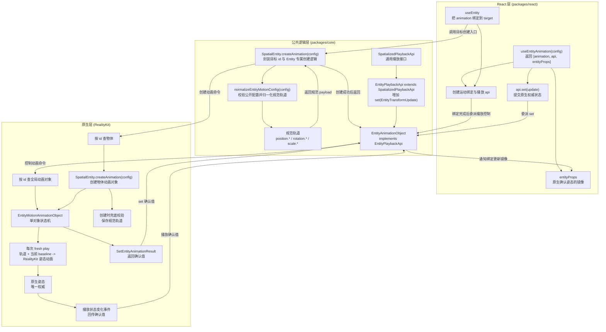
```mermaid
flowchart TB
    subgraph React["React 层 (packages/react)"]
        UseEntity["useEntityAnimation(config)<br/>返回 [animation, api, entityProps]"]
        ReactBinding["创建运动绑定与播放 api"]
        EntityProps["entityProps<br/>原生确认姿态的镜像"]
        ApiSet["api.set(update)<br/>提交原生权威状态"]
        BindTarget["useEntity<br/>把 animation 绑定到 target"]

        UseEntity --> ReactBinding
        UseEntity --> EntityProps
        UseEntity --> ApiSet
        BindTarget --> ReactBinding
    end

    subgraph Core["公共逻辑层 (packages/core)"]
        EntityCreate["SpatialEntity.createAnimation(config)<br/>封装目标 id 与 Entity 专属创建逻辑"]
        Normalize["normalizeEntityMotionConfig(config)<br/>校验公开配置并归一化规范轨道"]
        Tracks["规范轨道<br/>position.* / rotation.* / scale.*"]
        PlaybackApi["SpatializedPlaybackApi<br/>通用播放接口"]
        EntityApi["EntityPlaybackApi extends SpatializedPlaybackApi<br/>增加 set(EntityTransformUpdate)"]
        CoreAnimationObject["EntityAnimationObject<br/>implements EntityPlaybackApi"]

        EntityCreate --> Normalize
        Normalize --> Tracks
        Tracks -->|"返回规范 payload"| EntityCreate
        EntityCreate -->|"创建成功后返回"| CoreAnimationObject
        PlaybackApi --> EntityApi
        EntityApi --> CoreAnimationObject
    end

    subgraph Native["原生层 (RealityKit)"]
        Resolve["按 id 查物体"]
        ResolveAnimation["按 id 查全局动画对象"]
        EntityCreateNative["SpatialEntity.createAnimation(config)<br/>创建物体动画对象"]
        AnimationObject["EntityMotionAnimationObject<br/>单对象状态机"]
        NativeValidate["创建时兜底校验<br/>保存规范轨道"]
        Compile["每次 fresh play<br/>轨道 + 当前 baseline -> RealityKit 姿态动画"]
        Authority["原生姿态<br/>唯一权威"]
        Event["播放状态变化事件<br/>回传确认值"]
        SetResult["SetEntityAnimationResult<br/>返回确认值"]

        Resolve --> EntityCreateNative
        ResolveAnimation --> AnimationObject
        EntityCreateNative --> NativeValidate
        EntityCreateNative --> AnimationObject
        AnimationObject --> Compile
        Compile --> Authority
        Authority --> Event
        AnimationObject --> SetResult
    end

    BindTarget -->|"调用目标创建入口"| EntityCreate
    ReactBinding -->|"绑定完成后委派播放控制"| CoreAnimationObject
    ApiSet -->|"委派 set"| CoreAnimationObject
    EntityCreate -->|"创建动画命令"| Resolve
    CoreAnimationObject -->|"控制动画命令"| ResolveAnimation
    Event -->|"播放确认值"| CoreAnimationObject
    SetResult -->|"set 确认值"| CoreAnimationObject
    CoreAnimationObject -->|"通知绑定更新镜像"| EntityProps
```

**各层职责:**

- **React 层**负责 Hook API、目标绑定协调、`entityProps` 镜像、创建前播放命令、回调分发和重渲染。`useEntityAnimation` 创建一个 `EntityMotionBinding` 和一个稳定的 `EntityPlaybackApi` 控制门面;`useEntity` 调用绑定对象的 `__bind` 和 `__unbind` 入口。`EntityMotionBinding` 作为 React 胶水层保存最新期望配置、连接当前目标与 Core 动画对象,并调用 `SpatialEntity.createAnimation(config)`。
- **公共逻辑层**由 `SpatialEntity.createAnimation(config)` 使用目标自身的 `SpatialObject.id`,执行 Entity 专属归一化与校验,发送创建命令并返回 `EntityAnimationObject`。`EntityPlaybackApi` 扩展现有 `SpatializedPlaybackApi` 并只为 Entity 增加 `set`;`EntityAnimationObject` 与普通 `AnimationObject` 分别实现对应接口,两个具体类之间没有继承关系。归一化会把对外的三种书写形态折叠成内部规范物体轨道;当 `timeline` 与顶层 `from` / `to` 同时出现时,`timeline` 是唯一生效输入,开发模式同时打印重复声明警告。
- **原生层**由 `SpatialScene.spatialObjects` 统一持有动画对象并复用 `SpatialObject` 生命周期。`SpatialScene` 负责创建目标查找和动画对象查找;目标 Entity 通过 `createAnimation(config)` 创建 `EntityMotionAnimationObject`;动画对象负责单对象状态机、fresh play 编译、RealityKit 执行和确认姿态回传。

#### 跨层类图

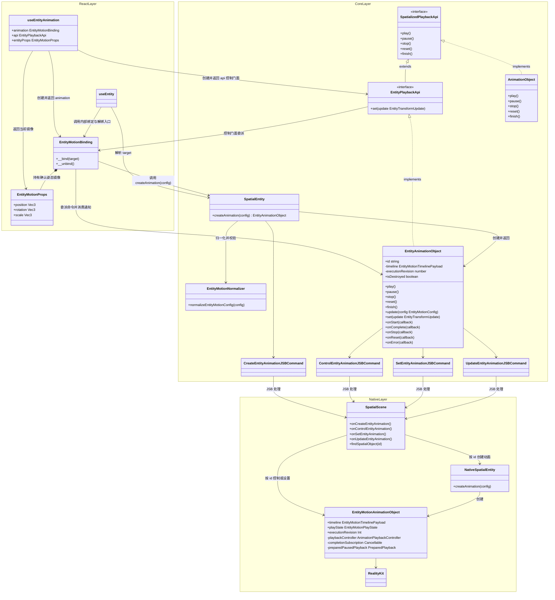
```mermaid
classDiagram
    namespace ReactLayer {
        class useEntityAnimation {
            +animation EntityMotionBinding
            +api EntityPlaybackApi
            +entityProps EntityMotionProps
        }
        class useEntity
        class EntityMotionBinding {
            +__bind(target)
            +__unbind()
        }
        class EntityMotionProps {
            +position Vec3
            +rotation Vec3
            +scale Vec3
        }
    }
    namespace CoreLayer {
        class SpatialEntity {
            +createAnimation(config) EntityAnimationObject
        }
        class EntityMotionNormalizer {
            +normalizeEntityMotionConfig(config)
        }
        class SpatializedPlaybackApi {
            <<interface>>
            +play()
            +pause()
            +stop()
            +reset()
            +finish()
        }
        class EntityPlaybackApi {
            <<interface>>
            +set(update EntityTransformUpdate)
        }
        class AnimationObject {
            +play()
            +pause()
            +stop()
            +reset()
            +finish()
        }
        class EntityAnimationObject {
            +id string
            -timeline EntityMotionTimelinePayload
            -executionRevision number
            +isDestroyed boolean
            +play()
            +pause()
            +stop()
            +reset()
            +finish()
            +update(config EntityMotionConfig)
            +set(update EntityTransformUpdate)
            +onStart(callback)
            +onComplete(callback)
            +onStop(callback)
            +onReset(callback)
            +onError(callback)
        }
        class CreateEntityAnimationJSBCommand
        class ControlEntityAnimationJSBCommand
        class SetEntityAnimationJSBCommand
        class UpdateEntityAnimationJSBCommand
    }
    namespace NativeLayer {
        class SpatialScene {
            +onCreateEntityAnimation()
            +onControlEntityAnimation()
            +onSetEntityAnimation()
            +onUpdateEntityAnimation()
            +findSpatialObject(id)
        }
        class NativeSpatialEntity {
            +createAnimation(config)
        }
        class EntityMotionAnimationObject {
            +timeline EntityMotionTimelinePayload
            +playState EntityMotionPlayState
            +executionRevision Int
            -playbackController AnimationPlaybackController
            -completionSubscription Cancellable
            -preparedPausedPlayback PreparedPlayback
        }
        class RealityKit
    }
    useEntityAnimation --> EntityMotionBinding : 创建并返回 animation
    useEntityAnimation --> EntityPlaybackApi : 创建并返回 api 控制门面
    useEntityAnimation --> EntityMotionProps : 返回当前镜像
    EntityMotionBinding *-- EntityMotionProps : 持有确认姿态镜像
    useEntity --> EntityMotionBinding : 调用内部绑定与解绑入口
    useEntity --> SpatialEntity : 解析 target
    EntityPlaybackApi --> EntityMotionBinding : 控制门面委派
    EntityMotionBinding --> SpatialEntity : 调用 createAnimation(config)
    EntityMotionBinding --> EntityAnimationObject : 委派命令并消费通知
    SpatialEntity --> EntityMotionNormalizer : 归一化并校验
    SpatializedPlaybackApi <|-- EntityPlaybackApi : extends
    SpatializedPlaybackApi <|.. AnimationObject : implements
    EntityPlaybackApi <|.. EntityAnimationObject : implements
    SpatialEntity --> EntityAnimationObject : 创建并返回
    SpatialEntity --> CreateEntityAnimationJSBCommand
    EntityAnimationObject --> ControlEntityAnimationJSBCommand
    EntityAnimationObject --> SetEntityAnimationJSBCommand
    EntityAnimationObject --> UpdateEntityAnimationJSBCommand
    CreateEntityAnimationJSBCommand --> SpatialScene : JSB 处理
    ControlEntityAnimationJSBCommand --> SpatialScene : JSB 处理
    SetEntityAnimationJSBCommand --> SpatialScene : JSB 处理
    UpdateEntityAnimationJSBCommand --> SpatialScene : JSB 处理
    SpatialScene --> NativeSpatialEntity : 按 id 创建动画
    SpatialScene --> EntityMotionAnimationObject : 按 id 控制或设置
    NativeSpatialEntity --> EntityMotionAnimationObject : 创建
    EntityMotionAnimationObject --> RealityKit
```

上图集中展示 React、公共逻辑和原生三层的类,各类归属图中标注的层级。创建请求的 `id` 是目标 Entity 的 `SpatialObject.id`;创建回执的 `id` 是新建动画对象的 `SpatialObject.id`。Core 使用回执中的 `id` 构造 `EntityAnimationObject`,后续控制、设置和事件都直接使用该对象的 `id`。Entity 协议不引入额外的 id 别名。

#### 跨层通信概览

- Core 通过 `CreateEntityAnimationJSBCommand`、`UpdateEntityAnimationJSBCommand`、`ControlEntityAnimationJSBCommand` 和 `SetEntityAnimationJSBCommand` 向 Native 分别发送创建、原地配置更新、播放控制和姿态设置命令。
- Native 通过 `spatialanimationstatechanged` 向 Core 回传播放状态和确认姿态,通过 `entityanimationerror` 回传命令接受后发生的异步错误。
- Core `EntityAnimationObject` 是两类事件的直接消费者。它更新自身播放状态并触发对应的 `onXXX` 调试监听器,再由 React `EntityMotionBinding` 更新公开状态、生命周期 callback 和 `entityProps`。

JSB payload 与错误类型由 5.2 Core SDK 定义,命令处理规则由 5.3 Native 定义,状态事件到 React 的映射由 5.1 React SDK 定义。

#### 跨层时序

##### 从配置到原生姿态(播放)

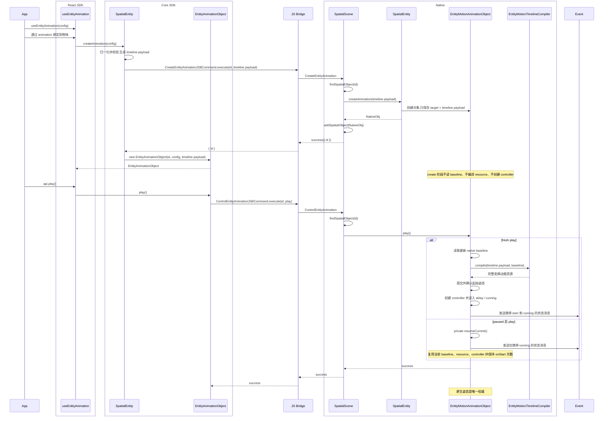
```mermaid
sequenceDiagram
    participant App
    box React SDK
        participant Hook as useEntityAnimation
    end
    box Core SDK
        participant Entity as SpatialEntity
        participant Obj as EntityAnimationObject
    end
    participant Bridge as JS Bridge
    box Native
        participant Scene as SpatialScene
        participant NativeEntity as SpatialEntity
        participant NativeObj as EntityMotionAnimationObject
        participant Compiler as EntityMotionTimelineCompiler
    end

    App->>Hook: useEntityAnimation(config)
    App->>Hook: 通过 animation 绑定到物体
    Hook->>Entity: createAnimation(config)
    Entity->>Entity: 归一化并校验,生成 timeline payload
    Entity->>Bridge: CreateEntityAnimationJSBCommand.execute(id, timeline payload)
    Bridge->>Scene: CreateEntityAnimation
    Scene->>Scene: findSpatialObject(id)
    Scene->>NativeEntity: createAnimation(timeline payload)
    NativeEntity->>NativeObj: 创建对象,只保存 target + timeline payload
    NativeEntity-->>Scene: NativeObj
    Scene->>Scene: addSpatialObject(NativeObj)
    Scene-->>Bridge: success({ id })
    Bridge-->>Entity: { id }
    Entity->>Obj: new EntityAnimationObject(id, config, timeline payload)
    Obj-->>Hook: EntityAnimationObject
    Note over NativeObj: create 阶段不读 baseline、不编译 resource、不创建 controller
    App->>Hook: api.play()
    Hook->>Obj: play()
    Obj->>Bridge: ControlEntityAnimationJSBCommand.execute(id, play)
    Bridge->>Scene: ControlEntityAnimation
    Scene->>Scene: findSpatialObject(id)
    Scene->>NativeObj: play()
    alt fresh play
        NativeObj->>NativeObj: 读取最新 native baseline
        NativeObj->>Compiler: compile(timeline payload, baseline)
        Compiler-->>NativeObj: 完整变换动画资源
        NativeObj->>NativeObj: 提交并确认起始姿态
        NativeObj->>NativeObj: 创建 controller 并进入 delay / running
        NativeObj->>Event: 发送携带 start 和 running 的状态消息
    else paused 后 play
        NativeObj->>NativeObj: private resumeCurrent()
        NativeObj->>Event: 发送仅携带 running 的状态消息
        Note over NativeObj: 复用当前 baseline、resource、controller 并保持 onStart 次数
    end
    NativeObj-->>Scene: success
    Scene-->>Bridge: success
    Bridge-->>Obj: success
    Note over NativeObj: 原生姿态是唯一权威
```

##### 从原生确认姿态到 React 镜像

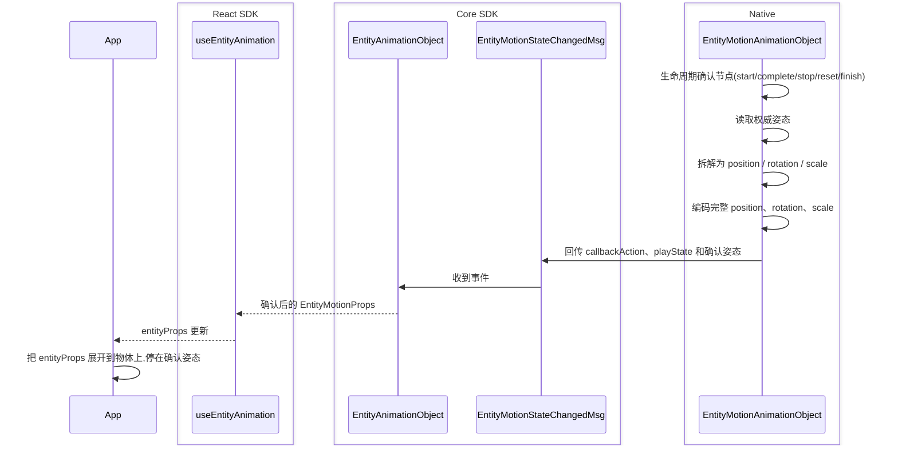
```mermaid
sequenceDiagram
    participant App
    box React SDK
        participant Hook as useEntityAnimation
    end
    box Core SDK
        participant Obj as EntityAnimationObject
        participant Event as EntityMotionStateChangedMsg
    end
    box Native
        participant NativeObj as EntityMotionAnimationObject
    end

    NativeObj->>NativeObj: 生命周期确认节点(start/complete/stop/reset/finish)
    NativeObj->>NativeObj: 读取权威姿态
    NativeObj->>NativeObj: 拆解为 position / rotation / scale
    NativeObj->>NativeObj: 编码完整 position、rotation、scale
    NativeObj->>Event: 回传 callbackAction、playState 和确认姿态
    Event->>Obj: 收到事件
    Obj-->>Hook: 确认后的 EntityMotionProps
    Hook-->>App: entityProps 更新
    App->>App: 把 entityProps 展开到物体上,停在确认姿态
```

`api.set` 是否生效由原生决定:原生仅在动画处于非活跃状态且原生对象已经创建时接受更新,其它时机按空操作处理并打印控制台警告。首个确认值来自 fresh play 起始姿态确认或一次被接受的 `set`;在此之前 `entityProps` 可能为空。

### 4.4 关键折中

- **Entity 使用独立桥接协议。** 创建、原地配置更新、播放控制和姿态设置分别使用 Entity 专属命令。四条命令都直接使用 `SpatialObject.id`,避免继承 Element 动画协议及其字段语义。
- **承担 fresh play 的原生编译成本。** 每次 fresh play 都由物体动画对象读取当前 baseline,再调用编译器完成多关键帧、稀疏关键帧、旋转换算和整姿态串联编译,换取最新 baseline、RealityKit 原生播放、系统合成和统一播放语义。
- **切片为整姿态串联。** 把时间轴切成若干节点、每个节点携带完整的 `position` / `rotation` / `scale`,再按先后顺序串联成一条整姿态动画播放。visionOS(RealityKit)的动画绑定粒度是整个 `.transform`,当前缓动需求也以整段为单位。因此采用整姿态串联,天然对齐 visionOS 与 picoOS(两端原生都绑定整 transform);同一区间内各通道共用一个 `timingFunction`。
- **只在播放活跃期间保护完整 transform。** 每次 fresh play 时,Native 在提交起始姿态前启用完整 transform 写入保护。例如只动画 `position.y` 时,`position.x`、`position.z`、`rotation`、`scale` 在播放期间都保持本轮基准姿态。延迟、运行和暂停期间持续保护,因此 `SpatialScene` 接受普通 React transform 更新但不应用。停止、重置、结束和自然完成会提交对应姿态、解除保护,并返回 Entity 当前的完整 transform,供 Core 更新 `entityProps`。播放空闲期间,普通 React transform 更新恢复生效。解绑、绑定终止和销毁动画对象也会作为清理路径解除保护。该行为与 Element 动画的 Native animating mask 一致。
- **`set` 使用稀疏更新对象。** v1 的 `api.set` 接受 `EntityTransformUpdate`,当前确认姿态通过 `entityProps` 读取。
- **Entity handler 直接分发。** `SpatialScene` 的四条 Entity 专属 handler 分别完成创建、原地配置更新、播放控制和姿态设置,不经过 Element 动画管理器。
- **并发性能需要实测。** RealityKit 原生播放优于 JS 逐帧写入,但海量物体并发仍需专项性能验证。

## 5. 系统/模块设计

### 5.1 React SDK

- **公开接口:** `useEntityAnimation` 创建一个 `EntityMotionBinding` 和一个稳定的 `EntityPlaybackApi` 控制门面,读取绑定对象的当前确认姿态镜像,并返回 `[animation, api, entityProps]`;物体组件通过 `animation` 属性接收 `EntityMotionBinding`。
- **播放控制:** `EntityPlaybackApi` 提供 `play`、`pause`、`stop`、`reset`、`finish` 和 `set`;创建前的播放命令委派给 `EntityMotionBinding`,创建后的命令直接委派给 `EntityAnimationObject`。`api.set(update)` 把稀疏 transform 更新提交给原生。
- **set 生命周期门:** `EntityMotionBinding` 负责绑定、创建中和已终止生命周期门。每个门输出一次 warning,在本地丢弃 update 并完成 no-op。Core object 负责销毁中和已销毁门,使用相同的 warning 与本地 no-op 结果。Core object 存活时同步校验参数,再直接提交合法 update。
- **目标绑定:** `useEntity` 消费物体组件的 `animation` 属性,并在 effect 建立和清理时调用绑定对象的 `__bind(target)` 和 `__unbind()` 入口。`EntityMotionBinding` 保证自身在同一时刻最多连接一个 `SpatialEntity`,绑定完成后调用 `target.createAnimation(config)`。解绑或目标替换时,绑定对象执行清理并把自身持有的 `entityProps` 镜像清空为 `{}`。应用继续展开返回对象时,普通 React 变换属性恢复控制。
- **命令提交:** `EntityMotionBinding` 只在对象创建前暂存播放命令,创建成功后按调用顺序刷新。Core 对象创建后立即提交每条 update、播放和 set,每条回执独立结算。
- **结果镜像:** `EntityMotionBinding` 持有 `entityProps`,消费当前 `EntityAnimationObject` 的确认值并通知 React 重渲染。`useEntityAnimation` 在每次渲染中读取当前镜像并作为第三项返回。`entityProps` 包含原生确认的 `position`、`rotation` 和 `scale`。

#### 对象职责与调用关系

- **`useEntityAnimation`:** 管理 `EntityMotionBinding`,创建稳定的 `EntityPlaybackApi`,提交最新配置,订阅状态,并返回 `entityProps`。
- **`EntityMotionBinding`:** 保存期望配置、目标、动画对象、确认姿态和创建前播放队列。它负责绑定目标、创建或更新对象、刷新待处理播放命令和通知 React。命令等待对象时 `playState` 为 `queued`;对象存在时读取对象状态;其它情况为 `idle`。
- **`EntityPlaybackApi`:** 把播放、`set` 和状态读取委派给 `EntityMotionBinding`。配置更新不改变该对象。
- **`useEntity`:** 提供组件的 `animation` 属性和已解析的 `SpatialEntity`,再通过 React effect 调用绑定对象的内部 `__bind(target)` 和 `__unbind()` 入口。
- **`EntityMotionProps`:** 表示 `EntityMotionBinding` 持有的只读确认姿态快照。应用通过 `useEntityAnimation` 返回值读取该快照。
- **`SpatialEntity`:** 提供 `createAnimation(config)` 创建入口。`EntityMotionBinding` 使用最新期望配置调用该入口。
- **`EntityAnimationObject`:** 保存已提交的配置、规范时间轴、执行版本和播放状态。它执行更新、播放和 `set`,并上报状态、姿态和错误。更新保持对象和 id 不变。

`EntityMotionBinding` 保存期望配置。`EntityAnimationObject` 保存 Native 已提交的配置。绑定代次隔离目标连接;执行版本隔离同一对象的不同执行。把校验集中在存活的 Core object 中,同时保持销毁阶段的 no-op 行为与现有包边界。

本文中的“绑定生命周期”表示 React 目标连接会话。`EntityAnimationObject` 持有播放状态机并管理播放生命周期。

#### 创建前播放与命令提交

公开的 `EntityPlaybackApi` 保持 `void` 命令接口。具体的 `EntityAnimationObject.set(update)` 返回 `Promise<EntityMotionProps | void>`,供绑定对象根据原生回执更新 `entityProps`。React 只在动画对象创建期间持有播放队列。

- 原生动画对象创建期间,`play`、`pause`、`stop`、`reset`、`finish` 按调用顺序排队。`autoStart` 生成的 `play` 排在队首。
- Native 动画对象创建期间为 `idle`;如果此时调用播放,命令等待执行,状态变为 `queued`。
- 创建成功后,原生层先确认 `idle`,再由 React 按顺序刷新待处理播放队列。Core 立即提交每条命令。
- 绑定、原生动画对象创建前或当前绑定生命周期终止后调用 `api.set` 时,该命令不进入队列。SDK 输出控制台警告并执行空操作。
- 原生动画对象创建后,Core 直接提交 `update`、播放命令和 `set`,无需等待此前命令的回执。每条回执独立结算自身 Promise。
- 控制命令产生状态消息时,原生层先提交消息,再完成空成功回执。`SetEntityAnimation` 通过成功回执返回完整确认姿态。自然完成产生独立的异步完成状态消息。
- 解绑或目标替换会使当前绑定代次失效并丢弃创建前待处理的播放命令。已经提交给 Native 的命令继续结算;销毁后的 Core 新调用在本地空操作。同一目标的更新保留绑定代次。
- 只更新回调时立即替换引用。等价的已提交配置不发送命令。配置更新立即提交。

#### 解绑、重新绑定与配置更新

解绑或目标替换会销毁对象。同一目标通过 `EntityAnimationObject.update(config)` 原地更新。`SpatialEntity.createAnimation(config)` 和 `EntityAnimationObject.update(config)` 分别同步归一化并校验初始配置和更新配置。React 不提前校验配置。Core 用规范时间轴和播放参数判断配置是否等价。回调和 `autoStart` 不参与比较。`autoStart` 只控制初次创建后的隐式 `play`。

- 解绑时,绑定对象推进绑定代次、注销当前 `EntityAnimationObject`、销毁对应原生对象、把 `entityProps` 清空为 `{}`,并触发 React 渲染。返回的空对象可以继续安全地展开在基础属性之后。
- 重新绑定不同目标时,绑定对象先完成同一套清理,再为新目标创建动画对象。新目标从空镜像开始,并建立自身的确认值。
- 执行配置变化时,绑定对象直接向现有 Core object 提交 `update`。更新保持 Core 对象、Native 对象、id 和绑定代次。成功后提交新配置、执行版本和确认姿态。失败时保留旧执行并为该命令触发 `onError`。
- 只更新回调时保留对象、创建前播放队列、状态和 `entityProps`,后续事件使用最新回调。
- 每条配置更新都立即提交。
- 回执和事件必须匹配绑定代次、id 和执行版本。新执行会丢弃旧控制器的迟到完成事件。
- 初次创建失败会终止绑定。更新失败保留绑定和 `entityProps`。

#### 播放中的原地 retarget

Native 先校验并准备新时间轴,再停止旧控制器并提交新定义。提交成功后推进执行版本。停止旧控制器前必须完成所有可能失败的准备。

- `running` 或 `delay` 时,Native 用当前姿态作为本次执行的临时 `0%`,并从头执行新延迟、时长和播放参数。
- 临时 `0%` 覆盖受控轨道。未受控分量使用当前姿态。第一段沿用新 `0%` 的缓动。较晚出现的首个关键帧从当前值开始插值。
- 临时起点只用于本次重新定向。后续 `reset`、`finish` 和重新播放使用新配置声明的边界。
- 旧执行不触发 `onStop` 或 `onComplete`。新执行触发一次 `onStart`。成功回执用完整当前姿态更新 `entityProps`。
- `paused` 时保存当前姿态和新定义,并保持暂停。下次 `play` 启动新执行并触发 `onStart`。
- `idle` 或 `finished` 时只安装新定义。活跃更新始终执行新时间轴,包括终点等于当前姿态的情况。

#### 类图

类图中 `+` 表示可由其它 React SDK 源码模块调用,`-` 表示类私有状态。`<<public>>` 表示应用公开 API,`<<opaque>>` 表示应用只传递而不调用内部成员的公开类型。包导出入口与公开类型声明决定应用可见性。

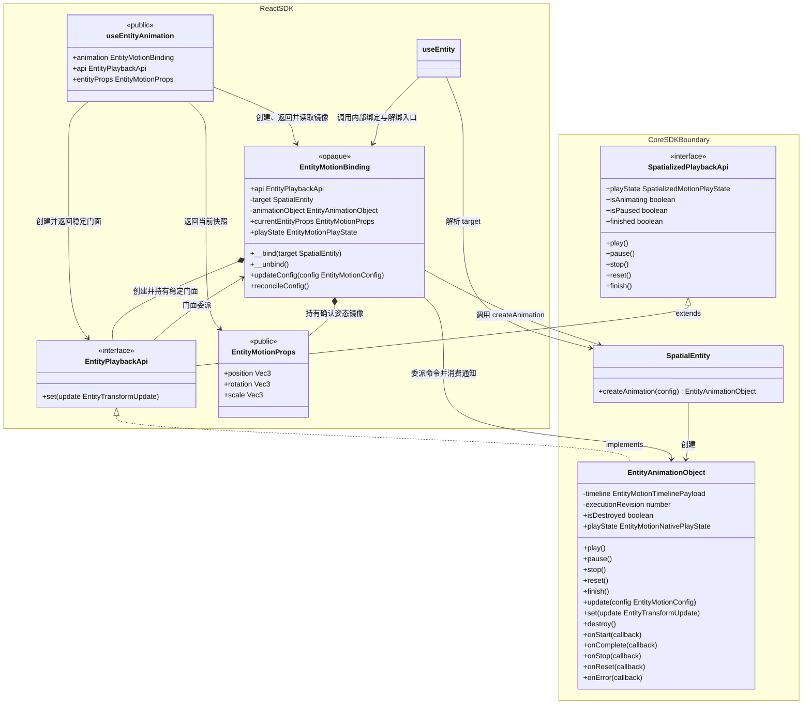
```mermaid
classDiagram
    namespace ReactSDK {
        class useEntityAnimation {
            <<public>>
            +animation EntityMotionBinding
            +api EntityPlaybackApi
            +entityProps EntityMotionProps
        }
        class EntityPlaybackApi {
            <<interface>>
            <<public>>
            +set(update EntityTransformUpdate)
        }
        class EntityMotionBinding {
            <<opaque>>
            +api EntityPlaybackApi
            -target SpatialEntity
            -animationObject EntityAnimationObject
            +currentEntityProps EntityMotionProps
            +playState EntityMotionPlayState
            +__bind(target SpatialEntity)
            +__unbind()
            +updateConfig(config EntityMotionConfig)
            +reconcileConfig()
        }
        class EntityMotionProps {
            <<public>>
            +position Vec3
            +rotation Vec3
            +scale Vec3
        }
        class useEntity
    }
    namespace CoreSDKBoundary {
        class SpatializedPlaybackApi {
            <<interface>>
            +play()
            +pause()
            +stop()
            +reset()
            +finish()
            +playState SpatializedMotionPlayState
            +isAnimating boolean
            +isPaused boolean
            +finished boolean
        }
        class SpatialEntity {
            +createAnimation(config) EntityAnimationObject
        }
        class EntityAnimationObject {
            -timeline EntityMotionTimelinePayload
            -executionRevision number
            +isDestroyed boolean
            +playState EntityMotionNativePlayState
            +play()
            +pause()
            +stop()
            +reset()
            +finish()
            +update(config EntityMotionConfig)
            +set(update EntityTransformUpdate)
            +destroy()
            +onStart(callback)
            +onComplete(callback)
            +onStop(callback)
            +onReset(callback)
            +onError(callback)
        }
    }
    useEntityAnimation --> EntityMotionBinding : 创建、返回并读取镜像
    useEntityAnimation --> EntityPlaybackApi : 创建并返回稳定门面
    useEntityAnimation --> EntityMotionProps : 返回当前快照
    EntityMotionBinding *-- EntityPlaybackApi : 创建并持有稳定门面
    EntityMotionBinding *-- EntityMotionProps : 持有确认姿态镜像
    useEntity --> EntityMotionBinding : 调用内部绑定与解绑入口
    useEntity --> SpatialEntity : 解析 target
    SpatializedPlaybackApi <|-- EntityPlaybackApi : extends
    EntityPlaybackApi <|.. EntityAnimationObject : implements
    EntityPlaybackApi --> EntityMotionBinding : 门面委派
    EntityMotionBinding --> SpatialEntity : 调用 createAnimation
    EntityMotionBinding --> EntityAnimationObject : 委派命令并消费通知
    SpatialEntity --> EntityAnimationObject : 创建
```

#### 状态事件映射

Core `EntityAnimationObject` 直接消费同一种 `EntityMotionStateChangedMsg`:`playState` 更新状态,可选的 `callbackAction` 与完整 `values` 成对触发 callback 和 `entityProps` 更新。

| 场景 | `playState` | `callbackAction` / callback |
|---|---|---|
| fresh play | `running` | `start` / `onStart` |
| paused 后恢复 | `running` | — |
| pause | `paused` | — |
| 自然完成或 `finish()` | `finished` | `complete` / `onComplete` |
| stop | `idle` | `stop` / `onStop` |
| reset | `idle` | `reset` / `onReset` |

`values` 包含完整的 `position`、`rotation`、`scale`。`set` 从 `SetEntityAnimationResult.values` 更新 `entityProps`;错误由 `EntityAnimationErrorMsg` 触发 `onError`。

### 5.2 Core SDK

- **目标创建入口:** `SpatialEntity.createAnimation(config)` 使用自身 id,执行 Entity 专属归一化与校验,发送 `CreateEntityAnimation` 并返回 `EntityAnimationObject`。普通 `SpatializedElement.createAnimation(config)` 仍返回 `AnimationObject`。
- **播放接口:** 现有 `SpatializedPlaybackApi` 保持通用播放方法与状态,不包含 `set`;`EntityPlaybackApi extends SpatializedPlaybackApi`,只增加 `set(EntityTransformUpdate)`。
- **动画对象:** `AnimationObject` 和 `EntityAnimationObject` 分别实现对应播放接口,两者没有继承关系。`EntityAnimationObject` 使用 `SpatialObject.id`,保存已提交的配置、规范时间轴和执行版本,并提供 `update(config)` 与 `onXXX` 调试监听方法。`finish` 和自然完成都会触发 `onComplete`。
- **类型与函数:** Core 定义物体运动类型、`EntityTransformUpdate`、`EntityMotionProps`、属性白名单、归一化函数、校验函数以及内部规范时间轴。

`EntityAnimationObject` 的 `onXXX` 方法只注册观察回调,不发送控制或更新命令,也不改变动画配置。参数与 React callback 保持一致:

```text
onStart(listener: (values: EntityMotionProps) => void)
onComplete(listener: (values: EntityMotionProps) => void)
onStop(listener: (values: EntityMotionProps) => void)
onReset(listener: (values: EntityMotionProps) => void)
onError(listener: (error: EntityPlaybackError) => void)
```

状态事件触发前四类方法,专用错误事件触发 `onError`。`pause` 只更新播放状态,因此不增加 `onPause`。

#### 类图

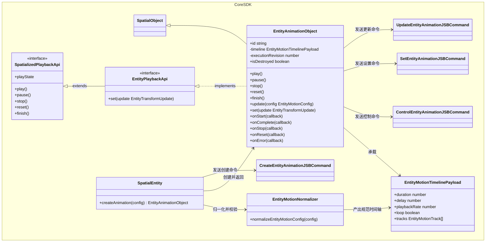
```mermaid
classDiagram
    namespace CoreSDK {
        class SpatialObject
        class SpatializedPlaybackApi {
            <<interface>>
            +play()
            +pause()
            +stop()
            +reset()
            +finish()
            +playState
        }
        class EntityPlaybackApi {
            <<interface>>
            +set(update EntityTransformUpdate)
        }
        class SpatialEntity {
            +createAnimation(config) EntityAnimationObject
        }
        class EntityMotionNormalizer {
            +normalizeEntityMotionConfig(config)
        }
        class EntityMotionTimelinePayload {
            +duration number
            +delay number
            +playbackRate number
            +loop boolean
            +tracks EntityMotionTrack[]
        }
        class EntityAnimationObject {
            +id string
            -timeline EntityMotionTimelinePayload
            -executionRevision number
            +isDestroyed boolean
            +play()
            +pause()
            +stop()
            +reset()
            +finish()
            +update(config EntityMotionConfig)
            +set(update EntityTransformUpdate)
            +onStart(callback)
            +onComplete(callback)
            +onStop(callback)
            +onReset(callback)
            +onError(callback)
        }
        class CreateEntityAnimationJSBCommand
        class ControlEntityAnimationJSBCommand
        class SetEntityAnimationJSBCommand
        class UpdateEntityAnimationJSBCommand
    }
    SpatializedPlaybackApi <|-- EntityPlaybackApi : extends
    SpatialObject <|-- EntityAnimationObject
    EntityPlaybackApi <|.. EntityAnimationObject : implements
    SpatialEntity --> EntityMotionNormalizer : 归一化并校验
    EntityMotionNormalizer --> EntityMotionTimelinePayload : 产出规范时间轴
    SpatialEntity --> EntityAnimationObject : 创建并返回
    EntityAnimationObject --> EntityMotionTimelinePayload : 承载
    SpatialEntity --> CreateEntityAnimationJSBCommand : 发送创建命令
    EntityAnimationObject --> ControlEntityAnimationJSBCommand : 发送控制命令
    EntityAnimationObject --> SetEntityAnimationJSBCommand : 发送设置命令
    EntityAnimationObject --> UpdateEntityAnimationJSBCommand : 发送更新命令
```

#### JSB 协议

Core 定义 Entity 专属的创建命令、原地更新命令、控制命令、设置命令、状态事件和错误事件 wire contract。这些协议不依赖 Spatialized Element 动画协议。

##### 创建动画命令

创建请求的 `id` 直接取目标 Entity 的 `SpatialObject.id`。创建成功回执也只返回 `id`,该值是新建动画对象的 `SpatialObject.id`:

```text
CreateEntityAnimation {
  id: string
  timeline: EntityMotionTimelinePayload
}

CreateEntityAnimationResult {
  id: string
}
```

##### 原地更新动画命令

```text
UpdateEntityAnimation {
  id: string
  timeline: EntityMotionTimelinePayload
}

UpdateEntityAnimationResult {
  values: EntityMotionProps
  revision: number
}
```

成功回执表示候选执行定义已在同一个 Native 对象上提交。Core 此时才替换当前 config 与 timeline 快照,并使用 `values` 更新 `entityProps`。失败回执不提交候选定义。

##### 控制动画命令

```text
ControlEntityAnimation {
  id: string
  type: 'play' | 'pause' | 'stop' | 'reset' | 'finish' | 'destroy'
}
```

控制成功回执使用空 payload 确认当前命令处理完成。Core 提交每条命令时不等待此前命令的回执,公开 `playState` 由 `EntityMotionStateChangedMsg` 更新。

##### 设置动画姿态命令

```text
SetEntityAnimation {
  id: string
  update: EntityTransformUpdate
}

SetEntityAnimationResult {
  values: EntityMotionProps
}
```

`api.set` 使用独立设置命令,接受深度稀疏的 `EntityTransformUpdate`。Native 合并更新并修改 Entity,再通过 `SetEntityAnimationResult` 返回 Entity 当前的完整 transform;Core 使用 `values` 更新 `entityProps`,不发送状态事件。绑定前或原生动画对象创建前的调用归类为空操作并打印控制台警告,也不会暂存为后续命令。JSB 不提供 `resume`;paused 后调用 `play` 时由 Native 动画对象内部恢复未更新的当前 controller,或在 paused update 后启动保存的新定义。

```text
type EntityMotionProps = {
  position?: Vec3
  rotation?: Vec3
  scale?: Vec3
}

type EntityTransformUpdate = {
  position?: Partial<Vec3>
  rotation?: Partial<Vec3>
  scale?: Partial<Vec3>
}
```

`EntityTransformUpdate` 表示 `EntityMotionProps` 的任意深度子集。原生层按轴合并更新;播放状态事件中的确认值和 `SetEntityAnimationResult.values` 都携带完整的 `position`、`rotation`、`scale`,且每项都是完整的 `Vec3`。

##### 状态变化事件

```text
type EntityMotionNativePlayState = 'idle' | 'running' | 'paused' | 'finished'
type EntityMotionPlayState = 'queued' | EntityMotionNativePlayState

interface EntityMotionStateChangedDetail {
  id: string
  revision: number
  playState: EntityMotionNativePlayState
  callbackAction?: 'start' | 'complete' | 'stop' | 'reset'
  values?: EntityMotionProps
}

interface EntityMotionStateChangedMsg {
  type: 'spatialanimationstatechanged'
  detail: EntityMotionStateChangedDetail
}
```

每次播放状态确认或 lifecycle callback 都使用同一个 `EntityMotionStateChangedMsg`。`revision` 和 `playState` 始终存在;触发用户 callback 的消息同时携带 `callbackAction` 与完整 `values`。显式 `finish()` 和自然完成都使用 `callbackAction: 'complete'`。暂停和恢复通过只含 `id`、`revision` 与 `playState` 的消息更新状态。

`queued` 是命令等待原生动画对象创建期间的 React 绑定状态。原生层创建回执确认初始 `idle` 状态。创建失败时,React 绑定把公开状态收敛为 `idle` 并终止当前绑定生命周期。后续原生层状态消息确认 `idle`、`running`、`paused` 或 `finished`。正常绑定生命周期中的创建回执与原生层状态消息是公开播放状态的唯一数据源。公开 `finished` 标记由 `playState === 'finished'` 派生。

##### Entity 错误事件与错误类型

状态事件不承载错误。原生命令接受后发生的异步错误通过 Entity 专用事件回传:

```text
interface EntityAnimationErrorDetail {
  id: string
  error: EntityPlaybackError
}

interface EntityAnimationErrorMsg {
  type: 'entityanimationerror'
  detail: EntityAnimationErrorDetail
}
```

```text
type EntityPlaybackError = {
  code:
    | 'TARGET_NOT_FOUND'
    | 'UNSUPPORTED_TARGET'
    | 'ANIMATION_NOT_FOUND'
    | 'INVALID_TIMELINE'
    | 'COMPILATION_FAILED'
    | 'INVALID_CONTROL_STATE'
    | 'INVALID_SET_VALUES'
  reason: string
}
```

错误出口由发现错误的阶段决定:

- Core 对公开 config 和方法参数执行的同步校验失败直接抛出内置 `Error`,不触发 `onError`。
- JSB 命令执行失败通过当前命令回执返回。Core 将回执转换为一次 `EntityPlaybackError`,再触发 `onError`。
- 命令成功回执后发生的原生异步失败只通过一次 `entityanimationerror` 回传。Core `EntityAnimationObject` 消费该事件并触发 `onError`。
- 同一失败只选择一个出口,状态事件不携带错误,从而避免重复触发 `onError`。
- 动画对象初次创建失败会终止当前绑定生命周期。配置 update 失败保持旧执行和当前绑定生命周期;其它异步播放错误保持既有状态语义。
- 动画活跃期间调用 `api.set` 属于预期状态拒绝,保持 warning + no-op,不触发错误事件或 `onError`。

用户按错误码处理:

| 错误码 | 建议处理 |
|---|---|
| `TARGET_NOT_FOUND` | 检查目标 Entity 是否已经创建且仍处于有效生命周期,再重新绑定动画。 |
| `UNSUPPORTED_TARGET` | 检查传入 `id` 是否属于支持动画的 Entity,并在创建前执行能力检测。 |
| `ANIMATION_NOT_FOUND` | 停止使用已经销毁或失效的动画对象,重新绑定并取得新的对象 `id`。 |
| `INVALID_TIMELINE` | 修正动画配置中的时间、属性、关键帧或取值。公开配置通常由 Core 同步拦截。 |
| `COMPILATION_FAILED` | 简化或调整 Native 无法编译的关键帧组合,并记录 `reason` 用于问题定位。 |
| `INVALID_CONTROL_STATE` | 等待当前状态允许该操作,或先停止动画。活跃期间的 `set` 由 SDK 转换为 warning + no-op。 |
| `INVALID_SET_VALUES` | 修正 `EntityTransformUpdate`,确保至少包含一个合法的 transform 标量。 |

#### 类型、归一化与校验

归一化由公共逻辑层的 `normalizeEntityMotionConfig` 完成,把三种对外写法统一成同一套内部时间轴数据。

**输入:** 对外的三种书写形态,折叠规则为:

- **顶层 `from` / `to`** 等价于 `timeline.from` / `timeline.to`,展开成起止两帧。
- **`timeline.from` / `timeline.to`** 即 `0%` / `100%` 帧,可与百分比 key 混写。
- **百分比关键帧** `0% → 50% → 100%` 按 `at = 百分比 × duration` 折算成秒。

完整归一化规则包括 `timeline` 优先、边界必填和 `duration` 默认值,详见本节后文。

**输出:** 平台无关的 `EntityMotionTimelinePayload`,结构如下:

```text
type EntityMotionTimelinePayload = {
  duration: number
  delay?: number
  playbackRate?: number
  loop?: boolean | { reverse?: boolean }
  tracks: EntityMotionTrack[]
}

type EntityMotionTrack = {
  property: EntityMotionProperty
  keyframes: EntityMotionKeyframe[]
  timingFunction?: TimingFunction
}

type EntityMotionProperty =
  | 'position.x' | 'position.y' | 'position.z'
  | 'rotation.x' | 'rotation.y' | 'rotation.z'
  | 'scale.x'    | 'scale.y'    | 'scale.z'

type EntityMotionKeyframe = {
  at: number
  value: number
  timingFunction?: TimingFunction
}
```

**v1 缓动编码约定:** 公开配置中的 `timingFunction` 始终表示全局时间段的缓动,当前 payload 把它存放在 track 和 keyframe 中。Core 把顶层默认值复制到每条 track,并把时间轴节点上的覆盖值复制到该节点产生的所有属性 keyframe。同一个 `at` 上的缓动值统一使用唯一值。每个公开时间轴节点至少包含一个受支持的姿态标量,归一化过程据此保留该节点。包含某个全局节点的任意 track 都可以携带该节点的共享缓动值。track/keyframe 中的字段也为未来按属性设置缓动保留结构空间;该能力将同步引入对应的公开配置语义和带版本的协议语义。

示例:

```text
{
  duration: 1.2,
  tracks: [
    {
      property: 'position.y',
      timingFunction: 'linear',
      keyframes: [
        { at: 0, value: 0 },
        { at: 0.6, value: 0.25 },
        { at: 1.2, value: 0 },
      ],
    },
    {
      property: 'rotation.y',
      timingFunction: 'linear',
      keyframes: [
        { at: 0, value: 0 },
        { at: 1.2, value: 180 },
      ],
    },
  ],
}
```

归一化与校验规则:

- 顶层 `from` / `to` 与 `timeline.from` / `timeline.to` 折叠到同一套内部轨道。
- `timeline.from` / `timeline.to` 分别表示 `0%` / `100%`,并可与百分比关键帧混写;同一边界重复声明时显式报错。
- `timeline` 与顶层 `from` / `to` 同时出现时,`timeline` 作为唯一生效输入,开发模式打印重复声明警告。
- 纯顶层 `from` / `to` 形态的 `duration` 默认 0.3 秒。
- 每个动画同时提供起始和结束边界;边界帧内部字段可保持稀疏,缺帧标量在 Native 编译时回落到 baseline。

#### 能力检测

文档和示例统一使用顶层能力检测:

```text
supports('useEntityAnimation')
```

### 5.3 Native

- **命令入口:** `SpatialScene` 分别承接 `CreateEntityAnimation`、`UpdateEntityAnimation`、`ControlEntityAnimation` 和 `SetEntityAnimation`。四条命令都使用 `id` 查询对应的 `SpatialObject`。
- **执行子系统:** 创建命令解析到目标 Entity 后调用 `entity.createAnimation(config)`。动画对象复用 `SpatialScene.spatialObjects` 与 `SpatialObject` 生命周期,单对象控制和 fresh/resume 判断由 `EntityMotionAnimationObject` 内聚。
- **确认值回传:** 播放生命周期节点通过状态事件回传确认值;`update` 和 `set` 分别通过 `UpdateEntityAnimationResult` 与 `SetEntityAnimationResult` 回传确认值。
- **错误回传:** 命令成功回执后发生的异步错误通过 `entityanimationerror` 回传,不进入状态事件。

#### 类图

子系统以可读性和可测试性为拆分标准,文件组织可独立于元素路径。以下是推荐职责边界。现有 `SpatializedElementAnimationObject` 与新增 `EntityMotionAnimationObject` 都继承 `SpatialObject`,复用同一生命周期,两者是兄弟类型,没有直接继承关系;当前不预先抽取 Native 公共播放接口。

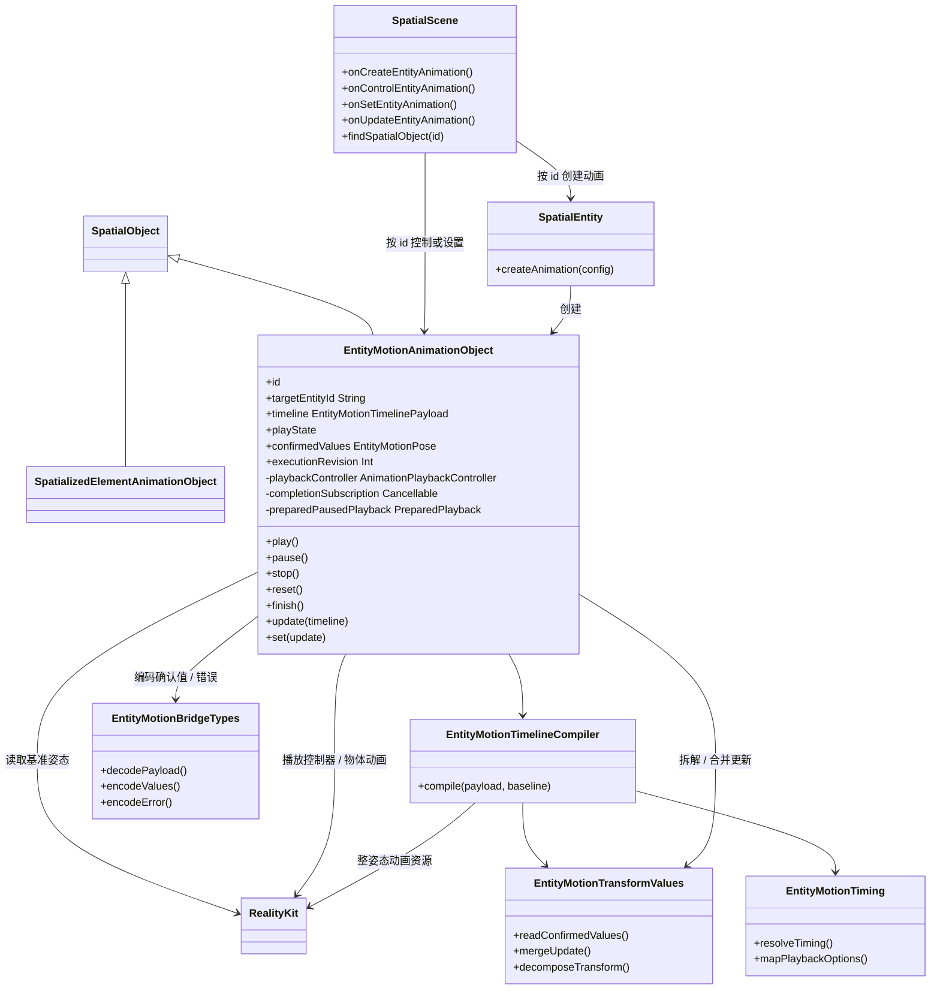
```mermaid
classDiagram
    class SpatialObject
    class SpatializedElementAnimationObject
    class SpatialScene {
        +onCreateEntityAnimation()
        +onControlEntityAnimation()
        +onSetEntityAnimation()
        +onUpdateEntityAnimation()
        +findSpatialObject(id)
    }
    class SpatialEntity {
        +createAnimation(config)
    }
    class EntityMotionAnimationObject {
        +id
        +targetEntityId String
        +timeline EntityMotionTimelinePayload
        +playState
        +confirmedValues EntityMotionPose
        +executionRevision Int
        -playbackController AnimationPlaybackController
        -completionSubscription Cancellable
        -preparedPausedPlayback PreparedPlayback
        +play()
        +pause()
        +stop()
        +reset()
        +finish()
        +update(timeline)
        +set(update)
    }
    class EntityMotionTimelineCompiler {
        +compile(payload, baseline)
    }
    class EntityMotionBridgeTypes {
        +decodePayload()
        +encodeValues()
        +encodeError()
    }
    class EntityMotionTiming {
        +resolveTiming()
        +mapPlaybackOptions()
    }
    class EntityMotionTransformValues {
        +readConfirmedValues()
        +mergeUpdate()
        +decomposeTransform()
    }
    class RealityKit

    SpatialObject <|-- SpatializedElementAnimationObject
    SpatialObject <|-- EntityMotionAnimationObject
    SpatialScene --> SpatialEntity : 按 id 创建动画
    SpatialScene --> EntityMotionAnimationObject : 按 id 控制或设置
    SpatialEntity --> EntityMotionAnimationObject : 创建
    EntityMotionAnimationObject --> EntityMotionTimelineCompiler
    EntityMotionTimelineCompiler --> EntityMotionTiming
    EntityMotionTimelineCompiler --> EntityMotionTransformValues
    EntityMotionAnimationObject --> RealityKit : 读取基准姿态
    EntityMotionAnimationObject --> EntityMotionTransformValues : 拆解 / 合并更新
    EntityMotionAnimationObject --> EntityMotionBridgeTypes : 编码确认值 / 错误
    EntityMotionAnimationObject --> RealityKit : 播放控制器 / 物体动画
    EntityMotionTimelineCompiler --> RealityKit : 整姿态动画资源
```

**各类职责:**

- **目标物体(`SpatialEntity`):** `createAnimation(config)` 兜底校验创建 payload,构造保存目标与规范时间轴的动画对象并返回给 `SpatialScene` 注册。Entity 不维护动画 registry 或播放状态。
- **物体动画对象(`EntityMotionAnimationObject`):** 保存目标 id 与弱目标引用、规范时间轴、确认姿态、执行版本、已编译时间轴、基准姿态、播放控制器、完成订阅和暂停时准备好的执行。`update()` 准备并提交新定义,根据当前状态重新定向或保存暂停定义。`play()` 恢复未更新的暂停执行,或从暂停更新保存的姿态启动新执行。控制器身份、执行版本和完成门禁共同拒绝旧完成事件与重复完成事件。对象通过 `emitStateChanged()` 和 `emitError()` 发送事件。`update` 与 `set` 返回完整确认姿态。
- **时间轴编译器(`EntityMotionTimelineCompiler`):** 在每次 fresh play 时接受规范时间轴和本轮 baseline,将其切片编译为一条串联的整姿态 RealityKit 动画资源。
- **桥接类型(`EntityMotionBridgeTypes`):** 承载原生桥接的编解码结构,包括时间轴数据、控制值、确认值和错误。若命令类型已够用,这部分可作为若干结构体分散存在。
- **播放参数映射(`EntityMotionTiming`):** 把已经按全局时间段解析完成的唯一缓动函数映射到 RealityKit,在运动前安排一次全局延迟,并把循环和播放速率应用于运动序列;四种内建缓动函数全部直接映射。
- **姿态拆解与合并(`EntityMotionTransformValues`):** 负责从物体姿态拆解确认值、把 `api.set` 的稀疏更新合并到已提交基准上,以及欧拉角度数与 RealityKit 旋转表示之间的换算。

#### JSB 命令处理

`SpatialScene` 按创建请求的 `id` 查询空间对象注册表:

```text
是物体   -> entity.createAnimation(config)
其它     -> UNSUPPORTED_TARGET
```

处理规则:

- 注册表缺少目标 `id` 时,创建以 `TARGET_NOT_FOUND` 失败。
- 创建成功后,`SpatialScene` 把动画对象作为 `SpatialObject` 加入全局 `spatialObjects`;成功回执返回该对象的 `id` 并确认其初始状态为 `idle`。
- 控制命令通过 `id` 在全局 `spatialObjects` 查找 `EntityMotionAnimationObject`。设置命令使用同一套查找规则,并单独调用 `set(update)`。
- 同步命令错误通过 JSB reply 回传;仅命令接受后发生的异步播放错误通过一次 `entityanimationerror` 回传。
- 播放状态发生变化时,原生层先发送携带最新 `playState` 的状态消息,再返回控制命令成功回执。
- fresh play 编译失败时,控制命令失败,动画保持非活跃。

创建成功回执只携带动画对象的 `id`,确认对象已经创建并处于 `idle`;失败回执确认对象创建结束,绑定对象据此收敛到 `idle`、清理待执行命令并分发分类错误。

Native 在非活跃时接受并提交 `api.set`;活跃时保持姿态不变并通过 `SetEntityAnimation` 回执返回 `INVALID_CONTROL_STATE`,Core 将该结果转为 warning + no-op,不触发 `onError`。

#### 时间轴编译

编译在每次 fresh play 时由 `EntityMotionAnimationObject.play()` 触发:命令被接受后、进入 delay / running 前读取当前姿态作为本轮 baseline,再把规范时间轴切成若干携带完整姿态的节点并逐段编译,最终产出本轮播放资源。创建动画只校验并保存规范时间轴。未发生配置更新的 paused 状态下,`play()` 直接恢复当前控制器,不读取 baseline、不编译也不产生新的 `start`;paused update 后,`play()` 从保存 pose 启动新执行并产生新的 `start`;单次播放内部的 loop 复用本轮资源。

##### 输入:内部时间轴

编译的输入就是归一化的产物 `EntityMotionTimelinePayload`(结构见上节),且目标已解析为物体。

##### 编译流程

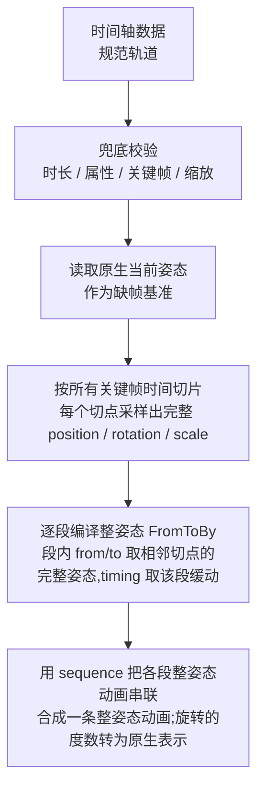
```mermaid
flowchart TB
    Payload["时间轴数据<br/>规范轨道"]
    Validate["兜底校验<br/>时长 / 属性 / 关键帧 / 缩放"]
    Snapshot["读取原生当前姿态<br/>作为缺帧基准"]
    Slice["按所有关键帧时间切片<br/>每个切点采样出完整 position / rotation / scale"]
    Segment["逐段编译整姿态 FromToBy<br/>段内 from/to 取相邻切点的完整姿态,timing 取该段缓动"]
    Seq["用 sequence 把各段整姿态动画串联<br/>合成一条整姿态动画;旋转的度数转为原生表示"]

    Payload --> Validate
    Validate --> Snapshot
    Snapshot --> Slice
    Slice --> Segment
    Segment --> Seq
```

##### 时间轴切片为整姿态节点并串联

整条时间轴只对应一个绑定目标——整个 `transform`。把所有通道的关键帧时间取并集作为切点,相邻切点之间构成一段;每个切点都采样出完整的 `position` / `rotation` / `scale`,于是每段就是一次“整姿态到整姿态”的过渡。

**逐段——用 `FromToByAnimation<Transform>` 表达。** 每段的 `from` / `to` 取相邻两个切点的完整姿态,`duration` 取该段时长,`timing` 取 Core 已为该全局时间段解析出的唯一缓动函数,`bindTarget` 固定为 `.transform`。visionOS 的动画绑定粒度是整个 `.transform`,这也是选择整姿态切片的根本原因。

**串联——用 `sequence` 首尾相接。** 各段整姿态动画按时间顺序用 `AnimationResource.sequence(with:)` 串成一条运动序列,让每段各自带缓动、又连续播放。只有起止两帧的时间轴退化为单个 `FromToByAnimation<Transform>`。每次全新执行在该运动序列之前安排一次全局 `delay`。`speed` 和 `loop` 仅作用于运动序列,因此 speed 不缩放延迟,loop 也不重复延迟。

以一个例子说明(`position.y` 有 3 帧、`rotation.y` 只有起止 2 帧,切点并集为 `0 / 0.6s / 1.2s`,共 2 段):

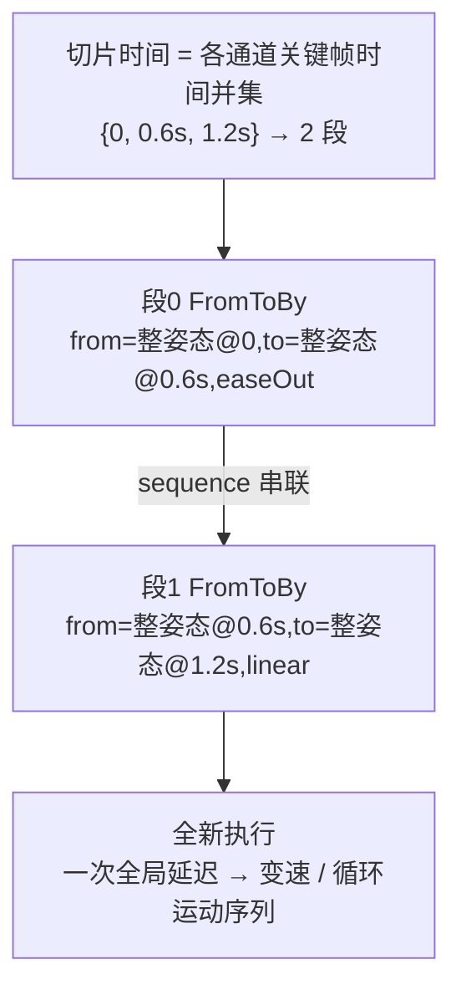
```mermaid
flowchart TB
    Slice["切片时间 = 各通道关键帧时间并集<br/>{0, 0.6s, 1.2s} → 2 段"]
    S0["段0 FromToBy<br/>from=整姿态@0,to=整姿态@0.6s,easeOut"]
    S1["段1 FromToBy<br/>from=整姿态@0.6s,to=整姿态@1.2s,linear"]
    Clip["全新执行<br/>一次全局延迟 → 变速 / 循环运动序列"]

    Slice --> S0
    S0 -->|sequence 串联| S1
    S1 --> Clip
```

##### 输出:可控播放对象与代码演示

编译的最终输出是可控播放对象。沿用上文示例(2 段整姿态),下面分别用 visionOS 与 picoOS 演示:每段编成一个整姿态 `FromToBy`,用 `sequence` 串成一条动画资源,最后交给引擎播放,拿到可暂停 / 恢复 / 停止 / 变速的播放控制器——即“可控播放对象”。两端都绑定整个 transform,写法对齐。

visionOS 平台能力按 `tasks.zh.md` 第 8 节验收任务留痕验证。picoOS 验收已迁出当前变更。以下代码只展示资源构造和 controller 形态。

visionOS(RealityKit / Swift):

```swift
import RealityKit

// 沿用示例;每个切点携带完整 position / rotation / scale,只有 y 与绕 y 旋转在变
let base = entity.transform

// 采样某切点的完整姿态(x / z / scale 冻结在基准,只有 pos.y 与 rot.y 在动)
func pose(y: Float, deg: Float) -> Transform {
    var t = base
    t.translation = SIMD3(base.translation.x, y, base.translation.z)
    t.rotation = simd_quatf(angle: deg * .pi / 180, axis: SIMD3(0, 1, 0))
    return t
}

// 段0:整姿态从 t=0 到 t=0.6s
let seg0 = FromToByAnimation<Transform>(
    name: "seg0",
    from: pose(y: 0,    deg: 0),
    to:   pose(y: 0.25, deg: 90),
    duration: 0.6,
    timing: .easeOut,                 // 段0 自己的缓动
    bindTarget: .transform            // 只能绑定整个 transform
)
// 段1:整姿态从 t=0.6s 到 t=1.2s
let seg1 = FromToByAnimation<Transform>(
    name: "seg1",
    from: pose(y: 0.25, deg: 90),
    to:   pose(y: 0,    deg: 180),
    duration: 0.6,
    timing: .linear,                  // 段1 与段0 分别采用各自缓动
    bindTarget: .transform
)

// 各段整姿态动画按时间顺序用 sequence 串成一条动画
let clip = try AnimationResource.sequence(with: [
    try AnimationResource.generate(with: seg0),
    try AnimationResource.generate(with: seg1),
])

// 得到可控播放对象:控制器支持暂停 / 恢复 / 停止 / 变速
let controller = entity.playAnimation(clip, transitionDuration: 0, startsPaused: true)
controller.resume()          // Native object 内部开始 / 恢复;不是 JSB resume 命令
// controller.pause()        // pause
// controller.stop()         // stop
// controller.speed = 2.0    // 顶层播放速率作用在整条串联动画
```

picoOS(Pico Spatial SDK / Kotlin):

```kotlin
import com.pico.spatial.core.ecs.Entity
import com.pico.spatial.core.ecs.TransformComponent
import com.pico.spatial.core.ecs.animation.AnimationBindTarget
import com.pico.spatial.core.ecs.animation.AnimationPlaybackController
import com.pico.spatial.core.ecs.animation.EaseType
import com.pico.spatial.core.ecs.animation.RepeatMode
import com.pico.spatial.core.ecs.animation.TweenAnimation
import com.pico.spatial.core.ecs.resource.AnimationResource
import com.pico.spatial.core.math.Quat
import com.pico.spatial.core.math.Transform
import com.pico.spatial.core.math.Vector3

fun playSequencedTransformAnimation(entity: Entity): AnimationPlaybackController {
    val transformComponent = entity.components.get(TransformComponent::class.java)
    val base = transformComponent?.let {
        Transform(it.position, it.quaternion, it.scaleVector)
    } ?: Transform()

    // 采样切点的完整姿态,x / z / scale 保持基准值。
    fun pose(y: Float, deg: Float): Transform {
        val radians = Math.toRadians(deg.toDouble()).toFloat()
        val q = Quat(Vector3(0f, 1f, 0f), radians)
        return Transform(
            Vector3(base.position.x, y, base.position.z),
            q,
            base.scale,
        )
    }

    val seg0 = TweenAnimation.createTweenAnimation(
        name = "seg0",
        bindTarget = AnimationBindTarget.bindTransform(),
        from = pose(0f, 0f),
        to = pose(0.25f, 90f),
        by = null,
        duration = 0.6f,
        delay = 0f,
        repeatMode = RepeatMode.NONE,
        repeatCount = 0,
        easeType = EaseType.EASE_OUT,
        offset = 0f,
        speed = 1f,
        additive = false,
        trimStart = null,
        trimEnd = null,
        trimDuration = null,
    )

    val seg1 = TweenAnimation.createTweenAnimation(
        name = "seg1",
        bindTarget = AnimationBindTarget.bindTransform(),
        from = pose(0.25f, 90f),
        to = pose(0f, 180f),
        by = null,
        duration = 0.6f,
        delay = 0f,
        repeatMode = RepeatMode.NONE,
        repeatCount = 0,
        easeType = EaseType.LINEAR,
        offset = 0f,
        speed = 1f,
        additive = false,
        trimStart = null,
        trimEnd = null,
        trimDuration = null,
    )

    val clip = AnimationResource.sequence(
        with = listOf(
            AnimationResource.generateWithTweenAnimation(seg0),
            AnimationResource.generateWithTweenAnimation(seg1),
        )
    )

    val controller = entity.playAnimation(clip)
    controller.setSpeed(2f)
    return controller
}

// 使用 controller.pause()、controller.resume() 和 controller.stop() 控制播放。
```

##### 编译规则

1. **属性白名单:** 只接受 `position.*`、`rotation.*`、`scale.*`。`opacity`、材质、组件属性等一律显式失败。
2. **时间范围:** `duration` 必须为正;每个关键帧的 `at` 必须落在 `[0, duration]` 内。
3. **排序与重复:** 每条轨道的关键帧按 `at` 非递减排序;每个属性对应一条唯一轨道。
4. **切片时间取各通道并集:** 把所有通道的关键帧时间取并集作为整条时间轴的切点,相邻切点之间构成一段。例如 `position.y` 在 `0, 0.6, 1.2`、`rotation.y` 在 `0, 1.2`,并集 `0, 0.6, 1.2` 切成 `[0, 0.6]` 与 `[0.6, 1.2]` 两段。
5. **稀疏通道补全:** 编译器在每个切点生成完整姿态。相邻关键帧之间线性插值;首帧晚于零时,从零时刻 baseline 插值到首帧;末帧后沿用末帧值;其余分量全程沿用 baseline。
6. **逐段串联整姿态:** 相邻切点构成一段整姿态 `FromToByAnimation<Transform>`,各段按时间顺序用 `sequence` 串成一条整姿态动画,统一绑定到整个 transform(`bindTarget: .transform`),详见“时间轴切片为整姿态节点并串联”。
7. **旋转:** `rotation.*` 输入是欧拉角度数,编译时转成 RealityKit 所需的旋转表示,由 RealityKit 使用最短路径球面插值处理。某个旋转通道若单帧增量达到或超过 180°、或跨多轴,实际路径可能区别于逐轴直觉;特定的多圈或多轴路径由使用者通过中间关键帧显式定义。
8. **缩放:** `scale.*` 必须非负,非法缩放直接失败。
9. **每段唯一缓动函数:** 公开配置中的 `timingFunction` 属于全局时间轴节点。v1 由 Core 把该全局值复制到现有 track/keyframe 字段,并保证同一个 `at` 上的缓动值统一且唯一;Native 接受这种全局缓动形态。Native 对关键帧时间并集中的每对相邻节点解析一个缓动值,并在构造最终整姿态分段时应用一次。切点值采样使用线性时间插值,最终分段播放应用缓动。缓动函数的取值是封闭枚举 `linear` / `easeIn` / `easeOut` / `easeInOut`,全部直接映射到 RealityKit 内建曲线。
10. **延迟、播放速率和循环:** 每次全新执行只运行一次延迟;播放速率和循环仅作用于运动序列。循环复用本轮资源。
11. **失败显式化:** RealityKit 无法表达某个段时,fresh play 的控制命令必须失败,动画保持非活跃。

上述 visionOS 能力组合以 `tasks.zh.md` 第 8 节验收记录为准;picoOS 验收已迁出当前变更。本设计不引入 SDK 自行调度分段队列的降级方案。验收记录包含平台版本、SDK 版本、fixtures、执行命令和结果。

#### 姿态拆解与确认值回传

原生回传给 React 的值必须是物体 API 的形态:

```text
type EntityMotionProps = {
  position?: Vec3
  rotation?: Vec3
  scale?: Vec3
}
```

拆解规则:

- `start`、`stop`、`reset`、`finish`、自然完成和成功 `set` 先完成对应姿态提交,再重新读取 Entity 当前的完整 transform;该读取结果是状态消息 `values`、callback values 和 `SetEntityAnimationResult.values` 的统一来源。
- `position` 来自原生姿态的平移部分。
- `scale` 来自原生姿态的缩放部分。
- `rotation` 使用角度制欧拉角和 Entity 相对父节点的局部右手坐标系，其中 +X 向右、+Y 向上、+Z 朝向观察者。旋转按 ZYX intrinsic 顺序组合，等价于 XYZ extrinsic，矩阵顺序为 `Rz × Ry × Rx`。原生层确认的旋转通过旋转矩阵拆解，`y` 位于 `[-90°, 90°]`，`x` 和 `z` 位于 `(-180°, 180°]`；gimbal lock 时固定 `z = 0°`，并从矩阵计算 `x`。等价 quaternion 因此产生相同的欧拉角结果。`api.set` 的稀疏 rotation update 先合并到这份规范化完整欧拉角基准，再重新组合姿态。
- 拆解结果始终包含完整的已提交变换,其范围独立于动画配置和 `api.set` 写入字段。
- 回调值和 `entityProps` 都采用 `EntityMotionProps` 形态;每个已确认值都包含完整的 `position`、`rotation`、`scale`,且每项都是完整的 `Vec3`。`api.set(update)` 接受深度稀疏的 `EntityTransformUpdate`。例如 `set({ position: { y: 0.3 } })` 按轴合并后,确认结果包含完整的位置、旋转和缩放。

#### Native 内部时序

**创建时序:**

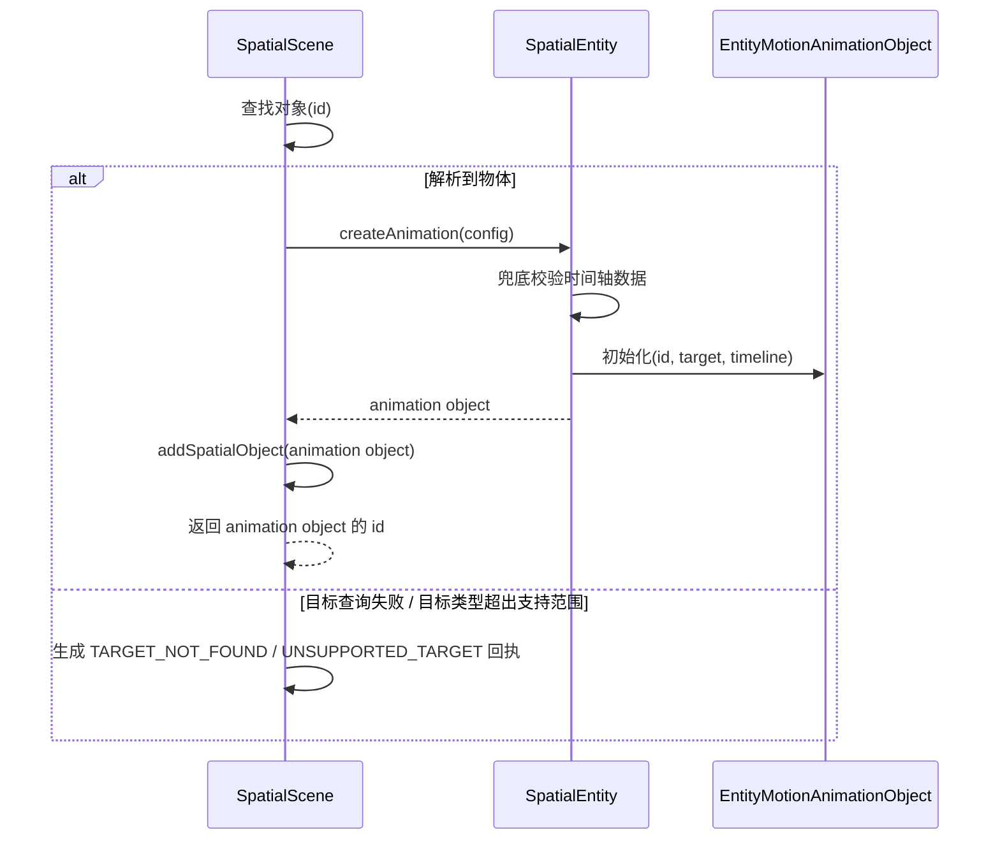
```mermaid
sequenceDiagram
    participant Scene as SpatialScene
    participant Entity as SpatialEntity
    participant Obj as EntityMotionAnimationObject

    Scene->>Scene: 查找对象(id)
    alt 解析到物体
        Scene->>Entity: createAnimation(config)
        Entity->>Entity: 兜底校验时间轴数据
        Entity->>Obj: 初始化(id, target, timeline)
        Entity-->>Scene: animation object
        Scene->>Scene: addSpatialObject(animation object)
        Scene-->>Scene: 返回 animation object 的 id
    else 目标查询失败 / 目标类型超出支持范围
        Scene->>Scene: 生成 TARGET_NOT_FOUND / UNSUPPORTED_TARGET 回执
    end
```

**播放与完成时序:**

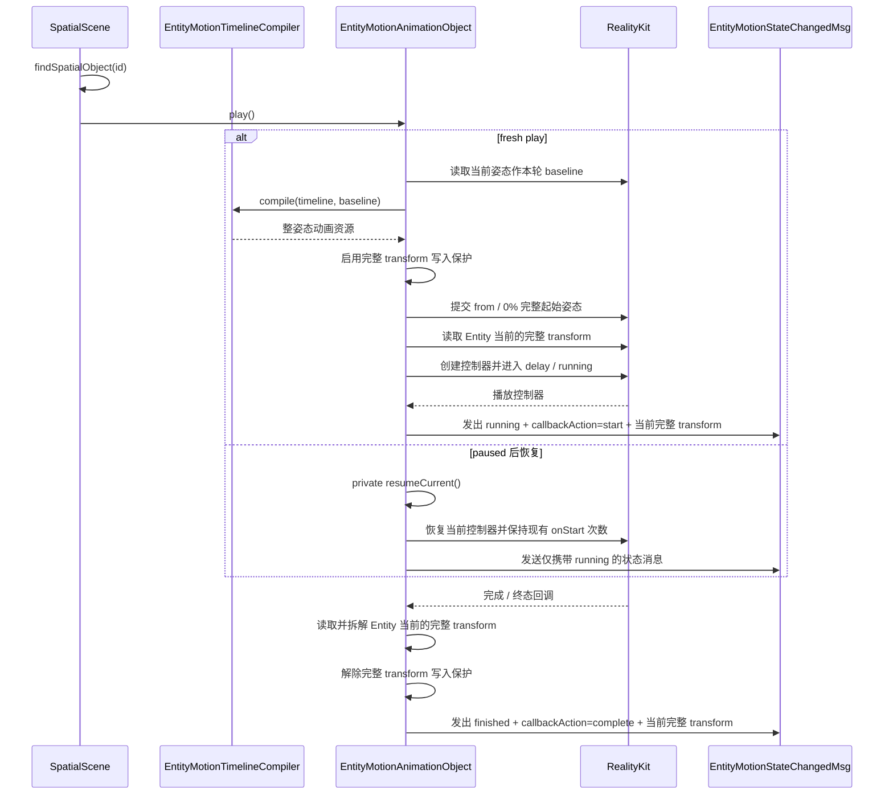
```mermaid
sequenceDiagram
    participant Scene as SpatialScene
    participant Compiler as EntityMotionTimelineCompiler
    participant Obj as EntityMotionAnimationObject
    participant RK as RealityKit
    participant Event as EntityMotionStateChangedMsg

    Scene->>Scene: findSpatialObject(id)
    Scene->>Obj: play()
    alt fresh play
        Obj->>RK: 读取当前姿态作本轮 baseline
        Obj->>Compiler: compile(timeline, baseline)
        Compiler-->>Obj: 整姿态动画资源
        Obj->>Obj: 启用完整 transform 写入保护
        Obj->>RK: 提交 from / 0% 完整起始姿态
        Obj->>RK: 读取 Entity 当前的完整 transform
        Obj->>RK: 创建控制器并进入 delay / running
        RK-->>Obj: 播放控制器
        Obj->>Event: 发出 running + callbackAction=start + 当前完整 transform
    else paused 后恢复
        Obj->>Obj: private resumeCurrent()
        Obj->>RK: 恢复当前控制器并保持现有 onStart 次数
        Obj->>Event: 发送仅携带 running 的状态消息
    end
    RK-->>Obj: 完成 / 终态回调
    Obj->>Obj: 读取并拆解 Entity 当前的完整 transform
    Obj->>Obj: 解除完整 transform 写入保护
    Obj->>Event: 发出 finished + callbackAction=complete + 当前完整 transform
```

创建阶段只保存规范时间轴,由 `SpatialScene` 注册 animation object 并返回其 `id`。每次 fresh play 读取最新 baseline 并编译本轮 RealityKit 资源,随后提交并确认完整起始姿态;`start` 和首个 `entityProps` 更新发生在确认成功后,不等待 delay 结束。未发生配置更新时,paused 后的 `play` 直接复用当前资源和控制器,不读取 baseline、不编译、不产生新的 `start`;paused update 后按新执行处理。

状态命令矩阵:

| 原生层状态 | `play` | `pause` | `stop` | `reset` | `finish` | `set` |
|---|---|---|---|---|---|---|
| `idle` | fresh play → `running`;起始姿态确认后发出 `callbackAction: start` | 保持 `idle` | 保持 `idle` | 提交起始姿态 → `idle`;发出 `callbackAction: reset` | 提交终点姿态 → `finished`;发出 `callbackAction: complete` | 提交更新;保持 `idle` |
| `running`(包含 delay) | 保持当前运行 | → `paused`;发出 paused 状态消息 | 提交当前姿态 → `idle`;发出 `callbackAction: stop` | 提交起始姿态 → `idle`;发出 `callbackAction: reset` | 提交终点姿态 → `finished`;发出 `callbackAction: complete` | 保持当前运行;返回警告回执 |
| `paused` | 恢复当前控制器 → `running`;发出 running 状态消息 | 保持 `paused` | 提交当前姿态 → `idle`;发出 `callbackAction: stop` | 提交起始姿态 → `idle`;发出 `callbackAction: reset` | 提交终点姿态 → `finished`;发出 `callbackAction: complete` | 保持暂停运行;返回警告回执 |
| `finished` | fresh play → `running`;起始姿态确认后发出 `callbackAction: start` | 保持 `finished` | 保持 `finished` | 提交起始姿态 → `idle`;发出 `callbackAction: reset` | 保持 `finished` | 提交更新;保持 `finished` |

`reset` 和 `finish` 优先使用当前运行的已确认起始姿态和终点姿态。首次运行之前调用时,编译器按需读取当前原生层 transform 作为基准姿态,并计算配置声明的起始姿态或终点姿态。普通播放、reset loop 和 reverse loop 的 `finish` 统一提交配置声明的 `to` / `100%` 姿态。

生命周期门闩保证以下回调次数:每次接受 fresh play 时触发一次 `onStart`;动画自然进入 `finished`,或 `finish()` 使动画从 `idle`、`running`、`paused` 进入 `finished` 时触发一次 `onComplete`;每次从 `running` / `paused` 转到 `idle` 的已接受 `stop` 触发一次 `onStop`;每次接受 `reset` 时触发一次 `onReset`。`idle` 状态下接受 `finish` 时保持现有 `onStart` 次数。保持当前状态的重复命令同时保持现有回调次数。

**暂停时序:**

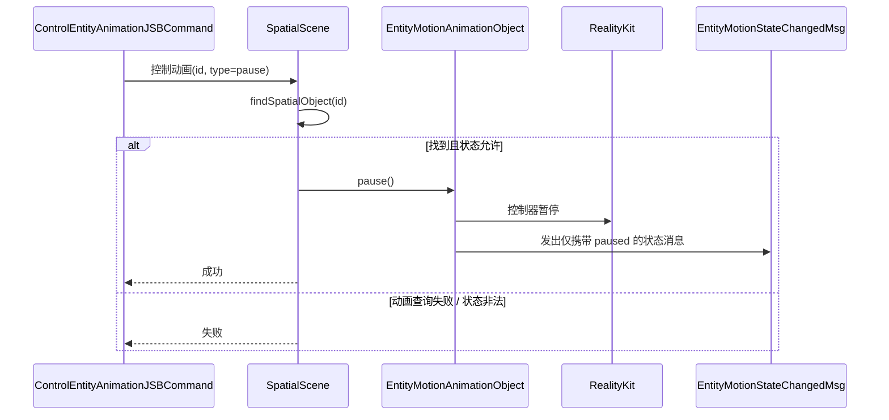
```mermaid
sequenceDiagram
    participant JSB as ControlEntityAnimationJSBCommand
    participant Scene as SpatialScene
    participant Obj as EntityMotionAnimationObject
    participant RK as RealityKit
    participant Event as EntityMotionStateChangedMsg

    JSB->>Scene: 控制动画(id, type=pause)
    Scene->>Scene: findSpatialObject(id)
    alt 找到且状态允许
        Scene->>Obj: pause()
        Obj->>RK: 控制器暂停
        Obj->>Event: 发出仅携带 paused 的状态消息
        Scene-->>JSB: 成功
    else 动画查询失败 / 状态非法
        Scene-->>JSB: 失败
    end
```

**停止、重置、结束时序:**

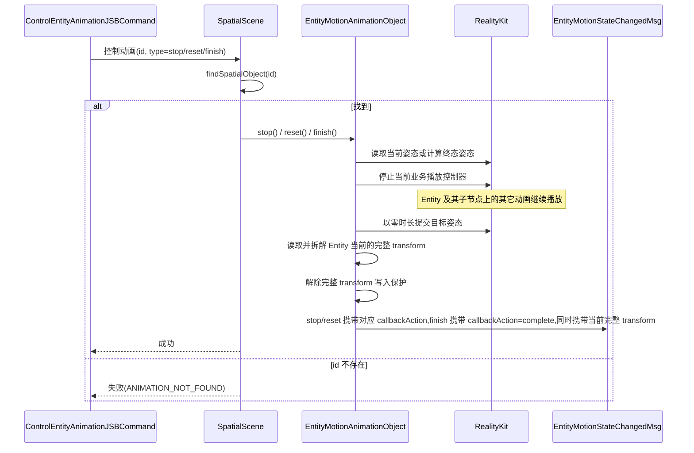
```mermaid
sequenceDiagram
    participant JSB as ControlEntityAnimationJSBCommand
    participant Scene as SpatialScene
    participant Obj as EntityMotionAnimationObject
    participant RK as RealityKit
    participant Event as EntityMotionStateChangedMsg

    JSB->>Scene: 控制动画(id, type=stop/reset/finish)
    Scene->>Scene: findSpatialObject(id)
    alt 找到
        Scene->>Obj: stop() / reset() / finish()
        Obj->>RK: 读取当前姿态或计算终态姿态
        Obj->>RK: 停止当前业务播放控制器
        Note over RK: Entity 及其子节点上的其它动画继续播放
        Obj->>RK: 以零时长提交目标姿态
        Obj->>Obj: 读取并拆解 Entity 当前的完整 transform
        Obj->>Obj: 解除完整 transform 写入保护
        Obj->>Event: stop/reset 携带对应 callbackAction,finish 携带 callbackAction=complete,同时携带当前完整 transform
        Scene-->>JSB: 成功
    else id 不存在
        Scene-->>JSB: 失败(ANIMATION_NOT_FOUND)
    end
```

**set 时序:**

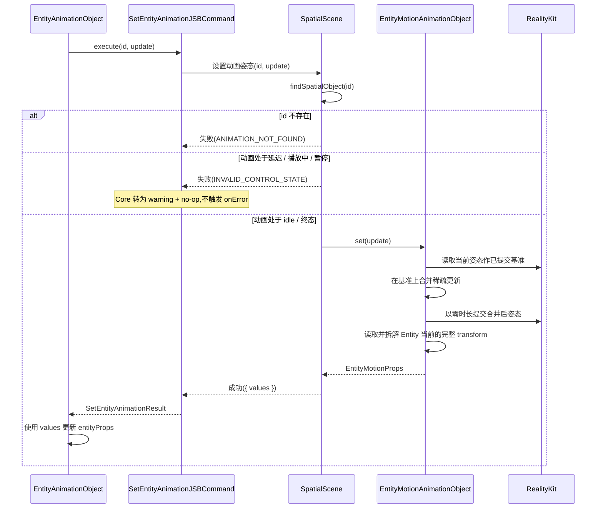
```mermaid
sequenceDiagram
    participant Core as EntityAnimationObject
    participant JSB as SetEntityAnimationJSBCommand
    participant Scene as SpatialScene
    participant Obj as EntityMotionAnimationObject
    participant RK as RealityKit

    Core->>JSB: execute(id, update)
    JSB->>Scene: 设置动画姿态(id, update)
    Scene->>Scene: findSpatialObject(id)
    alt id 不存在
        Scene-->>JSB: 失败(ANIMATION_NOT_FOUND)
    else 动画处于延迟 / 播放中 / 暂停
        Scene-->>JSB: 失败(INVALID_CONTROL_STATE)
        Note over JSB: Core 转为 warning + no-op,不触发 onError
    else 动画处于 idle / 终态
        Scene->>Obj: set(update)
        Obj->>RK: 读取当前姿态作已提交基准
        Obj->>Obj: 在基准上合并稀疏更新
        Obj->>RK: 以零时长提交合并后姿态
        Obj->>Obj: 读取并拆解 Entity 当前的完整 transform
        Obj-->>Scene: EntityMotionProps
        Scene-->>JSB: 成功({ values })
        JSB-->>Core: SetEntityAnimationResult
        Core->>Core: 使用 values 更新 entityProps
    end
```

暂停复用已编译的整姿态串联动画、控制当前播放控制器,并保持完整 transform 写入保护。停止 / 重置 / 结束会停止该控制器、以零时长提交目标姿态,并在返回完整 transform 前解除保护。自然完成也会在 `complete` 事件前解除保护。`set` 在非活跃状态下把稀疏更新合并到已提交姿态后以零时长提交,并通过成功回执返回 Entity 当前的完整 transform。`set` 保持原有 `playState`,不发送状态事件。

Native Entity animation object 与一次 target binding 同生命周期;target 销毁时,`SpatialScene` 通过全局 `SpatialObject` lifecycle 级联销毁关联动画,并为每个 animation id 发送 `objectdestroy`。Core 消费该消息后标记动画对象已销毁并注销该 animation id 的事件接收器。后续 playback 在 Core 本地完成空操作;`set` 在 Core 本地输出 warning 并完成空操作,同时保持现有 `onError` 次数。在途命令继续适用 `ANIMATION_NOT_FOUND` 竞态结果。

边界约束:`SpatialScene` 负责全局 `spatialObjects`、创建目标查找、动画对象查找、四条 Entity 命令回执和 `SpatialObject` lifecycle。`SpatialEntity.createAnimation(config)` 负责创建 Entity 动画对象;`EntityMotionAnimationObject` 内聚单对象更新、编译、播放状态、控制、确认值、事件发送和资源释放。Entity 与 Element 路径保持独立协议,并共享全局 `spatialObjects` 生命周期。

## 6. 风险评估

| 风险 | 缓解 |
|---|---|
| 平台能力验证缺少可追溯记录 | `tasks.zh.md` 第 8 节记录平台版本、SDK 版本、fixtures、执行命令和结果 |
| 控制器级停止影响同一 Entity 或子节点上的其它动画 | 原生清理只停止当前 `EntityMotionAnimationObject` 持有的控制器;任务 8.4 覆盖其它动画保持运行 |
| 零时长姿态提交影响其它动画或终态 | 状态命令矩阵限定 `stop` / `reset` / `finish` / `set` 的提交动作;任务 8.4 覆盖终态提交 |
| transform 写入保护遗漏导致 React 写入覆盖活动动画 | `SpatialScene` 在普通 Entity transform 更新入口检查 animating mask;停止、重置、结束、自然完成、解绑和销毁时解除保护;4.3/8.2 覆盖该行为 |
| 配置 update 在旧执行已受破坏后失败 | Native 在停止旧 controller 前完成所有可能失败的候选准备;失败原子保留旧执行,第 9 节覆盖 RealityKit 可行性验证与回滚测试 |
| 创建请求和创建回执都使用 `id` 导致语义混淆 | 协议按消息方向固定含义:请求为目标 Entity id,回执为动画对象 id;Core/Native contract 测试分别断言 |
| 状态事件和错误事件重复报告同一失败 | 同一失败只选择命令回执或 `entityanimationerror` 一个出口,状态事件不承载错误 |
| 四条 Entity JSB 命令在 Core 与 Native 间发生结构漂移 | Bridge contract 测试分别覆盖创建、更新、控制、设置命令和两类事件 |