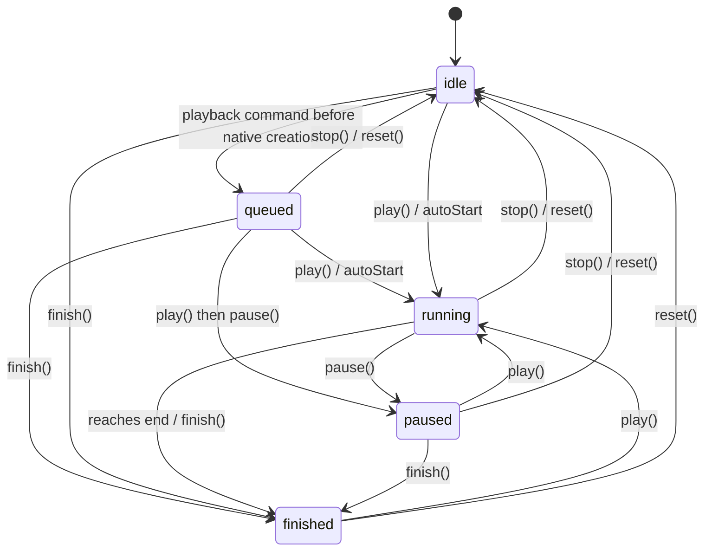

## What This Is

`useEntityAnimation` is a React Hook for animating a 3D object (an Entity) in the scene, letting it move, rotate, or scale smoothly.

`useEntityAnimation` provides three core capabilities:

1. **Keyframe animation (`timeline`)**: do a simple "from A to B" motion, or write multi-step animations like `0% → 50% → 100%`.
2. **Result write-back (`entityProps`)**: the Hook hands the animation's final pose back to you, so the object stays put at the end instead of snapping back.
3. **Binding (`animation`)**: bind the animation to the object through the component's `animation` prop.

> **A few basic terms** (used throughout):
> - **Entity**: a 3D object in the scene, e.g. a box `<BoxEntity>`.
> - **transform**: the object's spatial pose, made of three parts — position `position` (unit: meters), rotation `rotation` (unit: degrees), and scale `scale` (a multiplier, 1 = original size).
> - **`Vec3`**: a 3D vector shaped like `{ x, y, z }`, used for the three axes of each part above.
> - **component**: one of `position` / `rotation` / `scale`.

---

## I Want To Do X — What Do I Use (Quick Reference)

| What I want to do | What to use |
|---|---|
| Move/rotate/scale an object from one pose to another | Write top-level `from` / `to` (simplest form), or `timeline.from` / `timeline.to`, in the config |
| Do a multi-step keyframe animation (e.g. 0% → 50% → 100%) | Write `timeline` in the config |
| Keep the object at the end pose after the animation, no snap-back | Spread `{...entityProps}` onto the component |
| Move the object to a new pose in code after the animation | Call `api.set({ ... })` |
| Animate position only while preserving the other components | Put only `position` in the config; native fills `rotation` / `scale` from the baseline, owns the whole transform during playback, and returns the complete committed transform through `entityProps` |
| Read the final pose the animation hands back | Read `entityProps` (there is no `api.get`) |
| Control playback (start/pause/stop/reset) | `api.play()` / `pause()` / `stop()` / `reset()` / `finish()` |
| Check whether the runtime supports animation | `supports('useEntityAnimation')` |

> **Transform only**: this version can animate `position` / `rotation` / `scale` only. It does **not** support `opacity`, material, color, etc. Targeting something unsupported throws an error rather than being silently ignored.

---

## Quick Start: A Complete Example

```tsx
import { useEntityAnimation } from '...'

function MyBox() {
  // Move the box up by 0.25m and scale it to 1.1x over 0.8s
  const [animation, api, entityProps] = useEntityAnimation({
    timeline: {
      from: { position: { x: 0, y: 0, z: 0.8 }, scale: { x: 1, y: 1, z: 1 } },
      to:   { position: { y: 0.25 },            scale: { x: 1.1, y: 1.1, z: 1.1 } },
    },
    duration: 0.8,
    autoStart: true,
    onComplete: () => console.log('animation done'),
  })

  return (
    <Reality>
      <SceneGraph>
        {/* Put entityProps last so the object stays at the end pose */}
        <BoxEntity {...entityProps} animation={animation} />
      </SceneGraph>
    </Reality>
  )
}
```

The Hook returns three values, destructured in order:

```tsx
const [animation, api, entityProps] = useEntityAnimation(config)
```

| Return value | What it does |
|---|---|
| `animation` | The animation binding; pass it to the component's `animation` prop |
| `api` | The playback controller; provides `play / pause / stop / reset / finish` and `set` |
| `entityProps` | A committed-pose snapshot updated at key moments; after the first confirmation it contains complete `position`, `rotation`, and `scale` values and should be spread onto the component |

---

## Describing the Animation (config)

The public config contract is:

```ts
type TimingFunction = 'linear' | 'easeIn' | 'easeOut' | 'easeInOut'

type EntityMotionProps = {
  position?: Vec3
  rotation?: Vec3
  scale?: Vec3
}

type EntityMotionPatch = {
  position?: Partial<Vec3>
  rotation?: Partial<Vec3>
  scale?: Partial<Vec3>
}

type EntityMotionFrame = EntityMotionPatch & {
  timingFunction?: TimingFunction
}

type EntityMotionTimeline = {
  from?: EntityMotionFrame
  to?: EntityMotionFrame
} & Partial<Record<`${number}%`, EntityMotionFrame>>

type SpatializedPlaybackError = {
  code:
    | 'TARGET_NOT_FOUND'
    | 'UNSUPPORTED_TARGET'
    | 'ANIMATION_NOT_FOUND'
    | 'INVALID_TIMELINE'
    | 'COMPILATION_FAILED'
    | 'INVALID_CONTROL_STATE'
    | 'INVALID_SET_VALUES'
  message?: string
}

type EntityMotionConfig = {
  from?: EntityMotionPatch
  to?: EntityMotionPatch
  timeline?: EntityMotionTimeline
  duration?: number
  timingFunction?: TimingFunction
  delay?: number
  playbackRate?: number
  loop?: boolean | { reverse?: boolean }
  autoStart?: boolean
  onStart?: (values: EntityMotionProps) => void
  onComplete?: (values: EntityMotionProps) => void
  onStop?: (values: EntityMotionProps) => void
  onReset?: (values: EntityMotionProps) => void
  onError?: (error: SpatializedPlaybackError) => void
}
```

Defaults are `autoStart: true`, `timingFunction: 'easeInOut'`, `delay: 0`, `playbackRate: 1`, and `loop: false`. Every config containing `timeline` must provide `duration`; only pure top-level `from` / `to` uses the 0.3-second default. Invalid config is a programmer error and throws synchronously.

### Option 0: top-level from / to (simplest form)

If you only need "from one pose to another", write `from` / `to` at the top level of the config, without nesting them under `timeline`:

```tsx
const [animation, api, entityProps] = useEntityAnimation({
  from: { position: { x: 0, y: 0, z: 0.8 }, scale: { x: 1, y: 1, z: 1 } },
  to:   { position: { y: 0.25 },            scale: { x: 1.1, y: 1.1, z: 1.1 } },
  // With pure top-level from/to and no percentages, duration defaults to 0.3s
  autoStart: true,
})
```

A few rules:

1. **Equivalent to `timeline.from` / `timeline.to`**: top-level `from` / `to` is just shorthand; it normalizes to the same single timeline internally and behaves identically.
2. **Both boundaries are required**: in this top-level shape, `from` and `to` must both be provided; supplying only one throws an error and is not filled from the object's current pose.
3. **`duration` defaults to 0.3s for pure top-level from/to** (as long as no percentage keyframes are used).
4. **When `timeline` is also present, `timeline` wins**: the top-level `from` / `to` is then ignored, with a warning logged in development mode.

### Option 1: timeline.from / timeline.to (from one pose to another)

```tsx
const [animation, api, entityProps] = useEntityAnimation({
  timeline: {
    from: {
      position: { x: 0, y: 0, z: 0.8 },
      rotation: { x: 0, y: 0, z: 0 },
      scale: { x: 1, y: 1, z: 1 },
    },
    to: {
      position: { y: 0.25 },
      scale: { x: 1.1, y: 1.1, z: 1.1 },
    },
  },
  duration: 0.8,
  autoStart: true,
})
```

Both `timeline.from` and `timeline.to` can list only the **fields** you care about; unlisted fields stay unchanged. But **both ends are required**: `timeline.from` (or the `0%` frame) and `timeline.to` (or the `100%` frame) must both be present; supplying only one throws an error and does not fill the other end from the object's current pose or the baseline.

### Option 2: timeline (multi-step keyframes)

Use percentages inside `timeline` to describe the pose at different points in time — good for more complex motion:

```tsx
const [animation, api, entityProps] = useEntityAnimation({
  duration: 1.2,
  timingFunction: 'easeInOut',
  timeline: {
    '0%': {
      position: { x: 0, y: 0, z: 0.8 },
      scale: { x: 1, y: 1, z: 1 },
    },
    '50%': {
      position: { y: 0.25 },
      scale: { x: 1.1, y: 1.1, z: 1.1 },
    },
    '100%': {
      position: { y: 0 },
      scale: { x: 1, y: 1, z: 1 },
    },
  },
})
```

### Option 3: mixing from / to with percentages in timeline

Inside a single `timeline`, `from` is the `0%` frame and `to` is the `100%` frame, so you can mix `from` / `to` with intermediate percentage keys. This fits the "express the two ends with from/to, then insert a few percentage keyframes in between" case:

```tsx
const [animation, api, entityProps] = useEntityAnimation({
  duration: 1.2,
  timingFunction: 'easeInOut',
  timeline: {
    from: {                              // equivalent to 0%
      position: { x: 0, y: 0, z: 0.8 },
      scale: { x: 1, y: 1, z: 1 },
    },
    '50%': {
      position: { y: 0.25 },
      scale: { x: 1.1, y: 1.1, z: 1.1 },
    },
    to: {                                // equivalent to 100%
      position: { y: 0 },
      scale: { x: 1, y: 1, z: 1 },
    },
  },
})
```

A couple of notes:

- **Both ends are required**: the start (`from` or `0%`) and the end (`to` or `100%`) must both be written, and omitting either throws an error; using `from` + `to` here naturally satisfies this.
- `from` and `0%`, `to` and `100%`, refer to the same frame — **do not write both `from` and `0%` (or both `to` and `100%`) in the same `timeline`**, or defining the same frame twice throws an error.
- The 0.3s `duration` default does not apply here (it applies only to pure top-level `from` / `to` with no percentages); provide `duration` explicitly.

### Option 4: per-global-segment timingFunction

Besides a single global `timingFunction` at the top level of the config, you can also put `timingFunction` on an **individual keyframe**, as a sibling of that frame's `position` / `rotation` / `scale`. **A per-keyframe `timingFunction` applies to the segment from the current global timeline node to the next global timeline node**, and takes precedence over the top-level global `timingFunction`:

```tsx
const [animation, api, entityProps] = useEntityAnimation({
  duration: 1.2,
  timingFunction: 'linear',        // global default: segments not otherwise specified use linear
  timeline: {
    '0%': {
      position: { x: 0, y: 0, z: 0.8 },
      timingFunction: 'easeIn',    // applies to the global 0% → 50% segment
    },
    '50%': {
      position: { y: 0.25 },
      timingFunction: 'easeOut',   // applies to the global 50% → 100% segment
    },
    '100%': {
      position: { y: 0 },          // last frame has no next segment, no timingFunction needed
    },
  },
})
```

A couple of notes:

- **Sibling of the pose fields**: `timingFunction` sits inside a frame, alongside that frame's `position` / `rotation` / `scale`, and describes the easing from that global timeline node to the next global timeline node.
- **Allowed values**: `'linear'` / `'easeIn'` / `'easeOut'` / `'easeInOut'` (camelCase; there is no hyphenated form like `'ease-in'`).
- **Precedence**: a global segment's easing takes the `timingFunction` on its start frame; if absent it falls back to the top-level global `timingFunction`, and otherwise the default.
- **Not needed on the last frame**: the last global timeline node has no next segment, so a `timingFunction` written on it has no effect.

### Which Fields You Can Write

The config accepts only these fields (matching the Entity's own prop hierarchy):

```text
position.x / position.y / position.z
rotation.x / rotation.y / rotation.z
scale.x    / scale.y    / scale.z
```

Targeting something unsupported like `opacity` throws synchronously during config validation.

---

## Keeping the Result at the End Pose (entityProps)

`entityProps` is the third value returned by the Hook — it is the **final pose the animation hands back** at key moments (see "When it updates" below), not a value that refreshes every frame. Spread it onto the component so the object stays at the end pose after the animation:

```tsx
const [animation, api, entityProps] = useEntityAnimation({
  duration: 0.8,
  timeline: {
    from: {
      position: { x: 0, y: 0, z: 0 },
      rotation: { y: 0 },
      scale: { x: 1, y: 1, z: 1 },
    },
    to: {
      position: { x: 0.1, y: 0, z: 0 },
      rotation: { y: 90 },
      scale: { x: 1, y: 1, z: 1 },
    },
  },
})

return (
  <BoxEntity {...entityProps} animation={animation} />
)
```

**After the animation completes**, `entityProps` updates to the complete end pose (`position`, `rotation`, and `scale`), and the object remains on that committed pose. While the animation binding remains attached, this complete mirror owns the transform even while playback is inactive.

**When it updates**: `entityProps` does not update every frame. It only updates at key moments: when playback starts, completes, stops, resets, finishes, and when an `api.set` write succeeds.

> **Note**: before the first playback, or before the first successful `api.set`, `entityProps` may be empty. Do not assume it already has a value right when the component mounts — play the animation once, or call `api.set` successfully once, and it will then hold a value.

---

## Moving the Object in Code After the Animation (api.set)

Once the animation is done, if you want to move the object to a new pose from code, call `api.set`:

```tsx
// Raise the box to y = 0.3 (everything else unchanged)
api.set({ position: { y: 0.3 } })
```

A few rules:

1. **Use it only while the animation is not playing** (this includes: never played, already finished, stopped / reset). As long as the animation is playing (including delay and paused), native rejects the `api.set` call — it is a **noop** (it neither interrupts the animation nor gets queued for later replay; the object stays unchanged and `entityProps` does not update) and logs a warning to the console; it does **not** trigger `onError`. To take over the object mid-animation, stop the animation first, or wait until it ends.
2. **Pass only the fields you want to change**; the rest stay as they are. For example, `api.set({ position: { y: 0.3 } })` does not touch `rotation` or `scale`.
3. **On a successful write, `entityProps` updates** to the new pose; if the write is not accepted (e.g. called during playback), it is a noop — `entityProps` stays unchanged and a warning is logged to the console; `onError` does not fire.
4. **Want to change based on the current value?** Read `entityProps` to get the current pose, compute the new value yourself, then pass it to `api.set`. There is no `api.get` here — in React, an imperative getter tends to read stale values and cause read-then-write conflicts.
5. **It is not a playback command**: `api.set` does not start playback or change playback progress.

### Where Playback Starts After api.set

- Playback starts from the start frame declared by the config (top-level `from`, `timeline.from`, or the `0%` frame). Because every animation must declare a start, there is no "no start frame" case — a config missing the start is rejected during validation.
- Every fresh play reads the entity's latest native transform at the start. Fields declared by the config start from the configured start frame, while omitted fields use that latest transform as the run's baseline. Therefore, after a successful inactive `api.set`, the next fresh play uses the updated values to fill omitted fields.
- A fresh play is the first `play` / `autoStart` after creation, or a new `play` after completion, finish, stop, or reset. A `play` after `pause` only resumes from the current progress and does not read a new baseline; loops within one run also keep using that run's baseline.

---

## Who Wins: Animation vs. Your Props

The object's pose can be influenced by static/base props, the `entityProps` committed mirror, and the active animation. Ownership is always decided for the **whole transform**:

| Situation | Who wins |
|---|---|
| Before the first native-confirmed state | Static/base React props |
| The animation is playing (including delay and paused) | The animation owns the whole transform; the remaining components hold their baseline values |
| A confirmed state exists and playback is inactive | The complete `entityProps` mirror; dynamic writes use `api.set` |
| The animation binding is removed | React props regain control |

This matches visionOS / picoOS natively: the underlying runtime binds the whole transform. During active animation, configured components animate and the remaining components hold their baseline values. Native reports the complete committed transform at confirmed lifecycle points, and `entityProps` persists that complete value while the binding remains attached.

A few practical takeaways follow:

- **While the animation is playing**, the entire transform is taken over by the animation, so writing any component via props or `api.set` has no effect; components not in the config are frozen at baseline.
- **During animation**, the runtime binds the whole transform and rotation holds its baseline value.
- **After the first confirmed state**, ordinary transform props remain static/base inputs while the binding is attached. Use `api.set` for inactive dynamic changes.
- **After the binding is removed**, `entityProps` ownership is cleared and ordinary React transform props regain control.

### Recommended Pattern

Put `entityProps` **after** your other props, so the object correctly stays at the end pose after the animation instead of being overwritten by older prop values:

```tsx
<BoxEntity
  position={basePosition}
  {...entityProps}
  animation={animation}
/>
```

Once `entityProps` has a confirmed value, it remains authoritative when `basePosition` changes. Call `api.set` to change the committed transform, or remove the animation binding to return control to ordinary React props.

---

## api Methods Overview

`api` provides the following methods:

```tsx
interface EntityPlaybackApi {
  play(): void
  pause(): void
  stop(): void
  reset(): void
  finish(): void
  set(values: EntityMotionPatch): void
  readonly playState: 'queued' | 'idle' | 'running' | 'paused' | 'finished'
  readonly isAnimating: boolean
  readonly isPaused: boolean
  readonly finished: boolean
}
```

The first five are **playback controls** that operate the animation's playback progress; `api.set` is a **pose setter** that changes the object's static pose directly and does not affect playback progress. All of them live on `api` but serve different purposes: use the first five to control the animation, and use `api.set` to place the object by hand after the animation ends.

---

## Animation States

During its lifecycle an animation moves through the states below. Reading this diagram helps you tell, at any moment: whether `api.set` is usable, whether `entityProps` updates, and who controls the object.



`running` includes the start delay. Boolean state in `queued` depends on the playback command waiting to run:

| `playState` | `isAnimating` | `isPaused` | `finished` |
|---|---|---|---|
| `queued` | `true` while `play` / `autoStart` waits | `true` while `pause` waits | `false` |
| `idle` | `false` | `false` | `false` |
| `running` | `true` | `false` | `false` |
| `paused` | `false` | `true` | `false` |
| `finished` | `false` | `false` | `true` |

### Behavior in Each State

| State | How to enter | Is `api.set` usable | Does `entityProps` update | Who controls the transform |
|---|---|---|---|---|
| **Initial** | Before the first confirmed value | ✅ Usable after native object creation | Filled at the first confirmation | Static/base React props |
| **Playing** (incl. delay, paused) | `play()` / `autoStart`; still counts after `pause()` | ❌ Rejected (noop + warning) | Only once, at the moment playback starts | The animation owns the whole transform; fields omitted from the config freeze at this run's fresh-play baseline |
| **Inactive with confirmed state** | `complete` / `stop` / `reset` / `finish`, or successful `api.set` | ✅ Usable | ✅ Contains the complete committed transform | `entityProps`; dynamic writes use `api.set` |

> **Note**: a looping animation has no natural "reaches end", so `entityProps` does not update and the baseline is not reread at each loop boundary. `stop()`, `reset()`, or `finish()` updates `entityProps`; after the animation becomes inactive, a successful `api.set()` also updates `entityProps`.

---

## Event Callbacks (callback)

You can pass callbacks in the config to get notified at different stages of the animation:

```tsx
useEntityAnimation({
  // ...
  onStart:    values => console.log('start', values),
  onComplete: values => console.log('complete', values),
  onStop:     values => console.log('stop', values),
  onReset:    values => console.log('reset', values),
  onError:    error  => console.error('error', error),
})
```

Callbacks are **notifications only**. Their return values are ignored and cannot decide where the object ends up. To decide the end pose, declare it in the config before playback (e.g. via top-level `to` or `timeline.to`), or take over after playback through `entityProps` / `api.set`.

The `values` passed to callbacks contain only the fields Entity supports:

```text
{ position?: Vec3, rotation?: Vec3, scale?: Vec3 }
```

---

## Checking Runtime Support

Use capability detection to check whether the current runtime supports animation:

```tsx
supports('useEntityAnimation')
```

Meaning: the current runtime supports binding animation to an Entity via `animation`.

If it returns `false`, the current runtime does not support animation; skip the animation and render the object at its target pose with static props instead:

```tsx
if (supports('useEntityAnimation')) {
  return <BoxEntity {...entityProps} animation={animation} />
}
// Not supported: render straight to the final pose, no animation
return <BoxEntity position={targetPosition} />
```

**This version supports transform only (`position` / `rotation` / `scale`); it does not support `opacity`.**

---

## Limitations (This Version)

This version can **animate transform only** (`position` / `rotation` / `scale`); it does not support opacity (`opacity`), material, color, or other properties. In addition, an animation object binds to a single object and cannot be shared across multiple objects.

---

## One-Line Summary

`useEntityAnimation` describes animation with `position / rotation / scale`, and supports top-level `from` / `to` shorthand, percentage `timeline`, `entityProps` result write-back, and the `animation` binding; this version supports transform only, not opacity.
