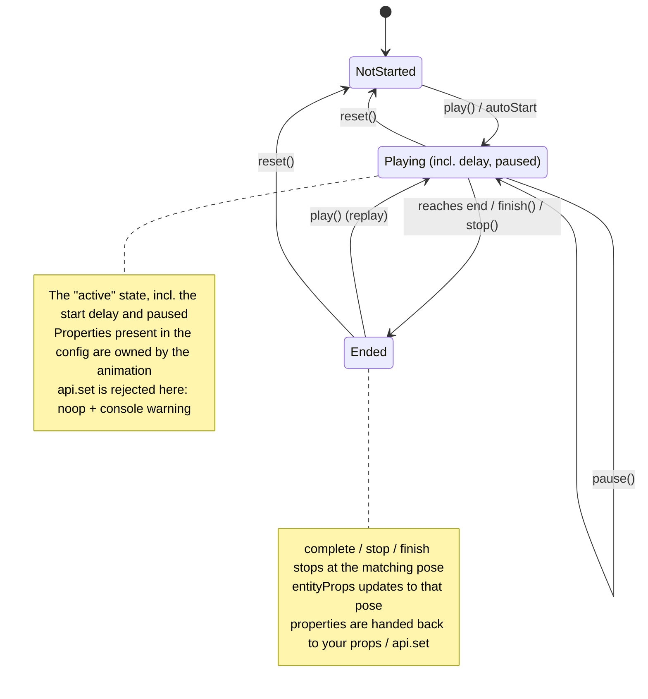

## What This Is

`useEntityAnimation` is a React Hook for animating a 3D object (an Entity) in the scene, letting it move, rotate, or scale smoothly.

`useEntityAnimation` provides three core capabilities:

1. **Keyframe animation (`timeline`)**: do a simple "from A to B" motion, or write multi-step animations like `0% → 50% → 100%`.
2. **Result write-back (`entityProps`)**: the Hook hands the animation's final pose back to you, so the object stays put at the end instead of snapping back.
3. **Binding (`animation`)**: bind the animation to the object through the component's `animation` prop.

> **A few basic terms** (used throughout):
> - **Entity**: a 3D object in the scene, e.g. a box `<BoxEntity>`.
> - **transform**: the object's spatial pose, made of three parts — position `position` (unit: meters), rotation `rotation` (unit: degrees), and scale `scale` (a multiplier, 1 = original size).
> - **`Vec3`**: a 3D vector shaped like `{ x, y, z }`, used for the three axes of each part above.
> - **component**: one of `position` / `rotation` / `scale`.

---

## I Want To Do X — What Do I Use (Quick Reference)

| What I want to do | What to use |
|---|---|
| Move/rotate/scale an object from one pose to another | Write top-level `from` / `to` (simplest form), or `timeline.from` / `timeline.to`, in the config |
| Do a multi-step keyframe animation (e.g. 0% → 50% → 100%) | Write `timeline` in the config |
| Keep the object at the end pose after the animation, no snap-back | Spread `{...entityProps}` onto the component |
| Move the object to a new pose in code after the animation | Call `api.set({ ... })` |
| Let the animation control position only, keep rotation manual | Put only `position` in the config; keep passing `rotation` via props |
| Read the final pose the animation hands back | Read `entityProps` (there is no `api.get`) |
| Control playback (start/pause/stop/reset) | `api.play()` / `pause()` / `stop()` / `reset()` / `finish()` |
| Check whether the runtime supports animation | `supports('useEntityAnimation')` |

> **Transform only**: this version can animate `position` / `rotation` / `scale` only. It does **not** support `opacity`, material, color, etc. Targeting something unsupported throws an error rather than being silently ignored.

---

## Quick Start: A Complete Example

```tsx
import { useEntityAnimation } from '...'

function MyBox() {
  // Move the box up by 0.25m and scale it to 1.1x over 0.8s
  const [animation, api, entityProps] = useEntityAnimation({
    timeline: {
      from: { position: { x: 0, y: 0, z: 0.8 }, scale: { x: 1, y: 1, z: 1 } },
      to:   { position: { y: 0.25 },            scale: { x: 1.1, y: 1.1, z: 1.1 } },
    },
    duration: 0.8,
    autoStart: true,
    onComplete: () => console.log('animation done'),
  })

  return (
    <Reality>
      <SceneGraph>
        {/* Put entityProps last so the object stays at the end pose */}
        <BoxEntity {...entityProps} animation={animation} />
      </SceneGraph>
    </Reality>
  )
}
```

The Hook returns three values, destructured in order:

```tsx
const [animation, api, entityProps] = useEntityAnimation(config)
```

| Return value | What it does |
|---|---|
| `animation` | The animation binding; pass it to the component's `animation` prop |
| `api` | The playback controller; provides `play / pause / stop / reset / finish` and `set` |
| `entityProps` | The final pose handed back at key moments (not a live per-frame value), shaped like `{ position?, rotation?, scale? }`; spread it onto the component |

---

## Describing the Animation (config)

### Option 0: top-level from / to (simplest form)

If you only need "from one pose to another", write `from` / `to` at the top level of the config, without nesting them under `timeline`:

```tsx
const [animation, api, entityProps] = useEntityAnimation({
  from: { position: { x: 0, y: 0, z: 0.8 }, scale: { x: 1, y: 1, z: 1 } },
  to:   { position: { y: 0.25 },            scale: { x: 1.1, y: 1.1, z: 1.1 } },
  // With pure top-level from/to and no percentages, duration defaults to 0.3s
  autoStart: true,
})
```

A few rules:

1. **Equivalent to `timeline.from` / `timeline.to`**: top-level `from` / `to` is just shorthand; it normalizes to the same single timeline internally and behaves identically.
2. **Both boundaries are required**: in this top-level shape, `from` and `to` must both be provided; supplying only one throws an error and is not filled from the object's current pose.
3. **`duration` defaults to 0.3s for pure top-level from/to** (as long as no percentage keyframes are used).
4. **When `timeline` is also present, `timeline` wins**: the top-level `from` / `to` is then ignored, with a warning logged in development mode.

### Option 1: timeline.from / timeline.to (from one pose to another)

```tsx
const [animation, api, entityProps] = useEntityAnimation({
  timeline: {
    from: {
      position: { x: 0, y: 0, z: 0.8 },
      rotation: { x: 0, y: 0, z: 0 },
      scale: { x: 1, y: 1, z: 1 },
    },
    to: {
      position: { y: 0.25 },
      scale: { x: 1.1, y: 1.1, z: 1.1 },
    },
  },
  duration: 0.8,
  autoStart: true,
})
```

Both `timeline.from` and `timeline.to` can list only the **fields** you care about; unlisted fields stay unchanged. But **both ends are required**: `timeline.from` (or the `0%` frame) and `timeline.to` (or the `100%` frame) must both be present; supplying only one throws an error and does not fill the other end from the object's current pose or the baseline.

### Option 2: timeline (multi-step keyframes)

Use percentages inside `timeline` to describe the pose at different points in time — good for more complex motion:

```tsx
const [animation, api, entityProps] = useEntityAnimation({
  duration: 1.2,
  timingFunction: 'easeInOut',
  timeline: {
    '0%': {
      position: { x: 0, y: 0, z: 0.8 },
      scale: { x: 1, y: 1, z: 1 },
    },
    '50%': {
      position: { y: 0.25 },
      scale: { x: 1.1, y: 1.1, z: 1.1 },
    },
    '100%': {
      position: { y: 0 },
      scale: { x: 1, y: 1, z: 1 },
    },
  },
})
```

### Option 3: mixing from / to with percentages in timeline

Inside a single `timeline`, `from` is the `0%` frame and `to` is the `100%` frame, so you can mix `from` / `to` with intermediate percentage keys. This fits the "express the two ends with from/to, then insert a few percentage keyframes in between" case:

```tsx
const [animation, api, entityProps] = useEntityAnimation({
  duration: 1.2,
  timingFunction: 'easeInOut',
  timeline: {
    from: {                              // equivalent to 0%
      position: { x: 0, y: 0, z: 0.8 },
      scale: { x: 1, y: 1, z: 1 },
    },
    '50%': {
      position: { y: 0.25 },
      scale: { x: 1.1, y: 1.1, z: 1.1 },
    },
    to: {                                // equivalent to 100%
      position: { y: 0 },
      scale: { x: 1, y: 1, z: 1 },
    },
  },
})
```

A couple of notes:

- **Both ends are required**: the start (`from` or `0%`) and the end (`to` or `100%`) must both be written, and omitting either throws an error; using `from` + `to` here naturally satisfies this.
- `from` and `0%`, `to` and `100%`, refer to the same frame — **do not write both `from` and `0%` (or both `to` and `100%`) in the same `timeline`**, or defining the same frame twice throws an error.
- The 0.3s `duration` default does not apply here (it applies only to pure top-level `from` / `to` with no percentages); provide `duration` explicitly.

### Which Fields You Can Write

The config accepts only these fields (matching the Entity's own prop hierarchy):

```text
position.x / position.y / position.z
rotation.x / rotation.y / rotation.z
scale.x    / scale.y    / scale.z
```

Targeting something unsupported like `opacity` throws an error or triggers `onError`; it is never silently ignored.

---

## Keeping the Result at the End Pose (entityProps)

`entityProps` is the third value returned by the Hook — it is the **final pose the animation hands back** at key moments (see "When it updates" below), not a value that refreshes every frame. Spread it onto the component so the object stays at the end pose after the animation:

```tsx
const [animation, api, entityProps] = useEntityAnimation({
  timeline: {
    from: {
      position: { x: 0, y: 0, z: 0 },
      rotation: { y: 0 },
      scale: { x: 1, y: 1, z: 1 },
    },
    to: {
      position: { x: 0.1, y: 0, z: 0 },
      rotation: { y: 90 },
      scale: { x: 1, y: 1, z: 1 },
    },
  },
})

return (
  <BoxEntity {...entityProps} animation={animation} />
)
```

**After the animation completes**, `entityProps` updates to the end pose (position, rotation, scale); the object stays on its last frame and **does not snap back to the start**.

**When it updates**: `entityProps` does not update every frame. It only updates at key moments: when playback starts, completes, stops, resets, finishes, and when an `api.set` write succeeds.

> **Note**: before the first playback, or before the first successful `api.set`, `entityProps` may be empty. Do not assume it already has a value right when the component mounts — play the animation once, or call `api.set` successfully once, and it will then hold a value.

---

## Moving the Object in Code After the Animation (api.set)

Once the animation is done, if you want to move the object to a new pose from code, call `api.set`:

```tsx
// Raise the box to y = 0.3 (everything else unchanged)
api.set({ position: { y: 0.3 } })
```

A few rules:

1. **Use it only while the animation is not playing** (this includes: never played, already finished, stopped / reset). As long as the animation is playing (including delay and paused), native rejects the `api.set` call — it is a **noop** (it neither interrupts the animation nor gets queued for later replay; the object stays unchanged and `entityProps` does not update) and logs a warning to the console; it does **not** trigger `onError`. To take over the object mid-animation, stop the animation first, or wait until it ends.
2. **Pass only the fields you want to change**; the rest stay as they are. For example, `api.set({ position: { y: 0.3 } })` does not touch `rotation` or `scale`.
3. **On a successful write, `entityProps` updates** to the new pose; if the write is not accepted (e.g. called during playback), it is a noop — `entityProps` stays unchanged and a warning is logged to the console; `onError` does not fire.
4. **Want to change based on the current value?** Read `entityProps` to get the current pose, compute the new value yourself, then pass it to `api.set`. There is no `api.get` here — in React, an imperative getter tends to read stale values and cause read-then-write conflicts.
5. **It is not a playback command**: `api.set` does not start playback or change playback progress.

### Where Playback Starts After api.set

- Playback starts from the start frame declared by the config (top-level `from`, `timeline.from`, or the `0%` frame). Because every animation must declare a start, there is no "no start frame" case — a config missing the start is rejected during validation.

---

## Who Wins: Animation vs. Your Props

The object's pose can be influenced from two sides at once: the props you pass manually (including `entityProps`), and the animation that is playing. The rule is decided **per component (`position` / `rotation` / `scale`), independently**:

| Situation | Who wins |
|---|---|
| The component is written in the config AND the animation is playing (including delay, paused) | The animation |
| Otherwise (the component is not in the config, or the animation has ended / not started) | Your props / `api.set` |

This matches CSS animations: while playing, the animation takes over these transform properties per property; properties it does not cover — and these transform properties once the animation ends — are handed back to you.

A few practical takeaways follow:

- **While the animation is playing**, the properties listed in the config are taken over by the animation, so writing them via props has no effect; properties not in the config are still controlled by props as usual.
- **"Let the animation control position only, keep rotation on props" is supported** — just put only `position` in the config and leave out `rotation`.
- **After the animation ends**, these transform properties go back to being controlled by props (including `entityProps`), and the object stays at the end pose.

### Recommended Pattern

Put `entityProps` **after** your other props, so the object correctly stays at the end pose after the animation instead of being overwritten by older prop values:

```tsx
<BoxEntity
  position={basePosition}
  {...entityProps}
  animation={animation}
/>
```

---

## api Methods Overview

`api` provides the following methods:

```tsx
api.play()      // start playing
api.pause()     // pause
api.stop()      // stop
api.reset()     // reset
api.finish()    // jump straight to the end state
api.set(values) // set a pose (see "Moving the Object in Code After the Animation" above)
```

The first six are **playback controls** that operate the animation's playback progress; `api.set` is a **pose setter** that changes the object's static pose directly and does not affect playback progress. All of them live on `api` but serve different purposes: use the first six to control the animation, and use `api.set` to place the object by hand after the animation ends.

---

## Animation States

During its lifecycle an animation moves through the states below. Reading this diagram helps you tell, at any moment: whether `api.set` is usable, whether `entityProps` updates, and who controls the object.



> "Playing" in the diagram covers the **start delay** and **paused** as well — as long as the animation has not ended and has not been reset, it counts as "active", and `api.set` is rejected.

### Behavior in Each State

| State | How to enter | Is `api.set` usable | Does `entityProps` update | Who controls the transform |
|---|---|---|---|---|
| **Not started** | Initial state; or after `reset()` | ✅ Usable | No (may be empty — do not rely on it at mount) | Your props |
| **Playing** (incl. delay, paused) | `play()` / `autoStart`; still counts after `pause()` | ❌ Rejected (noop + warning) | Only once, at the moment playback starts | The animation (properties present in the config); the rest by your props |
| **Ended** | Reaches the end, `complete` / `stop` / `finish` | ✅ Usable | ✅ Updates to the final pose (`stop` freezes at current, `finish`/`complete` at the end) | Your props / `api.set` |

> **Note**: a looping animation has no natural "reaches end", so `entityProps` does not update at each loop boundary during looping; only `stop()` / `finish()` or a successful `api.set` updates it.

---

## Event Callbacks (callback)

You can pass callbacks in the config to get notified at different stages of the animation:

```tsx
useEntityAnimation({
  // ...
  onStart:    values => console.log('start', values),
  onComplete: values => console.log('complete', values),
  onStop:     values => console.log('stop', values),
  onReset:    values => console.log('reset', values),
  onError:    error  => console.error('error', error),
})
```

Callbacks are **notifications only**. Their return values are ignored and cannot decide where the object ends up. To decide the end pose, declare it in the config before playback (e.g. via top-level `to` or `timeline.to`), or take over after playback through `entityProps` / `api.set`.

The `values` passed to callbacks contain only the fields Entity supports:

```text
{ position?: Vec3, rotation?: Vec3, scale?: Vec3 }
```

---

## Checking Runtime Support

Use capability detection to check whether the current runtime supports animation:

```tsx
supports('useEntityAnimation')
```

Meaning: the current runtime supports binding animation to an Entity via `animation`.

If it returns `false`, the current runtime does not support animation; skip the animation and render the object at its target pose with static props instead:

```tsx
if (supports('useEntityAnimation')) {
  return <BoxEntity {...entityProps} animation={animation} />
}
// Not supported: render straight to the final pose, no animation
return <BoxEntity position={targetPosition} />
```

**This version supports transform only (`position` / `rotation` / `scale`); it does not support `opacity`.**

---

## Limitations (This Version)

This version can **animate transform only** (`position` / `rotation` / `scale`); it does not support opacity (`opacity`), material, color, or other properties. In addition, an animation object binds to a single object and cannot be shared across multiple objects.

---

## One-Line Summary

`useEntityAnimation` describes animation with `position / rotation / scale`, and supports top-level `from` / `to` shorthand, percentage `timeline`, `entityProps` result write-back, and the `animation` binding; this version supports transform only, not opacity.