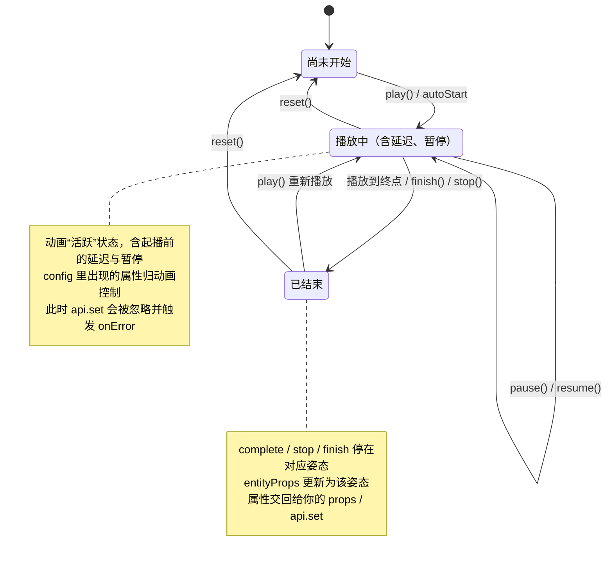

## 这是什么

`useEntityAnimation` 是一个 React Hook,用来给场景里的 3D 物体(Entity)做动画,让它平滑地移动、旋转或缩放。

`useEntityAnimation` 提供三大核心能力:

1. **关键帧动画(`timeline`)**:既能做“从 A 到 B”的简单动画,也能写 `0% → 50% → 100%` 这样的多段动画。
2. **动画结果回写(`entityProps`)**:Hook 会把动画的最终姿态交回给你,让物体在动画结束后稳稳停在终点。
3. **推荐的绑定方式(`xr-animation`)**:把动画绑定到物体上;也可以使用 `animation` 绑定。

> **几个基础名词**(下文会反复用到):
> - **Entity**:场景里的一个 3D 物体,比如一个盒子 `<BoxEntity>`。
> - **transform**:物体的空间姿态,由三部分组成——位置 `position`(单位:米)、旋转 `rotation`(单位:度)、缩放 `scale`(倍数,1 表示原始大小)。
> - **`Vec3`**:一个三维向量,形如 `{ x, y, z }`,用来表示上面每一部分的三个轴。
> - **分量**:指 `position` / `rotation` / `scale` 这三者之一。

---

## 我想做 X,该用什么(场景速查)

| 我想做的事 | 用什么 |
|---|---|
| 让物体从一个姿态移动/旋转/缩放到另一个姿态 | config 里写 `from` / `to` |
| 做多段关键帧动画(如 0% → 50% → 100%) | config 里写 `timeline` |
| 让动画结束后物体停在终点、不弹回起点 | 把 `{...entityProps}` 展开到组件上 |
| 动画结束后,用代码把物体挪到新姿态 | 调用 `api.set({ ... })` |
| 只让动画控制位置,旋转仍由我手动控制 | config 里只写 `position`,`rotation` 照常用 props 传 |
| 读取动画交回的最终姿态 | 读 `entityProps`(没有 `api.get`) |
| 控制播放(开始/暂停/继续/停止/重置) | `api.play()` / `pause()` / `resume()` / `stop()` / `reset()` / `finish()` |
| 判断运行环境是否支持动画 | `supports('useAnimation')` |

> **只支持 transform**:当前版本只能动画 `position` / `rotation` / `scale`,**不支持** `opacity`(透明度)、材质、颜色等。写了不支持的目标会直接报错,不会被悄悄忽略。

---

## 快速上手:一个完整例子

```tsx
import { useEntityAnimation } from '...'

function MyBox() {
  // 让盒子在 0.8 秒内向上移动 0.25 米,并放大到 1.1 倍
  const [animation, api, entityProps] = useEntityAnimation({
    from: { position: { x: 0, y: 0, z: 0.8 }, scale: { x: 1, y: 1, z: 1 } },
    to:   { position: { y: 0.25 },            scale: { x: 1.1, y: 1.1, z: 1.1 } },
    duration: 0.8,
    autoStart: true,
    onComplete: () => console.log('动画结束'),
  })

  return (
    <Reality>
      <SceneGraph>
        {/* entityProps 放在最后,保证动画结束后停在终点 */}
        <BoxEntity {...entityProps} xr-animation={animation} />
      </SceneGraph>
    </Reality>
  )
}
```

Hook 返回三个值,按顺序解构:

```tsx
const [animation, api, entityProps] = useEntityAnimation(config)
```

| 返回值 | 作用 |
|---|---|
| `animation` | 动画绑定对象,传给组件的 `xr-animation`(或 `animation`)属性 |
| `api` | 播放控制器,提供 `play / pause / resume / stop / reset / finish` 和 `set` |
| `entityProps` | 动画在关键节点交回的最终姿态(非逐帧实时值),形如 `{ position?, rotation?, scale? }`,展开到组件上即可 |

---

## 怎么描述动画(config)

### 方式一:from / to(从一个姿态到另一个)

```tsx
const [animation, api, entityProps] = useEntityAnimation({
  from: {
    position: { x: 0, y: 0, z: 0.8 },
    rotation: { x: 0, y: 0, z: 0 },
    scale: { x: 1, y: 1, z: 1 },
  },
  to: {
    position: { y: 0.25 },
    scale: { x: 1.1, y: 1.1, z: 1.1 },
  },
  duration: 0.8,
  autoStart: true,
})
```

`from` / `to` 都可以只写你关心的字段,没写的字段保持不变。

### 方式二:timeline(多段关键帧)

用百分比描述一段动画在不同时间点的姿态,适合更复杂的运动:

```tsx
const [animation, api, entityProps] = useEntityAnimation({
  duration: 1.2,
  timingFunction: 'easeInOut',
  timeline: {
    '0%': {
      position: { x: 0, y: 0, z: 0.8 },
      scale: { x: 1, y: 1, z: 1 },
    },
    '50%': {
      position: { y: 0.25 },
      scale: { x: 1.1, y: 1.1, z: 1.1 },
    },
    '100%': {
      position: { y: 0 },
      scale: { x: 1, y: 1, z: 1 },
    },
  },
})
```

### 可写的字段范围

config 里只能写以下这些字段(和 Entity 自身的属性层级保持一致):

```text
position.x / position.y / position.z
rotation.x / rotation.y / rotation.z
scale.x    / scale.y    / scale.z
```

写 `opacity` 等不支持的目标会报错或触发 `onError`,不会被悄悄忽略。

---

## 让动画结果停在终点(entityProps)

`entityProps` 是 Hook 返回的第三个值,是动画在关键节点(见下文“更新时机”)**交回给你的最终姿态**——它不是逐帧刷新的实时值。把它展开到组件上,物体就能在动画结束后停在终点:

```tsx
const [animation, api, entityProps] = useEntityAnimation({
  to: {
    position: { x: 0.1, y: 0, z: 0 },
    rotation: { y: 90 },
    scale: { x: 1, y: 1, z: 1 },
  },
})

return (
  <BoxEntity {...entityProps} xr-animation={animation} />
)
```

也可以用 `animation` 绑定:

```tsx
<BoxEntity {...entityProps} animation={animation} />
```

**动画完成后**,`entityProps` 会更新为终点姿态(位置、旋转、缩放),物体停在最后一帧,**不会弹回起点**。

**更新时机**:`entityProps` 不是每一帧都更新,只在这些关键节点更新:动画开始播放、完成、停止、重置、结束,以及 `api.set` 写入成功时。

> **注意**:在第一次播放、或第一次 `api.set` 成功之前,`entityProps` 可能是空的。不要在组件刚挂载时就假设它已经有值——要先播放一次动画,或成功调用一次 `api.set`,它才会有值。

---

## 动画结束后手动挪动物体(api.set)

动画播完后,如果你想用代码把物体移到新姿态,调用 `api.set`:

```tsx
// 把盒子抬高到 y = 0.3(其它保持不变)
api.set({ position: { y: 0.3 } })
```

几条规则:

1. **只在动画不处于播放状态时用**(包括:从未播放、已播完、已停止 / 重置)。只要动画正在播放(含延迟、暂停),调用 `api.set` 就会被忽略(不打断动画、也不会延后补播),并触发你在 config 里传入的 `onError` 回调;此时物体保持不变,`entityProps` 也不更新。想在动画进行中接管物体,请先停止动画,或等它结束。
2. **只传你想改的字段即可**,其余保持原样。例如 `api.set({ position: { y: 0.3 } })` 不会影响 `rotation` 或 `scale`。
3. **写入成功后 `entityProps` 会更新**为新姿态;如果写入未生效,`entityProps` 不变,并触发 `onError`。可以用它判断写入是否失败:
```tsx
useEntityAnimation({
  onError: error => console.error('api.set 写入失败', error),
})
```
4. **想基于当前值来改**?先读 `entityProps` 拿到当前姿态,自己算好新值,再传给 `api.set`。这里没有 `api.get`——因为在 React 里用取值函数容易读到过期的旧值、产生先读后写的冲突。
5. **它不是播放命令**:`api.set` 不会开始播放、也不改变播放进度。

### api.set 之后再播放的起点

- 如果 config 里声明了 `from`:从 `from` 开始播。
- 如果没声明 `from`:从当前姿态(也就是 `api.set` 刚写入的值)开始播。

---

## 动画和你的 props 谁说了算

物体的姿态可能同时被两边影响:你手动传的 props(含 `entityProps`),以及正在播放的动画。规则**按分量(`position` / `rotation` / `scale`)分别独立判断**:

| 情况 | 谁说了算 |
|---|---|
| 该分量写在了动画 config 里,且动画正在播放(含延迟、暂停) | 动画 |
| 其它情况(该分量没写进 config,或动画已结束 / 尚未开始) | 你的 props / `api.set` |

这套规则和 CSS 动画一致:动画播放时按属性接管这些 transform 属性,没被动画覆盖的属性、以及动画结束后,都交回给你控制。

由此可得几个常见结论:

- **动画正在播时**,写在 config 里的那些属性由动画接管,你此时用 props 改它们不会生效;没写进 config 的属性仍然照常由 props 控制。
- **“只让动画控制位置,旋转继续由 props 控制”是支持的**——只要 config 里只写 `position`、不写 `rotation` 即可。
- **动画结束后**,这些 transform 属性都恢复为由 props(含 `entityProps`)控制,物体停在终点。

### 推荐写法

把 `entityProps` 放在其它 props 的**后面**,这样动画结束后物体会正确停在终点,而不是被旧的 props 值覆盖:

```tsx
<BoxEntity
  position={basePosition}
  {...entityProps}
  xr-animation={animation}
/>
```

---

## api 方法总览

`api` 提供以下方法:

```tsx
api.play()     // 开始播放
api.pause()    // 暂停
api.resume()   // 从暂停处继续
api.stop()     // 停止
api.reset()    // 重置
api.finish()   // 直接跳到终态
api.set(values) // 设置姿态(见上文“动画结束后手动挪动物体”)
```

前六个是**播放控制**,操作动画的播放进度;`api.set` 是**设置姿态**,直接改物体的静止姿态,不影响播放进度。两者都是 `api` 上的方法,用途不同:需要控制动画时用前六个,需要在动画结束后手动摆放物体时用 `api.set`。

---

## 动画状态

一个动画在生命周期里会处在下面几种状态。理解这张图,能帮你判断:此刻 `api.set` 能不能用、`entityProps` 会不会更新、物体听谁的。



> 图里的“播放中”涵盖了起播前的**延迟等待**和**暂停**——只要动画还没结束、也没被重置,都算“活跃”,`api.set` 都会被拒绝。

### 每种状态下的行为

| 状态 | 怎么进入 | `api.set` 能用吗 | `entityProps` 会更新吗 | transform 归谁控制 |
|---|---|---|---|---|
| **尚未开始** | 初始状态;或 `reset()` 之后 | ✅ 能用 | 否(可能为空,别在挂载时就依赖它) | 你的 props |
| **播放中**(含延迟、暂停) | `play()` / `autoStart`;`pause()` 后仍属此类 | ❌ 被忽略,触发 `onError` | 仅在开始播放那一刻更新一次 | 动画(config 里出现的属性);其余归你的 props |
| **已结束** | 播放到终点、`complete` / `stop` / `finish` | ✅ 能用 | ✅ 更新为最终姿态(`stop` 停在当前、`finish`/`complete` 停在终点) | 你的 props / `api.set` |

> **提示**:循环动画没有自然的“播放到终点”,所以循环期间 `entityProps` 不会在每圈结束时更新,只有 `stop()` / `finish()` 或成功的 `api.set` 才会更新它。

---

## 事件回调(callback)

可以在 config 里传入回调,在动画不同阶段收到通知:

```tsx
useEntityAnimation({
  // ...
  onStart:    values => console.log('开始', values),
  onComplete: values => console.log('完成', values),
  onStop:     values => console.log('停止', values),
  onReset:    values => console.log('重置', values),
  onError:    error  => console.error('出错', error),
})
```

回调**只是通知**,它们的返回值会被忽略,不能用来决定物体最终停在哪里。要决定终点,请在播放前于 config 里声明(比如用 `to`),或在播放后通过 `entityProps` / `api.set` 接管。

回调收到的 `values` 只包含 Entity 支持的字段:

```text
{ position?: Vec3, rotation?: Vec3, scale?: Vec3 }
```

---

## 判断运行环境是否支持

用能力检测判断当前运行环境是否支持动画:

```tsx
supports('useAnimation')
```

含义:当前环境支持 Entity 通过 `xr-animation`(或 `animation`)绑定动画。

如果返回 `false`,说明当前环境不支持动画,建议跳过动画、直接用静态 props 把物体渲染到目标姿态:

```tsx
if (supports('useAnimation')) {
  return <BoxEntity {...entityProps} xr-animation={animation} />
}
// 不支持:直接渲染到最终姿态,不做动画
return <BoxEntity position={targetPosition} />
```

**当前版本只支持 transform(`position` / `rotation` / `scale`),不支持 `opacity`。**

---

## 当前版本的限制

当前版本**只能动画 transform**(`position` / `rotation` / `scale`),不支持透明度(`opacity`)、材质、颜色等其它属性。此外,一个动画对象只能绑定到一个物体,不能多个物体共享。

---

## 一句话总结

`useEntityAnimation` 用 `position / rotation / scale` 描述动画,支持百分比 `timeline`、`entityProps` 结果回写和推荐的 `xr-animation` 绑定;当前版本只支持 transform,不支持 opacity。
