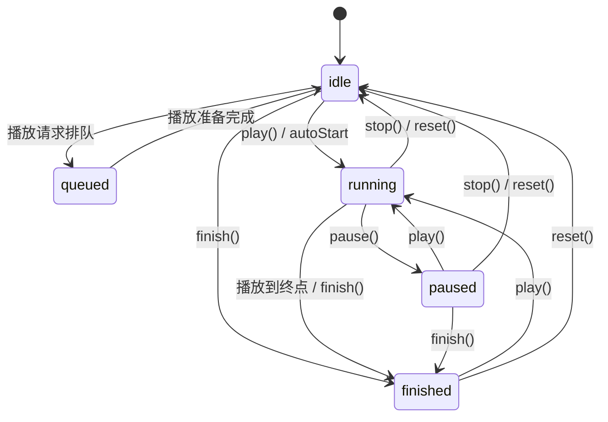

## 这是什么

`useEntityAnimation` 是一个 React Hook,用来给场景里的 3D 物体(Entity)做动画,让它平滑地移动、旋转或缩放。

`useEntityAnimation` 提供三大核心能力:

1. **关键帧动画(`timeline`)**:既能做“从 A 到 B”的简单动画,也能写 `0% → 50% → 100%` 这样的多段动画。
2. **动画结果回写(`entityProps`)**:Hook 会把动画的最终姿态交回给你,让物体在动画结束后稳稳停在终点。
3. **绑定方式(`animation`)**:通过组件的 `animation` 属性把动画绑定到物体上。

`useEntityAnimation` 保持为 experimental API,从 `@webspatial/react-sdk/experimental` 导入。

> **几个基础名词**(下文会反复用到):
> - **Entity**:场景里的一个 3D 物体,比如一个盒子 `<BoxEntity>`。
> - **transform**:物体的空间姿态,由三部分组成——位置 `position`(单位:米)、旋转 `rotation`(单位:度)、缩放 `scale`(倍数,1 表示原始大小)。
> - **`Vec3`**:一个三维向量,形如 `{ x, y, z }`,用来表示上面每一部分的三个轴。
> - **分量**:指 `position` / `rotation` / `scale` 这三者之一。

---

## 我想做 X,该用什么(场景速查)

| 我想做的事 | 用什么 |
|---|---|
| 让物体从一个姿态移动/旋转/缩放到另一个姿态 | config 里写顶层 `from` / `to`(最简写法),或 `timeline.from` / `timeline.to` |
| 做多段关键帧动画(如 0% → 50% → 100%) | config 里写 `timeline` |
| 让动画结束后物体停在终点、不弹回起点 | 把 `{...entityProps}` 展开到组件上 |
| 动画结束后,用代码把物体挪到新姿态 | 调用 `api.set({ ... })` |
| 只动画位置并保留其它分量 | 配置中只写 `position`;原生层从基准姿态补全 `rotation`、`scale`,播放期间接管完整变换,并通过 `entityProps` 回传完整的已提交变换 |
| 读取动画交回的最终姿态 | 读 `entityProps`(没有 `api.get`) |
| 控制播放(开始/暂停/停止/重置) | `api.play()` / `pause()` / `stop()` / `reset()` / `finish()` |
| 判断运行环境是否支持动画 | `supports('useEntityAnimation')` |

> **只支持 transform**:当前版本只能动画 `position` / `rotation` / `scale`,**不支持** `opacity`(透明度)、材质、颜色等。写了不支持的目标会直接报错,不会被悄悄忽略。

---

## 快速上手:一个完整例子

```tsx
import { useEntityAnimation } from '@webspatial/react-sdk/experimental'

function MyBox() {
  // 让盒子在 0.8 秒内向上移动 0.25 米,并放大到 1.1 倍
  const [animation, api, entityProps] = useEntityAnimation({
    timeline: {
      from: { position: { x: 0, y: 0, z: 0.8 }, scale: { x: 1, y: 1, z: 1 } },
      to:   { position: { y: 0.25 },            scale: { x: 1.1, y: 1.1, z: 1.1 } },
    },
    duration: 0.8,
    autoStart: true,
    onComplete: () => console.log('动画结束'),
  })

  return (
    <Reality>
      <SceneGraph>
        {/* entityProps 放在最后,保证动画结束后停在终点 */}
        <BoxEntity {...entityProps} animation={animation} />
      </SceneGraph>
    </Reality>
  )
}
```

Hook 返回三个值,按顺序解构:

```tsx
const [animation, api, entityProps] = useEntityAnimation(config)
```

| 返回值 | 作用 |
|---|---|
| `animation` | 动画绑定对象,传给组件的 `animation` 属性 |
| `api` | 播放控制器,提供 `play / pause / stop / reset / finish` 和 `set` |
| `entityProps` | 动画在关键节点交回的已提交姿态快照;首个已确认状态后包含完整的 `position`、`rotation`、`scale`,应展开到组件上 |

---

## 怎么描述动画(config)

公开 config 契约如下:

```ts
type TimingFunction = 'linear' | 'easeIn' | 'easeOut' | 'easeInOut'

type EntityMotionProps = {
  position?: Vec3
  rotation?: Vec3
  scale?: Vec3
}

// SDK 内部类型,不从 package public entry 导出。
type EntityMotionPatch = {
  position?: Partial<Vec3>
  rotation?: Partial<Vec3>
  scale?: Partial<Vec3>
}

type EntityMotionFrame = EntityMotionPatch & {
  timingFunction?: TimingFunction
}

type EntityMotionTimeline = {
  from?: EntityMotionFrame
  to?: EntityMotionFrame
} & Partial<Record<`${number}%`, EntityMotionFrame>>

type EntityPlaybackError = {
  code:
    | 'TARGET_NOT_FOUND'
    | 'UNSUPPORTED_TARGET'
    | 'ANIMATION_NOT_FOUND'
    | 'INVALID_TIMELINE'
    | 'COMPILATION_FAILED'
    | 'INVALID_CONTROL_STATE'
    | 'INVALID_SET_VALUES'
  reason: string
}

type EntityMotionConfig = {
  from?: EntityMotionPatch
  to?: EntityMotionPatch
  timeline?: EntityMotionTimeline
  duration?: number
  timingFunction?: TimingFunction
  delay?: number
  playbackRate?: number
  loop?: boolean | { reverse?: boolean }
  autoStart?: boolean
  onStart?: (values: EntityMotionProps) => void
  onComplete?: (values: EntityMotionProps) => void
  onStop?: (values: EntityMotionProps) => void
  onReset?: (values: EntityMotionProps) => void
  onError?: (error: EntityPlaybackError) => void
}
```

默认值为 `autoStart: true`、`timingFunction: 'easeInOut'`、`delay: 0`、`playbackRate: 1` 和 `loop: false`。每次全新执行先等待一次全局 `delay`,再播放运动;`playbackRate` 和 `loop` 仅作用于该运动,因此延迟不随播放速率缩放,也不在循环边界重复。包含 `timeline` 的 config 必须提供 `duration`;只有纯顶层 `from` / `to` 使用 0.3 秒默认值。非法 config 属于 programmer error,并同步抛错。

### 最简写法:顶层 from / to(从一个姿态到另一个)

如果只是“从一个姿态到另一个”,可以直接在 config 顶层写 `from` / `to`,不必嵌套进 `timeline`:

```tsx
const [animation, api, entityProps] = useEntityAnimation({
  from: { position: { x: 0, y: 0, z: 0.8 }, scale: { x: 1, y: 1, z: 1 } },
  to:   { position: { y: 0.25 },            scale: { x: 1.1, y: 1.1, z: 1.1 } },
  // 纯顶层 from/to 且没用百分比时,duration 默认 0.3 秒
  autoStart: true,
})
```

几条规则:

1. **等价于 `timeline.from` / `timeline.to`**:顶层 `from` / `to` 只是它的简写,内部会归一化成同一条时间轴,行为完全一致。
2. **两端都必须写**:顶层这一形态里,`from` 与 `to` 必须同时提供;只写其中一个会直接报错,不会用物体当前姿态去补另一端。
3. **纯顶层 from/to 时 `duration` 默认 0.3 秒**(在没有用百分比关键帧的前提下)。
4. **和 `timeline` 同时出现时,`timeline` 优先**:此时顶层 `from` / `to` 会被忽略,并在开发模式下打印一条警告。

### 方式一:timeline.from / timeline.to(从一个姿态到另一个)

```tsx
const [animation, api, entityProps] = useEntityAnimation({
  timeline: {
    from: {
      position: { x: 0, y: 0, z: 0.8 },
      rotation: { x: 0, y: 0, z: 0 },
      scale: { x: 1, y: 1, z: 1 },
    },
    to: {
      position: { y: 0.25 },
      scale: { x: 1.1, y: 1.1, z: 1.1 },
    },
  },
  duration: 0.8,
  autoStart: true,
})
```

`timeline.from` / `timeline.to` 里都可以只写你关心的**字段**,没写的字段保持不变。但**起止两端必须都写**:`timeline.from`(或 `0%` 帧)与 `timeline.to`(或 `100%` 帧)必须同时存在,只写一端会直接报错,不会用物体当前姿态或 baseline 去补另一端。

### 方式二:timeline(多段关键帧)

在 `timeline` 里用百分比描述一段动画在不同时间点的姿态,适合更复杂的运动:

```tsx
const [animation, api, entityProps] = useEntityAnimation({
  duration: 1.2,
  timingFunction: 'easeInOut',
  timeline: {
    '0%': {
      position: { x: 0, y: 0, z: 0.8 },
      scale: { x: 1, y: 1, z: 1 },
    },
    '50%': {
      position: { y: 0.25 },
      scale: { x: 1.1, y: 1.1, z: 1.1 },
    },
    '100%': {
      position: { y: 0 },
      scale: { x: 1, y: 1, z: 1 },
    },
  },
})
```

### 方式三:timeline 里混合 from / to 与百分比

在同一个 `timeline` 里,`from` 就是 `0%` 帧、`to` 就是 `100%` 帧,所以可以把 `from` / `to` 和中间的百分比 key 混着写。适合"两端用 from/to 直观表达、中间再插几个百分比关键帧"的场景:

```tsx
const [animation, api, entityProps] = useEntityAnimation({
  duration: 1.2,
  timingFunction: 'easeInOut',
  timeline: {
    from: {                              // 等价于 0%
      position: { x: 0, y: 0, z: 0.8 },
      scale: { x: 1, y: 1, z: 1 },
    },
    '50%': {
      position: { y: 0.25 },
      scale: { x: 1.1, y: 1.1, z: 1.1 },
    },
    to: {                                // 等价于 100%
      position: { y: 0 },
      scale: { x: 1, y: 1, z: 1 },
    },
  },
})
```

几点说明:

- **起止两端都要有**:起点(`from` 或 `0%`)和终点(`to` 或 `100%`)必须都写,缺任一端会直接报错;这里用 `from` + `to` 表达两端,自然满足。
- `from` 与 `0%`、`to` 与 `100%` 指的是同一帧,**不要在同一个 `timeline` 里同时写 `from` 和 `0%`(或 `to` 和 `100%`)**,否则重复定义同一帧会报错。
- 混合写法下 `duration` 不再默认 0.3 秒(0.3 秒的默认只在纯顶层 `from` / `to` 且未用任何百分比时生效),请显式给出 `duration`。

### 方式四:按全局时间段设置缓动函数

除了在 config 顶层写一个全局 `timingFunction`,你还可以在**单个关键帧**上写 `timingFunction`,让它和该帧的 `position` / `rotation` / `scale` 平级。**逐关键帧的 `timingFunction` 作用于当前全局时间轴节点到下一个全局时间轴节点之间的时间段**,优先级高于顶层的全局 `timingFunction`:

```tsx
const [animation, api, entityProps] = useEntityAnimation({
  duration: 1.2,
  timingFunction: 'linear',        // 全局默认:未单独指定的区间用 linear
  timeline: {
    '0%': {
      position: { x: 0, y: 0, z: 0.8 },
      timingFunction: 'easeIn',    // 作用于 0% → 50% 的全局时间段
    },
    '50%': {
      position: { y: 0.25 },
      timingFunction: 'easeOut',   // 作用于 50% → 100% 的全局时间段
    },
    '100%': {
      position: { y: 0 },          // 末帧没有下一段,无需写 timingFunction
    },
  },
})
```

几点说明:

- **平级于姿态字段**:`timingFunction` 写在某一帧内,和该帧的 `position` / `rotation` / `scale` 并列,描述从该全局时间轴节点到下一个全局时间轴节点的缓动。
- **可选值**:`'linear'` / `'easeIn'` / `'easeOut'` / `'easeInOut'`(驼峰写法,没有 `'ease-in'` 这种带连字符的形式)。
- **优先级**:某个全局时间段的缓动函数取「起始帧上的 `timingFunction`」,没有则回退到顶层全局 `timingFunction`,再没有则用默认值。
- **末帧无需写**:最后一个全局时间轴节点没有下一个时间段,写在末帧上的 `timingFunction` 不会生效。

### 可写的字段范围

config 里只能写以下这些字段(和 Entity 自身的属性层级保持一致):

```text
position.x / position.y / position.z
rotation.x / rotation.y / rotation.z
scale.x    / scale.y    / scale.z
```

写 `opacity` 等不支持的目标会在 config 校验阶段同步抛错。

---

## 让动画结果停在终点(entityProps)

`entityProps` 是 Hook 返回的第三个值,是动画在关键节点(见下文“更新时机”)**交回给你的最终姿态**——它不是逐帧刷新的实时值。把它展开到组件上,物体就能在动画结束后停在终点:

```tsx
const [animation, api, entityProps] = useEntityAnimation({
  duration: 0.8,
  timeline: {
    from: {
      position: { x: 0, y: 0, z: 0 },
      rotation: { y: 0 },
      scale: { x: 1, y: 1, z: 1 },
    },
    to: {
      position: { x: 0.1, y: 0, z: 0 },
      rotation: { y: 90 },
      scale: { x: 1, y: 1, z: 1 },
    },
  },
})

return (
  <BoxEntity {...entityProps} animation={animation} />
)
```

**动画完成后**,`entityProps` 更新为完整终点姿态,组合后的 React 属性让物体保持该姿态。初次创建失败会清空 `entityProps`;配置更新失败会保留当前动画和 `entityProps`。

**更新时机**:`entityProps` 在动画开始、完成、停止、重置、结束、配置更新成功或 `api.set` 成功时更新。初次创建失败时清空。

> **注意**:在第一次播放、或第一次 `api.set` 成功之前,`entityProps` 可能是空的。不要在组件刚挂载时就假设它已经有值——要先播放一次动画,或成功调用一次 `api.set`,它才会有值。

---

## 播放过程中更新 config

同一 Entity 的 config 变化会更新当前动画:

| 更新时状态 | 行为 |
|---|---|
| `delay` 或 `running` | 立即从当前姿态重新定向,从头执行新延迟和完整时长 |
| `paused` | 保持暂停;下次 `play` 从暂停姿态执行新时间轴 |
| `idle` 或 `finished` | 保持当前状态;下次 `play` 使用新 config 的起点 |

- 时间轴或播放参数变化都会触发重新定向。
- 当前姿态临时作为本次执行的起点,避免跳变。后续 `reset` 和重新播放仍使用新 config 声明的起点。
- 新时间轴从头执行。旧执行不触发 `onStop` 或 `onComplete`;新执行触发一次 `onStart`。
- 只更新回调不影响播放。`autoStart` 只作用于初次创建。
- 更新失败会保留当前动画和状态,并触发一次最新的 `onError`。

---

## 动画结束后手动挪动物体(api.set)

动画播完后,如果你想用代码把物体移到新姿态,调用 `api.set`:

```tsx
// 把盒子抬高到 y = 0.3(其它字段沿用当前值)
api.set({ position: { y: 0.3 } })
```

几条规则:

1. **在 `animation` 绑定完成后的空闲阶段调用**。播放完成、停止或重置后可以直接调用;播放期间先调用 `stop()`,随后调用 `api.set()`。
2. **在 `position`、`rotation` 和/或 `scale` 中传入至少一个受支持的 transform 标量**,其余字段沿用当前值。例如 `api.set({ position: { y: 0.3 } })` 更新 `position.y`,同时沿用当前 `rotation` 和 `scale`。
3. **写入成功后,`entityProps` 更新为 Entity 的完整当前姿态**。
4. **基于当前姿态更新时**,读取 `entityProps`、计算新值,再传给 `api.set`。`entityProps` 是当前姿态的数据来源。
5. **`api.set` 设置静止姿态**,播放进度沿用当前值。

`api.set` 返回 `void`。绑定不可用、正在创建、绑定生命周期已终止或 object 正在销毁与已经销毁时,SDK 输出一次 warning 并在本地完成 no-op。写入成功后,`entityProps` 更新为原生确认的完整姿态。

### api.set 之后再播放的起点

- 从 config 声明的起始帧(顶层 `from`、`timeline.from` 或 `0%` 帧)开始播。由于每个动画都必须写起点,不存在"没声明起始帧"的情况——缺起点的 config 在校验阶段就会被拒绝。
- 每次 fresh play 都在开始时读取物体的最新原生姿态。config 明确声明的字段从起始帧开始,config 未声明的字段以该最新姿态为本轮 baseline。因此在非活跃状态成功调用 `api.set` 后,下一次 fresh play 会采用修改后的值补全未声明字段。
- fresh play 包括创建后的首次 `play` / `autoStart`,以及动画完成、结束、停止或重置后再次 `play`。`pause` 后的 `play` 只是从当前进度恢复,不会读取新的 baseline;同一次播放里的循环也持续使用该轮 baseline。

---

## 谁控制 transform

组件把基础属性和 `entityProps` 组合为普通 React 属性。播放活跃期间,Native animation 暂时阻止这些普通 transform 写入:

| 情况 | 谁控制 transform |
|---|---|
| 播放空闲 | 组合后的 React 属性控制。首个确认值产生前 `entityProps` 为空,姿态由基础属性决定;确认后把完整 `entityProps` 放在最后展开即可保持该姿态。 |
| 动画正在播放、延迟或暂停 | Native animation 控制完整 transform 并阻止普通 React transform 写入;配置中未声明的分量保持基准姿态。 |
| 动画对象初次创建失败 | 当前绑定生命周期终止,`entityProps` 清空,其余 React 属性控制。 |
| 同一目标配置更新失败 | 旧执行、当前状态和 `entityProps` 保持不变。 |
| 动画解绑 | `entityProps` 清空,其余 React 属性控制。 |

这和 visionOS / picoOS 原生一致:底层绑定完整变换。动画活跃期间,配置字段执行动画,其余字段保持基准姿态。暂停保持 transform 写入保护。停止、重置、结束和自然完成会提交对应姿态、解除写入保护,并返回 Entity 当前的完整 transform,供 Core 更新 `entityProps`。

由此可得几个常见结论:

- **动画正在播时**,整个 transform 都由动画接管,你此时用 props 或 `api.set` 改任何分量都不会生效;没写进 config 的分量会被冻结在基准值。
- **播放空闲期间**,组合后的 React 属性控制 transform。使用 `api.set` 更新 Native 已提交 transform,并通过 `entityProps` 获得更新后的完整姿态。
- **动画对象初次创建失败后**,当前绑定终止,普通 React 变换属性恢复控制。重新开始需要显式解绑后再绑定,或创建新的 binding。
- **同一目标配置更新失败后**,binding 继续有效,旧动画继续执行,无需重新绑定。
- **动画解绑后**,`entityProps` 清空,其余 React 变换属性继续控制 Entity。

### 推荐写法

把 `entityProps` 放在其它 props 的**后面**,这样动画结束后物体会正确停在终点,而不是被旧的 props 值覆盖:

```tsx
<BoxEntity
  position={basePosition}
  {...entityProps}
  animation={animation}
/>
```

`entityProps` 获得已确认值后,把它放在 `basePosition` 后展开,它就是 React 最终传入的 transform 值。调用 `api.set` 可以修改 Native 已提交 transform 并更新 `entityProps`。

---

## api 方法总览

`api` 提供以下方法:

```tsx
interface EntityPlaybackApi {
  play(): void
  pause(): void
  stop(): void
  reset(): void
  finish(): void
  set(update: EntityMotionPatch): void
  readonly playState: 'queued' | 'idle' | 'running' | 'paused' | 'finished'
  readonly isAnimating: boolean
  readonly isPaused: boolean
  readonly finished: boolean
}
```

前五个方法控制动画的播放进度。`api.set` 设置物体的静止姿态,同时沿用当前播放进度。播放控制使用前五个方法;动画结束后的姿态调整使用 `api.set`。

---

## 动画状态

一个动画在生命周期里会处在下面几种状态。理解这张图,能帮你判断:此刻 `api.set` 能不能用、`entityProps` 会不会更新、物体听谁的。


```mermaid
stateDiagram-v2
    [*] --> idle
    idle --> queued: 播放请求排队
    queued --> idle: 播放准备完成
    idle --> running: play() / autoStart
    idle --> finished: finish()
    running --> paused: pause()
    paused --> running: play()
    running --> idle: stop() / reset()
    paused --> idle: stop() / reset()
    running --> finished: 播放到终点 / finish()
    paused --> finished: finish()
    finished --> running: play()
    finished --> idle: reset()
```

`running` 包含起播前的延迟等待。`queued` 表示播放请求已提交并等待执行。`autoStart` 和初始化阶段调用 `play()` 会进入该状态。播放开始后,状态变为 `running`。

初次创建失败时,`onError` 触发一次,状态变为 `idle`,`entityProps` 清空。后续调用会输出警告。重新绑定后可以重试。配置更新失败时,当前动画继续有效。

| `playState` | `isAnimating` | `isPaused` | `finished` |
|---|---|---|---|
| `queued` | `false` | `false` | `false` |
| `idle` | `false` | `false` | `false` |
| `running` | `true` | `false` | `false` |
| `paused` | `false` | `true` | `false` |
| `finished` | `false` | `false` | `true` |

### 每种状态下的行为

| 状态 | 怎么进入 | `api.set` 能用吗 | `entityProps` 会更新吗 | transform 归谁控制 |
|---|---|---|---|---|
| **初始状态** | 首个已确认值产生之前 | 原生动画对象创建后 ✅ 能用 | 首次确认时填充 | 组合后的 React 属性控制;`entityProps` 为空 |
| **播放中**(含延迟、暂停) | `play()` / `autoStart`;`pause()` 后仍属此类 | ❌ 被拒绝(noop + 警告) | 仅在开始播放那一刻更新一次 | 动画接管整个 transform;config 未声明的字段冻结在本轮 fresh-play baseline |
| **已有确认值的播放空闲状态** | `complete`、`stop`、`reset`、`finish`,或成功的 `api.set` | ✅ 能用 | ✅ 包含完整的已提交变换 | 组合后的 React 属性控制;把 `entityProps` 放在最后展开 |
| **终止绑定** | 动画对象初次创建失败 | ❌ 所有 API 均为 noop + 警告 | 清空为 `{}` | 其余 React 属性控制;重新开始需要显式重新绑定 |

> **提示**:循环动画没有自然的“播放到终点”,所以循环期间 `entityProps` 不会在每圈结束时更新,也不会在每圈重新读取 baseline。`stop()`、`reset()` 或 `finish()` 会更新 `entityProps`;动画进入非活跃状态后,成功的 `api.set()` 也会更新 `entityProps`。

文档化 capability 从 visionOS 的 WSAppShell `1.9.0` 和 picoOS 的 PicoWebApp `0.7.0` 开始可用。

---

## 事件回调(callback)

可以在 config 里传入回调,在动画不同阶段收到通知:

```tsx
useEntityAnimation({
  // ...
  onStart:    values => console.log('开始', values),
  onComplete: values => console.log('完成', values),
  onStop:     values => console.log('停止', values),
  onReset:    values => console.log('重置', values),
  onError:    error  => console.error('出错', error),
})
```

回调**只是通知**,它们的返回值会被忽略,不能用来决定物体最终停在哪里。要决定终点,请在播放前于 config 里声明(比如用顶层 `to` 或 `timeline.to`),或在播放后通过 `entityProps` / `api.set` 接管。

回调收到的 `values` 只包含 Entity 支持的字段:

```text
{ position?: Vec3, rotation?: Vec3, scale?: Vec3 }
```

---

## 判断运行环境是否支持

用能力检测判断当前运行环境是否支持动画:

```tsx
supports('useEntityAnimation')
```

含义:当前环境支持 Entity 通过 `animation` 绑定动画。

如果返回 `false`,说明当前环境不支持动画,建议跳过动画、直接用静态 props 把物体渲染到目标姿态:

```tsx
if (supports('useEntityAnimation')) {
  return <BoxEntity {...entityProps} animation={animation} />
}
// 不支持:直接渲染到最终姿态,不做动画
return <BoxEntity position={targetPosition} />
```

**当前版本只支持 transform(`position` / `rotation` / `scale`),不支持 `opacity`。**

---

## 当前版本的限制

当前版本**只能动画 transform**(`position` / `rotation` / `scale`),不支持透明度(`opacity`)、材质、颜色等其它属性。此外,一个动画对象只能绑定到一个物体,不能多个物体共享。

---

## 一句话总结

`useEntityAnimation` 用 `position / rotation / scale` 描述动画,支持顶层 `from` / `to` 简写、百分比 `timeline`、`entityProps` 结果回写和 `animation` 绑定;当前版本只支持 transform,不支持 opacity。