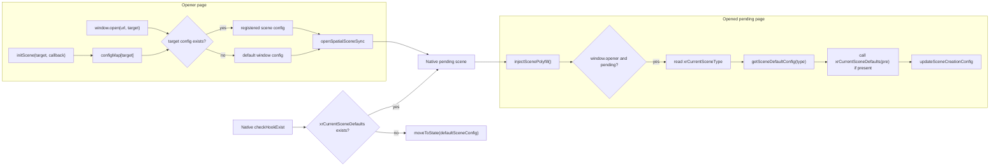
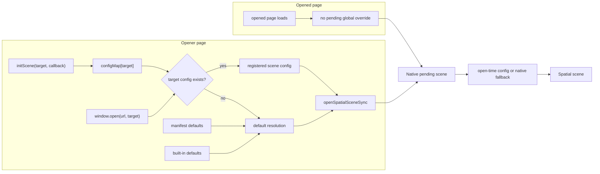
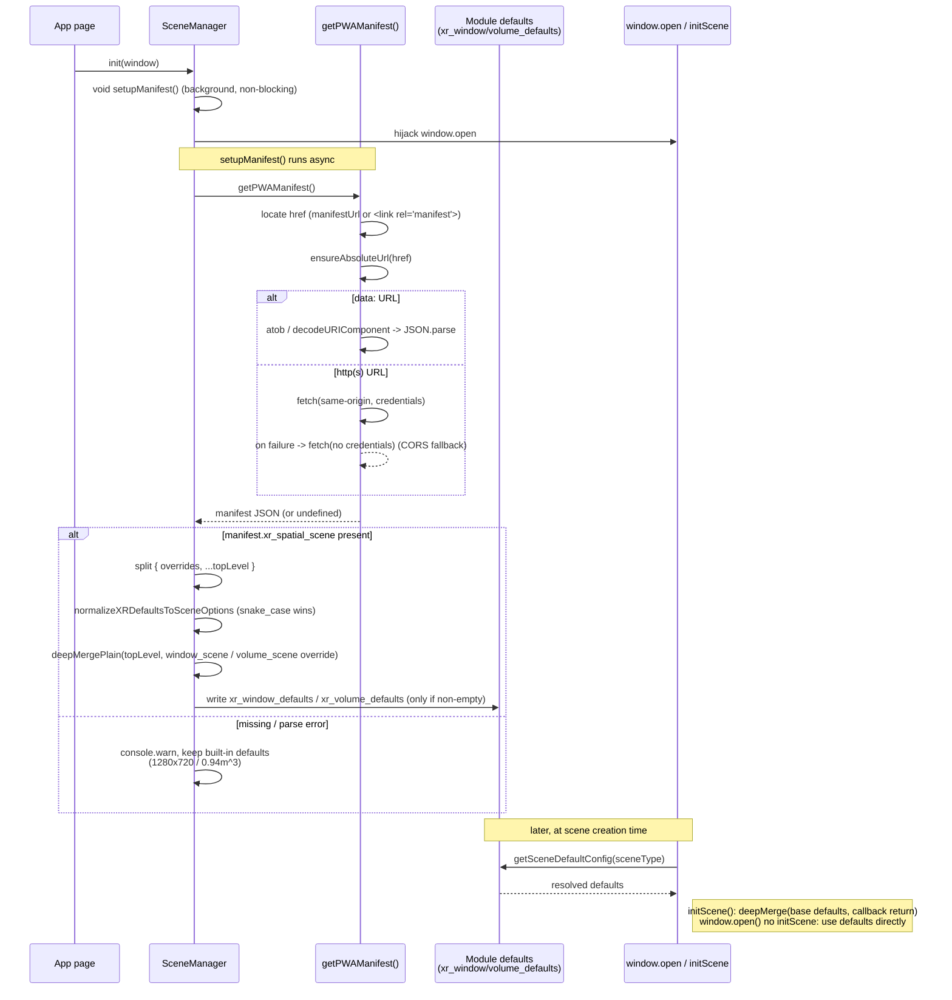

## Context

Scene configuration currently spans the Core SDK scene polyfill, React SDK exports/types, and visionOS native scene creation. `initScene()` is the supported customization API and must remain available. The requested removal targets the undocumented `window.xrCurrentSceneDefaults` and `window.xrCurrentSceneType` scene globals, while `window.open` must continue to work when the app has not called `initScene()` by using existing scene defaults from manifest processing and native fallback behavior.

## Architecture Change

Before this change, there are two separate scene configuration paths. The opener page uses named `initScene()` config or default window config when calling `window.open`. The opened pending page can then run `injectScenePolyfill()` and override the pending native scene by reading `window.xrCurrentSceneType` and `window.xrCurrentSceneDefaults`.

After this change, the opener-side `window.open` behavior keeps the same named-vs-default split, but the opened page no longer has a global-hook path that mutates pending scene config. Pending native scenes proceed from the open-time config and native fallback behavior instead of waiting for or checking deleted globals.

The impact boundary is the pending scene config override path that used `window.xrCurrentSceneDefaults` / `window.xrCurrentSceneType`, plus the native existence check for that path. This does not remove `initScene()`, opener-side named scene config, manifest defaults, native fallback defaults, general page initialization, or the native `SpatialScene` lifecycle used by supported spatial APIs.

## Manifest Default-Resolution Chain

`SceneManager.setupManifest()` bakes the PWA manifest `xr_spatial_scene` config into module-level `xr_window_defaults` / `xr_volume_defaults` once at init. These defaults are the fallback source that both `initScene()` and no-`initScene()` `window.open` read through `getSceneDefaultConfig(sceneType)`. This chain is independent of the removed scene globals, which is why `window.open` still resolves defaults after the hook removal.

Ownership note: the manifest -> defaults chain is the single source of scene defaults. This change does not add a JS-side default model; it only deletes the opened-page global override that previously sat on top of this chain.

## Goals / Non-Goals

**Goals:**

- Remove `window.xrCurrentSceneDefaults` and `window.xrCurrentSceneType` from public TypeScript/global API exposure and runtime behavior.
- Preserve `initScene()` behavior and its existing callback/default precedence.
- Keep `window.open` functional without prior `initScene()` by resolving the same scene defaults already owned by manifest/native fallback layers.
- Remove the visionOS native `checkHookExist` path that only exists to detect the deleted globals before advancing a pending scene.
- Make the opened-page `window.xrCurrentSceneDefaults(pre)` runtime override unsupported; callers must use opener-side `initScene(target, ...)`, manifest defaults, or fallback defaults instead.
- Keep the change surgical: delete the obsolete surface and route fallback behavior through existing default-resolution paths.

**Non-Goals:**

- Do not remove or deprecate `initScene()`.
- Do not introduce a new JavaScript-side default scene configuration model.
- Do not define concrete default dimensions, styles, or scene values in this change; those remain owned by manifest configuration and native fallback.
- Do not refactor unrelated `SpatialScene` APIs used for supported scene operations such as coordinate conversion, inspection, or spatialized element management.

## Decisions

1. Hard-delete the undocumented globals instead of shipping compatibility shims.

   Rationale: the APIs are not documented as public SDK contracts, so retaining shims would preserve an internal coupling without a supported migration need.

   Alternative considered: keep the properties but return `undefined` or warn. This would keep observable runtime surface area and could hide accidental internal dependencies.

2. Treat `window.open` fallback as a scene default-resolution responsibility, not a window-global responsibility.

   Rationale: current scene defaults already come from built-in defaults, manifest-derived defaults, per-scene overrides, and native fallback. `window.open` without `initScene()` should use that path directly rather than reading deleted globals.

   Alternative considered: create a new JS fallback object for `window.open`. This would duplicate default ownership and risk drift from manifest/native behavior.

3. Preserve `initScene()` as the named-scene customization mechanism.

   Rationale: callers that need explicit scene configuration should continue to use the documented API. This change only removes undocumented global state.

   Alternative considered: fold all customization into `window.open` features or manifest data. That is outside the requested scope and would create a larger migration.

4. Scope native cleanup to the visionOS deleted-global check, not the whole `SpatialScene` model.

   Rationale: visionOS native `SpatialScene` remains the supported runtime object for scene lifecycle and spatial content. The removal should target `didFinishLoad -> checkHookExist()` behavior that exists only because JavaScript globals were used as scene hooks.

   Alternative considered: broad native scene refactor. That would mix unrelated architecture work into an API deletion.

## Risks / Trade-offs

- Internal dependency risk: native or test code may still depend on global existence checks before applying fallback defaults. Mitigation: add failing tests first for `window.open` without `initScene()` and for absence of the removed globals, then delete the dependency.
- Fallback drift risk: JS-side fallback could diverge from manifest/native defaults. Mitigation: reuse existing default-resolution functions and platform fallback behavior instead of introducing new default values.
- Pending visibility risk: deleting `checkHookExist` without replacing the state transition could leave a visionOS pending scene stuck invisible. Mitigation: implementation must explicitly preserve pending-scene advancement using open-time config or the existing native fallback path.

## Migration Plan

1. Add tests that fail while the deleted globals remain exposed or while `window.open` depends on prior `initScene()` setup.
2. Remove public/global type declarations for the deleted APIs.
3. Remove Core SDK scene polyfill reads/writes for the deleted APIs and route no-`initScene()` `window.open` through existing default resolution.
4. Remove the visionOS `checkHookExist` global check and ensure `didFinishLoad` still advances pending scenes using open-time config or the existing native fallback path.
5. Clean demos/tests that manually assign the deleted globals, replacing them with `initScene()` or manifest-driven defaults where they are still testing supported behavior.
6. Run targeted Core SDK tests, React public-surface/type tests, and available visionOS checks.

Rollback is to restore the removed declarations and global-dependent runtime/native logic from the previous revision. Since the intended implementation is deletion-oriented and scoped, rollback should not require data migration.
