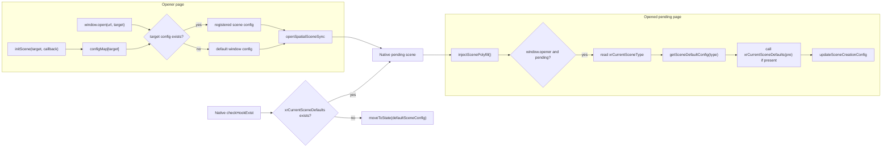
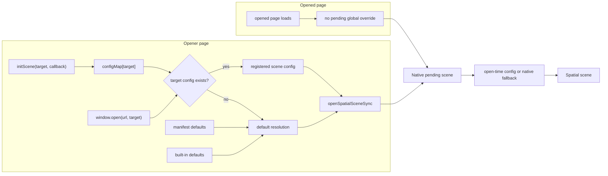

## 背景

Scene 配置目前横跨 Core SDK scene polyfill、React SDK 导出/类型，以及 visionOS native scene 创建逻辑。`initScene()` 是受支持的自定义 API，必须保留。本次删除目标是未公开文档化的 `window.xrCurrentSceneDefaults` 和 `window.xrCurrentSceneType` scene globals；同时，在应用未调用 `initScene()` 时，`window.open` 仍必须通过 manifest 处理和 native fallback 行为提供的现有 scene 默认配置打开。

## 架构变化

改造前，scene 配置有两条不同链路。发起侧页面在调用 `window.open` 时使用 named `initScene()` 配置，或在没有匹配配置时使用默认 window 配置；被打开的 pending 页面随后可能运行 `injectScenePolyfill()`，通过读取 `window.xrCurrentSceneType` 和 `window.xrCurrentSceneDefaults` 再覆盖 pending native scene 配置。

改造后，发起侧 `window.open` 仍保留 named config 和默认配置的分支；但被打开页面不再通过 global hook 修改 pending scene config。Native pending scene 不再等待或检查被删除 globals，而是依赖 open-time config 和 native fallback 行为继续打开。

本次影响边界是删除依赖 `window.xrCurrentSceneDefaults` / `window.xrCurrentSceneType` 的 pending scene config override path，以及 native 对这条路径的存在性检查。不删除 `initScene()`、发起侧 named scene config、manifest defaults、native fallback defaults、通用页面初始化，也不删除受支持 spatial API 依赖的 native `SpatialScene` 生命周期。

## 目标 / 非目标

**目标：**

- 从 public TypeScript/global API 暴露和运行时行为中删除 `window.xrCurrentSceneDefaults` 和 `window.xrCurrentSceneType`。
- 保留 `initScene()` 行为，以及它现有的 callback/default 优先级。
- 未提前调用 `initScene()` 时，`window.open` 仍可通过 manifest/native fallback 层已有的 scene 默认配置正常打开。
- 删除 visionOS native 中仅用于在 pending scene 推进前检测被删除 globals 的 `checkHookExist` 路径。
- 不再支持 opened-page 侧的 `window.xrCurrentSceneDefaults(pre)` 运行时覆盖；调用方应改用发起侧 `initScene(target, ...)`、manifest defaults 或 fallback defaults。
- 保持变更收敛：删除过期表面积，并让兜底行为复用现有默认配置解析路径。

**非目标：**

- 不删除或废弃 `initScene()`。
- 不新增一套 JavaScript 侧默认 scene 配置模型。
- 不在本变更中定义具体默认尺寸、样式或 scene 值；这些仍由 manifest 配置和 native fallback 负责。
- 不重构与本次删除无关的 `SpatialScene` API，例如坐标转换、inspect、spatialized element 管理等受支持能力。

## 决策

1. 硬删除未文档化 globals，不提供兼容 shim。

   原因：这些 API 不是公开文档化的 SDK 契约；保留 shim 会继续维持内部耦合，而且没有明确的对外迁移需求。

   备选方案：保留属性但返回 `undefined` 或打印 warning。该方案仍保留可观察运行时表面积，也可能掩盖内部误依赖。

2. 将 `window.open` 兜底视为 scene 默认配置解析职责，而不是 window global 职责。

   原因：当前 scene 默认值已经来自 built-in defaults、manifest-derived defaults、per-scene overrides 和 native fallback。未调用 `initScene()` 的 `window.open` 应直接走这条路径，而不是读取被删除 globals。

   备选方案：为 `window.open` 新增一个 JS fallback 对象。该方案会复制默认配置所有权，并有和 manifest/native 行为漂移的风险。

3. 保留 `initScene()` 作为 named scene 自定义机制。

   原因：需要显式 scene 配置的调用方应继续使用文档化 API。本次变更只删除未文档化的 global 状态。

   备选方案：把所有自定义都合并进 `window.open` features 或 manifest 数据。这超出当前范围，也会引入更大的迁移。

4. Native 清理只限定在 visionOS 的 deleted-global check，不重构整个 `SpatialScene` 模型。

   原因：visionOS native `SpatialScene` 仍是 scene 生命周期和 spatial content 的受支持运行时对象。删除范围应聚焦于仅因 JavaScript globals 作为 scene hook 而存在的 `didFinishLoad -> checkHookExist()` 行为。

   备选方案：做大范围 native scene 重构。该方案会把无关架构工作混入 API 删除。

## 风险 / 权衡

- 内部依赖风险：native 或测试代码可能依赖 global 存在性检查后才应用 fallback defaults。缓解：先补失败测试，覆盖未调用 `initScene()` 的 `window.open` 和被删除 globals 不存在，再删除依赖。
- 兜底漂移风险：JS 侧新兜底值可能与 manifest/native defaults 不一致。缓解：复用现有默认配置解析函数和平台 fallback 行为，不新增默认值。
- Pending 可见性风险：如果删除 `checkHookExist` 后没有保留状态推进，visionOS pending scene 可能卡在不可见状态。缓解：实现必须明确保留 pending scene advancement，使用 open-time config 或现有 native fallback 路径。

## 迁移计划

1. 先添加失败测试，确保被删除 globals 仍暴露时会失败，或 `window.open` 依赖预先 `initScene()` 时会失败。
2. 删除被移除 API 的 public/global 类型声明。
3. 删除 Core SDK scene polyfill 中对被移除 API 的读写，并让未调用 `initScene()` 的 `window.open` 复用现有默认配置解析。
4. 删除 visionOS `checkHookExist` global 检查，并确保 `didFinishLoad` 仍会使用 open-time config 或现有 native fallback 路径推进 pending scene。
5. 清理手动赋值被删除 globals 的 demo/test；仍需测试受支持行为时，改用 `initScene()` 或 manifest-driven defaults。
6. 运行定向 Core SDK 测试、React public-surface/type 测试，以及可用的 visionOS 检查。

回滚方式是从上一版本恢复被删除的声明，以及依赖 globals 的 runtime/native 逻辑。由于预期实现是收敛的删除型改动，回滚不需要数据迁移。
