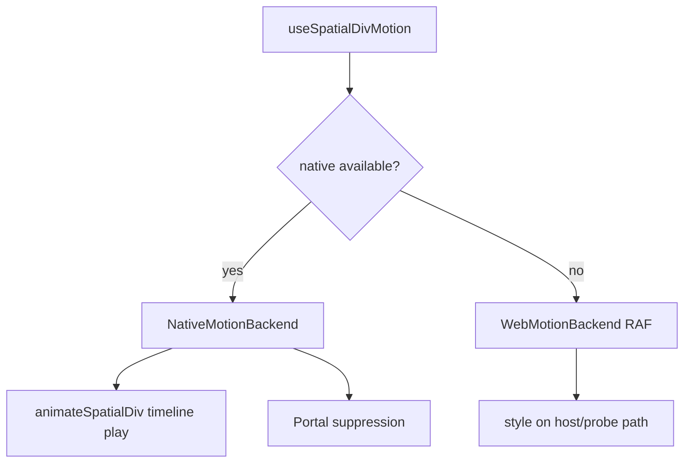

## Context

SpatialDiv sync uses host + probe DOM with field-level and transform-wide suppression during native animation (see `packages/react/src/spatialized-container/ARCHITECTURE.md`). Plan A (session API) adds `animation` prop binding and a single native segment. Plan B (this design) keeps suppression and bridge infrastructure but replaces the **authoring model** with a **timeline document** and a **single `style` outlet**.

## Goals / Non-Goals

**Goals:**

- Timeline-first config with per-track keyframes and global `duration`.
- `useSpatialDivMotion` returns `{ style, api }` for `<div enable-xr style={...} />`.
- **Dual backend:** native timeline when `supports('useAnimation', ['element'])` and spatial binding exists; otherwise Web RAF backend (must not no-op).
- `useSpatialDivMotion.simple()` sugar for two-keyframe single-segment animations (parity with Plan A minimal case).
- Reuse Plan A bridge, Manager, suppression, SRT compose on native.

**Non-Goals:**

- Full `@react-spring/web` physics simulation in v1 (easing + keyframes only; spring curves may be added later or pre-sampled).
- Animating layout/size fields (`width`, `height`, `back`, `depth`).
- Arbitrary CSS transform strings on the motion path.
- Changing entity `useAnimation` entity branch behavior.

## API Surface

```typescript
function useSpatialDivMotion(
  config: SpatialDivMotionConfig,
): {
  style: SpatialDivMotionStyle
  api: SpatialDivMotionApi
  /** Spatial runtime only — runtime binding; see "Integration & documentation". */
  motion?: SpatialDivMotionBindingInternal
}

namespace useSpatialDivMotion {
  function simple(config: SpatialDivMotionSimpleConfig): ReturnType<typeof useSpatialDivMotion>
}
```

### SpatialDivMotionConfig

```typescript
interface SpatialDivMotionConfig {
  /** Global timeline length in seconds. Must be > 0 and finite. */
  duration: number
  tracks: SpatialDivMotionTrack[]
  delay?: number
  autoStart?: boolean
  loop?: boolean | { reverse?: boolean }
  playbackRate?: number
  onStart?: () => void
  onComplete?: (values: SpatialDivAnimatedValues) => void
  onCancel?: (values: SpatialDivAnimatedValues) => void
  onError?: (error: AnimationError) => void
}

interface SpatialDivMotionTrack {
  property: SpatialDivMotionProperty
  keyframes: Array<{ at: number; value: number }>
  easing?: TimingFunction
}
```

`SpatialDivMotionProperty` is one of: `opacity`, `transform.translate.x|y|z`, `transform.rotate.x|y|z`, `transform.scale.x|y|z`.

### Style outlet

`SpatialDivMotionStyle` is `React.CSSProperties` restricted to animated fields the hook owns (`opacity`, `transform` as a composed string). Layout fields remain on the caller's static `style` merge: `style={{ width: 300, ...motion.style }}`.

## Dual backend



**Native available** when: `supports('useAnimation', ['element']) === true` AND implementation has bound `Spatialized2DElement` (future: same binding hook as Plan A, driven by motion controller instead of `animation` prop).

**Web backend** runs for plain browsers and as fallback before spatial bind; it MUST drive the same `style` shape.

**Native `style` outlet during playback:** While `running`, native owns animated fields and Portal suppression blocks DOM sync from intermediate `style` samples. The hook still exposes a single `style` merge target, but authors should treat **pause / complete / cancel** as the boundaries where `style` is sampled via `evaluateMotionTimeline` (pause uses wall-clock progress tracked in the motion session). Do not poll `style` mid-native-run for acceptance.

## Timeline compilation

- **Validation:** keyframes sorted by `at`; `at` in `[0, duration]`; at least two keyframes per track; no duplicate `property` paths across tracks; numeric ranges match Plan A whitelist rules.
- **Evaluation at time `t`:** for each track, find segment `[k_i, k_{i+1}]`, apply easing, lerp scalar; assemble `SpatialDivAnimatedValues`; compose CSS `transform` translate → rotate → scale.
- **Hold:** before first keyframe, use first value; after last, use last value.

## Native evolution (Plan A reuse)

Extend `AnimateSpatialized2DElement` `play` payload:

```typescript
{
  type: 'play',
  animationId: string,
  elementId: string,
  timeline: {
    duration: number,
    delay?: number,
    playbackRate?: number,
    loop?: ...,
    tracks: Array<{
      property: string,
      keyframes: Array<{ t: number; value: number }>, // t normalized 0..1 or seconds — pick seconds in impl
      easing: string,
    }>,
  },
}
```

`SpatialDivAnimationSession` keeps DisplayLink/pause/cancel; replaces single progress lerp with `TimelineEvaluator`.

## simple() sugar

`simple({ from, to, duration, ... })` → one timeline with tracks inferred from keys present in `from`/`to`, each track keyframes `[{ at: 0, value: from }, { at: duration, value: to }]`.

## Integration & documentation

### Public surface vs runtime binding

The **authoring contract** for applications is `{ style, api }` (and `useSpatialDivMotion.simple()` sugar). Animated values MUST be merged via `style` only; the motion path MUST NOT use Plan A’s `animation` prop.

**Native WebSpatial runtime** additionally requires an internal **element binding** so `useSpatialDivMotion` can attach to the `Spatialized2DElement` created by `PortalSpatializedContainer` and apply suppression. Today this is exposed as an optional third hook return and DOM prop:

| Field / prop | Audience | Role |
| --- | --- | --- |
| `style` | All environments | Animated `opacity` / `transform` outlet (Web RAF or display during native run) |
| `api` | All environments | `play`, `pause`, `cancel`, lifecycle |
| `motion` (hook) / `motion` (prop) | Spatial + `supports('useAnimation', ['element'])` | **Runtime binding handle** — not timeline config, not CSS |

When `supports('useAnimation', ['element'])` is `false` (plain browser), `motion` is `undefined` and applications need only `style` + `api`.

### Documenting `motion` for developers

Docs MUST present:

1. **Quick start (default):** hook + `<div enable-xr style={{ ...layout, ...style }} />` — sufficient in Chrome/Safari.
2. **Spatial runtime (advanced):** same node also passes `motion={motion}` from the hook when defined — described as **SDK runtime wiring**, analogous to Plan A’s `animation={animation}` but separate from animated values (which live in `style`).
3. **Do not:** mutate `__setElement` / `__getSuppressedFields`; treat `motion` as a second style object; confuse with Framer Motion’s `<motion.div>`.

Recommended doc titles: “Runtime binding (`motion`, spatial only)”, “Why Web does not need `motion`”.

### Optional `MotionSpatialDiv` wrapper (recommended DX)

The SDK MAY ship a thin `MotionSpatialDiv` (or equivalent) that:

- Calls `useSpatialDivMotion` internally **or** accepts `{ style, api, motion }` from the caller
- Renders `<div enable-xr motion={motion} style={{ ...layout, ...style }} />` internally

When using the wrapper, **application code does not pass `motion` manually**; binding remains required inside the SDK. This mirrors `@react-spring/web`’s `animated(Component)` pattern (binding inside the wrapper; app only spreads spring `style`).

`MotionSpatialDiv` is optional; low-level `motion` prop remains supported for custom trees and test-server demos until the wrapper is the documented default.

### Comparison to React Spring (documentation only)

`@react-spring/web` interop in test-server uses `useSpring` → `style` on `animated(withSpatialized2DElementContainer('div'))`. There is **no** separate `binding` prop: `animated()` owns the DOM/ref attachment.

WebSpatial differs because the spatial target is a **Portal-created `Spatialized2DElement`**, not the same React DOM node as the hook’s callsite. Hence an explicit binding channel (`motion` or Plan A `animation`).

Plan B Web backend is ergonomically similar to Spring (style-driven keyframes in the browser); native playback still uses the WebSpatial bridge, not Spring driving visionOS entities.

### Relationship to Plan A `animation` prop

| | Plan A session | Plan B motion |
| --- | --- | --- |
| Animated values | `style` + `animation` channel | **`style` only** |
| Portal binding prop | `animation` | `motion` |
| Plain Web `play()` | no-op | Web backend MUST animate |

Binding mechanism is reused; only the prop name and value channel split differ.

## Decisions

1. **New hook name** — `useSpatialDivMotion` avoids overloading `useAnimation` semantics.
2. **No `animation` prop on motion path** — reduces dual-channel bugs; Plan A remains for comparison only.
3. **Web backend is normative** — not a dev-only fallback.
4. **Reuse `supports('useAnimation', ['element'])`** for native gate only.
5. **Strangler implementation** — ship Web backend + spec first on proposal branch; native timeline in follow-up tasks.

## Risks

- Web/native visual parity — document allowed easing differences; test canonical multi-track scenario on both.
- Native timeline scope — mitigated by phased tasks.
- Concurrent Mode — same limitation as Plan A (suppression tied to React render); document.
