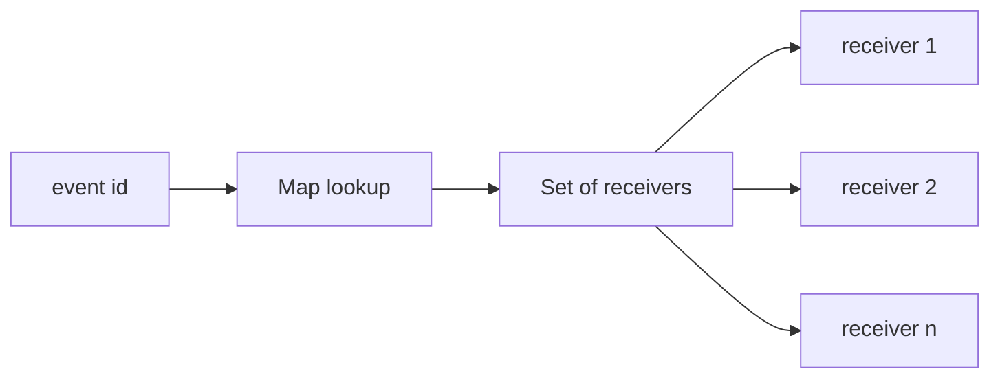
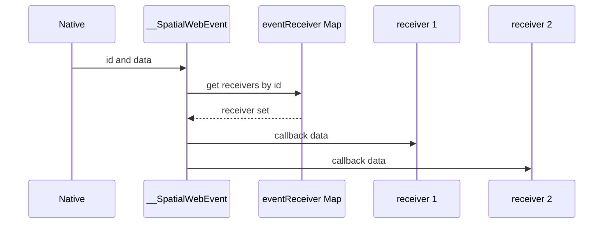

## Context

`SpatialWebEvent` is the SDK's shared bridge for routing native-originated event payloads back into JavaScript. Multiple parts of the SDK register listeners under shared ids such as scene objects, window-level metric listeners, and one-shot platform adapter callbacks. This branch changes the internal storage from one callback per id to many callbacks per id, so the OpenSpec design needs to define registration, dispatch, and cleanup semantics explicitly.

## Goals / Non-Goals

**Goals:**
- Allow one event id to fan out a payload to multiple registered receivers.
- Support both full-id cleanup and single-callback removal.
- Ensure internal storage is cleaned up after the last receiver is removed.
- Preserve compatibility for existing single-receiver call sites.

**Non-Goals:**
- Changing the payload shape delivered to callbacks.
- Introducing receiver ordering guarantees beyond the underlying collection semantics.
- Adding receiver priorities, once-only listeners, or wildcard subscriptions.
- Changing consumer-side event bubbling behavior in higher-level classes.

## Decisions

### Decision: Store receivers as Map of Sets

Each event id maps to a `Set` of callbacks instead of a single callback value.

Rationale:
- `Map<string, Set<fn>>` keeps id lookup cheap and makes duplicate callback registration idempotent for the same function reference.
- It matches the branch implementation and avoids overwriting earlier listeners.

Alternative considered:
- `Map<string, fn[]>`. Rejected because callback removal is less direct and duplicate entries are easier to accumulate accidentally.

### Decision: Dispatch fans out to every receiver currently registered for the id

When `window.__SpatialWebEvent` receives an `{ id, data }` payload, it loads the current receiver set for that id and invokes each callback with the same payload data. The dispatch loop must isolate per-receiver failures so one throwing callback does not prevent the remaining receivers from running.

Rationale:
- This is the smallest change that fixes overwrite behavior while preserving the external API.
- Shared ids such as `window` can now support more than one concurrent subscriber.
- It keeps fan-out semantics reliable for shared ids where one subscriber should not be able to starve unrelated subscribers.

Alternative considered:
- Stop after the first callback that handles the event. Rejected because the branch behavior is explicit fan-out, not exclusive ownership.

### Decision: Preserve two cleanup paths

`removeEventReceiver(id, callback)` removes only the specified callback from the set. `removeEventReceiver(id)` removes the entire id entry and all registered callbacks.

Rationale:
- Existing call sites already rely on whole-id cleanup during destroy flows and one-shot request lifecycles.
- The optional callback form supports precise removal for shared ids without breaking existing callers.

Alternative considered:
- Require a callback argument in all cases. Rejected because it would break existing destroy paths in this repository.

### Decision: Delete empty sets immediately

After a targeted removal, if the receiver set becomes empty, the id entry is removed from the `Map`.

Rationale:
- This keeps the registry aligned with active subscriptions only.
- It avoids retaining empty containers after transient request ids or destroyed objects are cleaned up.

## Risks / Trade-offs

- Risk: shared ids may now trigger more callbacks than before. Mitigation: this is the intended contract, and the public API remains opt-in through explicit registration.
- Risk: there is no explicit callback ordering guarantee. Mitigation: the spec defines fan-out and cleanup semantics only, not ordering semantics.
- Risk: destroy paths that call full-id cleanup can still remove unrelated listeners if ids are shared carelessly. Mitigation: document the difference between targeted removal and whole-id removal, and keep whole-id cleanup for ids that are lifecycle-owned by a single object.

## Migration Plan

No migration is required for SDK consumers. Existing single-listener usage continues to work unchanged, while shared-id consumers can now register independently. Rollback is limited to restoring the previous single-callback storage and the older tests.

## Open Questions

None for this branch. The API surface remains the same, and the branch implementation already establishes the intended cleanup behavior.