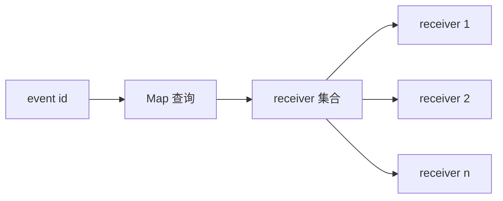
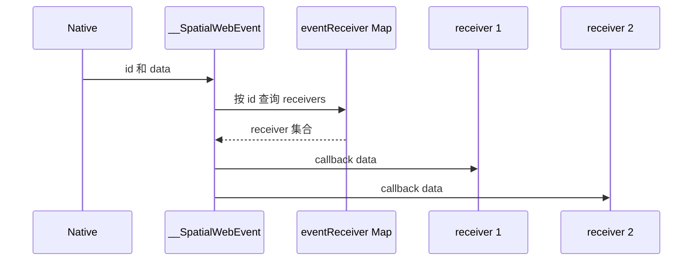

## Context

`SpatialWebEvent` 是 SDK 中把 native 事件载荷路由回 JavaScript 的共享桥接层。SDK 的多个部分会在共享 id 下注册监听器，例如场景对象 窗口级物理度量监听器以及一次性平台适配回调。当前分支已经把内部存储从每个 id 一个回调改成了每个 id 多个回调，因此需要在 OpenSpec 中明确注册 分发 和清理语义。

## Goals / Non-Goals

**Goals:**
- 允许同一个事件 id 把一次载荷扇出到多个已注册 receiver。
- 同时支持整组清理和单个 callback 精确移除。
- 在最后一个 receiver 被移除后清空内部存储项。
- 保持现有单 receiver 调用方的兼容性。

**Non-Goals:**
- 改变传递给 callback 的 payload 结构。
- 在底层集合语义之外引入额外的 receiver 顺序保证。
- 引入 receiver 优先级 一次性监听器 或通配订阅。
- 改变上层类中的事件冒泡行为。

## Decisions

### Decision: 用 Map 和 Set 存储 receiver

每个事件 id 不再映射到单个 callback，而是映射到一个 callback `Set`。

原因:
- `Map<string, Set<fn>>` 可以保持按 id 查询高效，同时对同一函数引用的重复注册天然幂等。
- 这与当前分支实现一致，也能避免后注册监听器覆盖先注册监听器。

备选方案:
- `Map<string, fn[]>`。否决原因是移除 callback 不够直接，也更容易意外积累重复项。

### Decision: 收到事件时向该 id 下所有 receiver 扇出分发

当 `window.__SpatialWebEvent` 收到 `{ id, data }` 载荷时，系统会读取该 id 当前的 receiver 集合，并把同一份 `data` 传给全部 callback。分发循环必须隔离单个 receiver 的异常，避免某个 callback 抛错后阻止其余 receiver 继续执行。

原因:
- 这是修复覆盖问题所需的最小行为变更，同时保持外部 API 不变。
- 像 `window` 这样的共享 id 现在可以被多个订阅者同时使用。
- 这样可以保证共享 id 的扇出语义稳定，不会因为某一个订阅者失败而饿死其他无关订阅者。

备选方案:
- 找到第一个处理方后立即停止。否决原因是当前分支实现明确是 fan-out，而不是独占消费。

### Decision: 保留两种清理路径

`removeEventReceiver(id, callback)` 只移除指定 callback。`removeEventReceiver(id)` 则会删除整个 id 项及其全部 callback。

原因:
- 仓库内已有调用点依赖整组清理来处理 destroy 流程和一次性请求生命周期。
- 可选 callback 形式可以为共享 id 提供精确移除能力，同时不破坏现有调用方。

备选方案:
- 强制所有调用都必须传 callback。否决原因是会破坏本仓库中的既有 destroy 路径。

### Decision: 空集合立即删除

在精确移除某个 callback 后，如果该 id 下的 receiver 集合已经为空，就立即从 `Map` 中删除该 id。

原因:
- 这样可以让注册表始终只反映活跃订阅。
- 也能避免在临时请求 id 或已销毁对象清理后残留空容器。

## Risks / Trade-offs

- Risk: 共享 id 现在可能触发比以前更多的 callback。Mitigation: 这是本 change 的目标语义，且公开 API 仍然是显式注册才会生效。
- Risk: 没有额外定义 callback 执行顺序保证。Mitigation: spec 只定义扇出和清理语义，不额外承诺顺序语义。
- Risk: 对共享 id 使用整组清理时，仍可能误删其他监听器。Mitigation: 文档中明确区分精确移除和整组清理，并把整组清理保留给生命周期只归属单对象的 id。

## Migration Plan

对 SDK 使用方不需要迁移。已有单监听器用法保持不变，而共享 id 的使用方现在可以独立注册。若回滚，只需恢复旧的单 callback 存储和之前的测试即可。

## Open Questions

当前分支没有剩余开放问题。公开 API 保持不变，而实现已经明确了预期的清理行为。