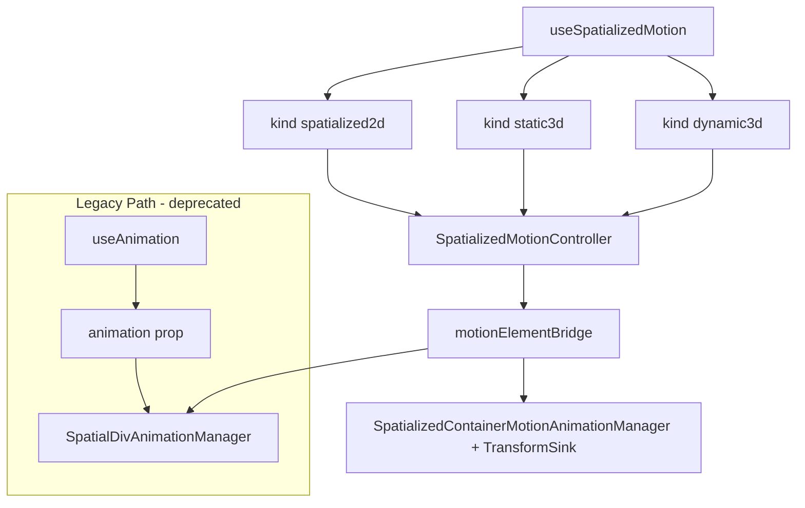

## Context

Three `SpatializedElement` subclasses share scene placement but use **different native write paths**. The timeline evaluator, session state machine, and Portal suppression logic are shared in TypeScript; native applies samples to `element.transform` (2D / Dynamic3D) or `modelTransform` (Static3D). Entity animation remains a **separate** stack (`useAnimation` + `EntityAnimationManager`).

This design unifies **author-facing** config (`SpatializedMotionConfig`, `SpatializedSegmentConfig`, `SpatializedPlaybackApi`) and routes by **`kind`** to one Core controller and one React hook.

## Design Evolution

### Plan A (Session Animation) — Foundations

Plan A established the architectural primitives:
- **Session state machine**: idle → queued → delaying → running → paused → finished/canceled
- **Portal suppression**: property-level for opacity, transform-wide for transform fields
- **Native playback model**: CADisplayLink-driven per-frame sampling on visionOS
- **Lifecycle contracts**: onStart/onComplete/onCancel/onError mutual exclusion
- **Segment interpolation**: single `from`/`to` with timing function

These remain normative in the unified system.

### Plan B (Motion Timeline) — Generalization

Plan B extended the architecture:
- **Timeline data model**: per-property tracks with absolute-time keyframes (inspired by Three.js AnimationClip)
- **Dual backend**: Web RAF when native unavailable, native timeline when in WebSpatial runtime
- **Style outlet**: `style` object for React state-driven rendering (decoupled from `animation` prop)
- **Multi-kind support**: policy-based routing for spatialized2d / static3d / dynamic3d

### Unified Architecture (this design)

The merge combines both into a single normative system with backward compatibility.

## Goals

- One timeline config shape across 2D / Static3D / Dynamic3D container kinds.
- **One** Core implementation: `SpatializedMotionController` (policy per `kind`) + `element.motion(config)` on each element class.
- **One** React entry: `useSpatializedMotion({ kind, … })` and `useSpatializedMotion.simple({ kind, … })`.
- Legacy `useAnimation` + `animation` prop retained as deprecated path for 2D.
- Umbrella spec with per-kind sub-specs; 2D remains the reference for Web RAF + suppression behavior.

## Architecture

## Core Modules

| Module | Role |
|--------|------|
| `SpatializedMotionController` | Single TS controller; `MOTION_KIND_POLICIES` selects capability token, Web RAF vs native-only, suppressed fields |
| `motionElementBridge` | Dispatches `animateSpatialDiv` vs `animateMotion` + listener cleanup |
| `element.motion(config)` | Factory on each `Spatialized*Element`; returns `SpatializedMotionController` with matching `kind` |
| `evaluateMotionTimeline` | Shared Web evaluator: per-track sampling, easing, lerp |
| `SpatialDivTimelineEvaluator` (Swift) | Native parity evaluator: per-track 90Hz sampling via CADisplayLink |
| `SpatializedMotionTransformSink` | Abstracts write path (elementTransform vs modelTransform) for Static3D/Dynamic3D |

## React Modules

| Module | Role |
|--------|------|
| `useSpatializedMotion` | Public hook (`kind` discriminant + `.simple`) |
| `useMotionController` + `createMotionBinding` + `createPlaybackApi` | Shared wiring |

## Shared Types (Core)

- `spatializedVisual.ts` — values + transform components
- `spatializedMotion.ts` — timeline, segment, playback API, play state, `SpatializedMotionKind`
- `spatializedPlayback.ts` — errors

## Integration Matrix

| Kind | React outlet | Binding prop | Native write path | Web RAF |
|------|--------------|--------------|-------------------|---------|
| 2D | `style` | `motion` on `enable-xr` node | `element.transform` + opacity + DOM | Yes |
| Static3D | _(none — native drives view)_ | `motion` on `<Model>` | `modelTransform` + opacity | No |
| Dynamic3D | _(none)_ | `motion` on `<Reality>` | `element.transform` + opacity | No |

## Legacy Compatibility

The Plan A path (`useAnimation` + `animation` prop) is retained as a thin compatibility layer:

1. `useAnimation(config)` for SpatialDiv continues to work unchanged.
2. Internally, simple configs MAY be compiled to the same native segment command.
3. The `animation` prop path does NOT use `SpatializedMotionController`; it retains its own session management.
4. New code SHOULD use `useSpatializedMotion.simple()` which provides the same single-segment experience.

## Portal Suppression (unified rules)

| Animated field | Suppression scope | Release trigger |
|----------------|-------------------|-----------------|
| `opacity` | Property-level: only `opacity` sync suppressed | Session terminal (finished/canceled) |
| Any `transform.*` | Transform-wide: entire `updateTransform(matrix)` suppressed | Session terminal |

Suppression applies to both legacy `animation` prop sessions and `motion` binding sessions.

## Native Timeline Evaluation

Native MUST sample each track independently at timeline time `t` (seconds, after `delay` and `playbackRate`), compose transform in fixed order (translate → rotate → scale), and produce results matching the Web evaluator within tolerance (±0.5 for translate px, ±0.01 for opacity/scale).

## Phased Delivery

See [tasks.md](./tasks.md). Summary:
- Phase 0–1: Umbrella spec + unified naming (completed)
- Phase 2: Static3D + Dynamic3D native timelines (completed)
- Phase 3: Core + React consolidation (completed)
- Phase 4: Entity timeline (deferred)
- Phase 5: Native consolidation (completed)
- Phase 6: Unified JSB + type rename (completed)
- Phase 7: Spec merge (this commit)
